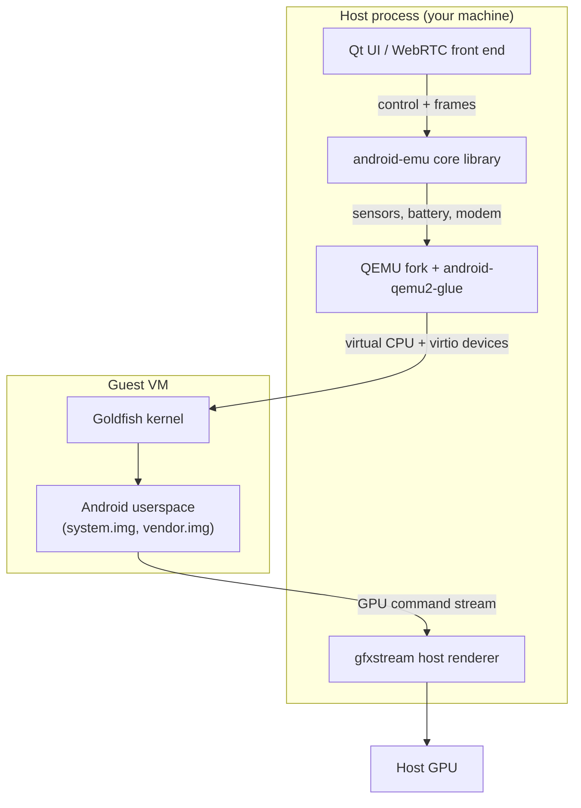
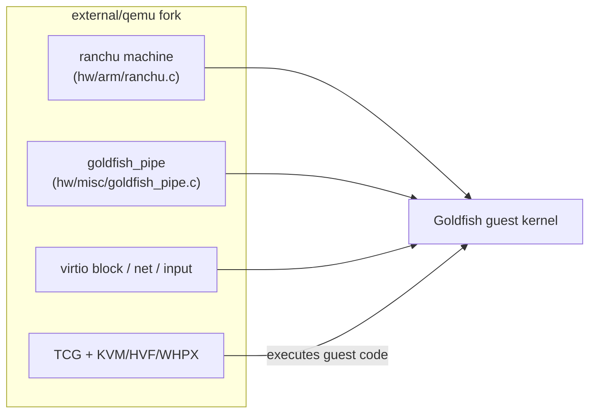
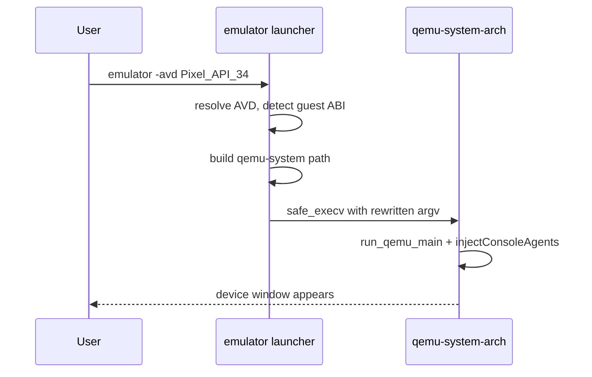
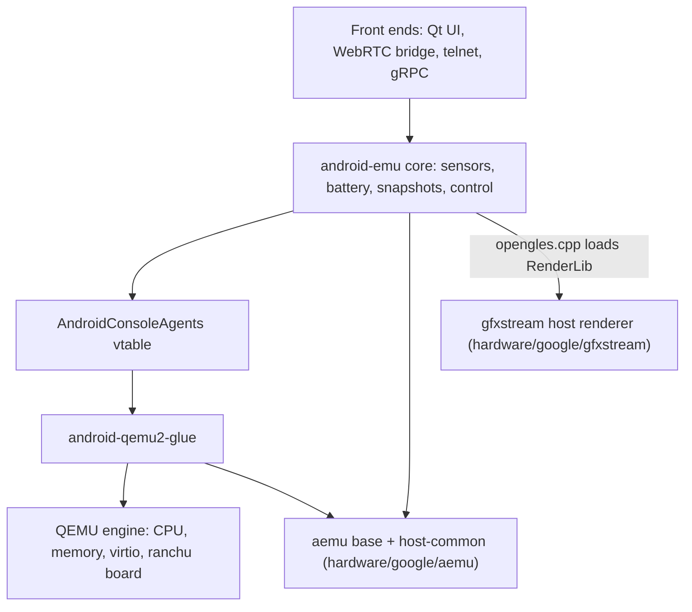
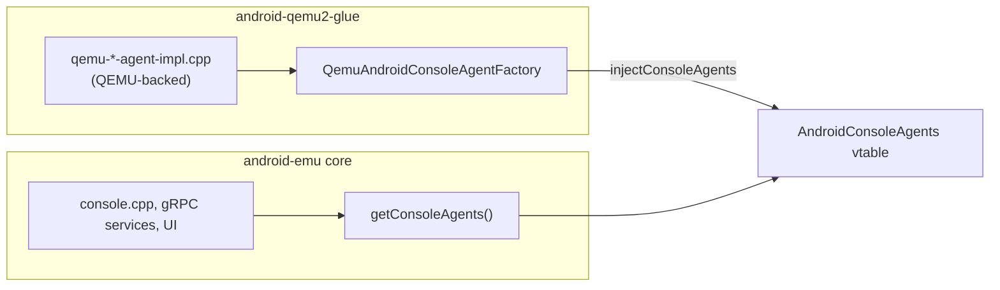
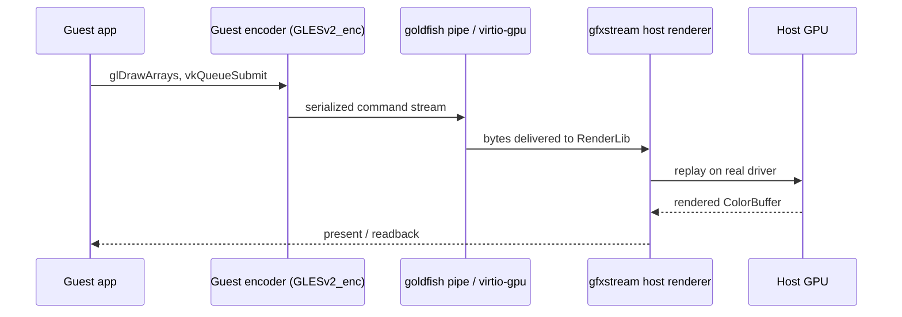
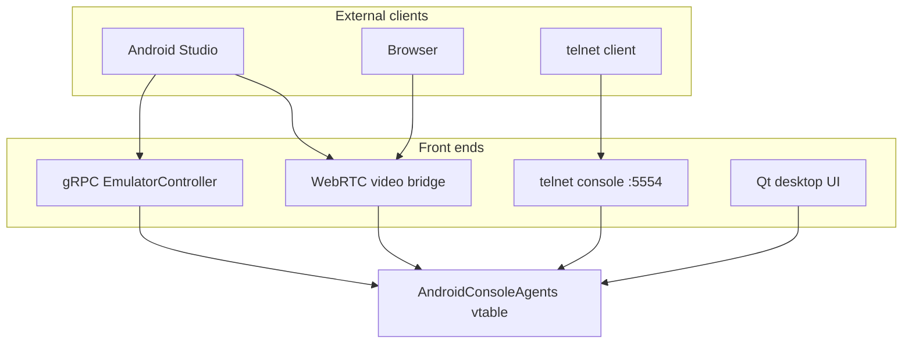
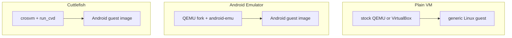

# Chapter 1: Introduction

The Android Emulator is one of the most-used pieces of software in the Android ecosystem, and one of the least understood. Most developers know it as the green-bordered phone window that pops up out of Android Studio, the thing they `adb install` an APK onto when they do not have a physical device handy. Underneath that window is a full virtual machine running an unmodified Android system image on a host CPU, plus a large host-side program that emulates every piece of hardware the guest expects to find, streams the guest's GPU commands back to the host's real GPU, and exposes a control plane so that tools like Android Studio can rotate the screen, set a fake GPS fix, or push an SMS into the modem.

This book takes the emulator apart layer by layer, always pointing back at the real source code. This first chapter draws the map: what the emulator is and is not, why it is built on a fork of QEMU rather than a stock VM, how the host process is split into layers (the QEMU machine and its Android glue, the `android-emu` core, the gfxstream graphics path, the gRPC and telnet control plane, and the Qt and WebRTC front ends), and how all of this differs from a plain virtual machine and from the crosvm-based Cuttlefish device. By the end you should be able to look at any chapter heading in the table of contents and know roughly which box in the architecture it lives in.

---

## 1.1 What the Emulator Is

The Android Emulator is a host application that boots a real Android system image inside a virtual machine and presents it to you as if it were a device. It is not a simulator in the iOS sense: there is no reimplementation of the Android framework in host code. The guest runs the same `system.img`, `vendor.img`, kernel, and ramdisk that ship to physical devices of the matching ABI. The framework, the runtime, `system_server`, the HALs, and the apps all execute inside the guest exactly as they would on hardware.

What makes it the *Android* Emulator rather than "QEMU running an OS" is the host-side machinery wrapped around the virtual CPU. The emulator ships its own fork of QEMU and links it against a large static library named `android-emu` (historically "AndroidEmu") that supplies everything Android-specific: virtual sensors, a battery model, a fake modem, a camera bridge, a snapshot engine, a control console, and the plumbing that connects a host GPU to the guest's graphics stack.

The original design document in the fork describes this split directly. The codebase is built from a QEMU engine plus a standalone library plus a thin "glue" between them.

```
// Source: external/qemu/android/docs/ANDROID-EMULATION-LIBRARY.TXT
 ____________     ____________     _________        ____________________
|            |   |            |   |         |      |                    |
| AndroidEmu | + | QEMU2 Glue | + |  QEMU2  |  ==  |   QEMU2 emulator   |
|____________|   |____________|   |_________|      |____________________|
```

The stated goal of that library is to be "a standalone component that comes with its own set of unit-tests" and to provide "a UI layer decoupled from the underlying emulation engine." That decoupling is the single most important architectural idea in the whole tree, and the rest of this chapter is largely an elaboration of it.

### 1.1.1 What It Is Not

Three clarifications keep readers from chasing the wrong mental model.

1. It is not a reimplementation of Android. There is no "emulated framework" — the guest is a stock Android build, and the host never pretends to be `system_server`.
2. It is not stock QEMU. The fork under `external/qemu` carries Android-specific virtual devices, a custom machine board, a pipe transport, and the glue that links the QEMU sysemu against `android-emu`. You cannot swap in upstream `qemu-system-x86_64` and get an Android Emulator.
3. It is not Cuttlefish. Cuttlefish is a separate virtual device, built on crosvm rather than QEMU, that lives under `device/google/cuttlefish`. The two share concepts (gfxstream graphics, virtio devices) but almost no host code. Section 1.8 contrasts them.

### 1.1.2 Host Process Versus Guest System Image

The cleanest line to draw in the whole system is between the host process and the guest. The host process is the native binary that runs on your laptop or build machine — Linux, macOS, or Windows — compiled from the C++ in `external/qemu` and the libraries in `hardware/google/aemu` and `hardware/google/gfxstream`. The guest is the Android image: a Linux kernel plus Android userspace, compiled for an emulator-specific board and running inside the virtual CPU that the host process provides.

Host process and guest system



The guest talks to the host across a small number of well-defined transports: virtio devices, a fast shared-memory pipe (`/dev/goldfish_pipe`, described in `external/qemu/android/docs/ANDROID-QEMU-PIPE.TXT`), and an ADB connection. Everything you do from the host — rotating the device, dropping a GPS fix, hanging up a call — is the host side of one of those transports being poked by a control agent.

## 1.2 Why It Forks QEMU

QEMU is a mature, portable machine emulator with binary translation (TCG) for cross-architecture guests and hypervisor backends (KVM on Linux, Hypervisor.framework on macOS, WHPX on Windows) for same-architecture guests. The emulator wants all of that. What QEMU does not provide out of the box is an Android device: a board with the right set of virtual peripherals, a transport for the Android-specific control surface, and the hooks needed to stream a GPU.

The fork lives at `external/qemu` and is described in the design doc as a QEMU 2.x base, "very lightly patched" at the engine level but extended heavily with new code that does not touch QEMU internals. The Android-specific virtual board is the "ranchu" machine — for ARM it is defined in `external/qemu/hw/arm/ranchu.c`, which advertises itself to the guest with `compatible = "ranchu"` in the device tree and inherits its peripherals from the older 32-bit "goldfish" board.

The ranchu board and the goldfish device family



Forking, rather than carrying patches against upstream as an out-of-tree set, lets the team add whole new device files (`hw/misc/goldfish_pipe.c`) and a custom machine board without fighting the upstream review process, and lets them link the QEMU sysemu directly against the `android-emu` static library — something upstream QEMU has no reason to support. The cost is the eternal one of any fork: rebasing onto newer QEMU is expensive, which is exactly why the engine is kept "lightly patched" and the Android logic is pushed out into `android-emu` and the glue. Chapter 4 walks through what the fork changes and what it leaves alone.

## 1.3 The Two-Binary Model: Launcher and Engine

When you type `emulator` you are not running QEMU directly. You are running a tiny launcher whose only job is to figure out which AVD you mean, work out the guest ABI, and then `exec` the correct architecture-specific QEMU binary. The launcher source is `external/qemu/android/emulator/main-emulator.cpp`; its own comment calls it "the tiny 'emulator' launcher program that is in charge of starting the target-specific emulator binary for a given AVD."

The launcher builds the path to the engine binary from the host OS, the host CPU, and the guest QEMU architecture.

```cpp
// Source: external/qemu/android/emulator/main-emulator.cpp
#define QEMU_BINARY_PATTERN_HEADLESS "qemu-system-%s-headless%s"
#define QEMU_BINARY_PATTERN "qemu-system-%s%s"
```

It assembles something like `qemu/linux-x86_64/qemu-system-x86_64` and then hands control over with `safe_execv(emulatorPath, argv)`. From that point on, the process *is* the engine binary: the QEMU `main`, the glue, and `android-emu` all in one address space.

Launcher to engine handoff



Inside the engine binary the entry path runs through the glue's `main.cpp`, which eventually calls `run_qemu_main` to start the QEMU machine and main loop (`external/qemu/android-qemu2-glue/main.cpp`, around the `enter_qemu_main_loop` helper). Chapter 3 follows a launch end to end; Chapter 2 explains how all of these binaries get built in the first place.

## 1.4 The Host-Side Layers

The single biggest payoff from reading the source is realizing that the host process is not a monolith. It is a stack of layers with deliberately narrow interfaces between them, and almost every chapter of this book is about one layer.

The host process layer cake



The layers, from the engine up, are these.

1. The QEMU engine plus `android-qemu2-glue` — the virtual CPU, memory, virtio devices, and the board, wired to Android logic by the glue under `external/qemu/android-qemu2-glue`.
2. The `android-emu` core — the Android-specific feature library under `external/qemu/android/android-emu` and `external/qemu/android/emu`, sitting on the lower-level `aemu` base library in `hardware/google/aemu`.
3. The gfxstream graphics path — the guest-to-host GPU command stream and the host renderer in `hardware/google/gfxstream`, reached from the core through `external/qemu/android/android-emu/android/opengles.cpp`.
4. The control plane — the telnet console and the gRPC services under `external/qemu/android/android-grpc`, which expose the core's capabilities to external tools.
5. The front ends — the Qt desktop UI under `external/qemu/android/android-ui` and the WebRTC video bridge under `external/qemu/android/android-webrtc`.

The next sections look at each of these in turn.

### 1.4.1 QEMU Plus the Glue

The glue is the seam between two codebases that know almost nothing about each other. QEMU knows about CPUs, memory regions, and virtio queues; it does not know what a "battery agent" is. `android-emu` knows about batteries and sensors; it does not know how QEMU stores guest memory. The glue layer, under `external/qemu/android-qemu2-glue`, implements the Android-side interfaces in terms of QEMU primitives. Files like `qemu-battery-agent-impl.cpp`, `qemu-sensors-agent-impl.cpp`, and `qemu-vm-operations-impl.cpp` are each one concrete implementation of an abstract agent that `android-emu` defines but never implements itself.

### 1.4.2 The android-emu Core

`android-emu` is the heart of the Android-specific behavior. The original design doc lists its goals as decoupling Android features from any QEMU internals and making them independently unit-testable. In the current tree the code is split between `external/qemu/android/android-emu/android` (the large legacy surface — `console.cpp`, `hw-sensors.cpp`, `snapshot`, `automation`, `physics`, the camera and recording subsystems) and a newer modular `external/qemu/android/emu` tree organized by feature.

Below it sits `aemu`, the utility library in `hardware/google/aemu`. Its own README is blunt about its scope: "an utility library for common functions used in the Android Emulator. External projects (gfxstream, QEMU) may use to perform C++ functions." It supplies the base primitives — threads, loopers, path utilities, the `AndroidPipe` machinery in `hardware/google/aemu/host-common/AndroidPipe.cpp` — that both `android-emu` and gfxstream build on.

## 1.5 The Agent Vtable: How Layers Talk Without Coupling

If you read only one interface in the whole emulator, read this one. The decoupling that the design doc promises is made concrete by a single struct of function-pointer tables called `AndroidConsoleAgents`, defined in `external/qemu/android/emu/agents/include/android/console.h`. Each field is a pointer to an agent interface — battery, sensors, telephony, display, vm operations, and so on — and the list is generated from one X-macro.

```cpp
// Source: external/qemu/android/emu/agents/include/android/console.h
#define ANDROID_CONSOLE_AGENTS_LIST(X)          \
    X(QAndroidAutomationAgent, automation)      \
    X(QAndroidBatteryAgent, battery)            \
    X(QAndroidSensorsAgent, sensors)            \
    X(QAndroidTelephonyAgent, telephony)        \
    X(QAndroidVmOperations, vm)                 \
    ...
```

The core code never constructs these agents. It calls `getConsoleAgents()` and uses whatever implementation it is handed. The implementations are *injected* at startup. The factory in `external/qemu/android/emu/agents/src/android/emulation/control/AndroidAgentFactory.cpp` stores a single static `AndroidConsoleAgents` and fills it in `injectConsoleAgents`, and the QEMU2 glue provides the concrete factory in `external/qemu/android-qemu2-glue/qemu-console-factory.cpp`:

```cpp
// Source: external/qemu/android-qemu2-glue/qemu-console-factory.cpp
void injectQemuConsoleAgents(const char* factory) {
    injectConsoleAgents(QemuAndroidConsoleAgentFactory());
    ...
}
```

Agent injection wiring



This is why the same `android-emu` library can be linked into the full QEMU emulator, into a logging-only debug build (`AndroidLoggingConsoleFactory`, also injected in that file), and into unit tests with fake agents. The core asks for a battery agent; whoever started the process decides what a battery means. Chapter 7 dissects this pattern in detail, and Chapter 8 shows how the gRPC and console control planes sit on top of it.

## 1.6 The Graphics Path

Graphics is the most performance-sensitive subsystem and gets its own part of the book. The guest does not have a real GPU. Instead, the guest's OpenGL ES and Vulkan calls are captured, serialized into a command stream, and shipped across a pipe to the host, where a renderer replays them against the host's real GPU and ships frames back. This streaming renderer is gfxstream, in `hardware/google/gfxstream`, and its README describes it as "a collection of code generators and libraries for streaming rendering APIs from one place to another," explicitly including "from a virtual machine guest to host for virtualized graphics."

The split is clean. The guest-side encoders live under `hardware/google/gfxstream/guest` (the `GLESv2_enc`, `renderControl_enc`, and `OpenglSystemCommon` directories). The host-side renderer lives under `hardware/google/gfxstream/host` (`frame_buffer.cpp`, `color_buffer.cpp`, the GL and Vulkan backends). The emulator core reaches the host renderer through `external/qemu/android/android-emu/android/opengles.cpp`, which loads gfxstream's `RenderLib` and configures it with the chosen renderer:

```cpp
// Source: external/qemu/android/android-emu/android/opengles.cpp
static gfxstream::RenderLibPtr sRenderLib = nullptr;
...
sRenderLib->setRenderer(emuglConfig_get_current_renderer());
```

The gfxstream guest-to-host graphics stream



Chapters 11 through 14 cover this end to end: the overall architecture, the guest drivers, the host renderer (`FrameBuffer`, color buffers, the compositor), and the wire protocol itself.

## 1.7 The Control Plane and Front Ends

A device you cannot interact with is not useful. The emulator exposes two complementary control surfaces and two display front ends.

The telnet console is the oldest. As `console.cpp` notes, "this console is enabled automatically at emulator startup, on port 5554 by default." Connecting with `telnet localhost 5554` gives you a command shell that can rotate the screen, set the battery level, send an SMS, or trigger a snapshot — each command ultimately calling through the agent vtable from Section 1.5.

The modern surface is gRPC. The services under `external/qemu/android/android-grpc` define a typed API (`EmulatorController` and friends, implemented in `external/qemu/android/android-grpc/services/emulator-controller/server/src/android/emulation/control/EmulatorService.cpp`) that Android Studio and the embedded emulator use for everything from input injection to screen streaming.

On the display side there are two front ends. The Qt desktop UI lives under `external/qemu/android/android-ui` (the `aemu-ui-qt` module and the `fishtank` app), and it is the classic green-bordered window with the side toolbar. The WebRTC path lets the emulator stream into a browser or into Android Studio's tool window; because the WebRTC libraries from Chrome are incompatible with the emulator build, the video bridge is a *separate* executable that talks to the emulator over a socket and shared memory, as the README in `external/qemu/android/android-webrtc` spells out.

Control plane and front ends over the agent vtable



The Qt UI is Chapter 22; WebRTC and the embedded emulator are Chapter 23; the console and gRPC control plane are Chapter 8.

## 1.8 How This Differs From a Plain VM and From Cuttlefish

It helps to place the emulator between two reference points: a generic virtual machine, and Cuttlefish.

A plain VM (think a Linux guest under stock QEMU/KVM or VirtualBox) gives you a virtual CPU, some virtio devices, and a framebuffer. It has no concept of a battery, a cellular modem, accelerometer data, or a fake GPS fix, and it has no GPU-streaming layer that hands guest GL calls to your host GPU. The Android Emulator adds exactly those things: the `android-emu` feature library, the agent vtable, the gfxstream graphics path, and the Android control plane. That is the difference between "a Linux box in a window" and "a phone in a window."

Cuttlefish is the other reference point. It is also a real Android image in a VM, but it is engineered for a different audience — Google's own Android platform and CI testing on Linux servers — and it is built on a different virtual machine monitor. Cuttlefish runs on crosvm (referenced throughout `device/google/cuttlefish/host`), is orchestrated by host commands like `assemble_cvd` and `run_cvd` under `device/google/cuttlefish/host/commands`, and targets `vsoc_*` device configs. It shares the *idea* of gfxstream graphics and virtio devices with the emulator, but its host code is almost entirely separate from `external/qemu`.

Emulator versus plain VM versus Cuttlefish



The contrast matters because the two products are often confused. If you are an app developer, you almost certainly use the Android Emulator. If you are a platform engineer running tests in a data center, you probably use Cuttlefish. Chapter 26 dedicates itself to Cuttlefish and crosvm so the comparison is grounded rather than hand-waved.

## 1.9 A Map of This Book

The book is organized bottom to top: each part builds on the layer below it, mirroring the layer cake from Section 1.4. Here is how the parts map onto the architecture you have just met.

1. Part I — Getting Started: what the emulator is (this chapter), how the source is laid out and built (Chapter 2), and how to run it (Chapter 3).
2. Part II — QEMU and Virtualization: the QEMU fork (Chapter 4), CPU acceleration with KVM, Hypervisor.framework, WHPX, and TCG (Chapter 5), and the virtio and goldfish virtual hardware (Chapter 6).
3. Part III — Core Emulation: the `android-emu` architecture and the agent vtable (Chapter 7), the console and gRPC control plane (Chapter 8), snapshots and Quickboot (Chapter 9), and sensors, battery, and location (Chapter 10).
4. Part IV — Graphics: the graphics architecture (Chapter 11), guest GPU drivers (Chapter 12), host rendering (Chapter 13), and the gfxstream protocol (Chapter 14).
5. Parts V through VII — Media and Display, Connectivity, and UI and Streaming: audio, camera, multi-display, networking, Bluetooth, ADB, telephony, the Qt UI, and WebRTC.
6. Parts VIII through X — Guest Integration, Cuttlefish, and Infrastructure: system images and the goldfish HAL, guest boot, Cuttlefish and crosvm, and finally testing, debugging, and tracing.

If at any point you lose the thread of *which layer am I in*, come back to the layer-cake diagram in Section 1.4. Every chapter is one box in it.

## 1.10 Try It

You can confirm the architecture described in this chapter on your own machine.

1. Find the engine binaries the launcher execs. From an SDK install, list the QEMU directory: `ls emulator/qemu/` will show per-host directories like `linux-x86_64`, each containing `qemu-system-x86_64` and friends — the engine binaries from Section 1.3.

2. Watch the launcher hand off to the engine. Run `emulator -avd <name> -verbose 2>&1 | head -40` and look for the resolved AVD, the chosen ABI, and the full command line the launcher builds before it execs the engine.

3. Talk to the control plane. With an emulator running, connect to the telnet console: `telnet localhost 5554`, then type `help`. Each command you see (`rotate`, `power`, `sms send`, `gps fix`) calls through the agent vtable from Section 1.5.

4. See the gRPC surface. Run `adb devices` to confirm the guest is reachable, then inspect the running emulator's advertised ports — the gRPC `EmulatorController` is what Android Studio's device streaming uses, defined under `external/qemu/android/android-grpc/services/emulator-controller`.

5. Browse the source split. In a checkout, compare `ls external/qemu/android/android-emu/android` (the core feature surface), `ls external/qemu/android-qemu2-glue` (the QEMU-backed agent implementations), and `ls hardware/google/gfxstream/host` (the graphics renderer). The directory names line up with the layers in Section 1.4.

## Summary

- The Android Emulator boots a real, unmodified Android system image inside a forked QEMU virtual machine; it is not a framework reimplementation, not stock QEMU, and not Cuttlefish.
- The host process is split into layers: the QEMU engine plus `android-qemu2-glue`, the `android-emu` core on top of the `aemu` base library, the gfxstream graphics path, the gRPC and telnet control plane, and the Qt and WebRTC front ends.
- The decoupling between layers is made concrete by the `AndroidConsoleAgents` vtable in `external/qemu/android/emu/agents/include/android/console.h`: the core calls `getConsoleAgents()`, and the glue injects QEMU-backed implementations at startup.
- The emulator forks QEMU to add an Android-specific board ("ranchu"), a fast guest-host pipe (`goldfish_pipe`), and the linkage against `android-emu`, while keeping the QEMU engine itself lightly patched.
- A tiny launcher (`main-emulator.cpp`) resolves the AVD and `exec`s the architecture-specific `qemu-system-*` engine binary, which then runs the QEMU main loop and the injected agents in one address space.
- Graphics are virtualized by gfxstream: the guest serializes GL/Vulkan calls into a command stream that the host renderer replays on the real GPU.
- Compared to a plain VM, the emulator adds Android-specific hardware emulation, GPU streaming, and a control plane; compared to Cuttlefish, it uses a different VMM (forked QEMU versus crosvm) and an almost entirely separate host codebase.

### Key Source Files

| File | Purpose |
|------|---------|
| `external/qemu/android/docs/ANDROID-EMULATION-LIBRARY.TXT` | Design doc describing the AndroidEmu + glue + QEMU split |
| `external/qemu/android/emulator/main-emulator.cpp` | The launcher that execs the architecture-specific engine binary |
| `external/qemu/android-qemu2-glue/main.cpp` | Engine entry path into `run_qemu_main` and the QEMU main loop |
| `external/qemu/android/emu/agents/include/android/console.h` | Defines the `AndroidConsoleAgents` vtable and the agent list macro |
| `external/qemu/android/emu/agents/src/android/emulation/control/AndroidAgentFactory.cpp` | Stores and injects the console agents |
| `external/qemu/android-qemu2-glue/qemu-console-factory.cpp` | Injects the QEMU-backed agent implementations |
| `external/qemu/hw/arm/ranchu.c` | The Android-specific "ranchu" virtual board |
| `external/qemu/hw/misc/goldfish_pipe.c` | The fast guest-host pipe device |
| `external/qemu/android/android-emu/android/console.cpp` | The telnet control console |
| `external/qemu/android/android-emu/android/opengles.cpp` | Loads the gfxstream `RenderLib` host renderer |
| `hardware/google/aemu/README.md` | The `aemu` base utility library used by android-emu and gfxstream |
| `hardware/google/gfxstream/README.md` | The streaming graphics renderer (host and guest) |
| `device/google/cuttlefish/README.md` | The crosvm-based Cuttlefish device, contrasted in Section 1.8 |
