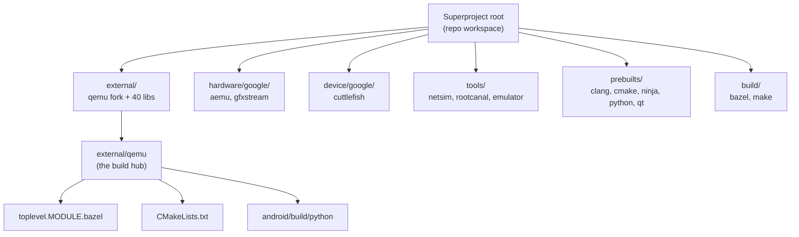
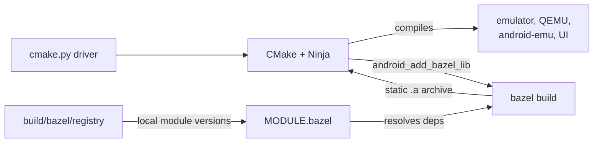
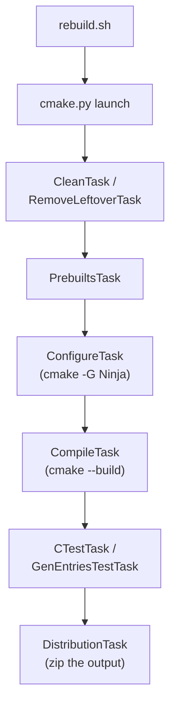
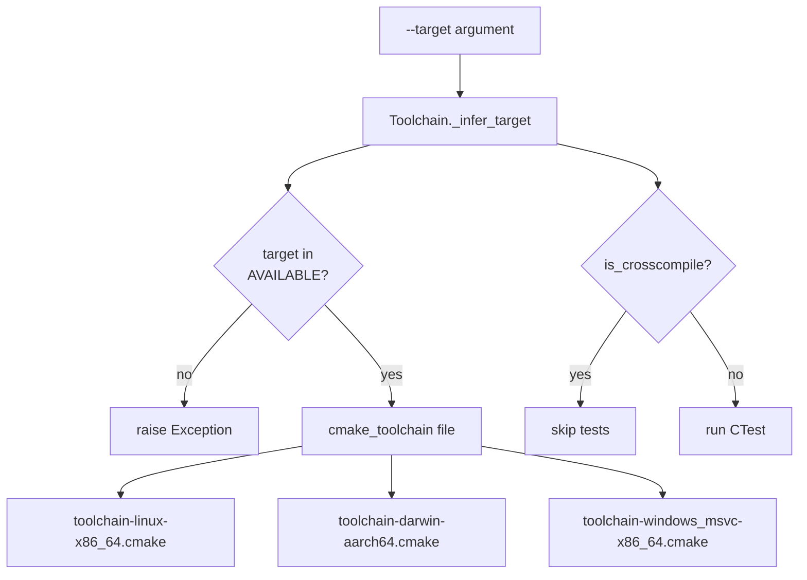
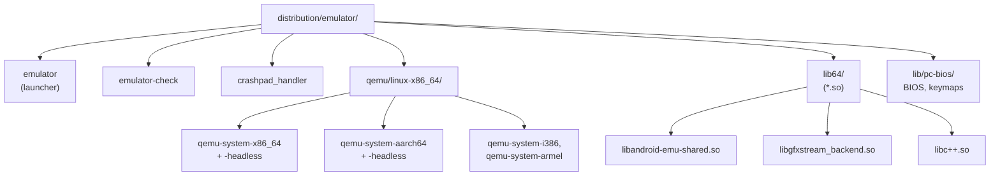

# Chapter 2: Source Code and Build System

The Android Emulator is not a single Git repository. It is a *superproject*: a tree of around sixty independent repositories stitched together by Google's `repo` tool, with a forked copy of upstream QEMU at its center and a constellation of third-party libraries (gRPC, protobuf, Qt, ANGLE, Mesa, libusb, glib) checked out alongside it. On top of that source tree sit two build systems that coexist by design — a large CMake project that compiles the emulator and all of QEMU, and a Bazel module graph that resolves and builds the external C/C++/Rust dependencies. A thin layer of Python orchestrates both.

This chapter walks the layout from the outside in: how `repo` materializes the tree, what the manifest pins, how `MODULE.bazel` and `CMakeLists.txt` divide the work, how the `android/build` Python tooling drives a configure-compile-test-package pipeline, which prebuilt toolchains do the compiling, and finally what binaries and shared libraries land in the distribution directory. Every claim here is anchored to a file you can open in the checkout.

---

## 2.1 The repo Superproject

The emulator source is assembled by `repo`, the same multi-repository tool used by AOSP. After `repo init` and `repo sync`, the top of the tree contains a hidden `.repo/` directory and a set of top-level project directories: `external/`, `hardware/`, `device/`, `tools/`, `prebuilts/`, `build/`, and `third_party/`.

The active manifest is a thin wrapper that pulls in the real one:

```xml
<!-- Source: .repo/manifest.xml -->
<manifest>
  <include name="default.xml" />
</manifest>
```

`default.xml` is the actual list of projects. It declares a single remote, a default branch, and one `<project>` element per repository, mapping a remote Git name to a local checkout path:

```xml
<!-- Source: .repo/manifests/default.xml -->
<remote  name="aosp"
         fetch=".."
         review="https://android-review.googlesource.com/" />
<default revision="<emulator-dev-branch>"
         remote="aosp"
         sync-j="4" />

<project path="external/qemu" name="platform/external/qemu">
  <copyfile src="android/vscode/emu.code-workspace" dest="emu.code-workspace"/>
  <linkfile src="toplevel.MODULE.bazel" dest="MODULE.bazel"/>
  <linkfile src="toplevel.MODULE.bazel.lock" dest="MODULE.bazel.lock"/>
</project>
```

The default `revision` points at the emulator's main development branch — distinct from any single Android platform release. The full list of synced paths is recorded in `.repo/project.list`; on this checkout it holds 66 entries.

### 2.1.1 copyfile and linkfile: how the root gets its build files

Notice the `<linkfile>` and `<copyfile>` directives inside the `external/qemu` project. `repo` runs these *after* sync. They are the reason the superproject root has a `MODULE.bazel` at all: the file does not exist there as a checked-in file, it is a symlink that `repo` creates pointing into the QEMU project:

```
MODULE.bazel       -> external/qemu/toplevel.MODULE.bazel
MODULE.bazel.lock  -> external/qemu/toplevel.MODULE.bazel.lock
emu.code-workspace -> (copied from external/qemu/android/vscode/emu.code-workspace)
```

The `build/bazel` project does the same trick for the Bazel runtime configuration, linking `toplevel.bazelrc` to `.bazelrc` and `toplevel.bazelversion` to `.bazelversion` at the root. The effect is that the build entry points live *inside* their owning sub-repository (so they version together with the code that uses them) while still being visible at the workspace root where Bazel and the IDE expect them.

### 2.1.2 Groups, clone-depth, and platform projects

Many `<project>` entries carry attributes that tune what gets synced. `clone-depth="1"` requests a shallow clone — used heavily for the large `prebuilts/` repositories where history is irrelevant. The `groups` attribute scopes a project to a host platform, for example:

```xml
<!-- Source: .repo/manifests/default.xml -->
<project path="prebuilts/clang/host/linux-x86"
         name="platform/prebuilts/clang/host/linux-x86"
         clone-depth="1" groups="notdefault,platform-linux"/>
<project path="prebuilts/clang/host/darwin-x86"
         name="platform/prebuilts/clang/host/darwin-x86"
         clone-depth="1" groups="notdefault,platform-darwin"/>
```

A Linux developer never fetches the Darwin or Windows toolchains, because those projects are in `notdefault` groups and are only pulled when their `platform-*` group is requested.

### Top-level project directories

The diagram below maps the major directories under the superproject root to what they hold.



---

## 2.2 external/qemu: The Build Hub

Although the tree has many repositories, one of them is special: `external/qemu` is where the whole build is rooted. It holds the top-level `CMakeLists.txt`, the `toplevel.MODULE.bazel` that the root symlink points at, the `android/build/` tooling, and the developer-facing entry scripts.

The forked QEMU itself lives here too. The checked-out branch is the emulator development line, and `external/qemu/source.properties` records the SDK package revision that the build stamps into the binaries:

```ini
# Source: external/qemu/source.properties
Pkg.UserSrc=false
Pkg.Revision=37.1.4
Pkg.Path=emulator
Pkg.Desc=Android Emulator
```

The `Pkg.Revision` value is read at configure time and passed to CMake as `OPTION_SDK_TOOLS_REVISION` (see Section 2.5), so the version a user sees from `emulator -version` traces directly back to this file.

### 2.2.1 Two entry scripts: configure.sh and rebuild.sh

There are two shell scripts at the top of `external/qemu/android/` that developers invoke. They do very little themselves — each immediately delegates to Python or to a helper script.

`rebuild.sh` finds the prebuilt Python interpreter and hands control to the Python build driver:

```bash
# Source: external/qemu/android/rebuild.sh
PYTHON=$(aosp_find_python)
$PYTHON $PROGDIR/build/python/cmake.py --ccache auto "$@"
```

`configure.sh` is a one-liner that forwards to a CMake configuration helper:

```bash
# Source: external/qemu/android/configure.sh
${PROGDIR}/scripts/config-cmake.sh "$@"
```

In practice `rebuild.sh` is the script most builds use, because the Python driver runs configure, compile, test, and packaging in one shot. The next sections follow that path.

---

## 2.3 Two Build Systems, One Tree

A surprising property of this codebase is that it carries two complete build systems that are not competitors but collaborators. Counting the files makes the division obvious: `external/qemu` contains 214 `CMakeLists.txt` files but only one `BUILD.bazel` file. CMake is the system that compiles the emulator and QEMU; Bazel is primarily a *dependency manager* and a builder for a handful of external libraries.

The split is roughly:

1. **CMake** compiles the emulator launcher, all of forked QEMU, the `android-emu` core libraries, the UI, and the graphics stack — the code the emulator team owns and modifies.
2. **Bazel** resolves the external module graph declared in `MODULE.bazel` (gRPC, protobuf, abseil, glib, boringssl, and so on) from a local registry, and builds a few libraries that CMake then imports as static archives.
3. A **legacy GNU Make** system still exists under `external/qemu/android/build/` (the `Makefile.top.mk` and `Makefile.common.mk` files), inherited from the NDK-style build, but the modern path is CMake plus Ninja.

### 2.3.1 How Bazel libraries flow into the CMake build

The bridge between the two systems is `android/build/cmake/bazel.cmake`. The CMake function `android_add_bazel_lib` shells out to the prebuilt `bazel` binary, queries the path of the static archive a Bazel target produces, registers a custom command to build it, and wraps the result as an `IMPORTED` CMake library:

```cmake
# Source: external/qemu/android/build/cmake/bazel.cmake
execute_process(
  COMMAND ${BAZEL_BIN} cquery --output=files --output_groups=archive
          "${bazel_BAZEL}"
  WORKING_DIRECTORY ${AOSP}
  OUTPUT_VARIABLE BAZEL_TGT ...)

add_custom_command(
  OUTPUT "${AOSP}/${BAZEL_TGT}"
  COMMAND ${BAZEL_BIN} build "${bazel_BAZEL}"
  ...)
add_library(${bazel_TARGET} STATIC IMPORTED GLOBAL)
```

This is invoked from `android_add_library` in `android/build/cmake/android.cmake`: when a library declaration carries a `BAZEL` argument and the host is Linux x86_64 or any macOS (x86_64 or aarch64), CMake routes the build to Bazel instead of compiling the sources itself. The Bazel path is explicitly disabled for Windows MSVC and Linux aarch64 — those targets compile everything through CMake.

### Build system collaboration



---

## 2.4 MODULE.bazel and the Dependency Graph

`MODULE.bazel` at the root is the symlink to `external/qemu/toplevel.MODULE.bazel`. It declares the module identity and the external dependencies using Bazel's bzlmod system:

```python
# Source: external/qemu/toplevel.MODULE.bazel
module(
    name = "android_emulator",
    version = "0.0.1",
)

include("//build/bazel/toolchains:toolchain.MODULE.bazel")

bazel_dep(name = "lz4", version = "1.9.4")
bazel_dep(name = "zlib", version = "1.3.1.bcr.5")
bazel_dep(name = "protobuf", version = "32.1")
bazel_dep(name = "boringssl", version = "0.20250415.0")
bazel_dep(name = "grpc", version = "1.74.1")
bazel_dep(name = "abseil-cpp", version = "20250512.1")
bazel_dep(name = "glib", version = "2.82.2.bcr.5")
```

Three mechanisms are worth understanding in this file.

First, **`bazel_dep`** pins an external module to an exact version. These versions are not fetched from the public Bazel Central Registry — they are resolved against a *local* registry checked into `build/bazel/registry/modules/`, which contains pinned definitions for `qemu`, `gfxstream`, `crosvm`, `ffmpeg`, `pixman`, `glib`, and dozens more. That registry is how the build stays hermetic and reproducible without network access to upstream registries.

Second, **`single_version_override`** applies in-tree patches to a dependency. gRPC and glib are both patched this way:

```python
# Source: external/qemu/toplevel.MODULE.bazel
single_version_override(
    module_name = "grpc",
    patch_strip = 1,
    patches = [
        "//build/bazel/patch:grpc-no-macos-universal-binary.patch",
        "//build/bazel/patch:grpc_remove_upb-gen.patch",
    ],
)
```

Third, **`local_path_override`** points a module name at a directory inside the superproject rather than the registry. This is how first-party-but-separately-versioned components — `aemu`, the Qt prebuilt, and `gfxstream` — are wired in:

```python
# Source: external/qemu/toplevel.MODULE.bazel
bazel_dep(name = "aemu", version = "0.0.1")
local_path_override(
    module_name = "aemu",
    path = "hardware/google/aemu",
)

bazel_dep(name = "gfxstream", version = "0.0.1")
local_path_override(
    module_name = "gfxstream",
    path = "hardware/google/gfxstream",
)
```

### 2.4.1 The toolchain module

The very first thing `MODULE.bazel` does after declaring itself is `include("//build/bazel/toolchains:toolchain.MODULE.bazel")`. That included file declares the rule sets (rules_cc, rules_rust, rules_python, rules_go, rules_java, rules_kotlin), pins the Bazel-side compiler versions, and registers the custom Goldfish toolchain:

```python
# Source: build/bazel/toolchains/toolchain.MODULE.bazel
TOOL_VERSIONS = {
    "clang": "clang-r563880c",
    "rust": "1.91.1",
}

bazel_dep(name = "goldfish_build", version = "0.0.3")
bazel_dep(name = "rules_rust", version = "0.68.1.aemu")
bazel_dep(name = "rules_go", version = "0.60.0")
```

Those `TOOL_VERSIONS` are mirrored in `build/bazel/toolchains/tool_versions.json`, the file the custom toolchain extension reads. The Bazel build is pinned to a specific Bazel release as well: `build/bazel/toplevel.bazelversion` contains `9.0.0`.

---

## 2.5 The Python Build Driver

`rebuild.sh` hands off to `android/build/python/cmake.py`, which is a two-line stub that calls into the `aemu` package:

```python
# Source: external/qemu/android/build/python/cmake.py
from aemu import cmake

if __name__ == "__main__":
    cmake.launch()
```

The real logic is in `android/build/python/aemu/cmake.py`. It parses command-line arguments — target platform, build configuration, crash-upload server, distribution directory, feature flags — and then builds an ordered list of *tasks*.

### 2.5.1 The task model

The build is modelled as a flat list of `BuildTask` objects, each of which can be individually enabled or disabled. The base class is deliberately minimal:

```python
# Source: external/qemu/android/build/python/aemu/tasks/build_task.py
class BuildTask:
    def __init__(self):
        self.enabled = True
        self.name = self.__class__.__name__[:-4]

    def run(self) -> None:
        """Runs the task if it is enabled."""
        if self.enabled:
            logging.info("Running %s: %s", self.name, self.__class__.__doc__)
            self.do_run()
        else:
            logging.info("Skipping %s: %s", self.name, self.__class__.__doc__)
```

`cmake.py` constructs the task list in `get_tasks` and then simply iterates over it, calling `run()` on each. The comment in the source is honest about the design: *"tasks are very simple without any dependency resolution."* There is no DAG — order is hard-coded in the list. The principal tasks, in order, are:

1. `CleanTask` and `RemoveLeftoverTask` — wipe stale outputs.
2. `PrebuiltsTask` — build host prebuilts (for example the Vulkan loader, MoltenVK on macOS).
3. `ConfigureTask` — run CMake's Ninja generator.
4. `CompileTask` — drive Ninja through `cmake --build`.
5. `CTestTask`, `GenEntriesTestTask`, `CoverageReportTask` — run the test suites.
6. `PackageSamplesTask`, `ZipIntegrationTestsTask`, `DistributionTask` — package the result.

Because tasks are addressable by name, a developer can run a single phase. `cmake.py` exposes `--task`, `--task-enable`, `--task-disable`, and `--task-list` flags for exactly this:

```python
# Source: external/qemu/android/build/python/aemu/cmake.py
if args.task:
    tasks = [x.enable(True) for x in tasks if x.name.lower() == args.task.lower()]
```

### The task pipeline



### 2.5.2 ConfigureTask: assembling the CMake command line

`ConfigureTask` is where the build's options become CMake `-D` flags. It locates the prebuilt `cmake` and `ninja` binaries, selects a toolchain file based on the target, maps the crash and configuration choices to definitions, and stamps in the SDK revision read from `source.properties`:

```python
# Source: external/qemu/android/build/python/aemu/tasks/configure.py
self.cmake_cmd = [cmake, f"-B{destination}", "-G Ninja"]
self.add_option("CMAKE_MAKE_PROGRAM", str(ninja))
self.cmake_cmd += self.CRASH[crash]
self.cmake_cmd += self.BUILDCONFIG[configuration]
self.add_option("CMAKE_TOOLCHAIN_FILE", self.toolchain.cmake_toolchain())
self.add_option("OPTION_SDK_TOOLS_BUILD_NUMBER", build_number)
```

The `CRASH` and `BUILDCONFIG` dictionaries make the option mapping explicit. A release build adds `-DCMAKE_BUILD_TYPE=Release`; a debug build adds `-DCMAKE_BUILD_TYPE=Debug`. Crash uploads to the production server add `-DOPTION_CRASHUPLOAD=PROD` plus a Breakpad endpoint URL. The final positional argument is the source directory — `external/qemu` for a normal build, or `hardware/google/gfxstream` when `--gfxstream_only` is set.

### 2.5.3 CompileTask: invoking Ninja and stripping

`CompileTask` runs `cmake --build` against the `install/strip` target on POSIX hosts (just `install` on Windows, where stripping is meaningless). It additionally produces two extra distributions: an *unstripped* copy with full debug info (Linux only) and a *fishtank* distribution for the next-generation UI:

```python
# Source: external/qemu/android/build/python/aemu/tasks/compile.py
target = "install"
if platform.system() != "Windows":
    target += "/strip"

self.cmake_cmd = [cmake, "--build", destination, "--target", target]
```

It filters Ninja's `[N/M]` progress lines to stdout and everything else to stderr, which is why the build log is readable even at high parallelism.

---

## 2.6 Toolchains and Targets

The emulator cross-compiles for five host targets from a single source tree. The Python `Toolchain` class enumerates them and maps each to a CMake toolchain file:

```python
# Source: external/qemu/android/build/python/aemu/platform/toolchains.py
AVAILABLE = {
    "windows-x86_64": "toolchain-windows_msvc-x86_64.cmake",
    "linux-x86_64": "toolchain-linux-x86_64.cmake",
    "darwin-x86_64": "toolchain-darwin-x86_64.cmake",
    "linux-aarch64": "toolchain-linux-aarch64.cmake",
    "darwin-aarch64": "toolchain-darwin-aarch64.cmake",
}

DISTRIBUTION = {
    "windows-x86_64": "windows",
    "linux-x86_64": "linux",
    "darwin-x86_64": "darwin",
    "linux-aarch64": "linux_aarch64",
    "darwin-aarch64": "darwin_aarch64",
}
```

`Toolchain._infer_target` accepts a partial target string like `linux` or `darwin_aarch64` and fills in the architecture from `platform.machine()` when it is omitted. `is_crosscompile()` compares the requested architecture against the host's, and the result feeds back into `cmake.py`: tests only run on native builds, never on cross-compiles.

### 2.6.1 Pinned compiler versions

The compiler versions are not whatever the host happens to have installed. They are pinned in `android/build/toolchains.json`:

```python
# Source: external/qemu/android/build/toolchains.json
{
  "clang": "clang-r596125",
  "clang_emu_prebuilts": "clang-r487747c",
  "rust": "1.73.0",
  "visual_studio_version": "[16, )"
}
```

Note that this CMake-side `clang` version (`clang-r596125`) is distinct from the Bazel-side version in `tool_versions.json` (`clang-r563880c`). The two build systems pin their toolchains independently, each from its own version file.

### 2.6.2 What a CMake toolchain file sets

A toolchain file such as `toolchain-linux-x86_64.cmake` is intentionally narrow: it sets tags, the compiler, and flags, and it deliberately avoids configuring libraries. It locates the AOSP root, configures the host and target tags, and — importantly for distribution — establishes how the C++ runtime is shipped:

```cmake
# Source: external/qemu/android/build/cmake/toolchain-linux-x86_64.cmake
toolchain_configure_tags("linux-x86_64")
toolchain_generate("${ANDROID_TARGET_TAG}")
...
internal_set_env_cache(
  RUNTIME_OS_DEPENDENCIES
  "${STD_OUT}>lib64/libc++.so;${STD_OUT}>lib64/libc++.so.1")

internal_set_env_cache(
  RUNTIME_OS_PROPERTIES
  "LINK_FLAGS>=-Wl,-rpath,'$ORIGIN/lib64:$ORIGIN' -Wl,--disable-new-dtags")
```

Two things happen here that shape the final package. The `libc++.so` from the Clang prebuilt is copied (not symlinked — symlinks cannot be redistributed) into `lib64/`, and an `$ORIGIN`-relative RPATH is baked into every binary so it finds its bundled shared libraries regardless of where the user installs the emulator. The toolchain file ends by wiring in the Rust compiler from the prebuilt directory.

### Toolchain selection



---

## 2.7 Prebuilts

The `prebuilts/` tree holds binary artifacts that are *not* compiled from source during a normal build — the host toolchains, build tools, and large vendored libraries. These come down as shallow clones (`clone-depth="1"`) because their history is never needed.

The build tools the Python driver reaches for are all under `prebuilts/`:

1. **Clang** — `prebuilts/clang/host/linux-x86/` (and the `darwin-x86`, `windows-x86` siblings). The compiler that builds essentially everything.
2. **CMake** — `prebuilts/cmake/linux-x86/bin/cmake`. The generator that produces Ninja files.
3. **Ninja** — `prebuilts/ninja/linux-x86/ninja`. The actual build executor.
4. **Python** — `prebuilts/python/linux-x86/bin/python3`. The interpreter that runs the build driver, found by `aosp_find_python` in `rebuild.sh`.

`ConfigureTask` resolves these by `shutil.which` rooted at the prebuilt directory, so the build never depends on whatever versions sit on the developer's `PATH`:

```python
# Source: external/qemu/android/build/python/aemu/tasks/configure.py
cmake = shutil.which("cmake", path=str(
    aosp / "prebuilts" / "cmake" / f"{platform.system().lower()}-x86" / "bin"))
ninja = shutil.which("ninja", path=str(
    aosp / "prebuilts" / "ninja" / f"{platform.system().lower()}-x86"))
```

### 2.7.1 The android-emulator-build prebuilts

Beyond toolchains, a family of repositories under `prebuilts/android-emulator-build/` ships vendored runtime dependencies that are awkward or slow to build: `qt` (the Qt UI libraries, also wired into Bazel via `local_path_override`), `mesa` and `mesa-deps` (software GL), `qemu-android-deps` (host glibc and `patchelf` for the aarch64 cross-build), and `system-images`. The compiler cache `sccache` is also shipped here, which `ConfigureTask._find_ccache` discovers when `--ccache auto` is passed:

```python
# Source: external/qemu/android/build/python/aemu/tasks/configure.py
search_dir = os.path.join(
    aosp / "prebuilts" / "android-emulator-build"
    / "common" / "sccache" / f"{host}-x86_64")
return Path(shutil.which("sccache", path=search_dir))
```

### 2.7.2 Prebuilts the build still compiles

A few host prebuilts *are* built from source as the first real task in the pipeline. `PrebuiltsTask` delegates to `aemu.prebuilts.buildPrebuilts`, which on an emulator build compiles a small, platform-specific set: the Vulkan loader on every platform, plus MoltenVK on macOS:

```python
# Source: external/qemu/android/build/python/aemu/prebuilts/__init__.py
if HOST_OS == "darwin":
    _prebuilt_funcs = {
        "moltenvk": moltenvk.buildPrebuilt,
        "vulkan_loader": vulkan_loader.buildPrebuilt,
    }
elif HOST_OS == "linux":
    _prebuilt_funcs = {
        'vulkan_loader': vulkan_loader.buildPrebuilt,
    }
```

These are built before configure because the rest of the CMake project consumes them as already-present libraries.

---

## 2.8 The CMake Project Structure

When `ConfigureTask` runs CMake, the top-level `external/qemu/CMakeLists.txt` is the project root. It opens with policy settings, a `project(Android-Emulator)` declaration, and a long block of cache options — the `OPTION_*` and feature variables that the Python driver flips on and off:

```cmake
# Source: external/qemu/CMakeLists.txt
project(Android-Emulator)
...
set(OPTION_CRASHUPLOAD "NONE" CACHE STRING "Destination of crash reports.")
set(OPTION_TRACE "nop" CACHE STRING "The qemu tracing backend to use. ...")
set(GFXSTREAM TRUE)
```

It includes three of its own CMake modules — `android`, `prebuilts`, and `qemu2-src-gen` — which define the helper functions every sub-project uses, then sets the output layout so all binaries land in the build root and shared libraries under `lib64/`:

```cmake
# Source: external/qemu/CMakeLists.txt
set(CMAKE_LIBRARY_OUTPUT_DIRECTORY ${CMAKE_BINARY_DIR}/lib64)
set(CMAKE_RUNTIME_OUTPUT_DIRECTORY ${CMAKE_BINARY_DIR})
set(CMAKE_INSTALL_PREFIX ${CMAKE_BINARY_DIR}/distribution/emulator)
```

The two `add_subdirectory` calls at the heart of the file pull in the emulator-specific code and the glue that binds it to QEMU:

```cmake
# Source: external/qemu/CMakeLists.txt
add_subdirectory(android)
add_subdirectory(android-qemu2-glue)
```

### 2.8.1 Generating QEMU's auto-sources

QEMU upstream uses an autoconf-style `configure` script plus generators for its QAPI and trace machinery. The emulator does not run that classic flow during the normal build; instead `external/qemu/CMakeLists.txt` calls a CMake function that produces the generated C from checked-in inputs:

```cmake
# Source: external/qemu/CMakeLists.txt
generate_qemu2_sources(TRACE_BACKEND ${OPTION_TRACE} DEST
                       ${CMAKE_CURRENT_BINARY_DIR}/generated-sources)
```

The function copies a checked-in `qemu2-auto-generated/` directory (which holds prebuilt files like `hmp-commands.h` and the gdbstub XML blobs) into the build tree, then runs the trace and QAPI generators on top of it:

```cmake
# Source: external/qemu/android/build/cmake/qemu2-src-gen.cmake
set(AUTOGEN "${gen_DEST}/qemu2-auto-generated")
file(COPY qemu2-auto-generated DESTINATION ${gen_DEST})
generate_traces(BACKEND ${gen_TRACE_BACKEND} GENERATED trace_src DEST ${AUTOGEN})
generate_qapi_lib(DEST ${AUTOGEN})
```

The original upstream `external/qemu/configure` shell script still exists in the tree (it is over seven thousand lines and produces a `config-host.mak`), but it is a vestige of upstream QEMU and is not the path the emulator build takes.

### 2.8.2 The android helper functions

Every library and executable in the project is declared through wrapper functions defined in `android/build/cmake/android.cmake`, not raw `add_library`/`add_executable`. `android_add_executable` and `android_add_library` accept license metadata (`LICENSE`, `URL`, `NOTICE`) alongside the usual sources and dependencies, which is how the build can emit a complete `NOTICE.txt` for the distribution. As shown in Section 2.3, `android_add_library` also transparently reroutes to Bazel when a `BAZEL` target is supplied.

---

## 2.9 Build Outputs: Binaries and Shared Libraries

The install step lays out a self-contained distribution under `distribution/emulator/` in the build directory. Looking at a real Linux build, the top of that tree contains the launcher and its companions:

1. `emulator` — the small launcher binary the user actually runs.
2. `emulator-check` — a diagnostics tool (CPU acceleration support, GPU, and so on).
3. `crashpad_handler` — the out-of-process crash reporter.
4. `qemu/linux-x86_64/` — the directory of QEMU engine binaries.
5. `lib64/` — the bundled shared libraries.

### 2.9.1 The launcher and the engines

The `emulator` binary is deliberately small. It is built from a single source file, `main-emulator.cpp`, and its job is to detect the AVD's architecture, pick the right QEMU engine, set up the environment, and exec it:

```cmake
# Source: external/qemu/android/emulator/CMakeLists.txt
android_add_executable(
  TARGET emulator INSTALL .
  LICENSE Apache-2.0
  SRC main-emulator.cpp
  DEPS aemu-gl-init
  android-emu-avd
  android-emu-launch
  ...)
```

The engines themselves are the `qemu-system-*` binaries. They are declared in the top-level `CMakeLists.txt` through `android_add_qemu_executable`, once per guest CPU architecture, each in both a graphical and a `-headless` variant:

```cmake
# Source: external/qemu/CMakeLists.txt
android_add_qemu_executable(
  x86_64 "${ANDROID_QEMU_i386_DEVICES_${ANDROID_TARGET_TAG}}")
android_add_qemu_headless_executable(
  x86_64 "${ANDROID_QEMU_i386_DEVICES_${ANDROID_TARGET_TAG}}")
```

The helper that builds them wires in the QEMU-to-android glue, `vl.c` (QEMU's main loop), and the `android-emu` core. The headless variant is the same build with `-DCONFIG_HEADLESS` added:

```cmake
# Source: external/qemu/android/build/cmake/android.cmake
function(android_add_qemu_executable ANDROID_AARCH STUBS)
  android_build_qemu_variant(
    INSTALL
    EXE qemu-system-${ANDROID_AARCH}
    SOURCES ${STUBS} android-qemu2-glue/main.cpp vl.c
    DEFINITIONS -DNEED_CPU_H -DCONFIG_ANDROID ...)
endfunction()
```

On a built tree, `distribution/emulator/qemu/linux-x86_64/` holds the full matrix: `qemu-system-x86_64`, `qemu-system-i386`, `qemu-system-aarch64`, `qemu-system-armel`, each with a `-headless` companion. The `emulator/CMakeLists.txt` makes the launcher depend on all of them so they are always built together.

### 2.9.2 Shared libraries and data files

The `lib64/` directory holds the shared objects the engines load at runtime, including `libandroid-emu-shared.so`, `libgfxstream_backend.so` (the host graphics renderer), `libglib2_linux-x86_64.so`, `libprotobuf.so`, and the redistributed `libc++.so`. The `$ORIGIN/lib64` RPATH from the toolchain file is what lets the binaries find them.

Alongside the code, the install step copies a large set of data dependencies — the QEMU BIOS blobs, keymaps, the CA certificate bundle, and hardware property definitions. These are declared as `*_DEPENDENCIES` lists in `android/emulator/CMakeLists.txt` using a `source>destination` syntax:

```cmake
# Source: external/qemu/android/emulator/CMakeLists.txt
set(EMULATOR_BIOS_DEPENDENCIES
  "${PC_BIOS}/bios.bin>lib/pc-bios/bios.bin"
  "${PC_BIOS}/vgabios-cirrus.bin>lib/pc-bios/vgabios-cirrus.bin"
  ...)
```

### Distribution layout



---

## 2.10 Packaging and Distribution Zips

The final task, `DistributionTask`, only runs when a `--dist` directory is supplied. It does not recompile anything — it sweeps the build tree with regular expressions and packs matching files into versioned SDK zips. The zip set differs between release and debug:

```python
# Source: external/qemu/android/build/python/aemu/tasks/distribution.py
"release": {
    "sdk-repo-{target}-debug-emulator-{sdk_build_number}.zip": [
        ("{build_dir}/build/debug_info", r".*"),
    ],
    "sdk-repo-{target}-emulator-symbols-{sdk_build_number}.zip": [
        ("{build_dir}/build/symbols", r".*sym"),
    ],
    "sdk-repo-{target}-emulator-{sdk_build_number}.zip": [
        ("{build_dir}/distribution", r".*")
    ],
},
```

A release build therefore emits at least three zips: the user-facing emulator package (everything under `distribution/`), a separate debug-info package, and a Breakpad symbols package (`.sym` files for crash symbolication). On Linux it adds an `UNSTRIPPED-*` zip from the unstripped distribution that `CompileTask` produced; it adds a `FISHTANK-*` zip for every target except `linux_aarch64`. The `{target}` and `{sdk_build_number}` placeholders are filled from the toolchain's distribution name and the `--sdk_build_number` argument, so the zips are self-describing.

The valid distribution targets mirror the toolchain map exactly:

```python
# Source: external/qemu/android/build/python/aemu/tasks/distribution.py
valid_targets = [
    "linux", "linux_aarch64", "darwin_aarch64", "darwin", "windows",
]
```

---

## 2.11 Try It

These commands assume you have a synced superproject. Run them from the workspace root unless noted.

1. List every project the manifest pins, and confirm the development branch:

   ```bash
   repo list | head
   grep 'revision=' .repo/manifests/default.xml | head -1
   ```

2. Inspect the symlinks `repo` created at the root — they should point into `external/qemu` and `build/bazel`:

   ```bash
   ls -l MODULE.bazel .bazelrc .bazelversion
   ```

3. See the package revision that gets stamped into your build:

   ```bash
   cat external/qemu/source.properties
   ```

4. List every build task without running anything:

   ```bash
   external/qemu/android/rebuild.sh --task-list
   ```

5. List the toggleable feature flags the build understands:

   ```bash
   external/qemu/android/rebuild.sh --feature-list
   ```

6. Run a single phase — for example, just the configure step — and watch the CMake command line it assembles:

   ```bash
   external/qemu/android/rebuild.sh --task configure --verbose
   ```

7. After a build, look at the distribution layout and count the bundled shared libraries:

   ```bash
   ls external/qemu/objs/distribution/emulator
   ls external/qemu/objs/distribution/emulator/qemu/linux-x86_64
   ls external/qemu/objs/distribution/emulator/lib64/*.so | wc -l
   ```

8. Confirm the `$ORIGIN` RPATH is baked into the launcher (Linux):

   ```bash
   readelf -d external/qemu/objs/distribution/emulator/emulator | grep -i path
   ```

---

## Summary

- The emulator source is a `repo` superproject of around sixty repositories; `.repo/manifests/default.xml` pins each one to the emulator's main development branch, with shallow clones and platform groups for prebuilts.
- `external/qemu` is the build hub: it owns the top-level `CMakeLists.txt`, the `toplevel.MODULE.bazel` that the root `MODULE.bazel` symlinks to, and the `android/build` Python tooling. `repo`'s `linkfile`/`copyfile` directives create those root-level entry points after sync.
- Two build systems collaborate: CMake (214 `CMakeLists.txt` files) compiles the emulator and QEMU; Bazel resolves the external dependency graph from a local registry and builds a few libraries that CMake imports through `android_add_bazel_lib`.
- `MODULE.bazel` pins dependencies with `bazel_dep`, patches them with `single_version_override`, and points first-party modules (`aemu`, `gfxstream`, Qt) at in-tree paths with `local_path_override`.
- `rebuild.sh` runs `cmake.py`, which executes an ordered, dependency-free list of `BuildTask`s: clean, prebuilts, configure (CMake + Ninja), compile, test, and distribution packaging.
- Toolchains are pinned, not borrowed from `PATH`: Clang, CMake, Ninja, and Python all come from `prebuilts/`, and the CMake and Bazel sides pin their compiler versions independently in `toolchains.json` and `tool_versions.json`.
- The build cross-compiles for five targets and emits a self-contained `distribution/emulator/` tree: the small `emulator` launcher, the `qemu-system-*` engines (graphical and headless, per guest arch), bundled `lib64/*.so` shared libraries with an `$ORIGIN` RPATH, BIOS and data files, and finally versioned SDK zips.

### Key Source Files

| File | Purpose |
| --- | --- |
| `.repo/manifests/default.xml` | The repo manifest: every project, branch, clone-depth, and platform group |
| `external/qemu/toplevel.MODULE.bazel` | Bazel module graph: `bazel_dep`, version overrides, local path overrides |
| `build/bazel/toolchains/toolchain.MODULE.bazel` | Bazel rule sets and pinned Bazel-side toolchain versions |
| `external/qemu/CMakeLists.txt` | Top-level CMake project: options, output layout, QEMU target declarations |
| `external/qemu/android/rebuild.sh` | Developer entry point; locates Python and runs `cmake.py` |
| `external/qemu/android/build/python/aemu/cmake.py` | Build driver: argument parsing and the task list |
| `external/qemu/android/build/python/aemu/tasks/configure.py` | Assembles the CMake command line and `-D` options |
| `external/qemu/android/build/python/aemu/tasks/compile.py` | Drives Ninja via `cmake --build`, handles stripping |
| `external/qemu/android/build/python/aemu/platform/toolchains.py` | Target inference and toolchain-file selection |
| `external/qemu/android/build/cmake/bazel.cmake` | Bridges Bazel-built static archives into CMake |
| `external/qemu/android/build/cmake/toolchain-linux-x86_64.cmake` | Compiler, runtime `libc++`, and `$ORIGIN` RPATH setup |
| `external/qemu/android/emulator/CMakeLists.txt` | The `emulator` launcher target and its data dependencies |
| `external/qemu/android/build/python/aemu/tasks/distribution.py` | Packs the build into versioned SDK zips |
