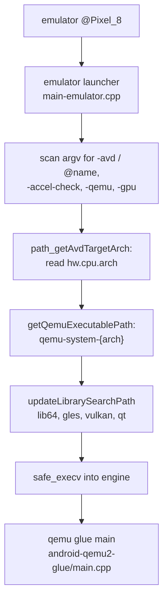
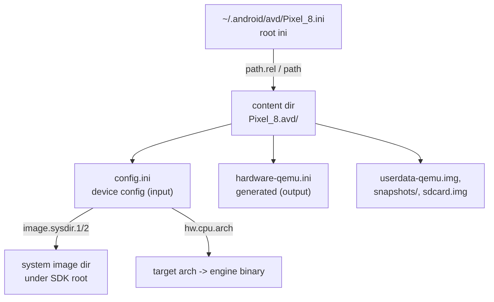
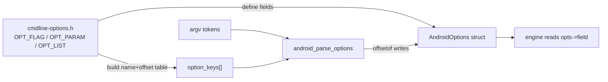
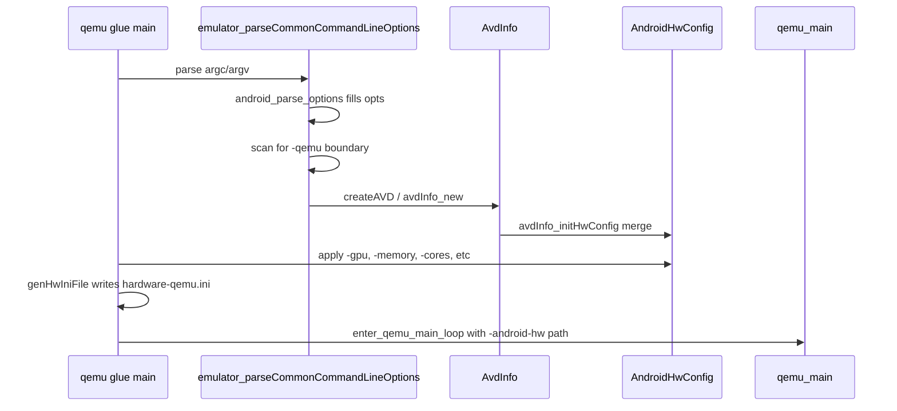
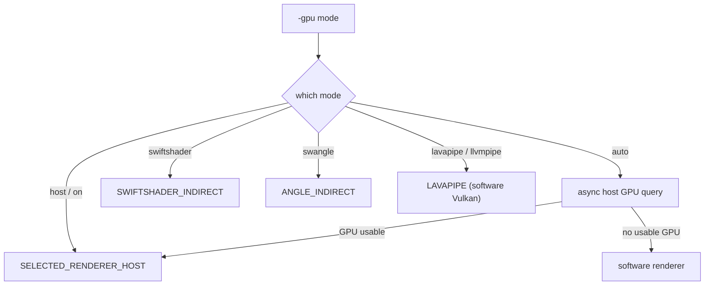
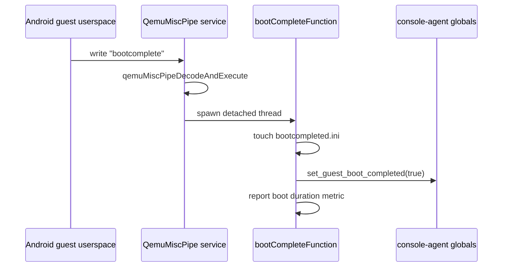

# Chapter 3: Running the Emulator

Typing `emulator @Pixel_8` looks like launching a single program, but the binary you invoke does almost no emulation. It is a thin launcher whose job is to figure out *which* architecture-specific QEMU binary to run, set up the library search path so the bundled graphics and Qt libraries are found, and then `execv()` into the real engine. The real engine, in turn, parses dozens of command-line options, reconciles them against the Android Virtual Device (AVD) on disk, materializes a `hardware-qemu.ini` that captures the final hardware configuration, and only then hands a translated argument vector to `qemu_main()`.

This chapter walks the full path from process spawn to `boot completed`. We follow the launcher in `android/emulator/main-emulator.cpp`, the AVD discovery code in `android/emu/avd/`, the X-macro command-line option system in `android/emu/cmdline/`, the option-to-hardware translation in the QEMU glue, and the small set of special options (`-accel-check`, `-qemu`, `-gpu`) that change the launch flow entirely. By the end you should be able to read the verbose log of any emulator launch and know which source function produced each line.

---

## 3.1 The Launcher and the Engine

The program installed as `emulator` (or `emulator.exe`) is not the emulator. Its source comment in `android/emulator/main-emulator.cpp` is blunt about it:

```cpp
// Source: external/qemu/android/emulator/main-emulator.cpp
/* This is the source code to the tiny "emulator" launcher program
 * that is in charge of starting the target-specific emulator binary
 * for a given AVD, i.e. either 'emulator-arm' or 'emulator-x86'
 */
```

The launcher's `main()` does a handful of things and then disappears: it parses just enough of the command line to learn the AVD name and target architecture, locates the matching `qemu-system-*` binary inside the bundled `qemu/<os>-<hostarch>/` directory, prepends the right directories to the dynamic library search path, and finally calls `safe_execv()` to replace itself with the engine. Because it uses `execv` rather than spawning a child, the engine inherits the launcher's process id on POSIX, which keeps the process tree flat.

### 3.1.1 Why a separate launcher exists

A single `emulator` entry point can drive ARM64, x86, and x86\_64 guests, each of which is a *different* QEMU binary compiled for a different target. The launcher decides which one to run from the AVD's CPU architecture rather than forcing the user to know it. It also centralizes host-environment fixups that must happen *before* the engine's shared libraries load: forcing `LC_ALL=C` to dodge locale-dependent parsing bugs, setting `MESA_RGB_VISUAL`, and on Linux pointing `XDG_RUNTIME_DIR` at a writable directory so lavapipe can create the temp files it needs for memory-fd export.

```cpp
// Source: external/qemu/android/emulator/main-emulator.cpp
System::get()->envSet("LC_ALL", "C");
System::get()->envSet("MESA_RGB_VISUAL", "TrueColor 24");
```

### 3.1.2 Selecting the engine binary

`getQemuExecutablePath()` turns the AVD architecture into a QEMU architecture and builds a path. The mapping lives in `getQemuArch()`: on an x86\_64 host, `x86` maps to `i386` and `x86_64` maps to `x86_64`; on an aarch64 host, `arm64` maps to `aarch64`. The final path follows the pattern `<progDir>/qemu/<os>-<hostArch>/qemu-system-<qemuArch>` — with a `-headless` suffix when the engine should run without a window.

```cpp
// Source: external/qemu/android/emulator/main-emulator.cpp
#define QEMU_BINARY_PATTERN_HEADLESS "qemu-system-%s-headless%s"
#define QEMU_BINARY_PATTERN "qemu-system-%s%s"
```

Only the "ranchu" (QEMU2) virtual board is supported; `isCpuArchSupportedByRanchu()` accepts `arm64`, `x86`, and `x86_64`, and the launcher panics for anything else. The classic engine path (`getClassicEmulatorPath()`) is still present but deprecated, and `-engine classic` prints a warning.

The launcher tries several candidate directories for the binary — the program directory reported by the runtime, a sibling `emulator/` directory derived from it, and the directory of `argv[0]` — because in platform builds the reported program directory is sometimes wrong (the code references bug 65257562 for this).

Launcher to engine handoff



### 3.1.3 Setting up the library search path

`updateLibrarySearchPath()` prepends `<launcherDir>/lib64` and then a renderer-specific subdirectory (`gles_angle` or `gles_swiftshader`) plus a `vulkan` directory for ICDs. Which GLES directory wins depends on the `-gpu` value the launcher already scraped: `-gpu lavapipe` or any mode whose name contains `angle` forces the software ANGLE path. When the window is shown, `androidQtSetupEnv()` additionally adds the bundled Qt directory. These environment changes survive the `execv`, so the engine loads the bundled libraries instead of any system copies.

## 3.2 What an AVD Is on Disk

An AVD is two pieces of state: a small *root ini* and a *content directory*. The root ini lives at `~/.android/avd/<name>.ini` and contains essentially one useful thing — a pointer to the content directory. The content directory holds `config.ini` (the hardware description), the disk images, snapshots, and runtime artifacts. The keys are defined in `android/emu/avd/include/android/avd/keys.h`:

```c
// Source: external/qemu/android/emu/avd/include/android/avd/keys.h
#define  ROOT_ABS_PATH_KEY    "path"
#define  ROOT_REL_PATH_KEY    "path.rel"
#define CPU_ARCH "hw.cpu.arch"
#define  SEARCH_PREFIX   "image.sysdir."
```

### 3.2.1 Two ini files, two jobs

`config.ini` is *device* configuration: CPU architecture, RAM size, screen geometry, which sensors and cameras exist, which skin to load, and the `image.sysdir.N` keys that point at the system image. The engine reads it as the source of truth for hardware. The launcher reads a couple of keys from it directly to bootstrap — most importantly `hw.cpu.arch`, via `_getAvdConfigValue()`:

```c
// Source: external/qemu/android/emu/avd/src/android/avd/util.c
char* path_getAvdTargetArch( const char* avdName )
{
    char*  avdPath = path_getAvdContentPath(avdName);
    char*  avdArch = _getAvdConfigValue(avdPath, "hw.cpu.arch", "arm");
    ...
}
```

`hardware-qemu.ini` is different: it is *generated output*, not user input. The engine writes it once per launch after it has merged the command line, the skin's `hardware.ini`, and `config.ini` into a single final `AndroidHwConfig`. We return to this in section 3.6. It is one of the files `-wipe-data` deletes (see the `clean_up_avd_contents_except_config_ini()` list in the launcher), precisely because it is derived state.

### 3.2.2 Resolving the content directory

`path_getAvdContentPath()` reads the root ini and prefers the relative path key. It joins `path.rel` to the AVD home directory's parent and checks that a `config.ini` exists there; only if that fails does it fall back to the absolute `path` key. The relative-path-first policy lets an `.android` directory be copied between machines or home directories without rewriting absolute paths.

```c
// Source: external/qemu/android/emu/avd/src/android/avd/util.c
const char* relPath = iniFile_getString(ini, ROOT_REL_PATH_KEY, NULL);
if (relPath != NULL) {
    p = bufprint_avd_home_path(temp, end);
    p = bufprint(p, end, PATH_SEP ".." PATH_SEP "%s", relPath);
    if (p < end && path_is_dir(temp)) { ... }
}
```

### 3.2.3 Finding the system image

The system image is not stored in the content directory; `config.ini` only records *where to search* for it with the `image.sysdir.1` and `image.sysdir.2` keys (at most `MAX_SEARCH_PATHS`, which is 2). `path_getAvdSystemPath()` reads each key, prefixes it with the SDK root when it is relative, and returns the first existing directory. The launcher uses this to sanity-check that a valid system path exists before it bothers launching the engine, panicking with a hint to set `ANDROID_SDK_ROOT` when it cannot.

AVD on-disk layout and resolution



## 3.3 Discovering AVDs

`-list-avds` does not consult a registry; it scans the filesystem. `avdScanner_new()` opens the AVD home directory (`~/.android/avd` by default, or `<sdk_home>/avd`) and `avdScanner_next()` walks every directory entry, treating any name ending in `.ini` as an AVD and returning the name with the suffix stripped:

```c
// Source: external/qemu/android/emu/avd/src/android/avd/scanner.c
if (entry_len < 4 ||
    memcmp(entry + entry_len - 4U, ".ini", 4) != 0) {
    // Can't possibly be a <name>.ini file.
    continue;
}
entry_len -= 4U;
```

The launcher drives this loop directly for `-list-avds` and `-snapshot-list`, printing one name per line and exiting without ever loading the engine. When `list_snapshots` is set, `append_snapshot_names()` additionally opens each AVD's `snapshots/` directory and appends the snapshot names after a tab.

### 3.3.1 The search-directory precedence

When you name an AVD that does not resolve, the launcher prints the search order so you can debug it. The lookup honors three environment variables in order — `ANDROID_AVD_HOME`, then `ANDROID_SDK_HOME` (using its `avd` subdirectory), then `$HOME/.android/avd`. The error message in `main-emulator.cpp` spells this out verbatim, which is the canonical reference when an AVD "exists" but the emulator cannot find it.

## 3.4 The Command-Line Option System

The emulator has well over a hundred options. Rather than a giant `if`/`strcmp` ladder, they are declared once in an X-macro header, `android/emu/cmdline/include/android/cmdline-options.h`, and that single file is `#include`d in several contexts with different macro definitions. Each option is one of three kinds:

- `OPT_FLAG(name, descr)` — a boolean flag backed by an `int`
- `OPT_PARAM(name, template, descr)` — a string-valued option backed by a `char*`
- `OPT_LIST(name, template, descr)` — a repeatable option backed by a `ParamList*` linked list

A `CFG_*` variant marks options that describe AVD configuration and are ignored when `-avd` is given (they only matter when creating an AVD or running without one).

### 3.4.1 The struct and the table from one header

`cmdline-definitions.h` includes the option header to *define the fields* of the `AndroidOptions` struct:

```c
// Source: external/qemu/android/emu/cmdline/include/android/cmdline-definitions.h
typedef struct AndroidOptions {
#define OPT_LIST(n, t, d) ParamList* n;
#define OPT_PARAM(n, t, d) char* n;
#define OPT_FLAG(n, d) int n;
#include "android/cmdline-options.h"
} AndroidOptions;
```

The parser, `cmdline-option.cpp`, includes the *same* header to build a parallel table of `{name, struct-offset, type}` records, so the field list and the parse table can never drift apart:

```cpp
// Source: external/qemu/android/emu/cmdline/src/android/cmdline-option.cpp
#define  OPTION(_name,_type,_config)  \
    { #_name, offsetof(AndroidOptions,_name), _type, _config },
static const OptionInfo  option_keys[] = {
#define  OPT_FLAG(_name,_descr)             OPTION(_name,OPTION_IS_FLAG,0)
#define  OPT_PARAM(_name,_template,_descr)  OPTION(_name,OPTION_IS_PARAM,0)
#include "android/cmdline-options.h"
    { NULL, 0, 0, 0 }
};
```

### 3.4.2 How parsing actually works

`android_parse_options()` walks `argv` from the front. It special-cases `@name` as shorthand for `-avd name`, stops at the first argument that is not an option, translates dashes in the option name to underscores (so `-no-window` matches the field `no_window`), and looks the translated name up in `option_keys`. For a flag it writes `1` to the `int` field at the recorded offset; for a param it `strdup`s the next argument into the `char*` field; for a list it pushes onto a linked list (later reversed so order is preserved). Anything it does not recognize stops the loop and is left in `argv` for downstream handling — including everything after `-qemu`.

X-macro option flow



### 3.4.3 Debug tags

`-debug <tags>` and `-debug-<tag>` are handled before the table lookup. `android_parse_debug_tags_option()` parses a comma-separated list where a `-` or `no-` prefix disables a tag, applying them left to right so the last value wins. `-verbose` is kept for backward compatibility and is rewritten internally to `-debug-init`.

## 3.5 The Engine's main(): From Options to QEMU

When the engine binary starts, control reaches `main()` in `android-qemu2-glue/main.cpp`. After early setup and crash-handler init, it kicks off an asynchronous host-GPU query, injects the console agents that give the rest of the code access to global state, records the original command line for diagnostics, and then calls the big workhorse:

```cpp
// Source: external/qemu/android-qemu2-glue/main.cpp
AndroidOptions* opts = &sOpts[0];
AndroidHwConfig* hw = getConsoleAgents()->settings->hw();
if (!emulator_parseCommonCommandLineOptions(&argc, &argv,
                                            kTarget.androidArch,
                                            true,  // is_qemu2
                                            opts, hw, &avd, &exitStatus)) {
    ...
}
```

`emulator_parseCommonCommandLineOptions()` (in `android/android-emu/android/main-common.c`) first calls `android_parse_options()` to fill `opts`, reconfigures logging from the parsed flags, injects the options into the global console-agent state, and then scans the *remaining* arguments for `-qemu`.

### 3.5.1 The -qemu passthrough boundary

`-qemu` is the escape hatch: everything after it is meant for QEMU directly, untranslated. The common parser breaks its scan loop as soon as it sees the token:

```c
// Source: external/qemu/android/android-emu/android/main-common.c
if (!strcmp(opt, "-qemu")) {
    --(*p_argc);
    ++(*p_argv);
    break;
}
```

Two paths reach `qemu_main()` without the normal AVD-driven translation. The launcher itself short-circuits when it sees a leading `-qemu` (or `-fuchsia`) and sets `forceEngineLaunch`, letting the engine boot without an AVD. Inside the engine, when `emulator_parseCommonCommandLineOptions()` returns `false` with `exitStatus == EMULATOR_EXIT_STATUS_POSITIONAL_QEMU_PARAMETER` (defined as `-1` in `main-common.h`), the glue copies the remaining positional arguments straight into the QEMU argument vector and jumps to `enter_qemu_main_loop()`, skipping option translation entirely. The Fuchsia branch does the same with a few extra `-kernel`/`-L` arguments and feature-flag defaults.

### 3.5.2 Building the AVD and the hardware config

In the normal path, `createAVD()` builds an `AvdInfo` by calling `avdInfo_new(opts->avd, ...)`, which loads the root ini and `config.ini` from disk. `avdInfo_new()` reads the content directory, the API level, the system-image search paths, and the `config.ini` itself into the `AvdInfo`. The merge into the final hardware config happens in `avdInfo_initHwConfig()`:

```c
// Source: external/qemu/android/emu/avd/src/android/avd/info.c
androidHwConfig_init(hw, i->apiLevel);          // defaults first
if (i->skinHardwareIni != NULL)
    ret = androidHwConfig_read(hw, i->skinHardwareIni);   // skin overrides defaults
if (ret == 0 && i->configIni != NULL)
    ret = androidHwConfig_read(hw, i->configIni);         // config.ini overrides skin
```

The precedence is defaults, then the skin's `hardware.ini`, then the device's `config.ini` — the comment in the source notes that `config.ini` overriding the skin "is preferable to the opposite order." Command-line options that map to hardware fields are applied on top of this by the glue before the final ini is written.

Engine launch sequence



## 3.6 Generating hardware-qemu.ini

Once the merged `AndroidHwConfig` is final, the glue serializes it to disk and tells QEMU where to find it. `genHwIniFile()` writes a clean copy (dropping defaulted entries so it can be compared against a snapshot's recorded config), and the path is passed as `-android-hw`:

```cpp
// Source: external/qemu/android-qemu2-glue/main.cpp
int ret = genHwIniFile(hw, coreHwIniPath);
if (ret != 0) return ret;
args.add2("-android-hw", coreHwIniPath);
```

The `AndroidHwConfig` struct is itself X-macro generated. `hardware-properties.ini` is the master description of every hardware property — its name, type, default, and documentation — and `android/scripts/gen-hw-config.py` turns it into `hw-config-defs.h`. That generated header defines the struct fields, the loader, and the writer all from one list:

```c
// Source: external/qemu/objs/avd_config/android/avd/hw-config-defs.h
HWCFG_STRING(
  hw_cpu_arch,
  "hw.cpu.arch",
  "arm",
  ...
```

So a property added to `hardware-properties.ini` automatically becomes a `config.ini` key the loader understands, a field in `AndroidHwConfig`, and a line the writer emits into `hardware-qemu.ini` — no hand-written plumbing. This `hardware-qemu.ini` is the contract between the android-emu side and the QEMU machine model: when QEMU starts, it reads it back via `-android-hw` to learn how many cores, how much RAM, which serial-port naming scheme, and which virtual devices to instantiate.

## 3.7 Acceleration, GPU Modes, and -accel-check

Three options change *how* the guest CPU and GPU are virtualized, and one of them never launches the engine at all.

### 3.7.1 -accel-check and emulator-check

`-accel-check` does not run a VM; it answers a question Android Studio asks before offering to start one. The launcher intercepts the flag and forwards it to a separate bundled executable, `emulator-check`, with the argument `accel`:

```cpp
// Source: external/qemu/android/emulator/main-emulator.cpp
const auto path = sys.findBundledExecutable("emulator-check");
...
bool ret = sys.runCommand(
        {path, "accel"},
        RunOptions::WaitForCompletion | RunOptions::ShowOutput,
        System::kInfinite, &exit_code);
```

`emulator-check` (`android/emulator-check/main-emulator-check.cpp`) is a tiny program with a table of subcommands — `accel`, `cpu-info`, `window-mgr`, `desktop-env`, and on Windows `hyper-v`/`whpx`. The `accel` handler calls `androidCpuAcceleration_getStatus()` and returns its numeric status plus a human message. The status codes are a stable contract: `cpu_accelerator.h` declares the enum with the comment "don't change these numbers / Android Studio depends on them," where `0` means `ANDROID_CPU_ACCELERATION_READY` and non-zero values encode specific failures (no VT-x, `/dev/kvm` missing, permission denied, Hyper-V conflict, and so on).

### 3.7.2 Choosing the accelerator

In the normal launch path, `handleCpuAcceleration()` maps the `-accel on|off|auto` option (and the `-no-accel` shorthand) onto a mode, then queries `androidCpuAcceleration_getStatus()`. The chosen accelerator becomes a QEMU `-enable-*` flag through `getAcceleratorEnableParam()`:

```c
// Source: external/qemu/android/android-emu/android/main-common.c
case ANDROID_CPU_ACCELERATOR_KVM:  return "-enable-kvm";
case ANDROID_CPU_ACCELERATOR_HVF:  return "-enable-hvf";
case ANDROID_CPU_ACCELERATOR_WHPX: return "-enable-whpx";
case ANDROID_CPU_ACCELERATOR_AEHD: return "-enable-aehd";
```

Because x86/x86\_64 guests run unacceptably slowly under pure TCG translation, the code refuses to start an x86 guest in `auto` mode when no hardware accelerator is available and prints a link to the acceleration setup docs. On Apple silicon the same guard applies to arm64 guests and prefers Hypervisor.framework (HVF). The accelerators themselves are the subject of a later chapter; here the point is that the *choice* is made during launch and emitted as a QEMU flag.

### 3.7.3 GPU modes

The `-gpu <mode>` option (declared `OPT_PARAM(gpu, ...)`) selects the graphics backend. `emuglConfig_get_renderer()` in `emugl_config.cpp` maps the user string to a renderer enum:

```cpp
// Source: external/qemu/android/android-ui/modules/aemu-gl-init/src/android/opengl/emugl_config.cpp
} else if (!strcmp(gpu_mode, "host") || !strcmp(gpu_mode, "on")) {
    return SELECTED_RENDERER_HOST;
} else if (!strcmp(gpu_mode, "swiftshader")) {
    return SELECTED_RENDERER_SWIFTSHADER_INDIRECT;
} else if (!strcmp(gpu_mode, "swangle")) {
    return SELECTED_RENDERER_ANGLE_INDIRECT;
} else if (!strcmp(gpu_mode, "lavapipe") || !strcmp(gpu_mode, "llvmpipe")) {
    return SELECTED_RENDERER_LAVAPIPE;
}
```

`host` uses the machine's real GPU; `swiftshader` and `swangle` are CPU software rasterizers; `lavapipe` is a software Vulkan implementation. The full list the config accepts also includes `auto`, which probes the host GPU (the asynchronous query started at the top of `main()`) and picks `host` when a usable GPU is found, falling back to software otherwise. The launcher reads `-gpu` early because it affects the library search path — `lavapipe` and `angle` modes force the software-ANGLE library directory before the engine loads, as we saw in section 3.1.3.

GPU mode resolution



## 3.8 The Lifecycle: Launch to Boot Complete

With options parsed, the AVD merged, `hardware-qemu.ini` written, and accelerator/GPU chosen, the glue builds the final QEMU argument vector and spawns the VM. `skin_winsys_spawn_thread()` runs `enter_qemu_main_loop()` on a dedicated thread (or directly when `-no-window` is set), which calls `run_qemu_main()` — the QEMU machine setup that creates the CPUs, RAM, and virtual devices described by the hardware ini.

### 3.8.1 Window vs. headless

The relationship between `-no-window` and the headless binary is subtle. The launcher treats both `-no-window` and `-no-qt` as a request for a headless launch and selects the `qemu-system-*-headless` binary. Inside the engine, `emulator_parseCommonCommandLineOptions()` then *forces* `opts->no_window = false`, because (per the in-source comment referencing bug 143949261) windowlessness is now an inherent property of which binary was selected, not a runtime flag. So the launcher's binary choice, not the option value the engine sees, is what determines whether a UI thread is created.

### 3.8.2 Signaling boot completion

The guest tells the host it has finished booting over a QEMU pipe named `QemuMiscPipe`. When userspace writes the message `bootcomplete` to that pipe, `qemuMiscPipeDecodeAndExecute()` dispatches it:

```cpp
// Source: external/qemu/android/android-emu/android/emulation/QemuMiscPipe.cpp
} else if (beginWith(input, "bootcomplete")) {
    fillWithOK(output);
    std::thread{bootCompleteFunction}.detach();
    return;
}
```

`bootCompleteFunction()` computes the boot time, reports it as a metric, touches `bootcompleted.ini` in the content directory, and flips the global flag through `set_guest_boot_completed(true)`. That `bootcompleted.ini` file is why the launcher deletes it at the start of every run: a stale copy from a previous boot must not be mistaken for the current one. If `-quit-after-boot` (the `test_quitAfterBootTimeOut` field) was set, the same function shuts the VM down immediately after boot completes — the mechanism behind smoke-test invocations.

Boot completion signaling



### 3.8.3 Restart and clean shutdown

The launcher captures restart parameters with `initializeEmulatorRestartParameters()` before it mangles `argv`, so the engine can relaunch itself with the same options after a quickboot restart. `-read-only` disables restart (and snapshot saving) so multiple instances can share one AVD. The `-is-restart <pid>` option, set when the engine respawns, makes the new launcher wait up to ten seconds for the old process to exit before proceeding. The launcher's small `-kill`/`-sleep` handler (run before anything else in `main()`) is the watchdog used to terminate a hung emulator process by pid.

## 3.9 Try It

The following commands exercise the launch path described above. They assume a configured SDK with at least one AVD.

- List the AVDs the scanner finds on disk, exactly as `-list-avds` walks `~/.android/avd`:

```bash
emulator -list-avds
```

- Check CPU acceleration without launching a VM. This invokes the bundled `emulator-check accel` and prints a status code (0 means ready) plus a message:

```bash
emulator -accel-check
```

- Run the underlying check binary directly to see the other subcommands:

```bash
emulator-check accel
emulator-check cpu-info
```

- Launch verbosely and watch the launcher resolve the engine binary, library paths, and final argument vector:

```bash
emulator @My_AVD -verbose -debug-init
```

- Inspect an AVD's input config and the generated hardware config side by side (run once after a boot so `hardware-qemu.ini` exists):

```bash
cat ~/.android/avd/My_AVD.avd/config.ini
cat ~/.android/avd/My_AVD.avd/hardware-qemu.ini
```

- Force a software renderer and a specific accelerator state, then pass a raw flag straight through to QEMU after the `-qemu` boundary:

```bash
emulator @My_AVD -gpu swiftshader -accel off -qemu -m 4096
```

- Boot, then quit as soon as the guest signals completion over `QemuMiscPipe` (useful for scripted smoke tests):

```bash
emulator @My_AVD -no-window -quit-after-boot 120
```

## Summary

- The installed `emulator` program is a thin launcher in `android/emulator/main-emulator.cpp`; it picks the right `qemu-system-*` binary by AVD architecture, fixes up the library search path, and `safe_execv`s into the real engine.
- An AVD is a root ini (`~/.android/avd/<name>.ini`) pointing at a content directory; `config.ini` is device configuration *input* while `hardware-qemu.ini` is *generated output* the engine recreates each launch.
- `-list-avds` scans the filesystem via `avdScanner_*`, treating every `*.ini` in the AVD home as an AVD; the AVD home is resolved through `ANDROID_AVD_HOME`, `ANDROID_SDK_HOME`, then `$HOME/.android/avd`.
- Command-line options are declared once in the `cmdline-options.h` X-macro header and reused to define the `AndroidOptions` struct and the parser's offset table, so the two can never drift.
- `-qemu` is a hard boundary: everything after it bypasses option translation and goes straight to `qemu_main()`, signaled internally by `EMULATOR_EXIT_STATUS_POSITIONAL_QEMU_PARAMETER`.
- The final hardware config is built by merging defaults, the skin's `hardware.ini`, and `config.ini`, then serialized by `genHwIniFile()` and handed to QEMU as `-android-hw`.
- `-accel-check` forwards to the standalone `emulator-check` binary and returns stable status codes that Android Studio depends on; the normal path turns the accelerator choice into a QEMU `-enable-*` flag.
- `-gpu` selects between the host GPU and software renderers (`swiftshader`, `swangle`, `lavapipe`); `auto` probes the host GPU asynchronously during `main()`.
- Boot completion is signaled by the guest writing `bootcomplete` to `QemuMiscPipe`, which runs `bootCompleteFunction()`, touches `bootcompleted.ini`, and flips the `guest_boot_completed` global.

### Key Source Files

| File | Purpose |
|------|---------|
| external/qemu/android/emulator/main-emulator.cpp | Launcher: engine selection, library paths, `-accel-check`/`-qemu`/`-gpu` early handling, `execv` |
| external/qemu/android/emu/avd/src/android/avd/util.c | AVD content-path and target-arch resolution from root ini and `config.ini` |
| external/qemu/android/emu/avd/src/android/avd/scanner.c | Filesystem scan backing `-list-avds` and `-snapshot-list` |
| external/qemu/android/emu/avd/include/android/avd/keys.h | Names of the `config.ini` and root-ini keys |
| external/qemu/android/emu/cmdline/include/android/cmdline-options.h | The X-macro declaration of every command-line option |
| external/qemu/android/emu/cmdline/src/android/cmdline-option.cpp | `android_parse_options()` and the offset-table parser |
| external/qemu/android-qemu2-glue/main.cpp | Engine `main()`: option parsing, AVD build, `genHwIniFile`, QEMU launch |
| external/qemu/android/android-emu/android/main-common.c | `emulator_parseCommonCommandLineOptions`, `-qemu` boundary, `handleCpuAcceleration` |
| external/qemu/android/emu/avd/src/android/avd/info.c | `avdInfo_initHwConfig` merge of defaults, skin, and `config.ini` |
| external/qemu/android/emulator-check/main-emulator-check.cpp | Standalone `emulator-check` answering `accel`, `cpu-info`, etc. |
| external/qemu/android/emu/feature/include/android/cpu_accelerator.h | Stable `AndroidCpuAcceleration` status codes |
| external/qemu/android/android-ui/modules/aemu-gl-init/src/android/opengl/emugl_config.cpp | `-gpu` mode to renderer mapping |
| external/qemu/android/android-emu/android/emulation/QemuMiscPipe.cpp | `bootcomplete` handling and `guest_boot_completed` |
