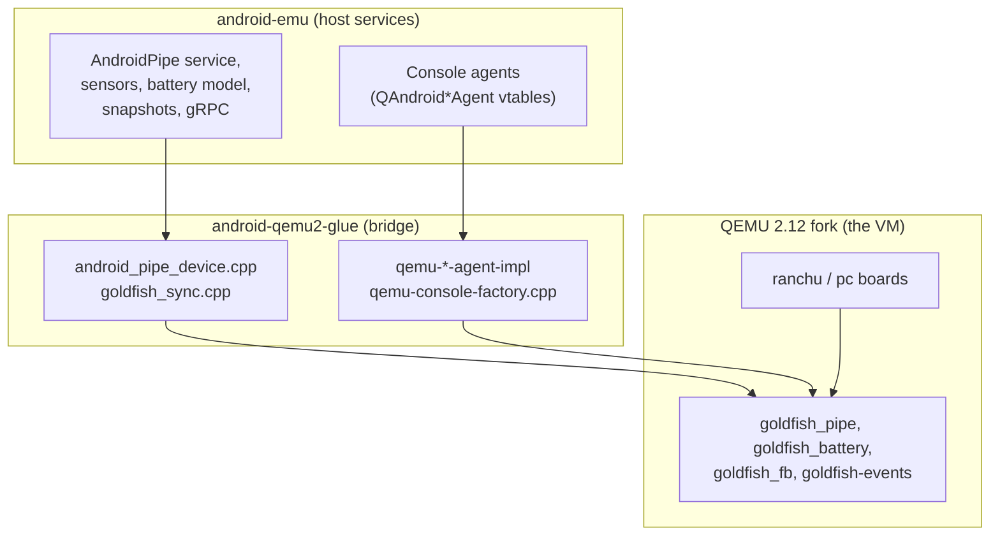
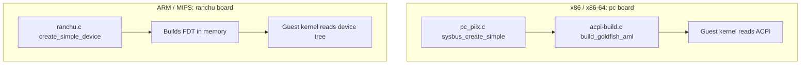
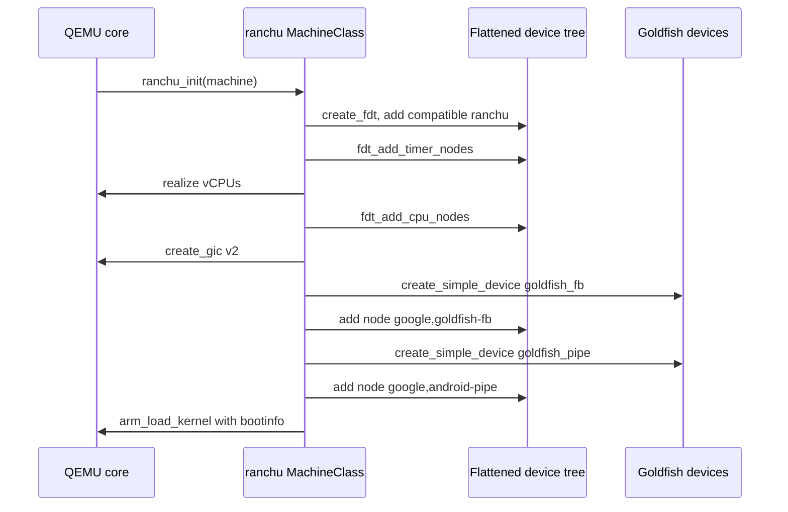
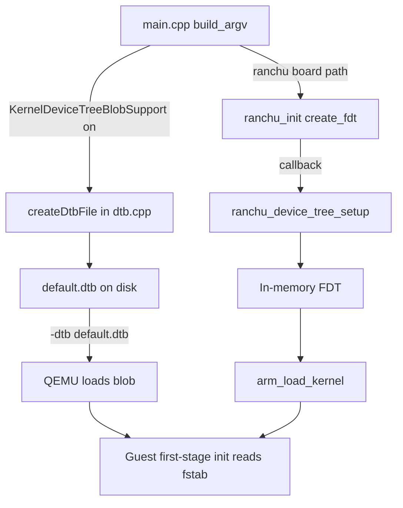
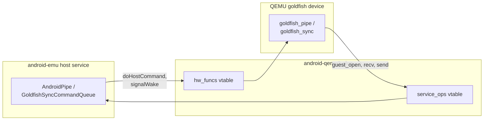
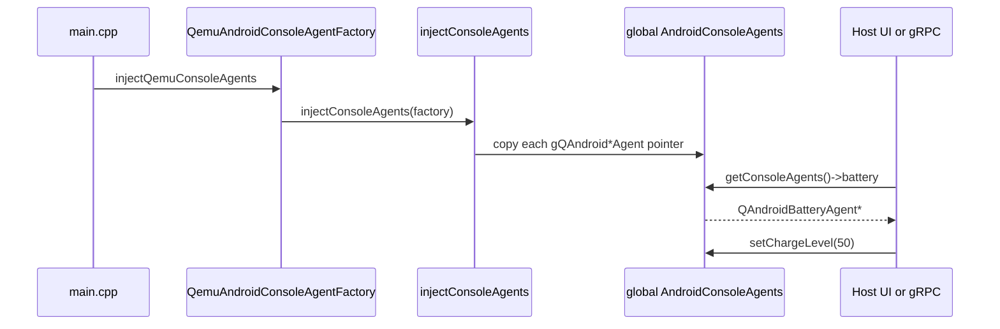
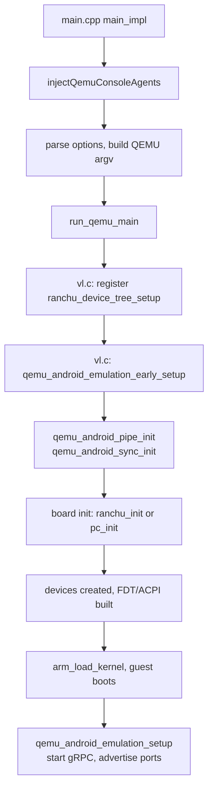
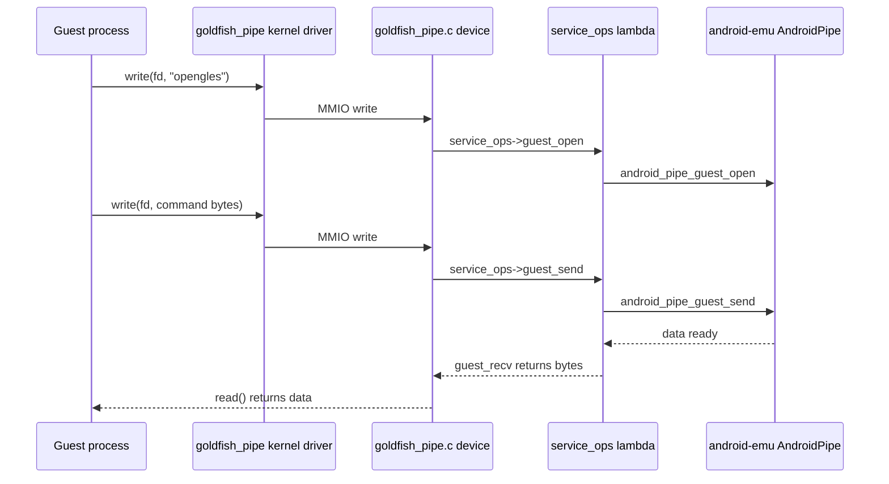

# Chapter 4: The QEMU Fork

The Android Emulator does not run stock QEMU. It runs a fork of QEMU 2.12 that has been bent in two directions at once: downward, into the virtual hardware, where Android-specific "goldfish" devices are soldered onto otherwise-ordinary QEMU machine boards; and upward, into a large body of host-side C++ code called `android-emu` that knows nothing about QEMU and everything about batteries, sensors, snapshots, and gRPC. Between those two worlds sits a third body of code, `android-qemu2-glue`, whose entire job is to make the QEMU half and the `android-emu` half believe they were written for each other.

This chapter is about that seam. We look at how the emulator's QEMU differs from upstream, how the `ranchu` machine and the legacy `goldfish` platform are assembled, how the device tree is built and handed to the guest kernel, and how the glue layer installs Android virtual devices and wires up the "agents" that the rest of the emulator uses to poke at them. The recurring pattern is two vtables pointed at each other: the device exposes service ops to the host, the host exposes hardware ops to the device, and a single setup function snaps them together.

---

## 4.1 What "Fork" Means Here

The tree under `external/qemu` is a complete QEMU checkout, but a heavily modified one. The version it is based on is recorded in two places. `external/qemu/QEMU_VERSION` contains the single line `2.12.0`, and the metrics reporter ships that same string to the backend using QEMU's own `QEMU_VERSION` macro (see `android-qemu2-glue/main.cpp:1846`). QEMU 2.12 is the upstream release this fork descends from; the emulator has carried that base forward rather than chasing every upstream release.

The fork is not a thin patch set. Three categories of change distinguish it from upstream.

1. New virtual devices that do not exist upstream, living under `external/qemu/hw/` with `goldfish_` prefixes.
2. New machine boards, `ranchu` for ARM and MIPS, that assemble those devices, plus `CONFIG_ANDROID`-guarded additions to the standard x86 PC board.
3. Two entirely new top-level source trees, `external/qemu/android/` (the host-side `android-emu` code) and `external/qemu/android-qemu2-glue/` (the bridge), neither of which appears in upstream QEMU at all.

The legal posture follows from the base. QEMU is GPLv2, and the goldfish device files carry GPLv2 headers ("licensed under the terms of the GNU General Public License version 2"), while the newer glue and `android-emu` files are mostly Apache 2.0. You can see both licenses side by side: `external/qemu/android-qemu2-glue/dtb.cpp` is GPLv2, `external/qemu/android-qemu2-glue/qemu-console-factory.cpp` is Apache 2.0.

### 4.1.1 Why a Fork at All

A stock QEMU machine boots a generic Linux distribution. Android is not a generic Linux distribution: it expects a framebuffer it can mmap, a fast zero-copy channel to a host GPU and host services, a battery whose charge level the host can change at runtime, an input device that speaks the Linux evdev protocol, and a clean way for the host UI to inject sensor readings and telephony events. None of that is expressible as QEMU command-line options. It requires custom devices in the VM and custom code on the host, and the two have to share data structures. A fork is the path of least resistance, and it is the path the emulator took.

### 4.1.2 The Three Layers

The emulator binary is one process containing three cooperating layers.



The arrows point in the direction of dependency at setup time: the glue reaches down into QEMU devices and up into `android-emu` services, and binds them. At runtime, data flows both ways.

---

## 4.2 The Goldfish Platform

"Goldfish" is the name of the original ARM virtual board used by the very first Android emulator, and the name stuck to the family of Android-specific MMIO devices that board introduced. Those devices outlived the board. Today they are mixed into modern machines, but they still carry the goldfish name and the goldfish register conventions.

The device sources live under `external/qemu/hw/`, scattered across the subsystem directories where a device of that kind would normally go.

| Device | File | Role |
|--------|------|------|
| `goldfish_pipe` | `hw/misc/goldfish_pipe.c` | Fast host/guest data channel |
| `goldfish_sync` | `hw/misc/goldfish_sync.c` | Fence/timeline sync for graphics |
| `goldfish_battery` | `hw/misc/goldfish_battery.c` | Battery and AC charger model |
| `goldfish_fb` | `hw/display/goldfish_fb.c` | Framebuffer |
| `goldfish-events` | `hw/input/goldfish_events.c` | evdev-style input |
| `goldfish_audio` | `hw/audio/goldfish_audio.c` | Audio in/out |
| `goldfish_rtc` | `hw/timer/goldfish_timer.c` | Real-time clock |
| `goldfish_rotary` | `hw/input/goldfish_rotary.c` | Rotary encoder (wearables) |

Each is a standard QEMU `SysBusDevice` registered with a `TypeInfo` and a string type name. `goldfish_pipe`, for instance, declares `#define TYPE_GOLDFISH_PIPE "goldfish_pipe"` and registers itself with `type_init(goldfish_pipe_register)` (see `hw/misc/goldfish_pipe.c:144` and the `goldfish_pipe_info` TypeInfo near line 1910). Because they are ordinary QEMU device types, a machine board can instantiate them with the usual `sysbus_create_simple(name, base, irq)` call, exactly as it would create an upstream device.

### 4.2.1 Goldfish on x86: the PC Board

On x86 and x86-64 the emulator does not use a custom board at all. It uses QEMU's standard i440FX PC board (`pc-i440fx-2.12`, aliased `pc`, marked `is_default` in `hw/i386/pc_piix.c:499`) and bolts the goldfish devices on inside a `#if defined(CONFIG_ANDROID)` block. The interesting consequence is that on x86 the Android devices are wired at fixed physical addresses and fixed IRQ lines, with no device tree involved.

Those fixed addresses live in a header shared between C and ACPI ASL, `external/qemu/include/hw/acpi/goldfish_defs.h`. For x86 the I/O memory is parked at `0xff001000` and above, and the interrupt lines run from 16 to 23 (battery=16 ... rotary=23).

```c
// Source: include/hw/acpi/goldfish_defs.h
/* goldfish battery */
#define GOLDFISH_BATTERY_IOMEM_BASE   0xff010000
#define GOLDFISH_BATTERY_IOMEM_SIZE   0x00001000
#define GOLDFISH_BATTERY_IRQ          16

/* android pipe */
#define GOLDFISH_PIPE_IOMEM_BASE      0xff001000
#define GOLDFISH_PIPE_IOMEM_SIZE      0x00002000
#define GOLDFISH_PIPE_IRQ             18
```

The PC board reads those constants and creates each device:

```c
// Source: hw/i386/pc_piix.c
#if defined(CONFIG_ANDROID)
    sysbus_create_simple("goldfish_battery", GOLDFISH_BATTERY_IOMEM_BASE,
                            pcms->gsi[GOLDFISH_BATTERY_IRQ]);
    sysbus_create_simple("goldfish-events", GOLDFISH_EVENTS_IOMEM_BASE,
                            pcms->gsi[goldfish_events_irq]);
    sysbus_create_simple("goldfish_pipe", GOLDFISH_PIPE_IOMEM_BASE,
                            pcms->gsi[GOLDFISH_PIPE_IRQ]);
    sysbus_create_simple("goldfish_fb", GOLDFISH_FB_IOMEM_BASE,
                            pcms->gsi[GOLDFISH_FB_IRQ]);
    /* ...audio, rtc, sync, rotary... */
#endif  // CONFIG_ANDROID
```

The guest still has to find these devices. On x86 that is done with ACPI: `hw/i386/acpi-build.c` emits AML for each goldfish device (`build_goldfish_device_aml`, around line 1038) and an `android,firmware` / `android,fstab` description (`build_android_dt_aml`, around line 1072) using the same `goldfish_defs.h` constants, so the addresses in the device, the ACPI tables, and the kernel all agree.

One quirk worth noting: the x86 board swaps the sync and events IRQ lines when it is *not* running in `android_qemu_mode()` (the Fuchsia path), because goldfish_sync's IRQ 21 collides with legacy-IRQ PCI devices there. The conditional is right there at `hw/i386/pc_piix.c:269`.

### 4.2.2 ACPI vs. Device Tree

x86 and ARM differ in how the guest discovers the devices. The split is fundamental to understanding the two code paths.



Both paths end with the guest kernel discovering the same goldfish device types at known addresses; they just disagree about the discovery mechanism. The rest of this chapter follows the ARM/`ranchu` path because the device tree is more legible than ACPI AML, then returns to where the two paths converge in the glue.

---

## 4.3 The Ranchu Machine

`ranchu` is the Android-specific 64-bit ARM board, defined in `external/qemu/hw/arm/ranchu.c`. Its top comment states the design directly: it is "a virtual board for use as part of the Android emulator" with "a mixture of virtio devices and some Android-specific devices inherited from the 32 bit 'goldfish' board," and it "only support[s] 64-bit ARM CPUs." A second `ranchu` variant for MIPS lives in `hw/mips/mips_ranchu.c`.

The board is registered with QEMU's machine framework using the `DEFINE_MACHINE` macro, and it sets itself as the default machine so that `-machine type=ranchu` is implied:

```c
// Source: hw/arm/ranchu.c
static void ranchu_machine_init(MachineClass *mc)
{
    mc->desc = "Android/ARM ranchu";
    mc->init = ranchu_init;
    mc->max_cpus = 16;
    mc->is_default = 1;
}

DEFINE_MACHINE("ranchu", ranchu_machine_init)
```

### 4.3.1 The Memory Map

`ranchu` lays out guest physical address space with a static `MemMapEntry` table indexed by an enum. The layout reserves the first 128 MB for a boot ROM, puts device I/O in the 128 MB to 256 MB window, reserves 256 MB to 1 GB for possible future PCI, and starts RAM at 1 GB.

```c
// Source: hw/arm/ranchu.c
static const MemMapEntry memmap[] = {
    [RANCHU_FLASH] = { 0, 0x8000000 },
    [RANCHU_GIC_DIST] = { 0x8000000, 0x10000 },
    [RANCHU_GIC_CPU] = { 0x8010000, 0x10000 },
    [RANCHU_UART] = { 0x9000000, 0x1000 },
    [RANCHU_GOLDFISH_FB] = { 0x9010000, 0x100 },
    [RANCHU_GOLDFISH_BATTERY] = { 0x9020000, 0x1000 },
    [RANCHU_GOLDFISH_AUDIO] = { 0x9030000, 0x100 },
    [RANCHU_GOLDFISH_EVDEV] = { 0x9040000, 0x1000 },
    [RANCHU_MMIO] = { 0xa000000, 0x200 },
    [RANCHU_GOLDFISH_PIPE] = {0xa010000, 0x2000 },
    [RANCHU_GOLDFISH_SYNC] = {0xa020000, 0x2000 },
    [RANCHU_MEM] = { 0x40000000, 30ULL * 1024 * 1024 * 1024 },
};
```

A parallel `irqmap[]` table assigns SPI interrupt numbers: UART is IRQ 1, the framebuffer 2, battery 3, audio 4, evdev 5, pipe 6, sync 7, and the 32 virtio-mmio transports start at IRQ 16. The board models at most 30 GB of RAM; `ranchu_init` aborts with "cannot model more than 30GB RAM" if asked for more (`hw/arm/ranchu.c:511`).

### 4.3.2 Board Assembly

`ranchu_init` is the `MachineClass::init` callback, run once when the VM is created. It builds the machine in a fixed order.

1. Splice the CPU model out of the machine's `cpu_type` (`splice_out_cpu_model`), defaulting to `cortex-a15`.
2. Create the flattened device tree skeleton with `create_fdt`, then add timer nodes.
3. Realize each vCPU object, with secondaries marked `start-powered-off`, then add CPU nodes to the FDT.
4. Allocate and register guest RAM at `RANCHU_MEM`.
5. Create the GIC v2 interrupt controller and wire each CPU's timer outputs to GIC PPIs.
6. Create the PL011 UART, then the six goldfish devices, then 32 virtio-mmio transports.
7. Fill in `arm_boot_info` (kernel, initrd, cmdline) and call `arm_load_kernel`.

The goldfish devices are created by a single helper that both instantiates the QEMU device and adds its device-tree node, so the two never drift apart:

```c
// Source: hw/arm/ranchu.c
create_simple_device(vbi, pic, RANCHU_GOLDFISH_FB, "goldfish_fb",
                     "google,goldfish-fb\0"
                     "generic,goldfish-fb", 2, 0, 0);
create_simple_device(vbi, pic, RANCHU_GOLDFISH_PIPE, "goldfish_pipe",
                     "google,android-pipe\0"
                     "generic,android-pipe", 2, 0, 0);
create_simple_device(vbi, pic, RANCHU_GOLDFISH_SYNC, "goldfish_sync",
                     "google,goldfish-sync\0"
                     "generic,goldfish-sync", 2, 0, 0);
```

The fourth argument (`sysbus_name`, here `"goldfish_fb"`) is the QEMU device type name (it must match a registered `TypeInfo`); the NUL-separated strings are the device tree `compatible` values the guest kernel matches its drivers against. The pipe device, notably, presents itself to the kernel as `google,android-pipe`.

### 4.3.3 Board Initialization Sequence



---

## 4.4 The Device Tree

On ARM there is no ACPI; the guest kernel learns about hardware from a flattened device tree (FDT) blob. `ranchu` constructs that blob in memory during `ranchu_init` and hands it to the kernel through `arm_boot_info`.

### 4.4.1 Building the FDT in `ranchu.c`

`create_fdt` allocates an empty device tree, then stamps in the root properties and a firmware node. The root's `compatible` string is literally `"ranchu"`, and the firmware node identifies the hardware as `ranchu` as well:

```c
// Source: hw/arm/ranchu.c
qemu_fdt_setprop_string(fdt, "/", "compatible", "ranchu");
qemu_fdt_setprop_cell(fdt, "/", "#address-cells", 0x2);
qemu_fdt_setprop_cell(fdt, "/", "#size-cells", 0x2);

qemu_fdt_add_subnode(fdt, "/firmware");
qemu_fdt_add_subnode(fdt, "/firmware/android");
qemu_fdt_setprop_string(fdt, "/firmware/android", "compatible",
                        "android,firmware");
qemu_fdt_setprop_string(fdt, "/firmware/android", "hardware", "ranchu");
```

Each call to `create_simple_device` later appends a device node with a `reg` tuple (base and size from `memmap`), an `interrupts` tuple (from `irqmap`), and the `compatible` strings. The virtio-mmio transports are added in reverse address order so that the finished tree lists them lowest-address-first, a subtlety the code calls out explicitly in `create_virtio_devices`.

### 4.4.2 The Glue's Device Tree Hook

The board cannot know everything. The host side knows which guest partitions exist and where they live, and that information has to reach the kernel through the device tree's `android,fstab` node. The board therefore exposes a callback hook, `qemu_device_tree_setup_callback`, and invokes it from inside `create_fdt`:

```c
// Source: hw/arm/ranchu.c
if (device_tree_setup_func) {
    device_tree_setup_func(fdt);
}
```

The glue *defines* `ranchu_device_tree_setup` (`android-qemu2-glue/qemu-setup.cpp:164`), while QEMU core installs it as that callback from `vl.c` via `qemu_device_tree_setup_callback(ranchu_device_tree_setup)` (`external/qemu/vl.c:4665`). It adds the `fstab` subtree and, for each of the system and vendor partitions, looks up the in-guest device path from the AVD and emits an `ext4` mount entry:

```cpp
// Source: android-qemu2-glue/qemu-setup.cpp
char* vendor_path = avdInfo_getVendorImageDevicePathInGuest(
        getConsoleAgents()->settings->avdInfo());
if (vendor_path) {
    qemu_fdt_add_subnode(fdt, "/firmware/android/fstab/vendor");
    qemu_fdt_setprop_string(fdt, "/firmware/android/fstab/vendor",
                            "compatible", "android,vendor");
    qemu_fdt_setprop_string(fdt, "/firmware/android/fstab/vendor", "dev",
                            vendor_path);
    qemu_fdt_setprop_string(fdt, "/firmware/android/fstab/vendor", "type",
                            "ext4");
    /* ...mnt_flags ro, fsmgr_flags wait... */
    free(vendor_path);
}
```

This is the device tree being built collaboratively: the board contributes the hardware topology, the host contributes the storage topology, and the two meet inside one FDT.

### 4.4.3 The Standalone DTB Builder

There is a second, separate way the emulator produces a device tree: `android-qemu2-glue/dtb.cpp` writes a standalone `.dtb` file to disk. This path is used when the `KernelDeviceTreeBlobSupport` feature flag is set; `main.cpp` calls `createDtbFile` to produce `default.dtb` and then passes `-dtb <file>` to QEMU (`android-qemu2-glue/main.cpp:2926` and `:2937`).

`createDtbFile` builds the same `android,firmware` / `android,fstab` / `android,vendor` structure, but by hand against the `libdtb` structures (the `node` and `property` types from `dtc`) rather than QEMU's `qemu_fdt_*` helpers, then serializes it with `dt_to_blob`:

```cpp
// Source: android-qemu2-glue/dtb.cpp
char lit_vendor_compatible_value[] = "android,vendor";
char lit_fstab_compatibe_value[] = "android,fstab";
char lit_android_compatibe_value[] = "android,firmware";

char lit_type_value[] = "ext4";
char lit_mnt_flags_value[] = "noatime,ro,errors=panic";
char lit_fsmgr_flags_value[] = "wait";
```

The two device-tree paths produce equivalent `android,fstab` descriptions; the difference is only whether the tree is built live inside the board or pre-baked into a file the kernel loads. Both ultimately tell the guest's first-stage init where to find the `vendor` (and optionally `system`) ext4 partitions.



---

## 4.5 The Glue Layer

`android-qemu2-glue` is the third source tree, and it has no analog in upstream QEMU. Its files are listed in `android-qemu2-glue/CMakeLists.txt` and fall into a few groups: the device bridges (`emulation/android_pipe_device.cpp`, `emulation/goldfish_sync.cpp`), the agent implementations (`qemu-*-agent-impl.{c,cpp}`), the lifecycle setup (`qemu-setup.cpp`), the device-tree writer (`dtb.cpp`), and the program entry point (`main.cpp`).

The glue's purpose is to resolve an impedance mismatch. `android-emu` is written against abstract interfaces and knows nothing about QEMU's `DeviceState`, `QEMUFile`, or `MemoryRegion`. QEMU devices are written against abstract callback structs and know nothing about `android-emu`'s `AndroidPipe` or `GoldfishSyncCommandQueue`. The glue supplies the concrete functions on both sides and connects them. The technique is the same everywhere: a pair of vtables, one pointing each way.

### 4.5.1 The Two-Vtable Pattern

The cleanest example is the pipe device. `android_pipe_device.cpp` opens with a comment that states the contract exactly: "The host service pipe expects a device implementation that will implement the callbacks in `AndroidHwPipeFuncs`... The virtual device expects a service implementation that will implement the callbacks in `GoldfishPipeServiceOps`."

The glue defines a `GoldfishPipeServiceOps` struct full of lambdas. Each lambda forwards a QEMU device call into the matching `android-emu` `android_pipe_*` function, converting types at the boundary:

```cpp
// Source: android-qemu2-glue/emulation/android_pipe_device.cpp
static const GoldfishPipeServiceOps goldfish_pipe_service_ops = {
        // guest_open()
        [](GoldfishHwPipe* hwPipe) -> GoldfishHostPipe* {
            return static_cast<GoldfishHostPipe*>(
                    android_pipe_guest_open(hwPipe));
        },
        // guest_recv()
        [](GoldfishHostPipe* hostPipe,
           GoldfishPipeBuffer* buffers,
           int numBuffers) -> int {
            return android_pipe_guest_recv(
                    hostPipe, reinterpret_cast<AndroidPipeBuffer*>(buffers),
                    numBuffers);
        },
        /* ...send, poll, save, load, dma_* ... */
};
```

The `reinterpret_cast` from `GoldfishPipeBuffer*` to `AndroidPipeBuffer*` is load-bearing, and the file defends it with `static_assert`s that the two structs have identical size and identical field offsets. This is the glue's whole character: it trusts that two independently-defined structs are layout-compatible, and it proves that trust at compile time.

The binding happens in one function, `qemu_android_pipe_init`, which installs the ops into the device and initializes the pipe service's threading:

```cpp
// Source: android-qemu2-glue/emulation/android_pipe_device.cpp
bool qemu_android_pipe_init(android::VmLock* vmLock) {
    goldfish_pipe_set_service_ops(&goldfish_pipe_service_ops);
    android_pipe_append_lookup_by_id_callback(
        &goldfish_pipe_lookup_by_id_wrapper,
        "goldfish_pipe");
    android::AndroidPipe::initThreading(vmLock);
    return true;
}
```

Until that call runs, the QEMU device uses a defensive default. `goldfish_pipe.c` ships a `s_null_service_ops` whose `guest_open` logs "Android guest tried to open a pipe before service registration! Please call goldfish_pipe_set_service_ops() at setup time!" and returns NULL, force-closing the pipe (`hw/misc/goldfish_pipe.c:171` and `:208`). The null ops are a tripwire that catches a missing or mis-ordered glue setup.

### 4.5.2 The Sync Device Bridge

`goldfish_sync.cpp` follows the identical pattern but with the vtables visibly pointing in opposite directions. `GoldfishSyncDeviceInterface` carries calls *from* the host service *into* the device, and `GoldfishSyncServiceOps` carries calls *from* the device *into* the host service:

```cpp
// Source: android-qemu2-glue/emulation/goldfish_sync.cpp
// Called from the host sync service into the virtual device.
static GoldfishSyncDeviceInterface kSyncDeviceInterface = {
    .doHostCommand = goldfish_sync_send_command,
    .registerTriggerWait = [](trigger_wait_fn_t fn) {
        sTriggerWaitFn = fn;
    },
};

bool qemu_android_sync_init(android::VmLock* vmLock) {
    goldfish_sync_set_service_ops(&kSyncServiceOps);
    goldfish_sync_set_hw_funcs(&kSyncDeviceInterface);
    android::GoldfishSyncCommandQueue::initThreading(vmLock);
    return true;
}
```

`qemu_android_sync_init` calls *both* setters: `set_service_ops` points the device at the host, `set_hw_funcs` points the host at the device. After that one function returns, the two halves can call each other freely.



---

## 4.6 Console Agents

The pipe and sync bridges move bulk data. The *agents* are different: they are narrow control-plane vtables that let the host UI and the gRPC service manipulate one virtual device each. The battery agent sets the charge level, the sensors agent injects accelerometer readings, the user-event agent injects touch and key events, and so on. There are roughly two dozen of them.

### 4.6.1 The Agent Vtable

The canonical list of agents is a single X-macro, `ANDROID_CONSOLE_AGENTS_LIST`, in `external/qemu/android/emu/agents/include/android/console.h`. Each entry pairs an agent type with the field name it occupies in the `AndroidConsoleAgents` struct:

```cpp
// Source: android/emu/agents/include/android/console.h
#define ANDROID_CONSOLE_AGENTS_LIST(X)          \
    X(QAndroidAutomationAgent, automation)      \
    X(QAndroidBatteryAgent, battery)            \
    X(QAndroidCellularAgent, cellular)          \
    /* ... */                                   \
    X(QAndroidUserEventAgent, user_event)       \
    X(QAndroidVmOperations, vm)                 \
    X(QAndroidGlobalVarsAgent, settings)        \
    X(QAndroidSurfaceAgent, surface)
```

An agent is just a struct of function pointers. The battery agent's implementation in the glue, `qemu-battery-agent-impl.cpp`, is representative: each member is a thin function that takes a VM lock and calls into the goldfish_battery device's C API.

```cpp
// Source: android-qemu2-glue/qemu-battery-agent-impl.cpp
static void battery_setChargeLevel(int percentFull) {
    android::RecursiveScopedVmLockIfInstance lock;
    goldfish_battery_set_prop(0, POWER_SUPPLY_PROP_CAPACITY, percentFull);
}

static const QAndroidBatteryAgent sQAndroidBatteryAgent = {
        .setHasBattery = battery_setHasBattery,
        .setChargeLevel = battery_setChargeLevel,
        .chargeLevel = battery_chargeLevel,
        /* ...health, status, charger... */
};

extern "C" const QAndroidBatteryAgent* const gQAndroidBatteryAgent =
        &sQAndroidBatteryAgent;
```

When the UI slider moves the battery to 50%, it calls `agent->setChargeLevel(50)`, which acquires the VM lock and writes the goldfish_battery register through `goldfish_battery_set_prop`. The guest's battery driver sees the register change and reports a new level to the framework. The agent is the bridge from a host UI event to a guest hardware register.

The user-event agent works the same way but with input. `qemu-user-event-agent-impl.c` defines `sQAndroidUserEventAgent` with members like `.sendKey`, `.sendMouseEvent`, and `.sendTouchEvents`, each forwarding into the goldfish events device (`android-qemu2-glue/qemu-user-event-agent-impl.c:211`).

### 4.6.2 Injecting the Agents

The agents are not magically available; they are *injected* through a factory at startup. The contract is in `AndroidConsoleFactory` (`android/emu/agents/.../AndroidAgentFactory.h`): a factory exposes a getter per agent, and `injectConsoleAgents(factory)` copies every getter's result into the single global `AndroidConsoleAgents` struct that `getConsoleAgents()` returns.

```cpp
// Source: android/emu/agents/src/android/emulation/control/AndroidAgentFactory.cpp
#define ANDROID_CONSOLE_AGENT_SETTER(typ, name) \
    sConsoleAgents.name = factory.android_get_##typ();

void android::emulation::injectConsoleAgents(const AndroidConsoleFactory& factory) {
    ANDROID_CONSOLE_AGENTS_LIST(ANDROID_CONSOLE_AGENT_SETTER);
    isInitialized = true;
}
```

The QEMU build supplies a concrete factory. `qemu-console-factory.cpp` defines `QemuAndroidConsoleAgentFactory`, whose every getter returns the corresponding `g*` global (the `gQAndroidBatteryAgent` we saw above), generated by another X-macro, `ANDROID_AGENTS_LIST`. `main.cpp` calls `injectQemuConsoleAgents` early in startup (`android-qemu2-glue/main.cpp:1704`):

```cpp
// Source: android-qemu2-glue/qemu-console-factory.cpp
void injectQemuConsoleAgents(const char* factory) {
    injectConsoleAgents(QemuAndroidConsoleAgentFactory());
    if (strcmp("debug", factory) == 0) {
        LOG(INFO) << "-- Injecting logging agents for user events.";
        injectConsoleAgents(AndroidLoggingConsoleFactory());
    }
}
```

After this runs, any code anywhere in the emulator can call `getConsoleAgents()->battery->setChargeLevel(...)` without knowing or caring that the implementation lives in QEMU's address space. That decoupling is exactly the point of the factory: `android-emu` depends only on the vtable, and the QEMU build wires in the real functions. A headless or test build injects a different factory and gets stub agents.



---

## 4.7 Lifecycle and Setup

The glue runs through a deliberate startup sequence. The two functions that matter are in `android-qemu2-glue/qemu-setup.cpp`: `qemu_android_emulation_early_setup`, run before QEMU has built the machine, and `qemu_android_emulation_setup`, run after.

### 4.7.1 Early Setup

`qemu_android_emulation_early_setup` installs everything QEMU will need before it instantiates devices. This is where the device bridges from sections 4.5.1 and 4.5.2 are connected, where the host pipe and sync services are initialized, and where snapshot support is wired up.

```cpp
// Source: android-qemu2-glue/qemu-setup.cpp
// Initialize host pipe service.
if (!qemu_android_pipe_init(vmLock)) {
    return false;
}

// Initialize host sync service.
if (!qemu_android_sync_init(vmLock)) {
    return false;
}

virtio_vsock_device_set_ops(virtio_vsock_device_get_host_ops());

auto vm = getConsoleAgents()->vm;
android::emulation::goldfish_address_space_set_vm_operations(vm);
```

The same function also installs the `VmLock` and `DmaMap` implementations, registers the audio capture and output engines, hooks QEMU's abort and crash handlers to the emulator's crash reporter, and registers the netsim Bluetooth/Wi-Fi backend. Critically, it calls `qemu_looper_setForThread` and registers it as a per-thread setup callback so every QEMU thread shares the emulator's event loop.

### 4.7.2 The Full Boot Picture

The order is strict because each step depends on the previous one. Console agents must be injected before anything reads `getConsoleAgents()`; the pipe/sync services must be bound before the guest boots and opens `/dev/goldfish_pipe`; the device tree callback must be registered before the board builds the FDT.



### 4.7.3 VM Operations and Snapshots

One agent is special: `QAndroidVmOperations` (the `vm` field) controls the VM itself rather than a single device. Its implementation, `qemu-vm-operations-impl.cpp`, maps emulator-level lifecycle calls onto QEMU's run-state machine:

```cpp
// Source: android-qemu2-glue/qemu-vm-operations-impl.cpp
static bool qemu_vm_stop() {
    vm_stop(RUN_STATE_PAUSED);
    return true;
}

static const QAndroidVmOperations sQAndroidVmOperations = {
        .vmStop = qemu_vm_stop,
        .vmStart = qemu_vm_start,
        .vmReset = system_reset_request,
        .vmShutdown = system_shutdown_request,
        .snapshotSave = qemu_snapshot_save,
        .snapshotLoad = qemu_snapshot_load,
        /* ... */
};
```

Snapshots are the reason so many of the pipe and sync service-ops lambdas in section 4.5 carry `save`/`load` variants that funnel a QEMU `QEMUFile*` through a `QemuFileStream` adapter into `android-emu`'s `Stream` abstraction. When QEMU serializes device state, the goldfish devices delegate to the host pipe and sync services so their host-side queues are saved and restored in lockstep with the guest-side device registers. The `QemuFileStream` adapter is itself a glue file (`android-qemu2-glue/base/files/QemuFileStream.cpp`).

---

## 4.8 The Pipe: Why the Fork Exists

If you want one device that justifies the whole fork, it is `goldfish_pipe`. It is a fast, zero-copy-ish bidirectional channel between guest and host, and almost every interesting emulator feature rides on top of it: OpenGL/Vulkan command streams, ADB, sensors, the camera, and the modem.

The guest interface is described in `external/qemu/android/docs/ANDROID-QEMU-PIPE.TXT`. From the guest, a process opens `/dev/qemu_pipe` (renamed `/dev/goldfish_pipe` on Linux 3.10 and later), writes a NUL-terminated service name to select a host service, and then uses ordinary `read()`/`write()`:

```c
// Source: android/docs/ANDROID-QEMU-PIPE.TXT
fd = open("/dev/qemu_pipe", O_RDWR);
const char* pipeName = "<pipename>";
ret = write(fd, pipeName, strlen(pipeName)+1);
// ... ready to go, use read() and write()
```

On the QEMU side that channel is the `goldfish_pipe` device. On the host side it is the `AndroidPipe` service in `android-emu`. The connection between them is precisely the `GoldfishPipeServiceOps` vtable installed by `qemu_android_pipe_init` (section 4.5.1). When the guest writes to the pipe, the device's MMIO handler calls `service_ops->guest_send(...)`, which is the glue lambda that forwards into `android_pipe_guest_send`, which dispatches to the named host service.



The pipe is also why the fork keeps the `goldfish_address_space` PCI device (the `GOLDFISH_ADDRESS_SPACE_*` constants in `goldfish_defs.h`): it provides shared host/guest memory regions so the pipe can hand large buffers (graphics command streams, texture data) across the boundary without copying them through MMIO one word at a time. `qemu_android_address_space_device_init` in the early-setup function turns it on.

---

## 4.9 Try It

These commands explore the fork from the checked-out tree (`external/qemu`) and from a running emulator. Run them from the QEMU source root.

Confirm the upstream base version the fork descends from.

```bash
cat external/qemu/QEMU_VERSION
```

List the Android-specific goldfish devices that do not exist in upstream QEMU.

```bash
ls external/qemu/hw/*/goldfish_* external/qemu/hw/input/goldfish_*
```

See the ranchu machine register itself and mark itself default.

```bash
grep -n "DEFINE_MACHINE\|is_default\|mc->desc" external/qemu/hw/arm/ranchu.c
```

Read the fixed x86 goldfish address and IRQ map.

```bash
grep -n "IOMEM_BASE\|_IRQ" external/qemu/include/hw/acpi/goldfish_defs.h
```

Find the two-vtable binding for the pipe and the sync device.

```bash
grep -rn "set_service_ops\|set_hw_funcs" external/qemu/android-qemu2-glue/emulation/
```

List the console agents the QEMU factory injects.

```bash
grep -n "X(QAndroid\|X(QCar\|X(QGrpc" \
  external/qemu/android/emu/agents/include/android/console.h
```

On a running emulator, see the pipe device the guest opens. From inside `adb shell`:

```bash
adb shell ls -l /dev/goldfish_pipe
```

Inspect the guest device tree the board built (ARM AVDs), which will show the `ranchu` compatible string and `android,fstab` node:

```bash
adb shell 'ls /proc/device-tree/firmware/android/'
```

---

## Summary

- The emulator runs a fork of QEMU 2.12 (`external/qemu/QEMU_VERSION` reads `2.12.0`), not stock QEMU. The fork adds Android-specific "goldfish" devices, the `ranchu` machine boards, and two new source trees (`android/` and `android-qemu2-glue/`) absent from upstream.
- Goldfish devices are ordinary QEMU `SysBusDevice` types under `hw/`. On x86 they are bolted onto the standard `pc-i440fx-2.12` board inside `#if defined(CONFIG_ANDROID)` and discovered via ACPI; on ARM/MIPS they are assembled by the `ranchu` board and discovered via a flattened device tree.
- `ranchu` (`hw/arm/ranchu.c`) lays out a static memory map and IRQ map, builds the FDT in `create_fdt`, and creates each goldfish device with `create_simple_device`, which adds the matching `compatible` device-tree node so device and tree never drift.
- The device tree is built collaboratively: the board provides hardware topology, and the glue's `ranchu_device_tree_setup` callback adds the `android,fstab` storage topology. A separate path, `dtb.cpp`, can pre-bake a `default.dtb` file passed via `-dtb`.
- `android-qemu2-glue` bridges QEMU and `android-emu` with a two-vtable pattern: the device exposes service ops to the host, the host exposes hardware ops to the device, and one setup function (`qemu_android_pipe_init`, `qemu_android_sync_init`) snaps them together. Compile-time `static_assert`s guard the cross-tree struct layouts.
- Console agents are narrow control-plane vtables (battery, sensors, user-event, vm) defined by the `ANDROID_CONSOLE_AGENTS_LIST` X-macro. `injectQemuConsoleAgents` installs the QEMU-backed implementations into the global `getConsoleAgents()` struct so the rest of the emulator can use them without depending on QEMU.
- `goldfish_pipe` is the device that justifies the fork: a fast guest/host channel that carries graphics, ADB, sensors, and more, connecting the guest's `/dev/goldfish_pipe` to the host `AndroidPipe` service through the glue's `GoldfishPipeServiceOps` vtable.

### Key Source Files

| File | Purpose |
|------|---------|
| `external/qemu/QEMU_VERSION` | Records the upstream base version, `2.12.0` |
| `external/qemu/hw/arm/ranchu.c` | The Android ARM `ranchu` machine board and its FDT builder |
| `external/qemu/hw/i386/pc_piix.c` | x86 PC board with `CONFIG_ANDROID` goldfish devices |
| `external/qemu/include/hw/acpi/goldfish_defs.h` | Fixed x86 goldfish addresses and IRQs |
| `external/qemu/hw/misc/goldfish_pipe.c` | The goldfish pipe virtual device and its service-ops hook |
| `external/qemu/android-qemu2-glue/emulation/android_pipe_device.cpp` | Binds the pipe device to the host `AndroidPipe` service |
| `external/qemu/android-qemu2-glue/emulation/goldfish_sync.cpp` | Binds the sync device to the host sync queue |
| `external/qemu/android-qemu2-glue/qemu-setup.cpp` | Early/late setup; registers the device-tree callback |
| `external/qemu/android-qemu2-glue/dtb.cpp` | Writes a standalone `default.dtb` |
| `external/qemu/android-qemu2-glue/qemu-battery-agent-impl.cpp` | Representative console-agent implementation |
| `external/qemu/android-qemu2-glue/qemu-console-factory.cpp` | Injects QEMU-backed console agents |
| `external/qemu/android/emu/agents/include/android/console.h` | `ANDROID_CONSOLE_AGENTS_LIST` agent registry |
