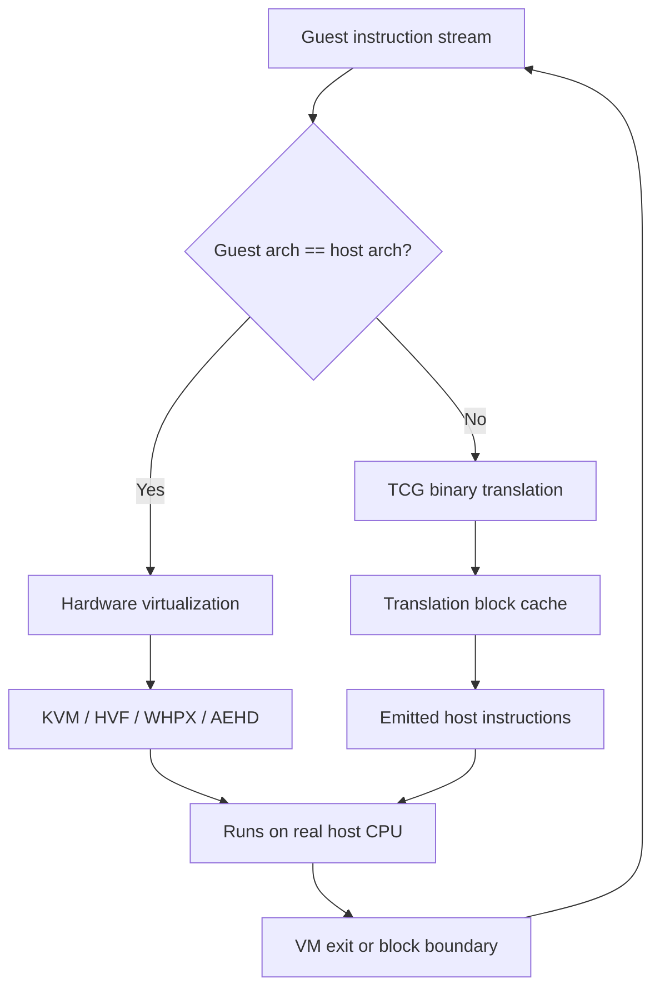
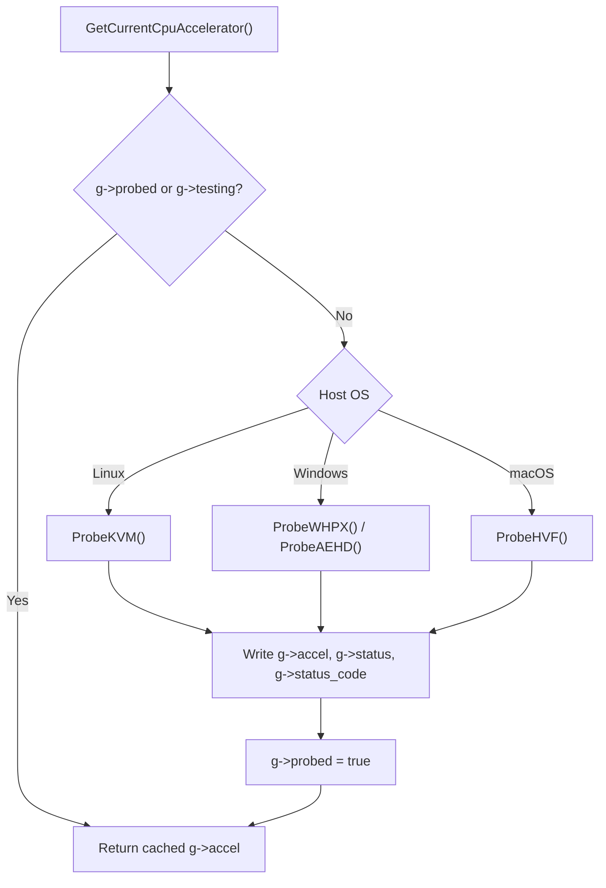
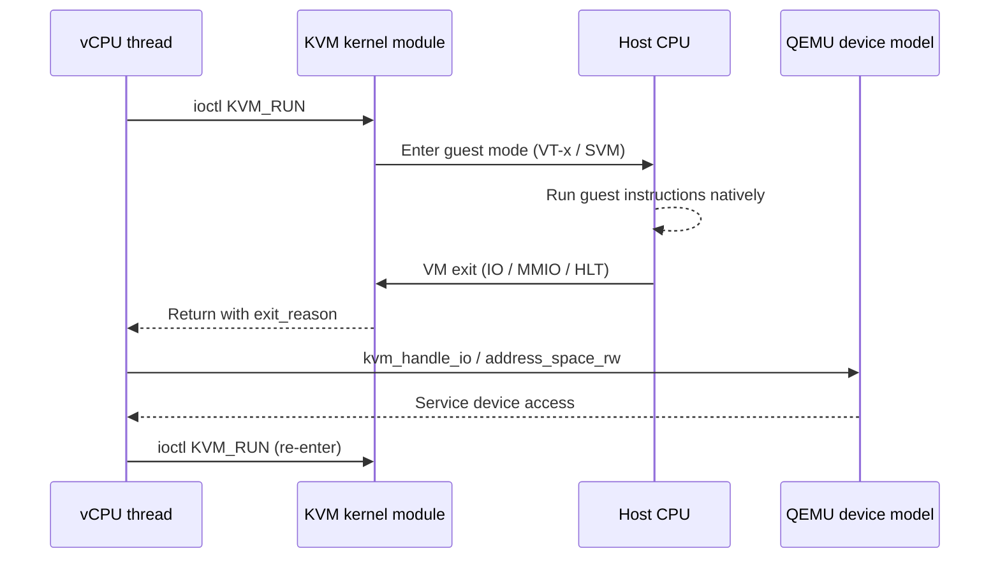
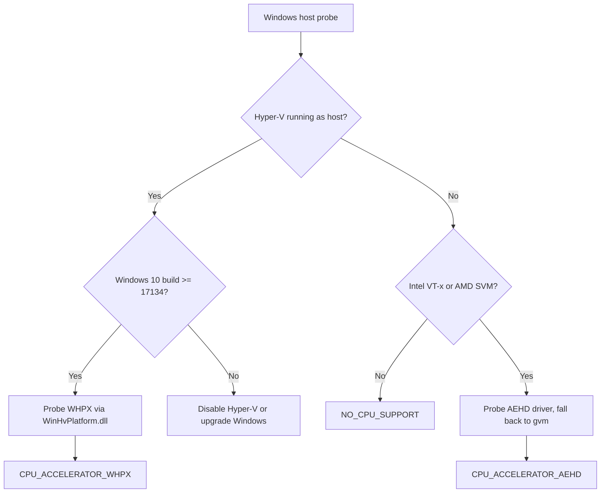
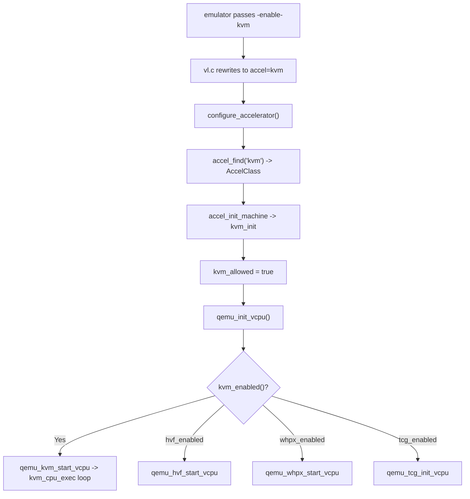
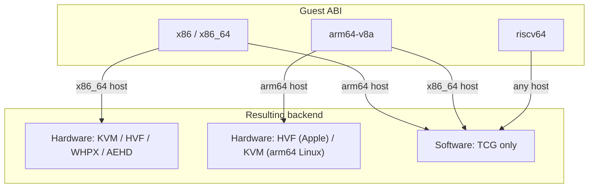

# Chapter 5: CPU Acceleration

The Android Emulator runs a full guest operating system, and the single biggest factor in how fast that guest feels is whether its virtual CPU runs on a hardware hypervisor or under software interpretation. When the host CPU architecture matches the guest (an x86_64 guest on an x86_64 host, an arm64 guest on an Apple Silicon Mac) the emulator hands each virtual CPU directly to the kernel's virtualization extensions and the guest executes at close to native speed. When that match is impossible, QEMU falls back to its Tiny Code Generator (TCG), which translates guest instructions into host instructions block by block. Everything between those two extremes is plumbing: detecting what the host can do, choosing a backend, and wiring QEMU's accelerator interface to the right kernel driver or framework.

This chapter follows that plumbing from the moment the emulator launcher probes the host, through the `CpuAccelerator` capability check in `android-emu`, into QEMU's `configure_accelerator` machinery, and down into each per-platform backend: KVM on Linux, Hypervisor.framework (HVF) on macOS, the Windows Hypervisor Platform (WHPX) and the Android Emulator Hypervisor Driver (AEHD, formerly gvm) on Windows, and the TCG interpreter that backs everything else. It closes with how guest and host CPU architectures interact, which combinations get hardware acceleration, and which fall back to translation.

---

## 5.1 The Two Execution Models

Every virtual CPU in the emulator runs in one of two fundamentally different ways, and the choice is made once, at machine start.

The first model is hardware virtualization. The host CPU has extensions — Intel VT-x, AMD-V/SVM, or the ARMv8 virtualization extensions — that let the kernel run guest code in a less-privileged CPU mode while the host stays in control. Guest instructions run on the real silicon. Only "interesting" events (I/O to a virtual device, an unhandled page fault, a privileged instruction) trap back into the emulator. This is the path KVM, HVF, WHPX, and AEHD all take, and it requires the guest architecture to be the same as the host architecture, because the guest instructions are executed directly.

The second model is dynamic binary translation. QEMU's TCG reads guest instructions, translates them into an intermediate representation, compiles that into host instructions inside a translation block, and caches the result. This works for any guest-on-host combination — an arm64 guest on an x86_64 host, for example — but every guest instruction costs many host instructions, so it is far slower.

### 5.1.1 Where each model lives in the tree

The accelerator backends are split across two directories. Architecture-neutral interpreter and KVM scaffolding lives under `external/qemu/accel/`:

```
external/qemu/accel/kvm/kvm-all.c    KVM ioctl wrapper and run loop
external/qemu/accel/tcg/cpu-exec.c   TCG translation-block dispatch loop
external/qemu/accel/tcg/tcg-all.c    TCG AccelClass registration
external/qemu/accel/accel.c          accelerator selection (configure_accelerator)
external/qemu/accel/stubs/           empty stubs for backends not built
```

The hardware backends that touch x86-specific register state live next to the i386 target in `external/qemu/target/i386/`:

```
external/qemu/target/i386/hvf-all.c    Hypervisor.framework (macOS/Intel)
external/qemu/target/i386/whpx-all.c   Windows Hypervisor Platform
external/qemu/target/i386/aehd-all.c   Android Emulator Hypervisor Driver
external/qemu/target/i386/kvm.c        KVM x86 register sync
```

The arm64 hardware backend for Apple Silicon lives at `external/qemu/target/arm/hvf.c`, and the arm KVM backend at `external/qemu/target/arm/kvm64.c`.

### Two execution paths from guest instruction to host CPU



---

## 5.2 Probing the Host: the CpuAccelerator Module

Before QEMU is even invoked, the emulator launcher decides whether acceleration is possible. That decision is made by the `CpuAccelerator` module in `android-emu`, which is deliberately independent of QEMU so that the standalone `emulator-check` tool (used by Android Studio) can run the same probe without dragging in the whole virtual machine.

The public enum at `external/qemu/android/emu/feature/include/android/emulation/CpuAccelerator.h` lists the supported technologies:

```cpp
// Source: external/qemu/android/emu/feature/include/android/emulation/CpuAccelerator.h
enum CpuAccelerator {
    CPU_ACCELERATOR_NONE = 0,
    CPU_ACCELERATOR_KVM,
    // Deprecated: HAXM is reserved only for metrics compatibility
    CPU_ACCELERATOR_HAX,
    CPU_ACCELERATOR_HVF,
    CPU_ACCELERATOR_WHPX,
    CPU_ACCELERATOR_AEHD,
    CPU_ACCELERATOR_MAX,
};
```

`CPU_ACCELERATOR_HAX` (the Intel HAXM driver) is retained only so that historical metrics still line up — the comment in the header makes that explicit, and no probe in the current code ever returns it.

### 5.2.1 Compile-time platform selection

The implementation in `external/qemu/android/emu/feature/src/android/emulation/CpuAccelerator.cpp` decides which probes even exist at compile time, based on the host OS. There are three host families, each enabling a different set of `HAVE_*` macros:

```cpp
// Source: external/qemu/android/emu/feature/src/android/emulation/CpuAccelerator.cpp
#ifdef __linux__
#define HAVE_KVM 1
#elif defined(_WIN32)
#define HAVE_WHPX 1
#define HAVE_AEHD 1
#elif defined(__APPLE__)
#define HAVE_HVF 1
#ifdef __arm64__
#define APPLE_SILICON 1
#endif
#else
#error "Unsupported host platform!"
#endif
```

So a Linux host only ever considers KVM, a Windows host considers both WHPX and AEHD, and a macOS host considers HVF — with an extra `APPLE_SILICON` flag that changes the CPU checks because Apple's arm64 chips do not have x86 virtualization feature bits to test.

### 5.2.2 The cached global probe

The result of probing is cached in a process-global `GlobalState` so the (potentially slow) detection runs only once:

```cpp
// Source: external/qemu/android/emu/feature/src/android/emulation/CpuAccelerator.cpp
struct GlobalState {
    bool probed;
    bool testing;
    CpuAccelerator accel;
    char status[256];
    char version[256];
    AndroidCpuAcceleration status_code;
    std::array<bool, CPU_ACCELERATOR_MAX> supported_accelerators;
};
```

`GetCurrentCpuAccelerator()` checks `g->probed` first and returns the cached value if the probe already ran. All the public query functions — `GetCurrentCpuAcceleratorStatus()`, `GetCurrentCpuAcceleratorStatusCode()`, `GetCurrentAcceleratorSupport()` — force a probe on first use, then read the cache. The `testing` flag and `SetCurrentCpuAcceleratorForTesting()` exist so unit tests can inject a fixed result without touching real hardware.

### The capability probe and its cached result



---

## 5.3 Status Codes and the C Bridge

The probe does not just answer "yes or no." It returns one of a fixed set of status codes, defined in `external/qemu/android/emu/feature/include/android/cpu_accelerator.h`, and a human-readable string. The status code matters because Android Studio reads it programmatically — the header carries an explicit warning not to renumber the enum:

```c
// Source: external/qemu/android/emu/feature/include/android/cpu_accelerator.h
// don't change these numbers
// Android Studio depends on them
typedef enum {
    ANDROID_CPU_ACCELERATION_READY                = 0,
    ANDROID_CPU_ACCELERATION_NESTED_NOT_SUPPORTED = 1,
    ANDROID_CPU_ACCELERATION_INTEL_REQUIRED       = 2,
    ANDROID_CPU_ACCELERATION_NO_CPU_SUPPORT       = 3,
    // ...
    ANDROID_CPU_ACCELERATION_DEV_NOT_FOUND        = 8,
    ANDROID_CPU_ACCELERATION_DEV_PERMISSION       = 11,
    ANDROID_CPU_ACCELERATION_HYPERV_ENABLED       = 15,
    ANDROID_CPU_ACCELERATION_ERROR                = 138,
} AndroidCpuAcceleration;
```

The C++ `CpuAccelerator` API is exposed to C callers through a thin bridge in `external/qemu/android/emu/feature/src/android/cpu_accelerator.cpp`. This is what the QEMU glue and the `emulator-check` tool actually call:

```cpp
// Source: external/qemu/android/emu/feature/src/android/cpu_accelerator.cpp
AndroidCpuAcceleration androidCpuAcceleration_getStatus(char** status_p) {
    AndroidCpuAcceleration result =
            android::GetCurrentCpuAcceleratorStatusCode();
    if (status_p) {
        *status_p = android::base::strDup(
                android::GetCurrentCpuAcceleratorStatus());
    }
    return result;
}
```

### 5.3.1 emulator-check accel

The `emulator-check` binary at `external/qemu/android/emulator-check/main-emulator-check.cpp` wraps that same call behind the `accel` subcommand. Its handler is a four-line function that returns the status code as the process exit code and the status string as text:

```cpp
// Source: external/qemu/android/emulator-check/main-emulator-check.cpp
static CommandReturn checkCpuAcceleration() {
    char* status = nullptr;
    AndroidCpuAcceleration capability =
            androidCpuAcceleration_getStatus(&status);
    std::string message = status ? status : "";
    free(status);
    return std::make_pair(capability, std::move(message));
}
```

Because this is the exact code Android Studio runs to decide whether to offer a hardware-accelerated AVD, the status string doubles as user-facing advice — on Linux a permission failure returns a multi-line message explaining how to add the user to the `kvm` group, on Windows it explains how to turn Hyper-V off or the Hypervisor Platform feature on.

---

## 5.4 KVM on Linux

On Linux the only hardware backend is KVM, and the probe is the most direct of the four: it checks for `/dev/kvm`, that it is readable, and that its API version is recent enough.

### 5.4.1 The KVM probe

`ProbeKVM` in `CpuAccelerator.cpp` walks a sequence of checks, returning a distinct status code at each failure point. The device path can be overridden through an environment variable, defaulting to `/dev/kvm`:

```cpp
// Source: external/qemu/android/emu/feature/src/android/emulation/CpuAccelerator.cpp
AndroidCpuAcceleration ProbeKVM(std::string* status) {
    const char* kvm_device = getenv(KVM_DEVICE_NAME_ENV);
    if (NULL == kvm_device) {
        kvm_device = "/dev/kvm";
    }
    // Check that kvm device exists.
    if (::android_access(kvm_device, F_OK)) {
        bool cpu_ok = android_get_x86_cpuid_vmx_support() ||
                      android_get_x86_cpuid_svm_support();
        if (!cpu_ok) {
            status->assign("KVM requires a CPU that supports vmx or svm");
            return ANDROID_CPU_ACCELERATION_NO_CPU_SUPPORT;
        }
        // ...
        return ANDROID_CPU_ACCELERATION_DEV_NOT_FOUND;
    }
    // ... R_OK check, open, KVM_GET_API_VERSION ioctl, version compare ...
}
```

If the device is missing, the probe uses CPUID to distinguish "your CPU cannot do this at all" (`NO_CPU_SUPPORT`) from "your CPU can, but the module is not loaded or VT is off in the BIOS" (`DEV_NOT_FOUND`). If the device exists but is not readable, it reads `/etc/group`, looks for the `kvm:` line, and returns `DEV_PERMISSION` with instructions. Finally it opens the device and issues `KVM_GET_API_VERSION`, comparing against the kernel's `KVM_API_VERSION` constant; an older API returns `DEV_OBSOLETE`.

### 5.4.2 Inside QEMU: kvm_init and capability checks

When QEMU itself initializes KVM, `kvm_init` in `external/qemu/accel/kvm/kvm-all.c` opens the device, re-checks the API version, creates a VM with `KVM_CREATE_VM`, and then verifies that the kernel supports a required set of capabilities. The required list is short and architecture-neutral:

```c
// Source: external/qemu/accel/kvm/kvm-all.c
static const KVMCapabilityInfo kvm_required_capabilites[] = {
    KVM_CAP_INFO(USER_MEMORY),
    KVM_CAP_INFO(DESTROY_MEMORY_REGION_WORKS),
    KVM_CAP_INFO(JOIN_MEMORY_REGIONS_WORKS),
    KVM_CAP_LAST_INFO
};
```

`kvm_init` calls `kvm_check_extension_list` against both this list and an architecture-specific `kvm_arch_required_capabilities`; a missing capability aborts initialization with an upgrade note. Optional capabilities (coalesced MMIO, VCPU events, robust single-step, IRQ routing) are probed individually with `kvm_check_extension` and recorded as feature flags, so QEMU adapts to whatever the running kernel offers rather than demanding a fixed feature set.

### 5.4.3 The KVM run loop

Each virtual CPU runs `kvm_cpu_exec`, which is the heart of hardware virtualization. It pushes any dirty register state into the kernel, issues the `KVM_RUN` ioctl, and then dispatches on the exit reason the kernel reports:

```c
// Source: external/qemu/accel/kvm/kvm-all.c
run_ret = kvm_vcpu_ioctl(cpu, KVM_RUN, 0);
// ...
switch (run->exit_reason) {
case KVM_EXIT_IO:
    kvm_handle_io(run->io.port, attrs,
                  (uint8_t *)run + run->io.data_offset,
                  run->io.direction, run->io.size, run->io.count);
    ret = 0;
    break;
case KVM_EXIT_MMIO:
    address_space_rw(&address_space_memory, run->mmio.phys_addr, attrs,
                     run->mmio.data, run->mmio.len, run->mmio.is_write);
    ret = 0;
    break;
// KVM_EXIT_SHUTDOWN, KVM_EXIT_INTERNAL_ERROR, KVM_EXIT_SYSTEM_EVENT, ...
}
```

The guest runs entirely inside `KVM_RUN` on the real CPU until it does something the host must handle — a port I/O instruction (`KVM_EXIT_IO`), an access to memory-mapped device registers (`KVM_EXIT_MMIO`), or a shutdown. Each exit hands control to QEMU's device model, which services the access and re-enters `KVM_RUN`. This trap-and-emulate loop is what makes a virtual device feel like real hardware to the guest while costing the host nothing while the guest is computing.

### The KVM_RUN trap-and-emulate loop



---

## 5.5 Hypervisor.framework on macOS

On macOS the backend is Apple's Hypervisor.framework (HVF). There is no device node to open; instead the probe checks the OS version and, on Intel Macs, the CPU's virtualization features.

### 5.5.1 The HVF probe

`ProbeHVF` parses the macOS product version and requires at least 10.10. On Intel hosts it additionally requires the "modern" x86 virtualization features (EPT and unrestricted-guest), but on Apple Silicon that check is compiled out entirely:

```cpp
// Source: external/qemu/android/emu/feature/src/android/emulation/CpuAccelerator.cpp
AndroidCpuAcceleration ProbeHVF(std::string* status) {
    auto macOsVersion = currentMacOSVersion(status);
    if (macOsVersion < Version(10, 10, 0)) {
        // Hypervisor.Framework is only supported on OS X 10.10 and above
        return ANDROID_CPU_ACCELERATION_NO_CPU_SUPPORT;
    }
#ifndef APPLE_SILICON
    // HVF need EPT and UG
    if (!android::hasModernX86VirtualizationFeatures()) {
        status->assign("CPU doesn't support EPT and/or UG features "
                       "needed for Hypervisor.Framework");
        return ANDROID_CPU_ACCELERATION_NO_CPU_SUPPORT;
    }
#endif
    // HVF supported
    return ANDROID_CPU_ACCELERATION_READY;
}
```

`hasModernX86VirtualizationFeatures()` is a clever shortcut. Detecting EPT and unrestricted-guest properly needs `rdmsr`, which is only available to root, so the code instead checks for CPUID feature bits that shipped at the same time as those features — `popcnt` for EPT, and `aes` plus `pclmulqdq` for unrestricted-guest. If those instruction-set extensions are present, the CPU is new enough to have the virtualization features too.

### 5.5.2 The HVF run loop and arm64

Inside QEMU, the Intel HVF backend is `external/qemu/target/i386/hvf-all.c`, whose `hvf_vcpu_exec` mirrors the KVM loop but talks to the framework directly. It calls `hv_vcpu_run`, then reads the VMCS exit-reason register and dispatches:

```cpp
// Source: external/qemu/target/i386/hvf-all.c
int r = hv_vcpu_run(cpu->hvf_fd);
// ...
uint64_t exit_reason = rvmcs(cpu->hvf_fd, VMCS_EXIT_REASON);
switch (exit_reason) {
    case EXIT_REASON_HLT: { /* ... */ }
    case EXIT_REASON_EPT_FAULT: /* ... */
    case EXIT_REASON_INOUT: /* port I/O */
    case EXIT_REASON_CPUID: { /* ... */ }
    // EXIT_REASON_RDMSR / WRMSR / CR_ACCESS / APIC_ACCESS ...
}
```

For Apple Silicon, the arm64 backend at `external/qemu/target/arm/hvf.c` uses the same framework but the ARM virtualization API — `hv_vm_create(0)` brings up the VM. This is the combination that gives a fast arm64 Android guest on an M-series Mac: an arm64 guest running directly on arm64 silicon.

---

## 5.6 Windows: WHPX and AEHD

Windows is the only host that ships two coexisting backends, and the selection between them is entangled with whether Hyper-V is running.

### 5.6.1 The Hyper-V question

On Windows the probe first calls `GetHyperVStatus()`, which uses CPUID to detect whether the machine is running under a Hyper-V hypervisor and, through the Hyper-V `0x40000003` CPUID leaf, whether this is the host (root) partition. If Hyper-V is running as the host, the only way to accelerate is the Windows Hypervisor Platform, which exposes Hyper-V's facilities to a user-mode VMM. If Hyper-V is not running, the native AEHD driver can take over the CPU directly.

```cpp
// Source: external/qemu/android/emu/feature/src/android/emulation/CpuAccelerator.cpp
auto hvStatus = GetHyperVStatus();
if (hvStatus.first == ANDROID_HYPERV_RUNNING) {
    // ... offer WHPX, requires Windows 10 1803 (build 17134) or later ...
} else {
    // ... CPU vendor check, then ProbeAEHD() ...
}
```

### 5.6.2 The WHPX probe

`ProbeWHPX` does not link against the Hypervisor Platform at build time. It loads `WinHvPlatform.dll` dynamically, resolves `WHvGetCapability`, and queries `WHvCapabilityCodeHypervisorPresent`:

```cpp
// Source: external/qemu/android/emu/feature/src/android/emulation/CpuAccelerator.cpp
hWinHvPlatform = LoadLibraryW(L"WinHvPlatform.dll");
if (hWinHvPlatform) {
    WHvGetCapability_t f_WHvGetCapability =
            (WHvGetCapability_t)GetProcAddress(hWinHvPlatform,
                                               "WHvGetCapability");
    // ...
    hr = f_WHvGetCapability(WHvCapabilityCodeHypervisorPresent,
                            &whpx_cap, sizeof(whpx_cap), &whpx_cap_size);
    if (FAILED(hr) || !whpx_cap.HypervisorPresent) {
        // No accelerator found
    }
}
```

Inside QEMU, `whpx_accel_init` in `external/qemu/target/i386/whpx-all.c` re-runs the same capability query through a dispatch table (`whp_dispatch`) built by `init_whp_dispatch()`, then creates a partition and configures its processor count. The per-CPU loop `whpx_vcpu_run` calls `WHvRunVirtualProcessor` and dispatches on `WHvRunVpExitReason` values — `MemoryAccess`, `X64IoPortAccess`, `X64Halt`, `X64Cpuid`, `X64MsrAccess` — the same trap-and-emulate pattern KVM and HVF use, just with Windows API names.

### 5.6.3 The AEHD probe

AEHD — the Android Emulator Hypervisor Driver — is Google's own kernel-mode hypervisor for Windows, the successor to the older "gvm" driver. The probe first checks that the CPU is an Intel chip with VT-x or an AMD chip with SVM, then tries to open the driver's device, falling back from the new name to the legacy one:

```cpp
// Source: external/qemu/android/emu/feature/src/android/emulation/CpuAccelerator.cpp
ScopedFileHandle aehd(CreateFile("\\\\.\\AEHD", GENERIC_READ | GENERIC_WRITE,
                                0, NULL, CREATE_ALWAYS,
                                FILE_ATTRIBUTE_NORMAL, NULL));
if (aehd.valid())
    goto success;
ScopedFileHandle gvm(CreateFile("\\\\.\\gvm", GENERIC_READ | GENERIC_WRITE,
                                0, NULL, CREATE_ALWAYS,
                                FILE_ATTRIBUTE_NORMAL, NULL));
if (!aehd.valid() && !gvm.valid()) {
    DWORD err = GetLastError();
    if (err == ERROR_FILE_NOT_FOUND) {
        // hypervisor driver is not installed
        return ANDROID_CPU_ACCELERATION_ACCEL_NOT_INSTALLED;
    }
    // ERROR_ACCESS_DENIED -> DEV_PERMISSION, else DEV_OPEN_FAILED
}
```

On success it issues a custom IOCTL, `AEHD_GET_API_VERSION` (defined with `CTL_CODE` and the device type `0xE3E3`), to extract the driver version. The driver's QEMU side is `external/qemu/target/i386/aehd-all.c`, whose `aehd_init` and `aehd_init_vcpu` mirror the KVM structure — AEHD is essentially a KVM-style ioctl interface implemented as a Windows kernel driver, which is why its QEMU integration reads almost identically to `kvm-all.c`. Note one Windows-specific wrinkle: after AEHD is selected, `main.cpp` warns the user if the Vanguard anti-cheat service (`vgk`) is detected, because it conflicts with the driver.

### Windows backend selection



---

## 5.7 The TCG Fallback

When no hardware backend is available — or when the guest architecture does not match the host — QEMU uses TCG. TCG's accelerator registration is the simplest of all backends, in `external/qemu/accel/tcg/tcg-all.c`:

```c
// Source: external/qemu/accel/tcg/tcg-all.c
static int tcg_init(MachineState *ms)
{
    tcg_exec_init(tcg_tb_size * 1024 * 1024);
    cpu_interrupt_handler = tcg_handle_interrupt;
    return 0;
}

static void tcg_accel_class_init(ObjectClass *oc, void *data)
{
    AccelClass *ac = ACCEL_CLASS(oc);
    ac->name = "tcg";
    ac->init_machine = tcg_init;
    ac->allowed = &tcg_allowed;
}
```

`tcg_init` only sizes the translation-block buffer (`tcg_tb_size` megabytes) and installs an interrupt handler. There is no device to open and no capability to check, because TCG runs in user space on top of plain host instructions — it always works.

### 5.7.1 The translation-block dispatch loop

Where KVM's loop issues a single `KVM_RUN` ioctl, TCG's `cpu_exec` in `external/qemu/accel/tcg/cpu-exec.c` runs an inner loop that finds (or translates) one block of guest code at a time and executes it:

```c
// Source: external/qemu/accel/tcg/cpu-exec.c
while (!cpu_handle_exception(cpu, &ret)) {
    TranslationBlock *last_tb = NULL;
    int tb_exit = 0;
    while (!cpu_handle_interrupt(cpu, &last_tb)) {
        uint32_t cflags = cpu->cflags_next_tb;
        TranslationBlock *tb;
        // ...
        tb = tb_find(cpu, last_tb, tb_exit, cflags);
        cpu_loop_exec_tb(cpu, tb, &last_tb, &tb_exit);
        align_clocks(&sc, cpu);
    }
}
```

`tb_find` looks the guest program counter up in the translation-block cache, translating a new block on a miss. `cpu_loop_exec_tb` then jumps into the emitted host code. Blocks are chained together so that, on the common path, control flows from one cached block straight into the next without returning to this loop — which is why a hot loop in the guest only pays the translation cost once. The outer two `while` loops exist to break that chaining whenever an interrupt or exception must be serviced.

---

## 5.8 The Accelerator Interface and Selection

All four hardware backends and TCG plug into one common abstraction, the QEMU `AccelClass`. This is what lets `vl.c` treat "accelerator" as a single concept and pick one by name.

### 5.8.1 AccelClass registration

Each backend registers an `AccelClass` whose key fields are a name, an `init_machine` callback, and an `allowed` flag pointer. KVM's registration is representative:

```c
// Source: external/qemu/accel/kvm/kvm-all.c
static void kvm_accel_class_init(ObjectClass *oc, void *data)
{
    AccelClass *ac = ACCEL_CLASS(oc);
    ac->name = "KVM";
    ac->init_machine = kvm_init;
    ac->allowed = &kvm_allowed;
}
```

WHPX (`whpx_accel_init`, name "WHPX") and AEHD (`aehd_init`, name "AEHD") register the same way, as does HVF on the platforms where it is compiled. Each backend's type name follows the pattern `ACCEL_CLASS_NAME("kvm")`, `ACCEL_CLASS_NAME("tcg")`, and so on.

### 5.8.2 configure_accelerator

At machine startup, `configure_accelerator` in `external/qemu/accel/accel.c` reads the `accel=` machine option (defaulting to `tcg`), splits it on colons to allow a fallback list, and for each name looks up the `AccelClass`, checks its `available()` predicate, and tries to initialize it:

```c
// Source: external/qemu/accel/accel.c
p = accel;
while (!accel_initialised && *p != '\0') {
    if (*p == ':') { p++; }
    p = get_opt_name(buf, sizeof(buf), p, ':');
    acc = accel_find(buf);
    if (!acc) { continue; }
    if (acc->available && !acc->available()) {
        printf("%s not supported for this target\n", acc->name);
        continue;
    }
    ret = accel_init_machine(acc, ms);
    if (ret < 0) {
        init_failed = true;
        error_report("failed to initialize %s: %s",
                     acc->name, strerror(-ret));
    } else {
        accel_initialised = true;
    }
}
```

`accel_init_machine` instantiates the accelerator object, sets `*(acc->allowed) = true`, and calls `init_machine`; this is how `kvm_enabled()`, `hvf_enabled()`, `whpx_enabled()`, and `tcg_enabled()` later become true throughout the codebase.

### 5.8.3 From -enable-kvm to accel=

The emulator launcher never passes `accel=` directly. It passes one of the friendly flags `-enable-kvm`, `-enable-hvf`, `-enable-whpx`, or `-enable-aehd`, and `vl.c` rewrites each into a machine option:

```c
// Source: external/qemu/vl.c
case QEMU_OPTION_enable_kvm:
    olist = qemu_find_opts("machine");
    qemu_opts_parse_noisily(olist, "accel=kvm", false);
    break;
#ifdef CONFIG_HVF
case QEMU_OPTION_enable_hvf:
    olist = qemu_find_opts("machine");
    qemu_opts_parse_noisily(olist, "accel=hvf", false);
    hvf_disable(0);
    break;
#endif
case QEMU_OPTION_enable_whpx:
    qemu_opts_parse_noisily(olist, "accel=whpx", false);
    break;
```

### How -enable-kvm reaches a running vCPU thread



---

## 5.9 How the Launcher Chooses and Spawns vCPUs

Two layers cooperate to pick an accelerator: the architecture-neutral logic in `android-emu` and the QEMU glue in `android-qemu2-glue`.

### 5.9.1 Accel mode parsing

The `-accel <mode>` command-line option accepts `on`, `off`, or `auto`, parsed by `handleCpuAcceleration` in `external/qemu/android/android-emu/android/main-common.c` into a `CpuAccelMode`:

```c
// Source: external/qemu/android/android-emu/android/main-common.h
typedef enum {
    ACCEL_OFF = 0,
    ACCEL_ON = 1,
    ACCEL_AUTO = 2,
    ACCEL_KVM = 3,
    ACCEL_HVF = 5,
    ACCEL_WHPX = 6,
} CpuAccelMode;
```

`-no-accel` is just shorthand for `-accel off`, defined as a flag in `external/qemu/android/emu/cmdline/include/android/cmdline-options.h`. With `auto` (the default), the launcher enables acceleration when the probe says `ANDROID_CPU_ACCELERATION_READY` and silently falls back to TCG otherwise; with `on` it panics if acceleration is unavailable.

### 5.9.2 Mapping the chosen accelerator to a flag

Once a `CpuAccelerator` is chosen, `getAcceleratorEnableParam` in `main-common.c` maps it to the QEMU flag the glue will append:

```c
// Source: external/qemu/android/android-emu/android/main-common.c
const char* getAcceleratorEnableParam(AndroidCpuAccelerator accel_type) {
    switch (accel_type) {
        case ANDROID_CPU_ACCELERATOR_KVM:  return "-enable-kvm";
        case ANDROID_CPU_ACCELERATOR_HVF:  return "-enable-hvf";
        case ANDROID_CPU_ACCELERATOR_WHPX: return "-enable-whpx";
        case ANDROID_CPU_ACCELERATOR_AEHD: return "-enable-aehd";
        default:                           return "";
    }
}
```

In `external/qemu/android-qemu2-glue/main.cpp`, the x86 path calls `handleCpuAcceleration`, fetches the chosen accelerator with `androidCpuAcceleration_getAccelerator()`, and appends the matching flag when accel mode is `ON` or `AUTO`. The aarch64 path is special-cased: on Apple it adds `-enable-hvf` (for API 21+ arm64-v8a images), and on Linux it adds `-enable-kvm`.

### 5.9.3 Per-CPU threads

Once QEMU knows which accelerator is active, `qemu_init_vcpu` in `external/qemu/cpus.c` spawns one thread per virtual CPU and routes it to the right run function based on which `*_enabled()` predicate is true — `qemu_kvm_cpu_thread_fn`, `qemu_hvf_cpu_thread_fn`, `qemu_whpx_cpu_thread_fn`, `qemu_aehd_cpu_thread_fn`, or `qemu_tcg_cpu_thread_fn`. Each thread is named after its accelerator (for example "CPU 0/KVM"), which is what you see if you inspect emulator threads in a debugger.

### 5.9.4 SMP limits

The same glue path also constrains how many cores the AVD gets. If `hasModernX86VirtualizationFeatures()` returns false, multicore guests slow down, so the glue forces `hw_cpu_ncore` to 1. On macOS, hosts with fewer than 6 logical cores are pinned to a single virtual core, and no AVD ever gets more than 6 cores:

```cpp
// Source: external/qemu/android-qemu2-glue/main.cpp
if (hw->hw_cpu_ncore > 6) {
    dwarning("Emulator does not support more than 6 cores. "
             "Number of cores set to 6");
    hw->hw_cpu_ncore = 6;
}
```

---

## 5.10 Guest vs Host CPU Architectures

Hardware acceleration only works when guest and host architectures match, and the emulator's build encodes which guest it targets. The architecture mapping lives in the `TargetInfo` struct in `external/qemu/android-qemu2-glue/main.cpp`, which translates between Android ABI names and QEMU conventions.

### 5.10.1 The TargetInfo table

`TargetInfo` carries the Android arch name, the QEMU arch name (used to find the `qemu-system-<arch>` binary), and the QEMU `-cpu` model. The table is selected at compile time by `TARGET_*` macros:

```cpp
// Source: external/qemu/android-qemu2-glue/main.cpp
const TargetInfo kTarget = {
#ifdef TARGET_ARM64
        "arm64", "aarch64",
#if defined(__aarch64__)
#ifdef __APPLE__
        "cortex-a53",
#else
        "host",
#endif
#else
        "cortex-a57",
#endif
        // ...
#elif defined(TARGET_X86_64)
        "x86_64", "x86_64", "android64",
        // ...
#endif
};
```

The `-cpu` value reveals the acceleration story. For an arm64 guest on an arm64 host the model is `host` (on Linux) or `cortex-a53` (on Apple) — a real CPU passed through. For an arm64 guest on an x86_64 host the model is `cortex-a57`, a synthetic model that only TCG can emulate. For x86_64 guests the model is the custom `android64`.

### 5.10.2 The accelerated combinations

In practice the emulator accelerates only the matching-architecture cases:

1. x86 and x86_64 guests on an x86_64 host, via KVM (Linux), HVF (Intel Mac), or WHPX/AEHD (Windows).
2. arm64 guests on an arm64 host, via HVF on Apple Silicon or KVM on an arm64 Linux host.
3. Everything else (an arm64 guest on x86_64, or an x86 guest on an arm64 Mac) runs under TCG.

This is why an x86_64 system image is the standard recommendation on x86 development machines and an arm64 image is the fast choice on Apple Silicon: only the matching ABI gets a hypervisor.

### 5.10.3 What about riscv64?

QEMU upstream carries a complete RISC-V target — `external/qemu/target/riscv/` with its own `cpu.c` and `translate.c`, and `external/qemu/default-configs/riscv64-softmmu.mak` builds a `qemu-system-riscv64`. But that target has no `kvm.c` or `hvf.c`, and the Android glue's `TargetInfo` table has no riscv64 case at all (it covers arm64, arm, mips64, mips, x86_64, and i386). So while QEMU can interpret riscv64 guest code through TCG, the Android Emulator product does not ship a riscv64 device, and there is no hardware-accelerated path for it — RISC-V would be a pure TCG guest.

### Guest-to-host architecture acceleration matrix



---

## 5.11 Try It

These commands assume the emulator command-line tools are on your `PATH`.

1. Ask the emulator-check tool what your host supports. The status string explains any failure:

```bash
emulator-check accel
```

2. Print the CPU model information the probe collected (vendor, virtualization support, bare-metal vs VM, 32/64-bit):

```bash
emulator-check cpu-info
```

3. Launch an AVD with verbose init logging and watch the accelerator selection lines ("Selecting KVM for CPU acceleration", "Host can use CPU acceleration"):

```bash
emulator -avd <your_avd> -verbose -show-kernel
```

4. Force software translation to feel the difference, then compare boot time against the default:

```bash
emulator -avd <your_avd> -accel off
```

5. On Linux, confirm KVM is present and that your user can open it (the same checks `ProbeKVM` runs):

```bash
ls -l /dev/kvm
getent group kvm
```

6. On Windows, check whether the Hypervisor Platform feature is installed (the same DISM query `emulator-check whpx` runs):

```bash
emulator-check whpx
```

7. Inspect which `-cpu` model your build targets by reading the verbose command line the launcher constructs:

```bash
emulator -avd <your_avd> -verbose 2>&1 | grep -- "-cpu"
```

---

## Summary

- The emulator runs each virtual CPU either through a host hypervisor (near-native) or through QEMU's TCG binary translator (portable but slow); the choice is made once at machine start.
- The `CpuAccelerator` module in `external/qemu/android/emu/feature/src/android/emulation/CpuAccelerator.cpp` probes the host independently of QEMU, caches the result in a process-global state, and is the same code the standalone `emulator-check accel` tool runs for Android Studio.
- Each host OS compiles in a different set of probes: KVM on Linux, HVF on macOS (with an `APPLE_SILICON` variation), and both WHPX and AEHD on Windows; HAXM remains only as a deprecated metrics enum value.
- The probe returns a stable numeric `AndroidCpuAcceleration` status code (Android Studio depends on the numbers) plus a human-readable string that doubles as remediation advice.
- KVM, HVF, WHPX, and AEHD all use the same trap-and-emulate pattern: run the guest natively until a VM exit (I/O, MMIO, HLT, CPUID), service it in QEMU's device model, and re-enter.
- On Windows the backend choice hinges on Hyper-V: if Hyper-V is the host, only WHPX works (Windows 10 build 17134+); otherwise the native AEHD driver (legacy name gvm) takes the CPU directly.
- All backends register a QEMU `AccelClass` with a name and an `init_machine` callback; `configure_accelerator` in `external/qemu/accel/accel.c` selects one by the `accel=` option, which the launcher's `-enable-kvm`/`-enable-hvf`/`-enable-whpx`/`-enable-aehd` flags rewrite into.
- Hardware acceleration requires matching guest and host architectures; the `TargetInfo` table in `android-qemu2-glue/main.cpp` encodes the target, and only x86 on x86_64 and arm64 on arm64 are accelerated — everything else, including riscv64, falls back to TCG.

### Key Source Files

| File | Purpose |
|------|---------|
| `external/qemu/android/emu/feature/src/android/emulation/CpuAccelerator.cpp` | Host capability probes for KVM, HVF, WHPX, AEHD |
| `external/qemu/android/emu/feature/include/android/cpu_accelerator.h` | Stable status-code and accelerator enums used by Android Studio |
| `external/qemu/android/emulator-check/main-emulator-check.cpp` | `emulator-check accel` and related host checks |
| `external/qemu/accel/accel.c` | `configure_accelerator` and `AccelClass` selection |
| `external/qemu/accel/kvm/kvm-all.c` | KVM init, capability checks, and `kvm_cpu_exec` run loop |
| `external/qemu/accel/tcg/cpu-exec.c` | TCG translation-block dispatch loop |
| `external/qemu/accel/tcg/tcg-all.c` | TCG `AccelClass` registration |
| `external/qemu/target/i386/hvf-all.c` | Intel HVF backend and `hvf_vcpu_exec` |
| `external/qemu/target/arm/hvf.c` | Apple Silicon arm64 HVF backend |
| `external/qemu/target/i386/whpx-all.c` | Windows Hypervisor Platform backend |
| `external/qemu/target/i386/aehd-all.c` | Android Emulator Hypervisor Driver backend |
| `external/qemu/cpus.c` | Per-vCPU thread creation and `qemu_init_vcpu` dispatch |
| `external/qemu/android-qemu2-glue/main.cpp` | Accel flag selection and `TargetInfo` arch mapping |
| `external/qemu/android/android-emu/android/main-common.c` | `handleCpuAcceleration` and `getAcceleratorEnableParam` |
