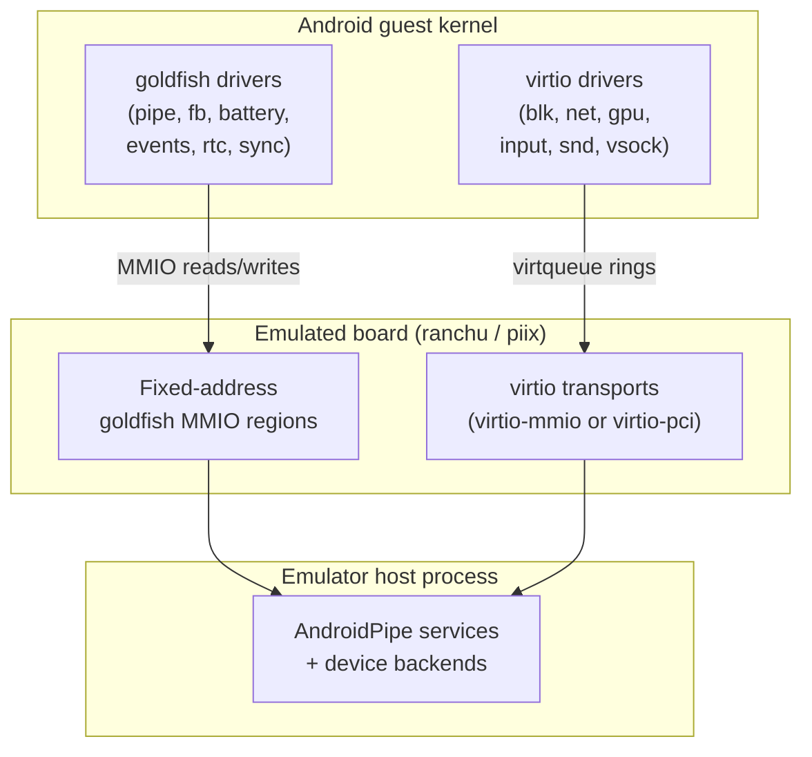
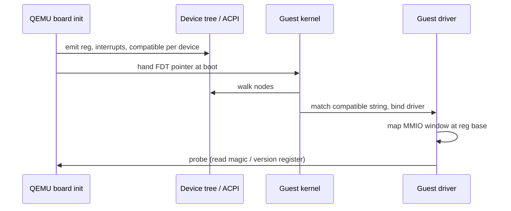
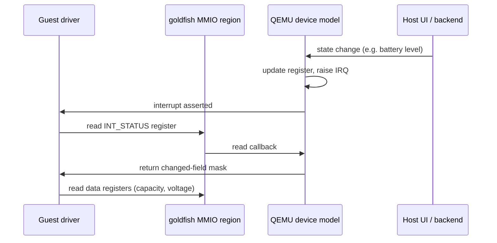
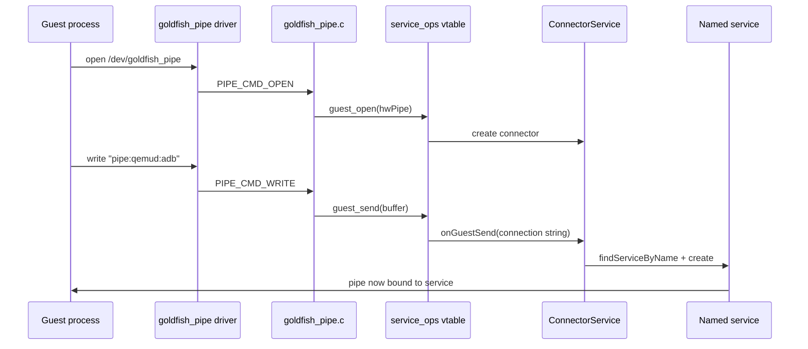
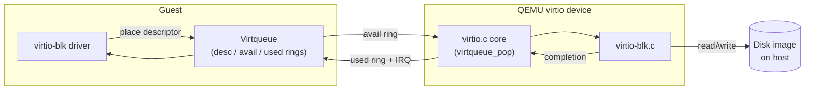
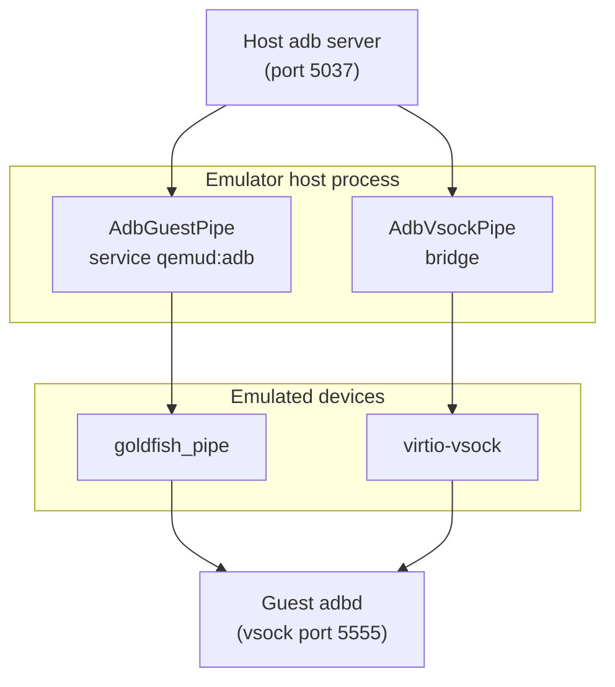
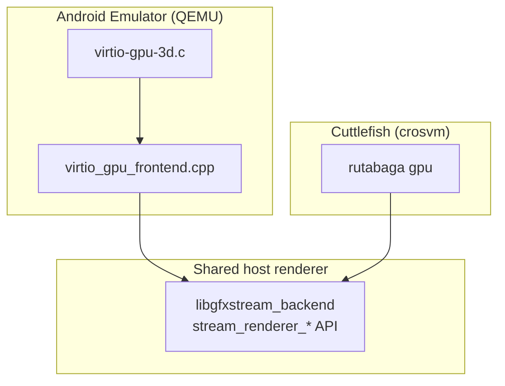

# Chapter 6: Virtual Hardware and virtio

A virtual machine is only as useful as the hardware it pretends to have. When the Android guest boots inside the emulator, it probes a bus, finds a framebuffer, a battery, an input device, a clock, a block device for `/system`, and a network card — none of which physically exist. The emulator's job is to make every one of those probes succeed and to make the guest's reads and writes behave exactly as a real device would, while routing the actual work back to the host process.

The Android emulator builds its guest hardware from two families of device. The older family is **goldfish**: a set of simple memory-mapped registers invented for the emulator, descended from the original 32-bit "goldfish" board, used for the framebuffer, battery, input, RTC, audio, and — most importantly — the `goldfish_pipe` transport that carries graphics, adb, and sensor traffic. The newer family is **virtio**, the standard paravirtualized device model shared across the entire Linux virtualization ecosystem, used for block storage, networking, GPU, input, sound, and socket transport. This chapter walks through both families, the device tree and memory map that advertise them to the guest, the pipe transport that underpins the host-side services, and how the virtio half is shared verbatim with the crosvm-based Cuttlefish device.

---

## 6.1 Two Device Families on One Board

The emulator's QEMU fork wires devices differently depending on the guest architecture, but the conceptual split is the same on every board: a handful of Android-specific goldfish devices sit at fixed addresses, and a bank of generic virtio transports sits next to them.

On 64-bit ARM the board is called **ranchu**, defined in `external/qemu/hw/arm/ranchu.c`. Its header comment states the design directly: "The board has a mixture of virtio devices and some Android-specific devices inherited from the 32 bit 'goldfish' board" (`external/qemu/hw/arm/ranchu.c:20`). On x86 and x86_64 the board is a modified PC (i440FX) defined in `external/qemu/hw/i386/pc_piix.c`, where the goldfish devices are added under a `CONFIG_ANDROID` guard at `external/qemu/hw/i386/pc_piix.c:260`.

The two families differ in how much the guest has to know in advance:

- A **goldfish** device is just a window of MMIO registers at a fixed physical address plus one interrupt line. The guest driver hard-codes the register layout. There is no discovery protocol; the address comes from the device tree (ARM) or ACPI tables (x86).
- A **virtio** device is discovered through a transport — virtio-mmio on ranchu, virtio-pci on x86 — that exposes a standard register block. The guest reads a magic value, negotiates feature bits, sets up shared-memory rings, and only then knows what kind of device it is talking to.

### 6.1.1 Why both still exist

virtio is the modern standard, so why keep goldfish at all? Because several emulator features have no clean virtio equivalent and predate the virtio versions that do exist. The `goldfish_pipe` transport (Section 6.4) carries the GLES/Vulkan command stream, adb, and sensor data through a custom fast path that the host services were built around years before virtio-gpu and virtio-vsock matured. `goldfish_sync` (Section 6.3.4) implements host-driven fence timelines for graphics that map awkwardly onto virtio. Rather than rewrite the entire host stack, the emulator keeps the goldfish devices for these legacy paths and uses virtio for the commodity devices (disk, net, sound) where the standard fits cleanly. The `goldfish_pipe.c` source even flags this tension in an "Open Questions" comment, noting that the pipes could in principle be rewritten on top of virtio (`external/qemu/hw/misc/goldfish_pipe.c:24`).

### Diagram: the two device families seen by the Android guest



## 6.2 The Memory Map and Device Tree

Before the guest can touch any device it has to know where the device lives. The ARM and x86 boards solve this differently, but both publish a static map that the kernel consumes at boot.

### 6.2.1 The ranchu memory map (ARM)

On ranchu the entire address layout is a single table in `external/qemu/hw/arm/ranchu.c:106`. The comment block above it lays out the philosophy: low memory is reserved for a boot ROM, a middle band holds device MMIO, a window is reserved for possible future PCI, and RAM starts at 1 GB and can spill above 4 GB (`external/qemu/hw/arm/ranchu.c:94`).

```c
// Source: external/qemu/hw/arm/ranchu.c
static const MemMapEntry memmap[] = {
    [RANCHU_FLASH]            = { 0,          0x8000000 },
    [RANCHU_GIC_DIST]         = { 0x8000000,  0x10000 },
    [RANCHU_UART]             = { 0x9000000,  0x1000 },
    [RANCHU_GOLDFISH_FB]      = { 0x9010000,  0x100 },
    [RANCHU_GOLDFISH_BATTERY] = { 0x9020000,  0x1000 },
    [RANCHU_GOLDFISH_AUDIO]   = { 0x9030000,  0x100 },
    [RANCHU_GOLDFISH_EVDEV]   = { 0x9040000,  0x1000 },
    [RANCHU_MMIO]             = { 0xa000000,  0x200 },
    [RANCHU_GOLDFISH_PIPE]    = { 0xa010000,  0x2000 },
    [RANCHU_GOLDFISH_SYNC]    = { 0xa020000,  0x2000 },
    [RANCHU_MEM]              = { 0x40000000, 30ULL * 1024 * 1024 * 1024 },
};
```

A parallel `irqmap[]` at `external/qemu/hw/arm/ranchu.c:126` assigns each device its GIC SPI line: the UART is IRQ 1, the framebuffer 2, the battery 3, audio 4, events 5, the pipe 6, and sync 7. The virtio transports start at IRQ 16 and run upward.

### 6.2.2 The x86 goldfish defs

On x86 the goldfish addresses cannot live in the dynamic ranchu table because the PC machine model and the ACPI tables both need the same numbers. They are instead defined once in a header shared between C and ACPI ASL, `external/qemu/include/hw/acpi/goldfish_defs.h`. The comment explains the convention: I/O memory uses `0xff001000` and above, interrupts use lines 16 through 24 (`external/qemu/include/hw/acpi/goldfish_defs.h:18`).

```c
// Source: external/qemu/include/hw/acpi/goldfish_defs.h
#define GOLDFISH_PIPE_IOMEM_BASE      0xff001000
#define GOLDFISH_PIPE_IOMEM_SIZE      0x00002000
#define GOLDFISH_PIPE_IRQ             18

#define GOLDFISH_BATTERY_IOMEM_BASE   0xff010000
#define GOLDFISH_EVENTS_IOMEM_BASE    0xff011000
#define GOLDFISH_FB_IOMEM_BASE        0xff012000
#define GOLDFISH_AUDIO_IOMEM_BASE     0xff013000
#define GOLDFISH_SYNC_IOMEM_BASE      0xff014000
#define GOLDFISH_RTC_IOMEM_BASE       0xff016000
```

The same header also describes the `goldfish_address_space` PCI device — a memory-sharing device used by the graphics path — with vendor ID `0x607D`, device ID `0xF153`, on PCI slot 11 (`external/qemu/include/hw/acpi/goldfish_defs.h:64`). Notice that x86 has a `goldfish_rtc` and a `goldfish_rotary` that the ranchu table does not need, because ARM gets its real-time clock and wall-clock time from the ARM architected timer and a virtio path instead.

### 6.2.3 Building the device tree

On ARM the kernel learns the memory map from a flattened device tree (FDT) that QEMU builds at boot. `ranchu_init()` calls `create_fdt()` (`external/qemu/hw/arm/ranchu.c:143`), then each device-creation helper adds its own node. `create_simple_device()` adds one `reg` tuple and one `interrupts` entry plus a `compatible` string so the kernel can bind the matching driver (`external/qemu/hw/arm/ranchu.c:413`). For example, the pipe device is created with two NUL-separated compatible strings, `"google,android-pipe"` and `"generic,android-pipe"` (`external/qemu/hw/arm/ranchu.c:562`).

The virtio transports are added in a deliberately reversed loop. `create_virtio_devices()` first instantiates all 32 transports in forward address order so command-line devices land at the lowest addresses, then walks them in reverse to emit the FDT nodes so the finished tree lists them lowest-address-first — the order the comment at `external/qemu/hw/arm/ranchu.c:440` documents.

```c
// Source: external/qemu/hw/arm/ranchu.c
for (i = 0; i < NUM_VIRTIO_TRANSPORTS; i++) {
    int irq = irqmap[RANCHU_MMIO] + i;
    hwaddr base = memmap[RANCHU_MMIO].base + i * size;
    sysbus_create_simple("virtio-mmio", base, pic[irq]);
}
```

There is a second, separate device tree blob used at the Android level. `external/qemu/android-qemu2-glue/dtb.cpp` builds a tiny DTB describing the Android `fstab` — a `/firmware/android/fstab/vendor` node with `compatible = "android,vendor"`, the vendor partition device path, `type = "ext4"`, and mount flags `"noatime,ro,errors=panic"` (`external/qemu/android-qemu2-glue/dtb.cpp:46`). This is how the first-stage init knows where to find and how to mount the vendor image; it is generated per-AVD by `createDtbFile()`.

### Diagram: how the guest discovers devices at boot



## 6.3 The Goldfish Legacy Devices

Each goldfish device is a small block of registers. The guest driver writes a command or a buffer address into a register; the QEMU model reacts and may raise the device's interrupt. There is no ring, no feature negotiation — just memory-mapped reads and writes. The following sections cover the five legacy devices named in this chapter's scope.

### 6.3.1 goldfish_battery

The battery model lives in `external/qemu/hw/misc/goldfish_battery.c`. Its register map is an enum at the top of the file: `BATTERY_AC_ONLINE`, `BATTERY_STATUS`, `BATTERY_HEALTH`, `BATTERY_CAPACITY`, `BATTERY_VOLTAGE`, `BATTERY_TEMP`, and more (`external/qemu/hw/misc/goldfish_battery.c:22`). When the host UI changes the simulated charge level or AC state, the model updates these registers and asserts the interrupt; the guest's power supply driver reads them back and reports them up to the framework. A `BATTERY_INT_STATUS` register reports which fields changed and `BATTERY_INT_ENABLE` gates the interrupt.

### 6.3.2 goldfish_events

`external/qemu/hw/input/goldfish_events.c` is the legacy input device — it feeds keyboard, touchscreen, and button events into the guest as Linux `input_event` records. The QEMU type name is `"goldfish-events"` (`external/qemu/hw/input/goldfish_events.c:435`), and at realize time it registers itself with QEMU's input subsystem through `qemu_input_handler_register()` and `qemu_add_mouse_event_handler()` (`external/qemu/hw/input/goldfish_events.c:709`). It carries an Android-specific keycode table (`hw/input/android_keycodes.h`) and maps multitouch axes — the file defines `MTS_TOUCH_AXIS_RANGE_MAX`, `MTS_PRESSURE_RANGE_MAX`, and friends near the top. The board advertises it with compatible string `"google,goldfish-events-keypad"` (`external/qemu/hw/arm/ranchu.c:560`).

### 6.3.3 goldfish_rtc and goldfish_timer

`external/qemu/hw/timer/goldfish_timer.c` actually defines two devices. The timer half exposes `TIMER_TIME_LOW`/`TIMER_TIME_HIGH` for reading the current nanosecond clock and `TIMER_ALARM_LOW`/`TIMER_ALARM_HIGH` plus `TIMER_IRQ_ENABLED` for scheduling alarm interrupts (`external/qemu/hw/timer/goldfish_timer.c:20`). The RTC half is registered under the type name `"goldfish_rtc"` (`external/qemu/hw/timer/goldfish_timer.c:51`) and provides the wall-clock time. The RTC has its own save/load versioning — `GOLDFISH_RTC_SAVE_VERSION` — so its state survives a snapshot. On x86 this device is instantiated at `GOLDFISH_RTC_IOMEM_BASE`; on ranchu the guest gets time from the ARM architected timer instead, which is why ranchu's memmap has no RTC entry.

### 6.3.4 goldfish_sync

`external/qemu/hw/misc/goldfish_sync.c` is the most specialized of the legacy devices. It exists to give the graphics stack host-controlled fence timelines: the host (the GL/Vulkan renderer) can create a sync timeline, increment it, and signal the guest when GPU work completes, so the guest can release buffers at the right moment. The device speaks a small batch-command protocol. Commands flowing host-to-guest use `struct goldfish_sync_batch_cmd` (handle, host command handle, command, time argument) and guest-to-host commands use `struct goldfish_sync_batch_guestcmd` (`external/qemu/hw/misc/goldfish_sync.c:31`). The QEMU type name is `"goldfish_sync"` (`external/qemu/hw/misc/goldfish_sync.c:218`) and it participates in snapshot save/load via `migration/register.h`.

### 6.3.5 goldfish_pipe

The pipe device is important enough to get its own section — see Section 6.4. Briefly, it is the goldfish device at `0xa010000` on ranchu and `0xff001000` on x86 that multiplexes dozens of host services (graphics, adb, sensors, clipboard) over a single MMIO window.

### Diagram: a goldfish device register transaction



## 6.4 The qemu_pipe Transport

The single most load-bearing piece of emulator hardware is the pipe. The guest opens a pipe, writes a service name, and from then on the pipe is a bidirectional byte stream to a host-side service. This is how OpenGL ES and Vulkan commands, the adb stream, sensor data, the clipboard, and logcat all reach the host. The device file comment captures its history: originally called `goldfish_pipe` and later `qemu_pipe`, it "allows the android running under the emulator to open a fast connection to the host for various purposes including the adb debug bridge" (`external/qemu/hw/misc/goldfish_pipe.c:16`).

### 6.4.1 The hardware side

The device model is `external/qemu/hw/misc/goldfish_pipe.c`. Its register layout is a `PipeRegs` enum that must match the guest kernel driver byte-for-byte — the comment points at `drivers/platform/goldfish/goldfish_pipe*` in the goldfish kernel (`external/qemu/hw/misc/goldfish_pipe.c:88`). The guest issues commands from a `PipeCmd` enum: `PIPE_CMD_OPEN`, `PIPE_CMD_CLOSE`, `PIPE_CMD_POLL`, `PIPE_CMD_WRITE`, `PIPE_CMD_READ`, the `WAKE_ON_*` variants, and the DMA commands `PIPE_CMD_DMA_MAPHOST`/`PIPE_CMD_DMA_UNMAPHOST` (`external/qemu/hw/misc/goldfish_pipe.c:126`). The device is at protocol version 2 and accepts driver versions up to 4 (`external/qemu/hw/misc/goldfish_pipe.c:149`).

When the guest writes a `PIPE_CMD_READ` or `PIPE_CMD_WRITE`, the device translates the guest physical address into a host pointer with `map_guest_buffer()` (`external/qemu/hw/misc/goldfish_pipe.c:629`) and hands the buffer to the host service. The device raises and lowers its interrupt with `qemu_set_irq(dev->ps->irq, ...)` as host data becomes available or is consumed (`external/qemu/hw/misc/goldfish_pipe.c:479` and `:703`).

### 6.4.2 The service-ops indirection

The QEMU device never knows what a "service" is. It calls through a vtable, `GoldfishPipeServiceOps`, installed by `goldfish_pipe_set_service_ops()` (`external/qemu/hw/misc/goldfish_pipe.c:208`). Until something installs real ops, a default `s_null_service_ops` force-closes every pipe and logs that a service was never registered (`external/qemu/hw/misc/goldfish_pipe.c:197`). When the guest opens a pipe, the device calls `service_ops->guest_open(pipe)` to create the host endpoint (`external/qemu/hw/misc/goldfish_pipe.c:525`); reads and writes call `guest_recv` and `guest_send`.

The glue that fills in those ops is `external/qemu/android-qemu2-glue/emulation/android_pipe_device.cpp`, which defines a `goldfish_pipe_service_ops` struct forwarding each callback into the android-emu pipe layer — `guest_open` becomes `android_pipe_guest_open`, `guest_recv` becomes `android_pipe_guest_recv`, and so on — then calls `goldfish_pipe_set_service_ops(&goldfish_pipe_service_ops)` (`external/qemu/android-qemu2-glue/emulation/android_pipe_device.cpp:55` and `:202`).

### 6.4.3 The connector protocol and service dispatch

On the android-emu side, the abstract base class is `android::AndroidPipe`, declared in `hardware/google/aemu/host-common/include/host-common/AndroidPipe.h`. Its header documents the lifecycle: register an `AndroidPipe::Service` for each named service, and when a guest connects, the service's `create()` method runs on the device thread (`hardware/google/aemu/host-common/include/host-common/AndroidPipe.h:57`).

The first thing a freshly opened pipe sees is not a service — it is a `ConnectorService`. The connector reads the connection string the guest writes, which must start with `pipe:` (`external/qemu/android/emu/hardware/src/android/emulation/AndroidPipe.cpp:206`). The accepted formats are `pipe:<name>` or `pipe:<name>:<arguments>`. There is a special case for the `qemud:` prefix: the connector first looks for a full service named `qemud:<name>` and falls back to plain `qemud` if none exists, which is how the fast dedicated adb service (`qemud:adb`) coexists with the generic qemud multiplexer (`external/qemu/android/emu/hardware/src/android/emulation/AndroidPipe.cpp:217`). Once the name resolves, the connector calls `svc->create()` and swaps itself out for the real pipe instance (`external/qemu/android/emu/hardware/src/android/emulation/AndroidPipe.cpp:260`).

### 6.4.4 Which services register

The roster of pipe services is installed in `android_emulation_setup()` in `external/qemu/android/android-emu/android/qemu-setup.cpp:424`. Among them:

- `android_pipe_add_type_zero()`, `_pingpong()`, `_throttle()` — test and benchmark pipes (`qemu-setup.cpp:426`).
- `android_init_opengles_pipe()` — the GLES/Vulkan command stream (`qemu-setup.cpp:431`). Its receive mode is set to virtio-gpu, android, or fuchsia depending on feature flags (`qemu-setup.cpp:433`).
- `android_init_clipboard_pipe()` and `android_init_logcat_pipe()` — clipboard sync and log streaming (`qemu-setup.cpp:441`).
- `android_init_multi_display_pipe()`, `android_init_qemu_misc_pipe()`, and the fake-camera sensor pipe (`qemu-setup.cpp:460`).
- The adb service, registered through `android_adb_service_init()` under the name `"qemud:adb"` — the `AdbGuestPipe::Service` constructor passes exactly that string to its base (`external/qemu/android/android-emu/android/emulation/AdbGuestPipe.h:90`).

### Diagram: opening a named pipe service end to end



## 6.5 The virtio Devices

virtio is the standard. Instead of bespoke registers, a virtio device exposes a config block and one or more **virtqueues** — ring buffers in guest memory through which the driver and device exchange buffer descriptors. The emulator's QEMU fork carries the full virtio device set in `external/qemu/hw/virtio/` and the device-specific implementations across `hw/block`, `hw/net`, `hw/display`, `hw/input`, and `hw/audio`.

### 6.5.1 The transport and the core

Two transports carry virtio in the emulator. On ranchu it is **virtio-mmio** (`external/qemu/hw/virtio/virtio-mmio.c`); the guest reads the magic value `0x74726976` — the ASCII bytes `'virt'` — at the `VIRTIO_MMIO_MAGIC_VALUE` register to confirm a virtio device is present (`external/qemu/hw/virtio/virtio-mmio.c:56`). On x86 it is **virtio-pci** (`external/qemu/hw/virtio/virtio-pci.c`). Both sit on top of the same device-independent core in `external/qemu/hw/virtio/virtio.c`, which implements the ring mechanics: `VRingDesc` descriptors (`external/qemu/hw/virtio/virtio.c:34`), `vring_desc_read()` to pull a descriptor out of guest memory, and the `virtqueue_pop`/`virtqueue_push` pair that devices use to take a request and return a completion.

### 6.5.2 virtio-blk and virtio-net

The block device, `external/qemu/hw/block/virtio-blk.c`, backs the guest's `/system`, `/vendor`, `/data`, and other partitions; it has an optional data-plane variant in `hw/block/dataplane/virtio-blk.c` for handling I/O off the main loop. The network device, `external/qemu/hw/net/virtio-net.c`, is the guest's primary NIC and connects to the host through the user-mode networking stack covered in the connectivity chapter. Both are stock virtio devices: the guest negotiates feature bits, sets up a request queue, and exchanges descriptor chains.

### 6.5.3 virtio-gpu

`external/qemu/hw/display/virtio-gpu.c`, with its 3D companion `virtio-gpu-3d.c` and the `virtio-gpu-pci.c`/`virtio-vga.c` transports, is the standard accelerated display path. The 3D variant forwards rendering commands to the host renderer rather than rasterizing in the guest. This is the device that the gfxstream renderer plugs into, and Section 6.7 shows how the very same renderer interface is what crosvm uses for Cuttlefish.

### 6.5.4 virtio-input and virtio-snd

`external/qemu/hw/input/virtio-input.c` and its HID companion `virtio-input-hid.c` are the modern replacement for goldfish_events — they present standard `evdev` devices to the guest. `external/qemu/hw/audio/virtio-snd.c` is the virtio sound device, the modern counterpart to goldfish_audio. It implements the full virtio-sound control protocol: a union of request structures including `virtio_snd_query_info`, `virtio_snd_pcm_set_params`, and `virtio_snd_pcm_hdr` (`external/qemu/hw/audio/virtio-snd.c:73`), plus static tables describing the jacks, PCM streams, and channel maps it advertises (`external/qemu/hw/audio/virtio-snd.c:154`). Whether the guest gets goldfish_audio or virtio-snd depends on the system image and feature flags.

### Diagram: a virtio block request through the virtqueue



## 6.6 vsock and the adb Path

`vsock` (virtio socket) gives the host and guest a socket-like transport addressed by a context ID (CID) and a port, with no IP stack in between. The emulator uses it as a modern alternative to the goldfish-pipe-based adb path.

The device model is `external/qemu/hw/virtio/virtio-vsock.c`. It carries a `guest-cid` property that uniquely identifies the guest endpoint (`external/qemu/hw/virtio/virtio-vsock.c:35`) and rejects an unset or invalid CID at realize time (`external/qemu/hw/virtio/virtio-vsock.c:77`).

On the host side, `external/qemu/android/android-emu/android/emulation/AdbVsockPipe.cpp` bridges the guest's adb daemon to the host's adb server. It talks to the device through a small `virtio_vsock_device_ops_t` vtable of `open`, `send`, `ping`, and `close` callbacks. Until a real backend installs ops, an `empty_ops` set returns failure for everything (`external/qemu/android/android-emu/android/emulation/AdbVsockPipe.cpp:47`); the real backend swaps them in through `virtio_vsock_device_set_ops()` (`external/qemu/android/android-emu/android/emulation/AdbVsockPipe.cpp:60`). The bridge connects to the guest's adbd by opening a vsock stream to port 5555, the constant `kGuestAdbdPort` (`external/qemu/android/android-emu/android/emulation/AdbVsockPipe.h:34`), then shuttles bytes between that stream and the host adb socket (`external/qemu/android/android-emu/android/emulation/AdbVsockPipe.cpp:505`).

So the emulator has **two** adb transports: the legacy `qemud:adb` pipe service (Section 6.4.4) and the newer virtio-vsock bridge. Which one is active depends on the guest image and feature configuration, but from the host adb server's point of view they look identical.

### Diagram: the two adb transports



## 6.7 Sharing virtio with crosvm and Cuttlefish

The Android team ships two virtual devices: the QEMU-based emulator (this book's main subject) and the crosvm-based **Cuttlefish**. They are different VMMs written in different languages — QEMU in C, crosvm in Rust — yet they share the most complex piece of virtual hardware: the GPU renderer.

The shared seam is the **gfxstream** renderer, which lives in `hardware/google/gfxstream/`. Its public entry point is the C header `hardware/google/gfxstream/host/include/gfxstream/virtio-gpu-gfxstream-renderer.h`, described in its own comment as "An implementation of virtio-gpu-3d that streams rendering commands" (`.../virtio-gpu-gfxstream-renderer.h:18`). The header exports a `stream_renderer_*` C API: `stream_renderer_init()` to start the renderer, `stream_renderer_resource_create()` to allocate a GPU resource, and `stream_renderer_submit_cmd()` to push a command buffer (`.../virtio-gpu-gfxstream-renderer.h:171`).

That API is exactly the interface crosvm expects from a virtio-gpu rendering backend. crosvm loads gfxstream through its `rutabaga` GPU abstraction and drives it with the same `stream_renderer_*` calls. The emulator's QEMU, meanwhile, wires its `virtio-gpu-3d.c` device to the same library. The frontend that translates virtio-gpu protocol commands into renderer calls is `hardware/google/gfxstream/host/virtio_gpu_frontend.cpp`, and the renderer is built as `libgfxstream_backend` so both VMMs can link or load it.

The practical consequence: a guest GL or Vulkan command stream is rendered by identical host code whether it runs under the QEMU emulator or under crosvm-on-Cuttlefish. The goldfish devices (pipe, sync, battery) are emulator-only and have no crosvm counterpart, but the virtio half of the board — and the GPU renderer in particular — is genuinely shared.

### Diagram: one renderer, two virtual machine monitors



## 6.8 The goldfish_address_space PCI Device

One device bridges the goldfish and virtio worlds: `goldfish_address_space`, defined in `external/qemu/hw/pci/goldfish_address_space.c`. Unlike the other goldfish devices it is a true PCI device (vendor `0x607D`, device `0xF153`, slot 11 — see `external/qemu/include/hw/acpi/goldfish_defs.h:64`). Its job is to hand the guest large, host-shared memory regions on demand — used by the graphics pipeline to give the guest direct windows into host-allocated buffers instead of copying through the pipe.

Like the pipe, it works through a service-ops indirection. The device defines a default `goldfish_address_space_null_ops` and exposes `goldfish_address_space_set_service_ops()` so the host graphics layer can install real save/load and allocation callbacks (`external/qemu/hw/pci/goldfish_address_space.c`). Its area BAR is sized at 16 GB on most hosts but trimmed on Apple Silicon, which exposes only 36 bits of physical address space (`external/qemu/include/hw/acpi/goldfish_defs.h:78`). This device is the reason the x86 memory map reserves a PCI slot specifically for goldfish, and it is the host-shared-memory substrate underneath the GLES/Vulkan fast path.

## 6.9 Snapshots and Device State

Every device in both families must be able to serialize its state so a snapshot can capture a running VM and restore it later. The goldfish devices register VM state descriptors and save/load callbacks: goldfish_sync pulls in `migration/register.h` and registers under `TYPE_GOLDFISH_SYNC` (`external/qemu/hw/misc/goldfish_sync.c:549`), the RTC versions its state with `GOLDFISH_RTC_SAVE_VERSION` (`external/qemu/hw/timer/goldfish_timer.c:49`), and goldfish_events declares a `GOLDFISHEVDEV_VM_STATE_DESCRIPTION` (`external/qemu/hw/input/goldfish_events.c:468`).

The pipe is the hard case, because a pipe's state lives partly in the QEMU device and partly in a host service. The pipe device delegates save/load to the same service-ops vtable: `service_ops->guest_pre_save`, `guest_save` per pipe, and `guest_post_save` (`external/qemu/hw/misc/goldfish_pipe.c:1452` and `:1491`), with matching `guest_pre_load`/`guest_load`/`guest_post_load` on restore (`external/qemu/hw/misc/goldfish_pipe.c:1604`). A service that cannot be serialized overrides `canLoad()` to return false, and on restore those pipe channels are force-closed instead of loaded — the `AndroidPipe::Service` header documents exactly this fallback (`hardware/google/aemu/host-common/include/host-common/AndroidPipe.h:116`). This is why some host connections (a live adb session, an in-flight GL context) do not survive a snapshot restore while battery level and clock do.

## 6.10 Try It

The following commands run against a real emulator checkout and a running AVD. Replace the AVD name with one from `emulator -list-avds`.

Inspect which goldfish and virtio devices a running guest enumerated:

```bash
adb shell ls -l /sys/bus/platform/devices | grep -iE 'goldfish|android-pipe'
adb shell cat /proc/iomem | grep -iE 'goldfish|virtio|pipe'
```

Confirm the pipe device node and the services behind it:

```bash
adb shell ls -l /dev/goldfish_pipe
adb shell dmesg | grep -iE 'goldfish_pipe|qemu_pipe|virtio'
```

Read the battery registers indirectly through the framework the goldfish_battery device feeds:

```bash
adb shell dumpsys battery
```

Watch the device tree the ARM guest booted from (only present on arm64 AVDs):

```bash
adb shell ls /proc/device-tree/
adb shell ls /proc/device-tree/ | grep -iE 'virtio|goldfish|firmware'
```

Find the source definitions referenced in this chapter from the superproject root:

```bash
grep -n 'RANCHU_GOLDFISH' external/qemu/hw/arm/ranchu.c
grep -n 'GOLDFISH_PIPE_IOMEM_BASE' external/qemu/include/hw/acpi/goldfish_defs.h
grep -rn 'goldfish_pipe_set_service_ops' external/qemu/android-qemu2-glue/
```

## Summary

- The emulated board mixes two device families: **goldfish** (fixed-address MMIO, Android-specific) and **virtio** (discoverable, ecosystem-standard). ranchu (arm64) wires both in `external/qemu/hw/arm/ranchu.c`; the x86 PC board wires goldfish under `CONFIG_ANDROID` in `external/qemu/hw/i386/pc_piix.c`.
- The guest learns the device layout from a static memory map: a device tree (FDT) on ARM built in `ranchu.c`, and the shared `goldfish_defs.h` constants plus ACPI tables on x86. A second small DTB from `android-qemu2-glue/dtb.cpp` describes the Android `fstab`.
- The legacy goldfish devices — battery, events, rtc/timer, sync, pipe — are blocks of MMIO registers with one interrupt each and no discovery protocol; the guest driver hard-codes their layout.
- `goldfish_pipe` is the transport that multiplexes graphics, adb, sensors, clipboard, and logcat over one MMIO window. The QEMU device calls a `GoldfishPipeServiceOps` vtable; a guest opens `pipe:<name>`, the `ConnectorService` resolves the name, and the matching `AndroidPipe::Service` takes over.
- virtio devices (blk, net, gpu, input, snd, vsock) ride virtio-mmio on ranchu and virtio-pci on x86, both over the `virtio.c` virtqueue core. virtio-input and virtio-snd are the modern replacements for goldfish_events and goldfish_audio.
- adb reaches the guest two ways: the `qemud:adb` pipe service and the virtio-vsock bridge in `AdbVsockPipe.cpp`, which connects to guest adbd on vsock port 5555.
- The gfxstream GPU renderer (`stream_renderer_*` API in `virtio-gpu-gfxstream-renderer.h`) is shared verbatim between the QEMU emulator and crosvm-based Cuttlefish, which drives it through rutabaga.
- Both device families serialize their state for snapshots; pipe state is delegated to host services, and services that cannot serialize force-close their channels on restore.

### Key Source Files

| File | Purpose |
|------|---------|
| `external/qemu/hw/arm/ranchu.c` | arm64 board: memory map, IRQ map, device + FDT creation |
| `external/qemu/hw/i386/pc_piix.c` | x86 board: goldfish device wiring under `CONFIG_ANDROID` |
| `external/qemu/include/hw/acpi/goldfish_defs.h` | x86 goldfish MMIO/IRQ constants, address-space PCI IDs |
| `external/qemu/android-qemu2-glue/dtb.cpp` | Android fstab device tree blob generator |
| `external/qemu/hw/misc/goldfish_pipe.c` | Pipe device: registers, commands, DMA, service-ops vtable |
| `external/qemu/android-qemu2-glue/emulation/android_pipe_device.cpp` | Installs `goldfish_pipe_service_ops` into the device |
| `hardware/google/aemu/host-common/include/host-common/AndroidPipe.h` | `AndroidPipe` / `Service` base classes and lifecycle |
| `external/qemu/android/emu/hardware/src/android/emulation/AndroidPipe.cpp` | Connector protocol, `pipe:`/`qemud:` name dispatch |
| `external/qemu/hw/misc/goldfish_sync.c` | Host-driven fence timeline device |
| `external/qemu/hw/misc/goldfish_battery.c` | Battery register model |
| `external/qemu/hw/input/goldfish_events.c` | Legacy input/event device |
| `external/qemu/hw/timer/goldfish_timer.c` | goldfish timer and `goldfish_rtc` |
| `external/qemu/hw/virtio/virtio.c` | virtio core: virtqueue ring mechanics |
| `external/qemu/hw/virtio/virtio-mmio.c` | virtio-mmio transport (ranchu) |
| `external/qemu/hw/virtio/virtio-vsock.c` | virtio socket device |
| `external/qemu/android/android-emu/android/emulation/AdbVsockPipe.cpp` | vsock-to-host-adb bridge |
| `external/qemu/android/android-emu/android/qemu-setup.cpp` | Registers all AndroidPipe services at startup |
| `hardware/google/gfxstream/host/include/gfxstream/virtio-gpu-gfxstream-renderer.h` | Shared `stream_renderer_*` GPU API for QEMU and crosvm |
