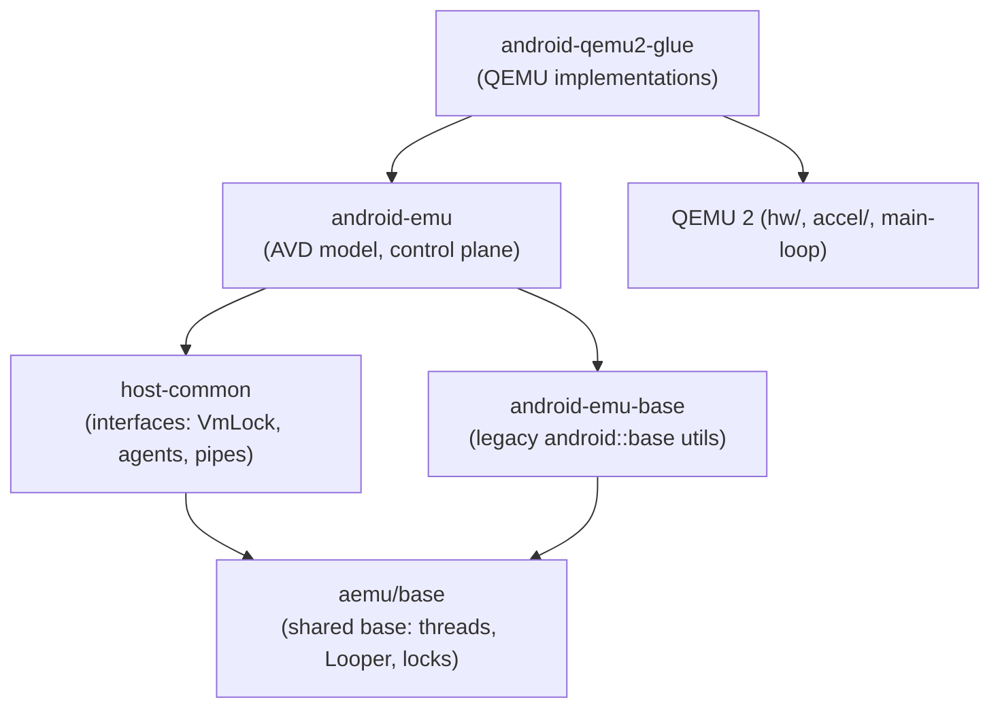
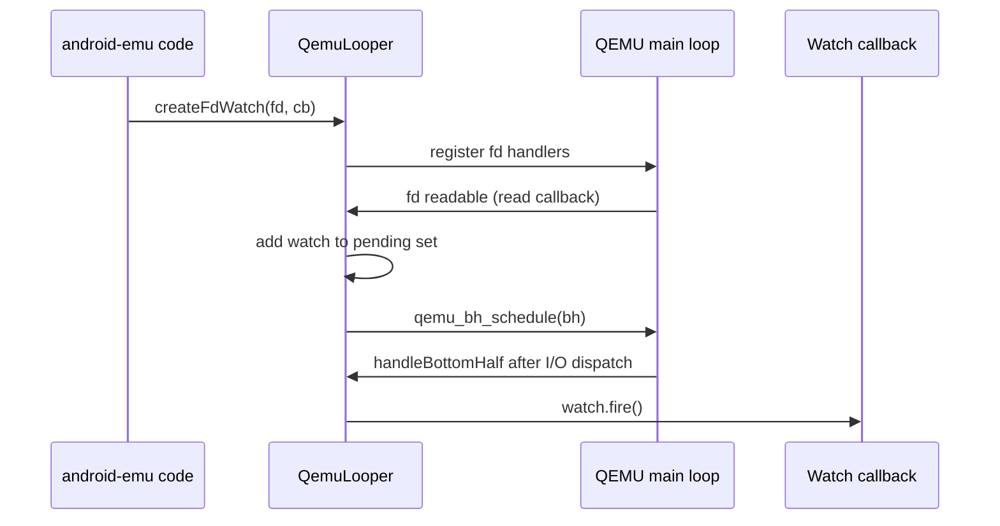
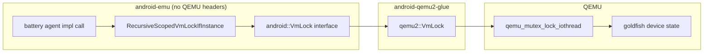
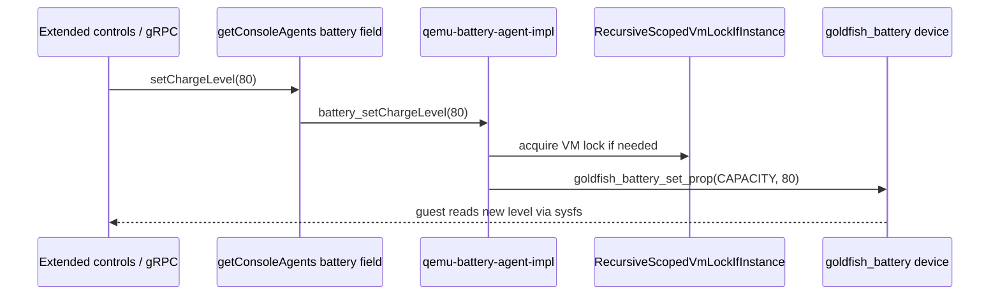
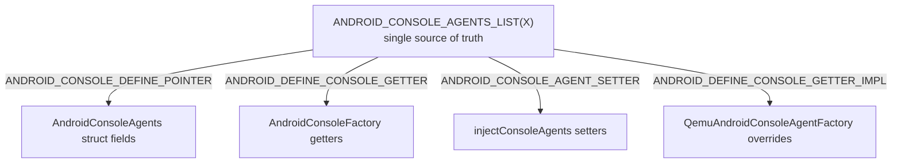

# Chapter 7: android-emu Architecture

Below QEMU's command line and above its virtual hardware sits a body of C++ code that is the actual personality of the Android Emulator: the option parser, the AVD model, the sensor and battery state, the snapshot machinery, the gRPC control plane, and the host-side half of every pipe and goldfish device. This is `android-emu`. It is deliberately built so it does not depend on QEMU at all — it talks to the virtual machine through a small set of plain-C function-pointer tables, and a separate glue layer fills those tables in with QEMU implementations. Swap the glue and the same `android-emu` core could, in principle, drive a different VMM.

This chapter explains how that decoupling is engineered. We start with the layering of the three foundation libraries (`aemu/base`, `android-emu-base`, and `android-emu` proper), then the event-loop abstraction (`Looper`) and how it is mapped onto QEMU's main loop, the `VmLock` that serializes all access to virtual device state, the agents/console interface pattern that is the seam between core and VMM, and finally how everything is wired together during process startup.

---

## 7.1 Three Libraries, One Core

The "android-emu core" is not one library. It is a stack of three, each with a clearly bounded job, and confusing them is the most common source of disorientation when first reading the tree.

The lowest layer is `aemu/base`, which lives in `hardware/google/aemu/base/`. It is a freestanding C++ utility library — threads, locks, file paths, streams, sockets, string formatting — with, in its own words, "no knowledge of the emulator whatsoever." Its CMake target is `aemu-base`, defined in `hardware/google/aemu/base/CMakeLists.txt`, and its headers are exposed under the `aemu/base/` include prefix (for example `aemu/base/async/Looper.h`). This library is shared with the gfxstream graphics project, which is why it lives under `hardware/google/aemu/` rather than inside the QEMU fork.

The next layer is `android-emu-base`. Its build rule is in `external/qemu/android/android-emu-base/CMakeLists.txt`, and its opening comment repeats the same discipline: "This is a very generic library, and should have no knowledge of the emulator whatsoever." It compiles the legacy `android::base` sources (under `android/base/` and `android/utils/`) plus a couple of `aemu/base/system/` files, and links `aemu-base.headers` publicly. In practice `android-emu-base` is the older, emulator-grown utility code, and `aemu/base` is the newer, project-shared utility code; both expose the `android::base` C++ namespace, and over time functionality has migrated from the former toward the latter.

On top of those sits `android-emu` itself, in `external/qemu/android/android-emu/`. Its CMake fragment is `external/qemu/android/android-emu/android-emu.cmake`, and that file's dependency lists show it building on `android-emu-base`, `android-emu-base-headers`, and `qemu-host-common-headers`. This is the layer that knows what an Android Virtual Device is — sensors, battery, telephony, snapshots, ADB, the gRPC services — but still does not know what QEMU is.

Sitting beside `android-emu` (not under it) is `hardware/google/aemu/host-common/`. This is the contract surface: it defines the C structs and abstract C++ classes — `VmLock`, `vm_operations.h`, `AndroidPipe`, `DeviceContextRunner`, the `*_agent.h` interfaces — that `android-emu` calls and that the VMM glue implements. Its CMake target produces `qemu-host-common-headers`.

The foundation libraries and their dependency direction



The arrows that matter most: `android-emu` depends downward on `host-common` and the base libraries, never upward on the glue or on QEMU. The glue depends on both `android-emu` and QEMU, and it is the only layer allowed to include QEMU headers like `qemu/main-loop.h`. That single rule is what keeps the core portable.

### 7.1.1 Why the include prefixes differ

Reading the source you will see two header styles intermixed: `#include "aemu/base/..."` and `#include "android/base/..."` and `#include "host-common/..."`. These prefixes map directly to the three libraries above. `aemu/base/` resolves into `hardware/google/aemu/base/include/`, `host-common/` into `hardware/google/aemu/host-common/include/`, and `android/` paths into either `android-emu-base` or `android-emu` depending on the file. The prefix tells you which layer you are in and therefore what that file is allowed to know about — `host-common` and `aemu/base` headers never mention QEMU types.

## 7.2 The Looper: an Event Loop You Can Re-Host

Almost every long-lived activity in `android-emu` — watching a socket, firing a timer, deferring work to the main thread — is expressed against an abstract event loop called `Looper`, declared in `hardware/google/aemu/base/include/aemu/base/async/Looper.h`. The header describes it plainly: "A Looper is an abstraction for an event loop that can wait for either I/O events on file descriptors, or timers."

`Looper` is a pure interface. It exposes `createTimer()` and `createFdWatch()` factory methods, a `runWithDeadlineMs()` driver, and a `forceQuit()`. There is a default standalone implementation (`DefaultLooper`, used by tests and tools that have no VM), created via the static `Looper::create()`:

```cpp
// Source: hardware/google/aemu/base/include/aemu/base/async/Looper.h
class Looper {
public:
    // Create a new generic Looper instance.
    static Looper* create();
    // Run the event loop until forceQuit() ...
    void run();
    virtual int runWithDeadlineMs(Duration deadlineMs) = 0;
    virtual void forceQuit() = 0;
```

The point of the abstraction is that the production build does not use `DefaultLooper`. When `android-emu` runs inside QEMU, the loop it watches is QEMU's own main loop. The glue provides a `Looper` subclass that delegates every operation to QEMU primitives instead of running its own `select()`/`poll()`.

### 7.2.1 ThreadLooper and the main-thread rendezvous

Because there are many host threads (the UI thread, vCPU threads, gRPC worker threads, async I/O threads), code frequently needs a way to get "the loop for *this* thread" or to push a closure onto "the main loop." That is `ThreadLooper`, in `hardware/google/aemu/base/include/aemu/base/async/ThreadLooper.h`:

```cpp
// Source: hardware/google/aemu/base/include/aemu/base/async/ThreadLooper.h
class ThreadLooper {
public:
    static Looper* get();
    static void setLooper(Looper* looper, bool own = false);
    // Run the specified std::function on the main loop.
    static void runOnMainLooper(Closure&& func);
    static void runOnMainLooperAndWaitForCompletion(Closure&& func);
};
```

`ThreadLooper::get()` returns a thread-local `Looper`, lazily created on first use. `runOnMainLooper()` is the standard mechanism for marshalling work back onto the thread that owns the VM — you will see it called from `external/qemu/android-qemu2-glue/main.cpp` to hand UI- or control-originated actions to the main loop. We will see in the next section why "the main loop thread" is also "the thread that may touch device state."

## 7.3 Mapping the Looper onto QEMU

The glue implementation of `Looper` is `QemuLooper`, in `external/qemu/android-qemu2-glue/base/async/Looper.cpp`. Its header comment states the central constraint bluntly: there is a single global QEMU event loop, so "all instances returned by createLooper() will really use the same state! In other words, don't call it more than once!"

`QemuLooper` translates each abstract operation into a QEMU primitive. Timers map to QEMU clocks and QEMU timers; the clock enum is checked against QEMU's at compile time with a `static_assert` so the values cannot drift. File-descriptor watches are the interesting case. QEMU dispatches read and write readiness through separate callbacks, so `QemuLooper` collects fired watches into a pending set and drains them from a *bottom-half* — a callback QEMU runs after it finishes its I/O dispatch pass:

```cpp
// Source: external/qemu/android-qemu2-glue/base/async/Looper.cpp
QemuLooper() : mQemuBh(qemu_bh_new(handleBottomHalf, this)) {}
...
static void handleBottomHalf(void* opaque) {
    QemuLooper* looper = reinterpret_cast<QemuLooper*>(opaque);
    FdWatchSet& pendingFdWatches = looper->mPendingFdWatches;
    auto i = pendingFdWatches.begin();
    while (i != pendingFdWatches.end()) {
        FdWatch* watch = *i;
        i = pendingFdWatches.erase(i);
        watch->fire();
    }
}
```

Two methods are deliberately not implemented in the QEMU-hosted case. `runWithDeadlineMs()` aborts with "User cannot call looper_run on a QEMU event loop" — the loop is driven by QEMU's executable, not by `android-emu`. And `forceQuit()` does not stop a loop `android-emu` owns; instead it asks the VM to shut down:

```cpp
// Source: external/qemu/android-qemu2-glue/base/async/Looper.cpp
virtual void forceQuit() override {
    qemu_system_shutdown_request(QEMU_SHUTDOWN_CAUSE_HOST_SIGNAL);
}
```

`createLooper()` simply returns a fresh `QemuLooper`. The thin wrapper `qemu_looper_setForThread()` in `external/qemu/android-qemu2-glue/looper-qemu.cpp` installs one for the current thread via the legacy C `looper_setForThreadToOwn()`.

How an FdWatch fires through the QEMU bottom-half



## 7.4 VmLock: One Mutex to Serialize Device State

QEMU runs each virtual CPU on its own host thread, and the device model is not thread-safe across them. QEMU protects it with a single global mutex — the "iothread" lock. Any `android-emu` code on any other thread that wants to poke a virtual device (set the battery level, inject a sensor reading, write to a pipe) must hold that lock first. `VmLock`, declared in `hardware/google/aemu/host-common/include/host-common/VmLock.h`, is the abstraction that lets `android-emu` express "take the VM lock" without including a single QEMU header.

The header spells out the design: "Glue code should call `VmLock::set()` to inject their own implementation into the process. The default implementation doesn't do anything." So `VmLock` is yet another injected interface — `android-emu` calls `VmLock::get()`, the glue provides the real one. The base class methods are no-ops:

```cpp
// Source: hardware/google/aemu/host-common/include/host-common/VmLock.h
class VmLock {
public:
    virtual void lock() {}
    virtual void unlock() {}
    virtual bool isLockedBySelf() const { return true; }
    static VmLock* get();
    static bool hasInstance();
    static VmLock* set(VmLock* vmLock);
};
```

The singleton plumbing (`get()`, `set()`, `hasInstance()`) is implemented in `external/qemu/android/emu/hardware/src/android/emulation/VmLock.cpp`. The QEMU implementation is just six effective lines, in `external/qemu/android-qemu2-glue/emulation/VmLock.cpp`, and it makes the mapping explicit:

```cpp
// Source: external/qemu/android-qemu2-glue/emulation/VmLock.cpp
void VmLock::lock() {
    qemu_mutex_lock_iothread();
}
void VmLock::unlock() {
    qemu_mutex_unlock_iothread();
}
bool VmLock::isLockedBySelf() const {
    return qemu_mutex_iothread_locked();
}
```

So `android::VmLock` *is* QEMU's iothread mutex, viewed through an interface that knows nothing about QEMU.

### 7.4.1 Scoped lock helpers

Raw `lock()`/`unlock()` calls are rare in the codebase. `VmLock.h` ships a family of RAII helpers, and the right one to reach for depends on whether you might already hold the lock. There are four scoped helpers worth knowing.

- `ScopedVmLock` locks on construction and unlocks on destruction, unconditionally.
- `RecursiveScopedVmLock` checks `isLockedBySelf()` first and only locks if the current thread does not already hold it — safe to nest.
- `RecursiveScopedVmLockIfInstance` does the same but no-ops entirely if no `VmLock` has been installed yet (useful for code that may run before the glue wires things up, or in unit tests).
- `ScopedVmUnlock` is the inverse: if the calling thread holds the lock, it temporarily releases it for the scope and re-takes it after — used when a section must *not* hold the VM lock.

The `RecursiveScopedVmLockIfInstance` variant is the one you see throughout the agent implementations, precisely because agents can be called from contexts where the lock state is unknown.

How VmLock decouples android-emu from the QEMU iothread mutex



## 7.5 DeviceContextRunner: Deferring Work to the VM Thread

Holding the lock is not always enough. Some operations should run *on the main loop thread*, not merely under the lock — for example because they touch QEMU timers or because the device's callback model assumes that thread. `DeviceContextRunner<T>`, a template in `hardware/google/aemu/host-common/include/host-common/DeviceContextRunner.h`, encodes this policy. Its header comment states the rule directly: operations that change global VM state "should happen in a thread that holds the global VM lock," and the runner ensures that "if the current thread already owns the lock, the operation is performed as-is; otherwise, it is queued and will be run in the main-loop thread as soon as possible."

You subclass `DeviceContextRunner<OP>` for some copyable operation type `OP`, implement `performDeviceOperation(const OP&)`, call `init()` with a `VmLock` at setup time, and thereafter call `queueDeviceOperation(op)` from anywhere. Because dispatch may be deferred, `queueDeviceOperation` returns `void` — it is fire-and-forget.

The clearest real use is the Android pipe subsystem. `AndroidPipe::initThreading()` in `hardware/google/aemu/host-common/AndroidPipe.cpp` wires the pipe "waker" — the mechanism that signals a guest pipe is ready — through a `DeviceContextRunner` so wake commands raised on a worker thread are replayed safely on the VM thread:

```cpp
// Source: hardware/google/aemu/host-common/AndroidPipe.cpp
void AndroidPipe::initThreading(VmLock* vmLock) {
    sGlobals()->pipeWaker.init(vmLock, {
        // installFunc / uninstallFunc / startWithTimeoutFunc ...
    });
}
```

This is the bridge between the two foundations of Sections 7.3 and 7.4: `VmLock` decides *whether* it is safe to act now, and the `Looper` (through `runOnMainLooper`-style deferral) decides *where* the deferred action runs.

## 7.6 The Agents Pattern: the Seam Between Core and VMM

The single most important structural idea in `android-emu` is the *agent*. An agent is a plain-C struct of function pointers describing one capability of the virtual machine — battery, sensors, telephony, display, VM lifecycle, and so on. The core calls through the struct; the glue fills the struct with QEMU-backed functions. Because the struct is plain C function pointers, the core never links against the implementation.

A representative interface is `QAndroidBatteryAgent`, in `external/qemu/android/emu/agents/include/android/emulation/control/battery_agent.h`:

```c
// Source: external/qemu/android/emu/agents/include/android/emulation/control/battery_agent.h
typedef struct QAndroidBatteryAgent {
    void (*setHasBattery)(bool hasBattery);
    bool (*hasBattery)();
    void (*setIsCharging)(bool isCharging);
    void (*setChargeLevel)(int percentFull);
    int  (*chargeLevel)();
    void (*setHealth)(enum BatteryHealth health);
    // ... more entries ...
} QAndroidBatteryAgent;
```

The matching QEMU implementation, `external/qemu/android-qemu2-glue/qemu-battery-agent-impl.cpp`, is where the interface meets the real goldfish battery device. Each function takes the VM lock (note `RecursiveScopedVmLockIfInstance`) and then calls into QEMU's `goldfish_battery_*` hardware functions:

```cpp
// Source: external/qemu/android-qemu2-glue/qemu-battery-agent-impl.cpp
static void battery_setChargeLevel(int percentFull) {
    android::RecursiveScopedVmLockIfInstance lock;
    goldfish_battery_set_prop(0, POWER_SUPPLY_PROP_CAPACITY, percentFull);
}
// ... then the table is assembled and exported:
static const QAndroidBatteryAgent sQAndroidBatteryAgent = {
    .setChargeLevel = battery_setChargeLevel,
    // ...
};
extern "C" const QAndroidBatteryAgent* const gQAndroidBatteryAgent =
    &sQAndroidBatteryAgent;
```

This one file demonstrates the whole pattern: an interface defined in the agents headers (visible to the core), an implementation in the glue (visible to QEMU), a `VmLock` acquisition for safety, and a global pointer the factory will collect.

The control flow when a UI control changes the battery level



## 7.7 Collecting the Agents: the Console Factory

Individual agent structs are useless until something gathers them into one table the rest of the program can reach. That table is `AndroidConsoleAgents`, and the list of its members is generated by a single X-macro in `external/qemu/android/emu/agents/include/android/console.h`:

```c
// Source: external/qemu/android/emu/agents/include/android/console.h
#define ANDROID_CONSOLE_AGENTS_LIST(X)          \
    X(QAndroidAutomationAgent, automation)      \
    X(QAndroidBatteryAgent, battery)            \
    X(QAndroidSensorsAgent, sensors)            \
    X(QAndroidVmOperations, vm)                 \
    X(QAndroidGlobalVarsAgent, settings)        \
    /* ... ~24 entries total ... */
```

The same macro, expanded with different "X" definitions, generates the struct of pointers, the factory getter declarations, and the factory setters — so adding an agent means editing one list rather than four parallel ones. `AndroidConsoleAgents` itself is built by expanding the list into `const type* name;` fields:

```c
// Source: external/qemu/android/emu/agents/include/android/console.h
#define ANDROID_CONSOLE_DEFINE_POINTER(type, name)  const type* name;
typedef struct AndroidConsoleAgents {
    ANDROID_CONSOLE_AGENTS_LIST(ANDROID_CONSOLE_DEFINE_POINTER)
} AndroidConsoleAgents;
CONSOLE_API const AndroidConsoleAgents* getConsoleAgents();
```

The injection machinery lives in `external/qemu/android/emu/agents/src/android/emulation/control/AndroidAgentFactory.cpp`. A process calls `injectConsoleAgents(factory)` once; the factory's `android_get_*` methods are invoked for each agent to fill a static `AndroidConsoleAgents`, and a flag flips to mark the agents available. Reading them before injection is a fatal error:

```cpp
// Source: external/qemu/android/emu/agents/src/android/emulation/control/AndroidAgentFactory.cpp
const AndroidConsoleAgents* getConsoleAgents() {
    if (!isInitialized) {
        dfatal("Accessing console agents before injecting them.");
        exit(-1);
    }
    return &sConsoleAgents;
}
void android::emulation::injectConsoleAgents(const AndroidConsoleFactory& factory) {
    ANDROID_CONSOLE_AGENTS_LIST(ANDROID_CONSOLE_AGENT_SETTER);
    isInitialized = true;
}
```

### 7.7.1 The QEMU factory subclass

`AndroidConsoleFactory` is abstract; the QEMU build provides `QemuAndroidConsoleAgentFactory` in `external/qemu/android-qemu2-glue/qemu-console-factory.cpp`. It overrides each `android_get_*` method to return the corresponding global pointer (`gQAndroidBatteryAgent`, etc.) that each `*-agent-impl` file exported. Again an X-macro generates the overrides, so the glue list and the core list stay in lockstep:

```cpp
// Source: external/qemu/android-qemu2-glue/qemu-console-factory.cpp
#define ANDROID_DEFINE_CONSOLE_GETTER_IMPL(typ) \
    const typ* android_get_##typ() const override { return g##typ; };

class QemuAndroidConsoleAgentFactory
    : public android::emulation::AndroidConsoleFactory {
    ANDROID_AGENTS_LIST(ANDROID_DEFINE_CONSOLE_GETTER_IMPL)
    // window and libui agents come from shared memory modules,
    // so they are fetched through accessor functions instead.
};

void injectQemuConsoleAgents(const char* factory) {
    injectConsoleAgents(QemuAndroidConsoleAgentFactory());
    if (strcmp("debug", factory) == 0) {
        injectConsoleAgents(AndroidLoggingConsoleFactory());
    }
}
```

Note the second, optional injection: passing `-debug-events` layers in `AndroidLoggingConsoleFactory`, which wraps the user-event agents with logging. That is the whole reason the factory is overridable — you can subclass it to substitute or decorate agents without touching the core.

The X-macro that keeps four expansions in sync



### 7.7.2 A parallel pattern: the graphics agents

The same idiom is reused for graphics. `hardware/google/aemu/host-common/include/host-common/GraphicsAgentFactory.h` defines `GRAPHICS_AGENTS_LIST` and a `GraphicsAgentFactory` with `injectGraphicsAgents()`, carrying a smaller set (`QAndroidEmulatorWindowAgent`, `QAndroidDisplayAgent`, `QAndroidRecordScreenAgent`, `QAndroidMultiDisplayAgent`, `QAndroidVmOperations`). It exists so the gfxstream renderer, which lives in `host-common` and below, can reach the host window and display agents without depending on the full console-agent set in `android-emu`. Recognizing one X-macro factory teaches you both.

## 7.8 VM Lifecycle Through the vm Agent

Most agents control one device. One agent controls the machine itself: `QAndroidVmOperations` (field name `vm`), declared in `hardware/google/aemu/host-common/include/host-common/vm_operations.h`. It is how `android-emu` starts, stops, pauses, resets, and snapshots the VM without calling QEMU directly:

```c
// Source: hardware/google/aemu/host-common/include/host-common/vm_operations.h
typedef struct QAndroidVmOperations {
    bool (*vmStop)(void);
    bool (*vmStart)(void);
    void (*vmReset)(void);
    void (*vmShutdown)(void);
    bool (*vmPause)(void);
    bool (*vmResume)(void);
    bool (*vmIsRunning)(void);
    bool (*snapshotSave)(const char* name, void* opaque,
                         LineConsumerCallback errConsumer);
    bool (*snapshotLoad)(const char* name, void* opaque,
                         LineConsumerCallback errConsumer);
    void (*setSnapshotCallbacks)(void* opaque,
                                 const SnapshotCallbacks* callbacks);
    // ... and more (mapUserBackedRam, getVmConfiguration, ...) ...
} QAndroidVmOperations;
```

The QEMU implementation is `external/qemu/android-qemu2-glue/qemu-vm-operations-impl.cpp`. During setup the glue hands this same `vm` agent to the parts of the system that need to drive the machine: `external/qemu/android-qemu2-glue/qemu-setup.cpp` retrieves `getConsoleAgents()->vm` and passes it to `goldfish_address_space_set_vm_operations` and to `androidSnapshot_initialize`. So the snapshot subsystem — covered in its own chapter — reaches QEMU's save/load entirely through this one function table.

The header also documents the shutdown causes (`QemuShutdownCause`) and uses `static_assert` macros to verify they match QEMU's own enum values, the same defensive technique used for the clock enum in the Looper. The interface and the implementation are kept honest at compile time.

## 7.9 Process Lifecycle and Initialization Order

Putting the pieces together, the emulator's startup is an ordering problem: each interface must be installed before anyone uses it. The sequence runs in `external/qemu/android-qemu2-glue/main.cpp`.

The very first call is `process_early_setup(argc, argv)`, declared in `external/qemu/android/android-emu/android/process_setup.h` and implemented in the corresponding `.cpp`. Its comment notes it is "the first thing emulator calls," which is why it also handles `-wait-for-debugger`. It initializes sockets, file locks, and libcurl, and sets up logging — all before any threads are launched:

```cpp
// Source: external/qemu/android/android-emu/android/process_setup.cpp
void process_early_setup(int argc, char** argv) {
    // ... handle -wait-for-debugger ...
    android_socket_init();
    filelock_init();
    // libcurl initialization is thread-unsafe, call it first
    curl_init(caBundleFile.c_str());
    android::protobuf::initProtobufLogger();
}
```

Next, `main.cpp` injects the agents — `injectQemuConsoleAgents(factory)` — *before* parsing the command line, because option parsing already reads through `getConsoleAgents()->settings`. Only after agents exist does it call `getConsoleAgents()->settings->...` and `emulator_parseCommonCommandLineOptions`.

```cpp
// Source: external/qemu/android-qemu2-glue/main.cpp
process_early_setup(argc, argv);
// ...
injectQemuConsoleAgents(factory);
// settings agent is now usable:
getConsoleAgents()->settings->set_host_emulator_is_headless(false);
```

The VMM-side wiring happens later, inside `qemu_android_emulation_early_setup()` in `external/qemu/android-qemu2-glue/qemu-setup.cpp`. This is where the `Looper`, `VmLock`, pipes, and sync service are installed, in a careful order:

```cpp
// Source: external/qemu/android-qemu2-glue/qemu-setup.cpp
qemu_looper_setForThread();
qemu_thread_register_setup_callback(qemu_looper_setForThread);
// ...
VmLock* vmLock = new qemu2::VmLock();
VmLock* prevVmLock = VmLock::set(vmLock);
CHECK(prevVmLock == nullptr) << "Another VmLock was already installed!";
// ...
qemu_android_pipe_init(vmLock);   // pipes need the lock to defer work
qemu_android_sync_init(vmLock);
auto vm = getConsoleAgents()->vm; // the vm-operations agent
androidSnapshot_initialize(vm, getConsoleAgents()->emu);
```

The dependency chain is visible in the order: install a `Looper` for the main thread and register it as the per-thread setup callback for any future QEMU thread; install the `VmLock` (asserting none existed before); then initialize the pipe and sync services, which need that `VmLock` so their `DeviceContextRunner`s can defer work; finally fetch the `vm` agent and hand it to the snapshot machinery.

Startup ordering of the core interfaces

```mermaid
sequenceDiagram
    participant Main as main.cpp
    participant Setup as qemu_android_emulation_early_setup
    participant Loop as Looper / ThreadLooper
    participant Lock as VmLock
    participant Pipe as AndroidPipe / sync

    Main->>Main: process_early_setup
    Main->>Main: injectQemuConsoleAgents
    Main->>Setup: qemu_android_emulation_early_setup
    Setup->>Loop: qemu_looper_setForThread
    Setup->>Lock: VmLock::set(new qemu2::VmLock)
    Setup->>Pipe: qemu_android_pipe_init(vmLock)
    Setup->>Pipe: androidSnapshot_initialize(vm agent)
```

At teardown, `process_late_teardown()` runs the symmetric cleanup (`curl_cleanup()` and friends). The symmetry of early-setup / late-teardown bookends the whole process.

## 7.10 Try It

These exercises use a checked-out emulator superproject. Run them from the repository root.

Find every agent interface the console exposes, then the single list that defines them.

```bash
# All agent interface headers
ls external/qemu/android/emu/agents/include/android/emulation/control/*_agent.h

# The one X-macro list that names every console agent
grep -n "ANDROID_CONSOLE_AGENTS_LIST(X)" \
  external/qemu/android/emu/agents/include/android/console.h
sed -n '/define ANDROID_CONSOLE_AGENTS_LIST/,/QAndroidSurfaceAgent/p' \
  external/qemu/android/emu/agents/include/android/console.h
```

Trace the VmLock from interface to QEMU mutex.

```bash
# The injected interface (no-op base class)
grep -n "virtual void lock" \
  hardware/google/aemu/host-common/include/host-common/VmLock.h

# The QEMU implementation: it is the iothread mutex
grep -n "qemu_mutex_lock_iothread\|qemu_mutex_iothread_locked" \
  external/qemu/android-qemu2-glue/emulation/VmLock.cpp
```

See how one agent is implemented end-to-end. Compare the interface struct with the QEMU implementation and count how many functions take the VM lock.

```bash
# Interface
sed -n '/typedef struct QAndroidBatteryAgent/,/QAndroidBatteryAgent;/p' \
  external/qemu/android/emu/agents/include/android/emulation/control/battery_agent.h

# Implementation + lock usage
grep -c "RecursiveScopedVmLockIfInstance" \
  external/qemu/android-qemu2-glue/qemu-battery-agent-impl.cpp
```

Inspect the startup ordering that installs the Looper, VmLock, and agents.

```bash
grep -n "process_early_setup\|injectQemuConsoleAgents" \
  external/qemu/android-qemu2-glue/main.cpp
grep -n "qemu_looper_setForThread\|VmLock::set\|qemu_android_pipe_init" \
  external/qemu/android-qemu2-glue/qemu-setup.cpp
```

## Summary

- `android-emu` is layered over foundation libraries: `aemu/base` (shared, project-wide utilities under `hardware/google/aemu/base/`), `android-emu-base` (legacy `android::base` utilities under `external/qemu/android/android-emu-base/`), and `host-common` (the interface contract under `hardware/google/aemu/host-common/`). The core deliberately never includes a QEMU header.
- The `Looper` interface in `aemu/base/async/Looper.h` abstracts the event loop. In production it is not the standalone `DefaultLooper` but `QemuLooper` (`android-qemu2-glue/base/async/Looper.cpp`), which maps timers to QEMU clocks and drains fd-watches from a QEMU bottom-half; `runWithDeadlineMs()` is forbidden and `forceQuit()` becomes a VM shutdown request.
- `ThreadLooper` gives per-thread loopers and `runOnMainLooper()` for marshalling work back to the VM thread.
- `VmLock` (`host-common/VmLock.h`) is an injected interface whose QEMU implementation is literally `qemu_mutex_lock_iothread()`. RAII helpers — `ScopedVmLock`, `RecursiveScopedVmLock`, `RecursiveScopedVmLockIfInstance`, `ScopedVmUnlock` — serialize all access to virtual device state.
- `DeviceContextRunner<T>` builds on `VmLock` to either run an operation immediately (if the lock is held) or defer it to the main loop thread; the Android pipe waker uses it via `AndroidPipe::initThreading(vmLock)`.
- Agents are plain-C function-pointer structs (one per capability, e.g. `QAndroidBatteryAgent`, `QAndroidVmOperations`) defined in the agents headers and implemented in `android-qemu2-glue/qemu-*-agent-impl`. They are the seam that decouples the core from the VMM.
- A single X-macro, `ANDROID_CONSOLE_AGENTS_LIST`, generates the `AndroidConsoleAgents` struct, the factory getters, and the injection setters. `injectConsoleAgents()` runs once; `getConsoleAgents()` is fatal before injection. The graphics path reuses the identical pattern via `GRAPHICS_AGENTS_LIST`.
- Startup ordering is strict: `process_early_setup` then `injectQemuConsoleAgents` (before option parsing) then `qemu_android_emulation_early_setup`, which installs the `Looper`, then the `VmLock`, then pipe/sync services, then hands the `vm` agent to the snapshot subsystem.

### Key Source Files

| File | Purpose |
|------|---------|
| `hardware/google/aemu/base/include/aemu/base/async/Looper.h` | Abstract event-loop interface used throughout the core |
| `external/qemu/android-qemu2-glue/base/async/Looper.cpp` | `QemuLooper` mapping the Looper onto QEMU timers and bottom-halves |
| `hardware/google/aemu/base/include/aemu/base/async/ThreadLooper.h` | Per-thread looper and `runOnMainLooper` rendezvous |
| `hardware/google/aemu/host-common/include/host-common/VmLock.h` | `VmLock` interface and scoped lock helpers |
| `external/qemu/android-qemu2-glue/emulation/VmLock.cpp` | QEMU `VmLock` mapped to the iothread mutex |
| `hardware/google/aemu/host-common/include/host-common/DeviceContextRunner.h` | Defers device operations to the VM-locked main thread |
| `external/qemu/android/emu/agents/include/android/console.h` | `ANDROID_CONSOLE_AGENTS_LIST` X-macro and `getConsoleAgents()` |
| `external/qemu/android/emu/agents/src/android/emulation/control/AndroidAgentFactory.cpp` | `injectConsoleAgents` / `getConsoleAgents` implementation |
| `external/qemu/android-qemu2-glue/qemu-console-factory.cpp` | `QemuAndroidConsoleAgentFactory` filling agents with QEMU impls |
| `external/qemu/android-qemu2-glue/qemu-battery-agent-impl.cpp` | Representative agent implementation with VmLock usage |
| `hardware/google/aemu/host-common/include/host-common/vm_operations.h` | `QAndroidVmOperations` lifecycle/snapshot agent |
| `external/qemu/android-qemu2-glue/qemu-setup.cpp` | Installs Looper, VmLock, pipes, and the vm agent at startup |
| `external/qemu/android/android-emu/android/process_setup.cpp` | `process_early_setup` / `process_late_teardown` process lifecycle |
