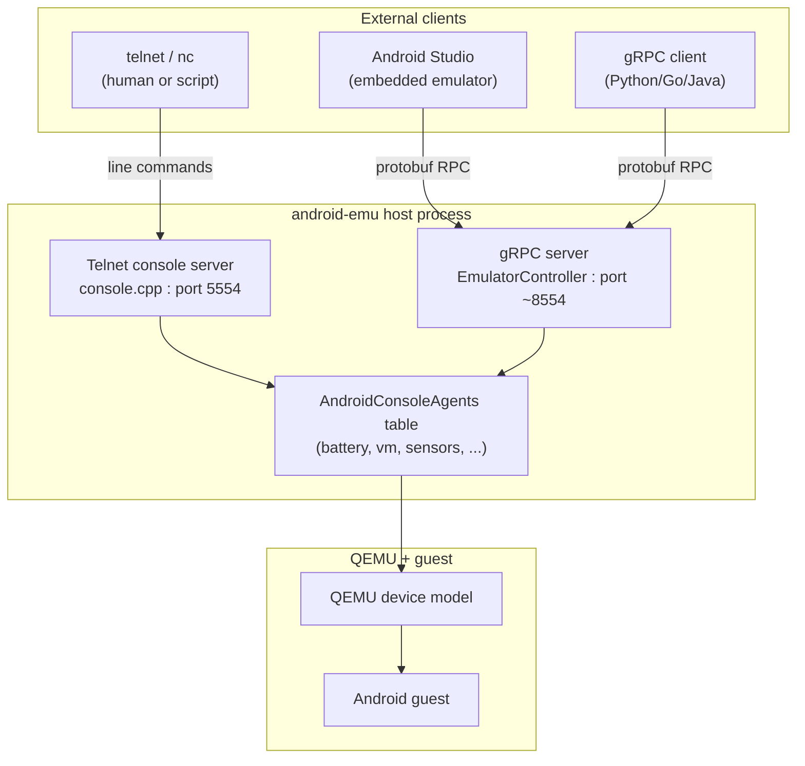
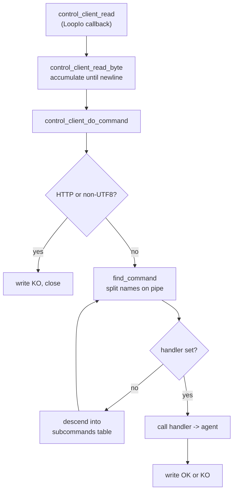
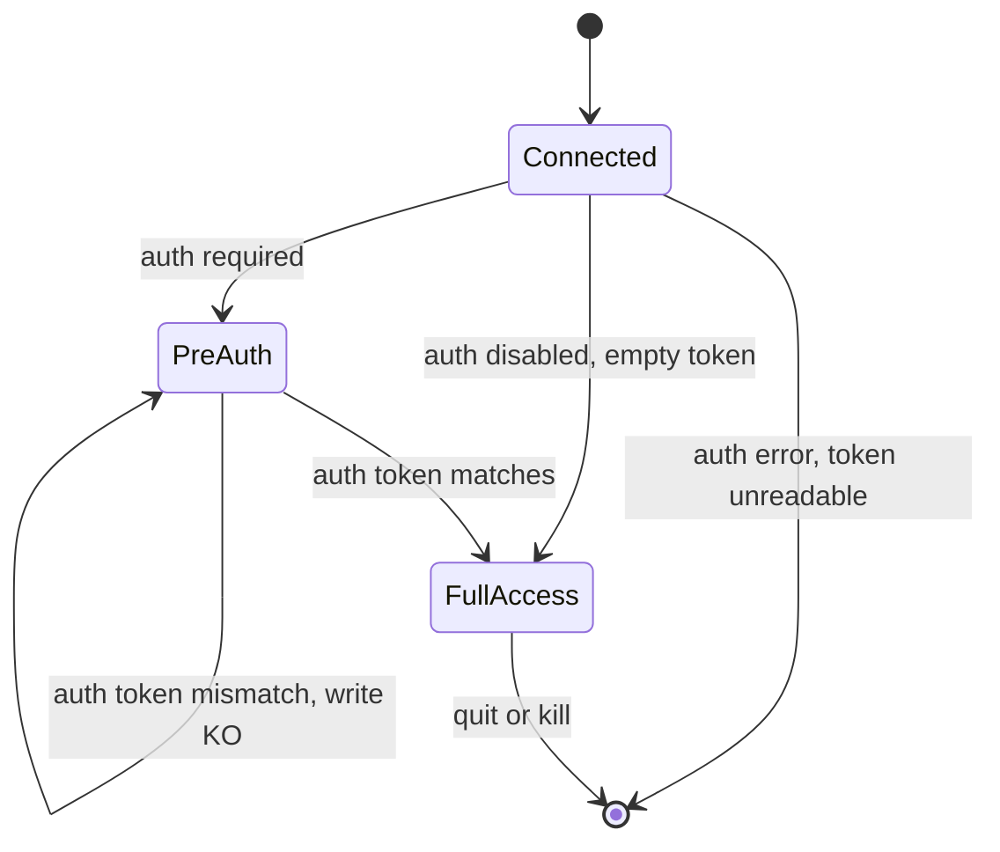
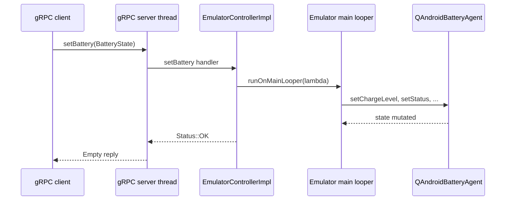
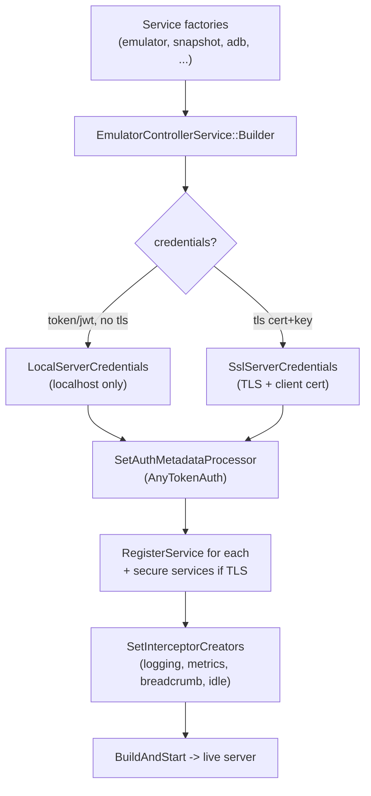
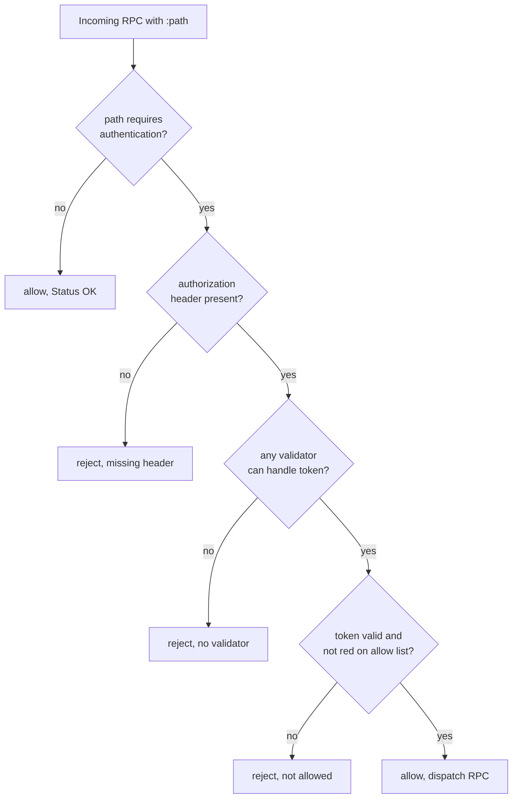
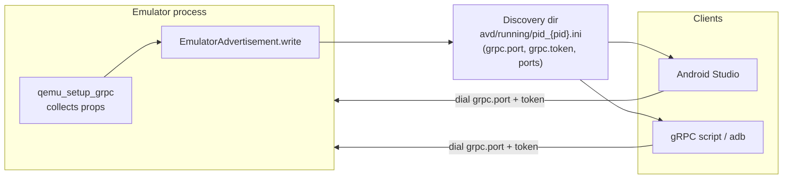

# Chapter 8: Console and gRPC Control Plane

A running emulator is not a closed box. From the moment it boots it exposes two out-of-band control surfaces that let other processes inspect and steer it without going through the guest at all: a line-oriented telnet **console** on TCP port 5554, and a modern **gRPC** service that speaks a protobuf-defined API. The console is the old, human-typeable interface that has existed since the earliest SDK emulators — you telnet in, type `help`, and issue commands like `geo fix`, `power capacity`, or `redir add`. The gRPC plane is what Android Studio's embedded emulator, the `adb` discovery path, and modern automation tooling actually use: a strongly typed, streaming, authenticated RPC surface backed by the same in-process agents the console reaches.

This chapter walks both surfaces from the wire down to the agents that ultimately mutate emulator state. Both are implemented inside the `android-emu` host process; both are wired to the guest through the same `AndroidConsoleAgents` table. Understanding them is the key to understanding how anything outside the guest — Studio, a test harness, `adb`, a Python script — drives the device.

---

## 8.1 Two Control Surfaces, One Agent Layer

The console and the gRPC service are independent network servers, but they are not independent implementations. Both reach into the emulator through a single shared structure: the `AndroidConsoleAgents` table. That table is a struct of pointers, one per subsystem, declared by a list macro in `external/qemu/android/emu/agents/include/android/console.h`:

```c
// Source: external/qemu/android/emu/agents/include/android/console.h
#define ANDROID_CONSOLE_AGENTS_LIST(X)          \
    X(QAndroidAutomationAgent, automation)      \
    X(QAndroidBatteryAgent, battery)            \
    X(QAndroidClipboardAgent, clipboard)        \
    X(QAndroidCellularAgent, cellular)          \
    X(QAndroidDisplayAgent, display)            \
    ...                                          \
    X(QAndroidVmOperations, vm)                 \
    X(QGrpcAgent, grpc)                         \
    X(QAndroidGlobalVarsAgent, settings)        \
    X(QAndroidSurfaceAgent, surface)
```

The macro expands twice: once to declare the `AndroidConsoleAgents` struct fields, and once inside `android_console_start` to copy each agent pointer into the console's global state. The gRPC `EmulatorControllerImpl` is constructed with the very same `const AndroidConsoleAgents*`. So when a console client types `power capacity 50` and when a gRPC client calls `setBattery`, both ultimately call into `agents->battery` — the same `QAndroidBatteryAgent` vtable. The control surfaces differ only in transport, encoding, and authentication; the business logic lives one layer below them.

### 8.1.1 Where the ports come from

The console port is allocated during `android_ports_setup` in `external/qemu/android/android-emu/android/qemu-setup.cpp`. The default base port is `ANDROID_CONSOLE_BASEPORT`, defined as `5554` in `hardware/google/aemu/host-common/include/host-common/constants.h`. The setup loop tries successive even ports — 5554, 5556, 5558, ... — until it can bind, with the ADB port always at `base_port + 1`:

```cpp
// Source: external/qemu/android/android-emu/android/qemu-setup.cpp
for (; tries > 0; tries--, base_port += 2) {
    /* setup first redirection for ADB, the Android Debug Bridge */
    adb_port = base_port + 1;
    if (!setup_console_and_adb_ports(base_port, adb_port, legacy_adb, agents)) {
        continue;
    }
    ...
}
```

That is why the first emulator answers on console port 5554 and ADB 5555, the second on 5556/5557, and so on, and why the AVD shows up to `adb` as `emulator-5554`. The gRPC port is computed separately in `qemu_setup_grpc` (`external/qemu/android-qemu2-glue/qemu-setup.cpp`) as `android_serial_number_port + 3000`, scanning a 1000-port range until one binds. None of these ports is fixed; clients discover the actual numbers from a registration file, covered in section 8.8.

### 8.1.2 The two planes at a glance

The diagram below shows the two control surfaces and how they converge on the agent layer that talks to QEMU and the guest.

#### Figure 8-1: Console and gRPC converging on the shared agent layer



---

## 8.2 The Telnet Console: Server and Read Loop

The console is a plain TCP server bound to the loopback interface only. `android_console_start` in `external/qemu/android/android-emu/android/console.cpp` opens both an IPv4 and an IPv6 loopback listener and registers each with the emulator's `LoopIo` event loop:

```cpp
// Source: external/qemu/android/android-emu/android/console.cpp
Socket fd4 = socket_loopback4_server(control_port, SOCKET_STREAM);
Socket fd6 = socket_loopback6_server(control_port, SOCKET_STREAM);
if (fd4 < 0 && fd6 < 0) {
    perror("bind");
    return -1;
}
global->looper = looper_getForThread();
```

Binding to `socket_loopback4_server` / `socket_loopback6_server` rather than a wildcard address is the console's first line of defense: a remote machine cannot reach port 5554 at all, only processes on the same host can. Each accepted connection becomes a `ControlClientRec` — a small struct holding the socket, a 4096-byte line buffer, and a pointer into the current command table:

```cpp
// Source: external/qemu/android/android-emu/android/console.cpp
typedef struct ControlClientRec_ {
    struct ControlClientRec_* next; /* next client in list           */
    Socket sock;                    /* socket used for communication */
    LoopIo* loopIo;
    ControlGlobal global;
    char finished;
    char buff[4096];
    int buff_len;
    CommandDef commands;
} ControlClientRec;
```

The console is fully event-driven and single-threaded. There is no per-client thread; instead, `control_client_read` is registered as a `LoopIo` read callback. Bytes arrive, are fed one at a time into `control_client_read_byte`, and when a newline is seen the accumulated line is dispatched by `control_client_do_command`. That dispatcher runs on the same main looper as the rest of the emulator, which is why console commands that must touch QEMU state are safe to call agent methods directly.

### 8.2.1 The OK / KO protocol

The console wire protocol is deliberately trivial and human-friendly. Every command either succeeds — the handler returns 0 and the dispatcher writes `OK`, possibly after the command's own output — or fails, writing a line that begins with `KO:` and a reason. The relevant dispatch logic:

```cpp
// Source: external/qemu/android/android-emu/android/console.cpp
if (cmd->handler) {
    ...
    if (!cmd->handler(client, args)) {
        control_write(client, "OK\r\n");
    }
    break;
}
```

A `KO:` prefix is the universal failure signal a script can grep for. Before a command is even looked up, the dispatcher runs two cheap security checks: it rejects anything that looks like an HTTP request line and anything that is not valid UTF-8, closing the connection in both cases. This stops a browser or a port scanner that stumbles onto port 5554 from being parsed as console input:

```cpp
// Source: external/qemu/android/android-emu/android/console.cpp
if (android_http_is_request_line(line, line_len)) {
    control_write(client, "KO: Forbidden HTTP request. Aborting\r\n");
    do_quit(client, NULL);
    return;
} else if (!android_utf8_is_valid(line, line_len)) {
    control_write(client, "KO: Forbidden binary request. Aborting\r\n");
    do_quit(client, NULL);
    return;
}
```

---

## 8.3 Console Command Tables

Commands are not parsed ad hoc; they are described by static tables of `CommandDefRec`. Each entry pairs a pipe-separated set of names, a one-line abstract, an optional long description, and either a handler function or a pointer to a sub-command table:

```cpp
// Source: external/qemu/android/android-emu/android/console.cpp
typedef struct CommandDefRec_ {
    const char* names;
    const char* abstract;
    const char* description;
    void (*descriptor)(ControlClient client);
    int (*handler)(ControlClient client, char* args);
    CommandDef subcommands; /* if handler is NULL */
} CommandDefRec;
```

`find_command` walks a table, splitting each `names` field on `|` so that `help|h|?` matches `help`, `h`, or `?`. When a matched entry has no handler but does have a `subcommands` table, the dispatcher consumes the next token and recurses — this is how `geo fix`, `power capacity`, `redir add tcp:...`, and `sms send` are structured as nested tables. The top-level `main_commands` table aggregates per-subsystem tables such as `network_commands`, `redir_commands`, `power_commands`, `geo_commands`, `sensor_commands`, `snapshot_commands`, and `event_commands`, each defined next to its handlers.

A representative leaf handler reads or writes through an agent and writes a reply. For example `do_avd_grpc_port` reaches the gRPC agent to report the live gRPC port — the bridge between the two control planes:

```cpp
// Source: external/qemu/android/android-emu/android/console.cpp
do_avd_grpc_port(ControlClient client, char* args) {
    int active = client->global->grpc_agent->active_port();
    if (active < 0) {
        control_write(client, "KO: No active gRPC service\n");
        return -1;
    }
    control_write(client, "%d\n", active);
    return 0;
}
```

The `kill` command (`do_kill`) is the bluntest: it stops any active screen recording, prints a farewell, and tears the process down. On headless ARM hosts that support snapshot save, it sends `SIGINT` to itself (`kill(getpid(), SIGINT)`) so a graceful quickboot save can run first; otherwise it routes through the UI/libui agent's `requestExit`. (On Windows the snapshot-save path uses `requestExit` instead of `SIGINT`.)

### 8.3.1 Command dispatch flow

The diagram traces a single line of console input from socket bytes to an agent call.

#### Figure 8-2: Console line dispatch and sub-command recursion



---

## 8.4 Console Authentication and the Auth Token

By default the console requires authentication. When a client connects, `control_global_accept` checks `android_console_auth_get_status()` and branches on three states: disabled, required, or error. In the common "required" case it sends a banner and arms the client with the **pre-auth** command table:

```cpp
// Source: external/qemu/android/android-emu/android/console.cpp
case CONSOLE_AUTH_STATUS_REQUIRED:
    control_write(client, "Android Console: Authentication required\r\n");
    control_write(client, "Android Console: type 'auth <auth_token>' to "
                          "authenticate\r\n");
    control_write(client, "Android Console: you can find your <auth_token> "
                          "in \r\n'");
    control_write(client, emulator_console_auth_token_path);
    control_write(client, "'\r\nOK\r\n");
    break;
```

The pre-auth table, `main_commands_preauth`, intentionally exposes almost nothing: `help`, `help-verbose`, `ping`, `quit`, the `auth` command itself, and a tiny `avd` sub-table with only `name` and `grpc`. Those two read-only `avd` queries are special-cased so that older Android Studio versions can read the AVD name and gRPC port before authenticating:

```cpp
// Source: external/qemu/android/android-emu/android/console.cpp
extern const CommandDefRec main_commands_preauth[] = {
        HELP_BASIC_COMMAND,
        HELP_VERBOSE_COMMAND,
        PING_COMMAND,
        AVD_COMMAND(vm_commands_preauth),
        {"auth", "user authentication for the emulator console",
         "use 'auth <auth_token>' to get extended console functionality\r\n",
         NULL, do_auth, NULL},
        QUIT_COMMAND,
        {NULL, NULL, NULL, NULL, NULL, NULL}};
```

### 8.4.1 The auth token file

The token itself lives in `~/.emulator_console_auth_token`. The logic in `external/qemu/android/emu/telnet/auth/src/android/console_auth.cpp` creates it on first use, generating 96 bits of random data and base64-encoding it. The file is created with mode `0600` — readable and writable only by the owning user — and atomically with `O_CREAT | O_EXCL` so a concurrent emulator cannot race it:

```cpp
// Source: external/qemu/android/emu/telnet/auth/src/android/console_auth.cpp
const mode_t user_read_only = 0600;
ScopedFd fd(HANDLE_EINTR(android_open(
        path.c_str(), O_CREAT | O_EXCL | O_WRONLY | O_TRUNC | O_BINARY,
        user_read_only)));
```

If the file already exists, it is read back and trimmed; the contents become the expected token. Three status values flow out of this: a missing-or-unreadable file yields `CONSOLE_AUTH_STATUS_ERROR` (the console is disabled entirely), an empty token string yields `CONSOLE_AUTH_STATUS_DISABLED` (no auth required), and any non-empty token yields `CONSOLE_AUTH_STATUS_REQUIRED`. Emptying the file is the supported way to turn console auth off.

### 8.4.2 Constant-time comparison

The `do_auth` handler compares the supplied token against the file's token, then swaps the client onto the full `main_commands` table on success. The comparison is deliberately constant-time to blunt timing attacks — `const_time_strcmp` always inspects every byte rather than returning early on the first mismatch, so an attacker cannot learn how many leading characters were correct:

```cpp
// Source: external/qemu/android/android-emu/android/console.cpp
size_t token = strlen(auth_token) + 1;
size_t args_len = strlen(args) + 1;
char* auth = (char*)calloc(token, 1);
memcpy(auth, args, token <= args_len ? token : args_len);
if (0 != const_time_strcmp(auth_token, auth, token)) {
    ...
    control_write(client, "KO: authentication token does not match "
                          "~/.emulator_console_auth_token\r\n");
    return -1;
}
...
client->commands = main_commands;
```

The diagram below shows the state of a console client across the authentication boundary.

#### Figure 8-3: Console authentication state machine



---

## 8.5 The gRPC Plane: the EmulatorController Service

The modern control surface is a gRPC service defined in `hardware/google/aemu/protos/services/emulator-controller/emulator_controller.proto`. The `EmulatorController` service is the workhorse — roughly fifty RPCs covering sensors, battery, GPS, clipboard, input injection, screenshots, audio, logcat, VM state, and display configuration. Its naming follows a documented convention encoded in the proto's own comments:

```proto
// Source: hardware/google/aemu/protos/services/emulator-controller/emulator_controller.proto
// streamXXX --> streams values XXX (usually for emulator lifetime).
// getXXX    --> gets a single value XXX
// setXXX    --> sets a single value XXX, does not returning state ...
// sendXXX   --> send a single event XXX, possibly returning state information.
service EmulatorController {
    rpc setBattery(BatteryState) returns (google.protobuf.Empty) {}
    rpc getBattery(google.protobuf.Empty) returns (BatteryState) {}
    rpc getStatus(google.protobuf.Empty) returns (EmulatorStatus) {}
    rpc getScreenshot(ImageFormat) returns (Image) {}
    rpc streamScreenshot(ImageFormat) returns (stream Image) {}
    rpc setVmState(VmRunState) returns (google.protobuf.Empty) {}
    rpc streamInputEvent(stream InputEvent) returns (google.protobuf.Empty) {}
    ...
}
```

The four RPC shapes map directly to gRPC streaming modes: `get`/`set`/`send` are unary, `stream*` returning a `stream` is server-streaming (the emulator pushes values as they change), and input injection RPCs such as `streamInputEvent` and `injectWheel` take a `stream` parameter for client-streaming. A header comment also warns maintainers that adding or removing an RPC requires updating the metrics SQL via `external/qemu/android/scripts/gen-grpc-sql.py`, and that deleted methods must be logged with a removal date — the API is versioned by social contract because the proto itself is `proto3` with no explicit version field.

### 8.5.1 The server implementation maps RPCs to agents

The C++ side is `EmulatorControllerImpl` in `external/qemu/android/android-grpc/services/emulator-controller/server/src/android/emulation/control/EmulatorService.cpp`. It subclasses the generated `EmulatorController::Service`, layering in callback-based reactors for the streaming RPCs through gRPC's `WithCallbackMethod_*` mixins. The constructor takes the shared agent table and a clutch of input-event senders:

```cpp
// Source: .../emulator-controller/server/src/android/emulation/control/EmulatorService.cpp
class EmulatorControllerImpl final
    : public EmulatorController::WithCallbackMethod_streamLogcat<
              EmulatorController::WithCallbackMethod_streamClipboard<
                      ...
                      EmulatorController::Service>> {
public:
    EmulatorControllerImpl(const AndroidConsoleAgents* agents)
        : mAgents(agents), mKeyEventSender(agents), ... {}
```

Each unary RPC is a thin translation: deserialize the protobuf, hop to the main looper if it must touch QEMU state, call the agent, and fill the reply. `setBattery` is typical — note the `runOnMainLooper` thread hop, because gRPC handlers run on gRPC's own thread pool, not the emulator main thread:

```cpp
// Source: .../emulator-controller/server/src/android/emulation/control/EmulatorService.cpp
Status setBattery(ServerContext* context, const BatteryState* requestPtr,
                  ::google::protobuf::Empty* reply) override {
    auto agent = mAgents->battery;
    BatteryState request = *requestPtr;  // copy out of the request
    android::base::ThreadLooper::runOnMainLooper([agent, request]() {
        agent->setHasBattery(request.hasbattery());
        agent->setIsCharging(request.status() == BatteryState::CHARGING);
        agent->setChargeLevel(request.chargelevel());
        ...
    });
    return Status::OK;
}
```

This is the same `agents->battery` the console's `power` commands use; the gRPC layer just supplies a typed, structured front door. RPCs that must read state synchronously use `runOnMainLooperAndWaitForCompletion` instead so the reply is fully populated before the handler returns.

### 8.5.2 getStatus assembles a snapshot of the device

`getStatus` is a good window into how much the gRPC plane exposes. It reads the VM configuration through `agents->vm->getVmConfiguration`, asks the boot tracker whether the guest finished booting, pulls the guest heartbeat counter, the process uptime, the build version string, and the QEMU hardware config map, then folds in a `BugreportInfo` for Android version and hypervisor details:

```cpp
// Source: .../emulator-controller/server/src/android/emulation/control/EmulatorService.cpp
Status getStatus(ServerContext* context, const Empty* request,
                 EmulatorStatus* reply) override {
    ::VmConfiguration config;
    mAgents->vm->getVmConfiguration(&config);
    reply->mutable_vmconfig()->set_numberofcpucores(config.numberOfCpuCores);
    reply->mutable_vmconfig()->set_ramsizebytes(config.ramSizeBytes);
    reply->set_booted(bootCompleted());
    reply->set_heartbeat(get_guest_heart_beat_count());
    reply->set_uptime(System::get()->getProcessTimes().wallClockMs);
    ...
    return Status::OK;
}
```

The `EmulatorStatus` message carries `booted`, `uptime`, a `heartbeat` counter, the `VmConfiguration`, and `guestConfig`/`platformConfig` string maps. Studio polls this to decide when an embedded device is ready and to display device metadata.

#### Figure 8-4: A unary gRPC call from client to agent and back



---

## 8.6 Bootstrapping and Registering gRPC Services

The whole gRPC stack is stood up in `qemu_setup_grpc` (`external/qemu/android-qemu2-glue/qemu-setup.cpp`). That function gathers a long list of service factories — the emulator controller, waterfall (the ADB-over-gRPC transport), snapshot, UI controller, stats, modem, car, sensor, bluetooth, virtual scene, screen recorder, and AVD services — and hands them to a fluent `EmulatorControllerService::Builder`:

```cpp
// Source: external/qemu/android-qemu2-glue/qemu-setup.cpp
auto emulator = android::emulation::control::getEmulatorController(getConsoleAgents());
...
auto builder = EmulatorControllerService::Builder()
        .withConsoleAgents(getConsoleAgents())
        .withPortRange(grpc_start, grpc_end)
        .withCertAndKey(... grpc_tls_cer, ... grpc_tls_key, ... grpc_tls_ca)
        .withAllowList(... grpc_allowlist)
        .withAddress(address)
        .withService(emulator)
        .withService(h2o)
        .withService(snapshot)
        .withSecureService(adb)
        .withService(bluetooth);
```

Note the distinction between `withService` and `withSecureService`. The service registered with `withSecureService` is the separate `adb` service (`getAdbService`, the `Adb::Service` that hands out the ADB private key), not waterfall — the `Builder::build` step only registers it when TLS with client-certificate validation is active. The waterfall transport (`h2o = getWaterfallService(...)`) is registered with the ordinary `withService` and is not gated on TLS; everything else likewise registers unconditionally.

`Builder::build` in `external/qemu/android/android-grpc/services-stack/src/android/emulation/control/GrpcServices.cpp` is where the gRPC `ServerBuilder` is finally assembled. It picks credentials, attaches an auth metadata processor when a token or JWT path was configured, registers every service, installs interceptors, and calls `BuildAndStart`:

```cpp
// Source: .../services-stack/src/android/emulation/control/GrpcServices.cpp
ServerBuilder builder;
builder.AddListeningPort(server_address, mCredentials);
for (auto service : mServices) {
    builder.RegisterService(service.get());
}
if (mSecurity == Security::Tls && mCaCerts) {
    for (auto service : mSecureServices) {
        builder.RegisterService(service.get());
    }
}
builder.experimental().SetInterceptorCreators(std::move(creators));
auto service = builder.BuildAndStart();
```

### 8.6.1 Interceptors

The interceptor creators installed here cross-cut every RPC. There are four, all under `external/qemu/android/android-grpc/interceptors/`:

- **LoggingInterceptor** (`StdOutLoggingInterceptorFactory`), enabled with verbose gRPC logging, prints each call.
- **BreadcrumbInterceptor** records call breadcrumbs for crash reports.
- **MetricsInterceptor** feeds the metrics pipeline (the same one `gen-grpc-sql.py` generates schema for).
- **IdleInterceptor**, installed only when `-idle-grpc-timeout` is set, terminates the emulator when no gRPC activity occurs within the timeout — useful for ephemeral CI devices.

These run for every method on every registered service, so logging, metrics, and idle-shutdown are uniform across the API.

#### Figure 8-5: gRPC server assembly in Builder::build



---

## 8.7 gRPC Authentication: Tokens, JWTs, and the Allow List

The gRPC plane has a richer security model than the console. Three layers stack: transport credentials, a token check, and a per-method allow list.

By default — when the user does not pass an explicit `-grpc <port>` flag — `qemu_setup_grpc` enables both a random bearer token and JWT authentication. The token is 64 bytes from `generateToken`, recorded in the discovery file under `grpc.token`:

```cpp
// Source: external/qemu/android-qemu2-glue/qemu-setup.cpp
bool useToken = !has_grpc_flag ||
        getConsoleAgents()->settings->android_cmdLineOptions()->grpc_use_token;
if (useToken) {
    auto token = generateToken(of64Bytes);
    builder.withAuthToken(token);
    props["grpc.token"] = token;
}
```

If a token or JWK path is requested but TLS is *not* configured, `Builder::build` refuses to open the port to the network. It silently rebinds to `[::1]` with `LocalServerCredentials`, so an unencrypted bearer token is never exposed off the loopback interface:

```cpp
// Source: .../services-stack/src/android/emulation/control/GrpcServices.cpp
if (mSecurity == Security::Insecure) {
    mBindAddress = "[::1]";
    mCredentials = LocalServerCredentials(LOCAL_TCP);
    mSecurity = Security::Local;
    LOG(WARNING) << "Token/JWT auth requested without tls, restricting "
                    "access to localhost.";
}
```

### 8.7.1 The AnyTokenAuth processor

When auth is active, the builder constructs an `AnyTokenAuth` — a composite that succeeds if *any* of its child validators accepts the credential — and installs it via `SetAuthMetadataProcessor`. For a static token it adds a `StaticTokenAuth` issued as `android-studio`; for JWTs it adds a `JwtTokenAuth` watching a key directory:

```cpp
// Source: .../services-stack/src/android/emulation/control/GrpcServices.cpp
auto anyauth = std::vector<std::unique_ptr<BasicTokenAuth>>();
if (!mAuthToken.empty()) {
    anyauth.emplace_back(std::make_unique<StaticTokenAuth>(
            mAuthToken, "android-studio", allowList.get()));
}
if (!mJwkPath.empty()) {
    anyauth.emplace_back(std::make_unique<JwtTokenAuth>(
            mJwkPath, mJwkLoadedPath, allowList.get()));
}
mCredentials->SetAuthMetadataProcessor(std::make_shared<AnyTokenAuth>(
        std::move(anyauth), allowList.get()));
```

Every validator derives from `BasicTokenAuth` (`external/qemu/android/android-grpc/security/include/android/emulation/control/secure/BasicTokenAuth.h`). Its `Process` method reads the gRPC `:path` pseudo-header to learn which method is being invoked, asks the allow list whether that path even requires authentication, and only then extracts and checks the `authorization: Bearer <token>` header:

```cpp
// Source: .../security/src/android/emulation/control/secure/BasicTokenAuth.cpp
std::string_view uri(path->second.data(), path->second.length());
// First lets see if we even need to validate this uri.
if (!allowList()->requiresAuthentication(uri)) {
    return grpc::Status::OK;
}
auto header = auth_metadata.find(mHeader);
if (header == auth_metadata.end()) {
    return ConvertAbseilStatusToGrpcStatus(
            AuthErrorFactory::authErrorMissingHeader(mHeader));
}
```

`StaticTokenAuth::canHandleToken` compares the presented token against `"Bearer " + token`; `isTokenValid` then also consults `allowList()->isRed(issuer, path)` so even a valid token cannot reach a method the allow list forbids for that issuer.

### 8.7.2 The allow list

The allow list (`external/qemu/android/android-grpc/security/src/.../secure/emulator_access.json`) is JSON describing three categories: `unprotected` regexes that need no token at all, and per-issuer `allowed` and `protected` method lists. Its own header comment spells out the contract — methods not on either list are *always* rejected, and `protected` methods are reachable only when the JWT's `aud` claim names that method. The default ships `android-studio` with broad access to `EmulatorController` and `UiController` and warns that removing that entry breaks the embedded emulator. A custom file can be supplied with `-grpc-allowlist`.

### 8.7.3 JWT discovery directory

For JWT auth the emulator does not hold a shared secret. Instead `qemu_setup_grpc` creates a private per-process directory under the discovery root and tells the builder to watch it:

```cpp
// Source: external/qemu/android-qemu2-glue/qemu-setup.cpp
auto jwkDir = android::base::pj(
        {android::ConfigDirs::getDiscoveryDirectory(),
         std::to_string(System::get()->getCurrentProcessId()),
         "jwks", android::base::Uuid::generate().toString()});
auto jwkLoadedFile = android::base::pj(jwkDir, "active.jwk");
path_mkdir_if_needed(jwkDir.c_str(), 0700);
builder.withJwtAuthDiscoveryDir(jwkDir, jwkLoadedFile);
```

`JwtTokenAuth` (backed by Tink and a `JwkDirectoryObserver`) loads any `.jwk` public key dropped into that directory. A client that wants access generates a keypair, drops the public JWK in the directory, and signs short-lived JWTs whose `iss` is on the allow list and whose `exp` is unexpired. This lets a trusted local process mint its own credentials without the emulator ever handing out a long-lived secret.

#### Figure 8-6: gRPC request authorization decision



---

## 8.8 Discovery: How Clients Find a Running Emulator

Neither the console port (5554, 5556, ...) nor the gRPC port (in a 1000-wide range) is fixed, so clients cannot hardcode them. The emulator advertises itself by writing a per-process `.ini` file into a well-known discovery directory. `EmulatorAdvertisement` (`external/qemu/android/emu/studio-config/src/android/emulation/control/EmulatorAdvertisement.cpp`) writes one key/value line per property:

```cpp
// Source: .../studio-config/src/android/emulation/control/EmulatorAdvertisement.cpp
static const char* location_format = "pid_%d.ini";
...
auto shareFile = std::ofstream(PathUtils::asUnicodePath(pidFile.data()).c_str());
for (const auto& elem : mStudioConfig) {
    shareFile << elem.first << "=" << elem.second << "\n";
}
```

The properties written by `qemu_setup_grpc` include `port.serial`, `port.adb`, `avd.name`, `avd.id`, `grpc.port`, `grpc.token`, `grpc.allowlist`, and any TLS certificate paths. The file is named `pid_<pid>.ini`, and on POSIX it is chmod'd to set the sticky bit (`S_ISVTX`) plus owner read/write only, so it survives temp-directory garbage collection but stays private to the user.

The discovery directory resolves under the user's local config root via `ConfigDirs::getDiscoveryDirectory` (`external/qemu/android/emu/files/src/android/emulation/ConfigDirs.cpp`), which lands at `.../avd/running` and is created with mode `0700`. A client — Studio, `adb`, or a script — lists that directory, parses each `pid_*.ini`, and reads the ports and token it needs. The same `EmulatorAdvertisement::garbageCollect` path uses a `PidChecker` to delete stale files left by emulators that crashed.

This is the missing link between the two control planes: a console client that has authenticated can run `avd grpc` to print the live gRPC port, and any client can instead read `grpc.port` and `grpc.token` straight from the discovery file. That is exactly how Android Studio attaches to an embedded emulator — read the file, dial the gRPC port, present the bearer token.

#### Figure 8-7: Discovery file as the rendezvous between emulator and clients



---

## 8.9 Driving the VM: setVmState and the Lifecycle Verbs

One area where the gRPC API is noticeably richer than the console is whole-VM lifecycle control. The `VmRunState` message defines a `RunState` enum with explicit transition semantics documented per value: `RUNNING`, `PAUSED`, `RESTORE_VM`, `SAVE_VM`, `SHUTDOWN`, `TERMINATE`, `RESET`, `RESTART`, `START`, and `STOP`, plus the unobservable `UNKNOWN` and `INTERNAL_ERROR`. The proto comments distinguish states you can transition *to* from states the emulator only reports.

`setVmState` translates each verb to a `QAndroidVmOperations` call, again on the main looper because these transitions take the QEMU I/O lock:

```cpp
// Source: .../emulator-controller/server/src/android/emulation/control/EmulatorService.cpp
switch (state) {
    case VmRunState::RESET:     vm->vmReset();   break;
    case VmRunState::SHUTDOWN:  skin_winsys_quit_request(); break;
    case VmRunState::TERMINATE: System::get()->killProcess(...); break;
    case VmRunState::PAUSED:    vm->vmPause();   break;
    case VmRunState::RUNNING:   vm->vmResume();  break;
    case VmRunState::RESTART:   ui->requestRestart(0, "External gRPC request"); break;
    case VmRunState::START:     vm->vmStart();   break;
    case VmRunState::STOP:      vm->vmStop();    break;
    default: break;
}
```

The mirror RPC, `getVmState`, reads `vm->getRunState()` and maps QEMU's internal run state back into the same enum, so a client can poll the VM, pause it for a debugger, resume it, or terminate it — the gRPC equivalents of the console's `kill`. `SHUTDOWN` versus `TERMINATE` is the meaningful split: `SHUTDOWN` requests a graceful close (so quickboot can save), while `TERMINATE` kills the process immediately with no cleanup, risking snapshot corruption. Choosing the right verb matters for CI pipelines that recycle devices.

---

## 8.10 Try It

The following exercises assume one emulator running locally. Replace `5554` with your console port if you started more than one instance.

Connect to the console and authenticate. The token lives in `~/.emulator_console_auth_token`:

```bash
# Read the token, then telnet in
TOKEN=$(cat ~/.emulator_console_auth_token)
# Use nc so you can script it; type interactively with telnet localhost 5554
{ echo "auth $TOKEN"; echo "help"; echo "avd name"; echo "avd grpc"; echo "quit"; } | nc localhost 5554
```

Exercise a few console subsystems (after `auth`):

```bash
# Battery, location, and a hangup-able phone call
{ echo "auth $TOKEN";
  echo "power capacity 42";
  echo "geo fix -122.084 37.422";
  echo "sms send 5551234 hello from the console";
  echo "quit"; } | nc localhost 5554
```

Find the live gRPC port and token from the discovery file:

```bash
# Discovery files live under the user config root, in avd/running
find "$HOME" -path '*avd/running/pid_*.ini' 2>/dev/null
# Inspect one to see grpc.port and grpc.token
cat "$(find "$HOME" -path '*avd/running/pid_*.ini' 2>/dev/null | head -1)"
```

Call the gRPC API with `grpcurl`, presenting the bearer token from the discovery file. `getStatus` returns the device snapshot assembled in section 8.5.2:

```bash
GRPC_PORT=8554   # replace with grpc.port from the .ini
GRPC_TOKEN=...    # replace with grpc.token from the .ini
grpcurl -plaintext \
  -H "authorization: Bearer ${GRPC_TOKEN}" \
  localhost:${GRPC_PORT} \
  android.emulation.control.EmulatorController/getStatus
```

Start the emulator with an open, unprotected gRPC port (development only — this disables both token and JWT auth):

```bash
emulator -avd <name> -grpc 8554
# Now grpcurl works without an authorization header, because -grpc opts out of
# the default token+JWT protection. Never do this on a shared machine.
```

---

## Summary

- The emulator exposes two out-of-band control surfaces — a telnet **console** (default port 5554) and a **gRPC** service (a dynamically chosen port near `serial_port + 3000`) — and both reach the guest through the single shared `AndroidConsoleAgents` table, so a console command and its gRPC equivalent call the same agent.
- The console is a single-threaded, loopback-only TCP server driven by `LoopIo`. Commands live in static `CommandDefRec` tables that nest into sub-commands, and every command answers with `OK` or a `KO:` failure line.
- Console auth is a per-user secret in `~/.emulator_console_auth_token` (mode `0600`, 96 random bits, base64). Until a client sends `auth <token>` it sees only the pre-auth table (`help`, `ping`, `quit`, `avd name`, `avd grpc`); the token is checked in constant time to resist timing attacks.
- The `EmulatorController` gRPC service defines ~50 RPCs following a `get`/`set`/`send`/`stream` naming convention that maps onto unary, server-streaming, and client-streaming gRPC modes. Handlers deserialize protobuf and hop to the main looper before touching QEMU state.
- The gRPC server is assembled by `EmulatorControllerService::Builder` in `GrpcServices.cpp`, which registers all services (secure ones only under TLS), installs four interceptors (logging, breadcrumb, metrics, idle-timeout), and starts the server.
- gRPC security stacks three layers: transport credentials (Local, TLS, or Insecure), a token/JWT check via `AnyTokenAuth`/`StaticTokenAuth`/`JwtTokenAuth`, and a per-method allow list. Requesting token auth without TLS silently restricts the port to localhost.
- Clients discover a running emulator through a per-process `pid_<pid>.ini` file written by `EmulatorAdvertisement` into the `avd/running` discovery directory; it carries `grpc.port`, `grpc.token`, and the console/ADB ports.
- Whole-VM lifecycle control via `setVmState`/`getVmState` is the gRPC verb set the console lacks, distinguishing graceful `SHUTDOWN` (allows quickboot save) from immediate `TERMINATE`.

### Key Source Files

| File | Purpose |
|------|---------|
| `external/qemu/android/android-emu/android/console.cpp` | Telnet console server, command tables, dispatch, `do_auth` |
| `external/qemu/android/emu/telnet/auth/src/android/console_auth.cpp` | Console auth-token generation, load, and status |
| `external/qemu/android/emu/agents/include/android/console.h` | `ANDROID_CONSOLE_AGENTS_LIST` macro and `AndroidConsoleAgents` |
| `hardware/google/aemu/protos/services/emulator-controller/emulator_controller.proto` | `EmulatorController` service and message definitions |
| `external/qemu/android/android-grpc/services/emulator-controller/server/src/android/emulation/control/EmulatorService.cpp` | `EmulatorControllerImpl` RPC handlers mapping to agents |
| `external/qemu/android/android-grpc/services-stack/src/android/emulation/control/GrpcServices.cpp` | `Builder::build`: credentials, auth processor, interceptors, server start |
| `external/qemu/android/android-grpc/security/src/android/emulation/control/secure/BasicTokenAuth.cpp` | `Process` auth flow, `StaticTokenAuth`, `AnyTokenAuth` |
| `external/qemu/android/android-grpc/security/src/android/emulation/control/secure/emulator_access.json` | Default per-issuer gRPC method allow list |
| `external/qemu/android-qemu2-glue/qemu-setup.cpp` | `qemu_setup_grpc`: service registration, token/JWT setup, discovery write |
| `external/qemu/android/emu/studio-config/src/android/emulation/control/EmulatorAdvertisement.cpp` | Discovery `pid_<pid>.ini` writer |
