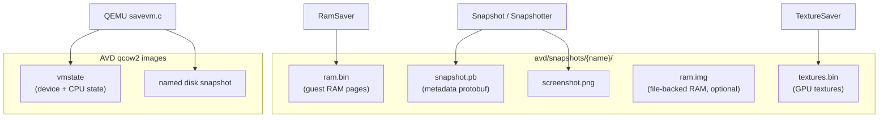
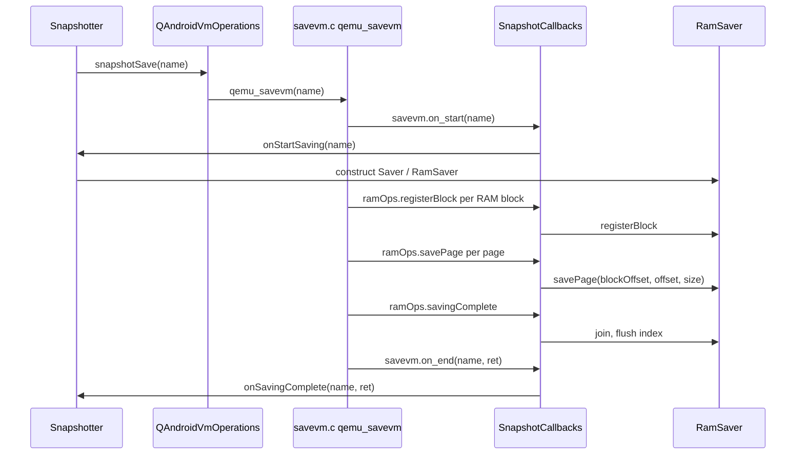
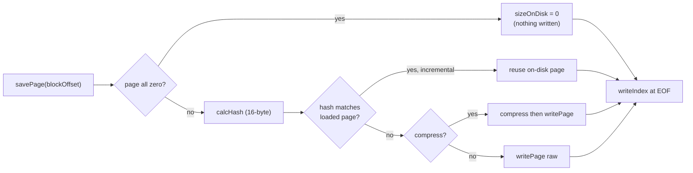
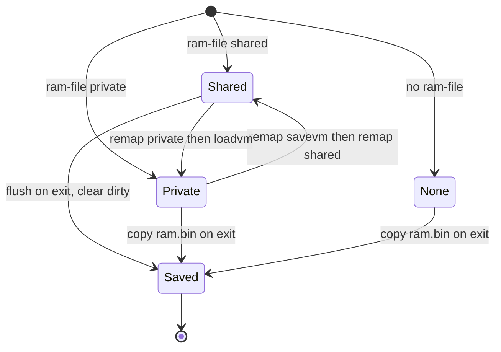
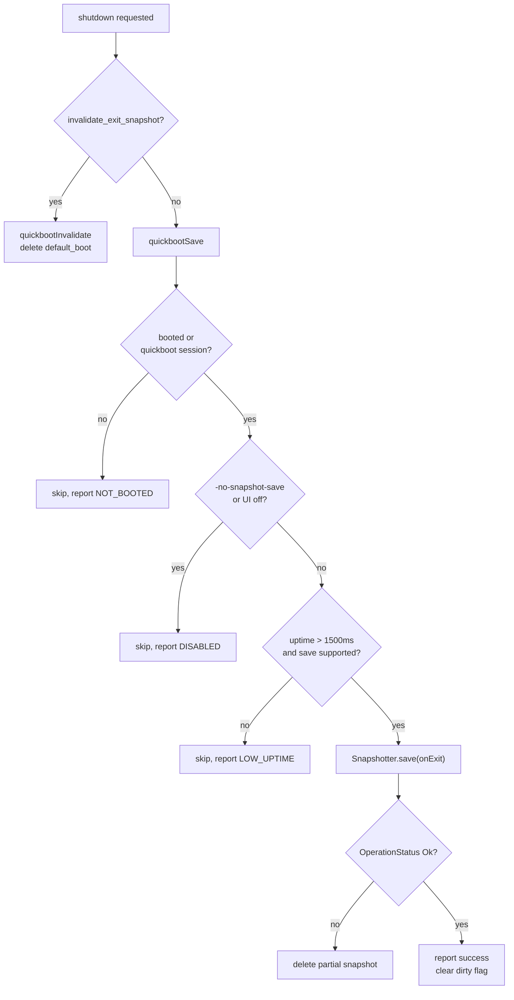
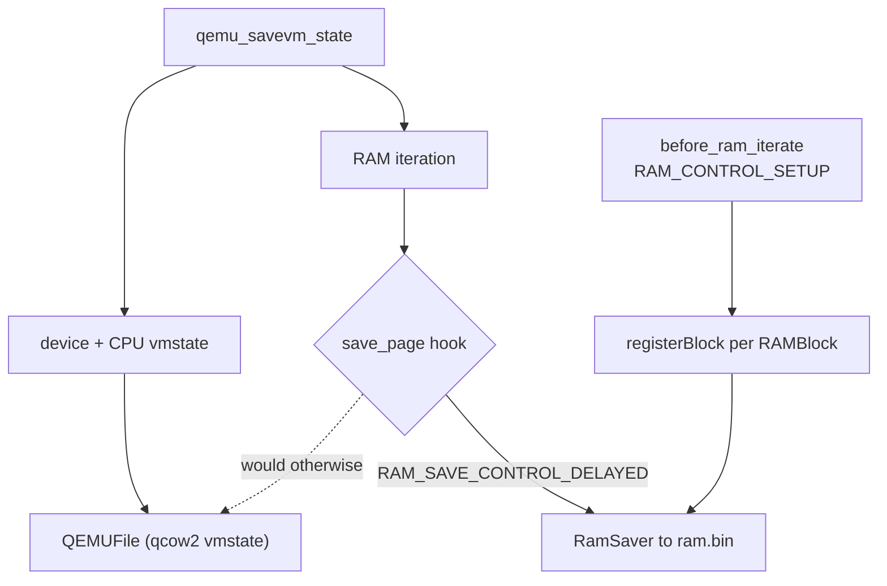

# Chapter 9: Snapshots and Quickboot

A snapshot is a frozen copy of the entire virtual machine: the contents of guest RAM, the state of every emulated device, the CPU registers, and the disk images, captured at one instant and written to a directory the emulator can later restore from. Quickboot is the feature that makes this invisible to the user — instead of cold-booting Android (kernel, init, zygote, the full launcher startup that takes tens of seconds), the emulator saves a `default_boot` snapshot when you close it and restores that snapshot the next time you start the same AVD, so the device is back on screen in a couple of seconds.

This chapter follows the machinery end to end. The high-level `Snapshotter` in `android-emu` owns the workflow and the metadata; QEMU's `migration/savevm.c` actually serializes device state and drives RAM iteration; and a set of file hooks redirects RAM page traffic away from QEMU's own vmstate stream into a custom `RamSaver`/`RamLoader` pair that writes a separate `ram.bin` file with zero-page elision, hashing, and optional compression. We also look at file-backed RAM, where guest memory is mapped from a host file and the "save" becomes almost free.

---

## 9.1 What a Snapshot Contains

A snapshot lives in its own directory under the AVD's content path: `<avd>/snapshots/<name>/`. The constants that name the files inside it are defined in `hardware/google/aemu/host-common/include/host-common/snapshot_common.h`:

```cpp
// Source: hardware/google/aemu/host-common/include/host-common/snapshot_common.h
constexpr const char* kDefaultBootSnapshot = "default_boot";
constexpr const char* kRamFileName = "ram.bin";
constexpr const char* kTexturesFileName = "textures.bin";
constexpr const char* kMappedRamFileName = "ram.img";
constexpr const char* kMappedRamFileDirtyName = "ram.img.dirty";
constexpr const char* kSnapshotProtobufName = "snapshot.pb";
```

The pieces split across three concerns:

1. Guest RAM, written to `ram.bin` (or memory-mapped through `ram.img` when file-backed RAM is enabled).
2. GPU texture state, written to `textures.bin` by the `TextureSaver`.
3. Device and CPU state plus block-device snapshots, handled by QEMU's `migration/savevm.c` and stored inside the qcow2 disk images, alongside `snapshot.pb` metadata that describes the whole thing.

The base directory is computed in `external/qemu/android/android-emu/android/snapshot/PathUtils.cpp`: `getSnapshotBaseDir()` joins the AVD content path with `snapshots`, and `getSnapshotDir(name)` appends the snapshot name. The disk state does not live in these per-snapshot files — it lives as named qcow2 snapshots inside the AVD's writable qcow2 images, which is why deleting the `default_boot` directory is not enough to fully purge a snapshot.

### 9.1.1 The directory layout

The diagram below shows the on-disk artifacts for one snapshot and which subsystem produces each.

#### Snapshot directory contents and their producers



## 9.2 The Snapshotter: Workflow and Ownership

`Snapshotter` (in `external/qemu/android/android-emu/android/snapshot/Snapshotter.h`) is a process-wide singleton retrieved through `Snapshotter::get()`. It does not serialize anything itself; instead it owns a `Saver` and a `Loader`, holds two agent interfaces — `QAndroidVmOperations` (the bridge into QEMU) and `QAndroidEmulatorWindowAgent` (for showing messages) — and registers a set of callbacks that QEMU invokes at the right moments during `savevm`/`loadvm`.

The wiring happens in `Snapshotter::initialize`, which builds a static `SnapshotCallbacks` table and hands it to QEMU through `mVmOperations.setSnapshotCallbacks`:

```cpp
// Source: external/qemu/android/android-emu/android/snapshot/Snapshotter.cpp
assert(vmOperations.setSnapshotCallbacks);
mVmOperations = vmOperations;
mWindowAgent = windowAgent;
mVmOperations.setSnapshotCallbacks(this, &kCallbacks);
```

The table has two halves. The `ops` half carries save/load/delete lifecycle callbacks (`onStart`, `onEnd`, `onQuickFail`, `isCanceled`), each forwarding into a `Snapshotter` method such as `onStartSaving` or `onLoadingComplete`. The `ramOps` half carries the RAM-specific callbacks — `registerBlock`, `startLoading`, `savePage`, `savingComplete`, and `loadRam` — which route into the `RamSaver`/`RamLoader` held inside the current `Saver`/`Loader`.

### 9.2.1 The save and load entry points

A save is driven by `Snapshotter::save`, which records timing, sets the "exiting" flag when appropriate, and calls into QEMU:

```cpp
// Source: external/qemu/android/android-emu/android/snapshot/Snapshotter.cpp
mIsOnExit = isOnExit;
if (mIsOnExit) {
    mVmOperations.setExiting();
}
// ...
mVmOperations.snapshotSave(name, this, nullptr);
```

The symmetric `Snapshotter::load` first reads the optional `compatible.pb` and hands it to QEMU, then calls `mVmOperations.snapshotLoad(name, this, nullptr)`. Both `snapshotSave` and `snapshotLoad` are pointers into the QEMU glue, where the real `qemu_savevm` / `qemu_loadvm` calls live. The key inversion of control to keep in mind: the `Snapshotter` calls QEMU, and QEMU calls back into the `Snapshotter` through the registered callbacks — RAM is never handled in a single straight-line function.

### 9.2.2 Generic save versus quickboot save

There are two paths into a save. `saveGeneric`/`loadGeneric` are for the explicit, user-initiated snapshots (the console `avd snapshot save <name>` command, or Android Studio's snapshot UI). They run extra validation and metrics through `checkSafeToSave`/`checkSafeToLoad` and `handleGenericSave`/`handleGenericLoad`. The quickboot path (covered in 9.7) goes through `Quickboot::save`/`Quickboot::load`, which add their own boot-completion and uptime gating before calling the same `Snapshotter::save`/`Snapshotter::load`.

`checkSafeToSave` refuses to save when the guest has not finished booting (`isSnapshotAlive()`), when no name was supplied, when the disk is under pressure, or when the VM has flagged the save as unsupported:

```cpp
// Source: external/qemu/android/android-emu/android/snapshot/Snapshotter.cpp
if (mVmOperations.isSnapshotSaveSkipped()) {
    SnapshotSkipReason vmReason = mVmOperations.getSkipSnapshotSaveReason();
    dwarning(
            "Snapshot saving is currently unavailable due to the "
            "emulator's current state. Reason: %s", toString_SnapshotSkipReason(vmReason));
    // ... report metrics, return false
}
```

#### The save call path from Snapshotter into QEMU and back



## 9.3 The Metadata Protobuf

Every snapshot carries a `snapshot.pb`, a serialized `emulator_snapshot::Snapshot` message defined in `external/qemu/android/emu/protos/snapshot.proto`. This file is what makes a snapshot rejectable: before the emulator commits to loading guest RAM, it reads the protobuf and checks that the current host and configuration are compatible. The header note in the proto file states that the schema is intentionally shared with Android Studio's copy and must be kept in sync.

The most load-bearing fields:

```proto
// Source: external/qemu/android/emu/protos/snapshot.proto
message Snapshot {
    optional int32 version = 1;
    optional int64 creation_time = 2;
    repeated Image images = 3;
    optional Host host = 4;
    optional Config config = 5;
    optional int64 failed_to_load_reason_code = 7;
    optional bool guest_data_partition_mounted = 8;
    optional int32 rotation = 9;
    optional int32 invalid_loads = 10;
    optional int32 successful_loads = 11;
    // ...
    optional string emulator_build_id = 18;
    optional string system_image_build_id = 19;
    optional bool gfxstream = 20;
}
```

The `Config` sub-message records the enabled feature flags (as raw `int32` so the proto schema need not change for every new feature), the CPU core count, the RAM size, and the selected GLES/Vulkan renderers. The `Host` sub-message records `gpu_driver` and `hypervisor`. The `Image` list records the disk images that were mounted, with sizes and modification times so the loader can detect a system-image swap.

### 9.3.1 The version number

The snapshot `version` is not a hand-bumped integer; it is computed in `external/qemu/android/android-emu/android/snapshot/Snapshot.cpp` from a base number and the count of feature-control items, so that adding a feature flag automatically changes the version:

```cpp
// Source: external/qemu/android/android-emu/android/snapshot/Snapshot.cpp
static constexpr int kVersionBase = 86;
// ... kFeatureOffset counts every FEATURE_CONTROL_ITEM
static constexpr int kVersion = (kVersionBase << 10) + kFeatureOffset;
```

`isVersionCompatible()` then compares either the full version or just the high bits (`version >> 10`, the base part) depending on a flag, so a feature-count change can be tolerated where a base-version change cannot.

### 9.3.2 Validation and failure reasons

When `Snapshot::checkValid` runs, it calls `verifyHost` and `verifyConfig`. `verifyHost` rejects a snapshot whose recorded hypervisor differs from the running one (`ConfigMismatchHostHypervisor`) or whose GPU driver string differs (`ConfigMismatchHostGpu`):

```cpp
// Source: external/qemu/android/android-emu/android/snapshot/Snapshot.cpp
if (host.has_hypervisor() &&
    host.hypervisor() != vmConfig.hypervisorType) {
    if (writeFailure) {
        saveFailure(FailureReason::ConfigMismatchHostHypervisor);
    }
    return false;
}
```

`verifyConfig` checks CPU core count, RAM size, and feature flags; the renderer and AVD config are checked separately. The failure reasons form a tiered enum in `snapshot_common.h` with threshold sentinels — `UnrecoverableErrorLimit = 10000`, `ValidationErrorLimit = 20000`, `InProgressLimit = 30000` — so calling code can bucket a failure into "unrecoverable, delete it" versus "validation mismatch, just cold boot this time" without enumerating every reason. The quickboot loader uses exactly these thresholds when deciding whether to delete a snapshot or merely fall back to a cold boot.

## 9.4 RAM Save: the RamSaver

The largest part of a snapshot is guest RAM, often a gigabyte or more. Saving it naively — copying every byte — would be slow and would store mostly zeros. The `RamSaver` (in `external/qemu/android/android-emu/android/snapshot/RamSaver.cpp` and its header) writes a compact, self-describing `ram.bin` that elides zero pages, deduplicates pages by hash, and can compress and write asynchronously.

The on-disk file structure is documented in the header itself:

```cpp
// Source: external/qemu/android/android-emu/android/snapshot/RamSaver.h
// The file structure is as follows:
//
// 0: 8 bytes, index offset in the file (indexOffset)
// 8: first nonzero page as struct FileIndex::Page
// 8 + first page size: second nonzero page
// ....
// indexOffset: struct FileIndex
// EOF
```

So the first eight bytes are a big-endian offset pointing at the index that sits at the end of the file. Page data fills the middle. The loader reads the offset first, seeks to the index, and learns where every page lives — which means the load can be random-access and lazy, not a sequential replay.

### 9.4.1 Registering blocks and saving pages

QEMU's RAM is organized into named `RAMBlock`s. During save, the file hook in the glue walks every migratable block and calls `ramOps.registerBlock` for each; the `RamSaver` simply records them:

```cpp
// Source: external/qemu/android/android-emu/android/snapshot/RamSaver.cpp
void RamSaver::registerBlock(const RamBlock& block) {
    mIndex.blocks.push_back({block, {}});
}
```

Then QEMU iterates pages and calls `savePage`. The first time `savePage` is called for a block, the `RamSaver` resizes the page vector for that whole block and runs a zero-check pass over all its pages at once. The zero check uses a hand-written SSE2 routine (`buffer_zero_sse2` in `Snapshotter.cpp`, modeled on QEMU's `bufferzero.c`) so that all-zero pages get `sizeOnDisk == 0` and occupy nothing on disk. To keep the zero-check and hashing from making cold RAM resident and competing with the OS pager, the saver issues `MemoryHint::DontNeed` over 16 MB ranges as it goes (`kDecommitChunkSize`).

Several block kinds are skipped entirely in `savePage`: read-only blocks, user-backed blocks (`SNAPSHOT_RAM_USER_BACKED`), and — when saving asynchronously — blocks already mapped shared (`SNAPSHOT_RAM_MAPPED_SHARED`), because a shared mapping is already persisted through its backing file.

### 9.4.2 The index and incremental save

After all pages are handled, `writeIndex` serializes the `FileIndex` to the tail of the file: version, flags, total page count, then per block the id, page count, page size, and for each non-zero page a packed size, a packed signed delta to the previous file position, and the 16-byte page hash.

```cpp
// Source: external/qemu/android/android-emu/android/snapshot/RamSaver.cpp
stream.putBe32(uint32_t(mIndex.version));
stream.putBe32(uint32_t(mIndex.flags));
stream.putBe32(uint32_t(mIndex.totalPages));
```

The hashes drive both deduplication within one snapshot and incremental saving across snapshots. When a previous load left a `RamLoader` around with gap-tracking intact, the new `Saver` passes that loader to the `RamSaver` (`tryIncremental = loader && !loader->hasError() && loader->hasGaps()`), and pages whose hash matches the previously-loaded page can be left in place rather than rewritten. The leftover free space from rewriting is tracked by a `GapTracker`, also serialized into the index (only for version > 1).

#### RamSaver page pipeline



### 9.4.3 Compression heuristics

Compression is controlled either by the `ANDROID_SNAPSHOT_COMPRESS` environment variable or by an automatic heuristic in `Saver`'s constructor. The heuristic enables compression when there are at least three CPU cores and either free RAM is below 1536 MB or the snapshot directory is on a spinning disk:

```cpp
// Source: external/qemu/android/android-emu/android/snapshot/Saver.cpp
if (numCores > 2) {
    auto freeMb = mMemUsage.avail_phys_memory / (1024 * 1024);
    if (freeMb < 1536) {
        flags |= RamSaver::Flags::Compress;
    } else {
        if (mDiskKind.valueOr(DiskKind::Ssd) == DiskKind::Hdd) {
            flags |= RamSaver::Flags::Compress;
        }
    }
}
```

The idea is that when writing is the bottleneck (slow disk) or memory is scarce, spending spare CPU cores on compression is a net win; on a fast SSD with plenty of RAM, raw pages load faster.

## 9.5 RAM Restore: the RamLoader

The `RamLoader` (`external/qemu/android/android-emu/android/snapshot/RamLoader.cpp`) is the inverse. It reads the eight-byte offset, seeks to the index, parses it with `readIndex`, then either eagerly reads every page or registers memory-access watches for on-demand (lazy) loading.

```cpp
// Source: external/qemu/android/android-emu/android/snapshot/RamLoader.cpp
mVersion = stream.getBe32();
if (mVersion < 1 || mVersion > 2) {
    return false;
}
mIndex.flags = IndexFlags(stream.getBe32());
const bool compressed = nonzero(mIndex.flags & IndexFlags::CompressedPages);
auto pageCount = stream.getBe32();
```

### 9.5.1 Eager versus on-demand loading

`RamLoader::start` branches on whether a `MemoryAccessWatch` is available:

```cpp
// Source: external/qemu/android/android-emu/android/snapshot/RamLoader.cpp
if (!mAccessWatch) {
    bool res = readAllPages();
    mEndTime = base::System::get()->getHighResTimeUs();
    return res;
}
if (!registerPageWatches()) {
    mHasError = true;
    return false;
}
mBackgroundPageIt = mIndex.pages.begin();
mAccessWatch->doneRegistering();
mReaderThread.start();
```

With no access watch, `readAllPages` reads everything up front. With an access watch, the loader instead protects all guest RAM, returns control to the VM immediately, and faults pages in on first touch — `loadRam`/`loadRamPage` service the fault by reading just the needed page from `ram.bin`, while a background reader thread fills the rest. This is what makes quickboot feel instant: the guest starts running before all of RAM has been read from disk. `onDemandEnabled()` reports which mode was used, and the metrics record it as `lazy_loaded`. The platform-specific watch implementations live alongside in `MemoryWatch_linux.cpp`, `MemoryWatch_darwin.cpp`, and `MemoryWatch_windows.cpp`.

When the VM is being shut down or the loader must be torn down deterministically, `join` walks every page and forces a bulk fill before waiting for the reader and watch threads — this guarantees all pages are resident before the underlying file is closed.

## 9.6 File-Backed RAM

The save paths above copy RAM out to `ram.bin`. File-backed RAM inverts that: guest memory is mapped directly from a host file (`ram.img`), so the guest's writes go to the file as it runs and a "save" mostly amounts to flushing rather than copying. This is selected at the QEMU level by the `mem_path` / `mem_file_shared` globals, which `vl.c` wires into the snapshot subsystem at startup:

```c
// Source: external/qemu/vl.c
if (mem_path) {
    androidSnapshot_setRamFile(mem_path, mem_file_shared);
}
if (androidSnapshot_quickbootLoad(loadvm)) {
    tryDefaultVmLoad = false;
}
```

`androidSnapshot_setRamFile` (in `interface.cpp`) records the path and whether it is shared on the `Snapshotter` (`setRamFile`). The two modes matter:

- Shared mapping (`SNAPSHOT_RAM_FILE_SHARED`): the guest writes through to `ram.img`, so on exit there is little to copy. Save is nearly free.
- Private mapping (`SNAPSHOT_RAM_FILE_PRIVATE`): the file is the initial image but guest writes are copy-on-write in the host's page cache, so a real save is still needed.

`androidSnapshot_getRamFileInfo` reports which of `SNAPSHOT_RAM_FILE_NONE`, `_PRIVATE`, or `_SHARED` is active. A subtlety enforced in `Quickboot::save`: if there is a RAM file but it is not shared, saving is refused outright, because a private file-backed session can't be persisted by flushing alone:

```cpp
// Source: external/qemu/android/android-emu/android/snapshot/Quickboot.cpp
if (Snapshotter::get().hasRamFile() &&
    !Snapshotter::get().isRamFileShared()) {
    dwarning("Not saving state: RAM not mapped as shared");
    return false;
}
```

### 9.6.1 Preallocation and the dirty flag

Because a shared `ram.img` is written as the guest runs, the emulator must allocate it ahead of time and guard against a half-written file. `androidSnapshot_prepareAutosave` computes the aligned RAM size, deletes the directory if a previous dirty flag is present, and re-creates the file at the right size:

```cpp
// Source: external/qemu/android/android-emu/android/snapshot/interface.cpp
// Delete the snapshot dir if RAM file still dirty.
if (androidSnapshot_isRamFileDirty(name)) {
    VLOG(snapshot) << "Found invalid RAM file. Deleting snapshot.";
    path_delete_dir(dir.c_str());
    path_mkdir_if_needed_no_cow(dir.c_str(), 0744);
}
```

The dirty flag is just the presence of a `ram.img.dirty` marker file, written by `androidSnapshot_setRamFileDirty`. The flow is: mark dirty before the guest starts mutating the mapping; clear it on a clean save. If the emulator crashes mid-run, the marker survives and the next launch discards the corrupt image and cold-boots — the alternative would be restoring half-updated guest memory.

### 9.6.2 Remapping between shared and private at runtime

The `snapshotRemap` operation (`qemu_snapshot_remap` in the glue) lets the running emulator switch a file-backed RAM mapping between shared and private without restarting. It only supports the `default_boot` snapshot. To go private to shared it does a `savevm` then `ram_blocks_remap_shared(true)`; to go shared to private it does `ram_blocks_remap_shared(false)` then a `loadvm`:

```cpp
// Source: external/qemu/android-qemu2-glue/qemu-vm-operations-impl.cpp
if (currentRamFileStatus != SNAPSHOT_RAM_FILE_PRIVATE && !shared) {
    vm_stop(RUN_STATE_SAVE_VM);
    android::snapshot::Snapshotter::get().setRemapping(true);
    qemu_savevm("default_boot", ...);
    android::snapshot::Snapshotter::get().setRemapping(false);
    ram_blocks_remap_shared(shared);
} else {
    vm_stop(RUN_STATE_RESTORE_VM);
    ram_blocks_remap_shared(shared);
    qemu_loadvm("default_boot", ...);
}
```

This is what the console command `avd snapshot remap <auto-save>` reaches: turning auto-save on remaps to shared so future exits are cheap; turning it off remaps to private.

#### File-backed RAM states and transitions



## 9.7 Quickboot: Save-on-Exit and Load-on-Boot

Quickboot is implemented in `external/qemu/android/android-emu/android/snapshot/Quickboot.cpp`. The default snapshot name is the constant `kDefaultBootSnapshot = "default_boot"`, exported to QEMU through `android_get_quick_boot_name()`. Two call sites in `vl.c` drive it: the load on startup and the save on shutdown.

On startup, `androidSnapshot_quickbootLoad(loadvm)` (called from `vl.c` as shown in 9.6) routes into `Quickboot::load`. On shutdown, `main_loop_should_exit` decides between invalidating and saving:

```c
// Source: external/qemu/vl.c
if (getConsoleAgents()->settings->android_qemu_mode()) {
    if (invalidate_exit_snapshot) {
        androidSnapshot_quickbootInvalidate(NULL);
    } else {
        androidSnapshot_quickbootSave(NULL);
        getConsoleAgents()->settings->set_arm_snapshot_save_completed(true);
    }
}
```

### 9.7.1 Load gating and cold-boot fallback

`Quickboot::load` is a decision tree. It returns early to a cold boot when the `FastSnapshotV1` feature is off, when `-no-snapshot-load` was passed, or for specific device types (e.g. automotive distant display). Otherwise it calls `Snapshotter::get().load(true /* isQuickboot */, namestr.data())` and inspects the result. On success it records the load, writes a `snapshot.trace` marker, and starts the liveness monitor. On a recoverable failure it falls back to a cold boot; on an unrecoverable one it deletes the snapshot and resets the VM.

The `forceSnapshotLoad` flag (the `-force-snapshot-load` command-line option) changes the failure behavior: instead of cold-booting on failure, the emulator deletes the bad snapshot and exits, so an automated workflow that depends on a snapshot does not silently start from scratch.

### 9.7.2 The liveness monitor

A snapshot can load successfully yet leave a guest that never finishes coming online (adb never connects). `Quickboot` arms a recurring timer that polls `isSnapshotAlive()`:

```cpp
// Source: external/qemu/android/android-emu/android/snapshot/Quickboot.cpp
void Quickboot::onLivenessTimer() {
    if (isSnapshotAlive()) {
        // ... guest is online; touch bootcompleted.ini and stop
        return;
    }
    const auto nowMs = System::get()->getHighResTimeUs() / 1000;
    if (int64_t(nowMs - mLoadTimeMs) > bootTimeoutMs()) {
        // escalate: warn, reset adb, then finally delete snapshot + cold boot
    }
    mLivenessTimer->startRelative(kLivenessTimerTimeoutMs);
}
```

If the guest does not come alive within `bootTimeoutMs()` (7 seconds on x86, longer for ARM or read-only mode), the monitor first nudges adb, then resets the adb connection, and finally — after `kMaxAdbConnectionRetries` — deletes the `default_boot` snapshot and shows a cold-boot message. Deleting the snapshot guarantees that the next launch starts clean rather than re-loading a snapshot that hangs.

### 9.7.3 Save gating

`Quickboot::save` is similarly defensive. It refuses to save when the guest never booted and this was not a quickboot-loaded session, when `FastSnapshotV1` is disabled, when `-no-snapshot-save` was passed, when the UI requested no save-on-exit, when the session was too short (`kMinUptimeForSavingMs = 1500`), or when the VM flagged the state as unsaveable (for example an unsupported Vulkan app). Only past all those gates does it call `Snapshotter::get().save(true /* on exit */, name)`. A failed save deletes the partial snapshot so it cannot be loaded later.

For file-backed RAM there is an extra step in `androidSnapshot_quickbootSave`: it persists the user's save-on-exit choice into a per-AVD `quickbootChoice.ini` via `androidSnapshot_writeQuickbootChoice`, and clears or sets the dirty flag depending on whether the shared save succeeded.

#### Quickboot save-on-exit decision flow



## 9.8 The QEMU Bridge: savevm, loadvm, and File Hooks

The actual serialization of device and CPU state is QEMU's job. `external/qemu/migration/savevm.c` provides `qemu_savevm` and `qemu_loadvm`, which the glue calls from `qemu_snapshot_save` and `qemu_snapshot_load` in `external/qemu/android-qemu2-glue/qemu-vm-operations-impl.cpp`.

```cpp
// Source: external/qemu/android-qemu2-glue/qemu-vm-operations-impl.cpp
bool wasVmRunning = runstate_is_running() != 0;
vm_stop(RUN_STATE_SAVE_VM);
int res = qemu_savevm(name, MessageCallback(opaque, nullptr, errConsumer));
if (wasVmRunning && !sExiting) {
    vm_start();
}
```

`qemu_savevm` stops the VM, fills a `QEMUSnapshotInfo`, calls the registered `savevm.on_start` callback (which builds the `Saver`), opens a `QEMUFile` backed by a block device, calls `qemu_savevm_state` to write all device state, and finally creates a named qcow2 snapshot with `bdrv_all_create_snapshot`. `qemu_loadvm` mirrors this: it finds the named snapshot, calls `loadvm.on_start` (which builds the `Loader`), does `bdrv_all_goto_snapshot` to revert the disks, resets the system, and replays device state with `qemu_loadvm_state`.

### 9.8.1 Redirecting RAM out of the vmstate stream

The crucial trick is that guest RAM does *not* flow through QEMU's normal vmstate stream into the qcow2. Right before serializing, `qemu_savevm` installs file hooks:

```c
// Source: external/qemu/migration/savevm.c
qemu_file_set_hooks(f, sSaveFileHooks);
qemu_file_set_pb(f, s_protobuf);
ret = qemu_savevm_state(f, &local_err);
```

Those `sSaveFileHooks` are defined in the glue as `sSaveHooks`. The `save_page` hook tells QEMU "I handled this page, don't write it yourself" by returning `RAM_SAVE_CONTROL_DELAYED` and setting `bytes_sent` non-zero, while forwarding the page to the `RamSaver` through `ramOps.savePage`:

```cpp
// Source: external/qemu/android-qemu2-glue/qemu-vm-operations-impl.cpp
sSnapshotCallbacks.ramOps.savePage(sSnapshotCallbacksOpaque,
                                   (int64_t)block_offset,
                                   (int64_t)offset, (int32_t)size);
*bytes_sent = size;
return size_t(RAM_SAVE_CONTROL_DELAYED);
```

The `before_ram_iterate` hook, on `RAM_CONTROL_SETUP`, walks every migratable block with `qemu_ram_foreach_migrate_block_with_file_info` and registers each with the `RamSaver`, filling in the host pointer, length, page size, flags, and the relative path to any backing file. The `after_ram_iterate` hook, on `RAM_CONTROL_FINISH`, calls `ramOps.savingComplete` to flush and join.

The load side uses `sLoadHooks`: its `hook_ram_load` handles `RAM_CONTROL_BLOCK_REG` (register the block on the `RamLoader`) and `RAM_CONTROL_HOOK` (start the loader). A separate `qemu_set_ram_load_callback` routes page faults during lazy loading back through `ramOps.loadRam`. The relevant control-flow constants — `RAM_CONTROL_SETUP`, `RAM_CONTROL_FINISH`, `RAM_CONTROL_BLOCK_REG`, `RAM_CONTROL_HOOK`, and `RAM_SAVE_CONTROL_DELAYED` — are defined in `external/qemu/migration/qemu-file.h`.

#### How the file hooks split device state from RAM



## 9.9 Textures, Compatibility Protobuf, and Cleanup

Two smaller artifacts round out the format. The `TextureSaver` (constructed in `Saver`'s constructor opening `textures.bin` for writing) serializes GPU texture memory so a restored guest does not have to regenerate it; the `TextureLoader` restores it on load, joined alongside the `RamLoader` in `Loader::complete`. Texture data can be compressed independently of RAM, tracked separately in the metrics (`compressedTextures`).

The optional `compatible.pb` is written by `Snapshotter::save` when the VM provides a `setSnapshotProtobuf` hook, and read back by `Snapshotter::load` before the load begins:

```cpp
// Source: external/qemu/android/android-emu/android/snapshot/Snapshotter.cpp
if (mVmOperations.setSnapshotProtobuf) {
    std::string compatiblePbPath =
            PathUtils::join(getSnapshotDir(name), "compatible.pb");
    std::ofstream compatible_out(compatiblePbPath, std::ios::binary);
    mCompatiblePb->SerializeToOstream(&compatible_out);
}
```

### 9.9.1 Delete and invalidate

There are two ways to remove a snapshot. `deleteSnapshot` invalidates it, then deletes the whole directory with `path_delete_dir`. `invalidateSnapshot` is gentler: it writes a `Tombstone` failure into the protobuf, asks QEMU to drop the disk-side snapshot through `snapshotDelete`, and removes the RAM/textures/mapped-RAM files but can leave the metadata around:

```cpp
// Source: external/qemu/android/android-emu/android/snapshot/Snapshotter.cpp
mVmOperations.snapshotDelete(name, this, nullptr);
path_delete_file(PathUtils::join(getSnapshotDir(nameValidated), kRamFileName).c_str());
path_delete_file(PathUtils::join(getSnapshotDir(nameValidated), kTexturesFileName).c_str());
path_delete_file(PathUtils::join(getSnapshotDir(nameValidated), kMappedRamFileName).c_str());
tombstone.saveFailure(FailureReason::Tombstone);
```

The crash interaction is worth noting: `onCrashedSnapshot` treats a crash within `kSnapshotCrashThresholdMs` (two minutes) of loading as a snapshot fault and marks the load failed, so a snapshot that reliably crashes the emulator soon after load will be invalidated rather than re-loaded forever.

## 9.10 Try It

The following exercises assume an x86_64 AVD and the `emulator` binary on your `PATH`.

- List the snapshots stored in an AVD without starting a UI session:

```bash
emulator -avd <avd_name> -snapshot-list
```

- Disable quickboot for one launch (full cold boot, no auto-save on exit):

```bash
emulator -avd <avd_name> -no-snapshot
```

- Cold-boot once but keep the existing `default_boot` around (load full, do not auto-load):

```bash
emulator -avd <avd_name> -no-snapshot-load
```

- Inspect a saved snapshot directory and its metadata (replace the path with your AVD content path):

```bash
ls -la $HOME/.android/avd/<avd_name>.avd/snapshots/default_boot/
```

You should see `ram.bin`, `textures.bin`, and `snapshot.pb`; if file-backed RAM is in use you will see `ram.img` instead of (or alongside) `ram.bin`.

- From a running emulator, use the console to take and load a named snapshot. Connect with `telnet localhost 5554`, authenticate with the token, then:

```bash
avd snapshot save mysnap
avd snapshot list
avd snapshot load mysnap
```

- Force RAM compression on the next save and watch the verbose log explain its choice:

```bash
ANDROID_SNAPSHOT_COMPRESS=1 emulator -avd <avd_name> -verbose
```

## Summary

- A snapshot is a directory under `<avd>/snapshots/<name>/` containing `ram.bin` (guest RAM), `textures.bin` (GPU state), `snapshot.pb` (metadata), and optionally `ram.img` (file-backed RAM); device and CPU state plus disk snapshots live inside the qcow2 images.
- `Snapshotter` is the process-wide coordinator. It owns a `Saver`/`Loader`, registers callbacks with QEMU through `setSnapshotCallbacks`, and drives saves/loads via `snapshotSave`/`snapshotLoad`, but delegates the actual serialization.
- The `snapshot.pb` protobuf records version, host (hypervisor and GPU driver), config (features, cores, RAM, renderers), and image list; the loader rejects incompatible snapshots using tiered `FailureReason` thresholds. The version number is derived from a base value plus the feature-flag count.
- `RamSaver` writes a compact `ram.bin`: an 8-byte trailing-index offset, then non-zero pages, then a `FileIndex` with per-page hashes. Zero pages are elided, matching pages can be reused incrementally, and compression is chosen by a CPU, free-RAM, and disk heuristic.
- `RamLoader` reads the index first, then either eagerly loads all pages or, with a `MemoryAccessWatch`, lazily faults pages in on first touch while a background thread fills the rest — the mechanism that makes quickboot feel instant.
- File-backed RAM maps guest memory from `ram.img`; a shared mapping makes save nearly free, a private one still needs a copy, and a `ram.img.dirty` marker forces a cold boot after a crash. `snapshotRemap` switches between shared and private at runtime for `default_boot`.
- Quickboot saves `default_boot` on exit and loads it on boot, gated by feature flags, boot completion, uptime, and command-line options; a liveness monitor deletes the snapshot and cold-boots if the restored guest never comes online.
- QEMU's `savevm.c` serializes device/CPU state and creates the qcow2 snapshot, while file hooks redirect RAM pages out of the vmstate stream into the custom `RamSaver`/`RamLoader` by returning `RAM_SAVE_CONTROL_DELAYED`.

### Key Source Files

| File | Purpose |
|------|---------|
| `external/qemu/android/android-emu/android/snapshot/Snapshotter.cpp` | Coordinator: callback wiring, save/load/delete workflow, metrics |
| `external/qemu/android/android-emu/android/snapshot/Quickboot.cpp` | Save-on-exit / load-on-boot policy, liveness monitor, cold-boot fallback |
| `external/qemu/android/android-emu/android/snapshot/RamSaver.cpp` | `ram.bin` writer: zero elision, hashing, incremental save, compression |
| `external/qemu/android/android-emu/android/snapshot/RamLoader.cpp` | `ram.bin` reader: index parse, eager vs lazy on-demand page loading |
| `external/qemu/android/android-emu/android/snapshot/Snapshot.cpp` | Metadata protobuf, version computation, host/config validation |
| `external/qemu/android/android-emu/android/snapshot/interface.cpp` | C API surface, file-backed RAM preallocation and dirty flag |
| `external/qemu/android/emu/protos/snapshot.proto` | The `emulator_snapshot::Snapshot` metadata schema |
| `external/qemu/migration/savevm.c` | QEMU `qemu_savevm` / `qemu_loadvm` and snapshot callback dispatch |
| `external/qemu/android-qemu2-glue/qemu-vm-operations-impl.cpp` | RAM file hooks, block registration, remap, glue into savevm |
| `hardware/google/aemu/host-common/include/host-common/snapshot_common.h` | File-name constants, `FailureReason`, `OperationStatus`, page size |
