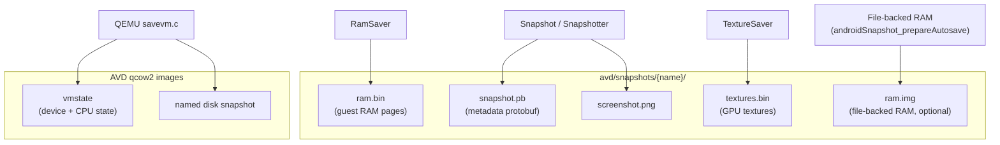
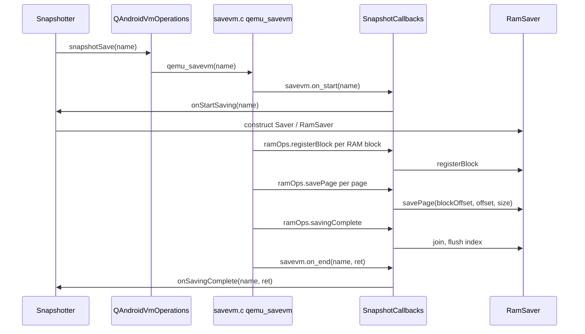
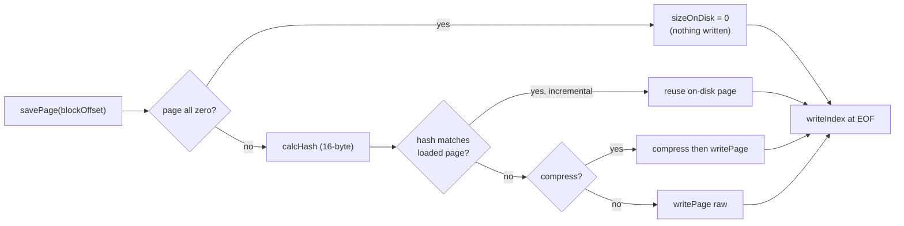
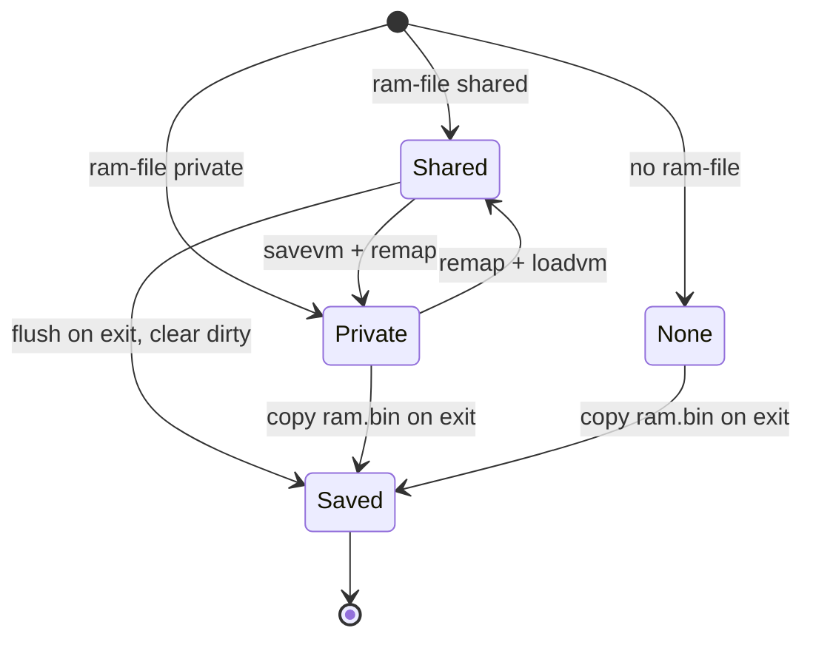
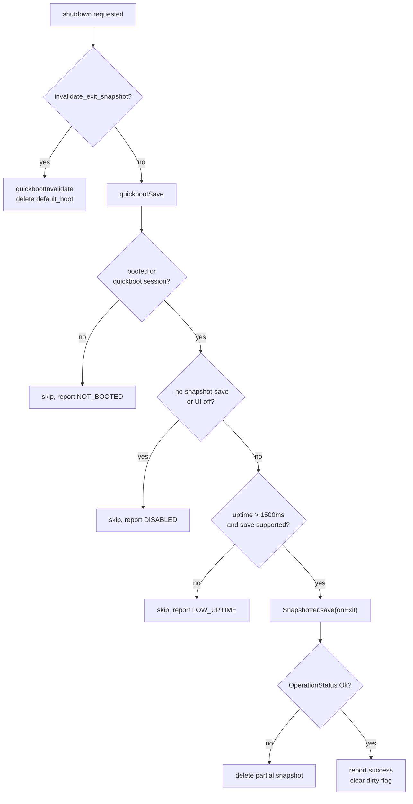
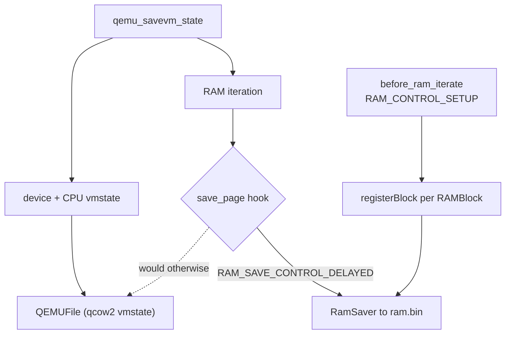
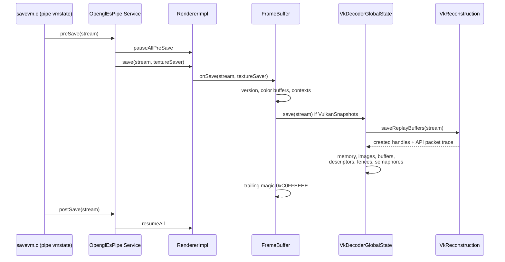

# Chapter 9: Snapshots and Quickboot

A snapshot is a frozen copy of the entire virtual machine. It holds the contents of guest RAM, the state of every emulated device, the CPU registers, and the disk images. The emulator captures them at one instant and writes them to a directory that it can later restore from. Quickboot is the feature that makes this invisible to the user.

A cold boot of Android runs the kernel, init, zygote, and the full launcher startup, and that takes tens of seconds. Quickboot avoids it. The emulator saves a `default_boot` snapshot when you close it and restores that snapshot the next time you start the same AVD. The device is then back on screen in a couple of seconds.

This chapter follows the machinery end to end. The high-level `Snapshotter` in `android-emu` owns the workflow and the metadata. QEMU's `migration/savevm.c` serializes device state and drives RAM iteration. A set of file hooks redirects RAM page traffic away from QEMU's own vmstate stream. The traffic goes into a custom `RamSaver`/`RamLoader` pair, which writes a separate `ram.bin` file with zero-page elision, hashing, and optional compression. We also look at file-backed RAM, where guest memory is mapped from a host file and the "save" becomes almost free.

---

## 9.1 What a Snapshot Contains

A snapshot lives in its own directory under the AVD's content path: `<avd>/snapshots/<name>/`. The constants that name the files inside it are defined in `hardware/google/aemu/host-common/include/host-common/snapshot_common.h`:

```cpp
// Source: hardware/google/aemu/host-common/include/host-common/snapshot_common.h
constexpr const char* kDefaultBootSnapshot = "default_boot";
constexpr const char* kRamFileName = "ram.bin";
constexpr const char* kTexturesFileName = "textures.bin";
constexpr const char* kMappedRamFileName = "ram.img";
constexpr const char* kMappedRamFileDirtyName = "ram.img.dirty";
constexpr const char* kSnapshotProtobufName = "snapshot.pb";
```

The pieces split across three concerns:

1. Guest RAM, written to `ram.bin` (or memory-mapped through `ram.img` when file-backed RAM is enabled).
2. GPU texture state, written to `textures.bin` by the `TextureSaver`.
3. Device and CPU state plus block-device snapshots. QEMU's `migration/savevm.c` handles them and stores them inside the qcow2 disk images. The `snapshot.pb` metadata describes the whole thing.

The base directory is computed in `external/qemu/android/android-emu/android/snapshot/PathUtils.cpp`: `getSnapshotBaseDir()` joins the AVD content path with `snapshots`, and `getSnapshotDir(name)` appends the snapshot name. The disk state does not live in these per-snapshot files. It lives as named qcow2 snapshots inside the AVD's writable qcow2 images. For this reason, deleting the `default_boot` directory is not enough to fully purge a snapshot.

### 9.1.1 The directory layout

The diagram below shows the on-disk artifacts for one snapshot and which subsystem produces each.


```mermaid
flowchart TB
    subgraph DIR["avd/snapshots/{name}/"]
        PB["snapshot.pb<br/>(metadata protobuf)"]
        RAM["ram.bin<br/>(guest RAM pages)"]
        TEX["textures.bin<br/>(GPU textures)"]
        IMG["ram.img<br/>(file-backed RAM, optional)"]
        SS["screenshot.png"]
    end
    subgraph QCOW["AVD qcow2 images"]
        VMS["vmstate<br/>(device + CPU state)"]
        DISK["named disk snapshot"]
    end
    SNAP["Snapshot / Snapshotter"] --> PB
    RS["RamSaver"] --> RAM
    TS["TextureSaver"] --> TEX
    FB["File-backed RAM<br/>(androidSnapshot_prepareAutosave)"] --> IMG
    SAVEVM["QEMU savevm.c"] --> VMS
    SAVEVM --> DISK
    SNAP --> SS
```

*Figure 9-1: Snapshot directory contents and their producers*

## 9.2 The Snapshotter: Workflow and Ownership

`Snapshotter` (in `external/qemu/android/android-emu/android/snapshot/Snapshotter.h`) is a process-wide singleton retrieved through `Snapshotter::get()`. It does not serialize anything itself. Instead it owns a `Saver` and a `Loader`. It holds two agent interfaces: `QAndroidVmOperations` (the bridge into QEMU) and `QAndroidEmulatorWindowAgent` (for showing messages). It also registers a set of callbacks that QEMU invokes at the right moments during `savevm`/`loadvm`.

The wiring happens in `Snapshotter::initialize`, which builds a static `SnapshotCallbacks` table and hands it to QEMU through `mVmOperations.setSnapshotCallbacks`:

```cpp
// Source: external/qemu/android/android-emu/android/snapshot/Snapshotter.cpp
assert(vmOperations.setSnapshotCallbacks);
mVmOperations = vmOperations;
mWindowAgent = windowAgent;
mVmOperations.setSnapshotCallbacks(this, &kCallbacks);
```

The table has two halves. The `ops` half carries save/load/delete lifecycle callbacks (`onStart`, `onEnd`, `onQuickFail`, `isCanceled`), each forwarding into a `Snapshotter` method such as `onStartSaving` or `onLoadingComplete`. The `ramOps` half carries the RAM-specific callbacks — `registerBlock`, `startLoading`, `savePage`, `savingComplete`, and `loadRam` — which route into the `RamSaver`/`RamLoader` held inside the current `Saver`/`Loader`.

### 9.2.1 The save and load entry points

A save is driven by `Snapshotter::save`, which records timing, sets the "exiting" flag when appropriate, and calls into QEMU:

```cpp
// Source: external/qemu/android/android-emu/android/snapshot/Snapshotter.cpp
mIsOnExit = isOnExit;
if (mIsOnExit) {
    mVmOperations.setExiting();
}
// ...
mVmOperations.snapshotSave(name, this, nullptr);
```

The symmetric `Snapshotter::load` first reads the optional `compatible.pb` and hands it to QEMU, then calls `mVmOperations.snapshotLoad(name, this, nullptr)`. Both `snapshotSave` and `snapshotLoad` are pointers into the QEMU glue, where the real `qemu_savevm` / `qemu_loadvm` calls live. Keep the key inversion of control in mind. The `Snapshotter` calls QEMU, and QEMU calls back into the `Snapshotter` through the registered callbacks. RAM is never handled in a single straight-line function.

### 9.2.2 Generic save versus quickboot save

There are two paths into a save. `saveGeneric`/`loadGeneric` are for the explicit, user-initiated snapshots (the console `avd snapshot save <name>` command, or Android Studio's snapshot UI). They run extra validation and metrics through `checkSafeToSave`/`checkSafeToLoad` and `handleGenericSave`/`handleGenericLoad`. The quickboot path (covered in 9.7) goes through `Quickboot::save`/`Quickboot::load`, which add their own boot-completion and uptime gating before calling the same `Snapshotter::save`/`Snapshotter::load`.

`checkSafeToSave` refuses to save in four cases. The first is when the guest has not finished booting (`isSnapshotAlive()`). The others are when no name was supplied, when the disk is under pressure, or when the VM has flagged the save as unsupported:

```cpp
// Source: external/qemu/android/android-emu/android/snapshot/Snapshotter.cpp
if (mVmOperations.isSnapshotSaveSkipped()) {
    SnapshotSkipReason vmReason = mVmOperations.getSkipSnapshotSaveReason();
    dwarning(
            "Snapshot saving is currently unavailable due to the "
            "emulator's current state. Reason: %s", toString_SnapshotSkipReason(vmReason));
    // ... report metrics, return false
}
```


```mermaid
sequenceDiagram
    participant ST as Snapshotter
    participant VM as QAndroidVmOperations
    participant SV as savevm.c qemu_savevm
    participant CB as SnapshotCallbacks
    participant RS as RamSaver

    ST->>VM: snapshotSave(name)
    VM->>SV: qemu_savevm(name)
    SV->>CB: savevm.on_start(name)
    CB->>ST: onStartSaving(name)
    ST->>RS: construct Saver / RamSaver
    SV->>CB: ramOps.registerBlock per RAM block
    CB->>RS: registerBlock
    SV->>CB: ramOps.savePage per page
    CB->>RS: savePage(blockOffset, offset, size)
    SV->>CB: ramOps.savingComplete
    CB->>RS: join, flush index
    SV->>CB: savevm.on_end(name, ret)
    CB->>ST: onSavingComplete(name, ret)
```

*Figure 9-2: The save call path from Snapshotter into QEMU and back*

## 9.3 The Metadata Protobuf

Every snapshot carries a `snapshot.pb`, a serialized `emulator_snapshot::Snapshot` message defined in `external/qemu/android/emu/protos/snapshot.proto`. This file is what makes a snapshot rejectable. Before the emulator commits to loading guest RAM, it reads the protobuf. It then checks that the current host and configuration are compatible. The header note in the proto file states that the schema is intentionally shared with Android Studio's copy and must be kept in sync.

The most load-bearing fields:

```proto
// Source: external/qemu/android/emu/protos/snapshot.proto
message Snapshot {
    optional int32 version = 1;
    optional int64 creation_time = 2;
    repeated Image images = 3;
    optional Host host = 4;
    optional Config config = 5;
    optional int64 failed_to_load_reason_code = 7;
    optional bool guest_data_partition_mounted = 8;
    optional int32 rotation = 9;
    optional int32 invalid_loads = 10;
    optional int32 successful_loads = 11;
    // ...
    optional string emulator_build_id = 18;
    optional string system_image_build_id = 19;
    optional bool gfxstream = 20;
}
```

The `Config` sub-message records the enabled feature flags. It stores them as raw `int32`, so the proto schema need not change for every new feature. It also records the CPU core count, the RAM size, and the selected GLES/Vulkan renderers. The `Host` sub-message records `gpu_driver` and `hypervisor`. The `Image` list records the disk images that were mounted, with sizes and modification times so the loader can detect a system-image swap.

### 9.3.1 The version number

The snapshot `version` packs two numbers into one integer. The high bits hold a hand-maintained base version. The low ten bits hold the count of feature-control items. This count is computed at compile time in `external/qemu/android/android-emu/android/snapshot/Snapshot.cpp`, by re-including the feature definition headers with `FEATURE_CONTROL_ITEM` defined as `+ 1`. In this way, adding a feature flag changes the version without anyone editing it:

```cpp
// Source: external/qemu/android/android-emu/android/snapshot/Snapshot.cpp:429-444
static constexpr int kVersionBase = 87;
// ... kFeatureOffset counts every FEATURE_CONTROL_ITEM
static constexpr int kVersion = (kVersionBase << 10) + kFeatureOffset;
```

`kVersionBase` moves only when the serialized format itself changes. Its recent history is almost entirely graphics. Version 84 added Vulkan renderer checks. Version 86 added display ids to the gfxstream stream. Version 87 covers the gfxstream save/load changes described in 9.10.

`isVersionCompatible()` then compares either the full version or just the high bits (`version >> 10`, the base part). The `DownloadableSnapshot` flag decides which. A feature-count change can be tolerated where a base-version change cannot:

```cpp
// Source: external/qemu/android/android-emu/android/snapshot/Snapshot.cpp:699-709
bool Snapshot::isVersionCompatible() const {
    if (mSnapshotPb.has_version()) {
        if (fc::isEnabled(fc::DownloadableSnapshot)) {
            return (mSnapshotPb.version() >> 10) == (kVersion >> 10);
        } else {
            return (mSnapshotPb.version() == kVersion);
        }
    } else {
        return false;
    }
}
```

A mismatch sets `FailureReason::IncompatibleVersion`, which sits above `UnrecoverableErrorLimit` — so an old snapshot is discarded rather than retried.

### 9.3.2 Validation and failure reasons

When `Snapshot::checkValid` runs, it calls `verifyHost` and `verifyConfig`. `verifyHost` rejects a snapshot whose recorded hypervisor differs from the running one (`ConfigMismatchHostHypervisor`) or whose GPU driver string differs (`ConfigMismatchHostGpu`):

```cpp
// Source: external/qemu/android/android-emu/android/snapshot/Snapshot.cpp
if (host.has_hypervisor() &&
    host.hypervisor() != vmConfig.hypervisorType) {
    if (writeFailure) {
        saveFailure(FailureReason::ConfigMismatchHostHypervisor);
    }
    return false;
}
```

`verifyConfig` checks CPU core count, RAM size, and feature flags; the renderer and AVD config are checked separately. The failure reasons form a tiered enum in `snapshot_common.h` with threshold sentinels: `UnrecoverableErrorLimit = 10000`, `ValidationErrorLimit = 20000`, and `InProgressLimit = 30000`. Calling code can bucket a failure into "unrecoverable, delete it" or "validation mismatch, just cold boot this time". It does not need to enumerate every reason. The quickboot loader uses exactly these thresholds when deciding whether to delete a snapshot or merely fall back to a cold boot.

## 9.4 RAM Save: the RamSaver

The largest part of a snapshot is guest RAM, often a gigabyte or more. Saving it naively — copying every byte — would be slow and would store mostly zeros. The `RamSaver` (in `external/qemu/android/android-emu/android/snapshot/RamSaver.cpp` and its header) writes a compact, self-describing `ram.bin`. The file elides zero pages and deduplicates pages by hash. The saver can also compress and write asynchronously.

The on-disk file structure is documented in the header itself:

```cpp
// Source: external/qemu/android/android-emu/android/snapshot/RamSaver.h
// The file structure is as follows:
//
// 0: 8 bytes, index offset in the file (indexOffset)
// 8: first nonzero page as struct FileIndex::Page
// 8 + first page size: second nonzero page
// ....
// indexOffset: struct FileIndex
// EOF
```

So the first eight bytes are a big-endian offset pointing at the index that sits at the end of the file. Page data fills the middle. The loader reads the offset first, seeks to the index, and learns where every page lives. For this reason the load can be random-access and lazy, not a sequential replay.

### 9.4.1 Registering blocks and saving pages

QEMU's RAM is organized into named `RAMBlock`s. During save, the file hook in the glue walks every migratable block and calls `ramOps.registerBlock` for each; the `RamSaver` simply records them:

```cpp
// Source: external/qemu/android/android-emu/android/snapshot/RamSaver.cpp
void RamSaver::registerBlock(const RamBlock& block) {
    mIndex.blocks.push_back({block, {}});
}
```

Then QEMU iterates pages and calls `savePage`.

The first time `savePage` is called for a block, the `RamSaver` resizes the page vector for that whole block. It then runs a zero-check pass over all its pages at once. The zero check uses a hand-written SSE2 routine (`buffer_zero_sse2` in `Snapshotter.cpp`, modeled on QEMU's `bufferzero.c`). All-zero pages then get `sizeOnDisk == 0` and occupy nothing on disk. The zero check and the hashing must not make cold RAM resident or compete with the OS pager. To prevent this, the saver issues `MemoryHint::DontNeed` over 16 MB ranges as it goes (`kDecommitChunkSize`).

`savePage` skips several block kinds entirely. These are read-only blocks, user-backed blocks (`SNAPSHOT_RAM_USER_BACKED`), and, when saving asynchronously, blocks already mapped shared (`SNAPSHOT_RAM_MAPPED_SHARED`). The last kind is skipped because a shared mapping is already persisted through its backing file.

### 9.4.2 The index and incremental save

After all pages are handled, `writeIndex` serializes the `FileIndex` to the tail of the file. It writes the version, flags, and total page count. Then, per block, it writes the id, page count, and page size. For each non-zero page it writes a packed size, a packed signed delta to the previous file position, and the 16-byte page hash.

```cpp
// Source: external/qemu/android/android-emu/android/snapshot/RamSaver.cpp
stream.putBe32(uint32_t(mIndex.version));
stream.putBe32(uint32_t(mIndex.flags));
stream.putBe32(uint32_t(mIndex.totalPages));
```

The hashes enable incremental saving. When a prior RamLoader is present, any page whose hash matches the corresponding previously-saved page is reused on disk rather than rewritten. The hash is stored in the index so future saves can do the same comparison.

Sometimes a previous load left a `RamLoader` around with gap-tracking intact. In that case the new `Saver` passes that loader to the `RamSaver` (`tryIncremental = loader && !loader->hasError() && loader->hasGaps()`). Pages whose hash matches the previously-loaded page can then be left in place rather than rewritten. The leftover free space from rewriting is tracked by a `GapTracker`, also serialized into the index (only for version > 1).


```mermaid
flowchart LR
    SP["savePage(blockOffset)"] --> ZC{"page all zero?"}
    ZC -->|"yes"| Z["sizeOnDisk = 0<br/>(nothing written)"]
    ZC -->|"no"| H["calcHash (16-byte)"]
    H --> SAME{"hash matches<br/>loaded page?"}
    SAME -->|"yes, incremental"| KEEP["reuse on-disk page"]
    SAME -->|"no"| CMP{"compress?"}
    CMP -->|"yes"| WC["compress then writePage"]
    CMP -->|"no"| WP["writePage raw"]
    Z --> IDX["writeIndex at EOF"]
    KEEP --> IDX
    WC --> IDX
    WP --> IDX
```

*Figure 9-3: RamSaver page pipeline*

### 9.4.3 Compression heuristics

Compression is controlled either by the `ANDROID_SNAPSHOT_COMPRESS` environment variable or by an automatic heuristic in `Saver`'s constructor. The heuristic enables compression when there are at least three CPU cores. In addition, either free RAM must be below 1536 MB or the snapshot directory must be on a spinning disk:

```cpp
// Source: external/qemu/android/android-emu/android/snapshot/Saver.cpp
if (numCores > 2) {
    auto freeMb = mMemUsage.avail_phys_memory / (1024 * 1024);
    if (freeMb < 1536) {
        flags |= RamSaver::Flags::Compress;
    } else {
        if (mDiskKind.valueOr(DiskKind::Ssd) == DiskKind::Hdd) {
            flags |= RamSaver::Flags::Compress;
        }
    }
}
```

The idea is this. When writing is the bottleneck (slow disk) or memory is scarce, spending spare CPU cores on compression is a net win. On a fast SSD with plenty of RAM, raw pages load faster.

## 9.5 RAM Restore: the RamLoader

The `RamLoader` (`external/qemu/android/android-emu/android/snapshot/RamLoader.cpp`) is the inverse. It reads the eight-byte offset, seeks to the index, and parses it with `readIndex`. Then it either eagerly reads every page or registers memory-access watches for on-demand (lazy) loading.

```cpp
// Source: external/qemu/android/android-emu/android/snapshot/RamLoader.cpp
mVersion = stream.getBe32();
if (mVersion < 1 || mVersion > 2) {
    return false;
}
mIndex.flags = IndexFlags(stream.getBe32());
const bool compressed = nonzero(mIndex.flags & IndexFlags::CompressedPages);
auto pageCount = stream.getBe32();
```

### 9.5.1 Eager versus on-demand loading

`RamLoader::start` branches on whether a `MemoryAccessWatch` is available:

```cpp
// Source: external/qemu/android/android-emu/android/snapshot/RamLoader.cpp
if (!mAccessWatch) {
    bool res = readAllPages();
    mEndTime = base::System::get()->getHighResTimeUs();
    return res;
}
if (!registerPageWatches()) {
    mHasError = true;
    return false;
}
mBackgroundPageIt = mIndex.pages.begin();
mAccessWatch->doneRegistering();
mReaderThread.start();
```

With no access watch, `readAllPages` reads everything up front.

With an access watch, the loader instead protects all guest RAM, returns control to the VM immediately, and faults pages in on first touch. `loadRam`/`loadRamPage` service the fault by reading just the needed page from `ram.bin`. Meanwhile a background reader thread fills the rest. This is what makes quickboot feel instant: the guest starts running before all of RAM has been read from disk. `onDemandEnabled()` reports which mode was used, and the metrics record it as `lazy_loaded`. The platform-specific watch implementations live alongside in `MemoryWatch_linux.cpp`, `MemoryWatch_darwin.cpp`, and `MemoryWatch_windows.cpp`.

When the VM shuts down or the loader must be torn down deterministically, `join` walks every page and forces a bulk fill. Only then does it wait for the reader and watch threads. This guarantees that all pages are resident before the underlying file is closed.

## 9.6 File-Backed RAM

The save paths above copy RAM out to `ram.bin`. File-backed RAM inverts that. Guest memory is mapped directly from a host file (`ram.img`). The guest's writes go to the file as it runs, so a "save" mostly amounts to flushing rather than copying. This is selected at the QEMU level by the `mem_path` / `mem_file_shared` globals, which `vl.c` wires into the snapshot subsystem at startup:

```c
// Source: external/qemu/vl.c
if (mem_path) {
    androidSnapshot_setRamFile(mem_path, mem_file_shared);
}
if (androidSnapshot_quickbootLoad(loadvm)) {
    tryDefaultVmLoad = false;
}
```

`androidSnapshot_setRamFile` (in `interface.cpp`) records the path and whether it is shared on the `Snapshotter` (`setRamFile`). The two modes matter:

- Shared mapping (`SNAPSHOT_RAM_FILE_SHARED`): the guest writes through to `ram.img`, so on exit there is little to copy. Save is nearly free.
- Private mapping (`SNAPSHOT_RAM_FILE_PRIVATE`): the file is the initial image, but guest writes are copy-on-write in the host's page cache. A real save is therefore still needed.

`androidSnapshot_getRamFileInfo` reports which of `SNAPSHOT_RAM_FILE_NONE`, `_PRIVATE`, or `_SHARED` is active. `Quickboot::save` enforces a subtlety. If there is a RAM file but it is not shared, saving is refused outright, because a private file-backed session can't be persisted by flushing alone:

```cpp
// Source: external/qemu/android/android-emu/android/snapshot/Quickboot.cpp
if (Snapshotter::get().hasRamFile() &&
    !Snapshotter::get().isRamFileShared()) {
    dwarning("Not saving state: RAM not mapped as shared");
    return false;
}
```

### 9.6.1 Preallocation and the dirty flag

Because a shared `ram.img` is written as the guest runs, the emulator must allocate it ahead of time and guard against a half-written file. `androidSnapshot_prepareAutosave` computes the aligned RAM size, deletes the directory if a previous dirty flag is present, and re-creates the file at the right size:

```cpp
// Source: external/qemu/android/android-emu/android/snapshot/interface.cpp
// Delete the snapshot dir if RAM file still dirty.
if (androidSnapshot_isRamFileDirty(name)) {
    VLOG(snapshot) << "Found invalid RAM file. Deleting snapshot.";
    path_delete_dir(dir.c_str());
    path_mkdir_if_needed_no_cow(dir.c_str(), 0744);
}
```

The dirty flag is just the presence of a `ram.img.dirty` marker file, written by `androidSnapshot_setRamFileDirty`. The flow is: mark dirty before the guest starts mutating the mapping; clear it on a clean save. If the emulator crashes mid-run, the marker survives. The next launch discards the corrupt image and cold-boots. The alternative would be to restore half-updated guest memory.

### 9.6.2 Remapping between shared and private at runtime

The `snapshotRemap` operation (`qemu_snapshot_remap` in the glue) lets the running emulator switch a file-backed RAM mapping between shared and private without restarting. It only supports the `default_boot` snapshot. To go shared to private it does a `savevm` then `ram_blocks_remap_shared(false)`; to go private to shared it does `ram_blocks_remap_shared(true)` then a `loadvm`:

```cpp
// Source: external/qemu/android-qemu2-glue/qemu-vm-operations-impl.cpp
if (currentRamFileStatus != SNAPSHOT_RAM_FILE_PRIVATE && !shared) {
    vm_stop(RUN_STATE_SAVE_VM);
    android::snapshot::Snapshotter::get().setRemapping(true);
    qemu_savevm("default_boot", ...);
    android::snapshot::Snapshotter::get().setRemapping(false);
    ram_blocks_remap_shared(shared);
} else {
    vm_stop(RUN_STATE_RESTORE_VM);
    ram_blocks_remap_shared(shared);
    qemu_loadvm("default_boot", ...);
}
```

This is what the console command `avd snapshot remap <auto-save>` reaches: turning auto-save on remaps to shared so future exits are cheap; turning it off remaps to private.


```mermaid
stateDiagram-v2
    [*] --> None : no ram-file
    [*] --> Shared : ram-file shared
    [*] --> Private : ram-file private
    Private --> Shared : remap + loadvm
    Shared --> Private : savevm + remap
    Shared --> Saved : flush on exit, clear dirty
    Private --> Saved : copy ram.bin on exit
    None --> Saved : copy ram.bin on exit
    Saved --> [*]
```

*Figure 9-4: File-backed RAM states and transitions*

## 9.7 Quickboot: Save-on-Exit and Load-on-Boot

Quickboot is implemented in `external/qemu/android/android-emu/android/snapshot/Quickboot.cpp`. The default snapshot name is the constant `kDefaultBootSnapshot = "default_boot"`, exported to QEMU through `android_get_quick_boot_name()`. Two call sites in `vl.c` drive it: the load on startup and the save on shutdown.

On startup, `androidSnapshot_quickbootLoad(loadvm)` (called from `vl.c` as shown in 9.6) routes into `Quickboot::load`. On shutdown, `main_loop_should_exit` decides between invalidating and saving:

```c
// Source: external/qemu/vl.c
if (getConsoleAgents()->settings->android_qemu_mode()) {
    if (invalidate_exit_snapshot) {
        androidSnapshot_quickbootInvalidate(NULL);
    } else {
        androidSnapshot_quickbootSave(NULL);
        getConsoleAgents()->settings->set_arm_snapshot_save_completed(true);
    }
}
```

### 9.7.1 Load gating and cold-boot fallback

`Quickboot::load` is a decision tree. It returns early to a cold boot in three cases. The first is when the `FastSnapshotV1` feature is off. The others are when `-no-snapshot-load` was passed, or for specific device types (e.g. automotive distant display).

Otherwise it calls `Snapshotter::get().load(true /* isQuickboot */, namestr.data())` and inspects the result. On success it records the load, writes a `snapshot.trace` marker, and starts the liveness monitor. On a recoverable failure it falls back to a cold boot; on an unrecoverable one it deletes the snapshot and resets the VM.

The `forceSnapshotLoad` flag (the `-force-snapshot-load` command-line option) changes the failure behavior. On failure the emulator does not cold-boot. Instead it deletes the bad snapshot and exits. An automated workflow that depends on a snapshot then does not silently start from scratch.

### 9.7.2 The liveness monitor

A snapshot can load successfully yet leave a guest that never finishes coming online (adb never connects). `Quickboot` arms a recurring timer that polls `isSnapshotAlive()`:

```cpp
// Source: external/qemu/android/android-emu/android/snapshot/Quickboot.cpp
void Quickboot::onLivenessTimer() {
    if (isSnapshotAlive()) {
        // ... guest is online; touch bootcompleted.ini and stop
        return;
    }
    const auto nowMs = System::get()->getHighResTimeUs() / 1000;
    if (int64_t(nowMs - mLoadTimeMs) > bootTimeoutMs()) {
        // escalate: warn, reset adb, then finally delete snapshot + cold boot
    }
    mLivenessTimer->startRelative(kLivenessTimerTimeoutMs);
}
```

If the guest does not come alive within `bootTimeoutMs()` (7 seconds on x86, longer for ARM or read-only mode), the monitor escalates in three stages. On the first timeout it only shows a UI warning ("Attempting to reconnect to the emulator") and increments an internal retry counter. No adb action is taken. On each later timeout below `kMaxAdbConnectionRetries` it shows a second warning ("Final attempt to reconnect to the emulator"). It then calls `android_adb_reset_connection()` to reset the adb connection.

After `kMaxAdbConnectionRetries` retries are exhausted it deletes the `default_boot` snapshot and shows a cold-boot error message. Deleting the snapshot guarantees that the next launch starts clean rather than re-loading a snapshot that hangs.

### 9.7.3 Save gating

`Quickboot::save` is similarly defensive. It refuses to save in six cases. The first is when the guest never booted and this was not a quickboot-loaded session. The others are when `FastSnapshotV1` is disabled, when `-no-snapshot-save` was passed, and when the UI requested no save-on-exit. It also refuses when the session was too short (`kMinUptimeForSavingMs = 1500`), or when the VM flagged the state as unsaveable (for example an unsupported Vulkan app).

Only past all those gates does it call `Snapshotter::get().save(true /* on exit */, name)`. A failed save deletes the partial snapshot so it cannot be loaded later.

For file-backed RAM there is an extra step in `androidSnapshot_quickbootSave`. It persists the user's save-on-exit choice into a per-AVD `quickbootChoice.ini` via `androidSnapshot_writeQuickbootChoice`. It also clears or sets the dirty flag, depending on whether the shared save succeeded.


```mermaid
flowchart TB
    EXIT["shutdown requested"] --> INV{"invalidate_exit_snapshot?"}
    INV -->|"yes"| DEL["quickbootInvalidate<br/>delete default_boot"]
    INV -->|"no"| SAVE["quickbootSave"]
    SAVE --> G1{"booted or<br/>quickboot session?"}
    G1 -->|"no"| SKIP["skip, report NOT_BOOTED"]
    G1 -->|"yes"| G2{"-no-snapshot-save<br/>or UI off?"}
    G2 -->|"yes"| SKIP2["skip, report DISABLED"]
    G2 -->|"no"| G3{"uptime > 1500ms<br/>and save supported?"}
    G3 -->|"no"| SKIP3["skip, report LOW_UPTIME"]
    G3 -->|"yes"| DO["Snapshotter.save(onExit)"]
    DO --> OK{"OperationStatus Ok?"}
    OK -->|"no"| DELP["delete partial snapshot"]
    OK -->|"yes"| DONE["report success<br/>clear dirty flag"]
```

*Figure 9-5: Quickboot save-on-exit decision flow*

## 9.8 The QEMU Bridge: savevm, loadvm, and File Hooks

The actual serialization of device and CPU state is QEMU's job. `external/qemu/migration/savevm.c` provides `qemu_savevm` and `qemu_loadvm`, which the glue calls from `qemu_snapshot_save` and `qemu_snapshot_load` in `external/qemu/android-qemu2-glue/qemu-vm-operations-impl.cpp`.

```cpp
// Source: external/qemu/android-qemu2-glue/qemu-vm-operations-impl.cpp
bool wasVmRunning = runstate_is_running() != 0;
vm_stop(RUN_STATE_SAVE_VM);
int res = qemu_savevm(name, MessageCallback(opaque, nullptr, errConsumer));
if (wasVmRunning && !sExiting) {
    vm_start();
}
```

`qemu_savevm` stops the VM and fills a `QEMUSnapshotInfo`. It calls the registered `savevm.on_start` callback (which builds the `Saver`). It opens a `QEMUFile` backed by a block device and calls `qemu_savevm_state` to write all device state. Finally it creates a named qcow2 snapshot with `bdrv_all_create_snapshot`.

`qemu_loadvm` mirrors this. It finds the named snapshot and calls `loadvm.on_start` (which builds the `Loader`). It does `bdrv_all_goto_snapshot` to revert the disks, resets the system, and replays device state with `qemu_loadvm_state`.

### 9.8.1 Redirecting RAM out of the vmstate stream

The crucial trick is that guest RAM does *not* flow through QEMU's normal vmstate stream into the qcow2. Right before serializing, `qemu_savevm` installs file hooks:

```c
// Source: external/qemu/migration/savevm.c
qemu_file_set_hooks(f, sSaveFileHooks);
qemu_file_set_pb(f, s_protobuf);
ret = qemu_savevm_state(f, &local_err);
```

Those `sSaveFileHooks` are defined in the glue as `sSaveHooks`. The `save_page` hook tells QEMU "I handled this page, don't write it yourself". It does this by returning `RAM_SAVE_CONTROL_DELAYED` and setting `bytes_sent` non-zero. It also forwards the page to the `RamSaver` through `ramOps.savePage`:

```cpp
// Source: external/qemu/android-qemu2-glue/qemu-vm-operations-impl.cpp
sSnapshotCallbacks.ramOps.savePage(sSnapshotCallbacksOpaque,
                                   (int64_t)block_offset,
                                   (int64_t)offset, (int32_t)size);
*bytes_sent = size;
return size_t(RAM_SAVE_CONTROL_DELAYED);
```

The `before_ram_iterate` hook, on `RAM_CONTROL_SETUP`, walks every migratable block with `qemu_ram_foreach_migrate_block_with_file_info`. It registers each block with the `RamSaver`. It fills in the host pointer, length, page size, flags, and the relative path to any backing file. The `after_ram_iterate` hook, on `RAM_CONTROL_FINISH`, calls `ramOps.savingComplete` to flush and join.

The load side uses `sLoadHooks`: its `hook_ram_load` handles `RAM_CONTROL_BLOCK_REG` (register the block on the `RamLoader`) and `RAM_CONTROL_HOOK` (start the loader). A separate `qemu_set_ram_load_callback` routes page faults during lazy loading back through `ramOps.loadRam`. The relevant control-flow constants — `RAM_CONTROL_SETUP`, `RAM_CONTROL_FINISH`, `RAM_CONTROL_BLOCK_REG`, `RAM_CONTROL_HOOK`, and `RAM_SAVE_CONTROL_DELAYED` — are defined in `external/qemu/migration/qemu-file.h`.


```mermaid
flowchart TB
    SVS["qemu_savevm_state"] --> DEV["device + CPU vmstate"]
    DEV --> QF["QEMUFile (qcow2 vmstate)"]
    SVS --> RAMIT["RAM iteration"]
    RAMIT --> HOOK{"save_page hook"}
    HOOK -->|"RAM_SAVE_CONTROL_DELAYED"| RS["RamSaver to ram.bin"]
    HOOK -.->|"would otherwise"| QF
    SETUP["before_ram_iterate<br/>RAM_CONTROL_SETUP"] --> REG["registerBlock per RAMBlock"]
    REG --> RS
```

*Figure 9-6: How the file hooks split device state from RAM*

## 9.9 Textures, Compatibility Protobuf, and Cleanup

Two smaller artifacts round out the format. The `TextureSaver` serializes GPU texture memory so a restored guest does not have to regenerate it. The constructor of `Saver` constructs it and opens `textures.bin` for writing. The `TextureLoader` restores the memory on load. `Loader::complete` joins it alongside the `RamLoader`. Texture data can be compressed independently of RAM, tracked separately in the metrics (`compressedTextures`).

The optional `compatible.pb` is written by `Snapshotter::save` when the VM provides a `setSnapshotProtobuf` hook, and read back by `Snapshotter::load` before the load begins:

```cpp
// Source: external/qemu/android/android-emu/android/snapshot/Snapshotter.cpp
if (mVmOperations.setSnapshotProtobuf) {
    std::string compatiblePbPath =
            PathUtils::join(getSnapshotDir(name), "compatible.pb");
    std::ofstream compatible_out(compatiblePbPath, std::ios::binary);
    mCompatiblePb->SerializeToOstream(&compatible_out);
}
```

### 9.9.1 Delete and invalidate

There are two ways to remove a snapshot. `deleteSnapshot` invalidates it, then deletes the whole directory with `path_delete_dir`. `invalidateSnapshot` is gentler. It writes a `Tombstone` failure into the protobuf and asks QEMU to drop the disk-side snapshot through `snapshotDelete`. It removes the RAM/textures/mapped-RAM files but can leave the metadata around:

```cpp
// Source: external/qemu/android/android-emu/android/snapshot/Snapshotter.cpp
mVmOperations.snapshotDelete(name, this, nullptr);
path_delete_file(PathUtils::join(getSnapshotDir(nameValidated), kRamFileName).c_str());
path_delete_file(PathUtils::join(getSnapshotDir(nameValidated), kTexturesFileName).c_str());
path_delete_file(PathUtils::join(getSnapshotDir(nameValidated), kMappedRamFileName).c_str());
tombstone.saveFailure(FailureReason::Tombstone);
```

The crash interaction is worth noting. `onCrashedSnapshot` treats a crash within `kSnapshotCrashThresholdMs` (two minutes) of loading as a snapshot fault and marks the load failed. A snapshot that reliably crashes the emulator soon after load is therefore invalidated rather than re-loaded forever.

## 9.10 Vulkan State and the gfxstream Half of a Snapshot

Everything above treats the GPU as one line item: `textures.bin`, written by the `TextureSaver`. That was an adequate description for as long as the host renderer's job was GL emulation whose interesting state reduced to texture memory. It was never true for Vulkan.

A guest Vulkan app leaves the host renderer holding live `VkDevice` handles, device allocations, images with layouts, pipelines, descriptor sets, and command buffers. None of these can be reconstructed from guest RAM pages, because the guest only ever saw opaque handles that the host invented.

For years the emulator's answer was to refuse. Either the save was skipped outright, or the offending app was force-stopped first so that no Vulkan state was left to lose. The `VulkanSnapshots` feature replaces that refusal with a real save and restore path implemented inside gfxstream. The emulator-side gates that used to guard against the loss of Vulkan state now defer to that path.

### 9.10.1 The VulkanSnapshots feature flag

The flag is a host-side feature-control item, declared in the AEMU host definition list that `external/qemu/android/emu/feature/` expands into the `android::featurecontrol::Feature` enum:

```cpp
// Source: hardware/google/aemu/host-common/include/host-common/FeatureControlDefHost.h:58
FEATURE_CONTROL_ITEM(VulkanSnapshots, 26)
```

It ships off. The defaults file gives it one line:

```ini
# Source: external/qemu/android/data/advancedFeatures.ini:269
VulkanSnapshots = off
```

Two properties of that declaration matter for the rest of this section. First, the flag is absent from `external/qemu/android/emu/feature/include/android/featurecontrol/FeatureControlDefSnapshotInsensitive.h`, so `Snapshot::verifyFeatureFlags` treats it like any other state-affecting feature. A snapshot taken with Vulkan snapshots on cannot be loaded with them off, and the reverse also fails. That is not bureaucratic strictness. The flag genuinely changes the stream format. For example, `RenderThreadInfo::onSave` writes a 64-bit process id only when the feature is enabled (`hardware/google/gfxstream/host/render_thread_info.cpp:71-75`).

Second, the emulator does not consume the flag alone. It forwards the flag into gfxstream's own feature set when the renderer is created:

```cpp
// Source: external/qemu/android/android-emu/android/opengles.cpp:410-411
{android::featurecontrol::VulkanSnapshots,
 &gfxstream::host::FeatureSet::VulkanSnapshots},
```

On the gfxstream side the same feature is declared with a one-line description: "If enabled, supports snapshotting the guest and host Vulkan state" (`hardware/google/gfxstream/host/features/include/gfxstream/host/features.h:359-363`). Every save/load site checks `m_features.VulkanSnapshots.enabled()`. When gfxstream is built standalone against virtio-gpu instead of the emulator, the same feature is set from an environment variable rather than from feature control:

```cpp
// Source: hardware/google/gfxstream/host/virtio_gpu_gfxstream_renderer.cpp:124-126
GFXSTREAM_SET_BOOL_FEATURE_ON_CONDITION(
    &features, VulkanSnapshots,
    gfxstream::base::getEnvironmentVariable("ANDROID_GFXSTREAM_CAPTURE_VK_SNAPSHOT") == "1");
```

### 9.10.2 The old defense: skipping the save and stopping Vulkan apps

Both of the pre-existing defenses are keyed off the same thing: a host-side registry of live `VkInstance`s. gfxstream reports each instance as it is created and destroyed, through callbacks into the emulator (`hardware/google/gfxstream/host/vulkan/vk_decoder_global_state.cpp:1257` and `:10837`). `FrameBuffer::Impl::registerVulkanInstance` resolves the guest process name for the instance before handing it over (`hardware/google/gfxstream/host/frame_buffer.cpp:4152-4171`). The emulator keeps them in a small table in the QEMU glue (`external/qemu/android-qemu2-glue/qemu-vm-operations-impl.cpp:249-285`).

The first defense is the save-skip predicate consulted by `Snapshotter::checkSafeToSave` (9.2.2) and by `Quickboot::save`:

```cpp
// Source: external/qemu/android-qemu2-glue/qemu-vm-operations-impl.cpp:227-243
    // if vulkan snapshot is enabled
    namespace fc = android::featurecontrol;
    if (fc::isEnabled(fc::VulkanSnapshots) || does_snapshot_use_vulkan) {
        // for now, it is not really stable
        // assume user is aware of that
        return false;
    }

    // otherwise, check the vulkan apps
    // skip if there is vulkan apps
    const std::lock_guard<std::mutex> lock(s_vulkanTableLock);
    if (s_vulkanTable.size() > 0) {
        skip_snapshot_save_reason = SNAPSHOT_SKIP_UNSUPPORTED_VK_APP;
        return true;
    }
```

With the feature off and any Vulkan instance alive, the save is refused with `SNAPSHOT_SKIP_UNSUPPORTED_VK_APP`. `Quickboot::save` maps this to `FailureReason::UnsupportedVkApp` for metrics. It then deletes the stale snapshot (`external/qemu/android/android-emu/android/snapshot/Quickboot.cpp:668-690`). Read the comment on the early return literally. Enabling the feature does not make the skip logic smarter. It disables the skip logic.

The second defense is blunter. `Snapshotter::stopVulkanAppsIfApplicable` enumerates the registry and force-stops every app in it over adb. Then it polls up to three times, with a growing backoff, for the instances to disappear:

```cpp
// Source: external/qemu/android/android-emu/android/snapshot/Snapshotter.cpp:836-849
    for (int i = 0; i < count; ++i) {
        std::string appRealName = std::string(names[i]);
        free(names[i]);
        // ...
        LOG(INFO) << "stopping vulkan app '" << appRealName << "'";
        adbInterface->runAdbCommand(
                {"shell", "am", "force-stop", appRealName},
                [this](const android::emulation::OptionalAdbCommandResult&) {},
                5000);
    }
```

There is no pipe or guest service behind this. It is literally `adb shell am force-stop` per package. For this reason the function gives up in configurations where adb cannot stop the app (XR mode with GuestAngle).

Three places call it. The first is the Qt window's close handler, just before `queueQuitEvent()`. The apps are then dead by the time `vl.c` reaches `androidSnapshot_quickbootSave` (`external/qemu/android/android-ui/modules/aemu-ui-qt/src/android/skin/qt/emulator-qt-window.cpp:2381-2389`). The second is the gRPC snapshot service. The third is the legacy snapshot UI controller. It is the only caller that honors the return value and surfaces "Cannot stop Vulkan apps."

### 9.10.3 Not stopping Vulkan apps any more

The behavior change is a four-line early return placed at the very top of that function, ahead of any enumeration:

```cpp
// Source: external/qemu/android/android-emu/android/snapshot/Snapshotter.cpp:793-802
bool Snapshotter::stopVulkanAppsIfApplicable() {
    const bool vulkanSnapshotsEnabled = android::featurecontrol::isEnabled(
            android::featurecontrol::VulkanSnapshots);
    // No need to check or stop the apps when vulkan snapshots are enabled
    if (vulkanSnapshotsEnabled) {
        return true;
    }

    // Vulkan snapshots are not enabled, check and to stop vulkan apps
    uint32_t count = 0;
```

The placement matters more than it looks. The feature check existed before, but it lived further down. It was tangled with the `-no-snapshot-save` and XR/GuestAngle conditions that force `needToSaveSnapshot` to false. A false there meant the function returned `false`, which the legacy UI reported as a failure to stop the apps. Hoisting the check turns "we could not kill the apps, so we cannot snapshot" into "we do not need to kill the apps." Now, when the emulator is closed with a Vulkan app in the foreground, the GPU state of that app is saved. The app is not terminated.

### 9.10.4 Where gfxstream state enters the snapshot stream

None of this is reached through the RAM or vmstate paths of 9.4 and 9.8. The renderer is snapshotted as a *pipe service*. The goldfish `opengles` pipe registers `preSave`/`postSave` and `preLoad`/`postLoad` hooks. QEMU calls them while it serializes pipe state into the vmstate stream. The whole gfxstream snapshot therefore rides inside QEMU's device-state serialization, wrapped in a `GfxstreamStreamAdapter` that presents the emulator's `base::Stream` as the `gfxstream::Stream` the renderer expects:

```cpp
// Source: external/qemu/android/android-emu/android/opengl/OpenglEsPipe.cpp:121-129
void preSave(android::base::Stream* stream) override {
    if (const auto& renderer = android_getOpenglesRenderer()) {
        renderer->pauseAllPreSave();
        stream->putByte(1); // hasRenderer
        stream->putBe32(OPENGL_SAVE_VERSION);

        android::snapshot::GfxstreamStreamAdapter gfxstreamStream(stream);
        renderer->save(&gfxstreamStream,
                       Snapshotter::get().saver().textureSaver());
        // ...
```

The `textureSaver` handed in here is the same one that writes `textures.bin` (9.9). Therefore texture payloads still go to their own file, while everything else goes inline. `pauseAllPreSave()` quiesces every render thread first, and `postSave`/`postLoad` call `resumeAll()`.

`RendererImpl::save` forwards to `FrameBuffer::onSave`. This function writes its own version and, at the end, a trailing magic number. The Vulkan hand-off sits in the middle of it, behind the feature check:

```cpp
// Source: hardware/google/gfxstream/host/frame_buffer.cpp:3393-3400
    // Save Vulkan state
    if (m_features.VulkanSnapshots.enabled() && vk::VkDecoderGlobalState::get()) {
        GFXSTREAM_DEBUG("snapshot save: save decoder global state");
        bool res = vk::VkDecoderGlobalState::get()->save(stream);
        if (!res) {
            return false;
        }
    }
```

The load side mirrors it at `frame_buffer.cpp:3712-3719`, dropping the framebuffer lock around the call because replay re-enters the decoder. One asymmetry is visible there: `save` propagates its failure upward, while the return value of `load` is discarded.


```mermaid
sequenceDiagram
    participant SV as savevm.c (pipe vmstate)
    participant PS as OpenglEsPipe Service
    participant REN as RendererImpl
    participant FB as FrameBuffer
    participant VK as VkDecoderGlobalState
    participant REC as VkReconstruction

    SV->>PS: preSave(stream)
    PS->>REN: pauseAllPreSave
    PS->>REN: save(stream, textureSaver)
    REN->>FB: onSave(stream, textureSaver)
    FB->>FB: version, color buffers, contexts
    FB->>VK: save(stream) if VulkanSnapshots
    VK->>REC: saveReplayBuffers(stream)
    REC-->>VK: created handles + API packet trace
    VK->>VK: memory, images, buffers,<br/>descriptors, fences, semaphores
    FB->>FB: trailing magic 0xC0FFEEEE
    SV->>PS: postSave(stream)
    PS->>REN: resumeAll
```

*Figure 9-7: The gfxstream save path, from QEMU's pipe vmstate hook down to the Vulkan replay buffers.*

### 9.10.5 Record and replay: VkReconstruction

gfxstream does not serialize Vulkan objects field by field. It records the API calls that created them and replays those calls on load. This is the same trick the RAM index uses in spirit, applied to a command stream. The design is written up in `hardware/google/gfxstream/docs/snapshot.md`.

Recording happens in the decoder. For every decoded packet, `VkDecoder` keeps the raw bytes and, when snapshots are enabled, hands them to a per-entrypoint recorder alongside the decoded arguments:

```cpp
// Source: hardware/google/gfxstream/host/vulkan/vk_decoder.cpp:185-188
VkSnapshotApiCallHandle snapshotApiCallHandle = kInvalidSnapshotApiCallHandle;
if (m_snapshotsEnabled) {
    snapshotApiCallHandle = m_state->snapshot()->createApiCallInfo();
}
```

The recorder is `VkDecoderSnapshot`, a generated file with one method per Vulkan entrypoint, and it is a thin wrapper over `VkReconstruction` (`hardware/google/gfxstream/host/vulkan/vk_reconstruction.cpp`).

`VkReconstruction` stores each call as a `VkSnapshotApiCallInfo`. This holds the raw packet, the handles the call created, and the handles it depends on. It also maintains a `DependencyGraph` that links objects to their parents. Destroying an object removes its node and all descendants. There are two deliberate exceptions, shader modules and render passes. They are kept alive because replay needs them even after the guest has dropped them (`hardware/google/gfxstream/host/vulkan/dependency_graph.cpp:53-65`).

Boxed handle ids encode a tag, generation, and index rather than a creation order. For this reason the graph carries an explicit timestamp per node. The save walks nodes in timestamp order to derive a call order that satisfies dependencies:

```cpp
// Source: hardware/google/gfxstream/host/vulkan/vk_reconstruction.cpp:59-108
std::vector<uint64_t> uniqApiRefsByTopoOrder;
mGraph.getIdsByTimestamp(uniqApiRefsByTopoOrder);
// ... concatenate every info->createdHandles, then every info->packet
gfxstream::host::saveBuffer(stream, createdHandleBuffer);
gfxstream::host::saveBuffer(stream, apiTraceBuffer);
```

So the Vulkan portion of a snapshot is two flat buffers. One is the list of handles the replay is expected to produce. The other is the concatenated packet bytes. Replay reads both and primes the boxed handle manager. Every newly created handle is then forced to the exact id it had at save time. Replay pushes the packets back through a decoder placed in snapshot-load mode:

```cpp
// Source: hardware/google/gfxstream/host/vulkan/vk_decoder_global_state.cpp:804-820
sBoxedHandleManager.replayHandles(handleReplayBuffer);

VkDecoder decoderForLoading;
// A decoder that is set for snapshot load will load up the created handles first,
// if any, allowing us to 'catch' the results as they are decoded.
decoderForLoading.setForSnapshotLoad(true);
// ...
size_t consumed = decoderForLoading.decode(decoderReplayBuffer.data(),
                                           decoderReplayBuffer.size(), ...);
```

Forcing the handle ids is what makes replay possible at all. The packets contain embedded handles, and the guest still holds the old ones. Re-executing `vkCreateImage` must therefore yield the same boxed handle it yielded originally (`hardware/google/gfxstream/host/vulkan/vulkan_boxed_handles.cpp:72-81`).

Replay only rebuilds the object graph. Contents come after it, in a fixed order inside `VkDecoderGlobalState::Impl::save`/`load` (`vk_decoder_global_state.cpp:449-757` and `:759-1096`). The order is: device-to-context-id maps, then the replay buffers, then mapped memory contents. Image contents, buffer contents, descriptor pools and sets, unsignaled fences, events, and semaphores follow.

### 9.10.6 Validation and stability controls

There is no checksum over any of this. Instead, a layered set of version numbers, magic values, size limits, and per-object liveness checks guards the stream. There is also a small number of trip wires that give up on the save entirely.

The outermost guard couples gfxstream's format to the emulator's snapshot version, and says so:

```cpp
// Source: hardware/google/gfxstream/host/frame_buffer.cpp:137-141
// Version and magic numbers for framebuffer stream for validity checks.
// The global snapshot version (e.g. kVersionBase for AEMU) should be updated when changing
// the framebuffer version to avoid getting errors when loading old, unsupported snapshots.
static constexpr uint32_t kFramebufferSnapshotVersionNumber = 1;
static constexpr uint32_t kFramebufferSnapshotMagicNumber = 0xC0FFEEEE;
```

That is the link back to 9.3.1. Bumping `kVersionBase` to 87 is how a gfxstream format change gets rejected cleanly by the metadata check. Without it, the problem is discovered halfway through a load.

`FrameBuffer::onLoad` verifies the magic number at its end (`frame_buffer.cpp:3729-3735`). The number functions as a "did the stream stay in sync" assertion. Individual color buffers carry their own `0xCAFEFACE` (`hardware/google/gfxstream/host/color_buffer.cpp:230-234`). Each saved image has a prefix, either `kGoodImageSnapshot` (`0x900df00d`) or `kBadImageSnapshot` (`0xbaadbeef`). The prefix tells the loader whether pixel data follows (`hardware/google/gfxstream/host/vulkan/vk_decoder_snapshot_utils.cpp:62-63`).

Save-time sanity limits reject implausible resource counts before anything is written. The theory is that a renderer with sixteen thousand color buffers has a leak, not a workload:

```cpp
// Source: hardware/google/gfxstream/host/frame_buffer.cpp:134-135
static constexpr uint32_t kNumMaxProcessResources = 5000;
static constexpr uint32_t kNumMaxColorBuffers = 16000;
```

Load-time validation is per object and fails the whole load. Mapped memory must match both handle and size (`vk_decoder_global_state.cpp:834-847`). Every saved fence must resolve to a live `VkFence` (`:1067-1073`). A per-mip payload whose byte count differs from the expected staging size is fatal (`vk_decoder_snapshot_utils.cpp:364-368`).

Descriptor sets get a more interesting treatment. Their writes hold weak pointers to the underlying image, image view, or buffer. On save, any write whose targets have expired is dropped rather than serialized, because replaying a descriptor write against a destroyed resource would either fault or silently bind whatever now occupies that handle (`vk_decoder_global_state.cpp:618-676`).

The stability controls proper come in three shapes. First, `snapshotsEnabled()` changes runtime behavior so that state remains recoverable. Buffers gain `TRANSFER_SRC` usage so their contents can be read back. Device memory is force-mapped so it can be serialized. Shader modules are never released eagerly, because a later replay still needs them (`vk_decoder_global_state.cpp:7990-7994`). These costs are paid only when the feature is on.

Second, a save can be abandoned from either side. gfxstream can tell the emulator to skip the save through the `set_skip_snapshot_save` vm operation. This feeds the same `is_snapshot_save_skipped()` predicate from 9.10.2 with the reason `UNSUPPORTED_VK_API`. There is exactly one Vulkan trip wire wired up today:

```cpp
// Source: hardware/google/gfxstream/host/vulkan/vk_decoder_global_state.cpp:3347-3355
if (bindInfoCount > 1 && snapshotsEnabled()) {
    // ...
    get_gfxstream_vm_operations().set_skip_snapshot_save(true);
    get_gfxstream_vm_operations().set_skip_snapshot_save_reason(
        GFXSTREAM_SNAPSHOT_SKIP_REASON_UNSUPPORTED_VK_API);
}
```

plus a GL counterpart for native EGLImage import (`hardware/google/gfxstream/host/gl/glestranslator/egl/egl_imp.cpp:1418`). Separately, a pending acceleration-structure descriptor write fails the save outright with "abort (NYI)". This is better than producing a snapshot that cannot be restored. gfxstream also reports back that a snapshot involved Vulkan at all. That report sets `does_snapshot_use_vulkan` in the skip predicate.

Third, and this is the honest characterization of the current state, some unsupported cases are silently degraded rather than detected. Multisample images and images in `VK_IMAGE_LAYOUT_UNDEFINED` are written as `kBadImageSnapshot` with no contents and restore uninitialized (`vk_decoder_snapshot_utils.cpp:66-86`).

Stale boxed image and buffer handles are skipped on save under a `TODO` that says it should return an error instead. The "for now, it is not really stable" comment also guards the skip bypass. Together these are why the feature still ships off by default. They are also why the interesting question about a Vulkan snapshot is usually not whether it saved. The question is whether the restored app draws the same frame.

## 9.11 Try It

The following exercises assume an x86_64 AVD and the `emulator` binary on your `PATH`.

- List the snapshots stored in an AVD without starting a UI session:

```bash
emulator -avd <avd_name> -snapshot-list
```

- Disable quickboot for one launch (full cold boot, no auto-save on exit):

```bash
emulator -avd <avd_name> -no-snapshot
```

- Cold-boot once but keep the existing `default_boot` around (load full, do not auto-load):

```bash
emulator -avd <avd_name> -no-snapshot-load
```

- Inspect a saved snapshot directory and its metadata (replace the path with your AVD content path):

```bash
ls -la $HOME/.android/avd/<avd_name>.avd/snapshots/default_boot/
```

You should see `ram.bin`, `textures.bin`, and `snapshot.pb`. If file-backed RAM is in use, you will see `ram.img` instead of (or alongside) `ram.bin`.

- From a running emulator, use the console to take and load a named snapshot. Connect with `telnet localhost 5554`, authenticate with the token, then:

```bash
avd snapshot save mysnap
avd snapshot list
avd snapshot load mysnap
```

- Force RAM compression on the next save and watch the verbose log explain its choice:

```bash
ANDROID_SNAPSHOT_COMPRESS=1 emulator -avd <avd_name> -verbose
```

- Turn on Vulkan snapshots for one session, then start a Vulkan app and take a snapshot. Without the flag, the save is refused with `SNAPSHOT_SKIP_UNSUPPORTED_VK_APP`, or the app is force-stopped first. With the flag, the app keeps running:

```bash
emulator -avd <avd_name> -feature VulkanSnapshots -verbose
```

Note that the flag is snapshot-sensitive. A `default_boot` saved with the flag enabled is rejected on the next launch without it (`IncompatibleVersion` / feature-flag mismatch). Cold-boot once when switching the flag.

## Summary

- A snapshot is a directory under `<avd>/snapshots/<name>/` containing `ram.bin` (guest RAM), `textures.bin` (GPU state), `snapshot.pb` (metadata), and optionally `ram.img` (file-backed RAM). Device and CPU state plus disk snapshots live inside the qcow2 images.
- `Snapshotter` is the process-wide coordinator. It owns a `Saver`/`Loader`, registers callbacks with QEMU through `setSnapshotCallbacks`, and drives saves/loads via `snapshotSave`/`snapshotLoad`, but delegates the actual serialization.
- The `snapshot.pb` protobuf records version, host (hypervisor and GPU driver), config (features, cores, RAM, renderers), and image list. The loader rejects incompatible snapshots using tiered `FailureReason` thresholds. The version number is derived from a base value plus the feature-flag count.
- `RamSaver` writes a compact `ram.bin`: an 8-byte trailing-index offset, then non-zero pages, then a `FileIndex` with per-page hashes. Zero pages are elided, matching pages can be reused incrementally, and compression is chosen by a CPU, free-RAM, and disk heuristic.
- `RamLoader` reads the index first. Then it either eagerly loads all pages or, with a `MemoryAccessWatch`, lazily faults pages in on first touch while a background thread fills the rest. This mechanism makes quickboot feel instant.
- File-backed RAM maps guest memory from `ram.img`. A shared mapping makes save nearly free, and a private one still needs a copy. A `ram.img.dirty` marker forces a cold boot after a crash. `snapshotRemap` switches between shared and private at runtime for `default_boot`.
- Quickboot saves `default_boot` on exit and loads it on boot, gated by feature flags, boot completion, uptime, and command-line options. A liveness monitor deletes the snapshot and cold-boots if the restored guest never comes online.
- QEMU's `savevm.c` serializes device/CPU state and creates the qcow2 snapshot. File hooks redirect RAM pages out of the vmstate stream into the custom `RamSaver`/`RamLoader` by returning `RAM_SAVE_CONTROL_DELAYED`.
- The `VulkanSnapshots` feature (off by default, host feature id 26) makes host Vulkan state snapshottable. The emulator then no longer skips the save or force-stops running Vulkan apps. `Snapshotter::stopVulkanAppsIfApplicable` returns immediately when the feature is on, and `is_snapshot_save_skipped` stops consulting the live `VkInstance` registry.
- gfxstream state rides in through the `opengles` pipe's `preSave`/`preLoad` hooks, not the RAM path. Vulkan objects are saved as a topologically ordered trace of the API calls that created them. They are rebuilt by replaying that trace with the original boxed handle ids. Then they are refilled with memory, image, and buffer contents. Version and magic numbers guard the stream, and `kVersionBase` was raised to 87 for these gfxstream save/load changes.

### Key Source Files

| File | Purpose |
|------|---------|
| `external/qemu/android/android-emu/android/snapshot/Snapshotter.cpp` | Coordinator: callback wiring, save/load/delete workflow, metrics |
| `external/qemu/android/android-emu/android/snapshot/Quickboot.cpp` | Save-on-exit / load-on-boot policy, liveness monitor, cold-boot fallback |
| `external/qemu/android/android-emu/android/snapshot/RamSaver.cpp` | `ram.bin` writer: zero elision, hashing, incremental save, compression |
| `external/qemu/android/android-emu/android/snapshot/RamLoader.cpp` | `ram.bin` reader: index parse, eager vs lazy on-demand page loading |
| `external/qemu/android/android-emu/android/snapshot/Snapshot.cpp` | Metadata protobuf, version computation, host/config validation |
| `external/qemu/android/android-emu/android/snapshot/interface.cpp` | C API surface, file-backed RAM preallocation and dirty flag |
| `external/qemu/android/emu/protos/snapshot.proto` | The `emulator_snapshot::Snapshot` metadata schema |
| `external/qemu/migration/savevm.c` | QEMU `qemu_savevm` / `qemu_loadvm` and snapshot callback dispatch |
| `external/qemu/android-qemu2-glue/qemu-vm-operations-impl.cpp` | RAM file hooks, block registration, remap, glue into savevm |
| `hardware/google/aemu/host-common/include/host-common/snapshot_common.h` | File-name constants, `FailureReason`, `OperationStatus`, page size |
| `external/qemu/android/android-emu/android/opengl/OpenglEsPipe.cpp` | Pipe `preSave`/`preLoad` hooks that drive the gfxstream renderer's save and load |
| `hardware/google/gfxstream/host/frame_buffer.cpp` | Renderer save/load: version and magic checks, resource limits, Vulkan hand-off |
| `hardware/google/gfxstream/host/vulkan/vk_decoder_global_state.cpp` | Vulkan save/load ordering, replay, per-object validation, unsupported-API trip wires |
| `hardware/google/gfxstream/host/vulkan/vk_reconstruction.cpp` | Recorded API-call trace and the topologically ordered replay buffers |
| `hardware/google/gfxstream/host/vulkan/dependency_graph.cpp` | Object dependency graph and timestamp ordering behind the replay trace |
