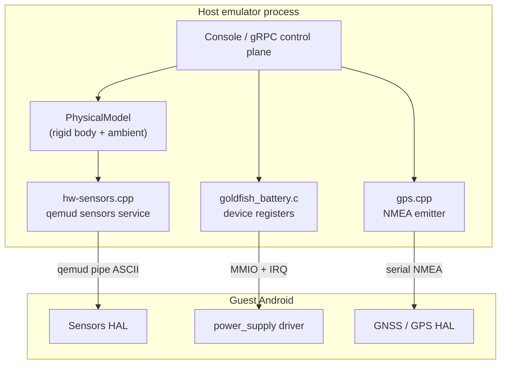
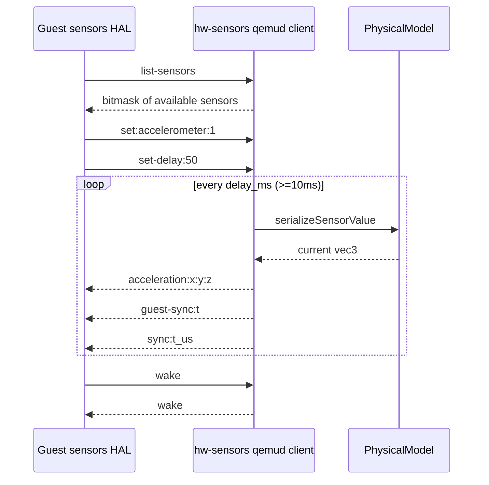
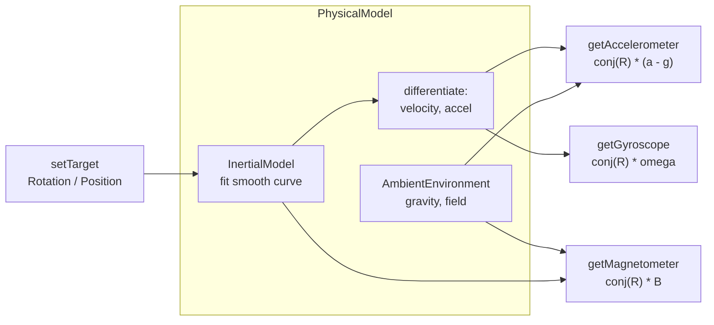
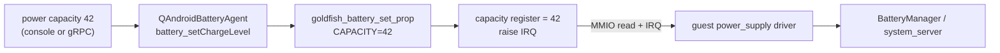
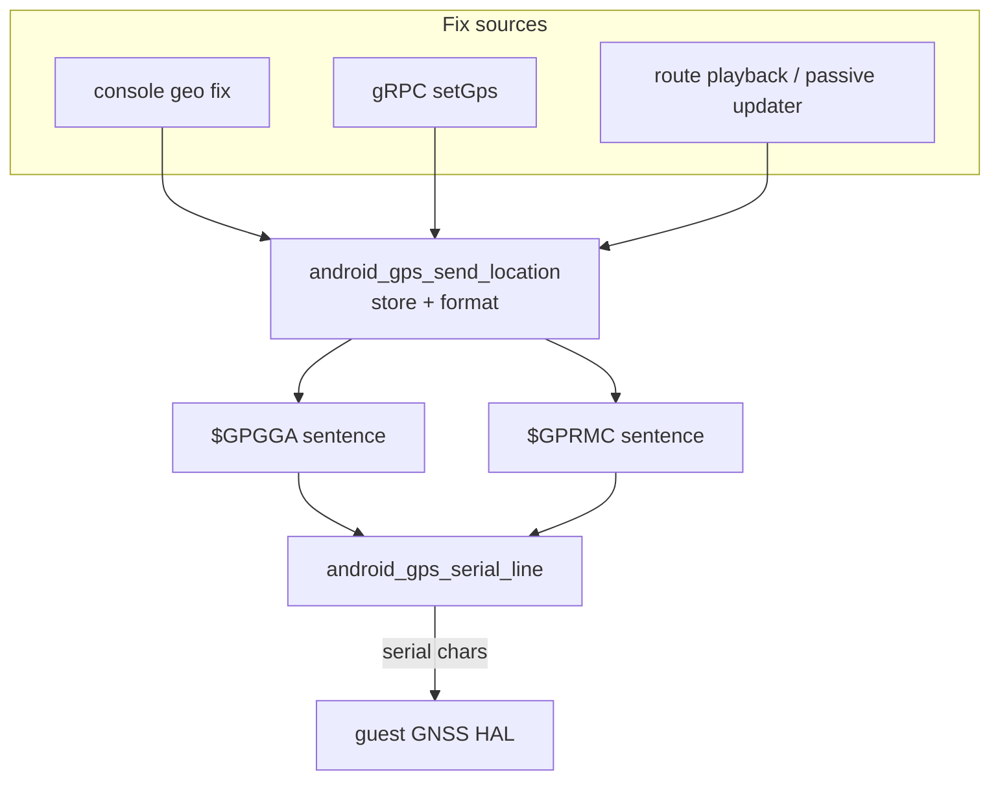
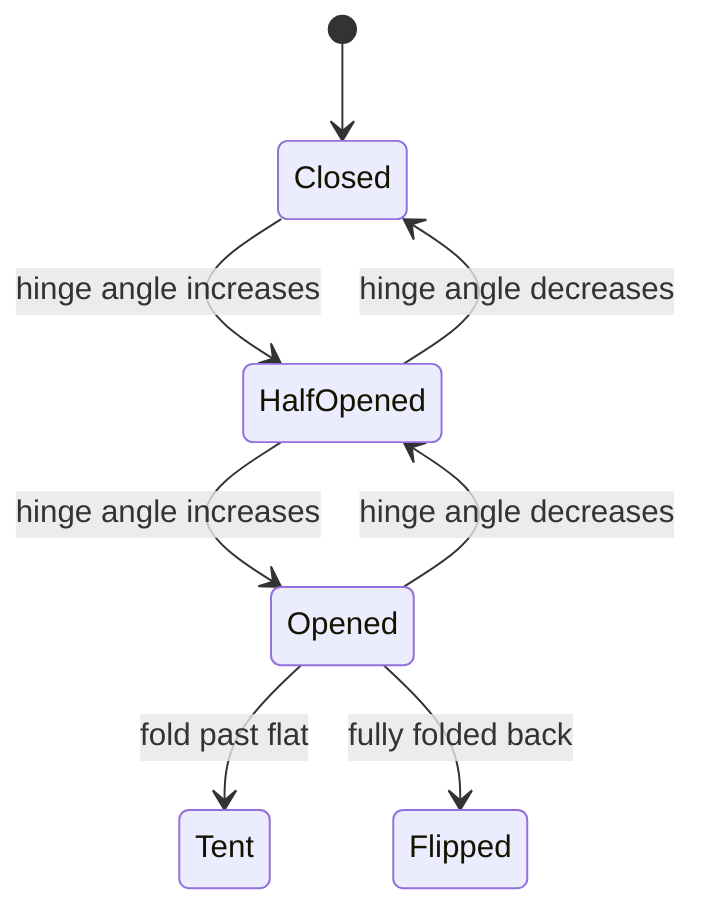

# Chapter 10: Sensors, Battery, and Location

A physical Android phone has accelerometers, gyroscopes, a magnetometer, a battery gauge, and a GPS receiver. A virtual device has none of these. The emulator's job is to manufacture believable values for all of them: when you tilt the emulator window, the guest's accelerometer must report gravity rotating; when you drag a marker on the map, the guest's location provider must produce a fix; when you tell the device the charger is unplugged, the framework's battery service must see the AC line drop. This chapter follows three independent simulation pipelines from the host control plane down to the guest, and shows that each one uses a different transport: sensors ride a `qemud` pipe, the battery is a memory-mapped device register block, and GPS is a serial character stream carrying NMEA text.

The most interesting piece is the sensor side. Rather than letting callers poke raw accelerometer numbers directly into the guest, the emulator runs a small rigid-body physics engine. You set a *target* device rotation or position, and the model interpolates a smooth trajectory, then differentiates that trajectory to derive the acceleration and angular velocity an accelerometer and gyroscope would actually measure. Gravity, the magnetic field, ambient light, and temperature live in a parallel "ambient environment" model. The guest sensor HAL never knows any of this exists; it just reads `acceleration:<x>:<y>:<z>` lines off a pipe.

---

## 10.1 Three Sensors, Three Transports

Before diving into any one subsystem it helps to see that "sensors, battery, and location" are three unrelated mechanisms that happen to share a chapter because they are all environmental inputs. They do not share code, transport, or even a host thread model.

The sensor list itself is defined once, as an X-macro, in `external/qemu/android/android-emu/android/hw-sensors.h`. Each entry binds an enum name, a guest-facing wire name, a physical-model getter suffix, a value type, and a wire format string:

```c
// Source: external/qemu/android/android-emu/android/hw-sensors.h
#define  SENSORS_LIST  \
    SENSOR_(ACCELERATION,"acceleration",Accelerometer,vec3,"acceleration:%g:%g:%g") \
    SENSOR_(GYROSCOPE,"gyroscope",Gyroscope,vec3,"gyroscope:%g:%g:%g") \
    SENSOR_(MAGNETIC_FIELD,"magnetic-field",Magnetometer,vec3,"magnetic:%g:%g:%g") \
    SENSOR_(ORIENTATION,"orientation",Orientation,vec3,"orientation:%g:%g:%g") \
    SENSOR_(TEMPERATURE,"temperature",Temperature,float,"temperature:%g") \
    SENSOR_(PROXIMITY,"proximity",Proximity,float,"proximity:%g") \
    SENSOR_(LIGHT,"light",Light,float,"light:%g") \
    ...
```

The same header carries the warning "DO NOT CHANGE THE ORDER IN THIS LIST, UNLESS YOU INTEND TO BREAK SNAPSHOTS" because the bit index of each sensor is serialized into the per-client `enabledMask` saved in snapshots. The X-macro is expanded several times in `hw-sensors.cpp` and `PhysicalModel.cpp` to generate the enum, the serializer, the getters, and the override setters, so a single list keeps all of them in lockstep.

### 10.1.1 Mapping each input to its transport

The three pipelines diverge immediately below the host control plane.

The transports are these three, distinct mechanisms.

1. Sensors flow over a `qemud` pipe named `sensors`, registered in `external/qemu/android/android-emu/android/hw-sensors.cpp`. The host pushes newline-framed ASCII reports; the guest HAL parses them.
2. The battery is a memory-mapped `goldfish_battery` device in `external/qemu/hw/misc/goldfish_battery.c`. The host writes device registers; the guest power-supply driver reads them and an IRQ signals changes.
3. Location is an NMEA-0183 character stream written to a serial line in `external/qemu/android/emu/gps/src/android/gps.cpp`. The host emits `$GPGGA` and `$GPRMC` sentences; the guest GPS HAL parses them like a real receiver.

Diagram: the three environmental pipelines and the transport each uses



## 10.2 The qemud Sensors Channel

The host side of sensor emulation is a `qemud` service. During sensor init, `_hwSensors_init` registers a service named `sensors`:

```cpp
// Source: external/qemu/android/android-emu/android/hw-sensors.cpp
h->service = qemud_service_register("sensors", 0, h, _hwSensors_connect,
                                    _hwSensors_save, _hwSensors_load);
```

When the guest sensor HAL opens `qemud:sensors`, `_hwSensors_connect` allocates a `HwSensorClient` and wires up receive, close, save, and load callbacks, then enables length framing so each message is a discrete record:

```cpp
// Source: external/qemu/android/android-emu/android/hw-sensors.cpp
QemudClient* client = qemud_client_new(
        service, channel, client_param, cl, _hwSensorClient_recv,
        _hwSensorClient_close, _hwSensorClient_save, _hwSensorClient_load);
qemud_client_set_framing(client, 1);
```

### 10.2.1 The wire protocol

The protocol is documented in a long comment at the top of `hw-sensors.cpp`, and `_hwSensorClient_receive` implements the host's half of it. The guest HAL drives the conversation with five message types.

1. `list-sensors` asks which sensors exist. The host replies with an integer bitmask built from the per-sensor `enabled` flags set during init from the AVD hardware config.
2. `set:<name>:<flag>` enables or disables reporting for one sensor by toggling a bit in the client's `enabledMask`.
3. `set-delay:<ms>` sets the reporting period; the default is 800 ms (the value `cl->delay_ms = 800` set in `_hwSensorClient_new`).
4. `wake` is echoed straight back; the HAL uses this ping-pong to unblock a blocking read on another thread.
5. `time:<ns>` hands the host the guest's clock so the host can compute a host-to-guest time offset.

For `list-sensors` the host computes the mask directly from the configured hardware:

```cpp
// Source: external/qemu/android/android-emu/android/hw-sensors.cpp
for (nn = 0; nn < MAX_SENSORS; nn++) {
    if (hw->sensors[nn].enabled) {
        mask |= (1 << nn);
    }
}
```

Note the asymmetry: the *AVD configuration* decides which sensors physically exist (the `enabled` flag), while the *guest HAL* decides which of those existing sensors it currently wants reports for (the `enabledMask`). A `set:` for a sensor whose `enabled` flag is false is silently dropped.

### 10.2.2 The reporting tick

Once at least one sensor is enabled, `_hwSensorClient_tick` runs on a `LoopTimer`. For every enabled sensor it serializes the current physical-model value and sends one framed line, then sends two synchronization records and re-arms the timer:

```cpp
// Source: external/qemu/android/android-emu/android/hw-sensors.cpp
for (size_t sensor_id = 0; sensor_id < MAX_SENSORS; ++sensor_id) {
    if (!_hwSensorClient_enabled(cl, sensor_id)) {
        continue;
    }
    Sensor* sensor = &cl->sensors->sensors[sensor_id];
    serializeSensorValue(cl->sensors->physical_model, sensor,
                         (AndroidSensor)sensor_id);
    _hwSensorClient_send(cl, (uint8_t*)sensor->serialized.value,
                         sensor->serialized.length);
}
```

Two timing rules in this function are worth calling out. First, the guest clock is sampled *before* any data is sent, because the Android sensor CTS requires the `sync:` timestamp to be no later than the moment the event arrives. Second, the re-arm delay is clamped: anything under 10 ms becomes 10 ms so the timer cannot starve the main QEMU loop, and CTS hardware tests also cap the maximum update rate. Each value carries a `measurement_id`, and `serializeSensorValue` only re-serializes a sensor when its measurement id changed, so a sensor sitting at rest does not waste cycles re-formatting an identical line.

The serializer also has a quietly important locale fix. Sensor values are formatted with `%g`, which on some host locales emits a comma decimal separator. `_hwSensorClient_sanitizeSensorString` rewrites every comma to a period before the line goes on the wire, because the guest parser only understands `.`:

```cpp
// Source: external/qemu/android/android-emu/android/hw-sensors.cpp
for (int i = 0; i < maxlen && string[i] != '\0'; i++) {
    if (string[i] == ',') {
        string[i] = '.';
    }
}
```

Diagram: the HAL-driven request/report handshake over the sensors pipe



## 10.3 The Physical Model: From Target Pose to Sensor Reading

The values the tick sends are never set directly. Instead, `serializeSensorValue` pulls them from a `PhysicalModel`, allocated per emulator in `_hwSensors_init` via `physicalModel_new()`. The model is the substantive engineering in this chapter: it converts a desired device pose into the readings a real inertial measurement unit would produce.

The model is built from four submodels, declared together in `PhysicalModelImpl` in `external/qemu/android/android-emu/android/physics/PhysicalModel.cpp`.

1. `InertialModel mInertialModel` owns the rigid body: position, velocity, acceleration, jerk, and rotation.
2. `AmbientEnvironment mAmbientEnvironment` owns the world around the body: gravity, magnetic field, temperature, proximity, light, pressure, and humidity.
3. `FoldableModel mFoldableModel` owns hinge/posture state.
4. `BodyModel mBodyModel` owns wearable-specific values such as heart rate.

### 10.3.1 Targets, interpolation, and parameters

Callers never set a sensor value; they set a *physical parameter target*. The parameter list is a second X-macro in `hw-sensors.h` — `PHYSICAL_PARAMETERS_LIST` — covering `POSITION`, `ROTATION`, `MAGNETIC_FIELD`, `VELOCITY`, the hinge angles, and so on. Setting a target goes through `android_physical_model_set`, which validates the parameter id and forwards into the model:

```cpp
// Source: external/qemu/android/android-emu/android/hw-sensors.cpp
extern int android_physical_model_set(int physical_parameter,
                                      const float* val,
                                      const size_t count,
                                      int interpolation_mode) {
    HwSensors* hw = _sensorsState;
    if (physical_parameter < 0 || physical_parameter >= MAX_PHYSICAL_PARAMETERS)
        return PHYSICAL_PARAMETER_STATUS_UNKNOWN;
    if (hw->physical_model == NULL) {
        return PHYSICAL_PARAMETER_STATUS_NO_SERVICE;
    }
    _hwSensors_setPhysicalParameterValue(hw, physical_parameter, val, count,
                                         interpolation_mode);
    return PHYSICAL_PARAMETER_STATUS_OK;
}
```

The interpolation mode is one of two values defined in `external/qemu/android/android-emu/android/physics/Physics.h`: `PHYSICAL_INTERPOLATION_STEP` jumps instantly to the target with no derived motion, while `PHYSICAL_INTERPOLATION_SMOOTH` animates a trajectory toward it. A getter can ask for one of four value types — `PARAMETER_VALUE_TYPE_TARGET`, `..._CURRENT`, `..._CURRENT_NO_AMBIENT_MOTION`, or `..._DEFAULT` — which is how the model distinguishes "where you asked the device to be" from "where it is right now mid-animation".

### 10.3.2 Deriving acceleration from a smooth trajectory

When you set a smooth rotation or position target, `InertialModel` solves for a polynomial that moves from the current state to the target while keeping position, velocity, acceleration, and jerk continuous. The transition time scales with distance, bounded by two constants in `InertialModel.h`:

```cpp
// Source: external/qemu/android/android-emu/android/physics/InertialModel.h
constexpr float kMaxStateChangeTimeSeconds = 0.5f;
constexpr float kMinStateChangeTimeSeconds = 0.05f;
```

`setTargetPosition` reads the current position, velocity, acceleration, and jerk, then fits a heptic (seventh-order) curve from that initial state to the target with zero velocity, acceleration, and jerk at the end. A `STEP` change skips all of that and snaps the transform directly, deliberately producing no acceleration or velocity. Crucially, the acceleration a sensor reports is the *second derivative* of this fitted curve, not a number anyone typed in — that is what makes an emulated "shake" or "rotate" produce physically plausible accelerometer traces.

The payoff is in the sensor getters. The accelerometer does not return the rigid body's acceleration in world space; it returns body-frame acceleration minus gravity, exactly as a real device's accelerometer measures specific force:

```cpp
// Source: external/qemu/android/android-emu/android/physics/PhysicalModel.cpp
vec3 PhysicalModelImpl::getPhysicalAccelerometer() const {
    return fromGlm(glm::conjugate(mInertialModel.getRotation()) *
                   (mInertialModel.getAcceleration() -
                    mAmbientEnvironment.getGravity()));
}
```

The gyroscope and magnetometer follow the same pattern, rotating a world-frame quantity into the device frame by the inverse (conjugate) of the device rotation quaternion:

```cpp
// Source: external/qemu/android/android-emu/android/physics/PhysicalModel.cpp
vec3 PhysicalModelImpl::getPhysicalGyroscope() const {
    return fromGlm(glm::conjugate(mInertialModel.getRotation()) *
                   mInertialModel.getRotationalVelocity());
}
vec3 PhysicalModelImpl::getPhysicalMagnetometer() const {
    return fromGlm(glm::conjugate(mInertialModel.getRotation()) *
                   mAmbientEnvironment.getMagneticField());
}
```

This is why merely rotating a device that is sitting still still produces a gyroscope reading (non-zero angular velocity during the animation) and changes both the accelerometer and magnetometer readings (the constant gravity and field vectors rotate into a new body frame).

Diagram: the physical model converting a target pose into device-frame sensor readings



### 10.3.3 The ambient environment defaults

The environment that surrounds the rigid body has sensible defaults baked into `external/qemu/android/android-emu/android/physics/AmbientEnvironment.h`:

```cpp
// Source: external/qemu/android/android-emu/android/physics/AmbientEnvironment.h
static constexpr glm::vec3 kDefaultMagneticField =
        glm::vec3(0.0f, 5.9f, -48.4f);
static constexpr glm::vec3 kDefaultGravity = glm::vec3(0.f, -9.81f, 0.f);
```

Gravity points along negative Y at 9.81 m/s² and the magnetic field roughly matches the Earth's field at a mid-latitude. Two more defaults are written explicitly at the end of `_hwSensors_init`: pressure is set to one standard atmosphere (1013.25 hPa) and proximity is set to 1 cm, so a freshly booted device reports believable barometer and proximity values even before anyone touches them.

## 10.4 Setting Sensors and Physics from the Control Plane

Two callers feed the physical model: the legacy text console and the gRPC `EmulatorController` service. Both route through the same `QAndroidSensorsAgent` function table declared in `external/qemu/android/emu/agents/include/android/emulation/control/sensors_agent.h`, whose members are `setPhysicalParameterTarget`, `getPhysicalParameter`, `setSensorOverride`, `getSensor`, and `setCoarseOrientation`.

### 10.4.1 Sensor overrides vs. physics targets

There are two distinct ways to push a value. Setting a *physical parameter target* (rotation, position, magnetic field) lets the model animate and derive motion. Setting a *sensor override* writes a value straight onto the corresponding physical quantity. `android_sensors_override_set` checks that the sensor is enabled, then either forwards hinge angles into the physical model or calls `_hwSensors_setSensorValue`:

```cpp
// Source: external/qemu/android/android-emu/android/hw-sensors.cpp
if (hw->service != NULL) {
    if (!hw->sensors[sensor_id].enabled) {
        return SENSOR_STATUS_DISABLED;
    }
} else {
    return SENSOR_STATUS_NO_SERVICE;
}
```

The console exposes this as `sensor set <name> <a>[:<b>:<c>]`, handled by `do_sensors_set` in `external/qemu/android/android-emu/android/console.cpp`, which parses the colon-separated values, queries the sensor's expected element count with `android_sensors_get_size`, and calls `android_sensors_override_set`. The matching `sensor get <name>` reads them back.

### 10.4.2 The gRPC sensor and physics RPCs

The gRPC surface is defined in `external/qemu/android/android-grpc/python/aemu-grpc/src/aemu/proto/emulator_controller.proto`, with `getSensor`/`setSensor`/`streamSensor` on `SensorValue` and `getPhysicalModel`/`setPhysicalModel`/`streamPhysicalModel` on `PhysicalModelValue`. The proto deliberately documents that `PhysicalType` "must follow the order defined in external/qemu/android/hw-sensors.h" — the enum is a mirror of the X-macro list. `setPhysicalModel` in `EmulatorService.cpp` maps the proto interpolation enum to the C enum and forwards to the agent:

```cpp
// Source: external/qemu/android/android-grpc/services/emulator-controller/server/src/android/emulation/control/EmulatorService.cpp
auto values = request->value();
mAgents->sensors->setPhysicalParameterTarget(
        (int)request->target(), values.data().data(),
        values.data().size(), interpolation);
return Status::OK;
```

The `stream*` variants exist so a client can subscribe and receive a new message every time the value changes, which is how a remote UI keeps a live readout without polling.

### 10.4.3 Coarse orientation: rotating the window

When you rotate the emulator skin, the UI does not type accelerometer numbers. It calls `android_sensors_set_coarse_orientation` with one of four `AndroidCoarseOrientation` values. `_hwSensors_setCoarseOrientation` translates each into a device rotation and pushes it as a `STEP` change to the `ROTATION` parameter:

```cpp
// Source: external/qemu/android/android-emu/android/hw-sensors.cpp
case ANDROID_COARSE_LANDSCAPE:
    rotation = {0.f, tilt_degrees, 90.f};
    break;
...
_hwSensors_setPhysicalParameterValue(h, PHYSICAL_PARAMETER_ROTATION,
                                     rotation.data(), rotation.size(),
                                     PHYSICAL_INTERPOLATION_STEP);
```

The comment in that function records a subtlety worth knowing: Android computes screen orientation from the accelerometer, not the orientation sensor, and the framework treats a 30-degree tilt along the device X axis as the ideal "upright" pose. A `skin_rotation_to_coarse_orientation` helper maps the four `SkinRotation` window states onto these orientations.

## 10.5 The Battery: A Memory-Mapped Goldfish Device

The battery shares none of the sensor machinery. It is a QEMU `SysBusDevice` called `goldfish_battery`, implemented in `external/qemu/hw/misc/goldfish_battery.c`. Its state is just a struct of `uint32_t` register values mapped into guest physical memory:

```c
// Source: external/qemu/hw/misc/goldfish_battery.c
struct goldfish_battery_state {
    SysBusDevice parent;
    MemoryRegion iomem;
    qemu_irq irq;
    uint32_t int_status;
    uint32_t int_enable;
    uint32_t ac_online;
    uint32_t status;
    uint32_t health;
    uint32_t present;
    uint32_t capacity;
    ...
};
```

Each register has a fixed offset (`BATTERY_AC_ONLINE = 0x08`, `BATTERY_STATUS = 0x0C`, `BATTERY_CAPACITY = 0x18`, and so on). The guest's `power_supply` driver reads these offsets through `goldfish_battery_read` to learn AC state, charge level, health, and voltage.

### 10.5.1 Reads, writes, and the change interrupt

The device exposes a 4 KB MMIO region. `goldfish_battery_read` returns the requested register; reading `BATTERY_INT_STATUS` also lowers the IRQ and clears the pending flags, which is the classic "read-to-acknowledge" interrupt pattern. The guest enables interrupts by writing `BATTERY_INT_ENABLE`. When the host changes any value through `goldfish_battery_set_prop`, the device sets a change bit and raises the IRQ if that interrupt is enabled:

```c
// Source: external/qemu/hw/misc/goldfish_battery.c
if (new_status != battery_state->int_status) {
    battery_state->int_status |= new_status;
    qemu_set_irq(battery_state->irq,
                 (battery_state->int_status &
                 battery_state->int_enable));
}
```

`int new_status = (ac ? AC_STATUS_CHANGED : BATTERY_STATUS_CHANGED);` distinguishes a charger-line change from a battery-property change, so the guest can tell which subsystem moved.

The defaults are set in `goldfish_battery_realize`: 5 V, 25 °C (encoded as `temp = 250` in tenths of a degree), a 3 Ah full charge, and AC online. A device that declares it has a battery starts at 100 percent, `POWER_SUPPLY_STATUS_CHARGING`, and `POWER_SUPPLY_HEALTH_GOOD`; a device without one reports everything as unknown and absent.

### 10.5.2 The battery agent and console commands

The host never touches the registers directly. `external/qemu/android-qemu2-glue/qemu-battery-agent-impl.cpp` wraps `goldfish_battery_set_prop`/`goldfish_battery_read_prop` in a `QAndroidBatteryAgent` function table, taking the VM lock around each call:

```cpp
// Source: external/qemu/android-qemu2-glue/qemu-battery-agent-impl.cpp
static void battery_setChargeLevel(int percentFull) {
    android::RecursiveScopedVmLockIfInstance lock;
    goldfish_battery_set_prop(0, POWER_SUPPLY_PROP_CAPACITY, percentFull);
}
```

There is a deliberate guard in `goldfish_battery_set_prop`: before the device is realized, the only property you can set is whether the device has a battery at all. The agent also translates the emulator's own `BatteryHealth`/`BatteryStatus` enums into the kernel `POWER_SUPPLY_*` constants the register block expects.

The console `power` command group in `console.cpp` is a thin shell over this agent. `power capacity <0-100>` calls `setChargeLevel`, `power ac on|off` calls `setIsCharging`, and `power status charging|discharging|...` calls `setStatus`:

```cpp
// Source: external/qemu/android/android-emu/android/console.cpp
static int do_battery_capacity(ControlClient client, char* args) {
    if (args) {
        int capacity;
        if (sscanf(args, "%d", &capacity) == 1 && capacity >= 0 &&
            capacity <= 100) {
            client->global->battery_agent->setChargeLevel(capacity);
            return 0;
        }
    }
    control_write(client, "KO: Usage: \"capacity <percentage>\"\n");
    return -1;
}
```

The gRPC equivalent is `setBattery`/`getBattery` on the `BatteryState` message, which carries `hasBattery`, `isPresent`, `charger`, `chargeLevel`, `health`, and `status` enums that mirror the agent's parameters.

Diagram: a battery change propagating from the control plane to the guest driver



## 10.6 Location: NMEA Over a Serial Line

Location is the third transport. The guest GPS HAL reads a serial character device, and the host writes it the same NMEA-0183 sentences a hardware receiver would emit. The host code lives in `external/qemu/android/emu/gps/src/android/gps.cpp`, which keeps the last fix in a handful of file-scope variables initialized to the Googleplex:

```cpp
// Source: external/qemu/android/emu/gps/src/android/gps.cpp
double s_latitude = 39.237256;
double s_longitude = -123.150032;
double s_metersElevation = 0;
double s_speedKnots = 0;
double s_headingDegrees = 0;
int s_nSatellites = 4;
```

### 10.6.1 Synthesizing GPGGA and GPRMC

`android_gps_send_location` stores the new fix, then calls `send_location_to_device_internal`, which builds two sentences by hand. `$GPGGA` carries the fix time, latitude/longitude in degrees-and-minutes with a hemisphere letter, fix quality, satellite count, and altitude. `$GPRMC` carries time, validity, position, speed in knots, true course, and date. The code converts decimal degrees into the NMEA `DDMM.MMMM` form arithmetically:

```cpp
// Source: external/qemu/android/emu/gps/src/android/gps.cpp
latDeg = (int)latitude;
latitude = 60 * (latitude - latDeg);
latMin = (int)latitude;
latFraction = 10000 * (latitude - latMin);
stralloc_add_format(msgStr, ",%02d%02d.%04d,%c", latDeg, latMin,
                    latFraction, hemiNS);
```

The finished sentence goes out byte-for-byte on the serial line, followed by a newline:

```cpp
// Source: external/qemu/android/emu/gps/src/android/gps.cpp
android_serialline_write(android_gps_serial_line, (const uint8_t*)sentence,
                         strlen(sentence));
android_serialline_write(android_gps_serial_line, (const uint8_t*)"\n", 1);
```

Like the sensor serializer, the altitude formatter rewrites a locale comma into a period so the guest parses the decimal correctly. There is also a newer `GnssRpcV1` path, gated by `s_enable_gnssgrpcv1`, that sends a single structured `$GnssRpcV1,...` line whose field order must match the platform's `FixLocationParser`; it carries explicit accuracy values for position, speed, and heading that plain NMEA cannot express.

### 10.6.2 Passive updates and route playback

A static fix is not enough for navigation apps, which expect a roughly 1 Hz stream. `PassiveGpsUpdater` in `external/qemu/android/emu/gps/src/android/gps/PassiveGpsUpdater.cpp` runs a background thread that re-sends the current fix once per second until asked to stop:

```cpp
// Source: external/qemu/android/emu/gps/src/android/gps/PassiveGpsUpdater.cpp
void PassiveGpsUpdater::start() {
    while (true) {
        {
            std::unique_lock<std::mutex> lk(mMutex);
            if (mCv.wait_for(lk, 1000ms, [this] { return mStopRequested; })) {
                if (mStopRequested)
                    break;
            }
        }
        mFunction();
    }
}
```

The function it calls is `android_gps_refresh`, which re-emits the stored coordinates with a fresh timestamp. Route playback in the location UI builds on this: `location-page-route-playback.cpp` precomputes a list of `mPlaybackElements`, each holding a latitude, longitude, elevation, and a *delay from the previous point*. For a route at a chosen speed it computes each segment's delay as `distFromPreviousPoint / stepSpeed`; for an imported GPX/KML track it reads each point's `delay_sec` and subtracts the previous point's so the stored cumulative delays become per-segment intervals. Playback then walks the list, sleeping each delay and calling the location agent's send function so the guest sees a moving fix.

### 10.6.3 Setting location from the control plane

The console `geo` command group handles `geo fix`, `geo nmea`, and `geo gnss`. `do_geo_fix` parses `<longitude> <latitude> [altitude [satellites [velocity]]]`, validates the ranges (longitude in [-180, 180], latitude in [-90, 90], 1 to 12 satellites), then calls the agent:

```cpp
// Source: external/qemu/android/android-emu/android/console.cpp
client->global->location_agent->gpsSendLoc(
        params[GEO_LAT], params[GEO_LONG], altitude, velocity, heading,
        n_satellites, &tVal);
```

Note the argument order on the command line is longitude first, then latitude — a long-standing quirk that trips up first-time users. `geo nmea <sentence>` lets you inject a raw NMEA line via `gpsSendNmea`, and both refuse with "no GPS emulation in this virtual device" if `gpsIsSupported` is false.

The gRPC `setGps` RPC takes a `GpsState` with `latitude`, `longitude`, `speed`, `bearing`, `altitude`, `satellites`, and a `passiveUpdate` flag. `EmulatorService::setGps` runs on the main looper, builds a timestamp, and calls the same `gpsSendLoc`:

```cpp
// Source: external/qemu/android/android-grpc/services/emulator-controller/server/src/android/emulation/control/EmulatorService.cpp
agent->gpsSendLoc(request.latitude(), request.longitude(),
                  request.altitude(), request.speed(),
                  request.bearing(), request.satellites(),
                  &tVal);
```

`getGps` reads back the stored fix and the passive-update flag. The proto comment warns that disabling `passiveUpdate` breaks the location UI, because routing depends on the periodic re-send.

Diagram: a location fix becoming NMEA sentences on the guest serial line



## 10.7 Foldables, Postures, and Wearable Sensors

The physical-parameter list reaches well beyond an inertial measurement unit. Three hinge angles (`HINGE_ANGLE0..2`), three rollable percentages (`ROLLABLE0..2`), and a `POSTURE` parameter let the model describe folding and rolling form factors, and `HEART_RATE`, `WRIST_TILT`, and `RGBC_LIGHT` cover wearables.

Folding is mediated by a `FoldableModel` inside the physical model. Setting a hinge angle through `setHingeAngle` recomputes the discrete posture via `calculatePosture`, which compares each hinge against the `AnglesToPosture` ranges configured for the device (the `struct AnglesToPosture` and `FoldablePostures` enum live in `hw-sensors.h`). The posture enum runs `POSTURE_CLOSED`, `POSTURE_HALF_OPENED`, `POSTURE_OPENED`, `POSTURE_FLIPPED`, and `POSTURE_TENT`.

Diagram: hinge angle driving the discrete foldable posture state



The hinge-angle *sensors* (the `HINGE_ANGLE0..2` entries in `SENSORS_LIST`) are reported over the same `qemud` channel as the accelerometer, and `android_sensors_override_set` special-cases them to feed the hinge angle straight into the physical model:

```cpp
// Source: external/qemu/android/android-emu/android/hw-sensors.cpp
case ANDROID_SENSOR_HINGE_ANGLE0:
    android_physical_model_set(PHYSICAL_PARAMETER_HINGE_ANGLE0, val,
                               count, PHYSICAL_INTERPOLATION_SMOOTH);
    break;
```

Wearable sensors are gated on AVD flavor. In `_hwSensors_init`, a Wear OS image at API 28 or higher auto-enables the heart-rate and wrist-tilt sensors even if the hardware config did not request them:

```cpp
// Source: external/qemu/android/android-emu/android/hw-sensors.cpp
const bool wear28plus = (avdFlavor == AVD_WEAR) && (avdApiLevel >= 28);
if (wear28plus || hwCfg.hw_sensors_heart_rate) {
    h->sensors[ANDROID_SENSOR_HEART_RATE].enabled = true;
}
```

Similarly an Android Automotive image at API 35+ enables the `HEADING` sensor. The heart-rate value itself comes from `mBodyModel`, the fourth submodel, which simply stores and returns a beats-per-minute value with the same target/default machinery as the ambient quantities.

## 10.8 State-Change Callbacks and Ground-Truth Recording

A consumer of the physical model often needs to know not just the current value but *when* the device is moving, so it can wake up only while motion is happening. The model supports this through a `QAndroidPhysicalStateAgent` in `external/qemu/android/emu/agents/include/android/physics/physical_state_agent.h` with three callbacks:

```c
// Source: external/qemu/android/emu/agents/include/android/physics/physical_state_agent.h
typedef struct QAndroidPhysicalStateAgent {
    void (*onTargetStateChanged)(void* context);
    void (*onPhysicalStateChanging)(void* context);
    void (*onPhysicalStateStabilized)(void* context);
} QAndroidPhysicalStateAgent;
```

`onTargetStateChanged` fires when someone sets a new target; `onPhysicalStateChanging` and `onPhysicalStateStabilized` bracket the interval during which the interpolated trajectory is actually in motion. The header notes that target callbacks happen on the caller's thread while sensor-state callbacks may arrive on an arbitrary thread. An agent registers via `android_physical_agent_set`, which forwards to `physicalModel_setPhysicalStateAgent`.

For testing and reproducibility the model can record its exact trajectory. `android_physical_model_record_ground_truth(filename)` and `android_physical_model_stop_recording()` write the model's ground-truth motion to a file, exposed in the console as the `physics record-gt` and `physics stop` commands:

```cpp
// Source: external/qemu/android/android-emu/android/console.cpp
static int do_physics_record_ground_truth(ControlClient client, char* args) {
    int res = android_physical_model_record_ground_truth(args);
    ...
}
```

This is what makes the sensor pipeline testable: a test can drive a sequence of targets, record the ground-truth trajectory, and compare it against what the guest's sensor fusion produced.

## 10.9 The Cuttlefish Contrast: A Separate Sensor Simulator

Cuttlefish, the crosvm-based virtual device, does not reuse any of `hw-sensors.cpp`. It runs its own host process, `sensors_simulator`, in `device/google/cuttlefish/host/commands/sensors_simulator/`. The `SensorsSimulator` class keeps a rotation matrix and per-sensor `SensorsData`, and exposes `RefreshSensors(x, y, z)` to update the rotation and `GetSensorsData(mask)` to serialize the requested sensors:

```cpp
// Source: device/google/cuttlefish/host/commands/sensors_simulator/sensors_simulator.h
class SensorsSimulator {
 public:
  SensorsSimulator(bool is_auto);
  void RefreshSensors(double x, double y, double z);
  std::string GetSensorsData(const SensorsMask mask);
  ...
};
```

The sensor identity is its own small set of constants in `device/google/cuttlefish/common/libs/sensors/sensors.h`, with `kAccelerationId = 0`, `kGyroscopeId = 1`, `kMagneticId = 2`, and `kMaxSensorId = 31`. The `SensorsMask` is an `int` bitmask, conceptually similar to the goldfish `enabledMask` but defined independently. The WebRTC frontend's `sensors_handler.cpp` calls `RefreshSensors` when the browser-based controls rotate the device and queries `GetSensorsData` to push values to the guest. The two implementations agree on the *idea* — a host process computes sensor values from a device rotation and serializes them as colon-separated strings — but share no source, which is worth remembering when a behavior differs between the two device types.

## 10.10 Try It

These commands assume a running AVD whose console port is the usual `5554`. The console authentication token is in `~/.emulator_console_auth_token`; `telnet` and `auth <token>` once, then issue commands.

- Read the live accelerometer: connect to the console and run `sensor get acceleration`. With the device upright you should see roughly `0 9.81 0`, matching the default gravity vector in `AmbientEnvironment.h`.
- Override a sensor: `sensor set acceleration 0:0:9.81` then `sensor get acceleration` to confirm. Run `sensor status` first to see which sensors the AVD actually has.
- Watch the physics model animate: from the extended-controls "Virtual sensors" UI drag the rotation, then in the console repeatedly run `sensor get gyroscope` while it moves — you will see non-zero angular velocity that decays back to zero, the derivative of the interpolated trajectory.
- Drive the battery: `power display` to dump current state, then `power capacity 15`, `power ac off`, and `power status discharging`. The guest's battery icon updates because `goldfish_battery_set_prop` raised the change IRQ.
- Move the device: `geo fix -122.084 37.422` sets a fix near the Googleplex (remember longitude comes first). Then open a maps or GPS-test app in the guest to see the marker jump.
- Inject a raw sentence: `geo nmea $GPGGA,001431.092,4807.038,N,01131.000,E,1,12,1.0,546.0,M,46.9,M,,*47` sends a hand-built fix through the same serial path `android_gps_send_location` uses.
- Record ground truth: `physics record-gt /tmp/gt.txt`, rotate the device a few times, then `physics stop`, and inspect the file to see the recorded trajectory.

## Summary

- "Sensors, battery, and location" are three independent pipelines that share only a chapter: sensors use a `qemud` ASCII pipe, the battery is a memory-mapped `goldfish_battery` device, and GPS is an NMEA character stream on a serial line.
- The sensor list and the physical-parameter list are X-macros in `hw-sensors.h`; their order is frozen because the bit indices are serialized into snapshots.
- The host never sets raw sensor numbers. It sets *targets* on a `PhysicalModel` whose `InertialModel` fits a smooth polynomial trajectory and differentiates it, so the accelerometer reports `conj(R) * (acceleration - gravity)` and the gyroscope reports body-frame angular velocity — physically plausible motion, not typed-in values.
- `PHYSICAL_INTERPOLATION_STEP` snaps instantly with no derived motion; `PHYSICAL_INTERPOLATION_SMOOTH` animates over 0.05 to 0.5 seconds depending on distance.
- The sensors `qemud` protocol is HAL-driven: `list-sensors`, `set:<name>:<flag>`, `set-delay:<ms>`, `wake`, and `time:<ns>`, with the host ticking out one framed line per enabled sensor plus `sync:` records, clamped to at least a 10 ms period.
- The battery is just register reads plus a read-to-acknowledge change interrupt; the `QAndroidBatteryAgent` wraps `goldfish_battery_set_prop` under the VM lock, and console `power` / gRPC `setBattery` are thin shells over it.
- GPS fixes become hand-built `$GPGGA` and `$GPRMC` sentences (or a structured `GnssRpcV1` line); a `PassiveGpsUpdater` re-emits the fix at 1 Hz and route playback walks a list of points with per-segment delays.
- Foldables, rollables, postures, and wearable sensors (heart rate, wrist tilt) are all extra physical parameters in the same model; Wear and Automotive flavors auto-enable the relevant sensors during init.
- Cuttlefish reimplements sensor simulation entirely in its own `sensors_simulator` host process and shares no code with the goldfish path.

### Key Source Files

| File | Purpose |
|------|---------|
| external/qemu/android/android-emu/android/hw-sensors.h | Sensor and physical-parameter X-macro lists; public C API |
| external/qemu/android/android-emu/android/hw-sensors.cpp | qemud sensors service, wire protocol, reporting tick, coarse orientation |
| external/qemu/android/android-emu/android/physics/PhysicalModel.cpp | Rigid-body + ambient model; accelerometer/gyroscope/magnetometer getters |
| external/qemu/android/android-emu/android/physics/InertialModel.cpp | Smooth trajectory fitting and differentiation for derived motion |
| external/qemu/android/android-emu/android/physics/AmbientEnvironment.h | Default gravity, magnetic field, pressure, proximity |
| external/qemu/hw/misc/goldfish_battery.c | Memory-mapped battery device, registers, change IRQ |
| external/qemu/android-qemu2-glue/qemu-battery-agent-impl.cpp | QAndroidBatteryAgent over goldfish_battery_set_prop |
| external/qemu/android/emu/gps/src/android/gps.cpp | NMEA sentence synthesis and serial emission |
| external/qemu/android/emu/gps/src/android/gps/PassiveGpsUpdater.cpp | 1 Hz passive fix re-emitter |
| external/qemu/android/android-emu/android/console.cpp | sensor, physics, power, and geo console commands |
| external/qemu/android/android-grpc/services/emulator-controller/server/src/android/emulation/control/EmulatorService.cpp | gRPC setSensor/setPhysicalModel/setGps/setBattery |
| device/google/cuttlefish/host/commands/sensors_simulator/sensors_simulator.h | Cuttlefish standalone sensor simulator |
