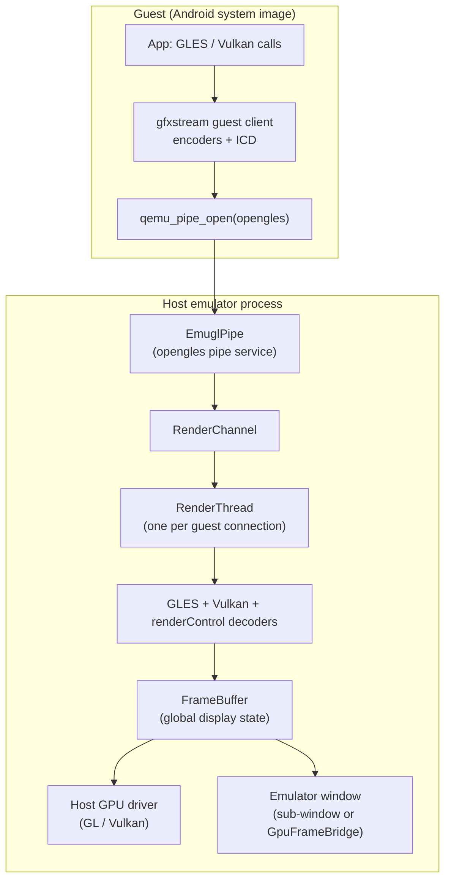
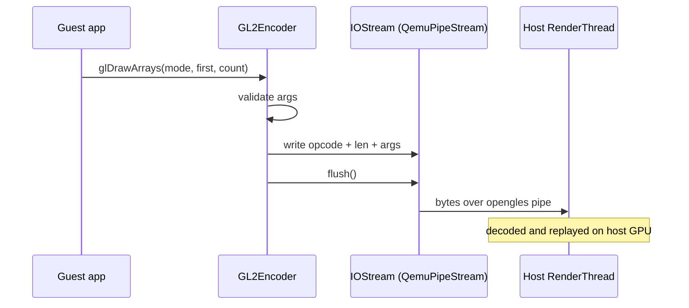
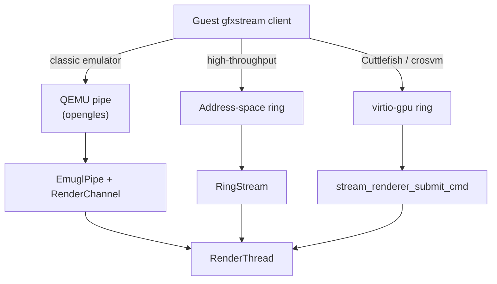
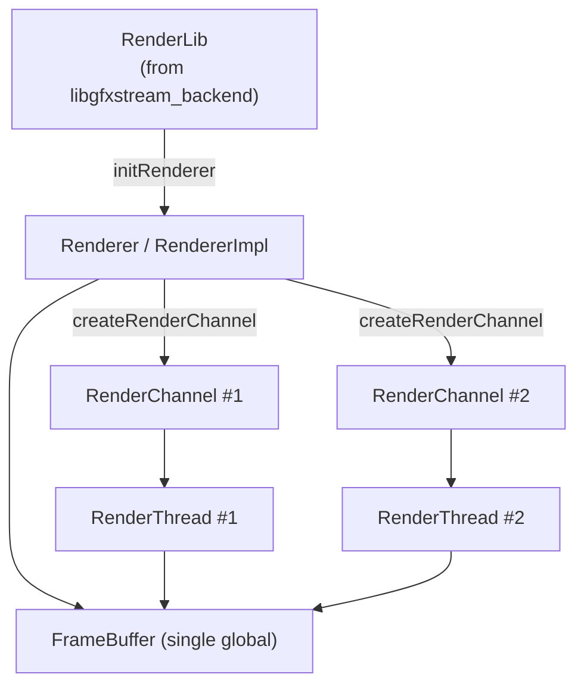
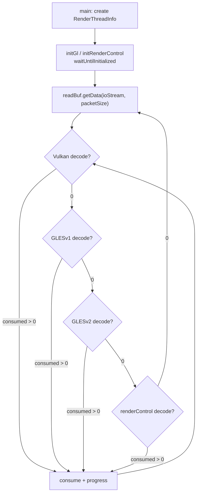
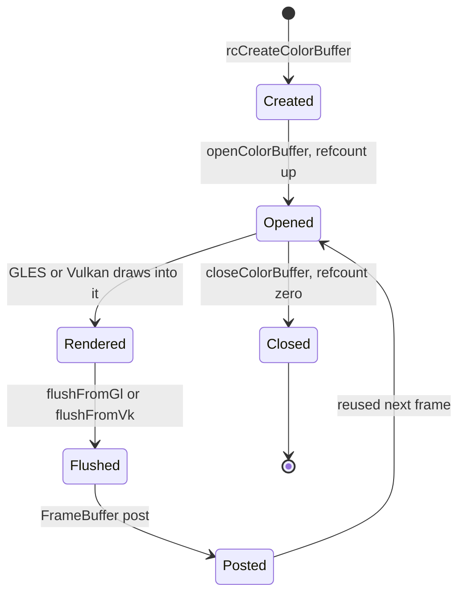
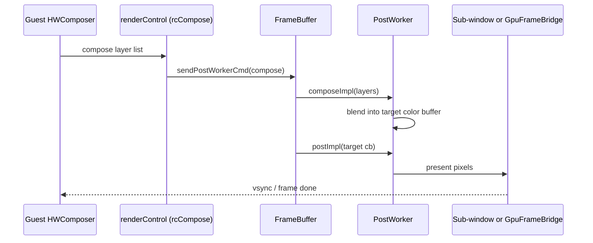
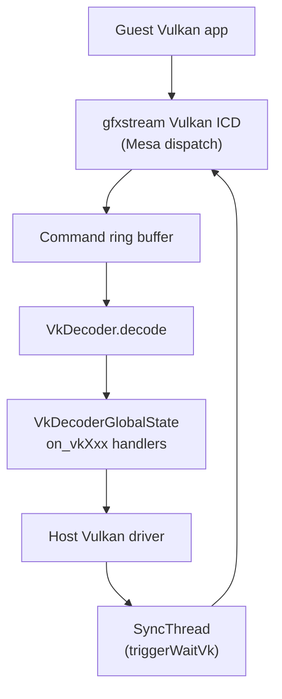
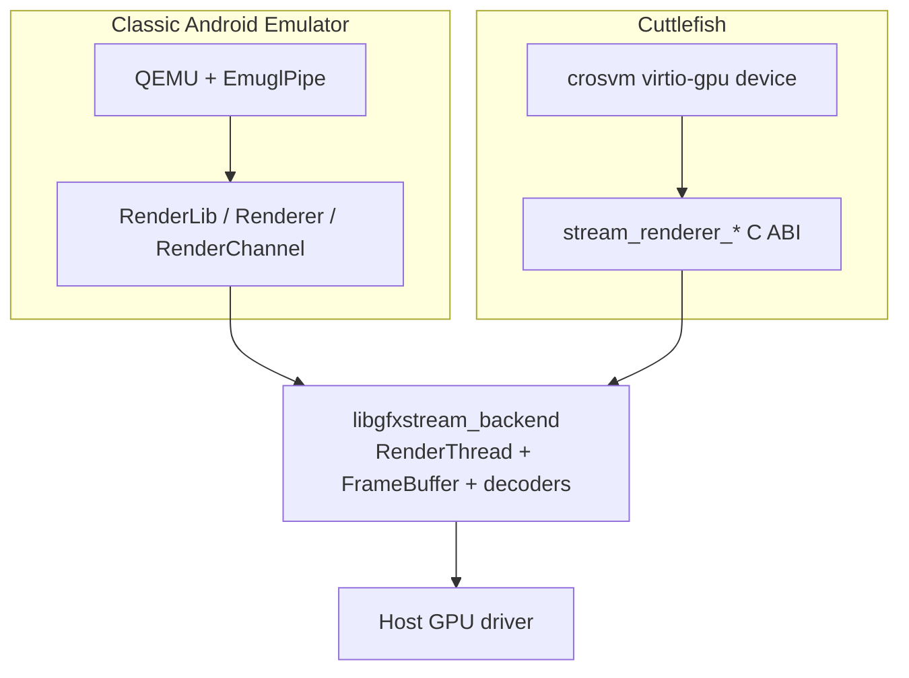

# Chapter 11: Graphics Architecture

The Android Emulator does not emulate a GPU instruction set. There is no virtual fragment shader pipeline ticking inside the QEMU process the way a virtual CPU ticks. Instead, the emulator does something cheaper and far faster: it intercepts the guest's OpenGL ES and Vulkan API calls inside the guest, serializes each call into a compact byte stream, ships that stream across a fast guest-to-host channel, and replays the calls on the host's *real* GPU using the host's real graphics drivers. The result of that replay — pixels in an off-screen buffer — is then handed back to the emulator UI for display. This technique is called API forwarding, or "command streaming," and the subsystem that implements it is named **gfxstream** (Graphics Streaming Kit), formerly known as **Vulkan Cereal**.

This chapter traces a graphics call from the moment a guest app invokes `glDrawArrays` or `vkQueueSubmit` through encoding, transport, host decode, GPU replay, and finally compositing the rendered color buffer onto the emulator window. The three repositories that matter are the host glue inside `external/qemu/android/android-emu/android/opengl/`, the legacy host renderer design under `external/qemu/android/android-emugl/`, and the current cross-platform engine in `hardware/google/gfxstream/`. Understanding how those pieces fit together is the goal here.

---

## 11.1 Why Forward Instead of Emulate

A modern Android app expects a conformant OpenGL ES 3.x and Vulkan 1.x implementation backed by hardware acceleration. Emulating a GPU at the register or instruction level on the host would be ruinously slow — orders of magnitude slower than software rasterization, which is itself far too slow for interactive UI. The emulator therefore takes the only practical route: it lets the host GPU do the actual rendering and only moves API *commands* across the virtualization boundary.

The original design rationale is spelled out in the legacy design document:

```
// Source: external/qemu/android/android-emugl/DESIGN
  - Several system libraries inside the emulated guest system that implement
    the same EGL / GLES 1.1 and GLES 2.0 ABIs.

    They collect the sequence of EGL/GLES function calls and translate then
    into a custom wire protocol stream that is sent to the emulator program
    through a high-speed communication channel called a "QEMU Pipe".
```

The same DESIGN file describes the host side as a "renderer" that "decodes the EGL/GLES commands from the wire protocol stream, and dispatches them to the translator libraries appropriately." That two-sided structure — a guest encoder and a host decoder joined by a byte stream — is the architecture of the entire graphics subsystem, and it has survived essentially unchanged from the old `android-emugl` codebase into modern gfxstream, even as Vulkan was added alongside GLES.

There are three reasons API forwarding wins for an emulator.

1. Speed: the host GPU executes the real draw calls, so frame rates approach native.
2. Conformance: the host's mature GLES/Vulkan driver provides the actual behavior, rather than a hand-written emulation that would have to chase the spec.
3. Portability of the *guest* image: the guest only needs a thin client library that speaks the wire protocol, so the same guest system image runs on any host GPU.

### 11.1.1 gfxstream, android-emugl, and vulkan-cereal

Three names refer to overlapping things, and it helps to fix them early.

- `external/qemu/android/android-emugl/` is the historical home of "emugl," the original GLES-only host renderer and the `emugen` code generator. Its `README` and `DESIGN` files remain the clearest narrative of the streaming model, and the `combined/` directory still holds host/guest integration test harnesses such as `GoldfishOpenglTestEnv.cpp`.
- `hardware/google/gfxstream/` is the current engine. Its `README.md` states plainly that the project is "colloquially known as Gfxstream and previously known as Vulkan Cereal." It contains a `host/` backend, a `guest/` client, and a `codegen/` directory of API specifications.
- `device/generic/vulkan-cereal/` is the standalone historical checkout of that same project before it was folded into the `hardware/google/gfxstream` location; in this tree it is an empty repo shell, retained only as a git checkout point.

In practice, when the emulator runs today it loads the gfxstream host backend and the guest image carries the gfxstream guest client. The android-emugl directory is best read as the design ancestor and the source of the `emugen` toolchain.

### 11.1.2 The two host front ends

gfxstream's host backend serves two completely different virtual machine monitors, and recognizing the split avoids endless confusion.

- The **goldfish / QEMU** front end (the classic Android Emulator) reaches gfxstream through a C++ object interface: `RenderLib`, `Renderer`, and `RenderChannel`, loaded as the shared library `libgfxstream_backend`.
- The **crosvm / Cuttlefish** front end reaches the same backend through a flat C ABI, the `stream_renderer_*` functions exported from `hardware/google/gfxstream/host/virtio_gpu_gfxstream_renderer.cpp` (for example `stream_renderer_init` and `stream_renderer_submit_cmd`), which crosvm's virtio-gpu device calls.

Both front ends ultimately drive the same `FrameBuffer`, the same `RenderThread`s, and the same GLES/Vulkan decoders. This chapter follows the goldfish path in detail because it is the path the Android Emulator binary actually takes, and notes the virtio-gpu divergence where it matters.

### Component map of the graphics subsystem



---

## 11.2 The Guest Client: Encoders and the Wire Protocol

Inside the guest, the gfxstream client libraries pretend to be the system's EGL, GLES, and Vulkan implementations. An app links against `libEGL`, `libGLESv2`, and the Vulkan loader exactly as on a physical device; behind those ABIs sit gfxstream's encoders. The guest client lives in `hardware/google/gfxstream/guest/`, with `GLESv1_enc/`, `GLESv2_enc/`, `renderControl_enc/`, and `egl/` holding the GLES and EGL pieces, and `OpenglSystemCommon/` holding the connection plumbing.

### 11.2.1 HostConnection and the encoder objects

A guest process talks to the host through a single `HostConnection`, declared in `hardware/google/gfxstream/guest/OpenglSystemCommon/HostConnection.h`. The connection owns the three GLES-family encoders:

```cpp
// Source: hardware/google/gfxstream/guest/OpenglSystemCommon/HostConnection.h
GLEncoder *glEncoder();
GL2Encoder *gl2Encoder();
ExtendedRCEncoderContext *rcEncoder();
```

Each encoder is a generated object whose methods have the same signatures as the real GLES entry points, but whose bodies serialize their arguments instead of executing them. For example, when an app calls `glDrawArrays`, the guest dispatches into `GL2Encoder::s_glDrawArrays` in `hardware/google/gfxstream/guest/GLESv2_enc/GL2Encoder.cpp`, which after some validation calls the generated `m_glDrawArrays_enc` to write the opcode and arguments into the stream, and may call `m_stream->flush()` to push them toward the host.

### 11.2.2 The wire protocol packet format

The byte stream is not arbitrary; it has a fixed packet structure documented in the `emugen` README:

```
// Source: hardware/google/gfxstream/codegen/generic-apigen/README
struct Packet {
	unsigned int opcode;
	unsigned int packet_len;
	… parameter 1
	… parameter 2
};
```

Every command begins with a 32-bit opcode that identifies the function and a 32-bit length that lets the decoder find the next packet boundary. Functions that return a value (the README's example is `int foo(int p1, short s1)`) cause the encoder to *read back* a reply packet from the host-to-guest direction, which is why the channel is bidirectional even though most traffic flows guest-to-host. This read-back is the expensive case: it forces the guest thread to block until the host has decoded the command, executed it, and written the result.

### 11.2.3 emugen and the API specifications

Neither the encoders nor the matching host decoders are written by hand. They are generated from declarative specification files by the `emugen` tool (sources under `hardware/google/gfxstream/codegen/generic-apigen/`). The specifications themselves are plain lists of entry points; the GLES 2.0 list, for instance, begins:

```c
// Source: hardware/google/gfxstream/codegen/gles2/gles2.in
GL_ENTRY(void, glActiveTexture, GLenum texture)
GL_ENTRY(void, glAttachShader, GLuint program, GLuint shader)
GL_ENTRY(void, glBindBuffer, GLenum target, GLuint buffer)
```

From a single set of `.in` and `.attrib` files, `emugen` emits three kinds of code, as the android-emugl `README` describes: sources to **encode** commands into a byte stream, sources to **decode** the byte stream into calls, and sources to **wrap** ordinary procedural calls. The `.attrib` file carries the extra knowledge the generator cannot infer from a C prototype — chiefly which pointer arguments are inputs versus outputs and how to compute their lengths, since the wire protocol must marshal pointed-to data explicitly.

The Vulkan path uses a different generator (`scripts/generate-gfxstream-vulkan.sh`) driven by the Khronos Vulkan XML registry rather than `emugen`, but the principle is identical: a registry in, an encoder and a decoder out.

### Guest encode path for one GLES call



---

## 11.3 Transport: The Stream That Crosses the Boundary

Encoded bytes must physically cross from guest address space to the host process. gfxstream supports several transports, selected by the guest's `HostConnectionType`:

```cpp
// Source: hardware/google/gfxstream/guest/OpenglSystemCommon/HostConnection.h
enum HostConnectionType {
    HOST_CONNECTION_QEMU_PIPE = 1,
    HOST_CONNECTION_ADDRESS_SPACE = 2,
    HOST_CONNECTION_VIRTIO_GPU_PIPE = 3,
    HOST_CONNECTION_VIRTIO_GPU_ADDRESS_SPACE = 4,
};
```

On the classic emulator, the transport is the QEMU pipe. The guest's `QemuPipeStream` opens it by name:

```cpp
// Source: hardware/google/gfxstream/guest/OpenglSystemCommon/QemuPipeStream.cpp
m_sock = qemu_pipe_open("opengles");
```

That string is the contract. On the host, the emulator registers a pipe service with the identical name (covered in the Android pipes material); for graphics, the service class is declared in `external/qemu/android/android-emu/android/opengl/OpenglEsPipe.cpp`:

```cpp
// Source: external/qemu/android/android-emu/android/opengl/OpenglEsPipe.cpp
class Service : public AndroidPipe::Service {
public:
    Service() : AndroidPipe::Service("opengles") {}
```

When the guest opens `"opengles"`, QEMU routes the connection to this service, which instantiates an `EmuglPipe`. `android_init_opengles_pipe()` in the same file calls `registerPipeService()` to install it.

### 11.3.1 EmuglPipe bridges the pipe to a RenderChannel

The `EmuglPipe` does not decode anything itself. It is a thin shuttle between the QEMU pipe's buffer model and a gfxstream `RenderChannel`. On construction it asks the renderer for a channel:

```cpp
// Source: external/qemu/android/android-emu/android/opengl/OpenglEsPipe.cpp
mChannel = renderer->createRenderChannel(gfxstreamStream, virtioGpuContextId);
```

Thereafter, when the guest writes to the pipe, `EmuglPipe::onGuestSend` moves the bytes into the channel via `mChannel->tryWrite(...)`; when the host has produced reply bytes, `onGuestRecv` pulls them with `mChannel->tryRead(...)` or the timed `mChannel->readBefore(...)`. The pipe registers an event callback so that host-side data availability wakes the guest. The channel itself is an asynchronous, flow-controlled byte conduit defined in `hardware/google/gfxstream/host/include/render-utils/RenderChannel.h`, with `CanRead`, `CanWrite`, and `Stopped` state bits and `IoResult` return codes of `Ok`, `TryAgain`, `Error`, and `Timeout`.

### 11.3.2 The virtio-gpu and address-space transports

The QEMU-pipe transport copies bytes. For high throughput, gfxstream also supports two ring-buffer transports that avoid per-command copies: the address-space device (`HOST_CONNECTION_ADDRESS_SPACE`) and, on crosvm/Cuttlefish, virtio-gpu (`HOST_CONNECTION_VIRTIO_GPU_PIPE`). The gfxstream design notes describe Vulkan as using a "Ring Buffer to stream commands, in the style of io_uring" (`hardware/google/gfxstream/docs/design.md`). On the host, the `RenderThread` is constructed with either a `RenderChannelImpl*` (the pipe/channel case) or an `AsgConsumerCreateInfo` (the address-space-graphics ring case), and reads from a `ChannelStream` or a `RingStream` accordingly — a distinction visible in `RenderThread`'s constructors in `hardware/google/gfxstream/host/render_thread.h`.

### Transport selection by VMM



---

## 11.4 The Host Renderer: RenderLib, Renderer, RenderChannel

On the host the graphics backend is a separately loadable shared library so that the emulator UI binary need not statically link the entire GL/Vulkan stack. The loader logic lives in `external/qemu/android/android-emu/android/opengles.cpp`. It first opens the backend by name:

```cpp
// Source: external/qemu/android/android-emu/android/opengles.cpp
#define RENDERER_LIB_NAME "libgfxstream_backend"
```

`initOpenglesEmulationImpl()` calls `adynamicLibrary_open(RENDERER_LIB_NAME, ...)`, resolves the exported entry points with `initOpenglesEmulationFuncs`, and then obtains a `RenderLib` instance via `initLibrary()`. The `RenderLib` is the factory for everything else; `opengles.cpp` configures it with the chosen renderer kind, the guest API level, and a long list of host callbacks (sync device, gralloc, DMA, VM ops, window ops, multi-display ops) before calling `sRenderLib->initRenderer(width, height, ...)` to build the `Renderer`. That single `Renderer` owns the global `FrameBuffer` and mints a `RenderChannel` per guest connection.

### 11.4.1 One RenderThread per connection

`Renderer::createRenderChannel` produces a `RenderChannelImpl`, and the crucial side effect is that constructing the channel also spawns its dedicated host thread:

```cpp
// Source: hardware/google/gfxstream/host/render_channel_impl.cpp
mRenderThread.reset(new RenderThread(this, loadStream, contextId));
mRenderThread->start();
```

So the structure is one-to-one: each guest client connection on the `"opengles"` pipe gets its own `RenderChannel`, and each `RenderChannel` runs its own `RenderThread` on the host. The design notes call out this "1:1 threading model — each guest Vulkan encoder thread gets host side decoding thread." The `RendererImpl` keeps the live channels in a vector and reaps finished ones lazily when a new channel is created (`hardware/google/gfxstream/host/renderer_impl.cpp`).

The `RenderThread` class documents its own role precisely:

```cpp
// Source: hardware/google/gfxstream/host/render_thread.h
// A class used to model a thread of the RenderServer. Each one of them
// handles a single guest client / protocol byte stream.
class RenderThread : public gfxstream::base::Thread {
```

### Host renderer object ownership



---

## 11.5 The RenderThread Decode Loop

`RenderThread::main()` in `hardware/google/gfxstream/host/render_thread.cpp` is the heart of the host renderer. It is a long-lived loop that reads bytes from its stream, hands them to a chain of decoders, and consumes whatever each decoder managed to parse.

### 11.5.1 Per-thread state and decoder initialization

Each thread owns a `RenderThreadInfo` holding its decoders:

```cpp
// Source: hardware/google/gfxstream/host/render_thread.cpp
std::unique_ptr<RenderThreadInfo> tInfo = std::make_unique<RenderThreadInfo>();
...
if (FrameBuffer::getFB()->hasEmulationGl()) {
    tInfo->initGl();
}
initRenderControlContext(&(tInfo->m_rcDec));
```

`RenderThreadInfo` (in `hardware/google/gfxstream/host/render_thread_info.h`) carries a `renderControl_decoder_context_t m_rcDec`, an optional GL info block, and an optional Vulkan info block:

```cpp
// Source: hardware/google/gfxstream/host/render_thread_info.h
renderControl_decoder_context_t m_rcDec;
std::optional<gl::RenderThreadInfoGl> m_glInfo;
std::optional<vk::RenderThreadInfoVk> m_vkInfo;
```

The GL info block in turn holds the two generated GLES decoders, `GLESv1Decoder m_glDec` and `GLESv2Decoder m_gl2Dec` (`hardware/google/gfxstream/host/gl/render_thread_info_gl.h`), and the Vulkan info block holds a `VkDecoder m_vkDec` (`hardware/google/gfxstream/host/vulkan/render_thread_info_vk.h`). Whether GL and/or Vulkan decoders exist depends on what the `FrameBuffer` was initialized to support: `hasEmulationGl()` and `hasEmulationVk()` gate the optionals.

### 11.5.2 The four decoders in priority order

Inside the loop, after reading at least enough bytes to know the next packet size, the thread runs an inner `do { ... } while (progress)` that offers the buffer to each decoder in turn. The order is Vulkan first, then GLESv1, then GLESv2, then renderControl:

```cpp
// Source: hardware/google/gfxstream/host/render_thread.cpp
last = tInfo->m_vkInfo->m_vkDec.decode(readBuf.buf(), readBuf.validData(), ioStream,
                                       processResources, context);
...
last = tInfo->m_glInfo->m_glDec.decode(readBuf.buf(), readBuf.validData(), ioStream, &checksumCalc);
...
last = tInfo->m_glInfo->m_gl2Dec.decode(readBuf.buf(), readBuf.validData(), ioStream, &checksumCalc);
...
last = tInfo->m_rcDec.decode(readBuf.buf(), readBuf.validData(), ioStream, &checksumCalc);
```

Each `decode` returns the number of bytes it consumed; if that is positive, the thread calls `readBuf.consume(last)`, sets `progress = true`, and loops again so another decoder can take the next packet. When no decoder makes progress the inner loop exits and the thread reads more bytes from the stream. The decoder dispatches each opcode to the matching host implementation — for GLES that means a call into the host translator or directly into the host GL driver; for renderControl it means a call into a function such as `rcCreateColorBuffer` (covered below).

A revealing detail in the loop is an explicit NVIDIA driver workaround: before running the GLES decoders the thread takes `FrameBuffer::getFB()->lockContextStructureRead()`, because on some Linux NVIDIA drivers calling `glTexSubImage2D` concurrently with context creation segfaults. The comment in `render_thread.cpp` documents this verbatim — a reminder that the host path runs against real, quirky drivers.

### RenderThread main decode loop



---

## 11.6 renderControl: The Meta-API

The GLES and Vulkan decoders replay graphics commands, but something has to manage the *resources* those commands draw into — color buffers, EGL contexts, window surfaces — and report host capabilities back to the guest. That job belongs to the renderControl protocol, a gfxstream-specific meta-API whose host implementations live in `hardware/google/gfxstream/host/render_control.cpp`. Its specification is `hardware/google/gfxstream/codegen/renderControl/renderControl.in`, processed by the same `emugen` toolchain as GLES.

The renderControl functions all begin with `rc`. The decoder context is wired to their implementations by `initRenderControlContext`:

```cpp
// Source: hardware/google/gfxstream/host/render_control.cpp
void initRenderControlContext(renderControl_decoder_context_t *dec)
{
    ...
    dec->rcCreateContext = rcCreateContext;
    dec->rcCreateWindowSurface = rcCreateWindowSurface;
    dec->rcCreateColorBuffer = rcCreateColorBuffer;
    dec->rcFlushWindowColorBuffer = rcFlushWindowColorBuffer;
    dec->rcMakeCurrent = rcMakeCurrent;
```

Most of these are thin shims onto the `FrameBuffer`. For example `rcCreateContext` simply forwards to the global instance:

```cpp
// Source: hardware/google/gfxstream/host/render_control.cpp
static uint32_t rcCreateContext(uint32_t config,
                                uint32_t share, uint32_t glVersion)
{
    FrameBuffer* fb = FrameBuffer::getFB();
    ...
    HandleType ret = fb->createEmulatedEglContext(config, share, (GLESApi)glVersion);
    return ret;
}
```

### 11.6.1 Capability negotiation

renderControl is also how the guest learns what the host can do. Early in EGL/GLES startup the guest calls functions such as `rcGetEGLVersion`, `rcGetFBParam`, and `rcGetGLString`. The host `rcGetFBParam` answers queries for display geometry using the `FB_WIDTH`, `FB_HEIGHT`, `FB_XDPI`, `FB_FPS` constants defined in `frame_buffer.h`, and `rcGetGLString` returns the host driver's GL strings (vendor, renderer, extensions) — after filtering, since not every host extension is safe to advertise to the guest. This is the mechanism that lets one guest image adapt to wildly different host GPUs.

### 11.6.2 Posting a frame from the window surface

When the guest finishes a frame, its EGL `eglSwapBuffers` translates into `rcFlushWindowColorBuffer` on the host. That function flushes the window surface's backing color buffer and makes its contents visible to other consumers:

```cpp
// Source: hardware/google/gfxstream/host/render_control.cpp
static int rcFlushWindowColorBuffer(uint32_t windowSurface)
{
    ...
    HandleType colorBufferHandle = fb->getEmulatedEglWindowSurfaceColorBufferHandle(windowSurface);
    if (!fb->flushEmulatedEglWindowSurfaceColorBuffer(windowSurface)) {
        ...
    }
    // Make the GL updates visible to other backings if necessary.
    if (colorBufferHandle != 0) {
        fb->flushColorBufferFromGl(colorBufferHandle);
    }
    return 0;
}
```

There is also an `rcFlushWindowColorBufferAsync` variant that avoids the return-value read-back, reducing round trips on the hot path. `rcSetPuid` associates a connection with a guest process id so the host can track per-process resources, and `rcCompose` / `rcComposeWithoutPost` carry the guest HWComposer's layer list to the host compositor.

---

## 11.7 FrameBuffer and Color Buffers

The `FrameBuffer` is the global owner of the emulated display's GPU state. Its header is unusually candid about the name:

```cpp
// Source: hardware/google/gfxstream/host/frame_buffer.h
// The FrameBuffer class holds the global state of the emulation library on
// top of the underlying EGL/GLES implementation. It should probably be
// named "Display" instead of "FrameBuffer".
//
// There is only one global instance, that can be retrieved with getFB(),
// and which must be previously setup by calling initialize().
```

There is exactly one `FrameBuffer`, created by `FrameBuffer::initialize(width, height, features, useSubWindow)` and fetched everywhere via `FrameBuffer::getFB()`. Because the multiple `RenderThread`s all touch it, it serializes access behind an internal `m_lock`, and it caches an atomic `sInitialized` flag so that `waitUntilInitialized()` can block a freshly started `RenderThread` until the display is ready.

### 11.7.1 Color buffers are the unit of pixels

A **color buffer** is gfxstream's name for an off-screen rendering target — a 2D image with a width, height, and format that can be rendered into, read back, used as a texture, or posted to the display. Color buffers are how pixels move between the guest, the host GPU, and the UI. The `FrameBuffer` is their registry, keyed by an integer `HandleType`:

```cpp
// Source: hardware/google/gfxstream/host/frame_buffer.h
HandleType createColorBuffer(int p_width, int p_height, GfxstreamFormat format);
int openColorBuffer(HandleType p_colorbuffer);
void closeColorBuffer(HandleType p_colorbuffer);
ColorBufferPtr findColorBuffer(HandleType p_colorbuffer);
```

Color buffers are reference counted. The handle is what crosses the wire: the guest's gralloc allocates a buffer, the host `rcCreateColorBuffer` makes a matching `ColorBuffer` and returns its handle, and from then on the guest refers to the image only by that opaque integer. Internally the `FrameBuffer` keeps them in a `ColorBufferMap m_colorbuffers`, each entry a `ColorBufferRef` carrying the shared pointer and a refcount.

### 11.7.2 One image, two backends: GL and Vulkan

The single most important structural fact about modern gfxstream is that the host may run a GL backend, a Vulkan backend, or both at once. The `FrameBuffer` holds:

```cpp
// Source: hardware/google/gfxstream/host/frame_buffer.cpp
std::unique_ptr<vk::VkEmulation> m_emulationVk;
...
std::unique_ptr<gl::EmulationGl> m_emulationGl;
```

A `ColorBuffer` (declared in `hardware/google/gfxstream/host/color_buffer.h`) is `create`d with pointers to both `gl::EmulationGl*` and `vk::VkEmulation*`, and it can be backed by GL, by Vulkan, or interoperate between them. That is why the class exposes paired methods such as `flushFromGl` / `flushFromVk` and `invalidateForGl` / `invalidateForVk`, plus `borrowForComposition` and `borrowForDisplay` that hand out a `BorrowedImageInfo` tagged with `UsedApi::kGl` or `UsedApi::kVk`. When a guest renders into a color buffer with Vulkan but the host composites with GL (or vice versa), these flush/invalidate calls synchronize the shared image between the two host APIs.

### Color buffer lifecycle



---

## 11.8 Compositing and Posting to the Screen

Rendering into a color buffer is not the same as showing it. Two further steps put pixels on the emulator window: compositing the Android HWComposer layers into a final image, and posting that image to the display.

### 11.8.1 Composition

Android's SurfaceFlinger normally asks the device HWComposer to blend layers. In the emulator, the guest HWComposer forwards its layer list across renderControl (`rcCompose`), and the host performs the blend. The `FrameBuffer` dispatches a compose request to a `PostWorker`:

```cpp
// Source: hardware/google/gfxstream/host/post_worker.h
class PostWorker {
    ...
    void post(ColorBuffer* cb, std::unique_ptr<Post::CompletionCallback> postCallback, ...);
    void compose(std::unique_ptr<FlatComposeRequest> composeRequest, ...);
```

The `PostWorker` runs the actual `postImpl` and `composeImpl` against whichever backend owns the target color buffer (the GL variant lives in `post_worker_gl.cpp`). Crucially, `post`/`compose` run on their own worker rather than on a `RenderThread`, so the decode loop is not blocked while the host GPU composites and presents.

### 11.8.2 Posting: sub-window versus callback

The `FrameBuffer` supports two output modes, chosen at `initialize` time by the `useSubWindow` flag and documented in `frame_buffer.h`:

- If the emulator UI gives gfxstream a native window handle via `setupSubWindow(...)`, the host composites directly into a child window layered on top of the emulator's Qt window. This is the fast default path; `opengles.cpp` sets `sRendererUsesSubWindow = true` unless `ANDROID_GL_SOFTWARE_RENDERER` forces it off.
- Otherwise the UI registers an `OnPostCallback` via `setPostCallback`, and after each `post` the host hands the finished pixels back to the caller. The header warns this "can be relatively slow with host-based GPU emulation, so only do this when you need to."

The callback path is how headless and recording consumers receive frames. On the emulator side, `external/qemu/android/android-emu/android/opengl/GpuFrameBridge.cpp` implements a `GpuFrameBridge` that receives posted frames (`postRecordFrame`, `postRecordFrameAsync`) and notifies a registered `FrameAvailableCallback`, feeding screen recording and screenshot capture.

The `FrameBuffer` also offers `repost()` to re-present the last posted color buffer — used when the window is resized or uncovered and nothing new has been rendered.

### Compose and post pipeline



---

## 11.9 The Vulkan Path

Vulkan is, per the design notes, "the most actively developed component" of gfxstream. Its shape differs from GLES in a few important ways, though it rides the same `RenderThread` and `FrameBuffer`.

First, the guest does not pretend to be a GLES driver; it ships a real Vulkan **ICD** built on Mesa's Vulkan runtime. The design notes explain that gfxstream embeds Mesa to "provide dispatch and objects," and that there is currently a dual-object scheme: a Mesa object such as `struct gfxstream_vk_device` and a gfxstream-internal object both represent a `VkDevice`, with the Mesa object used first because it provides dispatch and holds a key into a hash table that finds the gfxstream object.

Second, on the host the Vulkan decoder is generated from the Vulkan XML registry rather than from an `emugen` `.in` file. The generated `VkDecoder` (`hardware/google/gfxstream/host/vulkan/vk_decoder.h`) decodes packets into calls on the `VkDecoderGlobalState`, whose header notes that "it works by interfacing with VkDecoder calling on_<apicall>" (`vk_decoder_global_state.h`). Those `on_*` handlers translate guest Vulkan into host Vulkan, remapping handles and managing host device memory.

Third, the `RenderThread` runs the Vulkan decoder *first* and outside the GLES "limited mode" lock, with the comment in `render_thread.cpp` warning that "it's risky to limit Vulkan decoding to one thread." Vulkan's command-buffer model maps naturally onto the ring-buffer transport described in Section 11.3.

### 11.9.1 Synchronization with fences

Vulkan and GLES are asynchronous: a draw call submitted to the host GPU completes later. gfxstream exposes host completion back to the guest through a `SyncThread` (`hardware/google/gfxstream/host/sync_thread.cpp`), which waits on host fences and then fires the guest's goldfish-sync timeline. It offers GL-flavored waits (`triggerWait` on an `EmulatedEglFenceSync`) and Vulkan-flavored waits (`triggerWaitVk` on a `VkFence`, and `triggerWaitVkQsriWithCompletionCallback` on a `VkImage` for queue-submit-with-release-image semantics). Each can take a `FenceCompletionCallback`, so the host can run arbitrary work — such as posting the just-rendered image — the instant the GPU signals.

### Vulkan call to host GPU



---

## 11.10 The Cuttlefish / crosvm Divergence

Everything above describes the goldfish path the Android Emulator binary takes. Cuttlefish is a different virtual device: it runs on the crosvm VMM and presents graphics through a standard virtio-gpu device rather than a QEMU pipe. gfxstream serves it through a flat C API exported from `hardware/google/gfxstream/host/virtio_gpu_gfxstream_renderer.cpp`, with entry points such as:

```cpp
// Source: hardware/google/gfxstream/host/virtio_gpu_gfxstream_renderer.cpp
VG_EXPORT int stream_renderer_init(struct stream_renderer_param* stream_renderer_params, ...);
VG_EXPORT int stream_renderer_submit_cmd(struct stream_renderer_command* cmd);
```

crosvm's virtio-gpu device calls `stream_renderer_init` at startup and `stream_renderer_submit_cmd` for each guest command submission. Internally these route through a `VirtioGpuFrontend` (a singleton returned by `sFrontend()`), which maps virtio-gpu contexts and resources onto the same `RenderThread`/`FrameBuffer` machinery. The host backend object files under `hardware/google/gfxstream/host/` whose names begin with `virtio_gpu_` — `virtio_gpu_frontend.cpp`, `virtio_gpu_context.cpp`, `virtio_gpu_resource.cpp`, `virtio_gpu_timelines.cpp` — implement this front end. The shared library that crosvm loads is the same `libgfxstream_backend` the README and `opengles.cpp` reference; only the entry contract differs.

The practical takeaway: the *encoders*, the *wire protocol*, the *decoders*, the `FrameBuffer`, and the color-buffer model are shared between the two virtual devices. What differs is the transport (QEMU pipe / address-space ring versus virtio-gpu) and the host entry API (`RenderLib` C++ objects versus `stream_renderer_*` C functions).

### Two front ends, one backend



---

## 11.11 Try It

These commands exercise the graphics path from the host shell. Run them from your emulator superproject checkout.

- Inspect the wire-protocol packet documentation and the GLES API specifications that drive code generation:

```bash
sed -n '24,70p' hardware/google/gfxstream/codegen/generic-apigen/README
head -30 hardware/google/gfxstream/codegen/gles2/gles2.in
```

- Confirm the guest/host pipe-name contract is the literal string `opengles` on both sides:

```bash
grep -rn '"opengles"' hardware/google/gfxstream/guest/OpenglSystemCommon/QemuPipeStream.cpp
grep -n 'AndroidPipe::Service("opengles")' external/qemu/android/android-emu/android/opengl/OpenglEsPipe.cpp
```

- Find the host shared library the emulator loads for the renderer:

```bash
grep -n 'RENDERER_LIB_NAME' external/qemu/android/android-emu/android/opengles.cpp
```

- Read the RenderThread decode loop and watch the four decoders run in order (Vulkan, GLESv1, GLESv2, renderControl):

```bash
sed -n '415,529p' hardware/google/gfxstream/host/render_thread.cpp
```

- Launch the emulator with GLES API tracing to see encoded calls in flight, and force the software renderer to compare:

```bash
emulator -avd <your_avd> -gpu host -verbose
ANDROID_GL_SOFTWARE_RENDERER=1 emulator -avd <your_avd> -verbose
```

- List the host backend objects that implement the Cuttlefish/crosvm virtio-gpu front end:

```bash
ls hardware/google/gfxstream/host/virtio_gpu_*.cpp
```

---

## Summary

- The emulator does not emulate a GPU; it forwards guest OpenGL ES and Vulkan API calls to the host GPU. This subsystem is **gfxstream** (formerly **Vulkan Cereal**); `external/qemu/android/android-emugl/` is its design ancestor and the home of the `emugen` code generator.
- Guest **encoders** (`GL2Encoder` and friends, plus a Mesa-based Vulkan ICD) serialize each API call into a wire-protocol packet — a 32-bit opcode, a 32-bit length, then marshalled arguments — documented in the `generic-apigen/README`. Both encoders and host decoders are generated from declarative specifications.
- The byte stream crosses the boundary over the QEMU **`opengles` pipe** (or an address-space/virtio-gpu ring). On the host, `EmuglPipe` shuttles bytes into a `RenderChannel`, declared in `render-utils/RenderChannel.h`.
- The host loads `libgfxstream_backend`; its `RenderLib` builds one global `Renderer`/`FrameBuffer`, and each guest connection gets its own `RenderChannel` and dedicated `RenderThread` (a 1:1 threading model).
- `RenderThread::main()` is a decode loop that offers each buffer to four decoders in order — Vulkan, GLESv1, GLESv2, renderControl — consuming whatever each parses, with an explicit NVIDIA driver workaround around the GLES path.
- **renderControl** is the meta-API (`rc*` functions in `render_control.cpp`) that manages resources and capability negotiation: `rcCreateColorBuffer`, `rcCreateContext`, `rcGetFBParam`, `rcGetGLString`, and `rcFlushWindowColorBuffer`.
- The **`FrameBuffer`** is the single global display owner; **color buffers** are reference-counted, handle-keyed off-screen images that can be backed by GL, Vulkan, or both, with paired `flushFromGl`/`flushFromVk` synchronization.
- Pixels reach the screen via a `PostWorker` that composites HWComposer layers and posts to either a native **sub-window** or a registered **`OnPostCallback`** (the `GpuFrameBridge` feeds recording and screenshots).
- Vulkan rides the same machinery but uses a Mesa-based guest ICD, an XML-generated `VkDecoder` calling `VkDecoderGlobalState::on_*`, ring-buffer transport, and a `SyncThread` that signals guest fences when host work completes.
- The **Cuttlefish/crosvm** virtual device reuses the entire backend through the `stream_renderer_*` C ABI and a `VirtioGpuFrontend`; only the transport and host entry contract differ from the classic emulator.

### Key Source Files

| File | Purpose |
|------|---------|
| `external/qemu/android/android-emugl/DESIGN` | Original narrative of the GLES streaming model |
| `external/qemu/android/android-emu/android/opengles.cpp` | Loads `libgfxstream_backend`, builds the `RenderLib`/`Renderer` |
| `external/qemu/android/android-emu/android/opengl/OpenglEsPipe.cpp` | `opengles` pipe service; `EmuglPipe` to `RenderChannel` bridge |
| `external/qemu/android/android-emu/android/opengl/GpuFrameBridge.cpp` | Delivers posted frames to recording/screenshot consumers |
| `hardware/google/gfxstream/README.md` | Project overview; "previously known as Vulkan Cereal" |
| `hardware/google/gfxstream/guest/OpenglSystemCommon/HostConnection.h` | Guest encoder ownership and transport type enum |
| `hardware/google/gfxstream/guest/GLESv2_enc/GL2Encoder.cpp` | GLES 2.0 guest encoder (serializes calls) |
| `hardware/google/gfxstream/codegen/generic-apigen/README` | Wire-protocol packet format; `emugen` description |
| `hardware/google/gfxstream/host/render_thread.cpp` | The host decode loop, `RenderThread::main()` |
| `hardware/google/gfxstream/host/render_control.cpp` | renderControl `rc*` implementations |
| `hardware/google/gfxstream/host/frame_buffer.h` | Global display state; color-buffer registry API |
| `hardware/google/gfxstream/host/color_buffer.h` | Color-buffer object: GL/Vulkan-backed image |
| `hardware/google/gfxstream/host/post_worker.h` | Composition and posting off the decode thread |
| `hardware/google/gfxstream/host/sync_thread.cpp` | Host fence waits that signal guest timelines |
| `hardware/google/gfxstream/host/virtio_gpu_gfxstream_renderer.cpp` | crosvm/Cuttlefish `stream_renderer_*` C ABI |
