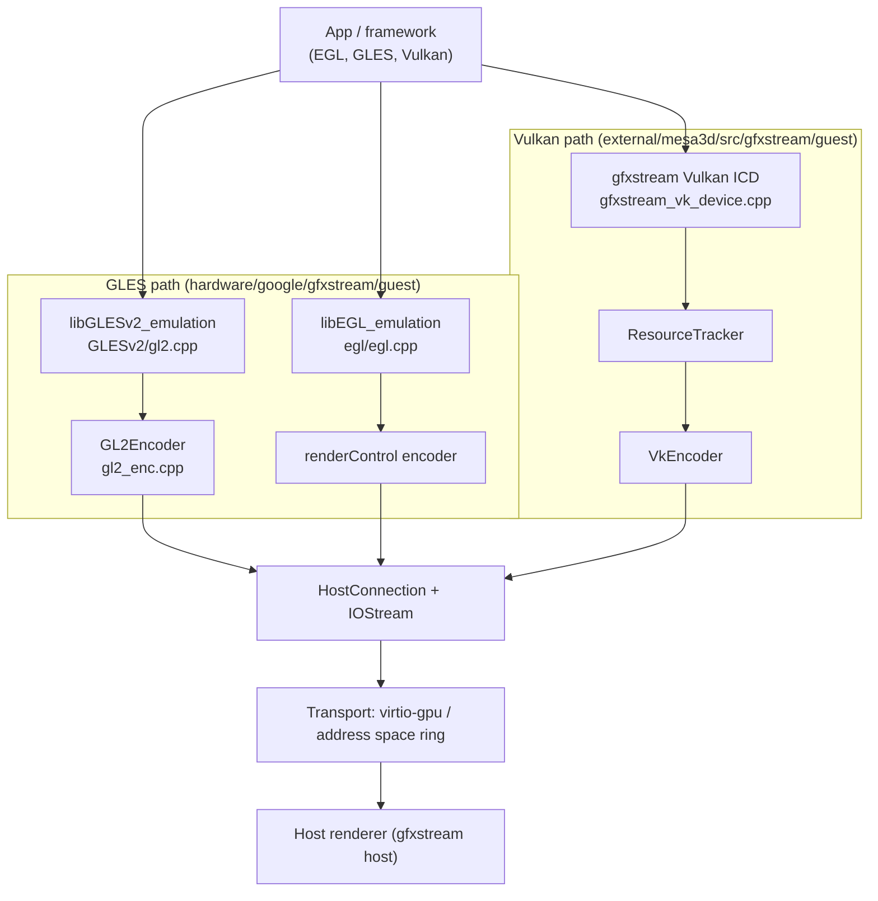
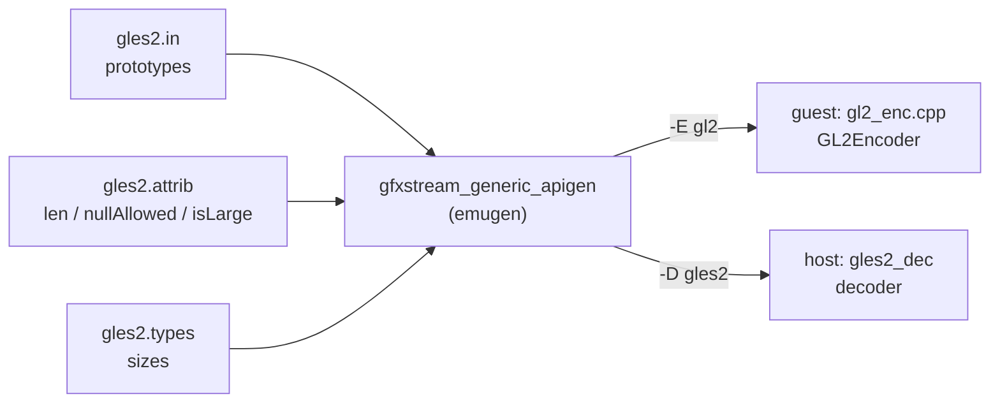
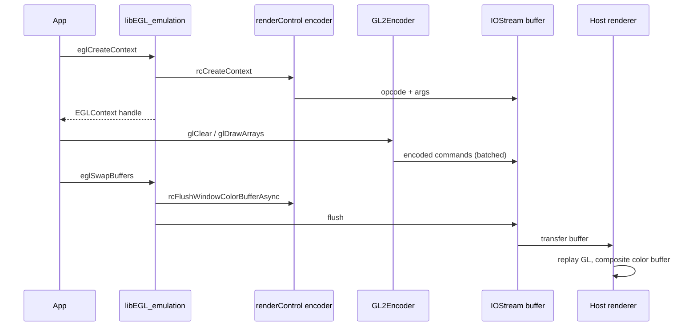
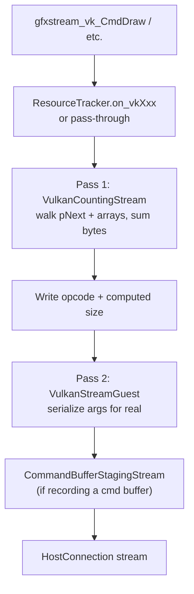
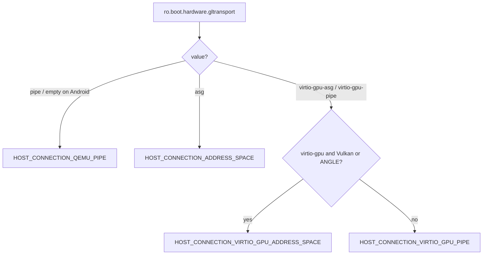
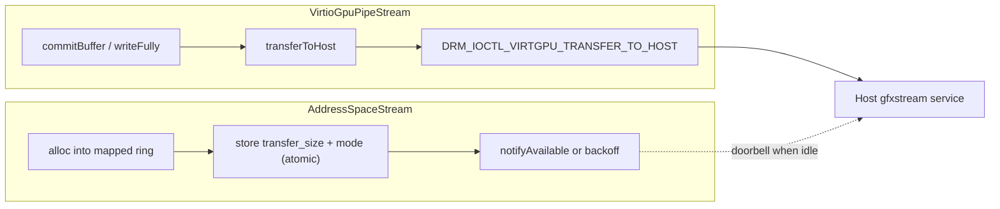
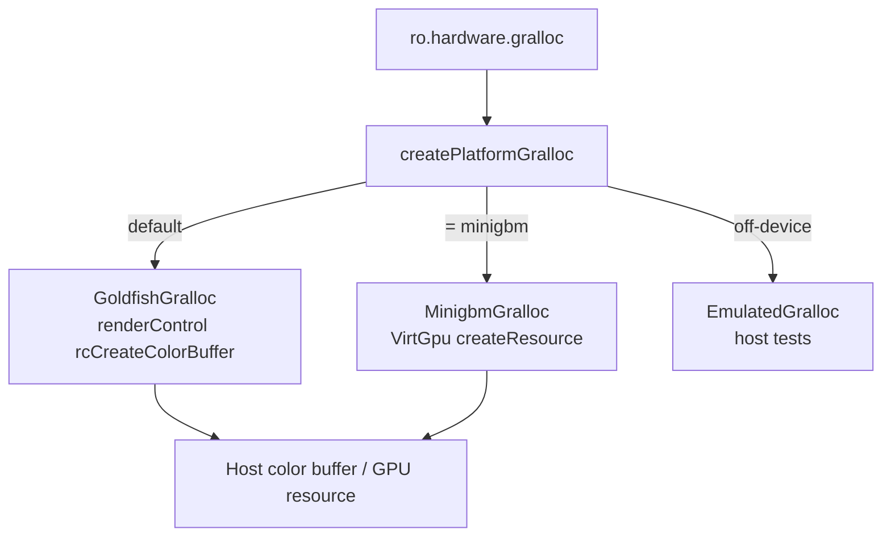

# Chapter 12: Guest GPU Drivers

A physical Android phone has a GPU and a kernel-mode driver that talks to it. An emulated Android device has neither. Instead it has a *guest GPU driver* whose job is not to drive silicon but to **serialize** every EGL, GLES, and Vulkan call the app makes, push the bytes across a host/guest transport, and let the host process replay them against the host's real GPU. This is the guest half of gfxstream — an "API forwarding" or "API remoting" driver. The app links against an ordinary `libEGL`/`libGLESv2`/`libvulkan` ICD, but underneath, every `glDrawArrays` becomes a packet on a ring buffer.

This chapter walks the guest stack from the top down: the EGL and GLES ICDs the framework loads, the generated encoders that turn function calls into bytes, the Vulkan ICD that rides on Mesa's runtime, the `HostConnection`/`IOStream` transport abstraction, the virtio-gpu and address-space ring buffers that actually carry the bytes, and the gralloc/minigbm buffer allocators that bridge graphics memory between guest and host. Two source trees matter here: the older `device/generic/goldfish-opengl/` and the current home of the code under `hardware/google/gfxstream/guest/` and `external/mesa3d/src/gfxstream/guest/`.

---

## 12.1 Two Trees, One Driver

The guest graphics driver lives in three places that together form one logical stack. Understanding the split prevents a lot of confusion when grepping.

The legacy tree is `device/generic/goldfish-opengl/`. Its `README` is explicit that it "contains Android-side modules related to hardware OpenGL ES emulation" and that the encoder sources are "auto-generated with the 'emugen' host tool." Today it still ships the gralloc HAL, the HWC3 composer, and codec shims under `device/generic/goldfish-opengl/system/` (`gralloc/`, `hwc3/`, `codecs/`).

The active gfxstream guest tree is split in two. The GLES/EGL encoders and the `HostConnection` transport glue live under `hardware/google/gfxstream/guest/` (`egl/`, `GLESv1_enc/`, `GLESv2_enc/`, `renderControl_enc/`, `OpenglSystemCommon/`). The Vulkan ICD, the resource tracker, the platform transport (`VirtGpu`), and the gralloc abstraction live in the Mesa import at `external/mesa3d/src/gfxstream/guest/` (`vulkan/`, `vulkan_enc/`, `platform/`, `android/`, `iostream/`). The Vulkan side moved into Mesa so it could reuse Mesa's `vk_instance`/`vk_device` dispatch runtime; the GLES side did not.

### 12.1.1 What ships in the guest image

The driver is delivered as a set of `.so` files with `_emulation` stems, named so the Android EGL loader can find them. The `Android.bp` files give the module names directly:

- `libEGL_emulation` from `hardware/google/gfxstream/guest/egl/Android.bp`
- `libGLESv1_CM_emulation` from `hardware/google/gfxstream/guest/GLESv1/Android.bp`
- `libGLESv2_emulation` from `hardware/google/gfxstream/guest/GLESv2/Android.bp`
- `libgfxstream_guest_vulkan_with_host.so`, the Vulkan ICD named in `external/mesa3d/src/gfxstream/guest/vulkan/gfxstream_icd.json`

The platform EGL loader reads `egl.cfg` to learn which backend to load. The emulator ships the trivial `hardware/google/gfxstream/guest/egl/egl.cfg` containing a single line:

```ini
# Source: hardware/google/gfxstream/guest/egl/egl.cfg
0 0 emulation
```

The third column, `emulation`, is the suffix the loader appends to `libEGL_`, `libGLESv1_CM_`, and `libGLESv2_`, which is exactly how it finds the gfxstream ICDs rather than a hardware vendor driver.

### 12.1.2 The guest GPU stack at a glance

The following diagram shows the layers from the app down to the host transport, and which tree each layer comes from.



## 12.2 The GLES ICD and Per-Thread Dispatch

The GLES libraries the framework loads are deliberately thin. `libGLESv2_emulation` is built from `hardware/google/gfxstream/guest/GLESv2/gl2.cpp`, which includes two generated files: `gl2_entry.cpp` (the public `glXxx` entry points) and `gl2_ftable.h` (the `eglGetProcAddress` table). Each public entry point does almost nothing except fetch a per-thread encoder and forward the arguments to it.

The forwarding hinges on a single macro. `gl2.cpp` redefines `GET_CONTEXT` to pull the encoder out of thread-local state:

```cpp
// Source: hardware/google/gfxstream/guest/GLESv2/gl2.cpp
//XXX: fix this macro to get the context from fast tls path
#define GET_CONTEXT GL2Encoder * ctx = getEGLThreadInfo()->hostConn->gl2Encoder();
```

The generated entry then expands to a one-line trampoline. For example, `glActiveTexture` in `hardware/google/gfxstream/guest/GLESv2_enc/gl2_entry.cpp`:

```cpp
// Source: hardware/google/gfxstream/guest/GLESv2_enc/gl2_entry.cpp
void glActiveTexture(GLenum texture)
{
	GET_CONTEXT;
	ctx->glActiveTexture(ctx, texture);
}
```

`getEGLThreadInfo()` returns a thread-local `EGLThreadInfo`, whose `hostConn` field holds the thread's `HostConnection`. Because the connection (and thus the encoder and its stream buffer) is thread-local, two app threads issuing GLES calls never contend on the same wire buffer — each has its own. The encoder object itself, `GL2Encoder`, is a C++ class generated from a spec; the next two sections explain where it comes from and what bytes it writes.

### 12.2.1 GLClientState: not everything is forwarded

`GL2Encoder` is not a pure forwarder. It maintains a `GLClientState` (declared in its base, see `hardware/google/gfxstream/guest/GLESv2_enc/GL2Encoder.h`) so it can answer client-side queries without a host round-trip, batch vertex-attribute setup, and validate arguments before they ever reach the host. The spec marks such functions `custom_decoder` or wraps them in hand-written code in `GL2Encoder.cpp`. The default for an unannotated call, though, is pure serialize-and-send, and that default is what the code generator produces.

## 12.3 emugen: Generating the Encoders

The bulk of the GLES and renderControl encoder code is generated, not written. The build runs a tool the source calls the "generic apigen" (historically "emugen") over three input files per API and emits the encoder `.cpp`/`.h` pair.

The driver lives in `hardware/google/gfxstream/codegen/generic-apigen/` (`main.cpp`, `parser.cpp`, `api_gen.cpp`, `entry_point.cpp`). The build script `hardware/google/gfxstream/scripts/generate-apigen-sources.sh` shows exactly how it is invoked. It builds the tool with Bazel, then runs it once per API in encoder mode (`-E`) for the guest and decoder mode (`-D`) for the host:

```bash
# Source: hardware/google/gfxstream/scripts/generate-apigen-sources.sh
bazel build codegen/generic-apigen:gfxstream_generic_apigen
...
./bazel-bin/codegen/generic-apigen/gfxstream_generic_apigen -i ./codegen/gles2 -D ./host/gl/gles2_dec -B gles2
./bazel-bin/codegen/generic-apigen/gfxstream_generic_apigen -i ./codegen/gles2 -E ./guest/GLESv2_enc -B gl2
```

The same input drives both sides, which is why the wire format is automatically consistent between the guest encoder and the host decoder.

### 12.3.1 The three spec files

Each API is described by three files, all under `hardware/google/gfxstream/codegen/`:

1. `*.in` — the function prototypes, one `GL_ENTRY(...)` per call. For example `hardware/google/gfxstream/codegen/gles2/gles2.in` lists `GL_ENTRY(void, glClear, GLbitfield mask)` and `GL_ENTRY(void, glDrawArrays, GLenum mode, GLint first, GLsizei count)`.
2. `*.attrib` — per-function attributes that tell the generator how to serialize pointer arguments: which parameter holds a buffer's length, whether NULL is allowed, whether the payload is "large." `gles2.attrib` opens with a `GLOBAL` block setting `base_opcode 2048`.
3. `*.types` — the size and pass-by-value/pointer rules for each type name used in the prototypes.

A representative `.attrib` entry shows how a pointer parameter is bound to its length:

```
# Source: hardware/google/gfxstream/codegen/gles2/gles2.attrib
glBufferData
    len data size
    var_flag data nullAllowed isLarge
```

`len data size` says "the byte length of the `data` pointer is the value of the `size` argument," which is how the generator knows how many bytes of `data` to copy into the packet. `isLarge` flags a payload that may be sent out of line rather than inlined into the command buffer.

### 12.3.2 Codegen flow

This diagram shows the single source of truth producing both ends of the protocol.



## 12.4 The GLES Wire Format

The generated encoder is the place to see the actual bytes. Every command is `[opcode:4][total_size:4][args...][checksum]`, all little-endian, written straight into the stream's current buffer with `memcpy`.

`glClear` is the simplest useful example. From the generated `hardware/google/gfxstream/guest/GLESv2_enc/gl2_enc.cpp`:

```cpp
// Source: hardware/google/gfxstream/guest/GLESv2_enc/gl2_enc.cpp
void glClear_enc(void *self , GLbitfield mask)
{
	gl2_encoder_context_t *ctx = (gl2_encoder_context_t *)self;
	IOStream *stream = ctx->m_stream;
	gfxstream::guest::ChecksumCalculator *checksumCalculator = ctx->m_checksumCalculator;
	bool useChecksum = checksumCalculator->getVersion() > 0;

	 const size_t sizeWithoutChecksum = 8 + 4;
	 const size_t checksumSize = checksumCalculator->checksumByteSize();
	 const size_t totalSize = sizeWithoutChecksum + checksumSize;
	unsigned char *buf = stream->alloc(totalSize);
	unsigned char *ptr = buf;
	int tmp = OP_glClear;memcpy(ptr, &tmp, 4); ptr += 4;
	memcpy(ptr, &totalSize, 4);  ptr += 4;
		memcpy(ptr, &mask, 4); ptr += 4;
	if (useChecksum) checksumCalculator->addBuffer(buf, ptr-buf);
	if (useChecksum) checksumCalculator->writeChecksum(ptr, checksumSize); ptr += checksumSize;
}
```

The `8` in `sizeWithoutChecksum` is the opcode plus the size field; the `4` is the single `GLbitfield mask`. The opcode `OP_glClear` is defined in the generated `gl2_opcodes.h` and is offset from the `base_opcode 2048` declared in the `.attrib` file, which keeps GLESv1, GLESv2, and renderControl opcode ranges disjoint so the host decoder can tell them apart on one stream.

### 12.4.1 alloc, not write

Note that the encoder calls `stream->alloc(totalSize)` and writes directly into the returned pointer. It does not call a `write()` method. `alloc` returns a pointer into the stream's pre-mapped buffer; the bytes are "sent" only when the buffer fills or is explicitly flushed. This is what makes the protocol fast: thousands of small commands accumulate in one buffer and cross the host boundary in a single transfer. The checksum is optional and gated on `checksumCalculator->getVersion() > 0`, negotiated once at connection time; when disabled it costs nothing.

### 12.4.2 The buffer lifecycle in IOStream

`alloc` is implemented once, in the base `IOStream`, in `external/mesa3d/src/gfxstream/guest/iostream/include/gfxstream/guest/IOStream.h`:

```cpp
// Source: external/mesa3d/src/gfxstream/guest/iostream/include/gfxstream/guest/IOStream.h
virtual unsigned char *alloc(size_t len) {
    if (m_iostreamBuf && len > m_free) {
        if (flush() < 0) {
            return NULL; // we failed to flush so something is wrong
        }
    }
    if (!m_iostreamBuf || len > m_bufsize) {
        size_t allocLen = this->idealAllocSize(len);
        m_iostreamBuf = (unsigned char *)allocBuffer(allocLen);
        ...
    }
    ...
    ptr = m_iostreamBuf + (m_bufsize - m_free);
    m_free -= len;
    return ptr;
}
```

When the next command does not fit in `m_free`, `alloc` calls `flush()`, which calls the subclass `commitBuffer()` to push the accumulated bytes to the host and then resets the buffer. The concrete transports — `QemuPipeStream`, `VirtioGpuPipeStream`, `AddressSpaceStream` — only have to implement `allocBuffer`, `commitBuffer`, and the read paths; the batching logic is shared.

## 12.5 EGL and the renderControl Channel

EGL is the window-system glue: it creates contexts, picks configs, allocates surfaces, and presents frames. Those operations are not GLES, so they do not go through `GL2Encoder`. They go through a separate generated encoder, `renderControl`, whose spec is `hardware/google/gfxstream/guest/renderControl_enc/renderControl.in`. Its entries are prefixed `rc`:

```
# Source: hardware/google/gfxstream/guest/renderControl_enc/renderControl.in
GL_ENTRY(uint32_t, rcCreateContext, uint32_t config, uint32_t share, uint32_t glVersion)
GL_ENTRY(uint32_t, rcCreateWindowSurface, uint32_t config, uint32_t width, uint32_t height)
GL_ENTRY(uint32_t, rcCreateColorBuffer, uint32_t width, uint32_t height, GLenum internalFormat)
GL_ENTRY(int, rcFlushWindowColorBuffer, uint32_t windowSurface)
```

`hardware/google/gfxstream/guest/egl/egl.cpp` is the EGL ICD. `eglCreateContext` validates the requested ES version against `rcEnc->getGLESMaxVersion()` and then calls into the renderControl encoder to create a *host-side* context:

```cpp
// Source: hardware/google/gfxstream/guest/egl/egl.cpp
uint32_t rcContext = rcEnc->rcCreateContext(rcEnc, (uintptr_t)s_display.getIndexOfConfig(config), rcShareCtx, rcMajorVersion);
```

The guest holds only the integer handle `rcContext`; the real GL context lives on the host. Similarly `eglSwapBuffers` does not copy pixels — it asks the surface to post and then flushes:

```cpp
// Source: hardware/google/gfxstream/guest/egl/egl.cpp
EGLBoolean eglSwapBuffers(EGLDisplay dpy, EGLSurface eglSurface)
{
    ...
    egl_surface_t* d = static_cast<egl_surface_t*>(eglSurface);
    EGLBoolean ret = d->swapBuffers();
    hostCon->flush();
    return ret;
}
```

The surface's `swapBuffers()` ultimately calls `rcEnc->rcFlushWindowColorBufferAsync` (egl.cpp, the surface-post path), telling the host to composite the color buffer the guest has been rendering into. Because rendering already happened on the host, "swap" is just a control message plus a flush.

### 12.5.1 EGL display is a singleton

The EGL display is not negotiated per call — `egl.cpp` keeps a single `static eglDisplay s_display;` and `eglGetDisplay` always returns its address. Validation macros (`VALIDATE_DISPLAY_INIT`, `DEFINE_AND_VALIDATE_HOST_CONNECTION`) check that the passed `EGLDisplay` equals `&s_display` before touching it, so a bad handle fails fast in the guest instead of corrupting the wire stream.

### 12.5.2 An EGL frame, end to end

This sequence shows context creation through one presented frame, with the two encoders cooperating over one connection.



## 12.6 The Vulkan ICD on the Mesa Runtime

The Vulkan guest driver is structurally different from GLES. Instead of a thin hand-written ICD over a generated encoder, it is a full Mesa Vulkan driver that *reuses Mesa's dispatch runtime* and forwards through a generated `VkEncoder`. The loader finds it through the ICD manifest:

```
// Source: external/mesa3d/src/gfxstream/guest/vulkan/gfxstream_icd.json
{
    "file_format_version": "1.0.0",
    "ICD": {
      "library_path": "libgfxstream_guest_vulkan_with_host.so",
      "api_version": "1.0.5"
    }
}
```

`external/mesa3d/src/gfxstream/guest/vulkan/gfxstream_vk_device.cpp` implements the entry points with the `gfxstream_vk_` prefix and wires them into Mesa's dispatch tables. `gfxstream_vk_CreateInstance` first builds a Mesa `vk_instance`, then makes the encoder call:

```cpp
// Source: external/mesa3d/src/gfxstream/guest/vulkan/gfxstream_vk_device.cpp
result = vk_instance_init(&instance->vk, extensions, &dispatch_table, pCreateInfo, pAllocator);
...
/* Encoder call */
{
    ...
    auto vkEnc = gfxstream::vk::ResourceTracker::getThreadLocalEncoder();
    result = vkEnc->vkCreateInstance(&localCreateInfo, nullptr, &instance->internal_object,
                                     true /* do lock */);
    ...
}
```

So a Vulkan call passes through three layers in the guest: the Mesa-style entry point (`gfxstream_vk_*`), the `ResourceTracker` (which decides what needs special handling), and the `VkEncoder` (which serializes the call onto the stream). The host object handle is stored as `internal_object` inside the guest's Mesa object.

### 12.6.1 ResourceTracker: the brains

`external/mesa3d/src/gfxstream/guest/vulkan_enc/ResourceTracker.cpp` is the large, hand-written core. It owns the per-thread encoder, the sequence-number counter that orders commands, the gralloc handle, and all the `on_vkXxx` overrides for calls that cannot be blindly forwarded — memory allocation, image creation, AndroidHardwareBuffer import, swapchain interaction. The encoder fetch is a static helper:

```cpp
// Source: external/mesa3d/src/gfxstream/guest/vulkan_enc/ResourceTracker.cpp
ALWAYS_INLINE_GFXSTREAM VkEncoder* ResourceTracker::getThreadLocalEncoder() {
    auto hostConn = ResourceTracker::threadingCallbacks.hostConnectionGetFunc();
    auto vkEncoder = ResourceTracker::threadingCallbacks.vkEncoderGetFunc(hostConn);
    return vkEncoder;
}
```

Command ordering uses a monotonic sequence number so the host can detect out-of-order or dropped packets:

```cpp
// Source: external/mesa3d/src/gfxstream/guest/vulkan_enc/ResourceTracker.cpp
ALWAYS_INLINE_GFXSTREAM uint32_t ResourceTracker::nextSeqno() {
    uint32_t res = __atomic_add_fetch(sSeqnoPtr, 1, __ATOMIC_SEQ_CST);
    return res;
}
```

### 12.6.2 Capability negotiation

The Vulkan path's behavior is not hardcoded — it depends on capabilities the host advertises. `ResourceTracker` reads `mCaps.vulkanCapset` and branches on flags like `deferredMapping` and `mCaps.params[kParamCreateGuestHandle]` (ResourceTracker.cpp, the memory-allocation paths) to decide whether device memory is mapped lazily, whether a guest-side DRM handle backs it, and whether render-control encoding can be skipped. The `HostConnection::connect` path reads `caps.vulkanCapset.noRenderControlEnc` and only constructs a renderControl encoder for Vulkan when the host still needs one (HostConnection.cpp), which is how newer hosts drop the legacy GLES control channel for pure-Vulkan guests.

## 12.7 The Vulkan Wire Format: Count, Then Write

GLES commands are fixed-shape, so the encoder can compute `totalSize` arithmetically. Vulkan structs are deeply nested with `pNext` chains and variable arrays, so the size of a serialized call is not known until you walk the whole structure. gfxstream solves this with a two-pass scheme using two streams, both visible in the `VkEncoder::Impl` in `external/mesa3d/src/gfxstream/guest/vulkan_enc/VkEncoder.cpp.inl`:

```cpp
// Source: external/mesa3d/src/gfxstream/guest/vulkan_enc/VkEncoder.cpp.inl
private:
    VulkanCountingStream m_countingStream;
    VulkanStreamGuest m_stream;
    BumpPool m_pool;
    Validation m_validation;
```

`VulkanCountingStream` (declared in `external/mesa3d/src/gfxstream/guest/vulkan_enc/VulkanStreamGuest.h` as a subclass of `VulkanStreamGuest`) overrides `write()` to count bytes instead of storing them. The generated `VkEncoder` method serializes each argument first to the counting stream to learn the exact packet size, then writes the opcode and that size, then re-serializes to the real `VulkanStreamGuest`. The `BumpPool` provides scratch allocations for the deep-copied structs during this walk without per-field `malloc`.

### 12.7.1 Command buffers stage locally

Recording into a `VkCommandBuffer` should not round-trip to the host on every `vkCmd*`. gfxstream batches an entire command buffer into a `CommandBufferStagingStream` and ships it at submit time. The staging stream is itself an `IOStream` (`external/mesa3d/src/gfxstream/guest/vulkan_enc/CommandBufferStagingStream.h`) with a custom allocator and an 8-byte sync header:

```cpp
// Source: external/mesa3d/src/gfxstream/guest/vulkan_enc/CommandBufferStagingStream.h
// host will write kSyncDataReadComplete to the sync bytes to indicate memory is no longer being
// used by host...
static constexpr size_t kSyncDataSize = 8;
static constexpr uint32_t kSyncDataReadComplete = 0X0;
static constexpr uint32_t kSyncDataReadPending = 0X1;
```

When `VULKAN_STREAM_FEATURE_QUEUE_SUBMIT_WITH_COMMANDS_BIT` is set, each command buffer pops its own private staging stream and encoder (`ResourceTracker::getCommandBufferEncoder`), so recording is lock-free per command buffer and the recorded blob is replayed on the host when the queue submit arrives. The sync bytes let the guest avoid freeing or reusing staging memory the host is still reading.

### 12.7.2 Two-pass encode

This diagram shows why Vulkan needs the counting pass that GLES does not.



## 12.8 HostConnection and Transport Selection

Every encoder — GLES, renderControl, Vulkan — writes into an `IOStream` owned by a `HostConnection`. The connection is per-thread and decides *which* physical transport to use. `hardware/google/gfxstream/guest/OpenglSystemCommon/HostConnection.h` enumerates four:

```cpp
// Source: hardware/google/gfxstream/guest/OpenglSystemCommon/HostConnection.h
enum HostConnectionType {
    HOST_CONNECTION_QEMU_PIPE = 1,
    HOST_CONNECTION_ADDRESS_SPACE = 2,
    HOST_CONNECTION_VIRTIO_GPU_PIPE = 3,
    HOST_CONNECTION_VIRTIO_GPU_ADDRESS_SPACE = 4,
};
```

The choice is made in `getConnectionTypeFromProperty` in `HostConnection.cpp`, driven by the system property `ro.boot.hardware.gltransport` (or the `GFXSTREAM_TRANSPORT` env var off-device). The mapping is: `pipe` selects the goldfish QEMU pipe, `asg` selects the goldfish address-space ring, and `virtio-gpu-asg`/`virtio-gpu-pipe` select the virtio-gpu-backed variants. There is one important override:

```cpp
// Source: hardware/google/gfxstream/guest/OpenglSystemCommon/HostConnection.cpp
if (capset == kCapsetGfxStreamVulkan || egl == "angle") {
    return HOST_CONNECTION_VIRTIO_GPU_ADDRESS_SPACE;
} else {
    return HOST_CONNECTION_VIRTIO_GPU_PIPE;
}
```

Vulkan (and ANGLE) always take the address-space ring rather than the pipe, because, as the comment notes, "ANGLE doesn't work well without ASG."

### 12.8.1 Connection setup and the per-process pipe

`HostConnection::connect` builds the chosen stream, sends a zero `clientFlags` word as a handshake, and calls `processPipeInit`:

```cpp
// Source: hardware/google/gfxstream/guest/OpenglSystemCommon/HostConnection.cpp
// send zero 'clientFlags' to the host.
unsigned int *pClientFlags =
        (unsigned int *)con->m_stream->allocBuffer(sizeof(unsigned int));
*pClientFlags = 0;
con->m_stream->commitBuffer(sizeof(unsigned int));
...
processPipeInit(handle, connType, noRenderControlEnc);
```

`processPipeInit` (in `OpenglSystemCommon/ProcessPipe.cpp`) opens a separate per-process pipe and obtains `sProcUID`, which the source describes as "a unique ID per process assigned by the host." This puid lets the host associate all of a process's color buffers and contexts and clean them up when the process dies. The destructor does a final synchronous round-trip — `m_rcEnc->rcGetRendererVersion(...)` — to make sure queued commands are drained before the connection closes (HostConnection.cpp).

### 12.8.2 Transport decision tree

This diagram captures the property-driven selection in `getConnectionTypeFromProperty`.



## 12.9 Riding virtio-gpu: Pipe Transfers and the Address-Space Ring

The two virtio-gpu transports both ultimately talk to a `/dev/dri/renderD*` node through DRM ioctls, but they move bytes very differently.

### 12.9.1 VirtioGpuPipeStream: TRANSFER ioctls

`hardware/google/gfxstream/guest/OpenglSystemCommon/VirtioGpuPipeStream.cpp` implements an `IOStream` whose header states it "uses VIRTGPU TRANSFER* ioctls on a virtio-gpu DRM rendernode device to communicate with a goldfish-pipe service on the host side." Its `allocBuffer` is a plain heap buffer, and `commitBuffer` just calls `writeFully`, which loops over `transferToHost`:

```cpp
// Source: hardware/google/gfxstream/guest/OpenglSystemCommon/VirtioGpuPipeStream.cpp
int VirtioGpuPipeStream::commitBuffer(size_t size) {
    if (size == 0) return 0;
    return writeFully(m_buf, size);
}
```

`transferToHost` (further down the same file) copies the bytes into a shared virtio-gpu resource and issues `m_resource->transferToHost(...)`, which under the hood is a `DRM_IOCTL_VIRTGPU_TRANSFER_TO_HOST`. Each flush is therefore at least one ioctl and one guest-to-host memory copy.

### 12.9.2 AddressSpaceStream: a lock-free ring

The address-space transport avoids per-flush ioctls. `external/mesa3d/src/gfxstream/guest/GoldfishAddressSpace/AddressSpaceStream.cpp` maps a shared `asg_ring_storage` region — a ring buffer plus a `ring_config` control block — directly into the guest process. Writing is a memory store; the host polls the ring. The commit path sets the transfer size and mode in the shared config and only "notifies" the host (a cheap doorbell) when the host is actually idle:

```cpp
// Source: external/mesa3d/src/gfxstream/guest/GoldfishAddressSpace/AddressSpaceStream.cpp
__atomic_store_n(&m_context.ring_config->transfer_size, size, __ATOMIC_RELEASE);
m_context.ring_config->transfer_mode = 3;
...
        notifyAvailable();
...
        backoff();
...
m_context.ring_config->transfer_mode = 1;
```

When the ring is full and the host is busy, the guest spins with an exponential `backoff()` instead of blocking in a syscall. This is the highest-throughput transport, which is why Vulkan is pinned to it. `VirtioGpuAddressSpaceStream.cpp` is the virtio-gpu-hosted variant: the same ring logic, but the shared memory comes from a virtio-gpu blob resource rather than a goldfish address-space device.

### 12.9.3 Transfer mechanisms compared



## 12.10 VirtGpu, execBuffer, and Vulkan's Direct Path

The Vulkan ICD does not always serialize into a stream buffer and flush. For control operations and for submitting recorded command buffers, it builds a virtio-gpu command and issues it directly through the `VirtGpuDevice` abstraction. The interface in `external/mesa3d/src/gfxstream/guest/platform/include/VirtGpu.h` exposes resource creation, blob creation, capability queries, and command submission:

```cpp
// Source: external/mesa3d/src/gfxstream/guest/platform/include/VirtGpu.h
virtual struct VirtGpuCaps getCaps(void) = 0;
virtual VirtGpuResourcePtr createBlob(const struct VirtGpuCreateBlob& blobCreate) = 0;
virtual int execBuffer(struct VirtGpuExecBuffer& execbuffer, const VirtGpuResource* blob) = 0;
```

The capability set is keyed by capset; the gfxstream Vulkan capset is `kCapsetGfxStreamVulkan = 3` and gralloc uses `kCapsetNone` (the enum in `VirtGpu.h`). The Linux/Android implementation is `external/mesa3d/src/gfxstream/guest/platform/drm/DrmVirtGpuDevice.cpp`. It finds the device with `drmGetDevices2`, then drives it entirely through `drmIoctl`: `DRM_IOCTL_VIRTGPU_GETPARAM`, `DRM_IOCTL_VIRTGPU_GET_CAPS`, `DRM_IOCTL_VIRTGPU_CONTEXT_INIT`, `DRM_IOCTL_VIRTGPU_RESOURCE_CREATE`, `DRM_IOCTL_VIRTGPU_RESOURCE_CREATE_BLOB`, and `DRM_IOCTL_VIRTGPU_EXECBUFFER`. The execbuffer path:

```cpp
// Source: external/mesa3d/src/gfxstream/guest/platform/drm/DrmVirtGpuDevice.cpp
exec.command = (uint64_t)(uintptr_t)(execbuffer.command);
...
ret = drmIoctl(mDeviceHandle, DRM_IOCTL_VIRTGPU_EXECBUFFER, &exec);
...
if (execbuffer.flags & kFenceOut) {
    execbuffer.handle.osHandle = exec.fence_fd;
    execbuffer.handle.type = kFenceHandleSyncFd;
}
```

The `kFenceOut` flag asks the kernel for an out-fence — a sync FD that signals when the host finishes the work. That FD becomes the Vulkan fence/semaphore the guest waits on, which is how cross-domain GPU synchronization works without polling.

## 12.11 gralloc and minigbm: Sharing Graphics Buffers

A `glClear` produces no pixels the CPU ever touches, but textures, camera frames, and the framebuffer are real buffers that must be shared between guest and host and sometimes mapped by guest CPU code. That is gralloc's job, and the emulator has more than one gralloc.

### 12.11.1 One abstract Gralloc, three backends

`external/mesa3d/src/gfxstream/guest/android/include/gfxstream/guest/GfxStreamGralloc.h` defines an abstract `Gralloc` class and an enum naming the backends:

```cpp
// Source: external/mesa3d/src/gfxstream/guest/android/include/gfxstream/guest/GfxStreamGralloc.h
enum GrallocType {
    GRALLOC_TYPE_GOLDFISH = 1,
    GRALLOC_TYPE_MINIGBM = 2,
    GRALLOC_TYPE_EMULATED = 3,
};
```

The key methods are `createColorBuffer`, `allocate`, `lock`/`lockPlanes`/`unlock`, and `getHostHandle` — the last one maps a guest `native_handle_t` to the host color-buffer ID that the renderControl and Vulkan encoders pass to the host. The factory picks the backend from a property:

```cpp
// Source: external/mesa3d/src/gfxstream/guest/android/GfxStreamGralloc.cpp
Gralloc* createPlatformGralloc(int32_t descriptor) {
    const std::string value = android::base::GetProperty("ro.hardware.gralloc", "");
    if (value == "minigbm") {
        auto gralloc = new MinigbmGralloc(descriptor);
        return gralloc;
    }
    return new GoldfishGralloc();
}
```

`GoldfishGralloc` (`GrallocGoldfish.cpp`) is the legacy path that talks to the host through renderControl color-buffer calls. `MinigbmGralloc` (`GrallocMinigbm.cpp`) allocates real virtio-gpu resources through the same `VirtGpuDevice` used by Vulkan, so a buffer can be a first-class virtio-gpu blob shared with the host GPU. `EmulatedGralloc` (`GrallocEmulated.cpp`) is the off-Android/host-test backend.

### 12.11.2 minigbm allocates virtio-gpu resources

`MinigbmGralloc::createColorBuffer` shows the difference concretely — it asks the `VirtGpuDevice` for a real resource with a virtio-gpu format and bind flags, rather than calling renderControl:

```cpp
// Source: external/mesa3d/src/gfxstream/guest/android/GrallocMinigbm.cpp
auto resource = mDevice->createResource(width, height, stride, stride * height, virtgpu_format,
                                        PIPE_TEXTURE_2D, VIRGL_BIND_RENDER_TARGET);
uint32_t handle = resource->getResourceHandle();
resource->intoRaw();
return handle;
```

`HostConnection::connect` constructs the gralloc helper right after the stream, passing the rendernode FD so minigbm shares the same DRM device the transport opened (HostConnection.cpp). `ResourceTracker` also constructs its own platform gralloc for the AHardwareBuffer import paths (ResourceTracker.cpp).

### 12.11.3 The legacy gralloc HAL

The traditional gralloc HAL module still lives in the old tree at `device/generic/goldfish-opengl/system/gralloc/gralloc_old.cpp`. Its `gralloc_alloc` validates the request, opens a `HostConnection` via a `DEFINE_HOST_CONNECTION` macro, and for renderable formats asks the host to create a color buffer. This is the implementation that backs `GoldfishGralloc` semantics on older system images; on current images the `Gralloc` abstraction above is what gfxstream's own code consumes.

### 12.11.4 Buffer sharing paths



## 12.12 Try It

These commands assume the emulator superproject is checked out and an AVD is running. Paths are repo-relative.

- Inspect the GLES wire format yourself by reading a generated encoder and matching it to the spec:

```bash
# the spec that drives glClear, glDrawArrays, etc.
sed -n '1,40p' hardware/google/gfxstream/codegen/gles2/gles2.in
# the generated encoder that emits opcode+size+args
grep -n "glClear_enc" hardware/google/gfxstream/guest/GLESv2_enc/gl2_enc.cpp
```

- See how the codegen tool is actually invoked, including the encoder vs decoder modes:

```bash
sed -n '1,45p' hardware/google/gfxstream/scripts/generate-apigen-sources.sh
```

- Find the transport-selection logic and the four transport types:

```bash
grep -n "HOST_CONNECTION_" hardware/google/gfxstream/guest/OpenglSystemCommon/HostConnection.h
grep -n "ro.boot.hardware.gltransport\|GFXSTREAM_TRANSPORT" \
  hardware/google/gfxstream/guest/OpenglSystemCommon/HostConnection.cpp
```

- On a running AVD, check which transport, EGL, and gralloc backend the guest actually selected:

```bash
adb shell getprop ro.boot.hardware.gltransport
adb shell getprop ro.hardware.egl
adb shell getprop ro.hardware.gralloc
```

- List the guest GPU driver libraries loaded in the image:

```bash
adb shell ls /vendor/lib64/egl/ | grep emulation
adb shell ls /vendor/lib64/hw/ | grep -i vulkan
```

- Read the Vulkan ICD manifest and confirm the library name the loader uses:

```bash
cat external/mesa3d/src/gfxstream/guest/vulkan/gfxstream_icd.json
```

## Summary

- The guest GPU driver does not drive hardware; it **serializes** EGL/GLES/Vulkan calls and forwards them to a host renderer that owns the real GPU. The driver is split across `device/generic/goldfish-opengl/` (legacy), `hardware/google/gfxstream/guest/` (GLES/EGL + transport), and `external/mesa3d/src/gfxstream/guest/` (Vulkan + platform + gralloc).
- The GLES ICDs (`libEGL_emulation`, `libGLESv1_CM_emulation`, `libGLESv2_emulation`) are thin: each entry point fetches a thread-local `GL2Encoder` via `getEGLThreadInfo()->hostConn` and forwards the call.
- The encoders are mostly generated by `gfxstream_generic_apigen` (emugen) from three spec files per API (`.in`, `.attrib`, `.types`), so the guest encoder and host decoder share one source of truth. The GLES wire format is `[opcode][size][args][optional checksum]`, written directly into a stream buffer with `memcpy`.
- EGL window-system operations go through a separate `renderControl` (`rc*`) encoder; `eglCreateContext` creates a host context and the guest keeps only an integer handle, while `eglSwapBuffers` is a flush plus a `rcFlushWindowColorBuffer*` control message.
- The Vulkan ICD is a full Mesa driver (`gfxstream_vk_*`) layered over a `ResourceTracker` and a generated `VkEncoder`. Because Vulkan structs are variable-size, encoding is two-pass: a `VulkanCountingStream` measures the packet, then `VulkanStreamGuest` writes it. Command buffers stage locally in a `CommandBufferStagingStream` and ship at submit time.
- All encoders write into a per-thread `HostConnection`/`IOStream`. The transport is chosen from `ro.boot.hardware.gltransport` among QEMU pipe, goldfish address-space ring, and the two virtio-gpu variants; Vulkan and ANGLE are pinned to the address-space ring for throughput.
- Bytes reach the host either via `DRM_IOCTL_VIRTGPU_TRANSFER_TO_HOST` (pipe stream) or a lock-free shared ring with an atomic `transfer_size`/`transfer_mode` and a backoff-and-doorbell notification (address-space stream). Control and submit operations can also go straight through `DRM_IOCTL_VIRTGPU_EXECBUFFER`, optionally returning an out-fence sync FD.
- gralloc bridges graphics memory: an abstract `Gralloc` with three backends (`GoldfishGralloc`, `MinigbmGralloc`, `EmulatedGralloc`) selected by `ro.hardware.gralloc`. minigbm allocates real virtio-gpu resources; the legacy goldfish path creates host color buffers via renderControl. `getHostHandle` maps a guest buffer to the host-side resource ID the encoders send.

### Key Source Files

| File | Purpose |
|------|---------|
| `hardware/google/gfxstream/guest/egl/egl.cpp` | EGL ICD (`libEGL_emulation`): contexts, surfaces, swap |
| `hardware/google/gfxstream/guest/GLESv2/gl2.cpp` | `libGLESv2_emulation` dispatch lib; redefines `GET_CONTEXT` |
| `hardware/google/gfxstream/guest/GLESv2_enc/gl2_enc.cpp` | Generated GLESv2 encoder (wire format) |
| `hardware/google/gfxstream/guest/renderControl_enc/renderControl.in` | renderControl (`rc*`) command spec |
| `hardware/google/gfxstream/codegen/generic-apigen/` | emugen code generator (parser, api_gen) |
| `hardware/google/gfxstream/scripts/generate-apigen-sources.sh` | How encoders/decoders are generated |
| `hardware/google/gfxstream/guest/OpenglSystemCommon/HostConnection.cpp` | Per-thread connection and transport selection |
| `external/mesa3d/src/gfxstream/guest/iostream/include/gfxstream/guest/IOStream.h` | Shared `alloc`/`flush` buffer batching |
| `external/mesa3d/src/gfxstream/guest/vulkan/gfxstream_vk_device.cpp` | Vulkan ICD entry points on Mesa runtime |
| `external/mesa3d/src/gfxstream/guest/vulkan_enc/ResourceTracker.cpp` | Vulkan resource tracking, seqno, gralloc/AHB import |
| `external/mesa3d/src/gfxstream/guest/vulkan_enc/VkEncoder.cpp.inl` | Counting + writing dual-stream encoder core |
| `external/mesa3d/src/gfxstream/guest/GoldfishAddressSpace/AddressSpaceStream.cpp` | Lock-free shared-ring transport |
| `external/mesa3d/src/gfxstream/guest/platform/drm/DrmVirtGpuDevice.cpp` | virtio-gpu DRM ioctls (execbuffer, caps, resources) |
| `external/mesa3d/src/gfxstream/guest/android/GfxStreamGralloc.cpp` | gralloc backend factory (`ro.hardware.gralloc`) |
| `external/mesa3d/src/gfxstream/guest/android/GrallocMinigbm.cpp` | minigbm gralloc over virtio-gpu resources |
