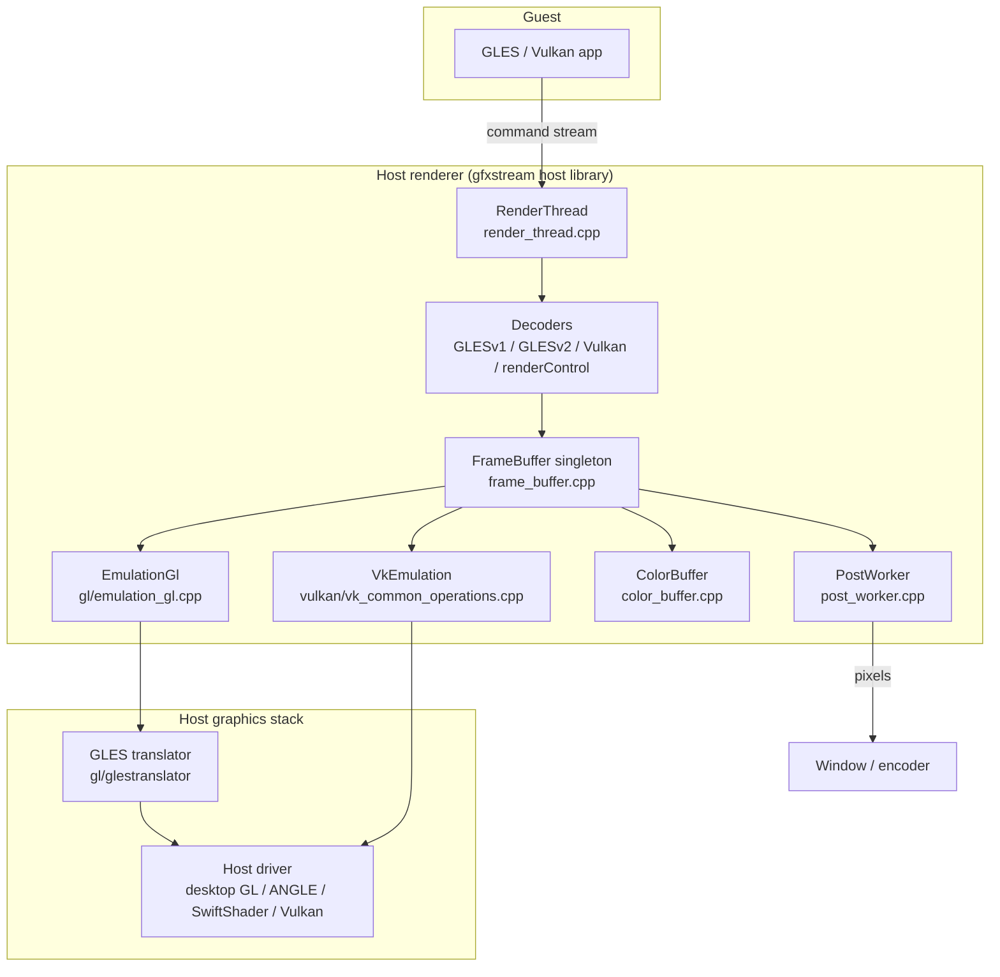
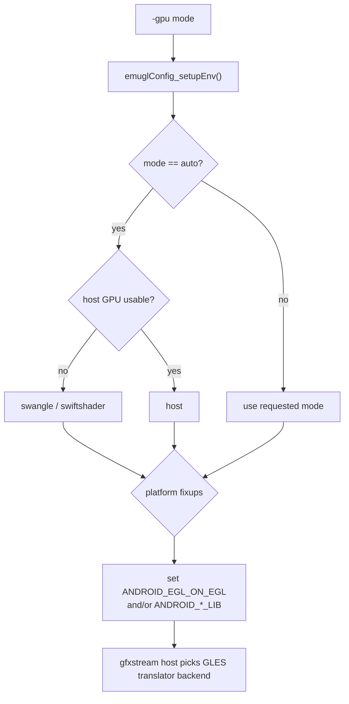
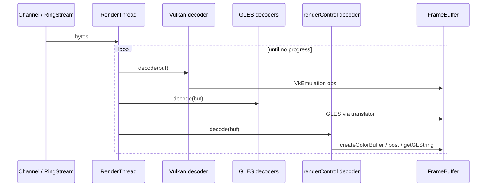
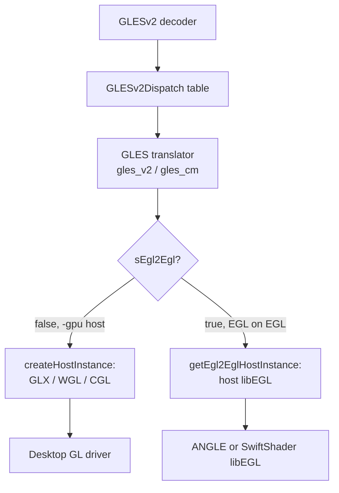
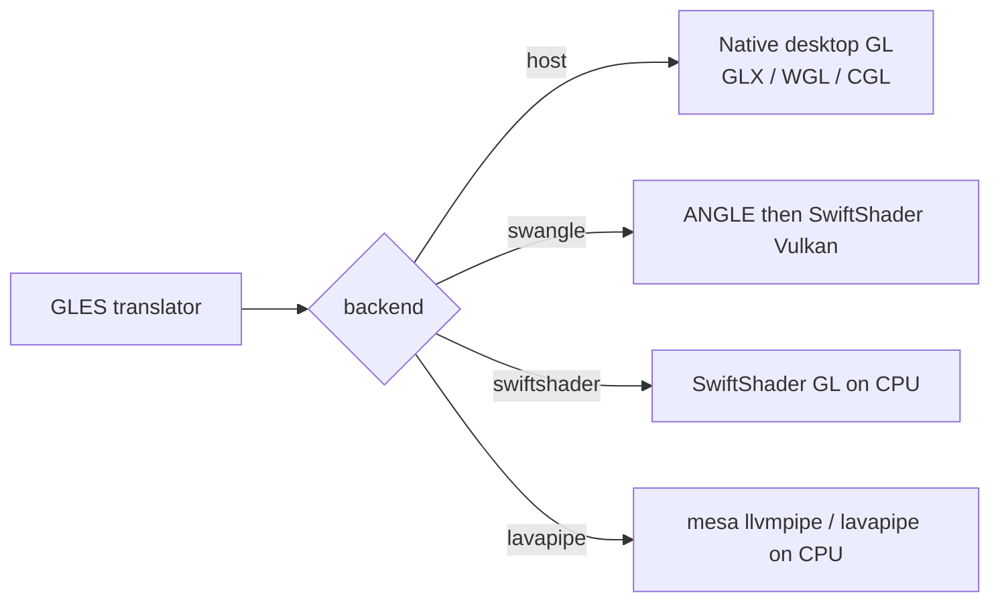
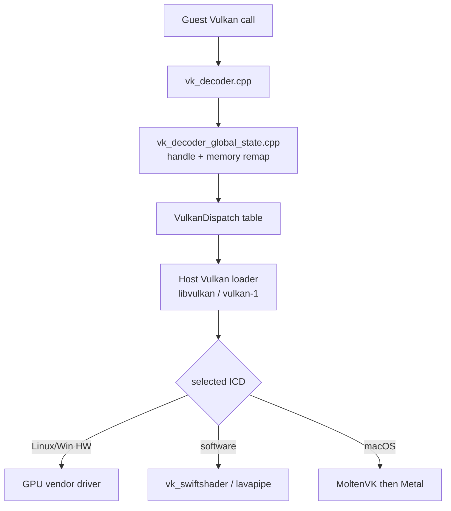
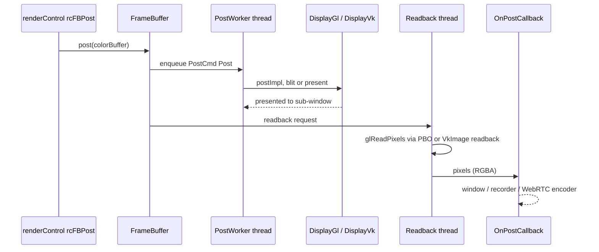

# Chapter 13: Host Rendering

The guest never touches a real GPU. Its OpenGL ES and Vulkan calls are serialized into a byte stream (Chapter 14), shipped across the virtio-gpu / goldfish-pipe transport, and replayed on the host by a renderer that the emulator links in as a shared library: gfxstream's host backend, historically called `libOpenglRender` and now built from `hardware/google/gfxstream/host/`. This chapter is about what happens on the host side once those bytes arrive: how the command stream is decoded, how GLES calls are translated to whatever the host can actually run (desktop GL, ANGLE, SwiftShader, mesa/lavapipe), how Vulkan is forwarded to a real host driver (including MoltenVK on macOS), and how the rendered pixels — held in host `ColorBuffer` objects — finally reach a window, the recorder, or the WebRTC encoder.

The central object is the `FrameBuffer` singleton in `hardware/google/gfxstream/host/frame_buffer.h`, which despite its name is really the renderer's global display state. Around it sit two emulation backends — `EmulationGl` and `VkEmulation` — a set of per-context render threads, three command decoders, and a `PostWorker` that puts finished frames on screen. We follow a frame from the decode loop down to the host driver and back up to the display.

---

## 13.1 The Host Renderer as a Loadable Library

The host renderer is not part of the QEMU binary. The emulator UI layer loads it as a shared library and talks to it through a small C++ interface, so the same renderer can serve both the QEMU-based Android Emulator and the crosvm-based Cuttlefish device (Chapter 26) through the virtio-gpu path.

The public entry points live in `hardware/google/gfxstream/host/include/render-utils/`. `RenderLib.h` and `render_api.h` expose `initLibrary()` and `initRenderer()`; `Renderer.h` is the abstract interface the rest of the emulator sees. The concrete implementation is `RendererImpl` in `hardware/google/gfxstream/host/renderer_impl.h`, which owns the render window, the render channels, and the render threads:

```cpp
// Source: hardware/google/gfxstream/host/renderer_impl.h
class RendererImpl final : public Renderer {
public:
    bool initialize(int width, int height, const gfxstream::host::FeatureSet& features,
                    bool useSubWindow);
    RenderChannelPtr createRenderChannel(
        gfxstream::Stream* loadStream, uint32_t virtioGpuContextId) final;
    void setPostCallback(OnPostCallback onPost, void* context,
                         bool useBgraReadback, uint32_t displayId) final;
    ...
};
```

`RendererImpl::initialize()` is where the singleton `FrameBuffer` is created. From that point on, every guest graphics process gets a `RenderChannel` (for the goldfish-pipe transport) or an address-space graphics consumer (for the ring-buffer transport), and each becomes one or more `RenderThread`s on the host.

### 13.1.1 GLES vs. Vulkan as separate concerns

A subtle but important fact: GLES emulation and Vulkan emulation are two independent backends, selected independently. The build can even compile out GLES entirely — every GL-specific declaration in `frame_buffer.h` is guarded by `#if GFXSTREAM_ENABLE_HOST_GLES`. `FrameBuffer` queries each backend's presence at runtime:

```cpp
// Source: hardware/google/gfxstream/host/frame_buffer.h
bool hasEmulationGl() const;
bool hasEmulationVk() const;
```

GLES goes through a translator (Section 13.4); Vulkan is forwarded almost verbatim to a host driver (Section 13.7). The two share the `ColorBuffer` abstraction so that a buffer produced by one API can be displayed or read back through the other.

### 13.1.2 The component map

Host renderer top-level components and their files



## 13.2 Choosing a Rendering Backend

Before any frame is decoded, the emulator must decide which host backend will execute the guest's GLES and Vulkan. That decision lives in the UI/init layer, not in gfxstream itself: `external/qemu/android/android-ui/modules/aemu-gl-init/src/android/opengl/emugl_config.cpp`.

The user-facing `-gpu <mode>` flag is mapped to an internal renderer enum by `emuglConfig_get_renderer()`:

```cpp
// Source: external/qemu/android/android-ui/modules/aemu-gl-init/src/android/opengl/emugl_config.cpp
SelectedRenderer emuglConfig_get_renderer(const char* gpu_mode) {
    if (!gpu_mode) {
        return SELECTED_RENDERER_UNKNOWN;
    } else if (!strcmp(gpu_mode, "host") || !strcmp(gpu_mode, "on")) {
        return SELECTED_RENDERER_HOST;
    } else if (!strcmp(gpu_mode, "swiftshader")) {
        return SELECTED_RENDERER_SWIFTSHADER_INDIRECT;
    } else if (!strcmp(gpu_mode, "swangle")) {
        return SELECTED_RENDERER_ANGLE_INDIRECT;
    } else if (!strcmp(gpu_mode, "lavapipe") || !strcmp(gpu_mode, "llvmpipe")) {
        return SELECTED_RENDERER_LAVAPIPE;
    }
    ...
}
```

So there are five named modes the emulator distinguishes internally:

1. `host` — translate GLES to the native desktop GL driver, forward Vulkan to the native Vulkan driver.
2. `swiftshader` — software GLES via Google's SwiftShader libraries (a software GL/Vulkan renderer).
3. `swangle` — software GLES via ANGLE on top of SwiftShader's Vulkan ("SwANGLE").
4. `lavapipe`/`llvmpipe` — software rendering via mesa's lavapipe (Vulkan) / llvmpipe (GL) on Linux.
5. `error` — selection failed; GPU emulation is disabled.

### 13.2.1 The `auto` decision

The default `-gpu auto` does not appear in the enum above because it is resolved earlier into one of the concrete modes. In `emuglConfig_setupEnv()`, `auto` falls back to software rendering when the host has no usable GPU, and otherwise prefers `host`:

```cpp
// Source: external/qemu/android/android-ui/modules/aemu-gl-init/src/android/opengl/emugl_config.cpp
if (no_window || async_query_host_gpu_blacklisted() ||
    !sufficientHostVulkanDriver) {
    switchToSoftwareGles = true;
}
...
if (switchToSoftwareGles) {
    gles_mode_selected = "swangle";
} else {
    gles_mode_selected = "host";
}
```

Platform constraints then override the choice: on Windows `swangle`/`llvmpipe` are unavailable so software falls back to `swiftshader`; on macOS `swiftshader`/`llvmpipe` are unavailable so software falls back to `swangle`. The same function also keeps a separate GLES mode and Vulkan mode, because `swangle` has no Vulkan flavor and is mapped to `swiftshader` for Vulkan.

### 13.2.2 Wiring the backend into the translator

For everything except `host`, gfxstream's GLES translator must be told to run on top of a host `libEGL` rather than the native windowing GL. `emuglConfig_setupEnv()` communicates this with environment variables:

```cpp
// Source: external/qemu/android/android-ui/modules/aemu-gl-init/src/android/opengl/emugl_config.cpp
if (... !strcmp(config->gles_backend, "swangle")) {
    system->envSet("ANDROID_EGL_ON_EGL", "1");
    return;
}
... // otherwise resolve ANDROID_EGL_LIB / ANDROID_GLESv2_LIB to the backend libs
```

The backend libraries themselves ship under `lib64/gles_swiftshader/` and `lib64/gles_angle/` (note that the `swangle` GLES library lives in the `gles_angle` folder — `emugl_config.cpp` rewrites the name `swangle` to `angle` when resolving the library path). `EmuglBackendList` (`.../EmuglBackendList.cpp`) scans those directories and reports which backends are available.

How `-gpu` becomes a backend selection



## 13.3 Decoding the Command Stream: The Render Thread

Each guest graphics context becomes a `RenderThread` (`hardware/google/gfxstream/host/render_thread.cpp`). The thread owns a `ReadBuffer` and loops: read bytes from the channel, hand them to the decoders, repeat until the channel closes.

The loop is interesting because a single buffer can contain a mix of Vulkan, GLESv1, GLESv2, and renderControl commands, so the thread offers the buffer to each decoder in turn and consumes whatever each one recognizes:

```cpp
// Source: hardware/google/gfxstream/host/render_thread.cpp
if (tInfo->m_vkInfo) {
    ...
    last = tInfo->m_vkInfo->m_vkDec.decode(readBuf.buf(), readBuf.validData(), ioStream,
                                           processResources, context);
    if (last > 0) { readBuf.consume(last); progress = true; }
}
...
if (tInfo->m_glInfo) {
    last = tInfo->m_glInfo->m_glDec.decode(   // GLESv1
            readBuf.buf(), readBuf.validData(), ioStream, &checksumCalc);
    if (last > 0) { progress = true; readBuf.consume(last); }

    last = tInfo->m_glInfo->m_gl2Dec.decode(  // GLESv2/v3
            readBuf.buf(), readBuf.validData(), ioStream, &checksumCalc);
    if (last > 0) { progress = true; readBuf.consume(last); }
}
...
last = tInfo->m_rcDec.decode(readBuf.buf(), readBuf.validData(),  // renderControl
                            ioStream, &checksumCalc);
```

There are four decoders here: the Vulkan decoder, the GLESv1 decoder, the GLESv2/v3 decoder, and the renderControl decoder. Each is generated from `.entries` interface descriptions (Chapter 14) and turns wire bytes back into real function calls. The `decode()` methods return how many bytes they consumed; the loop keeps going as long as any decoder makes progress.

### 13.3.1 The driver-workaround lock

Note the `FrameBuffer::getFB()->lockContextStructureRead()` call wrapped around the GLES decode in `render_thread.cpp`. The comment explains the reason: on Linux with some NVIDIA drivers, calling GLES functions while another thread is creating or destroying an EGL context (`glXMakeCurrent`) can crash inside the driver. The renderer takes a read lock around GLES dispatch and a write lock around context create/destroy to serialize against that bug. The Vulkan decode is deliberately left outside this lock.

### 13.3.2 renderControl: the side-channel

The `renderControl` decoder is the renderer's own control protocol — it is how the guest creates color buffers, opens/closes them, asks for GL strings, sets swap intervals, posts frames, and queries which host features are available. Its server-side handlers live in `hardware/google/gfxstream/host/render_control.cpp`, and most of them call straight into the `FrameBuffer` singleton. `rcGetGLString` (Section 13.6) and `rcCreateColorBuffer`/`rcFBPost` are all renderControl entry points.

The render thread decode loop



## 13.4 GLES Emulation: The Translator

When the GLES decoders execute a call, they dispatch it through a function-pointer table (`GLESv1Dispatch`, `GLESv2Dispatch`) loaded by `OpenGLDispatchLoader.cpp`. Those tables do not point at the host driver directly — they point at gfxstream's GLES translator in `hardware/google/gfxstream/host/gl/glestranslator/`. The translator is the heart of GL host rendering: it implements the GLES 1.x/2.0/3.x API on top of whatever GL the host actually exposes, fixing up the impedance mismatches (fixed-function GLES 1.x emulated over shaders, core-profile desktop GL quirks, extension differences, format conversions).

The dispatch tables are loaded lazily and chained: the GLES dispatchers force the EGL dispatch to load first, because GL entry points are resolved through `eglGetProcAddress`:

```cpp
// Source: hardware/google/gfxstream/host/gl/OpenGLESDispatch/OpenGLDispatchLoader.cpp
LazyLoadedGLESv2Dispatch::LazyLoadedGLESv2Dispatch() {
    LazyLoadedEGLDispatch::get();
    mValid = gles2_dispatch_init(&s_gles2);
}
```

### 13.4.1 EGL "on EGL" vs. native windowing

The translator needs an EGL implementation to create contexts and surfaces. It has two ways to get one, chosen by `EglGlobalInfo`:

```cpp
// Source: hardware/google/gfxstream/host/gl/glestranslator/egl/egl_global_info.cpp
if (sEgl2Egl) {
    m_engine = EglOS::getEgl2EglHostInstance(nullEgl);
} else {
    m_engine = EglOS::Engine::createHostInstance();
}
```

`createHostInstance()` is the native path: it has platform-specific implementations for GLX on Linux (`egl_os_api_glx.cpp`), WGL on Windows (`egl_os_api_wgl.cpp`), and CGL on macOS (`egl_os_api_darwin.cpp`). This is what `-gpu host` uses — the translator sits directly on the operating system's desktop OpenGL.

`getEgl2EglHostInstance()` is the "EGL-on-EGL" path (`egl_os_api_egl.cpp`): instead of native windowing GL, the translator loads a host `libEGL.so`/`.dll`/`.dylib` and runs on top of *that*. The flag that selects it, `sEgl2Egl`, is set by `eglUseOsEglApi()`, which `EmulationGl` calls during init based on whether the backend wants EGL-on-EGL:

```cpp
// Source: hardware/google/gfxstream/host/gl/emulation_gl.cpp
if (s_egl.eglUseOsEglApi) {
    s_egl.eglUseOsEglApi(eglOnEgl, EGL_FALSE);
}
```

That `eglOnEgl` flag is ultimately driven by the `ANDROID_EGL_ON_EGL=1` environment variable set in `emugl_config.cpp` for the `swangle` backend. So the same translator is reused for ANGLE and SwiftShader: those backends provide a `libEGL`, and the translator runs GLES-on-EGL against it.

GLES translator dispatch and backend selection



## 13.5 ANGLE, SwiftShader, mesa: The GLES Substrates

The translator always produces GLES-on-something. What that "something" is depends on the selected backend.

### 13.5.1 Desktop GL (`-gpu host`)

On `host` mode the translator targets the platform's native desktop OpenGL through GLX/WGL/CGL. This is the fastest path but the most fragile: real drivers vary wildly in extension support and conformance, which is why so much of `emulation_gl.cpp` and the translator is workaround code (the Intel GLES 3.1 cap, the Imagination fast-blit disable, the NVIDIA context lock). `EmulationGl::create()` even re-negotiates the maximum GLES version downward for some vendors:

```cpp
// Source: hardware/google/gfxstream/host/gl/emulation_gl.cpp
if (gpuVendor == gfxstream::host::GpuVendor::kIntel) {
    // BUG: 435712974 ... cap the max gles to 3.0
    if (!ChooseGlesVersionAndPopulateDispatch(GLES_DISPATCH_MAX_VERSION_3_0)) {
        return nullptr;
    }
}
```

### 13.5.2 ANGLE (`-gpu swangle`, and Windows fast path)

ANGLE (`external/angle/`) is "Almost Native Graphics Layer Engine." Its job is to implement OpenGL ES on top of a *different* host API. Per its README, it can translate ES 2.0/3.0/3.1 to Vulkan, desktop GL, Direct3D 9/11, and Metal. In the emulator it is loaded as the host `libEGL`/`libGLESv2` that the translator runs on top of (the EGL-on-EGL path).

`swangle` specifically means "ANGLE backed by SwiftShader's Vulkan" — software all the way down, used when there is no usable host GPU. ANGLE's Vulkan backend renders into SwiftShader's `vk_swiftshader` ICD. The translator's EGL-on-EGL display can also explicitly request ANGLE platform types:

```cpp
// Source: hardware/google/gfxstream/host/gl/glestranslator/egl/egl_os_api_egl.cpp
const EGLAttrib attr[] = {
    EGL_PLATFORM_ANGLE_TYPE_ANGLE,
    EGL_PLATFORM_ANGLE_TYPE_D3D11_ANGLE,
    EGL_EXPERIMENTAL_PRESENT_PATH_ANGLE,
    EGL_EXPERIMENTAL_PRESENT_PATH_FAST_ANGLE,
    EGL_NONE
};
mDisplay = mDispatcher.eglGetPlatformDisplay(EGL_PLATFORM_ANGLE_ANGLE,
    (void*)EGL_DEFAULT_DISPLAY, attr);
```

There is also a NULL-ANGLE display (`EGL_PLATFORM_ANGLE_TYPE_NULL_ANGLE`) used as a no-op backend for headless/testing scenarios, requested when `nullEgl` is set.

### 13.5.3 SwiftShader (`-gpu swiftshader`)

SwiftShader is Google's pure-CPU implementation of GL ES and Vulkan. In `swiftshader` mode the translator runs GLES-on-EGL against SwiftShader's `libEGL`/`libGLESv2` (shipped under `lib64/gles_swiftshader/`), and SwiftShader executes shaders on the CPU. It is the cross-platform software fallback on Windows and Linux (macOS uses `swangle` instead). The Vulkan side of software rendering also uses SwiftShader's Vulkan ICD (`vk_swiftshader`), selected via the `ANDROID_EMU_VK_ICD=swiftshader` environment variable that `vk_common_operations.cpp` reads.

### 13.5.4 mesa lavapipe / llvmpipe

`external/mesa3d/` provides mesa's software renderers: llvmpipe (a Gallium OpenGL driver) and lavapipe (a Vulkan driver built on the same LLVM-based rasterizer). On Linux, `-gpu lavapipe` selects these as the software path. As the mesa3d README notes, the tree's mesa also supplies the *guest* gfxstream/virtio-gpu Vulkan driver — but on the host it is the lavapipe/llvmpipe software ICD. `vulkan_dispatch.cpp` even has a direct-load path for it that bypasses the Vulkan loader in high-integrity mode (`kLavapipeIcdJson`, resolving `libvulkan_lvp`).

A note on `external/virglrenderer/`: virglrenderer is the *other* virtio-gpu host renderer (the OpenGL-focused "virgl" path used by plain QEMU/crosvm). The Android stack uses gfxstream rather than virgl for Android guests, but virglrenderer ships in the tree because crosvm can be built with either.

GLES substrate options behind the translator



## 13.6 GL Strings and Why the Guest Thinks It Has a GPU

A GLES app on the guest calls `glGetString(GL_VENDOR/GL_RENDERER/GL_VERSION)` and `eglQueryString`. Those calls are not answered by the host driver directly — they go through the renderControl protocol to `rcGetGLString` in `render_control.cpp`, which composes the answer from the host's real strings plus the negotiated feature set.

```cpp
// Source: hardware/google/gfxstream/host/render_control.cpp
static EGLint rcGetGLString(EGLenum name, void* buffer, EGLint bufferSize) {
    FrameBuffer* fb = FrameBuffer::getFB();
    std::string glStr;
    if (fb->hasEmulationGl()) {
        glStr = fb->getGlString(name);
    }
    const gfxstream::host::FeatureSet& features = fb->getFeatures();
    bool asyncSwapEnabled = shouldEnableAsyncSwap(features);
    ...
}
```

This is also where the host's reported extension string is augmented with the synthetic extensions that the gfxstream pipe relies on — checksum support, async swap, DMA, direct memory, host composition, and a long list of Vulkan capability flags. Many of these are gated on `get_gfxstream_renderer() == SELECTED_RENDERER_HOST`, because the software backends do not support them:

```cpp
// Source: hardware/google/gfxstream/host/render_control.cpp
if (asyncSwapEnabled && name == GL_EXTENSIONS) {
    glStr += kAsyncSwapStrV2;
    glStr += " ";
    if (get_gfxstream_renderer() == SELECTED_RENDERER_HOST) {
        glStr += kAsyncSwapStrV3;
        glStr += " ";
        glStr += kAsyncSwapStrV4;
        glStr += " ";
    }
}
```

The GLES version reported back is also rewritten through `replaceESVersionString()` so the guest sees the version gfxstream actually negotiated (2.0, 3.0, or 3.1), regardless of what the host happens to expose. The net effect: the guest's GL stack believes it is talking to a coherent GPU with exactly the extensions gfxstream chose to advertise.

## 13.7 Vulkan on the Host

Vulkan does not go through a translator. The Vulkan decoder (`hardware/google/gfxstream/host/vulkan/vk_decoder.cpp`) reconstructs the guest's `vkCmd*`/`vkCreate*` calls and forwards them, after handle and memory remapping, to a real host Vulkan driver. The host-side bookkeeping (handle boxing, memory mapping, snapshot reconstruction) is `vk_decoder_global_state.cpp`, and the device/instance lifecycle is `vk_common_operations.cpp`.

### 13.7.1 Loading the host Vulkan loader

`vulkan_dispatch.cpp` finds and `dlopen`s the platform Vulkan loader. The basenames are platform-specific:

```cpp
// Source: hardware/google/gfxstream/host/vulkan/vulkan_dispatch.cpp
static std::vector<std::string> getPossibleLoaderPathBasenames() {
#if defined(__APPLE__)
    return std::vector<std::string>{"libvulkan.dylib"};
#elif defined(__linux__)
    return std::vector<std::string>{"libvulkan.so", "libvulkan.so.1"};
#elif defined(_WIN32)
    return std::vector<std::string>{"vulkan-1.dll"};
    ...
}
```

It searches `lib64/vulkan/` next to the program/launcher first, then the system path; an explicit override is honored via `ANDROID_EMU_VK_LOADER_PATH`. Once loaded, `vkGetInstanceProcAddr` (or `vk_icdGetInstanceProcAddr` for a direct ICD) populates the `VulkanDispatch` table.

### 13.7.2 Physical device selection

`VkEmulation::create()` enumerates physical devices and scores them, preferring discrete GPUs and higher API versions:

```cpp
// Source: hardware/google/gfxstream/host/vulkan/vk_common_operations.cpp
const uint32_t deviceTypeScoreTable[] = {
    100,   // VK_PHYSICAL_DEVICE_TYPE_OTHER = 0,
    1000,  // VK_PHYSICAL_DEVICE_TYPE_INTEGRATED_GPU = 1,
    2000,  // VK_PHYSICAL_DEVICE_TYPE_DISCRETE_GPU = 2,
    500,   // VK_PHYSICAL_DEVICE_TYPE_VIRTUAL_GPU = 3,
    600,   // VK_PHYSICAL_DEVICE_TYPE_CPU = 4,
};
```

A CPU device (SwiftShader/lavapipe) scores low but is still usable, which is exactly what software-rendering modes rely on.

### 13.7.3 MoltenVK on macOS

macOS has no native Vulkan — Apple ships only Metal. MoltenVK (`external/moltenvk/`) is a Vulkan implementation layered on top of Metal, exposed as a portability driver. The emulator selects it through the `ANDROID_EMU_VK_ICD=moltenvk` environment variable, and `vk_common_operations.cpp` enables the portability extensions only on Apple:

```cpp
// Source: hardware/google/gfxstream/host/vulkan/vk_common_operations.cpp
#ifdef __APPLE__
    std::vector<const char*> moltenVkDeviceExtNames = {
        VK_KHR_PORTABILITY_SUBSET_EXTENSION_NAME,
    };
    std::vector<const char*> portabilityEnumerationNames = {
        VK_KHR_PORTABILITY_ENUMERATION_EXTENSION_NAME,
    };
#endif
...
    const bool useMoltenVK = (vulkanIcd == "moltenvk");
```

When `useMoltenVK` is set, the renderer enables `VK_KHR_portability_subset` on the device and remembers `mInstanceSupportsMoltenVK` (queried later via `supportsMoltenVk()`). MoltenVK advertises itself as a portability ICD — its bundled `MoltenVK_icd.json` carries `"is_portability_driver": true`, which is why the host instance must enable `VK_KHR_portability_enumeration` to even see the device. The decoded guest Vulkan therefore runs Metal underneath, transparently, on Mac hosts.

Host Vulkan forwarding path



## 13.8 ColorBuffers: Where Rendered Pixels Live

The unit of rendered output is the `ColorBuffer` (`hardware/google/gfxstream/host/color_buffer.h`). The guest allocates one through `rcCreateColorBuffer` (or, on the virtio-gpu path, through a `RESOURCE_CREATE` with a fixed handle), renders into it, and posts it for display. On the host a `ColorBuffer` can have a GL backing (`color_buffer_gl.cpp`), a Vulkan backing (`color_buffer_vk.cpp`), or both, created from whichever emulation backends exist:

```cpp
// Source: hardware/google/gfxstream/host/color_buffer.h
static std::shared_ptr<ColorBuffer> create(gl::EmulationGl* emulationGl,
                                           vk::VkEmulation* emulationVk,
                                           uint32_t width, uint32_t height,
                                           GfxstreamFormat format,
                                           HandleType handle, Stream* stream = nullptr);
```

Because a buffer may be touched by both APIs (rendered by GLES, displayed or read back by Vulkan, or vice versa), `ColorBuffer` exposes explicit flush/invalidate operations to move content between the GL and Vulkan representations:

```cpp
// Source: hardware/google/gfxstream/host/color_buffer.h
bool flushFromGl();
bool flushFromVk();
bool invalidateForGl();
bool invalidateForVk();
```

`FrameBuffer` owns the handle-to-`ColorBuffer` map and reference counts (`createColorBuffer`, `openColorBuffer`, `closeColorBuffer`). It also exposes `borrowColorBufferForComposition()` and `borrowColorBufferForDisplay()`, which hand the compositor or display path a `BorrowedImageInfo` describing the image in whichever API will consume it next.

### 13.8.1 Composition

Before display, multiple `ColorBuffer` layers (from SurfaceFlinger's HWC layers, Chapter 17) may be composited into a single target. The host has two compositors implementing the same `Compositor` interface: `CompositorGl` (`gl/compositor_gl.cpp`), which uses `TextureDraw` to blit textured quads, and `CompositorVk` (`vulkan/compositor_vk.cpp`), which uses a Vulkan graphics pipeline with bundled SPIR-V shaders (`compositor.vert`/`compositor.frag`). The renderer picks the compositor that matches the display backend.

## 13.9 Posting: From ColorBuffer to Screen and Encoder

The last step is "post": taking the final `ColorBuffer` and getting it to the user's eyes (or the recorder). The guest triggers this through `rcFBPost`/`rcFBPostWithCallback`, which calls `FrameBuffer::post()`. Posting always happens on a dedicated `PostWorker` thread (`post_worker.cpp`) so that the GL/Vulkan presentation work does not block the render threads. `FrameBuffer::sendPostWorkerCmd()` enqueues a `Post` command:

```cpp
// Source: hardware/google/gfxstream/host/post_commands.h
enum class PostCmd {
    Post = 0,
    Viewport = 1,
    Compose = 2,
    Clear = 3,
    Screenshot = 4,
    ...
};
```

There are two `PostWorker` subclasses for the two display backends: `PostWorkerGl` (`post_worker_gl.cpp`), whose `postImpl()` builds a `ComposeLayer` and hands it to `DisplayGl::post()` — ultimately a `TextureDraw` blit into the on-screen window surface followed by `eglSwapBuffers`; and `PostWorkerVk`, whose `postImpl()` drives `DisplayVk`, presenting through a `SwapChainStateVk` and `vkQueuePresentKHR`.

### 13.9.1 Two ways out: window or callback

`FrameBuffer::initialize()` takes a `useSubWindow` flag. There are two consumers of a posted frame:

1. The on-screen sub-window — when the emulator UI creates a child window (`setupSubWindow()`), the `PostWorker` blits/presents directly into it. The native window handle is platform-specific (`native_sub_window_*.cpp` for X11, Cocoa, Win32).
2. A registered post callback — for headless use, screen recording, and WebRTC streaming, the consumer registers an `OnPostCallback` and the renderer reads the posted frame back into CPU memory and hands it over.

The callback signature, in `Renderer.h`, always delivers RGBA bytes:

```cpp
// Source: hardware/google/gfxstream/host/include/render-utils/Renderer.h
using OnPostCallback = void (*)(void* context, uint32_t displayId,
                                int width, int height, int ydir,
                                int format, int type, unsigned char* pixels);
```

### 13.9.2 Readback

Reading pixels back from a GPU is the slowest part of the pipeline, so the renderer maintains a `ReadbackWorker` and a dedicated readback thread. `setPostCallback()` allocates a CPU buffer per display and starts the readback thread:

```cpp
// Source: hardware/google/gfxstream/host/frame_buffer.cpp
m_onPost[displayId].img = new unsigned char[4 * w * h];
m_onPost[displayId].readBgra = useBgraReadback;
...
m_readbackThread.enqueue({ ReadbackCmd::AddRecordDisplay, displayId, nullptr, 0, w, h });
```

For the GL path, `ReadbackWorkerGl` uses pixel-buffer objects to pipeline the `glReadPixels`, so a frame can be read back asynchronously while the next is rendered (`asyncReadbackSupported()` reports whether this fast path is available). The Vulkan path reads the color buffer's `VkImage` back through `VkEmulation`. Either way the bytes land in the per-display `img` buffer and are handed to the `OnPostCallback`. On the emulator side that callback is wired up in `external/qemu/android/android-ui/modules/aemu-gl-bridge/src/android/gpu_frame.cpp`, feeding the display surface, the screen recorder, and the WebRTC encoder (Chapter 23).

The post and readback pipeline



## 13.10 Try It

The following commands let you observe backend selection and the host renderer at work. Run them from a shell where the `emulator` binary is on `PATH`, and replace `@<avd>` with one of your AVD names (see `emulator -list-avds`).

Check which accelerators and renderers the host advertises:

```bash
emulator -accel-check
emulator -list-avds
```

Force each backend and watch the selection log line `vulkan_mode_selected ... gles_mode_selected ...`:

```bash
# Native desktop GL + native Vulkan
emulator @<avd> -gpu host -verbose 2>&1 | grep -i "mode_selected\|renderer"

# ANGLE-on-SwiftShader software rendering
emulator @<avd> -gpu swangle -verbose 2>&1 | grep -i "mode_selected\|ANDROID_EGL_ON_EGL"

# Pure SwiftShader software rendering (Windows/Linux)
emulator @<avd> -gpu swiftshader_indirect -verbose 2>&1 | grep -i mode_selected
```

Inspect the GL strings the guest actually sees (these come from `rcGetGLString`, not the raw host driver). From an `adb shell` on the running device:

```bash
adb shell dumpsys SurfaceFlinger | grep -iA2 "GLES:"
```

Point the host Vulkan path at a specific ICD or loader to confirm the selection logic in `vulkan_dispatch.cpp`:

```bash
# Force software Vulkan (SwiftShader) regardless of host GPU
ANDROID_EMU_VK_ICD=swiftshader emulator @<avd> -gpu host -verbose 2>&1 | grep -i vulkan

# Force MoltenVK on macOS
ANDROID_EMU_VK_ICD=moltenvk emulator @<avd> -gpu host -verbose 2>&1 | grep -i "moltenvk\|portability"

# Override which Vulkan loader is dlopen'd
ANDROID_EMU_VK_LOADER_PATH=/some/path/libvulkan.so emulator @<avd> -gpu host
```

Browse the source that implements each stage:

```bash
# Backend selection
grep -n "emuglConfig_get_renderer\|switchToSoftwareGles\|ANDROID_EGL_ON_EGL" \
  external/qemu/android/android-ui/modules/aemu-gl-init/src/android/opengl/emugl_config.cpp
# The decode loop
grep -n "m_vkDec.decode\|m_glDec.decode\|m_gl2Dec.decode\|m_rcDec.decode" \
  hardware/google/gfxstream/host/render_thread.cpp
# Vulkan loader basenames and physical-device scoring
grep -n "getPossibleLoaderPathBasenames\|deviceTypeScoreTable\|useMoltenVK" \
  hardware/google/gfxstream/host/vulkan/*.cpp
```

## Summary

- The host renderer is gfxstream's host library (formerly `libOpenglRender`), loaded by the emulator UI through the `Renderer`/`RenderLib` interface; `RendererImpl` owns it, and the singleton `FrameBuffer` is its global display state.
- The `-gpu` flag is resolved in `emugl_config.cpp` into five internal modes — `host`, `swiftshader`, `swangle`, `lavapipe`, and `error` — with `auto` choosing `host` when a usable GPU exists and software otherwise; platform fixups then constrain the choice per OS.
- Each guest graphics context becomes a `RenderThread` whose loop offers each command buffer to four decoders in turn (Vulkan, GLESv1, GLESv2/v3, renderControl), consuming whatever each recognizes; a read/write lock serializes GLES dispatch against EGL context changes to dodge a driver crash.
- GLES is handled by a translator that implements GLES on top of either native desktop GL (GLX/WGL/CGL) or a host `libEGL` (the EGL-on-EGL path, set by `ANDROID_EGL_ON_EGL`); the same translator therefore drives desktop GL, ANGLE, and SwiftShader.
- ANGLE translates GLES to Vulkan/D3D/Metal/desktop-GL; `swangle` means ANGLE over SwiftShader's Vulkan; SwiftShader and mesa lavapipe/llvmpipe are the CPU-only fallbacks; virglrenderer is the alternative virtio-gpu renderer that Android does not use.
- `rcGetGLString` synthesizes the GL vendor/renderer/version and extension strings the guest sees, augmenting the host's real strings with gfxstream's pipe extensions and gating GPU-only extensions on `SELECTED_RENDERER_HOST`.
- Vulkan is forwarded, not translated: the decoder remaps handles and memory and calls a real host driver via a dlopen'd loader; physical-device scoring prefers discrete GPUs; on macOS MoltenVK (a Metal-backed portability ICD) is selected via `ANDROID_EMU_VK_ICD=moltenvk`.
- Rendered pixels live in `ColorBuffer` objects that may have GL and/or Vulkan backings with explicit flush/invalidate between them; a `PostWorker` thread either blits/presents the final buffer into the on-screen sub-window or reads it back through a `ReadbackWorker` and delivers RGBA bytes to an `OnPostCallback` for recording and WebRTC.

### Key Source Files

| File | Purpose |
|------|---------|
| `hardware/google/gfxstream/host/frame_buffer.h` | Renderer global state; color-buffer registry, post, readback, display API |
| `hardware/google/gfxstream/host/renderer_impl.h` | `Renderer` implementation; owns render window, channels, threads |
| `hardware/google/gfxstream/host/render_thread.cpp` | Per-context decode loop dispatching to the four decoders |
| `external/qemu/android/android-ui/modules/aemu-gl-init/src/android/opengl/emugl_config.cpp` | `-gpu` mode resolution and backend/env wiring |
| `hardware/google/gfxstream/host/gl/glestranslator/egl/egl_global_info.cpp` | Native-GL vs. EGL-on-EGL backend selection in the GLES translator |
| `hardware/google/gfxstream/host/gl/glestranslator/egl/egl_os_api_egl.cpp` | EGL-on-EGL display, including ANGLE platform requests |
| `hardware/google/gfxstream/host/gl/emulation_gl.cpp` | GL emulation init, version negotiation, `eglUseOsEglApi` |
| `hardware/google/gfxstream/host/render_control.cpp` | renderControl handlers; `rcGetGLString` GL-string synthesis |
| `hardware/google/gfxstream/host/vulkan/vk_common_operations.cpp` | Vulkan instance/device creation, device scoring, MoltenVK selection |
| `hardware/google/gfxstream/host/vulkan/vulkan_dispatch.cpp` | Host Vulkan loader discovery and dispatch table population |
| `hardware/google/gfxstream/host/color_buffer.h` | `ColorBuffer` GL/Vulkan dual backing and flush/invalidate |
| `hardware/google/gfxstream/host/post_worker_gl.cpp` | Posting a color buffer to the GL display/sub-window |
| `hardware/google/gfxstream/host/include/render-utils/Renderer.h` | `OnPostCallback` / readback callback signatures |
