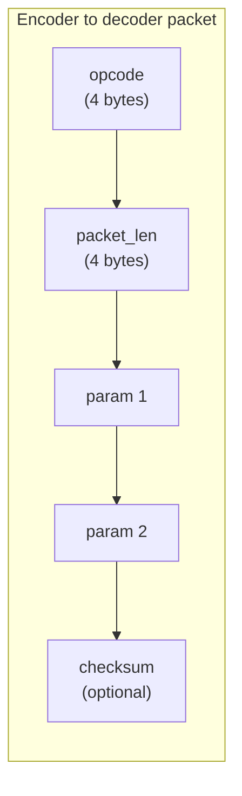
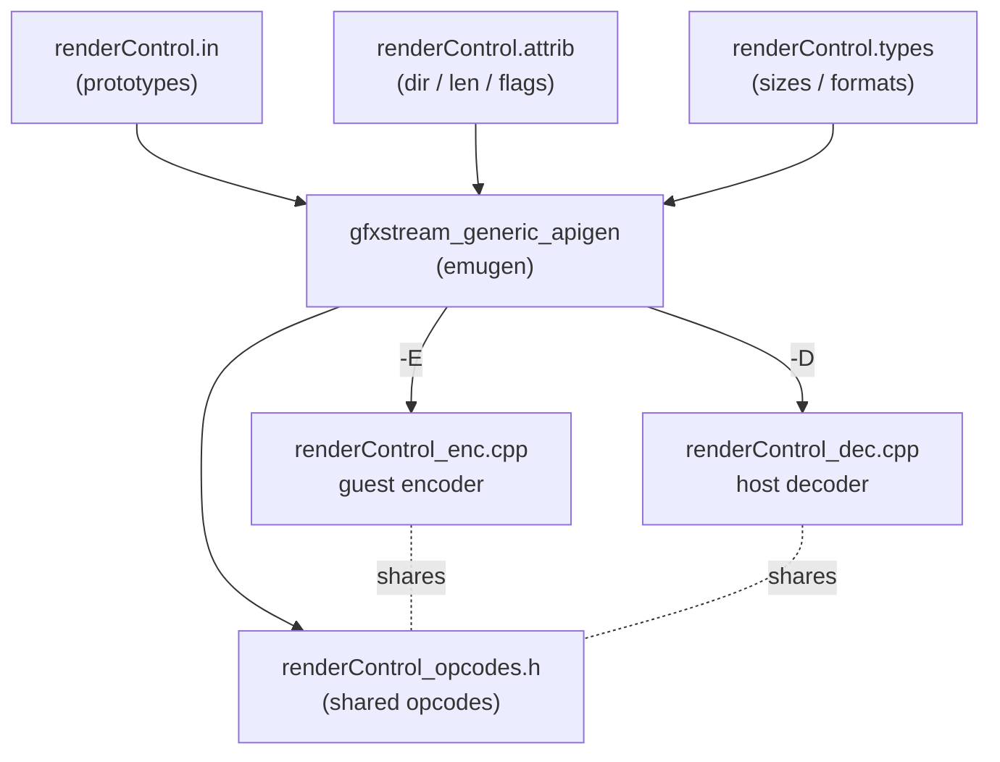
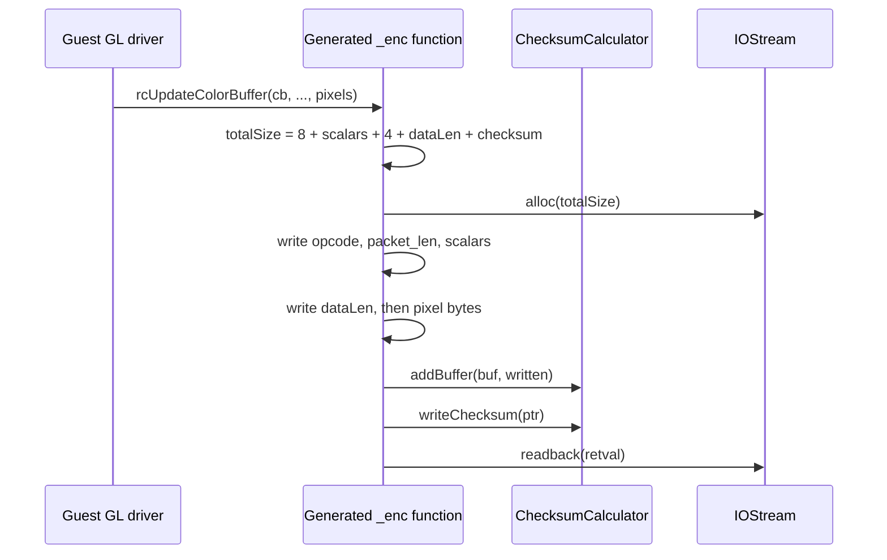
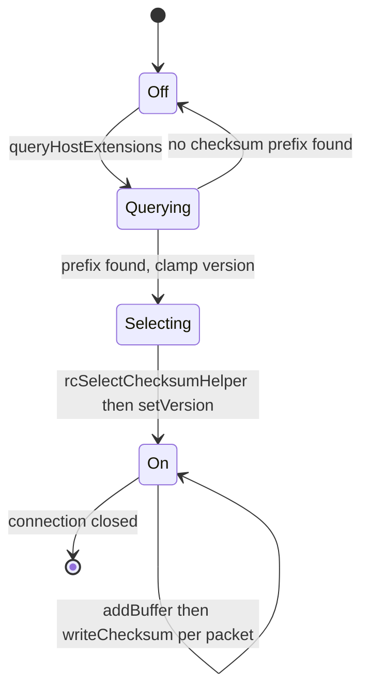
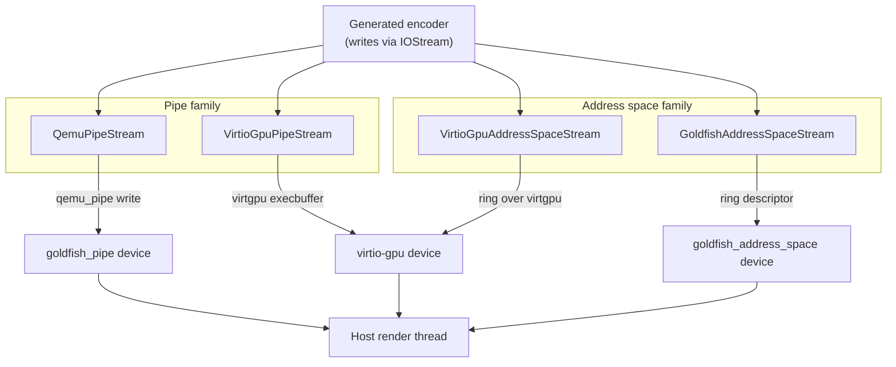
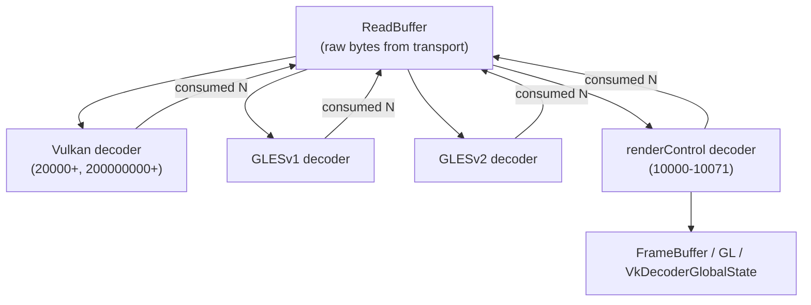

# Chapter 14: The gfxstream Protocol

The previous chapters described where graphics calls originate (the guest GPU drivers) and where they finally execute (the host renderer). This chapter is about the wire in between: the byte-level protocol that carries an EGL, GLES, render-control, or Vulkan command out of the guest, across a transport channel, and into a host decoder that replays it against a real driver. gfxstream — the name of both the protocol and the project that implements it — is fundamentally a remote procedure call system specialized for graphics. The guest holds an *encoder* that serializes each API call into a flat command buffer; the host holds a matching *decoder* that walks that buffer opcode by opcode and dispatches the call.

The remarkable thing about gfxstream is how little of it is written by hand. The GLES and render-control halves of the protocol are generated by a tool called `emugen` from three small text files per API; the Vulkan half is generated by a Python program called *cereal* directly from the Khronos Vulkan registry. This chapter follows the protocol from those specification files through the generated encoder, across the transports (the qemu_pipe and address-space families over the goldfish and virtio-gpu buses), and into the host decode loop, with attention to the packet framing, the checksum and version-negotiation machinery, and the differences between the GLES-style and Vulkan-style streams.

---

## 14.1 What the Protocol Has to Carry

A graphics API call is not a single integer. It has an opcode (which function), scalar arguments (`width`, `height`, an enum), pointer arguments that flow into the call (`in` — a pixel buffer being uploaded), pointer arguments that flow back (`out` — a buffer being read), and a return value. The protocol has to frame all of that into a self-delimiting packet that the host can parse without already knowing the function's signature, because the host decode loop reads the opcode *first* and only then knows how many bytes follow.

The canonical packet layout is documented in the `emugen` README and is dead simple:

```c
// Source: hardware/google/gfxstream/codegen/generic-apigen/README
struct Packet {
	unsigned int opcode;
	unsigned int packet_len;
	… parameter 1
	… parameter 2
};
```

The first four bytes are the opcode, the next four are the total packet length in bytes (including the 8-byte header). Everything after that is the marshaled arguments. A reply, when the function has output, is sent back with no header at all — the caller is blocked reading exactly the bytes it expects, so no framing is needed in the return direction.

Three pointer directions exist, and the README spells out exactly how each is encoded:

- `in` — data travels caller to callee; the encoder writes a 4-byte length followed by the bytes.
- `out` — data travels callee to caller; the encoder writes only the length, and the host returns the bytes in the reply packet.
- `inout` — sent with data in the request and returned in place in the reply.

This single distinction — who writes the bytes and who reads them back — is what the entire code generator exists to automate correctly for hundreds of functions.

### 14.1.1 Endianness Is the Client's Choice

The README makes one deliberate design decision explicit: the wire endianness is whatever the *guest* uses, and the host is responsible for byte-swapping if it differs. This keeps the guest encoder — the hot path that runs inside every graphics-using app — as cheap as possible, at the cost of pushing marshaling complexity onto the host. In practice the emulator runs an x86 or arm64 guest on an x86 or arm64 host with matching endianness, so the swap is a no-op, but the protocol is defined to tolerate the mismatch.

### Wire packet structure for a render-control call



## 14.2 The emugen Code Generator

The GLES1, GLES2, and render-control protocols are not maintained as C++. They are maintained as three text files per API and compiled into C++ by a generator. The generator's source lives in `hardware/google/gfxstream/codegen/generic-apigen/`; its README still calls it `emugen` even though the built binary is named `gfxstream_generic_apigen`. Its `main()` reads the three input files and emits a fan of generated sources:

```cpp
// Source: hardware/google/gfxstream/codegen/generic-apigen/main.cpp
if (encoderDir.size() != 0) {
    apiEntries.genOpcodes(encoderDir + "/" + baseName + "_opcodes.h");
    apiEntries.genContext(encoderDir + "/" + baseName + "_client_context.h", ...);
    ...
    apiEntries.genEntryPoints(encoderDir + "/" + baseName + "_entry.cpp", ...);
    apiEntries.genEncoderHeader(encoderDir + "/" + baseName + "_enc.h");
    apiEntries.genEncoderImpl(encoderDir + "/" + baseName + "_enc.cpp");
}
```

The `-E <dir>` flag emits the guest encoder; `-D <dir>` emits the host decoder; `-W <dir>` emits a dispatch wrapper. The same input files produce both sides, which is exactly why the two halves can never disagree about the wire format.

### 14.2.1 The Three Input Files

Each protocol — say render control — is described by a triple sharing a basename:

- `renderControl.in` — one line per function, listing the return type, name, and parameters.
- `renderControl.attrib` — per-function attributes: pointer directions, length expressions, and flags.
- `renderControl.types` — the size in bits, printf format, and pointer-ness of every type used.

The `.in` file is plain function prototypes. Here are a few render-control entries:

```
// Source: hardware/google/gfxstream/codegen/renderControl/renderControl.in
GL_ENTRY(EGLint, rcGetEGLVersion, EGLint *major, EGLint *minor)
GL_ENTRY(EGLint, rcQueryEGLString, EGLenum name, void *buffer, EGLint bufferSize)
GL_ENTRY(uint32_t, rcCreateContext, uint32_t config, uint32_t share, uint32_t glVersion)
GL_ENTRY(uint32_t, rcCreateColorBuffer, uint32_t width, uint32_t height, GLenum internalFormat)
```

A bare prototype is not enough to generate marshaling, because the generator cannot know whether `EGLint *major` is an input or an output, or how long the `void *buffer` is. That information lives in the `.attrib` file:

```
// Source: hardware/google/gfxstream/codegen/renderControl/renderControl.attrib
rcGetEGLVersion
    dir major out
    len major sizeof(EGLint)
    dir minor out
    len minor sizeof(EGLint)

rcQueryEGLString
    dir buffer out
    len buffer bufferSize
```

The `dir` line sets the pointer direction; the `len` line gives a C expression — evaluated in the generated code with the other parameters in scope — that computes how many bytes the pointer covers. For `rcReadColorBuffer` the length expression is an arithmetic formula over the pixel format and dimensions, lifted verbatim into the generated encoder.

### 14.2.2 Global Attributes: Base Opcode and Headers

The `.attrib` file opens with a `GLOBAL` section that sets protocol-wide knobs. Render control declares its base opcode and the headers its encoder needs:

```
// Source: hardware/google/gfxstream/codegen/renderControl/renderControl.attrib
GLOBAL
	base_opcode 10000
	encoder_headers <stdint.h> <EGL/egl.h> "glUtils.h"
```

`base_opcode 10000` is the reason render-control opcodes start at 10000; GLES1 and GLES2 occupy their own ranges, and Vulkan occupies still another (Section 14.8). Because every protocol gets a disjoint opcode range, the host can offer one command buffer to several decoders in turn and let each claim only the opcodes it owns.

### 14.2.3 Variable Flags: isLarge, nullAllowed, DMA

Beyond direction and length, a pointer can carry flags that change how it is marshaled. The README documents `nullAllowed` (NULL is a legal value for the pointer) and `isLarge` (the data is sent without an intermediate copy into the command buffer). The render-control attrib file uses these in practice:

```
// Source: hardware/google/gfxstream/codegen/renderControl/renderControl.attrib
rcUpdateColorBuffer
    dir pixels in
    len pixels (((glUtilsPixelBitSize(format, type) * width) >> 3) * height)
    var_flag pixels isLarge

rcUpdateColorBufferDMA
    dir pixels in
    len pixels pixels_size
    var_flag pixels DMA
    flag flushOnEncode
```

`isLarge` matters for performance: a large pixel upload should not be memcpy'd into the small command buffer and then flushed; instead the encoder allocates the command buffer up to the large pointer, flushes that, then writes the large payload directly. `flushOnEncode` tells the encoder to flush the stream as soon as the call is encoded, rather than batching it — used for fire-and-forget calls like `rcCloseColorBuffer` and the async compose variants.

### How emugen turns three text files into both sides of the wire



## 14.3 Inside a Generated Encoder Function

The generated encoder is the guest's view of the protocol. Each function takes the encoder context as a `void *self`, pulls the `IOStream` and `ChecksumCalculator` out of it, computes the packet size, allocates that many bytes from the stream, and writes the header and parameters. Here is the generated body for the simplest render-control call, `rcGetRendererVersion`, which takes no arguments and returns a `GLint`:

```cpp
// Source: hardware/google/gfxstream/guest/renderControl_enc/renderControl_enc.cpp
GLint rcGetRendererVersion_enc(void *self )
{
	renderControl_encoder_context_t *ctx = (renderControl_encoder_context_t *)self;
	IOStream *stream = ctx->m_stream;
	gfxstream::guest::ChecksumCalculator *checksumCalculator = ctx->m_checksumCalculator;
	bool useChecksum = checksumCalculator->getVersion() > 0;

	 unsigned char *ptr;
	 unsigned char *buf;
	 const size_t sizeWithoutChecksum = 8;
	 const size_t checksumSize = checksumCalculator->checksumByteSize();
	 const size_t totalSize = sizeWithoutChecksum + checksumSize;
	buf = stream->alloc(totalSize);
	ptr = buf;
	int tmp = OP_rcGetRendererVersion;memcpy(ptr, &tmp, 4); ptr += 4;
	memcpy(ptr, &totalSize, 4);  ptr += 4;
```

The `8` in `sizeWithoutChecksum` is the opcode plus the length field. A call with a 4-byte and a 2-byte scalar argument would be `8 + 4 + 2`; a call with output pointers adds 4 bytes per pointer for the length field. The encoder writes the opcode, writes the total length, then (for a call with a return value) reads the return value back from the stream:

```cpp
// Source: hardware/google/gfxstream/guest/renderControl_enc/renderControl_enc.cpp
	GLint retval;
	stream->readback(&retval, 4);
```

The crucial structural fact is that this code is emitted by `ApiGen::genEncoderImpl` in `api_gen.cpp`. The literal text `int tmp = OP_...;memcpy(ptr, &tmp, 4); ptr += 4;` is a `fprintf` format string in the generator:

```cpp
// Source: hardware/google/gfxstream/codegen/generic-apigen/api_gen.cpp
fprintf(fp, "\tint tmp = OP_%s;memcpy(ptr, &tmp, 4); ptr += 4;\n", e->name().c_str());
fprintf(fp, "\tmemcpy(ptr, &totalSize, 4);  ptr += 4;\n\n");
```

So the encoder you read in the generated file is a one-to-one rendering of the generator's print statements. Nobody hand-wrote `rcGetRendererVersion_enc`; the file header even says `Generated Code - DO NOT EDIT !!`.

### 14.3.1 The Encoder Context and the Dispatch Table

Each generated encoder defines a context struct that inherits a client dispatch table and adds the stream and checksum calculator:

```cpp
// Source: hardware/google/gfxstream/guest/renderControl_enc/renderControl_enc.h
struct renderControl_encoder_context_t : public renderControl_client_context_t {
	gfxstream::guest::IOStream *m_stream;
	gfxstream::guest::ChecksumCalculator *m_checksumCalculator;
	renderControl_encoder_context_t(gfxstream::guest::IOStream *stream,
	                                gfxstream::guest::ChecksumCalculator *checksumCalculator);
};
```

The base `renderControl_client_context_t` is a table of function pointers, one per API entry. At init time those pointers are set to the `_enc` functions above. When guest code calls `rcCreateColorBuffer(rcEnc, ...)`, it is calling through that table into the generated encoder, which marshals the call onto the stream.

### Encoder marshaling of a call with one input pointer



## 14.4 The Stream Abstraction: alloc, flush, readback

Every encoder talks to an `IOStream`. This is a small abstract base class whose concrete subclasses are the transports (Section 14.6). The base class implements the buffering logic shared by all transports — `alloc`, `flush`, and `readback` — in terms of pure-virtual primitives the transport must supply:

```cpp
// Source: external/mesa3d/src/gfxstream/guest/iostream/include/gfxstream/guest/IOStream.h
virtual void *allocBuffer(size_t minSize) = 0;
virtual int commitBuffer(size_t size) = 0;
virtual const unsigned char *readFully( void *buf, size_t len) = 0;
virtual const unsigned char *commitBufferAndReadFully(size_t size, void *buf, size_t len) = 0;
virtual const unsigned char *read( void *buf, size_t *inout_len) = 0;
virtual int writeFully(const void* buf, size_t len) = 0;
```

`alloc(len)` hands the encoder a pointer into a transport-owned buffer with at least `len` free bytes. If the current buffer can't fit the request, `alloc` flushes it first, then asks the transport for a fresh one:

```cpp
// Source: external/mesa3d/src/gfxstream/guest/iostream/include/gfxstream/guest/IOStream.h
virtual unsigned char *alloc(size_t len) {
    if (m_iostreamBuf && len > m_free) {
        if (flush() < 0) {
            return NULL; // we failed to flush so something is wrong
        }
    }
    if (!m_iostreamBuf || len > m_bufsize) {
        size_t allocLen = this->idealAllocSize(len);
        m_iostreamBuf = (unsigned char *)allocBuffer(allocLen);
        ...
```

This is why most encoder functions don't talk to the kernel at all: they write into a process-local buffer, and only `flush` (called explicitly, or implicitly by `readback` and the next `alloc` that overflows) commits the accumulated bytes to the transport. Batching many small commands into one transport write is the single biggest performance lever in the whole pipeline.

### 14.4.1 readback Couples the Write and the Reply

`readback` is the round-trip primitive. When an encoder needs a return value or `out` data, it calls `readback`, which flushes any pending writes and then reads the reply — in one fused transport operation when possible:

```cpp
// Source: external/mesa3d/src/gfxstream/guest/iostream/include/gfxstream/guest/IOStream.h
const unsigned char *readback(void *buf, size_t len) {
    if (m_iostreamBuf && m_free != m_bufsize) {
        size_t size = m_bufsize - m_free;
        m_iostreamBuf = NULL;
        m_free = 0;
        return commitBufferAndReadFully(size, buf, len);
    }
    return readFully(buf, len);
}
```

A call with no return value and no `out` parameters never blocks here — it just leaves its bytes in the buffer for a later flush. A call like `rcGetEGLVersion` blocks until the host has decoded the request and written the reply. The asymmetry between fire-and-forget commands and round-trip queries is the reason latency-sensitive guest code tries hard to use the async, no-reply variants (`rcMakeCurrentAsync`, `rcComposeAsync`, `rcFlushWindowColorBufferAsync`).

## 14.5 Checksums and Protocol Versioning

The protocol has an optional integrity layer: an opcode-by-opcode checksum that lets the host detect a corrupted or desynchronized stream and fail loudly rather than execute garbage. Both sides share a `ChecksumCalculator` whose version is negotiated at connection time.

### 14.5.1 The Checksum Algorithm

The host and guest carry near-identical copies of `ChecksumCalculator`. Only version 1 is defined; its "checksum" is deliberately cheap — it reverses the bits of the total accumulated packet length and appends a monotonically increasing counter:

```cpp
// Source: hardware/google/gfxstream/host/decoder_common/ChecksumCalculator.cpp
uint32_t ChecksumCalculator::computeV1Checksum() const {
    uint32_t revLen = m_v1BufferTotalLength;
    revLen = (revLen & 0xffff0000) >> 16 | (revLen & 0x0000ffff) << 16;
    revLen = (revLen & 0xff00ff00) >> 8 | (revLen & 0x00ff00ff) << 8;
    revLen = (revLen & 0xf0f0f0f0) >> 4 | (revLen & 0x0f0f0f0f) << 4;
    revLen = (revLen & 0xcccccccc) >> 2 | (revLen & 0x33333333) << 2;
    revLen = (revLen & 0xaaaaaaaa) >> 1 | (revLen & 0x55555555) << 1;
    return revLen;
}
```

The point is not cryptographic strength; it is to catch the common failure mode where the two sides disagree about how many bytes a command should be. If the encoder and decoder compute different total lengths, the bit-reversed values differ and the host aborts. The counter (`m_numWrite` and `m_numRead`) catches a dropped or duplicated packet even when lengths happen to match.

The written checksum is 8 bytes in version 1: 4 bytes of the bit-reversed length and 4 bytes of the read/write counter. When the version is 0, `checksumByteSize()` returns 0 and the `if (useChecksum)` blocks in every encoder and decoder become no-ops, so the integrity layer costs nothing when disabled.

### 14.5.2 Version Negotiation Over the Host Extension String

The version is chosen during connection setup. The host advertises the maximum checksum version it supports inside its extension string, formatted as `ANDROID_EMU_CHECKSUM_HELPER_v<N>`. The guest parses that string, clamps to its own maximum, *tells the host first* via `rcSelectChecksumHelper`, and only then sets its own calculator:

```cpp
// Source: hardware/google/gfxstream/guest/renderControl_enc/ExtendedRenderControl.cpp
void ExtendedRCEncoderContext::setChecksumHelper(ChecksumCalculator* calculator) {
    const std::string& hostExtensions = queryHostExtensions();
    uint32_t checksumVersion = 0;
    const char* checksumPrefix = ChecksumCalculator::getMaxVersionStrPrefix();
    const char* glProtocolStr = strstr(hostExtensions.c_str(), checksumPrefix);
    if (glProtocolStr) {
        uint32_t maxVersion = ChecksumCalculator::getMaxVersion();
        sscanf(glProtocolStr + strlen(checksumPrefix), "%d", &checksumVersion);
        if (maxVersion < checksumVersion) {
            checksumVersion = maxVersion;
        }
        // The ordering of the following two commands matters!
        // Must tell the host first before setting it in the guest
        this->rcSelectChecksumHelper(this, checksumVersion, 0);
        calculator->setVersion(checksumVersion);
    }
}
```

The ordering comment is load-bearing: `rcSelectChecksumHelper` is itself a protocol call that must travel over the stream *before* the checksum layer turns on, otherwise the host would try to validate a checksum on a packet the guest sent without one. On the host side, the handler is a one-liner that pushes the version into the per-thread checksum state:

```cpp
// Source: hardware/google/gfxstream/host/render_control.cpp
static void rcSelectChecksumHelper(uint32_t protocol, uint32_t reserved) {
    ChecksumCalculatorThreadInfo::setVersion(protocol);
}
```

`setVersion` rejects any value above `CHECKSUMHELPER_MAX_VERSION` (currently `1`), so a future guest that knows version 2 will negotiate down to 1 against an older host. The version is even part of snapshot state — `ChecksumCalculator::save` and `load` serialize the version and the read/write counters so a restored snapshot resumes with a consistent checksum stream.

### State machine of checksum negotiation



## 14.6 Transports: How Bytes Leave the Guest

The `IOStream` primitives have to land somewhere. gfxstream defines four concrete connection types, enumerated in the guest's `HostConnection`:

```cpp
// Source: hardware/google/gfxstream/guest/OpenglSystemCommon/HostConnection.h
enum HostConnectionType {
    HOST_CONNECTION_QEMU_PIPE = 1,
    HOST_CONNECTION_ADDRESS_SPACE = 2,
    HOST_CONNECTION_VIRTIO_GPU_PIPE = 3,
    HOST_CONNECTION_VIRTIO_GPU_ADDRESS_SPACE = 4,
};
```

These pair up two transport families — *pipe* (a stream device) and *address space graphics* (ASG, a shared-memory ring) — with two virtual buses — the goldfish/QEMU bus and virtio-gpu. The choice is driven by a guest property:

```cpp
// Source: hardware/google/gfxstream/guest/OpenglSystemCommon/HostConnection.cpp
transport = android::base::GetProperty("ro.boot.hardware.gltransport", "");
...
if (transport == "asg") {
    return HOST_CONNECTION_ADDRESS_SPACE;
}
if (transport == "pipe") {
    return HOST_CONNECTION_QEMU_PIPE;
}
if (transport == "virtio-gpu-asg" || transport == "virtio-gpu-pipe") {
    ...
    if (capset == kCapsetGfxStreamVulkan || egl == "angle") {
        return HOST_CONNECTION_VIRTIO_GPU_ADDRESS_SPACE;
    } else {
        return HOST_CONNECTION_VIRTIO_GPU_PIPE;
    }
}
```

`HostConnection::connect` then instantiates the matching `IOStream` subclass: `QemuPipeStream`, `GoldfishAddressSpaceStream`, `VirtioGpuPipeStream`, or `VirtioGpuAddressSpaceStream`. The encoders above neither know nor care which one they got.

### 14.6.1 The qemu_pipe Transport

The simplest transport opens a goldfish *pipe* — a character-device fast path between guest and emulator — and names the host service `opengles`:

```cpp
// Source: hardware/google/gfxstream/guest/OpenglSystemCommon/QemuPipeStream.cpp
m_sock = qemu_pipe_open("opengles");
```

A goldfish pipe is backed in the emulator by `external/qemu/hw/misc/goldfish_pipe.c`, a virtual device that routes the guest's reads and writes to a registered service via a `GoldfishPipeServiceOps` table. The graphics service is registered separately, so opening the `opengles` pipe connects the guest stream to a fresh render thread on the host. `QemuPipeStream::commitBuffer` writes the accumulated command bytes through the pipe handle; `readFully` reads the reply back. The pipe is a byte stream with no notion of packets — framing is entirely the opcode/length protocol's job.

A second pipe, `GLProcessPipe`, is opened to obtain a per-process unique id used to associate host resources with the right guest process:

```cpp
// Source: hardware/google/gfxstream/guest/OpenglSystemCommon/QemuPipeStream.cpp
QEMU_PIPE_HANDLE processPipe = qemu_pipe_open("GLProcessPipe");
```

### 14.6.2 The Address Space Graphics (ASG) Transport

The pipe transport copies bytes through the kernel on every flush. The address space device avoids that by giving the guest and host a *shared* region of memory and a lock-free ring buffer inside it. The device is `external/qemu/hw/pci/goldfish_address_space.c` on the QEMU side; the high-performance graphics consumer that sits on top of it is `external/qemu/android/android-emu/android/emulation/address_space_graphics.cpp`.

The ring itself is a single struct laid out so both sides can map it as-is:

```c
// Source: hardware/google/gfxstream/host/address_space/include/gfxstream/host/ring_buffer.h
struct ring_buffer {
    uint32_t host_version;
    uint32_t guest_version;
    uint32_t write_pos; // Atomically updated for the consumer
    uint32_t unused0[13]; // Separate cache line
    uint32_t read_pos; // Atomically updated for the producer
    ...
    uint8_t buf[RING_BUFFER_SIZE];
    uint32_t state;
    uint32_t config[NUM_CONFIG_FIELDS];
};
```

The padding to separate cache lines is deliberate: keeping `write_pos` and `read_pos` apart avoids false sharing between the producer (guest) and consumer (host) cores. The command bytes themselves do not flow through the tiny ring `buf`; that ring carries only small *transfer descriptors* pointing into a larger auxiliary buffer. There are three descriptor types, documented in the ASG types header:

```c
// Source: hardware/google/gfxstream/host/address_space/include/gfxstream/host/address_space_graphics_types.h
// Type 1: 8 bytes: 4 bytes offset, 4 bytes size. Relative to write buffer.
struct __attribute__((__packed__)) asg_type1_xfer {
    uint32_t offset;
    uint32_t size;
};
// Type 2: 16 bytes: 16 bytes offset into address space PCI space, 8 bytes size.
struct __attribute__((__packed__)) asg_type2_xfer {
    uint64_t physAddr;
    uint64_t size;
};
```

A normal flush of command bytes uses a type-1 descriptor: the guest has written `size` bytes at `offset` within the shared auxiliary buffer, and the host reads them straight out of that mapping with no copy. Type 2 references a guest physical address elsewhere in PCI space — used for very large or externally allocated buffers — and is resolved through a slower address lookup. Type 3 (described in the header comment but not a struct) signals that a single large transfer of known size will consume the entire auxiliary buffer in chunks.

`AddressSpaceStream::commitBuffer` decides which path to take based on size, and for the common case calls `type1Write`, which builds the descriptor and pushes it onto the to-host ring:

```cpp
// Source: external/mesa3d/src/gfxstream/guest/GoldfishAddressSpace/AddressSpaceStream.cpp
struct asg_type1_xfer xfer = {
    bufferOffset,
    (uint32_t)size,
};
...
long sentChunks = ring_buffer_write(
    m_context.to_host,
    writeBufferBytes + sent,
    sizeForRing - sent, 1);
```

The flush interval — how many bytes accumulate before the guest pushes a descriptor — and the auxiliary buffer size are configured per device through the `flush_interval` and `buffer_size` fields of the `asg_ring_config` struct shared with the host, which the header documents as coming from the `hw_gltransport_asg_writeStepSize` and `hw_gltransport_asg_writeBufferSize` hardware settings.

### Two transport families, one IOStream contract



## 14.7 RenderControl: The Session Protocol

Render control is the protocol that *manages* the graphics session rather than drawing into it. Its functions create and destroy GL contexts and surfaces, allocate color buffers (the host-side render targets), bind them to the on-screen framebuffer, post frames, and — critically — carry the feature negotiation that configures every other protocol. Its opcodes run from 10000 (`OP_rcGetRendererVersion`) to 10071 (`OP_rcSetDisplayColorTransform`).

### 14.7.1 The Extension String Is the Feature Manifest

Render control's most important query is `rcGetHostExtensionsString`. The host returns a single delimited string of capability tokens, and the guest greps it for the features it cares about. The host defines these tokens as string constants:

```cpp
// Source: hardware/google/gfxstream/host/render_control.cpp
static const char* kDma1Str = "ANDROID_EMU_dma_v1";
static const char* kGLESDynamicVersion_2 = "ANDROID_EMU_gles_max_version_2";
static const char* kHostCompositionV1 = "ANDROID_EMU_host_composition_v1";
static const char* kHostCompositionV2 = "ANDROID_EMU_host_composition_v2";
static const char* kVulkanFeatureStr = "ANDROID_EMU_vulkan";
```

The guest's `ExtendedRCEncoderContext` runs a battery of `queryAndSet*` methods, each searching the one extension string for its token and flipping a feature bit. Host composition negotiation, for instance, checks V2 before V1 because the host may advertise both:

```cpp
// Source: hardware/google/gfxstream/guest/renderControl_enc/ExtendedRenderControl.cpp
void ExtendedRCEncoderContext::queryAndSetHostCompositionImpl() {
    const std::string& hostExtensions = queryHostExtensions();
    if (hostExtensions.find(kHostCompositionV2) != std::string::npos) {
        this->setHostComposition(HOST_COMPOSITION_V2);
    } else if (hostExtensions.find(kHostCompositionV1) != std::string::npos) {
        this->setHostComposition(HOST_COMPOSITION_V1);
    } else {
        this->setHostComposition(HOST_COMPOSITION_NONE);
    }
}
```

The same pattern picks the native-sync version (`ANDROID_EMU_native_sync_v2/v3/v4`), the DMA implementation, the maximum GLES version, direct-memory support, and Vulkan support. The extension string is the single point where the two sides agree on which optional behaviors the rest of the session will use.

### 14.7.2 Color Buffers and Posting

The render-control nouns map directly onto host renderer objects. `rcCreateColorBuffer(width, height, internalFormat)` returns a handle to a host render target; `rcCreateWindowSurface`, `rcCreateContext`, and `rcMakeCurrent` set up the EGL state; `rcSetWindowColorBuffer` then `rcFlushWindowColorBuffer` move a rendered frame toward the display; and `rcFBPost(colorBuffer)` tells the host to present a buffer on screen. The async variants (`rcMakeCurrentAsync`, `rcFlushWindowColorBufferAsync`) carry the `flushOnEncode` attribute so they post their bytes immediately without waiting for a reply — important because posting a frame should not stall the guest's render loop.

### 14.7.3 The Closing Handshake

The connection's destructor performs one last round-trip on purpose:

```cpp
// Source: hardware/google/gfxstream/guest/OpenglSystemCommon/HostConnection.cpp
HostConnection::~HostConnection() {
    // round-trip to ensure that queued commands have been processed
    // before process pipe closure is detected.
    if (m_rcEnc) {
        (void)m_rcEnc->rcGetRendererVersion(m_rcEnc.get());
    }
    if (m_stream) {
        m_stream->decRef();
    }
}
```

Because `rcGetRendererVersion` blocks until the host replies, issuing it as the last call drains every previously-queued, fire-and-forget command before the stream is torn down. Without this, the guest could close the pipe while a buffered `rcCloseColorBuffer` was still in flight, leaking the host resource.

## 14.8 The Vulkan Stream and cereal

Vulkan does not go through `emugen`. Its surface is far too large and structurally complex — deeply nested structs, `pNext` chains, arrays of arrays — to describe in the flat `.in`/`.attrib` format. Instead, gfxstream generates the Vulkan encoder and decoder from the Khronos Vulkan registry (extended with a gfxstream-specific `vk_gfxstream.xml`) using a Python generator called *cereal*, living in `external/mesa3d/src/gfxstream/codegen/scripts/`.

### 14.8.1 A Different Wire Header

cereal frames each command with the same opcode-then-length header, but adds an optional sequence number. The generator emits the packet header in `encoder.py`:

```python
# Source: external/mesa3d/src/gfxstream/codegen/scripts/cereal/encoder.py
cgen.stmt("memcpy(streamPtr, &opcode_%s, sizeof(uint32_t)); streamPtr += sizeof(uint32_t)" % api.name)
cgen.stmt("memcpy(streamPtr, &packetSize_%s, sizeof(uint32_t)); streamPtr += sizeof(uint32_t)" % api.name)

if doSeqno:
    cgen.line("if (queueSubmitWithCommandsEnabled) { memcpy(streamPtr, &seqno, sizeof(uint32_t)); streamPtr += sizeof(uint32_t); }")
```

The packet size is computed as `4 + 4 + (optional 4 for seqno) + count`, where `count` is the marshaled size of the parameters. The sequence number, present only when the queue-submit-with-commands feature is enabled, lets the host serialize commands across threads in submission order rather than execution-thread order.

### 14.8.2 Disjoint Opcode Ranges

Vulkan opcodes are placed deliberately far away from the GLES and render-control ranges so the multiplexed host decode loop can tell them apart by range alone:

```python
# Source: external/mesa3d/src/gfxstream/codegen/scripts/cereal/marshaling.py
# Begin Vulkan API opcodes from something high
# that is not going to interfere with renderControl opcodes
self.beginOpcodeOld = 20000
self.endOpcodeOld = 30000

self.beginOpcode = 200000000
self.endOpcode = 300000000
```

There are two ranges because the opcode space was renumbered once; the host decoder accepts both. The decoder's generated dispatch checks the range to decide whether to read the sequence number off the stream:

```python
# Source: external/mesa3d/src/gfxstream/codegen/scripts/cereal/decoder.py
if (m_queueSubmitWithCommandsEnabled && ((opcode >= OP_vkFirst && opcode < OP_vkLast) || (opcode >= OP_vkFirst_old && opcode < OP_vkLast_old))) {
    uint32_t seqno;
    memcpy(&seqno, *readStreamPtrPtr, sizeof(uint32_t)); *readStreamPtrPtr += sizeof(uint32_t);
    ...
```

The decoder then spin-waits until the shared sequence counter reaches `seqno - 1`, enforcing global ordering before it executes the command. This is how multiple guest threads can encode onto separate streams yet have their Vulkan work replayed in the exact order the guest intended.

### 14.8.3 The gfxstream Vulkan Extension

The transport-specific Vulkan commands live in a private extension, `VK_GOOGLE_gfxstream`, defined in the gfxstream Vulkan XML:

```xml
<!-- Source: external/mesa3d/src/gfxstream/codegen/xml/vk_gfxstream.xml -->
<extension name="VK_GOOGLE_gfxstream" number="386" author="GOOGLE" supported="vulkan" type="instance">
    ...
    <command name="vkMapMemoryIntoAddressSpaceGOOGLE"/>
    <command name="vkQueueFlushCommandsGOOGLE"/>
</extension>
```

`vkMapMemoryIntoAddressSpaceGOOGLE` maps host-visible Vulkan memory into the guest's address space so the guest can write to GPU memory directly, and `vkQueueFlushCommandsGOOGLE` is the bulk path that carries a recorded command buffer to the host in one shot. These commands are generated by the same cereal pipeline as the standard Vulkan API; they just happen to be the ones that wire Vulkan into gfxstream's shared-memory model.

## 14.9 The Host Decode Loop

On the host, every guest connection gets a `RenderThread`. After reading and discarding a now-unused 32-bit flags word, the thread loops: it reads bytes from the transport into a `ReadBuffer`, then offers that buffer to each protocol decoder in turn. The decoders are initialized once per thread:

```cpp
// Source: hardware/google/gfxstream/host/render_thread.cpp
if (FrameBuffer::getFB()->hasEmulationGl()) {
    tInfo->initGl();
}
initRenderControlContext(&(tInfo->m_rcDec));
```

The core of the loop hands the same buffer to the Vulkan decoder, then GLESv1, then GLESv2, then render control, consuming whatever each one recognizes:

```cpp
// Source: hardware/google/gfxstream/host/render_thread.cpp
last = tInfo->m_vkInfo->m_vkDec.decode(readBuf.buf(), readBuf.validData(), ioStream, ...);
...
last = tInfo->m_glInfo->m_gl2Dec.decode(readBuf.buf(), readBuf.validData(), ioStream, &checksumCalc);
...
last = tInfo->m_rcDec.decode(readBuf.buf(), readBuf.validData(), ioStream, &checksumCalc);
if (last > 0) {
    readBuf.consume(last);
    progress = true;
}
```

Each `decode` returns the number of bytes it consumed. Because the opcode ranges are disjoint (render control 10000+, Vulkan 20000+ and 200000000+, GLES in their own ranges), a decoder simply ignores opcodes outside its range and returns 0, and the next decoder gets a chance. The loop repeats while any decoder makes progress, so a buffer holding a mix of GLES and Vulkan commands is fully drained in interleaved passes.

### 14.9.1 A Generated Decoder Case

The decoder is the mirror image of the encoder, generated from the same spec by the same tool. Its `decode` method reads the opcode and length, validates the checksum if enabled, unpacks the arguments, calls the real implementation, packs the reply, and flushes:

```cpp
// Source: hardware/google/gfxstream/host/renderControl_dec/renderControl_dec.cpp
while (end - ptr >= 8) {
    uint32_t opcode;
    std::memcpy(&opcode, ptr, sizeof(uint32_t));
    uint32_t packetLen;
    std::memcpy(&packetLen, ptr + 4, sizeof(uint32_t));
    if (end - ptr < packetLen) return ptr - (unsigned char*)buf;
    ...
    switch(opcode) {
    case OP_rcGetRendererVersion: {
        if (useChecksum) {
            ChecksumCalculatorThreadInfo::validOrDie(checksumCalc, ptr, 8, ptr + 8, checksumSize, ...);
        }
        ...
        GLint function_call_retval = this->rcGetRendererVersion();
        std::memcpy(&tmpBuf[0], &function_call_retval, sizeof(GLint));
        ...
        stream->flush();
```

The check `if (end - ptr < packetLen) return ...` is what makes the protocol robust to partial reads: if the buffer holds only part of a packet, the decoder returns the bytes it *did* consume, the render thread keeps the remainder, reads more from the transport, and tries again. The packet's self-described length is the only thing that makes this safe.

### Host render thread multiplexing four decoders over one buffer



## 14.10 Why the Protocol Is Generated, Not Written

It is worth stepping back to see what the codegen buys. The render-control protocol alone has 72 entry points; GLES2 has hundreds; Vulkan has well over a thousand commands and structs. For each one, the encoder and decoder must agree on byte-exact marshaling, including length expressions, pointer directions, checksum placement, and opcode assignment. Maintaining two halves of that by hand would guarantee drift.

By deriving both halves from one source — three text files for `emugen`, the Vulkan XML for cereal — the project makes wire incompatibility a build-time impossibility rather than a runtime mystery. When a new render-control call is needed, a developer adds one line to `renderControl.in`, a stanza to `renderControl.attrib`, and reruns `generate-apigen-sources.sh`; the encoder, decoder, opcode header, and dispatch tables all regenerate together. The generator script even copies the spec files under a `gl`/`gles` prefix so the encoder uses the `GL_` entry-point names while the decoder uses the `GLES` names from the identical definitions:

```bash
# Source: hardware/google/gfxstream/scripts/generate-apigen-sources.sh
./bazel-bin/codegen/generic-apigen/gfxstream_generic_apigen -i ./codegen/gles1 -D ./host/gl/gles1_dec -B gles1
./bazel-bin/codegen/generic-apigen/gfxstream_generic_apigen -i ./codegen/gles1 -E ./guest/GLESv1_enc -B gl
```

This is the central discipline of the gfxstream protocol: the wire format has exactly one source of truth, and everything that touches the wire is mechanically derived from it.

## 14.11 Try It

The encoders and decoders are checked into the tree as generated files, so you can inspect the protocol directly without building anything. From the superproject root:

- Read the render-control opcode assignments and confirm the base is 10000:

```bash
sed -n '20,30p' hardware/google/gfxstream/guest/renderControl_enc/renderControl_opcodes.h
```

- Compare a generated encoder function with the matching decoder case to see the two halves of one wire format:

```bash
grep -n "rcGetEGLVersion_enc" hardware/google/gfxstream/guest/renderControl_enc/renderControl_enc.cpp
grep -n "OP_rcGetEGLVersion:" hardware/google/gfxstream/host/renderControl_dec/renderControl_dec.cpp
```

- See exactly which `fprintf` in the generator emits the opcode write, proving the encoder is machine-generated:

```bash
grep -n "memcpy(ptr, &tmp, 4)" hardware/google/gfxstream/codegen/generic-apigen/api_gen.cpp
```

- Inspect the checksum version constant and the bit-reversal algorithm:

```bash
grep -n "CHECKSUMHELPER_MAX_VERSION\|computeV1Checksum" hardware/google/gfxstream/host/decoder_common/ChecksumCalculator.cpp
```

- List the host extension tokens that drive feature negotiation:

```bash
grep -n "ANDROID_EMU_" hardware/google/gfxstream/host/render_control.cpp
```

- Find the Vulkan opcode ranges the host uses to separate Vulkan packets from GLES packets:

```bash
grep -n "beginOpcode" external/mesa3d/src/gfxstream/codegen/scripts/cereal/marshaling.py
```

- On a running emulator, force a transport by setting the guest property before graphics starts (boot with `-prop ro.boot.hardware.gltransport=pipe` to force the qemu_pipe path), then check the kernel log for which transport the guest selected.

## Summary

- gfxstream is an RPC system for graphics: a guest encoder serializes each call into a self-delimiting packet, and a host decoder replays it against a real driver. The packet header is a 4-byte opcode plus a 4-byte total length, defined identically for render control, GLES, and Vulkan.
- The GLES and render-control protocols are generated by `emugen` (`gfxstream_generic_apigen`) from three text files per API: `.in` prototypes, `.attrib` directions/lengths/flags, and `.types` sizes. The same tool emits both the guest encoder (`-E`) and the host decoder (`-D`), so the two sides can never disagree.
- Pointer arguments are tagged `in`, `out`, or `inout`, and flagged `isLarge`, `nullAllowed`, `DMA`, or `flushOnEncode`; these attributes are lifted verbatim into the generated marshaling and control whether a call copies, blocks, or flushes immediately.
- The `IOStream` base class implements `alloc`/`flush`/`readback` buffering once, in terms of transport-specific `allocBuffer`/`commitBuffer`/`readFully` primitives, so encoders batch many small commands into one transport write and only block on calls that need a reply.
- An optional checksum layer (version 1: bit-reversed packet length plus a read/write counter) detects stream desync; the version is negotiated through the host extension string, with the guest required to call `rcSelectChecksumHelper` before enabling its own calculator.
- Four transports back the same `IOStream` contract: qemu_pipe and virtio-gpu pipe (byte streams through the kernel) and goldfish/virtio-gpu address-space graphics (a lock-free shared-memory ring carrying type-1/2/3 transfer descriptors into a zero-copy auxiliary buffer).
- Render control is the session protocol: it creates contexts, surfaces, and color buffers, posts frames, and carries the `ANDROID_EMU_*` extension string that negotiates every other feature. Its closing `rcGetRendererVersion` round-trip drains queued commands before teardown.
- Vulkan is generated separately by the cereal Python codegen from the Vulkan registry plus `vk_gfxstream.xml`; it uses the same opcode/length header with an optional sequence number, lives in disjoint opcode ranges (20000+ and 200000000+), and is multiplexed with the other decoders in one host render-thread loop that dispatches by opcode range and consumes packets by their self-described length.

### Key Source Files

| File | Purpose |
|------|---------|
| hardware/google/gfxstream/codegen/generic-apigen/main.cpp | emugen entry point; emits encoder, decoder, opcode, and context files |
| hardware/google/gfxstream/codegen/generic-apigen/api_gen.cpp | Generator logic that prints the encoder/decoder C++ |
| hardware/google/gfxstream/codegen/generic-apigen/README | Authoritative wire-format and `.attrib` format spec |
| hardware/google/gfxstream/codegen/renderControl/renderControl.in | Render-control function prototypes |
| hardware/google/gfxstream/codegen/renderControl/renderControl.attrib | Render-control directions, lengths, base opcode |
| hardware/google/gfxstream/guest/renderControl_enc/renderControl_enc.cpp | Generated guest render-control encoder |
| hardware/google/gfxstream/host/renderControl_dec/renderControl_dec.cpp | Generated host render-control decoder |
| external/mesa3d/src/gfxstream/guest/iostream/include/gfxstream/guest/IOStream.h | Stream buffering base class (alloc/flush/readback) |
| hardware/google/gfxstream/host/decoder_common/ChecksumCalculator.cpp | Checksum algorithm and version negotiation |
| hardware/google/gfxstream/guest/renderControl_enc/ExtendedRenderControl.cpp | Guest-side feature/checksum negotiation |
| hardware/google/gfxstream/guest/OpenglSystemCommon/HostConnection.cpp | Transport selection and connection setup |
| hardware/google/gfxstream/host/address_space/include/gfxstream/host/ring_buffer.h | Shared single-producer/consumer ring layout |
| hardware/google/gfxstream/host/address_space/include/gfxstream/host/address_space_graphics_types.h | ASG transfer-descriptor types and ring config |
| hardware/google/gfxstream/host/render_thread.cpp | Host decode loop multiplexing four decoders |
| external/mesa3d/src/gfxstream/codegen/scripts/cereal/encoder.py | Vulkan encoder generator (packet header, seqno) |
| external/mesa3d/src/gfxstream/codegen/scripts/cereal/marshaling.py | Vulkan opcode ranges |
| external/qemu/hw/pci/goldfish_address_space.c | QEMU address-space PCI device |
