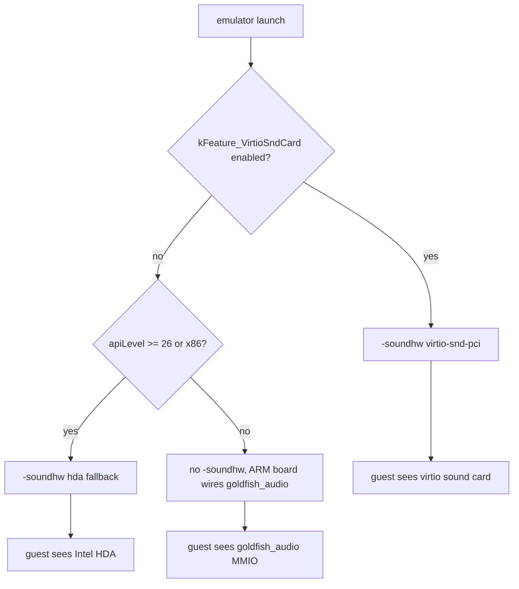
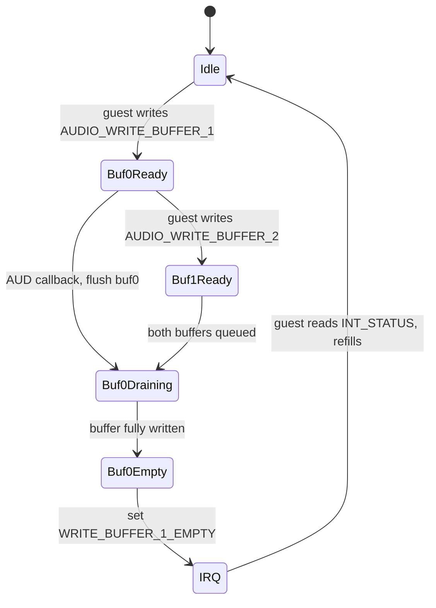
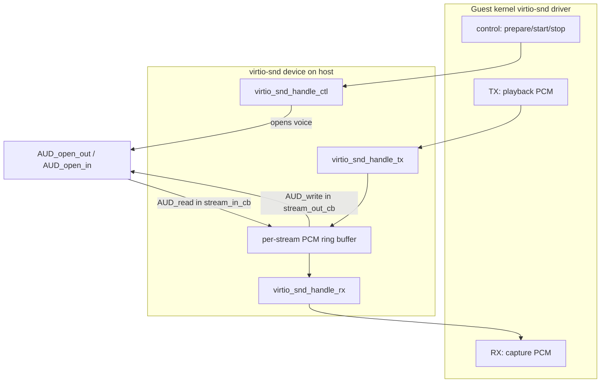
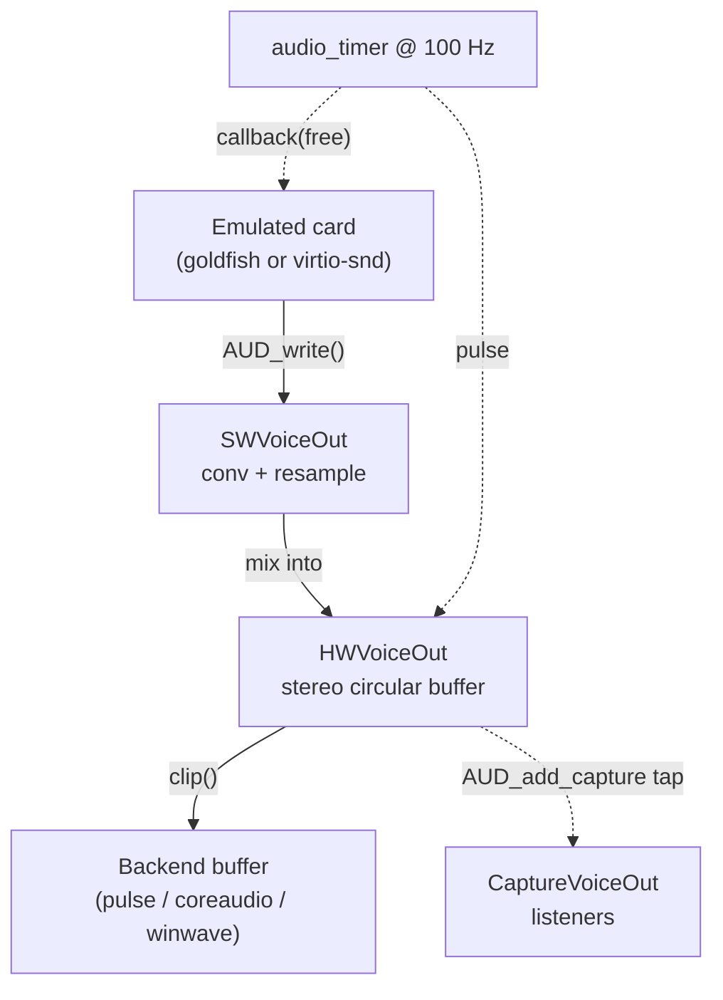
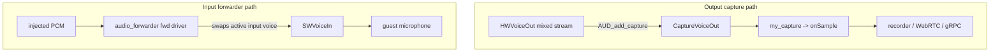
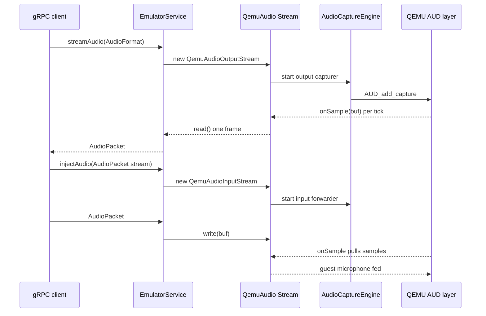

# Chapter 15: Audio

The guest Android system thinks it is talking to a real sound card. It writes PCM samples into a hardware buffer, the "card" raises an interrupt when that buffer drains, and the guest refills it. None of that hardware exists. On the emulator host there is a chain that starts at an emulated MMIO or virtio device, flows through QEMU's mixing engine, and ends at a platform backend that hands bytes to PulseAudio, CoreAudio, WinWave, or — when nobody is listening — a clock-driven null sink. The same engine fans the playback stream out to capturers that feed screen recording, WebRTC streaming, and the gRPC `streamAudio` endpoint, and it accepts injected samples from `injectAudio` so a test can play a WAV file straight into the guest microphone.

This chapter follows that chain in both directions. We start with the two audio devices the guest can see — the legacy `goldfish_audio` MMIO card and the modern `virtio-snd` PCI card — then descend into QEMU's `AUD_*` API and the `SWVoice`/`HWVoice` mixing model, the host backend drivers and how one gets picked, and finally the android-emu control plane: the `AudioOutputEngine`/`AudioCaptureEngine` abstraction, the capture-tap and microphone-forwarder glue, and the gRPC streaming surface.

---

## 15.1 Two Guest-Visible Sound Cards

The emulator can expose one of two sound devices to the guest, chosen at launch time. Which one appears depends on a feature flag and the guest API level, decided in `buildSoundhwParam()`.

```cpp
// Source: external/qemu/android-qemu2-glue/main.cpp
static std::string buildSoundhwParam(const int apiLevel,
                                     const AndroidHwConfig* hw) {
    std::string param;
    std::string props;

    if (feature_is_enabled(kFeature_VirtioSndCard)) {
        param = "virtio-snd-pci";
    } else if (apiLevel >= 26 || targetIsX86) {
        /* for those system images that don't have the virtio-snd driver yet. */
        param = "hda";
    } else {
        return "";
    }
```

The result is passed to QEMU as a `-soundhw` argument (`args.add2("-soundhw", soundhw.c_str())` in the same file), and `hw->hw_audioInput` / `hw->hw_audioOutput` are folded in as `input=off` / `output=off` properties when the AVD disables a direction. The `VirtioSndCard` flag is feature number 89 in the feature-control table (`external/qemu/android/emu/feature/test/android/featurecontrol/FeatureControl_unittest.cpp`), and it is the one knob that switches the whole guest contract from the goldfish register protocol to a virtio queue protocol.

On ARM `ranchu`/`virt` boards the goldfish card is wired directly into the machine's device tree rather than through `-soundhw`. The board reserves an MMIO window and an IRQ for it and instantiates the device with the right `compatible` strings.

```c
// Source: external/qemu/hw/arm/ranchu.c
create_simple_device(vbi, pic, RANCHU_GOLDFISH_AUDIO, "goldfish_audio",
                     "google,goldfish-audio\0"
                     "generic,goldfish-audio", 2, 0, 0);
```

### 15.1.1 The selection summary

The two cards are not interchangeable from the guest's point of view: one is a custom MMIO register block, the other a standards-track virtio device. The emulator commits to one at boot.

How the emulator decides which audio device to expose:



## 15.2 The Goldfish Audio Device

`goldfish_audio` is the original Android Emulator sound card: a single `SysBusDevice` exposing a 0x100-byte MMIO register window and one IRQ line. It is defined entirely in one file, `external/qemu/hw/audio/goldfish_audio.c`. The register map is a small enum at the top of that file.

The device exposes these register groups:

- output buffer registers: `AUDIO_SET_WRITE_BUFFER_1/2` (plus `_HIGH` halves for 64-bit guest addresses) point the device at guest physical buffers, and `AUDIO_WRITE_BUFFER_1/2` tell it how many bytes are ready
- input buffer registers: `AUDIO_READ_SUPPORTED`, `AUDIO_SET_READ_BUFFER`, `AUDIO_START_READ`, and `AUDIO_READ_BUFFER_AVAILABLE` handle microphone capture
- interrupt registers: `AUDIO_INT_STATUS` and `AUDIO_INT_ENABLE` carry the buffer-empty and buffer-full flags that drive the IRQ

The output path uses two ping-pong buffers so the guest can keep one full while the device drains the other. Each buffer is a `goldfish_audio_buff` that caches the guest physical address, a length, and a host-side staging `data` pointer. When the guest writes `AUDIO_WRITE_BUFFER_1`, the device copies the guest buffer into its staging area and marks the output voice active.

```c
// Source: external/qemu/hw/audio/goldfish_audio.c
static void goldfish_audio_write_buffer(struct goldfish_audio_state *s,
        unsigned int buf, uint32_t length)
{
    if (s->current_buffer == -1)
        s->current_buffer = buf;
    goldfish_audio_buff_set_length(&s->out_buffs[buf], length);
    goldfish_audio_buff_read(&s->out_buffs[buf]);
    AUD_set_active_out(s->voice, 1);
}
```

`goldfish_audio_buff_read()` is a `cpu_physical_memory_read()` of the guest buffer into the host staging area — this is the moment guest sample bytes cross into the host. Actual playback happens later, in the timer-driven callback (§15.4).

### 15.2.1 Fixed output format, 8 kHz mono input

The device opens its host voices with hard-coded formats in `goldfish_audio_realize()`. Output is 44100 Hz, two channels, signed 16-bit; the microphone input is 8000 Hz mono.

```c
// Source: external/qemu/hw/audio/goldfish_audio.c
as.freq = 44100;
as.nchannels = 2;
as.fmt = AUD_FMT_S16;
as.endianness = AUDIO_HOST_ENDIANNESS;
s->voice = AUD_open_out (
    &s->card, NULL, "goldfish_audio", s,
    goldfish_audio_callback, &as);
```

The MMIO window is mapped before the voices open, by design: `goldfish_audio_realize()` carries a comment that the MMIO must be set up regardless of whether voice initialization succeeds, otherwise `sysbus_mmio_map_common()` would assert. So even on a host with no working audio backend, the register block still exists and the guest driver still probes cleanly.

### 15.2.2 The output drain callback

`goldfish_audio_callback()` is the function QEMU invokes when the host backend has room for more samples. Its `free` argument is the number of bytes the backend can accept. The callback flushes the current buffer first, then the other, and raises a buffer-empty interrupt for whichever drained.

```c
// Source: external/qemu/hw/audio/goldfish_audio.c
static bool goldfish_audio_flush(struct goldfish_audio_state *s, int buf,
        int *free, uint32_t *new_status)
{
    struct goldfish_audio_buff *b = &s->out_buffs[buf];
    int to_write = audio_MIN(b->length, *free);
    if (!to_write)
        return false;
    int written = AUD_write(s->voice, b->data + b->offset, to_write);
    ...
    if (!goldfish_audio_buff_length(b))
        *new_status |= buf ? AUDIO_INT_WRITE_BUFFER_2_EMPTY :
                AUDIO_INT_WRITE_BUFFER_1_EMPTY;
    return true;
}
```

When both buffers are empty the callback sets `current_buffer = -1` and calls `AUD_set_active_out(s->voice, 0)` to pause the voice; the guest will reactivate it on the next write. The buffer-empty bits OR'd into `int_status` get gated by `int_enable` and pushed onto the IRQ line with `qemu_set_irq()`. The guest reads `AUDIO_INT_STATUS` (which lowers the IRQ) to learn which buffer it may now refill.

Goldfish output buffer life cycle as the device ping-pongs between two guest buffers:



## 15.3 The virtio-snd Device

`virtio-snd` is the modern path, implemented in `external/qemu/hw/audio/virtio-snd.c`. Instead of a register block it is a virtio device with four virtqueues, defined as constants at the top of the file.

```c
// Source: external/qemu/hw/audio/virtio-snd.c
#define VIRTIO_SND_QUEUE_CTL    0
#define VIRTIO_SND_QUEUE_EVENT  1
#define VIRTIO_SND_QUEUE_TX     2
#define VIRTIO_SND_QUEUE_RX     3
```

The control queue carries the configuration protocol — query info, set PCM params, prepare/start/stop/release a stream. The event queue is allocated but its handler is annotated `// not implemented`. The TX queue carries playback PCM frames from guest to host; the RX queue carries capture frames from host to guest. The queues are created in `virtio_snd_device_realize()`, which also registers the QEMU sound card and constructs each PCM stream.

```c
// Source: external/qemu/hw/audio/virtio-snd.c
snd->ctl_vq = virtio_add_queue(vdev, ..., virtio_snd_handle_ctl);
snd->event_vq = virtio_add_queue(vdev, 2, virtio_snd_handle_event);  // not implemented
snd->tx_vq = virtio_add_queue(vdev, ..., virtio_snd_handle_tx);
snd->rx_vq = virtio_add_queue(vdev, ..., virtio_snd_handle_rx);
```

The device advertises its topology through the virtio config space: a count of jacks, PCM streams, and channel maps. There are two jacks (a microphone jack and a speaker jack, defined in `jack_infos[]`) and a fixed set of PCM streams. The supported format is signed 16-bit (`VIRTIO_SND_PCM_FORMAT S16`) at any of seven sample rates from 8000 Hz to 48000 Hz, packed into a 16-bit descriptor by `VIRTIO_SND_PACK_FORMAT16`.

### 15.3.1 Opening a host voice on demand

Unlike goldfish, which opens its voices at realize time with a fixed format, virtio-snd opens a host voice only when the guest prepares a stream, and it uses the format the guest actually requested. `virtio_snd_voice_open()` unpacks the guest's 16-bit format word into a QEMU `audsettings` and tries to open the voice, falling back to fewer channels if the host rejects the request.

```c
// Source: external/qemu/hw/audio/virtio-snd.c
struct audsettings as = virtio_snd_unpack_format(kernel_format16);
if (is_output_stream(stream)) {
    if (stream->snd->enable_output_prop) {
        for (as.nchannels = MIN(as.nchannels, VIRTIO_SND_PCM_AUD_NUM_MAX_CHANNELS);
             as.nchannels > 0; --as.nchannels) {
            stream->voice.out = AUD_open_out(&stream->snd->card, NULL,
                                             g_stream_name[stream->id],
                                             stream, &stream_out_cb, &as);
            if (stream->voice.out) {
                AUD_set_active_out(stream->voice.out, 1);
                ...
```

### 15.3.2 PCM frames, ring buffers, and silence

When the host backend asks for output, `stream_out_cb_locked()` drains the stream's host-PCM ring buffer into the voice with `AUD_write()`. If the guest has fallen behind and the ring is empty, the device does not stall the backend — it synthesizes silence so the host clock keeps advancing.

```c
// Source: external/qemu/hw/audio/virtio-snd.c
if (min_write_sz > 0) {
    int16_t scratch[AUD_SCRATCH_SIZE];
    // Insert `min_write_sz` bytes of silence.
    fill_silence(scratch, MIN(sizeof(scratch), min_write_sz));
    ...
}
```

`fill_silence()` is deliberately not zero-fill; it writes a small `+2, -2` meander so the gap is visible in a captured waveform during debugging. On the capture side `stream_in_cb_locked()` does the reverse, reading from the voice with `AUD_read()` into the ring buffer that the RX queue drains toward the guest.

There is one platform quirk worth knowing: on Linux the device opens the microphone voice eagerly at realize time as a workaround (`linux_mic_workaround`), because otherwise opening it lazily when the guest asks does not produce audio. On every other platform the input voice opens on demand. The comment cites bug b/292115117 and expects the workaround to disappear after a QEMU upgrade.

virtio-snd data flow across the four virtqueues:



## 15.4 The AUD_* API and the Voice Model

Both devices speak the same downstream API: the `AUD_*` functions declared in `external/qemu/audio/audio.h`. This is the seam between "emulated sound card" and "host audio." The model is documented at length in `external/qemu/android/docs/AUDIO.TXT`, and the vocabulary it establishes is worth internalizing.

The four object types in the voice model:

- `QEMUSoundCard` models one emulated sound card; a device registers it with `AUD_register_card()`
- `SWVoiceOut` / `SWVoiceIn` model an emulated output or input on that card — created with `AUD_open_out()` / `AUD_open_in()`, each tied to a device callback
- `HWVoiceOut` / `HWVoiceIn` model the host backend's actual output or input
- `CaptureVoiceOut` is a tap that copies a `HWVoiceOut`'s stereo stream to listeners, created with `AUD_add_capture()`

Each `SWVoiceOut` is bound to one `HWVoiceOut`, but several software voices can share a hardware voice; the engine mixes them. Per `AUDIO.TXT`, the `HWVoiceOut` owns a fixed-size circular buffer of stereo samples and a `clip()` function that converts that buffer into the backend's native format. Each `SWVoiceOut` owns a `conv()` function and a `ratio` value (target-over-source frequency, scaled by `1 << 32`) so it can resample as it mixes into the shared stereo buffer.

### 15.4.1 The audio timer as the system clock

The whole subsystem is pulsed by one periodic timer. `audio_init()` creates it on the virtual clock:

```c
// Source: external/qemu/audio/audio.c
s->ts = timer_new_ns(QEMU_CLOCK_VIRTUAL, audio_timer, s);
```

The default period is 100 Hz (`conf.period.hertz = 100`). On every tick, for each `HWVoiceOut`, the engine computes how many samples are "live" (the minimum across active software voices of `total_hw_samples_mixed`), calls the hardware voice's `run_out` to push those to the backend, then calls each software voice's device callback with a `free` count so the device refills the stereo buffer. `AUDIO.TXT` reduces it to pseudo-code:

```c
// Source: external/qemu/android/docs/AUDIO.TXT
every sound timer ticks:
  for hw in list_HWVoiceOut:
     live = MIN([sw.total_hw_samples_mixed for sw in hw.list_SWVoiceOut ])
     if live > 0:
        played = hw.run_out(live)
        ...
    for sw in hw.list_SWVoiceOut:
        free = hw.samples - sw.total_hw_samples_mixed
        if free > 0:
            sw.callback(sw, free)
```

This is why `goldfish_audio_callback` and `stream_out_cb` both receive a `free`/`avail` byte count and respond with `AUD_write()`: they are the `sw.callback` in this loop. Recording is the mirror image — the `HWVoiceIn` acquires samples into its buffer and the software input voices consume them via `AUD_read()`.

The mixing model from emulated card down to a host backend:



## 15.5 Host Backends and Driver Selection

The bottom of the stack is a set of platform backend drivers, each a `struct audio_driver` registered into a global list. The drivers present in this tree, found by their `.name` fields, cover every host platform plus several special-purpose sinks.

The registered backend drivers and their purposes:

- `alsa`, `oss`, `pa` (PulseAudio): Linux backends
- `coreaudio`: macOS backend
- `dsound` and a Windows native `winaudio`: Windows backends
- `sdl`: a portable SDL backend
- `spice`: routes audio to a SPICE client
- `wav`: writes playback to a `.wav` file instead of a speaker
- `none`: the null sink — timer-driven, produces and consumes nothing
- `fwd`: the microphone-forwarder pseudo-driver (§15.6)

Selection is priority-ordered. `audio.c` builds a priority list whose first entry wins by default, then `audio_init()` honors an explicit `QEMU_AUDIO_DRV` request before falling back through the list and finally to `none`.

```c
// Source: external/qemu/audio/audio.c
if (drvname) {
    driver = audio_driver_lookup(drvname);
    if (driver) {
        done = !audio_driver_init(s, driver);
    } ...
}
if (!done) {
    for (i = 0; !done && i < ARRAY_SIZE(audio_prio_list); i++) {
        driver = audio_driver_lookup(audio_prio_list[i]);
        if (driver && driver->can_be_default) {
            done = !audio_driver_init(s, driver);
        }
    }
}
if (!done) {
    driver = audio_driver_lookup("none");
    ...
    dolog("warning: Using timer based audio emulation\n");
}
```

### 15.5.1 set_audio_drv: how the emulator overrides QEMU_AUDIO_DRV

QEMU normally reads `QEMU_AUDIO_DRV` from the environment. The Android fork adds an in-process override so the emulator can choose the driver programmatically. `set_audio_drv()` stashes a name, and `audio_get_conf_str()` returns it whenever the key is `QEMU_AUDIO_DRV`.

```c
// Source: external/qemu/audio/audio.c
void set_audio_drv(const char* name) {
    s_audio_drv_name = name;
}
static const char *audio_get_conf_str (const char *key, ...) {
    if (s_audio_drv_name && !strcmp(key, "QEMU_AUDIO_DRV")) {
        val = s_audio_drv_name;
    } else {
        val = getenv(key);
    }
    ...
```

`vl.c` calls `set_audio_drv()` during startup, defaulting to `"none"` in headless or test situations and otherwise propagating `QEMU_AUDIO_DRV`. The `none` driver is not a failure mode — it is a fully supported sink. With no host backend the audio timer still runs, the guest still sees buffers drain on schedule, and the capture taps still see the mixed stream. That is exactly what a headless CI box or a WebRTC-only deployment wants: correct timing and a tappable stream without ever opening a speaker.

## 15.6 The android-emu Audio Control Plane

QEMU's `AUD_*` API is C and lives deep in the device layer. The android-emu codebase needs to play and capture audio from C++ subsystems — screen recording, WebRTC, gRPC — without each of them reaching into QEMU internals. The abstraction is a pair of engine interfaces in `external/qemu/android/android-emu/android/emulation/`.

The control-plane interfaces and their backers:

- `AudioOutputEngine` (`AudioOutputEngine.h`): an interface to open a host output, `write()` PCM into it, and `close()`. A single instance is registered with `AudioOutputEngine::set()` and fetched with `AudioOutputEngine::get()`
- `AudioCapturer` (`AudioCapture.h`): a subclass overrides `onSample(buf, size)` to receive the mixed audio byte stream
- `AudioCaptureEngine` (`AudioCaptureEngine.h`): holds an output-tap instance and an input instance, selected by an `AudioMode` enum, and starts/stops capturers

The concrete implementations live in the glue layer and wrap the `AUD_*` API. `qemu-setup.cpp` wires them up at emulation start:

```cpp
// Source: external/qemu/android-qemu2-glue/qemu-setup.cpp
android::emulation::AudioCaptureEngine::set(
        new android::qemu::QemuAudioCaptureEngine());
android::emulation::AudioCaptureEngine::set(
        new android::qemu::QemuAudioInputEngine(),
        android::emulation::AudioCaptureEngine::AudioMode::AUDIO_INPUT);
android::emulation::AudioOutputEngine::set(
        new android::qemu::QemuAudioOutputEngine());
```

`QemuAudioOutputEngine::open()` is a thin shim: validate the channel count, register a `QEMUSoundCard`, translate the `AudioFormat` enum to QEMU's `audfmt_e` with a `convert()` switch, then `AUD_open_out()`. Its `write()` is a direct `AUD_write()`. This is the path the media player and the recording subsystem use to push a decoded audio track into the same mixing engine the guest uses.

### 15.6.1 The output capture tap

`QemuAudioCaptureEngine` is the output side: it installs an `AUD_add_capture()` tap on the mixed output stream so listeners receive a copy of everything the guest is playing. The capture op set hands each chunk to the registered `AudioCapturer`.

```cpp
// Source: external/qemu/android-qemu2-glue/audio-capturer.cpp
static void my_capture(void* opaque, void* buf, int size)
{
    AudioState* state = (AudioState*)opaque;
    state->bytes += size;
    if (state->capturer != nullptr) {
        state->capturer->onSample(buf, size);
    }
}
```

`start()` builds `audsettings` from the capturer's requested rate/bits/channels, fills an `audio_capture_ops` with `my_capture`, and calls `AUD_add_capture()`. Multiple capturers can be active at once — they are keyed in an `unordered_map` — so the recorder, a WebRTC stream, and a gRPC `streamAudio` client can each receive the same mixed output independently.

The recording subsystem's `AudioProducer` is one such consumer; it wraps an `AudioCapturer` whose `onSample` feeds the video encoder (`external/qemu/android/android-ui/modules/aemu-recording/src/android/recording/audio/AudioProducer.cpp`). The WebRTC `InprocessAudioSource` is another; it opens a `QemuAudioOutputStream` at 48000 Hz stereo S16 and forwards each frame to libwebrtc's `OnData` (`external/qemu/android/android-webrtc/android-webrtc/emulator/webrtc/capture/InprocessAudioSource.cpp`).

### 15.6.2 The microphone forwarder

Microphone injection cannot use the capture-tap mechanism — a tap reads the output stream; injection must write the input stream. `QemuAudioInputEngine` instead drives the `audio_forwarder`, a small subsystem in `external/qemu/audio/audio_forwarder.c` that temporarily swaps the active input driver so injected samples become the guest's microphone feed.

```cpp
// Source: external/qemu/android-qemu2-glue/audio-capturer.cpp
int QemuAudioInputEngine::start(android::emulation::AudioCapturer* capturer)
{
    ...
    audio_capture_ops ops;
    ops.notify = my_notify;
    ops.capture = my_microphone;
    ops.destroy = my_destroy;
    return audio_forwarder_enable(&as, &ops, my_microphone_avail, capturer);
}
```

The forwarder is the `fwd` pseudo-driver. Its header comment is blunt about the technique — it modifies the global audio state to "interject a new active driver," saving the previous input voice and configuration so they can be restored on `audio_forwarder_disable()`. A virtio-snd device registers its input voice with the forwarder via `audio_forwarder_register_card()` during realize, and unregisters it during unrealize. Only one forwarder can be active at a time, which is why `QemuAudioInputEngine` guards entry with an atomic `compare_exchange_strong` and the gRPC layer rejects a second concurrent microphone.

The two capture mechanisms — output tap versus input forwarder:



## 15.7 Streaming Audio over gRPC

The control-plane engines surface to clients through two RPCs on the emulator controller service, declared in `emulator_controller.proto`.

```proto
// Source: external/qemu/android/android-grpc/python/aemu-grpc/src/aemu/proto/emulator_controller.proto
rpc streamAudio(AudioFormat) returns (stream AudioPacket) {}
rpc injectAudio(stream AudioPacket) returns (google.protobuf.Empty) {}
```

`streamAudio` is server-streaming: the client sends one `AudioFormat`, and the server emits an `AudioPacket` roughly every 20–30 ms while the device produces audio. `injectAudio` is client-streaming: the client pushes `AudioPacket`s into the guest microphone. The `AudioFormat` message is small — sampling rate, mono/stereo, and a `SampleFormat` of either `AUD_FMT_U8` or `AUD_FMT_S16` — plus a `DeliveryMode` that lets injection run blocking or real-time.

### 15.7.1 QemuAudioOutputStream and QemuAudioInputStream

The handlers bridge gRPC to the capture engines through two adapter classes in `AudioStream.cpp`. `QemuAudioOutputStream` owns an `AudioStreamCapturer` that registers as an output capturer; each `onSample()` callback pushes bytes into a blocking ring buffer, and `read()` pulls a frame out for the next packet.

```cpp
// Source: external/qemu/android/android-grpc/services/emulator-controller/server/src/android/emulation/control/audio/AudioStream.cpp
int QemuAudioOutputStream::onSample(void* buf, int n) {
    return mAudioBuffer.sputn(reinterpret_cast<char*>(buf), n);
}
```

`AudioStreamCapturer` chooses output or input mode in its constructor by calling `AudioCaptureEngine::get(mAudioMode)->start(this)`. In output mode it taps the mixed stream; in input mode it drives the microphone forwarder. `QemuAudioInputStream::onSample()` is the inverse — the forwarder calls it to *pull* samples (`sgetn`) when the guest wants microphone data, and the gRPC handler fills the buffer with `write()`.

### 15.7.2 The injectAudio handler

`injectAudio` in `EmulatorService.cpp` shows the full life cycle: enforce a single active microphone, read the first packet to learn the format, construct a `QemuAudioInputStream`, then loop reading packets and writing them into the input ring until the client disconnects.

```cpp
// Source: external/qemu/android/android-grpc/services/emulator-controller/server/src/android/emulation/control/EmulatorService.cpp
if (!mInjectAudioCount.compare_exchange_strong(expectActive, 1)) {
    return Status(::grpc::StatusCode::FAILED_PRECONDITION,
                  "There can be only one microphone active", "");
}
...
QemuAudioInputStream aos(pkt.format(), 100ms, audioQueueTime);
if (!aos.good()) {
    return Status(::grpc::StatusCode::FAILED_PRECONDITION,
                  "Unable to register microphone.", "");
}
```

When the client closes the stream the handler does not drop the tail of the buffer; it writes silence for up to `audioQueueTime` (300 ms) to flush the queued samples into the guest before tearing down the input path. The sampling rate is capped at 48 kHz, matching Android's practical ceiling. The mirror handler, `streamAudio`, fixes a source frame of 512 samples and a 30 ms wait, defaulting an unset rate to 44100 Hz before constructing the output stream.

End-to-end gRPC audio out and in:



## 15.8 Snapshots and State Versioning

Both devices participate in snapshots, but with very different surfaces. The goldfish device carries an explicit save version constant, `AUDIO_STATE_SAVE_VERSION 3` in `goldfish_audio.c`, with a comment to bump it whenever the `goldfish_audio_state` struct changes. The buffer addresses, lengths, interrupt status, and the `current_buffer` ping-pong index are all serializable scalars, so the device restores cleanly: on resume the guest's next register access simply continues the protocol.

virtio-snd defines `VIRTIO_SND_SNAPSHOT_VERSION 1` and registers a `vmstate` description named `"virtio-snd"`. Because the host voices are reopened lazily through the `prepare`/`start` control sequence, a restored stream that was mid-playback re-establishes its voice when the guest re-issues control commands. The audio subsystem itself registers `vmstate_audio` in `audio_init()` and installs a VM-change-state handler so that pausing the VM also quiesces the audio timer — without it, the warning in `audio_init()` notes that "Audio can continue looping even after stopping the VM."

## 15.9 Try It

Run these against a built emulator from the SDK or this tree.

Inspect the audio device the guest actually has. Boot an AVD, then from the guest shell over adb look for the card:

```bash
adb shell cat /proc/asound/cards
adb shell dmesg | grep -i -E "goldfish_audio|virtio_snd|virtio-snd"
```

Force QEMU to a specific host backend or to the null sink, and watch the selection log:

```bash
QEMU_AUDIO_DRV=none emulator -avd <name> -verbose 2>&1 | grep -i "audio"
QEMU_AUDIO_DRV=wav  emulator -avd <name>   # writes playback to a wav file
```

Capture the guest's audio output over gRPC with the bundled Python sample, which calls `streamAudio`:

```bash
# The emulator prints its gRPC port to stdout; pass it to the sample client.
python3 external/qemu/android/android-grpc/python/samples/src/audio/inject_audio.py --help
```

Confirm the single-microphone rule. Open two `injectAudio` streams at once and observe that the second returns `FAILED_PRECONDITION` with "There can be only one microphone active" — the guard in `EmulatorService::injectAudio`.

Read the model itself. `external/qemu/android/docs/AUDIO.TXT` is the canonical description of the `SWVoice`/`HWVoice` mixing loop and is short enough to read end to end.

## Summary

- The guest sees one of two sound cards, chosen at launch by `buildSoundhwParam()` in `android-qemu2-glue/main.cpp`: the legacy `goldfish_audio` MMIO device or the modern `virtio-snd-pci` device, gated by the `VirtioSndCard` feature flag.
- `goldfish_audio` is a single MMIO register block with two ping-pong output buffers and buffer-empty/full interrupts; it opens its host voice at a fixed 44.1 kHz stereo S16 and an 8 kHz mono microphone.
- `virtio-snd` uses four virtqueues (control, event, TX, RX), opens host voices on demand at the guest-requested format, and inserts a `+2,-2` silence meander when the guest under-runs rather than stalling the host clock.
- Both devices talk to QEMU's `AUD_*` API, which models emulated `SWVoice` objects mixing into shared `HWVoice` stereo buffers, all pulsed by a 100 Hz `audio_timer` on the virtual clock.
- Host backends (`alsa`, `pa`, `coreaudio`, `dsound`, `winaudio`, `sdl`, `spice`, `wav`, `none`, `fwd`) are priority-ordered; `set_audio_drv()` lets the emulator override `QEMU_AUDIO_DRV` in-process, and `none` is a fully supported timer-driven sink.
- The android-emu control plane exposes `AudioOutputEngine` for playback, an `AudioCapturer`/`AudioCaptureEngine` output tap via `AUD_add_capture`, and a microphone forwarder (the `fwd` driver) that swaps the active input voice for injection.
- Two gRPC RPCs surface this to clients: `streamAudio` server-streams mixed output frames, and `injectAudio` client-streams PCM into the single guest microphone, flushing with silence on close.

### Key Source Files

| File | Purpose |
|------|---------|
| external/qemu/hw/audio/goldfish_audio.c | Legacy MMIO sound card: registers, ping-pong buffers, IRQs |
| external/qemu/hw/audio/virtio-snd.c | virtio sound card: control/TX/RX queues, PCM streams, silence fill |
| external/qemu/audio/audio.c | Voice model, mixing loop, audio timer, driver selection, `set_audio_drv` |
| external/qemu/audio/audio.h | The `AUD_*` API: cards, voices, captures |
| external/qemu/android/docs/AUDIO.TXT | Canonical description of the SWVoice/HWVoice model |
| external/qemu/audio/audio_forwarder.c | `fwd` pseudo-driver that swaps the active input voice for mic injection |
| external/qemu/android-qemu2-glue/audio-output.cpp | `QemuAudioOutputEngine` wrapping `AUD_open_out`/`AUD_write` |
| external/qemu/android-qemu2-glue/audio-capturer.cpp | Output capture tap and microphone-forwarder engines |
| external/qemu/android/android-emu/android/emulation/AudioOutputEngine.h | Generic playback engine interface |
| external/qemu/android-qemu2-glue/main.cpp | `buildSoundhwParam` device selection |
| external/qemu/android/android-grpc/services/emulator-controller/server/src/android/emulation/control/audio/AudioStream.cpp | gRPC output/input stream adapters |
