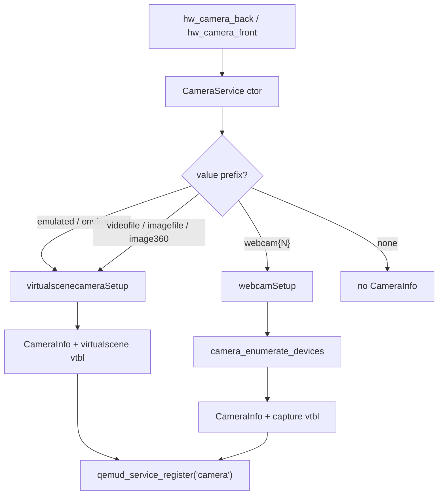
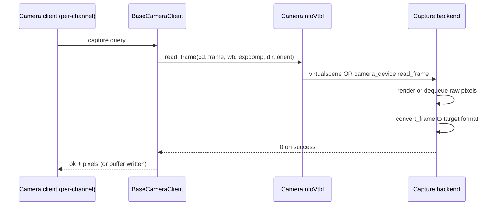
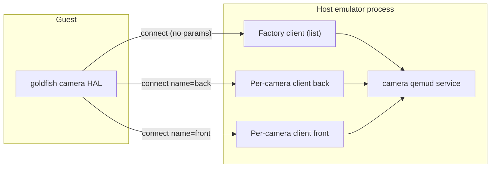
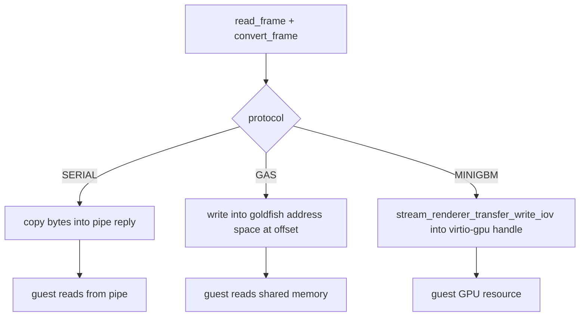
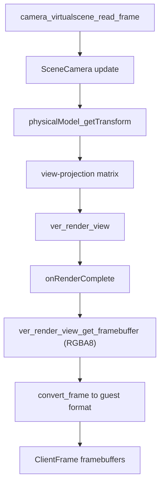
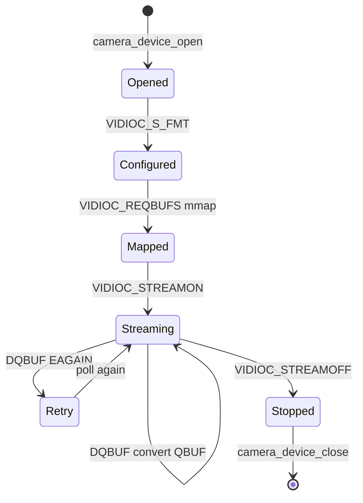
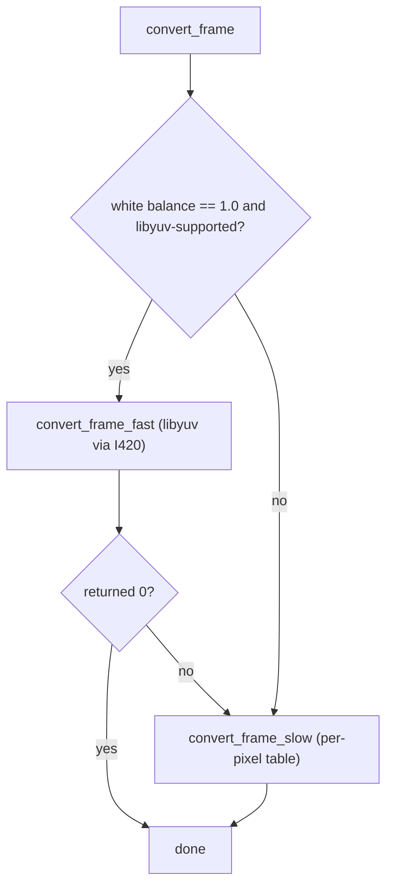

# Chapter 16: Camera

A guest app that opens `Camera2` or `CameraX` expects real pixels — a preview surface, a YUV capture stream, the device tilting the view as the phone tilts. There is no physical sensor behind the emulator, so the host has to manufacture those frames. It does so in one of two ways: by rendering a 3D *virtual scene* whose viewpoint is driven by the same physical model that powers the accelerometer and gyroscope, or by forwarding frames captured from a real webcam plugged into the host. Either way, the frames are produced host-side, converted to a guest-friendly pixel format, and shipped across a qemud pipe channel to the goldfish camera HAL inside the guest.

This chapter follows a frame from the moment the AVD configuration is read, through the host-side camera service that registers the `camera` qemud service, into the per-camera capture backends (virtual scene and V4L2 webcam), through the libyuv-based format conversion, and finally over one of three wire protocols that decide how the converted pixels reach guest memory. The whole pipeline lives in `external/qemu/android/android-emu/android/camera/`, with the scene renderer rooted in `external/qemu/android/android-emu/android/virtualscene/` and a gRPC control surface in `external/qemu/android/android-grpc/`.

---

## 16.1 Source Selection at AVD Boot

The camera subsystem comes up exactly once, during machine setup. In `external/qemu/vl.c:4753` the emulator calls `android_camera_service_init()`, defined in `external/qemu/android/android-emu/android/camera/camera-service.cpp:1874`. That function does almost nothing itself — it constructs a single static `CameraService` object, and "all the interesting things happen in the ctor."

```cpp
// Source: external/qemu/android/android-emu/android/camera/camera-service.cpp
void android_camera_service_init(void) {
    // All the interesting things happen in the ctor.
    static CameraService s_cameraService;
}
```

The constructor reads two strings from the AVD hardware config — `hw_camera_back` and `hw_camera_front` (`camera-service.cpp:473`) — and maps each one to a frame source. These strings come from the `-camera-back` and `-camera-front` command-line options, whose accepted values are documented in `external/qemu/android/emu/cmdline/src/android/help.c:1800`: `emulated`, `webcam<N>`, `environment`, `imagefile:<file>`, `videofile:<file>`, `image360:<file>`, or `none`.

### 16.1.1 The Seven Camera Source Types

Every frame producer is classified by a `CameraSourceType` enum in `external/qemu/android/android-emu/android/camera/camera-common.h:159`. There are seven of them: `kWebcam` (a real host camera), `kVirtualScene` (the 3D scene), `kVideoPlayback`, `kVideofile`, `kImagefile`, `kImage360`, and `kEnvironment` (the environment scene defined in `environment.ini`). The constructor's `if`/`else` ladder in `camera-service.cpp:514` decides which one applies for each direction, then calls either `virtualscenecameraSetup` or `webcamSetup` to register a `CameraInfo` record.

```c
// Source: external/qemu/android/android-emu/android/camera/camera-common.h
typedef enum CameraSourceType {
    kWebcam,         /* A webcam camera device enumerated on the host. */
    kVirtualScene,   /* Renders a virtual environment on the host. */
    kVideoPlayback,
    kVideofile,      /* Feeds in frames from a video file. */
    kImagefile,      /* Feeds in a static image. */
    kImage360,       /* A panoramic image playback camera. */
    kEnvironment,    /* Feeds content from environment.ini. */
} CameraSourceType;
```

All of the file-backed and scene sources (everything except `kWebcam`) share one backend: the virtual scene renderer. The constructor routes them all through `virtualscenecameraSetup`, varying only the device name string ("environment", "videofile", "imagefile", "image360", optionally suffixed with a filename). Only `kWebcam` uses the host capture path.

### 16.1.2 Telling the Guest Which Cameras Are Fake

After registering its qemud service, the constructor also publishes a boot property so the guest's legacy SurfaceFlinger fake-camera logic knows which cameras are software-emulated. The string `qemu.sf.fake_camera` is set to `both`, `back`, `front`, or `none` depending on which directions use the `emulated` software camera (`camera-service.cpp:584`). The property setter lives in `external/qemu/android/emu/hardware/src/android/boot-properties.c:177`.

```c
// Source: external/qemu/android/emu/hardware/src/android/boot-properties.c
void boot_property_add_qemu_sf_fake_camera(const char* value) {
    boot_property_add("qemu.sf.fake_camera", value);
}
```

Camera source resolution at boot



## 16.2 The CameraInfo Vtable Abstraction

Each registered camera is a `CameraInfo` struct (`camera-common.h:204`) carrying a name, direction (`front`/`back`), sensor orientation, an array of supported `frame_sizes`, a preferred `pixel_format`, and — crucially — a pointer to a `CameraInfoVtbl`. The vtable is the polymorphism boundary between the generic service and the per-source capture code.

```c
// Source: external/qemu/android/android-emu/android/camera/camera-common.h
typedef struct CameraInfoVtbl {
    CameraDevice* (*open)(const char* name, int inp_channel);
    int (*start_capturing)(CameraDevice* cd, uint32_t pixel_format,
                           int frame_width, int frame_height);
    int (*read_frame)(CameraDevice* cd, ClientFrame* frame,
                      float r_scale, float g_scale, float b_scale,
                      float exp_comp, const char* direction,
                      int sensor_orientation);
    int (*stop_capturing)(CameraDevice* cd);
    void (*close)(CameraDevice* cd);
    CameraSourceType camera_source;
} CameraInfoVtbl;
```

There are exactly two vtable instances. The virtual-scene vtable in `camera-service.cpp:750` binds `camera_virtualscene_open`, `..._start_capturing`, `..._read_frame`, `..._stop_capturing`, and `..._close`. The webcam vtable in `camera-service.cpp:794` binds the corresponding `camera_device_*` functions from `camera-capture.h`, which are implemented per-OS. The service never branches on source type when capturing a frame; it calls `mCameraInfo.vtbl->read_frame(...)` and lets the function pointer do the dispatch.

### 16.2.1 Frame Dimensions and Preferred Format

`virtualscenecameraSetup` advertises a fixed list of resolutions to the guest (`camera-service.cpp:759`): `640x480`, `352x288`, `320x240`, `1280x720`, and `1280x960`. The comment explains a notable omission — `176x144` is disabled because the RGB-to-YUV converter "produces a broken image" and "writes outside of the image memory range" at that size. The scene camera's preferred capture format is `V4L2_PIX_FMT_RGB32` (`camera-virtualscene.cpp:31`), because the scene is rendered into an RGBA8 framebuffer and converted from there.

For webcams, the supported resolutions come from the device itself: `webcamSetup` copies a `CameraInfo` produced by `camera_enumerate_devices`, which probed the real V4L2 device for its frame sizes.

The vtable dispatch for a single captured frame



## 16.3 The qemud "camera" Service and Its Clients

The host communicates with the guest camera HAL over a qemud pipe channel named `camera`, registered in `camera-service.cpp:570`:

```cpp
// Source: external/qemu/android/android-emu/android/camera/camera-service.cpp
static constexpr char kServiceCamera[] = "camera";
QemudService* serv = qemud_service_register(kServiceCamera, 0,
        this, &connectStatic, nullptr, nullptr);
```

A qemud service can host many simultaneous client channels. The camera service distinguishes two kinds of connection by inspecting the connection parameters in `CameraService::connect` (`camera-service.cpp:679`). A connection with *no* parameters is a *factory* client: it only answers the `list` query, returning the catalog of registered cameras. A connection *with* parameters (which must include `name=<device>`) is a *per-camera* client that opens one `CameraDevice` and streams frames.

### 16.3.1 The Frame Wire Format

Replies are length-prefixed. `sendPayloadSize` writes an 8-character lowercase hex byte count (`camera-service.cpp:116`), then the payload follows. A reply payload begins with a three-byte prefix: `ok` or `ko` for success or failure, followed by either a NUL or a `:` indicating whether data follows (`camera-service.cpp:122`).

```cpp
// Source: external/qemu/android/android-emu/android/camera/camera-service.cpp
constexpr size_t kReplyPrefixSize = 3;
constexpr uint8_t kOkReplyData[kReplyPrefixSize] = {'o', 'k', ':'};
```

Incoming queries are NUL-separated and parsed by `QueryParser` (`camera-service.cpp:846`), which splits a query into a verb (`connect`, `start`, `frame`, `stop`, `disconnect`, or for the newer protocols `configure`, `capture`) and a parameter string of `key=value` tokens separated by spaces. `getTokenValueStr` (`camera-service.cpp:152`) pulls individual values like `dim=640x480` or `pix=...` out of that string.

### 16.3.2 The Factory `list` Query

The factory client's `list` reply is built by `cameraInfoToString` (`camera-service.cpp:407`), one line per camera:

```cpp
// Source: external/qemu/android/android-emu/android/camera/camera-service.cpp
int len = ::snprintf(buf, sizeof(buf), "name=%s channel=%u pix=%u "
                     "dir=%s sensor_orientation=%u framedims=%ux%u", ...);
```

The guest HAL parses these lines to discover how many cameras exist, their facing, sensor orientation, native pixel format, and the resolutions they support — then opens a per-camera channel for each one it wants to use.

qemud channel topology for the camera service



## 16.4 Three Transport Protocols for Pixels

The most consequential design decision in the camera service is *how* converted pixels travel from host to guest. There are three protocols, chosen at connect time by `getCameraClientProtocol` (`camera-service.cpp:1795`):

```cpp
// Source: external/qemu/android/android-emu/android/camera/camera-service.cpp
enum class CameraClientProtocol : int {
    SERIAL,   // Pixels are sent over the channel.
    GAS,      // goldfish_address_space offset; pixels written to memory directly.
    MINIGBM,  // A virtio-gpu buffer handle; pixels written to virtio-gpu directly.
};
```

The selection is policy-driven, not negotiated: if the `Minigbm` feature flag is on, the client is `MINIGBM`; otherwise, if the AVD API level is above 29 (Android 10), it is `GAS`; otherwise it falls back to `SERIAL` (`camera-service.cpp:1795`). Each protocol gets its own client class, all created in `CameraService::cameraClientCreate` (`camera-service.cpp:1807`) after resolving the camera by name and calling its vtable `open`.

### 16.4.1 SERIAL — Copy Pixels Through the Pipe

`SerialCameraClient` (`camera-service.cpp:1101`) is the original protocol. The guest sends `start dim=WxH pix=F`, the client allocates an internal video buffer and a separate RGBA32 preview buffer (`start3`, `camera-service.cpp:1291`), and each `frame` query specifies how many `video=` and `preview=` bytes it wants. The captured frame is converted into those host buffers, then the *entire payload is copied byte-for-byte down the pipe* (`camera-service.cpp:1223`). Simple, but every frame crosses the virtio-serial boundary as a full memcpy.

Note that the start path validates that a conversion path exists *before* capturing: `start3` rejects with `CLIENT_START_RESULT_NO_PIXEL_CONVERSION` unless `has_converter` confirms a path from the camera's native format to both the requested format and `V4L2_PIX_FMT_RGB32` (`camera-service.cpp:1294`).

### 16.4.2 GAS — Write Into Shared Guest Memory

`GasCameraClient` (`camera-service.cpp:1328`) eliminates the copy. "GAS" is the goldfish address space: a region of memory shared between guest and host. The guest's `capture` query carries an `offset=` into that region; the host translates it to a host pointer and uses it directly as the conversion target framebuffer.

```cpp
// Source: external/qemu/android/android-emu/android/camera/camera-service.cpp
void* getGasBufferAddress(const uint64_t offset) const {
    return mGasGetHostPtr(mGasPhysAddrStart + offset);
}
```

The host obtains `mGasGetHostPtr` and `mGasPhysAddrStart` from `get_address_space_device_control_ops()` and `get_address_space_device_hw_funcs()` in the constructor (`camera-service.cpp:1331`). `convert_frame` then writes converted pixels straight into the guest-visible buffer; the pipe reply carries only a status (and optionally the frame timestamp), not the pixels.

### 16.4.3 MINIGBM — Write Into virtio-gpu Buffers

`MinigbmCameraClient` (`camera-service.cpp:1492`) is the modern path used when gfxstream/minigbm is enabled. It splits configuration from capture. A `configure streams=id:WxH@F,...` query (`camera-service.cpp:1531`) registers one or more guest streams, allocating a host staging buffer per stream and mapping the Android format to a V4L2 format — `RGBA_8888` becomes `V4L2_PIX_FMT_RGB32`, and `YCBCR_420_888` becomes `V4L2_PIX_FMT_NV12` (`camera-service.cpp:1562`). A later `capture bufs=id:handle,...` query (`camera-service.cpp:1632`) names a virtio-gpu resource handle per stream. After conversion into the host staging buffer, the pixels are pushed into the guest's virtio-gpu resource via gfxstream's `stream_renderer_transfer_write_iov` (`camera-service.cpp:1734`).

```cpp
// Source: external/qemu/android/android-emu/android/camera/camera-service.cpp
stream_renderer_transfer_write_iov(bi.second, 0, 0, 0, 0,
                                   &box, 0, &framebuffer, 1);
```

This lets the camera frame land in the same graphics buffer the guest GPU stack already manages, so the preview can be composited without an extra copy.

How each protocol delivers pixels



## 16.5 The Virtual Scene Camera

When the camera source is not a webcam, frames come from a rendered 3D scene. The vtable functions in `camera-virtualscene.cpp` are thin shims over `RenderedCameraDevice` (in `camera-virtualscene-utils.cpp`), which in turn drives the virtual environment renderer (`ver/virtual_environment_renderer.h`) and a `VirtualSceneManager` that owns the OpenGL scene.

### 16.5.1 Owned vs. Environment Scenes

`RenderedCameraDevice::startCapturing` (`camera-virtualscene-utils.cpp:64`) parses the device name to decide which scene to use. The separator character is `|` (`camera-virtualscene.cpp:51`), so a name like `environment|back` splits into a mode (`environment`) and an argument (`back`). If the mode is `environment`, the device joins the *global* environment scene shared across cameras via `VirtualSceneManager::addSceneUser()`. Otherwise it *creates and owns* a scene with `ver_create_scene` — and if creation fails, it falls back to a solid magenta error color (`#FF00FF`) so the guest at least gets visibly-wrong pixels rather than a crash (`camera-virtualscene-utils.cpp:106`).

```cpp
// Source: external/qemu/android/android-emu/android/camera/camera-virtualscene-utils.cpp
mUsingEnvironmentScene = (sceneModeStr == "environment");
if (mUsingEnvironmentScene) {
    mOwnedScene = VER_INVALID_HANDLE;
    sceneMode = VirtualSceneManager::getSceneMode();
    VirtualSceneManager::setSceneControlsParameters(true);
    VirtualSceneManager::addSceneUser();
} else {
    VerSceneConfig::Mode mode = VerSceneConfig::modeFromString(sceneModeStr);
    ...
    mOwnedScene = ver_create_scene(sceneConfig);
```

### 16.5.2 Rendering a Frame

`RenderedCameraDevice::readFrame` (`camera-virtualscene-utils.cpp:157`) updates the scene camera pose, sets the view-projection matrix on the active render view, then renders. The render is asynchronous-with-callback: `ver_render_view` (or `VirtualSceneManager::renderView` for the shared scene) invokes an `onRenderComplete` lambda once the GPU has produced the framebuffer. Inside that lambda, the code fetches the rendered RGBA8 framebuffer with `ver_render_view_get_framebuffer`, then hands it to `convert_frame` to produce the guest's requested format.

```cpp
// Source: external/qemu/android/android-emu/android/camera/camera-virtualscene-utils.cpp
ver_render_view_get_framebuffer(mActiveView, &viewFbDataPtr, &viewFbDataSize);
...
conversionResult = convert_frame(
        viewFbDataPtr, pixelFormat, viewFbDataSize,
        viewWidth, viewHeight,
        resultFrame, rScale, gScale, bScale, expComp, convertDirection,
        convertOrientation);
```

The render also returns a `frameTime`, which is stored back into `resultFrame->frame_time` (`camera-virtualscene-utils.cpp:263`) so the guest's capture timestamps track the renderer's clock rather than wall-clock.

### 16.5.3 The Scene Camera Tracks the Physical Model

What makes the virtual scene feel alive is that its viewpoint is driven by the *same physical model* that produces accelerometer and gyroscope readings. `SceneCamera::update` (`external/qemu/android/android-emu/android/virtualscene/SceneCamera.cpp:92`) calls `physicalModel_getTransform(android_physical_model_instance(), ...)` to fetch the current device position and rotation, then composes that with a fixed camera-from-sensors transform.

```cpp
// Source: external/qemu/android/android-emu/android/virtualscene/SceneCamera.cpp
physicalModel_getTransform(android_physical_model_instance(), &position.x,
                           &position.y, &position.z,
                           &rotationEulerDegrees.x, &rotationEulerDegrees.y,
                           &rotationEulerDegrees.z, &timestamp);
```

Tilt the emulated device (via the extended controls or the sensor automation), and the scene visibly rotates, because the gyroscope and the camera are reading the same pose. The projection matrix is built from idealized camera intrinsics in `projectionMatrixForCameraIntrinsics` (`SceneCamera.cpp:37`), and the front camera gets an extra 180-degree Y rotation so it mirrors the back camera (`camera-virtualscene-utils.cpp:185`).

Virtual scene frame pipeline



### 16.5.4 Driving the Scene from gRPC

The scene viewpoint can also be steered programmatically. `external/qemu/android/android-grpc/services/emulator-controller/server/src/android/emulation/control/camera/VirtualSceneCamera.cpp` registers a status-change callback for `kVirtualScene` (`VirtualSceneCamera.cpp:40`) and exposes `rotate` and `setVelocity` that feed a WASD-style motion model. When the scene camera connects or disconnects, `mModel.onEnable()`/`onDisable()` toggle the ambient-motion model so the preview gently drifts even when the client is idle.

## 16.6 Host Webcam Passthrough (V4L2)

When the source is a `webcam<N>`, frames come from a real device. The capture code is per-OS: `camera-capture-linux.c` (V4L2), `camera-capture-mac.m` (AVFoundation), and `camera-capture-windows.cpp` (vfw32). The Linux path is the most instructive.

### 16.6.1 Enumeration

`camera_enumerate_devices` (`camera-capture-linux.c:1096`) walks `/dev/video0` through `/dev/video{N}`, opening each, issuing `VIDIOC_QUERYCAP` to confirm it is a capture device, and using `VIDIOC_ENUM_FMT` and `VIDIOC_ENUM_FRAMESIZES` to discover supported formats and resolutions. Per the comment in `camera-capture.h:127`, the guest framework ultimately wants YV12, so the host prefers a native format the device already exposes to "spare some CPU cycles on the conversion." This enumeration is also what `-webcam-list` prints, via `android_camera_list_webcams` (`camera-list.cpp:26`).

### 16.6.2 Three I/O Methods

A V4L2 device can deliver frames three ways, captured by the `CameraIoType` enum (`camera-capture-linux.c:78`): `CAMERA_IO_MEMMAP` (memory-mapped buffers queued/dequeued with `VIDIOC_QBUF`/`VIDIOC_DQBUF`), `CAMERA_IO_USERPTR` (driver writes into user-supplied buffers), and `CAMERA_IO_DIRECT` (plain `read()` from the device fd). `camera_device_start_capturing` (`camera-capture-linux.c:842`) sets the format with `VIDIOC_S_FMT`, then tries to set up mmap framebuffers via `VIDIOC_REQBUFS` (`camera-capture-linux.c:335`), falling back to other I/O types if the device cannot mmap, and finally starts the stream with `VIDIOC_STREAMON`.

### 16.6.3 Reading a Frame

`camera_device_read_frame` (`camera-capture-linux.c:992`) dequeues the next buffer with `VIDIOC_DQBUF`, converts it into the caller's `ClientFrame`, then requeues the buffer with `VIDIOC_QBUF`. A subtlety surfaces here: if `VIDIOC_DQBUF` returns `EAGAIN`, the function returns `1` rather than an error, telling the caller to retry.

```c
// Source: external/qemu/android/android-emu/android/camera/camera-capture-linux.c
const int res = _xioctl(cd->handle, VIDIOC_DQBUF, &buf);
if (res >= 0) {
    break;
} else if (errno == EAGAIN) {
    return 1;   // Tells the caller to repeat.
}
```

That retry contract is honored in the service layer by `readFrameImpl` (`camera-service.cpp:959`), which polls for up to two seconds (`cameraSleep(10)` between attempts) before giving up. The `CAMERA_IO_DIRECT` branch instead loops on `read()` until it has accumulated `sizeimage` bytes (`camera-capture-linux.c:1013`).

V4L2 capture state on Linux



## 16.7 Pixel Format Conversion

No matter the source, frames arrive in some host format (RGBA8 from the scene, or whatever the webcam negotiated) and must reach the guest in the format it asked for — typically YV12/NV12 for the capture stream and RGB32 for preview. The conversion machinery is in `camera-format-converters.c`, fronted by `convert_frame` (`camera-format-converters.c:2234`).

### 16.7.1 Fast Path and Slow Path

`convert_frame` has two implementations behind it. The *fast path*, `convert_frame_fast` (`camera-format-converters.c:2042`), uses Google's libyuv: it converts the source into I420 as an intermediate, rotates and crops to match the requested aspect ratio, optionally rescales with `I420Scale`, applies exposure compensation by scaling Y values, and finally emits the destination format with `ConvertFromI420` (or a manual U/V swap for YV12 via `I420Copy`). The fast path is only taken when white balance is a no-op (all scales equal `1.0`) and the format pair is libyuv-supported (`camera-format-converters.c:2257`).

```c
// Source: external/qemu/android/android-emu/android/camera/camera-format-converters.c
if (r_scale == 1.0f && g_scale == 1.0f && b_scale == 1.0f &&
    libyuv_supported(src_desc, result_frame)) {
    if (convert_frame_fast(src_frame, pixel_format, framebuffer_size, width,
                           height, result_frame, exp_comp, rotation) == 0) {
        return 0;
    }
}
```

If the fast path is skipped or fails, `convert_frame` falls back to `convert_frame_slow` (`camera-format-converters.c:1804`), a per-pixel loop driven by a table of format descriptors. That table (`camera-format-converters.c:1622`) carries RGB descriptors (`_ARGB32`, `_RGB32`) and YUV descriptors (`_YV12`, `_NV12`, `_NV21`, and others) with load/save callbacks and an `RGB32ToYUV`/`YUVToRGB32` color math core (`camera-format-converters.c:185`). The slow path supports a much wider format list but, per the inline note at `camera-format-converters.c:2267`, does not rotate frames correctly (bug 260913366).

### 16.7.2 White Balance and Exposure

The per-frame scalars — `r_scale`/`g_scale`/`b_scale` (white balance) and `exp_comp` (exposure) — flow all the way from the guest query through `readFrameImpl` into the converter. White balance is applied as a multiply on each RGB channel in the slow path; exposure is applied in the fast path by scaling the luminance plane (`camera-format-converters.c:2145`). Because non-unity white balance forces the slow path, the common steady-state case (neutral white balance) stays on libyuv.

### 16.7.3 A Staging Buffer Per Client

Both paths need scratch space — the I420 intermediate, the rotated copy, the rescaled copy. Rather than allocating per frame, each client owns a persistent `mStagingFramebuffer` whose pointer and size are passed into `convert_frame` via the `ClientFrame` struct (`camera-common.h:130`). `resize_staging` grows it only when a larger frame appears, so steady-state capture does no heap allocation in the hot path.

The convert_frame decision



## 16.8 Orientation and the Sensor Coupling

A camera frame must rotate with the device. The service ties camera orientation to the device's coarse orientation through a function pointer set at construction. `set_coarse_orientation_getter` (`camera-common.h:262`) is wired to `android_camera_sensors_get_coarse_orientation` (`camera-service.cpp:461`), which combines the camera's mounting angle with the live device orientation reported by the sensors subsystem.

```cpp
// Source: external/qemu/android/android-emu/android/camera/camera-service.cpp
int android_camera_sensors_get_coarse_orientation(int orientation) {
    int coarse_base_orientation = orientation/90 - 1;
    return (static_cast<int>(android_sensors_get_coarse_orientation())
            + coarse_base_orientation) % 4;
}
```

The capture backends pass each frame's `sensor_orientation` through `get_coarse_orientation` before handing it to `convert_frame` (see `camera-capture-linux.c:1041` and `camera-virtualscene.cpp:100`). Inside `convert_frame`, the final rotation is computed differently for front and back cameras (`camera-format-converters.c:2253`) so both produce an upright image regardless of how the emulated device is held. Frame timestamps are likewise adjusted by `android_sensors_get_time_offset()` before being sent (`camera-service.cpp:1230`), keeping camera timestamps on the same timeline as sensor events.

## 16.9 Snapshots and Metrics

Because the camera service is a qemud client, it participates in snapshotting. Each client class implements `save`/`load` (e.g. `SerialCameraClient::save` at `camera-service.cpp:1261`, `MinigbmCameraClient` at `camera-service.cpp:1742`), persisting whether capture was started and the active dimensions/format or stream list. On load, the client re-issues `startCapturingImpl` with the saved parameters so a restored snapshot resumes streaming transparently — for the minigbm client, it even rebuilds the stream table and restarts capture at the max resolution (`camera-service.cpp:1749`).

The service also reports usage metrics. `camera-metrics.cpp` records a session start with source type, direction, and resolution (`startCapturingImpl`, `camera-service.cpp:940`), a start result code, and a frame count at session stop (`camera-service.cpp:991`). The `ClientStartResult` codes in `camera-common.h:240` — success, parameter mismatch, unknown pixel format, no conversion, out of memory — are exactly what gets reported and what the guest sees as the `ko:` reason string.

## 16.10 Try It

Inspect and exercise the camera pipeline against a running AVD.

- List the host webcams the emulator can forward, without booting an AVD:

```bash
emulator -webcam-list
```

- Boot with the virtual scene on the back camera and a webcam on the front:

```bash
emulator -avd <name> -camera-back virtualscene -camera-front webcam0
```

- Boot with a static image as the back camera (useful for deterministic CTS-style tests):

```bash
emulator -avd <name> -camera-back imagefile:/path/to/picture.png
```

- Watch the camera service negotiate protocols and convert frames. Verbose camera logging is gated by the `camera` verbose tag used throughout (e.g. `VERBOSE_PRINT(camera, ...)` in `camera-virtualscene.cpp`):

```bash
emulator -avd <name> -verbose -show-kernel 2>&1 | grep -i camera
```

- Load a poster into the virtual scene to confirm the scene path is live, then open the camera app and tilt the device with the extended controls — the rendered view should track the gyroscope:

```bash
emulator -avd <name> -camera-back virtualscene -virtualscene-poster wall=/path/to/poster.png
```

## Summary

- The camera subsystem comes up once at boot when `android_camera_service_init` (called from `external/qemu/vl.c`) constructs a `CameraService` that reads `hw_camera_back`/`hw_camera_front` and registers a `camera` qemud service.
- Every frame source is a `CameraInfo` with a `CameraInfoVtbl`; there are two vtables — virtual scene and webcam capture — and seven `CameraSourceType` values, six of which (all but `kWebcam`) flow through the virtual scene renderer.
- The guest talks to the host over the `camera` qemud channel using a length-prefixed `ok:`/`ko:` protocol; a parameterless connection is a factory client answering `list`, while a `name=`-bearing connection streams one camera.
- Pixels reach the guest by one of three protocols chosen by feature flag and API level: SERIAL copies bytes through the pipe, GAS writes into the goldfish address space at a guest-supplied offset, and MINIGBM transfers into a virtio-gpu resource handle via gfxstream.
- The virtual scene camera renders a 3D scene whose viewpoint is driven by `physicalModel_getTransform`, so the preview moves with the emulated accelerometer and gyroscope; failed scenes fall back to solid magenta.
- Host webcam passthrough on Linux uses V4L2 with mmap/userptr/direct I/O, enumerating `/dev/video*` and preferring a native format close to the guest's YV12 need.
- `convert_frame` takes a libyuv fast path (I420 intermediate) when white balance is neutral and the format pair is supported, otherwise a per-pixel slow path; a persistent staging buffer keeps the steady state allocation-free.
- Orientation and timestamps are coupled to the sensors subsystem so frames stay upright and on the same clock as sensor events, and each client class implements save/load so capture survives snapshots.

### Key Source Files

| File | Purpose |
|------|---------|
| `external/qemu/android/android-emu/android/camera/camera-service.cpp` | Registers the `camera` qemud service; factory and per-camera clients; SERIAL/GAS/MINIGBM transports |
| `external/qemu/android/android-emu/android/camera/camera-common.h` | `CameraInfo`, `CameraInfoVtbl`, `CameraSourceType`, `ClientFrame`, result codes |
| `external/qemu/android/android-emu/android/camera/camera-virtualscene.cpp` | Virtual scene vtable shims over `RenderedCameraDevice` |
| `external/qemu/android/android-emu/android/camera/camera-virtualscene-utils.cpp` | Scene creation, per-frame render, RGBA8 framebuffer to `convert_frame` |
| `external/qemu/android/android-emu/android/virtualscene/SceneCamera.cpp` | Scene viewpoint driven by the physical model / sensors |
| `external/qemu/android/android-emu/android/camera/camera-capture-linux.c` | V4L2 host webcam enumeration and capture |
| `external/qemu/android/android-emu/android/camera/camera-format-converters.c` | `convert_frame` fast (libyuv) and slow (table) paths |
| `external/qemu/android/android-grpc/services/emulator-controller/server/src/android/emulation/control/camera/VirtualSceneCamera.cpp` | gRPC control of the virtual scene camera pose |
