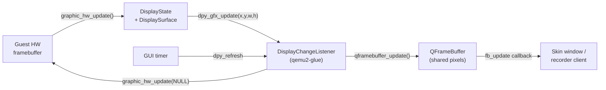
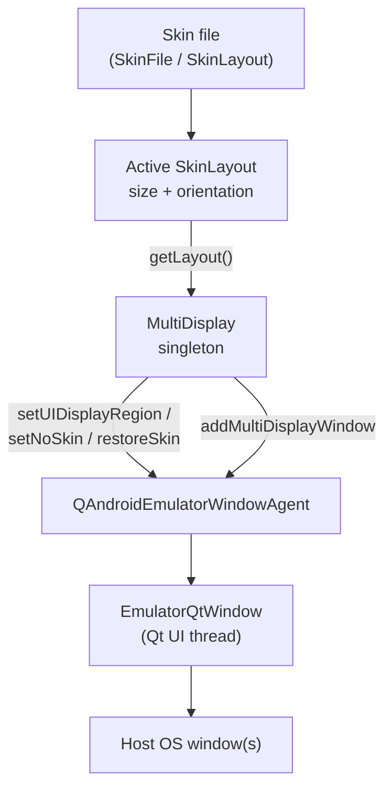
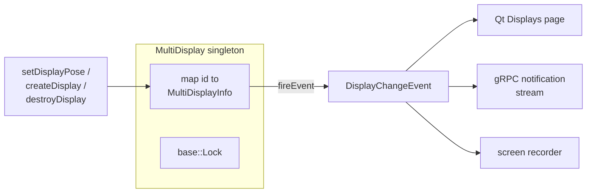
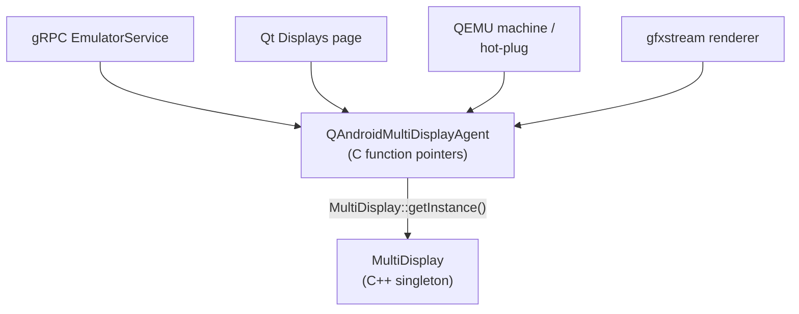
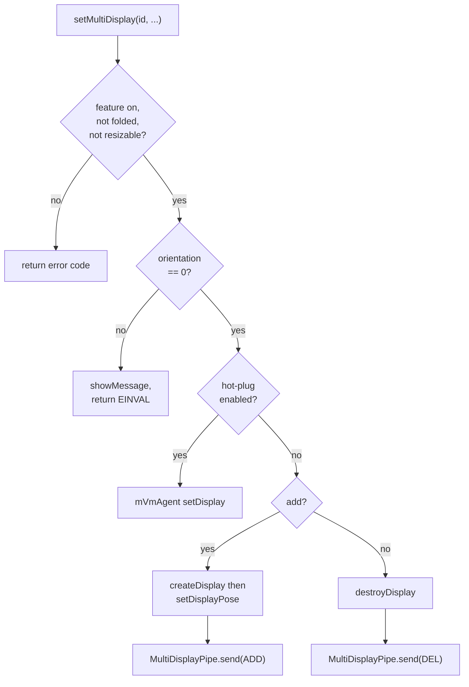
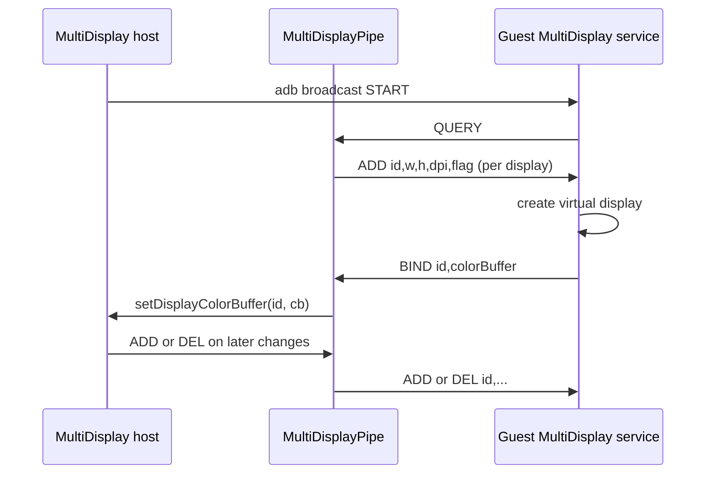
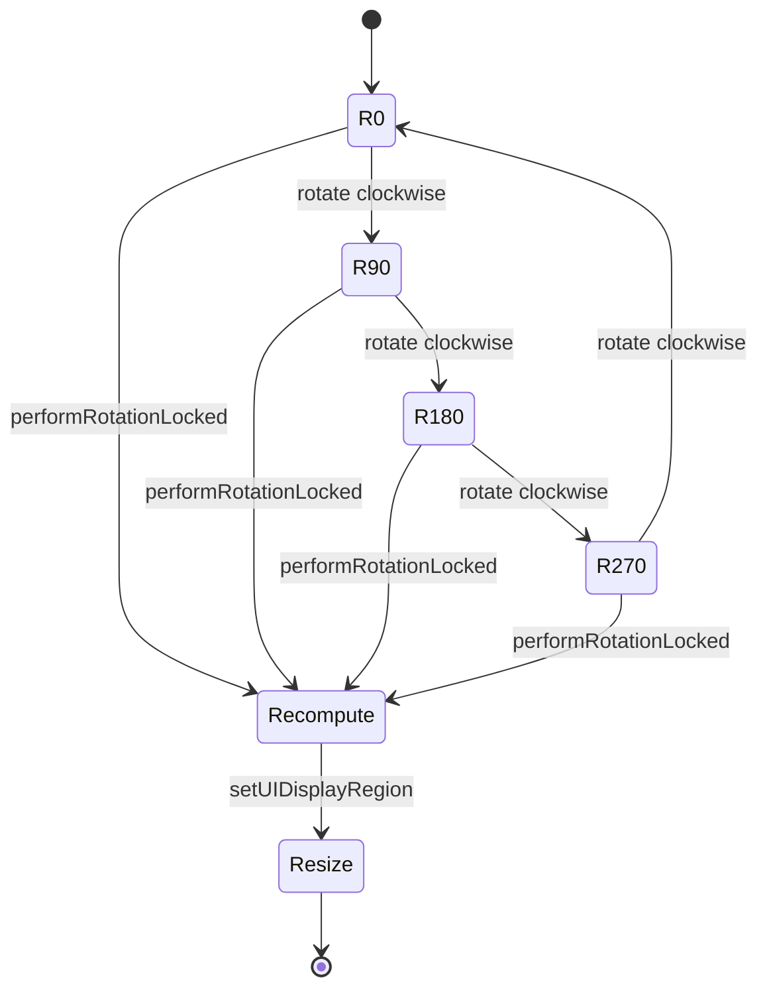
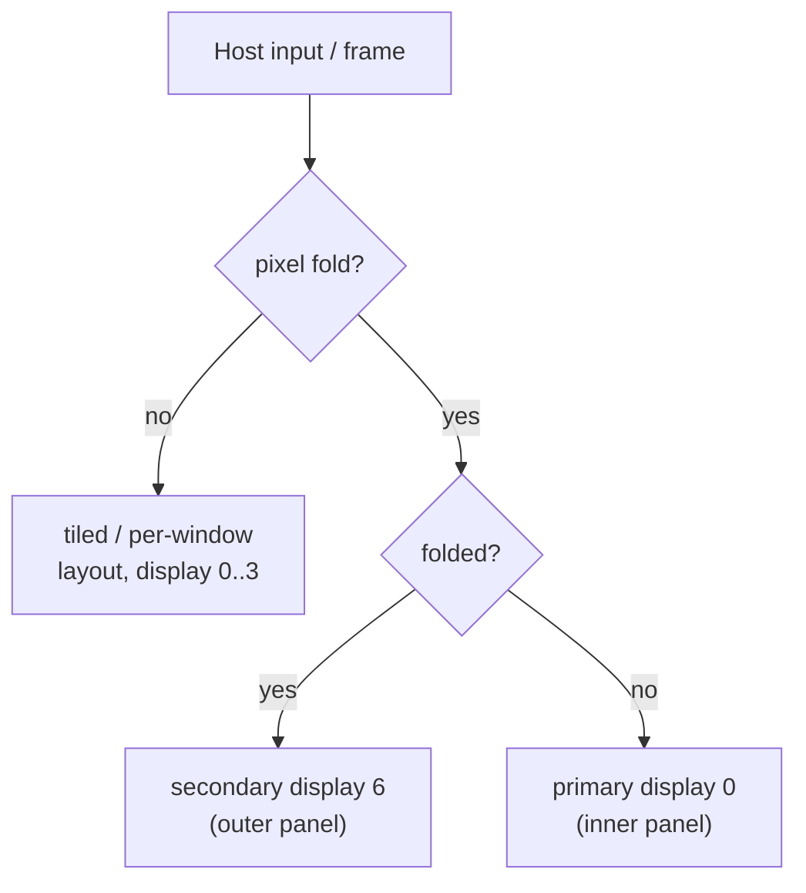

# Chapter 17: Display and Multi-Display

Every frame the guest paints has to reach a pixel on your screen. Between the guest framebuffer and the host window sit several abstractions: QEMU's `DisplayState`/`DisplaySurface`/`DisplayChangeListener` triad, the emulator's `QFrameBuffer` decoupling layer, the skin window that wraps the panel in a device bezel, and — when more than one display is involved — a `MultiDisplay` coordinator that tracks every panel's geometry, color buffer, and rotation. This chapter walks the frame from the moment the hardware framebuffer is dirtied to the moment it lands inside the host window, then expands to cover secondary displays, foldables, and orientation changes.

The two big themes are *decoupling* and *coordination*. Decoupling: the hardware emulation never talks to a window directly; it talks to a `QFrameBuffer`, and a UI backend subscribes to that buffer. Coordination: a single `MultiDisplay` singleton owns the truth about how many displays exist, where each sits, how big it is, and which host-side color buffer feeds it — and a thin C agent struct exposes that singleton to the QEMU glue, the Qt UI, and the gRPC control plane without any of them knowing each other.

---

## 17.1 The Display Pipeline at a Glance

The classic single-display path predates gfxstream and still backs no-GPU and software-rendered configurations. It is described in the emulator's own design note, `external/qemu/android/docs/DISPLAY-STATE.TXT`, and is worth understanding because the abstractions it defines (`DisplaySurface`, `DisplayChangeListener`) are reused everywhere else.

A `DisplayState` owns a `DisplaySurface` — "nothing more than a pixel buffer with specific dimensions, pitch and format" — plus a list of `DisplayChangeListener` objects. The hardware framebuffer emulation pushes updates into the surface; each listener receives callbacks (`dpy_gfx_update`, `dpy_gfx_switch`, `dpy_refresh`) and copies or forwards the pixels to wherever it displays them. A GUI timer drives the whole loop: it fires `dpy_refresh`, which polls input and calls `graphic_hw_update()`, which asks the hardware emulation to copy dirty rectangles into the surface and then fan them out to listeners.

The Android emulator inserts its own indirection — `QFrameBuffer` — between the `DisplaySurface` and the UI, declared in `hardware/google/aemu/host-common/include/host-common/display_agent.h`. The header states the contract plainly:

```c
// Source: hardware/google/aemu/host-common/include/host-common/display_agent.h
struct QFrameBuffer {
    int                 width;        /* width in pixels */
    int                 height;       /* height in pixels */
    int                 pitch;        /* bytes per line */
    int                 bits_per_pixel; /* bits per pixel */
    int                 bytes_per_pixel;    /* bytes per pixel */
    int                 rotation;     /* rotation to be applied when displaying */
    QFrameBufferFormat  format;
    void*               pixels;       /* pixel buffer */
    ...
};
```

A `QFrameBuffer` is shared between exactly one *producer* (which updates the pixels from emulated VRAM) and one or more *clients* (which display them). The producer signals work with `qframebuffer_update()` / `qframebuffer_rotate()`; clients react through their `fb_update` / `fb_rotate` callbacks. This is the seam that lets the same hardware emulation feed an SDL window, a Qt window, or a screen recorder without recompiling.

### Diagram: The single-display frame path



The glue that wires QEMU's listener model to the `QFrameBuffer` lives in `external/qemu/android-qemu2-glue/display.cpp`. Its top comment captures the whole relationship in one line: `DisplayState <--> QFrameBuffer <--> QEmulator/SDL`.

## 17.2 The QEMU Glue: DisplayChangeListener to QFrameBuffer

`android_display_init()` in `external/qemu/android-qemu2-glue/display.cpp` is where a host window attaches to QEMU. It looks up the first graphic console, registers a `QFrameBuffer` producer, replaces the console's default surface with one sized to the framebuffer, and registers a `DisplayChangeListener`:

```cpp
// Source: external/qemu/android-qemu2-glue/display.cpp
bool android_display_init(DisplayState* ds, QFrameBuffer* qf) {
    QemuConsole* con = find_graphic_console();
    ...
    auto surface = qemu_create_displaysurface_from(
            qf->width, qf->height, format, qf->pitch, (uint8_t*)qf->pixels);
    dpy_gfx_replace_surface(con, surface);
    dcl->fb = qf;
    dclOps.dpy_gfx_update = &android_display_update;
    dclOps.dpy_gfx_switch = &android_display_switch;
    register_displaychangelistener(dcl);
    return true;
}
```

The listener callbacks are tiny adapters. When QEMU reports a dirty rectangle, `android_display_update()` forwards it verbatim to the framebuffer:

```cpp
// Source: external/qemu/android-qemu2-glue/display.cpp
static void android_display_update(DisplayChangeListener* dcl,
                                   int x, int y, int w, int h) {
    if (QFrameBuffer* qfbuff = asDcl(dcl)->fb) {
        qframebuffer_update(qfbuff, x, y, w, h);
    }
}
```

Two producer callbacks close the loop in the other direction. `android_display_producer_check()` calls `graphic_hw_update(NULL)` — that is what eventually triggers the listener's update callback — and `android_display_producer_invalidate()` calls `graphic_hw_invalidate(NULL)` so the next update resends the whole frame (used when a minimized window is restored). The same file registers a QEMU `QemuDisplay` of type `DISPLAY_TYPE_SDL` whose `init` hook is `sdl_display_init()`; for a headless run, `EmulatorWindow`'s `no_window` flag short-circuits it. There is a dedicated `android_display_init_no_window()` for the GPU-guest / no-window case that attaches only the check and invalidate callbacks so screen recording can still pull frames without a visible surface.

### 17.2.1 The display agent

The C-side interface the rest of android-emu uses to read the framebuffer is `QAndroidDisplayAgent`, implemented in `external/qemu/android-qemu2-glue/qemu-display-agent-impl.cpp`. Its `getFrameBuffer` walks the consoles for the first graphic one and reports the surface's geometry:

```cpp
// Source: external/qemu/android-qemu2-glue/qemu-display-agent-impl.cpp
DisplaySurface* const ds = qemu_console_surface(con);
if (w) { *w = surface_width(ds); }
if (h) { *h = surface_height(ds); }
if (lineSize) { *lineSize = surface_stride(ds); }
if (bytesPerPixel) { *bytesPerPixel = surface_bytes_per_pixel(ds); }
if (frameBufferData) { *frameBufferData = (uint8_t*)surface_data(ds); }
```

The same file's `registerUpdateListener`/`unregisterUpdateListener` let consumers (notably the screen recorder and snapshot screenshotting) subscribe to update rectangles through a shared `AndroidDisplayChangeListener` that multiplexes one QEMU listener to many `AndroidDisplayUpdateCallback` consumers.

## 17.3 The Skin, the Layout, and the Host Window Surface

In the default windowed mode the panel does not float bare on your desktop; it sits inside a device *skin* — a bezel image with hot-spot buttons, a fixed display rectangle, and an orientation. The skin file format is parsed into the structs in `external/qemu/android/android-ui/modules/aemu-ui-common/include/android/skin/file.h`. A `SkinLayout` is one physical arrangement of the device (for example portrait vs. landscape); it carries the device `size`, a list of `SkinLocation` placements, and an `orientation`:

```c
// Source: external/qemu/android/android-ui/modules/aemu-ui-common/include/android/skin/file.h
typedef struct SkinDisplay {
    SkinRect      rect;      /* display rectangle    */
    SkinRotation  rotation;  /* framebuffer rotation */
    int           bpp;       /* bits per pixel, 32 or 16 */
    char          valid;
    void*         framebuffer;
    ...
} SkinDisplay;
```

The `SkinDisplay.rect` is where the guest pixels are blitted inside the bezel, and `SkinLayout.orientation` is the source of truth for rotation throughout the display code. The `MultiDisplay` logic reads it through the window agent's `getLayout()` and casts the result back to `SkinLayout*`, then inspects `layout->orientation` to decide how to arrange and how to translate input coordinates — you will see this pattern repeatedly below.

When a feature needs to grow or shrink the host window — adding a secondary display, disabling the skin so a raw panel can be shown — the `MultiDisplay` code calls into the window through the emulator window agent (`QAndroidEmulatorWindowAgent`, declared in `hardware/google/aemu/host-common/include/host-common/window_agent.h`). The relevant entry points are:

- `setUIDisplayRegion(x, y, w, h, ignoreOrientation)` — resize the host window's display region to a new combined size.
- `setNoSkin()` / `restoreSkin()` — drop the bezel when multiple displays are tiled into one window, or put it back when only display 0 remains.
- `addMultiDisplayWindow(id, add, w, h)` — create or destroy a separate top-level window for one display (the "window per display" mode).
- `updateUIMultiDisplayPage(id)` — refresh the extended-controls Displays tab so it reflects the live configuration.

The Qt implementations of these hooks live in `external/qemu/android/android-ui/modules/aemu-ui-qt/src/android/window-agent-impl.cpp`; each forwards to `EmulatorQtWindow` (often via `runOnUiThread`, because UI mutation must happen on the Qt thread).

### Diagram: Skin, layout, and the window agent



## 17.4 MultiDisplay: The Coordinator

`MultiDisplay` is the singleton that knows about every display. It is declared in `hardware/google/aemu/host-common/include/host-common/MultiDisplay.h` and implemented in `external/qemu/android/android-emu/android/emulation/MultiDisplay.cpp`. Internally it is a `std::map<uint32_t, MultiDisplayInfo>` guarded by a lock; each `MultiDisplayInfo` records position, current and original dimensions, dpi, flags, the host color buffer id (`cb`), rotation, an enabled flag, and a per-display color-transform matrix.

```c
// Source: hardware/google/aemu/host-common/include/host-common/MultiDisplay.h
struct MultiDisplayInfo {
    int32_t pos_x;
    int32_t pos_y;
    uint32_t width;
    uint32_t height;
    uint32_t originalWidth;
    uint32_t originalHeight;
    uint32_t dpi;
    uint32_t flag;
    uint32_t cb;          // host color buffer id
    int32_t  rotation;
    bool     enabled;
    DisplayColorTransform colorTransform;
    ...
};
```

The display id space is partitioned by origin, documented right in the header:

```c
// Source: hardware/google/aemu/host-common/include/host-common/MultiDisplay.h
// 0 for default Android display
// 1-5 for Emulator UI
// 6-10 for developer from rcControl
static constexpr uint32_t s_displayIdInternalBegin = 6;
static constexpr uint32_t s_maxNumMultiDisplay = 11;
static constexpr uint32_t s_invalidIdMultiDisplay = 0xFFFFFFAB;
```

Display 0 is the primary Android display. Ids 1–5 belong to user-configurable secondary displays created through the UI, command line, or `config.ini`. Ids 6–10 are reserved for displays the *guest* creates dynamically (for example through HWComposer/`rcCommand`); these are deliberately not reported back to the guest by the multidisplay pipe, because the guest already knows about them — `MultiDisplayPipe::onMessage` breaks out of the QUERY loop once it sees an id at or past `s_displayIdInternalBegin`.

`MultiDisplay` is also an `EventNotificationSupport<DisplayChangeEvent>`: every mutation (`createDisplay`, `setDisplayPose`, `destroyDisplay`, `notifyDisplayChanges`) fires a `DisplayChangeEvent` with one of `DisplayAdded`, `DisplayRemoved`, `DisplayChanged`, or `DisplayTransactionCompleted` so that the UI and gRPC subscribers can react.

### Diagram: MultiDisplay state and its event fan-out



## 17.5 The Multi-Display Agent: One Singleton, Many Callers

QEMU glue, the Qt UI, and the gRPC server cannot include the C++ `MultiDisplay` class directly — they live in different link units and the glue is partly C. The bridge is a plain C function-pointer struct, `QAndroidMultiDisplayAgent`, declared in `hardware/google/aemu/host-common/include/host-common/multi_display_agent.h`:

```c
// Source: hardware/google/aemu/host-common/include/host-common/multi_display_agent.h
typedef struct QAndroidMultiDisplayAgent {
    bool (*notifyDisplayChanges)();
    int (*setMultiDisplay)(uint32_t id, int32_t x, int32_t y,
                           uint32_t w, uint32_t h, uint32_t dpi,
                           uint32_t flag, bool add);
    ...
    int (*createDisplay)(uint32_t* displayId);
    int (*destroyDisplay)(uint32_t displayId);
    int (*setDisplayPose)(...);
    int (*setDisplayColorBuffer)(uint32_t displayId, uint32_t colorBuffer);
    bool (*isMultiDisplayWindow)();
    void (*performRotation)(int rot);
    bool (*isPixelFold)();
} QAndroidMultiDisplayAgent;
```

The implementation in `external/qemu/android-qemu2-glue/qemu-multi-display-agent-impl.cpp` is mechanical: every member is a lambda that fetches `MultiDisplay::getInstance()` and forwards to the matching method, returning a safe default when the singleton is null. This single indirection is what lets the gRPC `EmulatorService` call `mAgents->multi_display->setMultiDisplay(...)` while the QEMU machine code calls the same agent for hot-plug, all without a hard dependency on the `MultiDisplay` class.

```cpp
// Source: external/qemu/android-qemu2-glue/qemu-multi-display-agent-impl.cpp
.setMultiDisplay = [](uint32_t id, int32_t x, int32_t y,
                      uint32_t w, uint32_t h, uint32_t dpi,
                      uint32_t flag, bool add) -> int {
    auto instance = MultiDisplay::getInstance();
    if (instance) {
        return instance->setMultiDisplay(id, x, y, w, h, dpi, flag, add);
    }
    return -1;
},
```

The singleton itself is constructed by `android_init_multi_display()` (bottom of `MultiDisplay.cpp`), called from `external/qemu/android-qemu2-glue/main.cpp` with the window, record, and VM agents wired in. The host renderer also receives this agent: `android_startOpenglesRenderer()` in `hardware/google/aemu/host-common/include/host-common/opengles.h` takes a `const QAndroidMultiDisplayAgent*` so gfxstream can query and update display geometry as it composes color buffers.

### Diagram: who calls the multi-display agent



## 17.6 Adding a Display: setMultiDisplay End to End

`setMultiDisplay()` is the single entry point used by the command line, `config.ini`, the UI, and gRPC. It is also the place where most of the policy gates live. Before doing anything it rejects unsupported configurations: the `MultiDisplay` feature flag must be on, no folded area may be configured, resizable must be off, and TV / Wear flavors are refused outright (`external/qemu/android/android-emu/android/emulation/MultiDisplay.cpp`, around the top of `setMultiDisplay`).

If the caller passes `flag == 0`, the method fills in a sensible default depending on the guest. From API 31 (Android S) onward a specific set of `VIRTUAL_DISPLAY_FLAG_*` bits is required so the guest's Presentation API works — the code comment cites the bug that drove it. Automotive and desktop API-36+ guests get their own flag sets.

Rotation is a hard precondition. If the active skin layout's `orientation` is not `SKIN_ROTATION_0`, the call refuses and shows a message — you cannot add a display while the device is rotated:

```cpp
// Source: external/qemu/android/android-emu/android/emulation/MultiDisplay.cpp
if (rotation != SKIN_ROTATION_0) {
    mWindowAgent->showMessage(
            "Please apply multiple displays without rotation",
            WINDOW_MESSAGE_ERROR, 1000);
    return -EINVAL;
}
```

From there the path forks on whether *hot-plug* display is enabled (Minigbm feature plus `-hotplug-multidisplay` or the `hw.hotplug_multi_display` config). With hot-plug, the work is delegated directly to the VM operations agent (`mVmAgent->setDisplay(id, w, h, dpi)` to add, or zeros to remove). Without hot-plug, the classic path runs: `createDisplay()` reserves the id, `setDisplayPose()` records geometry, the multidisplay guest service is (re)started over adb, and the change is pushed to the guest through `MultiDisplayPipe`.

### Diagram: setMultiDisplay decision flow



### 17.6.1 Parameter validation

`multiDisplayParamValidate()` enforces the constraints derived from the Android CDD: dpi between 120 and 640, width and height each at least 320 dp (`320 * dpi / 160` pixels), and a resolution no larger than 8K in either orientation. A validation failure surfaces to the user through `showMessage` rather than failing silently. The CDD reasoning is in the source comment:

```cpp
// Source: external/qemu/android/android-emu/android/emulation/MultiDisplay.cpp
// According the Android 9 CDD,
// * 120 <= dpi <= 640
// * 320 * (dpi / 160) <= width
// * 320 * (dpi / 160) <= height
```

### 17.6.2 Where the configuration comes from

`loadConfig()` runs at startup and picks the configuration source in priority order. The `-multidisplay` command line (parsed by `parseConfig()`) wins; its format is five comma-separated values per display — index, width, height, dpi, flag — and `parseConfig()` insists the count be a non-zero multiple of five with indices restricted to 1, 2, or 3. The help text for `-multidisplay` (`external/qemu/android/emu/cmdline/src/android/help.c`) gives the canonical example `-multidisplay 1,1200,800,240,0`. If no command line is given, `loadConfig()` falls back to the `hw.display1.*` / `hw.display2.*` / `hw.display3.*` keys from `config.ini`, defined in `external/qemu/android/emu/avd/src/android/avd/hardware-properties.ini` (width, height, density, xOffset, yOffset, flag for each of the three secondary displays). The primary display is always described separately by `hw.lcd.width` / `hw.lcd.height` / `hw.lcd.density`.

## 17.7 The MultiDisplayPipe: Telling the Guest

Host-side geometry is useless unless the guest agrees. The `MultiDisplayPipe` (`external/qemu/android/android-emu/android/emulation/MultiDisplayPipe.cpp`) is a QEMU pipe to a guest-side service that registers and tears down Android virtual displays. Its protocol is a one-byte command followed by a packed `{id, w, h, dpi, flag}` payload:

```cpp
// Source: external/qemu/android/android-emu/android/emulation/MultiDisplayPipe.cpp
const uint8_t MultiDisplayPipe::ADD = 1;
const uint8_t MultiDisplayPipe::DEL = 2;
const uint8_t MultiDisplayPipe::QUERY = 3;
const uint8_t MultiDisplayPipe::BIND = 4;
const uint8_t MultiDisplayPipe::SET_DISPLAY = 0x10;
const uint8_t MultiDisplayPipe::MAX_DISPLAYS = 10;
```

The flow is bidirectional. When the guest service starts it sends `QUERY`; the host replies with one `ADD` message per host-configured display (skipping ids ≥ `s_displayIdInternalBegin`, which the guest created itself). When the guest later allocates a host color buffer for a display, it sends `BIND` carrying the display id and color buffer id, and the host records the mapping with `setDisplayColorBuffer()`. The guest service is launched over adb by `startDisplayPipe()`, which broadcasts an intent to `com.android.emulator.multidisplay/.MultiDisplayServiceReceiver` (with a flavor- and API-dependent `--user 0`). The pipe also participates in snapshots: `onSave`/`onLoad` delegate to `MultiDisplay::onSave`/`onLoad`, which serialize the entire display map big-endian.

### Diagram: host and guest multidisplay handshake



The link between a guest-allocated color buffer and a host display is what lets the renderer post the right pixels to the right panel. `getColorBufferDisplay()` and `getDisplayColorBuffer()` translate between the two; the host renderer's `OnPostFunc` callback (declared in `opengles.h`) carries a `displayId` precisely so each composed frame can be routed to its display's window region.

## 17.8 Layout, Rotation, and Coordinate Translation

When secondary displays share a single host window (the default, not "window per display"), `MultiDisplay` tiles them into one combined surface and recomputes that surface whenever a display is added, removed, resized, or the device is rotated. `recomputeLayoutLocked()` reads the current orientation from the skin layout and calls `performRotationLocked()` to lay the panels out; automotive devices additionally run `recomputeStackedLayoutLocked()`, which delegates to `android::base::resolveStackedLayout()`.

`performRotationLocked()` is the heart of the geometry logic. It distinguishes "pile up" orientations (90 and 270, where displays stack vertically and width/height swap) from side-by-side orientations (0 and 180), and "normal order" (0 and 270) from reversed (90 and 180). For each display it recomputes `pos_x`, `pos_y`, `width`, `height` from the stored `originalWidth`/`originalHeight` and accumulates the running total so panels abut without overlap. Keeping `originalWidth`/`originalHeight` separate from the rotated `width`/`height` is what makes repeated rotations idempotent — each rotation starts from the original dimensions rather than compounding swaps.

`getCombinedDisplaySizeLocked()` then reduces the map to the bounding size of all active displays (display 0 plus any with a non-zero color buffer), which becomes the argument to `setUIDisplayRegion`.

Input goes the other way. The host window reports a click in window coordinates; `translateCoordination()` must figure out *which* display was hit and convert to that display's local coordinates. It has four branches — one per orientation — because the window's origin and axis directions differ in each. The portrait, normal-order (rotation 0) case is the simplest: it flips y from the window's top-left origin to the framebuffer's bottom-left origin and tests each display's rectangle.

```cpp
// Source: external/qemu/android/android-emu/android/emulation/MultiDisplay.cpp
// QT window uses the top left corner as the origin.
// So we need to transform the (x, y) coordinates from
// bottom left corner to top left corner.
pos_x = iter.second.pos_x;
pos_y = totalH - iter.second.height - iter.second.pos_y;
...
if ((*x - pos_x) < w && (*y - pos_y) < h) {
    *x = *x - pos_x;
    *y = *y - pos_y;
    *displayId = iter.first;
    return true;
}
```

### Diagram: rotation state and combined-size recompute



The end-user rotate path starts in the telnet console: `do_rotate_90_clockwise()` in `external/qemu/android/android-emu/android/console.cpp` calls the emulator agent's `rotate90Clockwise()` (and explicitly refuses for XR devices). That changes the active `SkinLayout`, whose new `orientation` is then read back by `MultiDisplay` on the next pose update.

## 17.9 Window-per-Display Mode

By default secondary displays are tiled into the main window. Setting `hw.multi_display_window` (the `hw_multi_display_window` field, declared in `hardware-properties.ini`) flips `MultiDisplay::isMultiDisplayWindow()` to true and changes the strategy: each display gets its own top-level host window.

```cpp
// Source: external/qemu/android/android-emu/android/emulation/MultiDisplay.cpp
bool MultiDisplay::isMultiDisplayWindow() {
    return getConsoleAgents()->settings->hw()->hw_multi_display_window;
}
```

In this mode the code never resizes a combined region. Instead `setDisplayPose`, `setDisplayColorBuffer`, `destroyDisplay`, and snapshot `onLoad` all branch on `isMultiDisplayWindow()` and call `addMultiDisplayWindow(id, add, w, h)` to create or remove a window for each display, rather than `setUIDisplayRegion`/`setNoSkin`. The Qt side renders each window's color buffer with `paintMultiDisplayWindow(id, texture)`. Tiled mode, by contrast, disables the skin once a second display becomes active (`setNoSkin()` when `getNumberActiveMultiDisplaysLocked()` reaches 2) and restores it when only display 0 remains.

## 17.10 Foldables and Secondary Displays

Foldables reuse the multi-display machinery but follow a different geometry policy because the inner and outer panels are mutually exclusive — only one is lit at a time. The emulator distinguishes a generic hinge foldable from a "pixel fold" device. `android_foldable_is_pixel_fold()` in `external/qemu/android/android-emu/android/hw-sensors.cpp` returns true for resizable-34 configs, or when the device name contains "fold" and the `SupportPixelFold` feature is on:

```cpp
// Source: external/qemu/android/android-emu/android/hw-sensors.cpp
bool android_foldable_is_pixel_fold() {
    if (resizableEnabled34()) {
        return true;
    }
    const auto devname = getConsoleAgents()->settings->hw()->hw_device_name;
    return (devname && std::string::npos != std::string(devname).find("fold") &&
            fc::isEnabled(fc::SupportPixelFold));
}
```

A pixel fold uses two reserved display ids: the primary is 0, the secondary is a fixed `6` (`android_foldable_pixel_fold_second_display_id()`). The `MultiDisplay` code special-cases pixel fold throughout. `performRotationLocked()` does *not* tile the two panels side by side; it pins both to origin `(0,0)` and only sets their rotation, because the folded and unfolded panels occupy the same window. `getCombinedDisplaySizeLocked()` reports the secondary panel's size when the device is folded and a secondary exists, otherwise the primary's, then swaps width/height for 90/270 rotations.

```cpp
// Source: external/qemu/android/android-emu/android/emulation/MultiDisplay.cpp
if (android_foldable_is_folded() && second_display_exists) {
    total_w = mMultiDisplay[secondary_display_id].originalWidth;
    total_h = mMultiDisplay[secondary_display_id].originalHeight;
} else {
    total_w = mMultiDisplay[primary_display_id].originalWidth;
    total_h = mMultiDisplay[primary_display_id].originalHeight;
}
```

Input translation for pixel fold is correspondingly simple: when folded (and not driving a remote gRPC UI), `translateCoordination()` routes events to display id 6; otherwise to the primary display 0. A separate class of foldable, the *folded-area* device, is configured through `hw.displayRegion.0.N.*` sub-regions rather than separate displays; when any folded area is configured, `setMultiDisplay()` and `loadConfig()` bail out early, because the two mechanisms are not compatible. Resizable AVDs (phone / unfolded / tablet presets, enum in `external/qemu/android/android-emu/android/emulation/resizable_display_config.h`) likewise disable secondary-display creation.

### Diagram: pixel-fold display selection



## 17.11 The Control Surfaces: gRPC and the Displays Page

Three front-ends drive the same agent. The Qt extended-controls "Displays" page (`external/qemu/android/android-ui/modules/aemu-ext-pages/display/`) lets a user add, resize, and remove displays interactively. The command line and `config.ini` feed `loadConfig()` at startup. And the gRPC `EmulatorController` exposes `getDisplayConfigurations` / `setDisplayConfigurations`, implemented in `external/qemu/android/android-grpc/services/emulator-controller/server/src/android/emulation/control/EmulatorService.cpp`.

The gRPC handlers enforce the same `MultiDisplay` feature gate and then go through the agent. `setDisplayConfigurations` rejects duplicate display ids, runs each change on the main looper, and calls `setMultiDisplay(...)` followed by `updateUIMultiDisplayPage(...)` so the Qt page stays in sync. `getDisplayConfigurations` walks ids `0 .. s_maxNumMultiDisplay` via `getMultiDisplay()` and reports both `s_maxNumMultiDisplay` and the AVD-specific user-configurable maximum (`avdInfo_maxMultiDisplayEntries()`). All three front-ends ultimately converge on the one singleton, which is exactly the point of the agent indirection in section 17.5.

## 17.12 Try It

These commands exercise the pipeline described above. They assume a built emulator on your `PATH` and an AVD whose image supports multi-display.

- See the multi-display help and the exact `-multidisplay` syntax:

```bash
emulator -help-multidisplay
```

- Boot with two extra displays from the command line (index, width, height, dpi, flag, five values per display):

```bash
emulator -avd <your_avd> -feature MultiDisplay \
    -multidisplay 1,1200,800,240,0 -multidisplay 2,1080,1920,320,0
```

- Configure secondary displays persistently in the AVD's `config.ini` instead:

```ini
# config.ini
hw.display1.width = 1200
hw.display1.height = 800
hw.display1.density = 240
hw.multi_display_window = no
```

- Rotate the device from the telnet console (this is the `do_rotate_90_clockwise` path; note adding displays is refused while rotated):

```bash
# in: telnet localhost 5554  (after: adb shell cat /path/to/.emulator_console_auth_token then "auth <token>")
rotate
```

- Drive displays over gRPC. Inspect the proto, then call `getDisplayConfigurations` / `setDisplayConfigurations` with `grpc_cli` against the emulator's gRPC port (printed at startup, typically 8554):

```bash
grpc_cli call localhost:8554 \
    android.emulation.control.EmulatorController.getDisplayConfigurations ""
```

- Confirm the guest registered the secondary displays after boot:

```bash
adb shell dumpsys display | grep -i "Display Devices\|mDisplayId"
```

## Summary

- The frame path is layered: guest hardware framebuffer to QEMU `DisplaySurface`, fanned out by `DisplayChangeListener` callbacks, adapted into a `QFrameBuffer` by `external/qemu/android-qemu2-glue/display.cpp`, and finally consumed by a skin window or recorder client.
- `QFrameBuffer` (`hardware/google/aemu/host-common/include/host-common/display_agent.h`) is the producer/client seam that decouples hardware emulation from any specific UI, and `QAndroidDisplayAgent` exposes the surface to android-emu consumers.
- `MultiDisplay` (`MultiDisplay.cpp`) is the single source of truth for every display's geometry, dpi, flags, color buffer, and rotation; ids are partitioned 0 (primary), 1–5 (UI/config), 6–10 (guest-created).
- `QAndroidMultiDisplayAgent` is a C function-pointer struct (`qemu-multi-display-agent-impl.cpp`) that lets the QEMU glue, Qt UI, gRPC server, and gfxstream renderer all reach the one `MultiDisplay` singleton without a direct dependency.
- `setMultiDisplay()` is the universal entry point; it gates on the MultiDisplay feature, foldable/resizable state, and zero rotation, validates against CDD limits, and pushes changes to the guest over `MultiDisplayPipe` (ADD/DEL/QUERY/BIND) or via hot-plug VM operations.
- Layout, rotation, and input translation are orientation-aware: `performRotationLocked()` re-tiles displays from their original dimensions for each of the four rotations, `getCombinedDisplaySizeLocked()` sizes the host window, and `translateCoordination()` maps window clicks back to a display-local coordinate.
- Foldables reuse the same machinery but pin both panels to the origin and switch between primary display 0 and the fixed secondary display 6 based on the folded state; folded-area and resizable configurations deliberately disable secondary displays.

### Key Source Files

| File | Purpose |
|------|---------|
| `external/qemu/android-qemu2-glue/display.cpp` | Bridges QEMU `DisplayChangeListener` to `QFrameBuffer`; registers the SDL display backend |
| `external/qemu/android-qemu2-glue/qemu-display-agent-impl.cpp` | `QAndroidDisplayAgent` — reads the live framebuffer surface, multiplexes update listeners |
| `hardware/google/aemu/host-common/include/host-common/display_agent.h` | `QFrameBuffer` struct and producer/client API |
| `external/qemu/android/android-emu/android/emulation/MultiDisplay.cpp` | `MultiDisplay` coordinator: add/remove, pose, rotation, layout, coordinate translation, save/load |
| `hardware/google/aemu/host-common/include/host-common/MultiDisplay.h` | `MultiDisplayInfo`, `DisplayChangeEvent`, id partitioning constants |
| `hardware/google/aemu/host-common/include/host-common/multi_display_agent.h` | `QAndroidMultiDisplayAgent` C interface |
| `external/qemu/android-qemu2-glue/qemu-multi-display-agent-impl.cpp` | Agent implementation forwarding to the singleton |
| `external/qemu/android/android-emu/android/emulation/MultiDisplayPipe.cpp` | Host/guest display pipe protocol (ADD/DEL/QUERY/BIND) |
| `external/qemu/android/android-ui/modules/aemu-ui-common/include/android/skin/file.h` | `SkinLayout`/`SkinDisplay`: device bezel, display rect, orientation |
| `external/qemu/android/android-emu/android/hw-sensors.cpp` | Foldable / pixel-fold detection used by the display layout policy |
