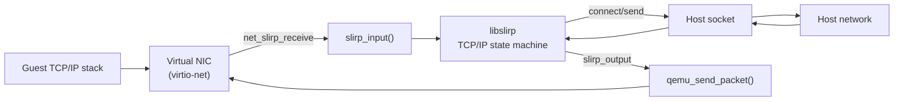
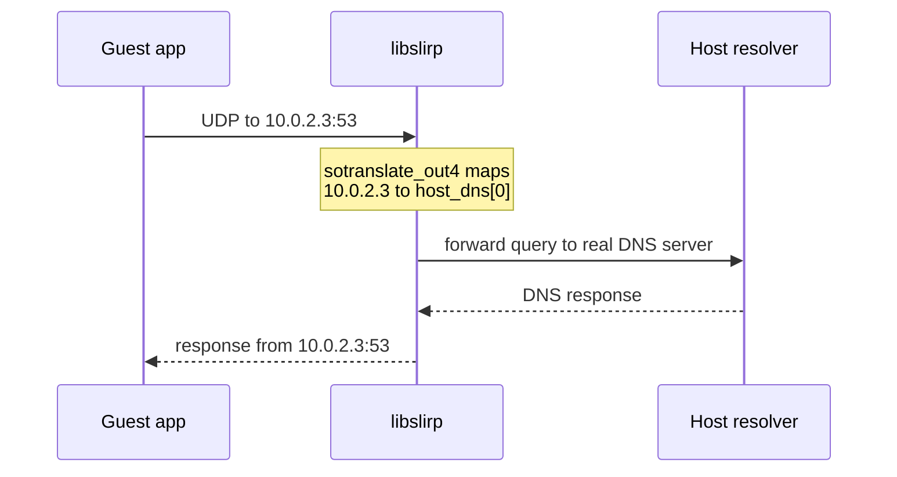
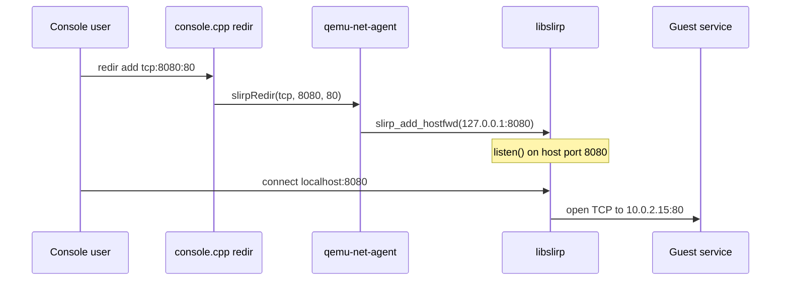
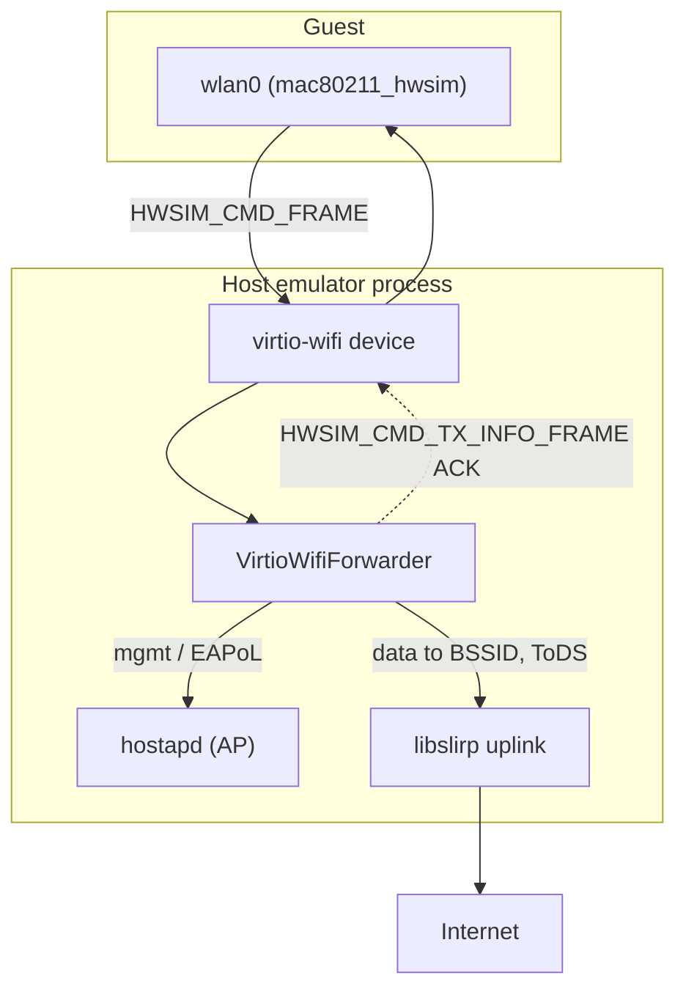
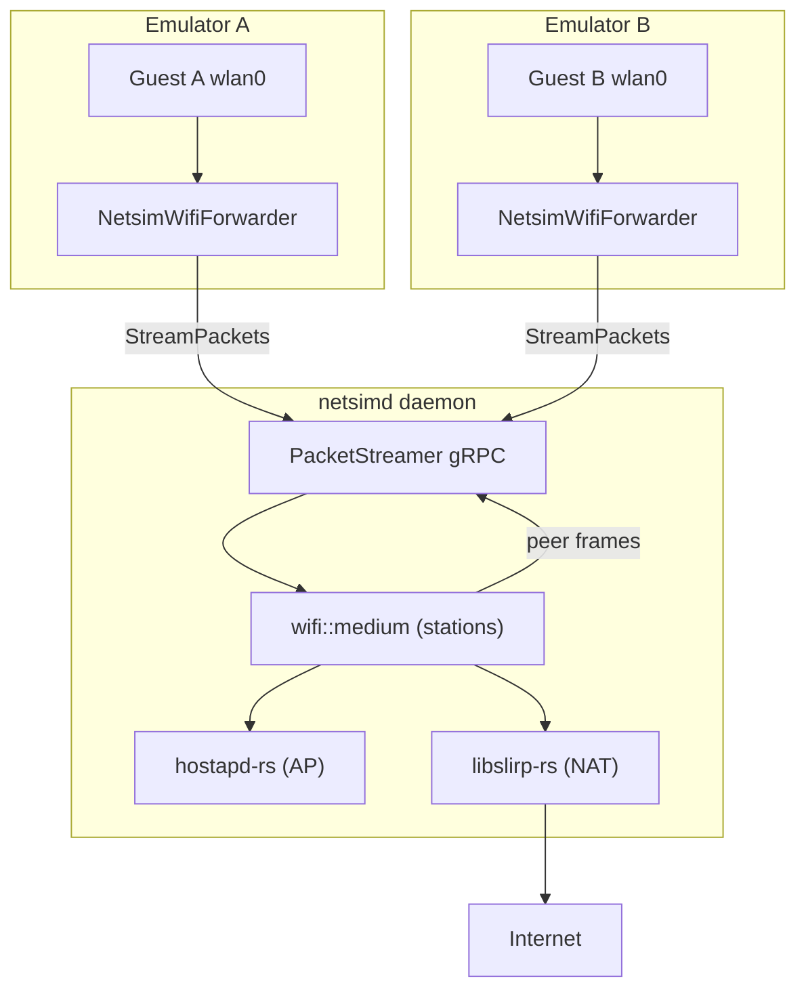

# Chapter 18: Networking

A booting Android system image expects to come up on a real network: it runs a DHCP client, queries DNS, opens TCP connections, and brings up a Wi-Fi interface. The emulator satisfies all of that without touching the host's physical NIC. By default there is no bridge, no TAP device, and no elevated privileges — instead a user-space library, libslirp, pretends to be an entire IP network. It answers the guest's DHCP request, hands it the address `10.0.2.15`, plays the role of the gateway at `10.0.2.2`, intercepts DNS at `10.0.2.3`, and translates every guest socket into an ordinary host socket. From the guest's point of view it is on a normal LAN; from the host's point of view the emulator is just another process opening connections.

This chapter follows a packet from the guest's virtual NIC out to the host and back. It covers the libslirp user-mode stack and its NAT, the fixed `10.0.2.x` addressing, the DHCP/DNS/TFTP services baked into slirp, port forwarding through the `redir` console command and `slirp_add_hostfwd`, the emulated Wi-Fi path built on `mac80211_hwsim` and a `virtio-wifi` device, and finally netsim — the gRPC packet streamer that lets multiple virtual devices share one simulated radio medium.

---

## 18.1 User-Mode Networking with libslirp

The emulator does not put the guest on the host's real network segment. Instead it links against libslirp, a self-contained TCP/IP stack that lives entirely in user space. libslirp is vendored at `external/libslirp/`, and its own README describes it as "a user-mode networking library used by virtual machines, containers or various tools" (`external/libslirp/README.md`). QEMU's networking glue wraps it in `external/qemu/net/slirp.c`, which exposes it to the rest of QEMU as a `NetClientState` of type `NET_CLIENT_DRIVER_USER`.

The defining property of user-mode networking is that the guest's packets never reach a host kernel network interface as packets. libslirp parses the Ethernet/IP/TCP headers itself and, when the guest opens a TCP connection, libslirp opens an ordinary host socket on the guest's behalf. The host kernel sees a normal `connect()` from the emulator process — no `CAP_NET_ADMIN`, no TAP device, no bridge. This is why the emulator can do networking with zero setup and zero privileges, and it is the mode every AVD uses unless you explicitly pass `-net-tap`.

### 18.1.1 The two slirp clients in the tree

There are two distinct slirp source bases in play, and it helps to keep them separate:

1. `external/libslirp/src/` is the upstream library: the actual TCP/IP state machine (`slirp.c`, `tcp_input.c`, `socket.c`, `bootp.c`, `tftp.c`).

2. `external/qemu/net/slirp.c` is QEMU's adapter. It owns the `SlirpState` struct, registers the QEMU `NetClientInfo`, and calls into libslirp through the public API declared in `external/libslirp/src/libslirp.h`.

The library is deliberately host-agnostic. It never calls `send()` itself; instead the embedder supplies a `SlirpCb` callback table and an opaque pointer, and libslirp calls back whenever it has a frame to deliver to the guest. The public entry point is `slirp_new` (`external/libslirp/src/slirp.c:600`), with a legacy `slirp_init` wrapper kept for compatibility (`external/libslirp/src/slirp.c:740`).

### 18.1.2 The packet path in QEMU's glue

`external/qemu/net/slirp.c` registers a `NetClientInfo` whose `receive` handler is the entry point for frames coming *from* the guest's virtual NIC, and whose paired `slirp_output` function is the exit point for frames going *to* the guest:

```c
// Source: external/qemu/net/slirp.c
static NetClientInfo net_slirp_info = {
    .type = NET_CLIENT_DRIVER_USER,
    .size = sizeof(SlirpState),
    .receive = net_slirp_receive,
    .cleanup = net_slirp_cleanup,
};
```

A guest-to-host frame arrives at `net_slirp_receive`, which (after optional traffic shaping) calls `net_slirp_receive_raw` and from there `slirp_input(s->slirp, buf, size)` — handing the raw Ethernet frame to the library (`external/qemu/net/slirp.c:145`). The reverse direction is `slirp_output`: when libslirp has assembled a frame for the guest it invokes this callback, which ultimately calls `qemu_send_packet(&s->nc, pkt, pkt_len)` to inject the frame into the guest's NIC (`external/qemu/net/slirp.c:123`).

Between those two functions sit two optional hooks the emulator splices in: a recv callback (`s->recv_cb`, used when Wi-Fi or netsim wants to intercept the stream) and a pair of traffic shapers (`s->shaper_out` / `s->shaper_in`) used to emulate cellular bandwidth and latency. Both are visible directly in `slirp_output`:

```c
// Source: external/qemu/net/slirp.c
void slirp_output(void *opaque, const uint8_t *pkt, int pkt_len)
{
    SlirpState *s = opaque;
    SlirpShaper* shaper = &s->shaper_out;
    if (s->recv_cb) {
        s->recv_cb(s->opaque, pkt, pkt_len);
    } else {
        if (shaper->send) {
          shaper->send(shaper->peer, pkt, pkt_len, (void *)s);
        } else {
          net_slirp_output_raw(opaque, pkt, pkt_len);
        }
    }
}
```

Guest-to-host frame flow through the user-mode stack



## 18.2 The Virtual Router and NAT

libslirp behaves like a small NAT router with a fixed topology. Every guest sees the same private `/24` network, the same gateway, and the same set of magic addresses. The defaults are hard-coded in `external/qemu/net/slirp.c` at the top of `net_slirp_init`:

```c
// Source: external/qemu/net/slirp.c
/* default settings according to historic slirp */
struct in_addr net  = { .s_addr = htonl(0x0a000200) }; /* 10.0.2.0 */
struct in_addr mask = { .s_addr = htonl(0xffffff00) }; /* 255.255.255.0 */
struct in_addr host = { .s_addr = htonl(0x0a000202) }; /* 10.0.2.2 */
struct in_addr dhcp = { .s_addr = htonl(0x0a00020f) }; /* 10.0.2.15 */
struct in_addr dns  = { .s_addr = htonl(0x0a000203) }; /* 10.0.2.3 */
```

These five values define the entire virtual LAN. The same constants appear again as strings in the Wi-Fi service builder (`external/qemu/android-qemu2-glue/emulation/WifiService.cpp:45`), confirming that the wired path and the Wi-Fi path share one addressing scheme.

### 18.2.1 The standard 10.0.2.x addresses

Each address in the `10.0.2.x` block has a fixed meaning that an Android developer can rely on across every emulator instance:

| Address | Role |
|---------|------|
| `10.0.2.1` | Reserved (router/gateway base in the historic layout) |
| `10.0.2.2` | The host loopback, as seen from the guest. Connections here reach `127.0.0.1` on the host. |
| `10.0.2.3` | The first virtual DNS server |
| `10.0.2.4` and up | Additional virtual DNS servers, one per host resolver |
| `10.0.2.15` | The guest's own address, leased by the slirp DHCP server |
| `255.255.255.0` | The netmask for the whole `10.0.2.0/24` segment |

Because `10.0.2.15` is assigned by DHCP and not negotiated, every emulator using user-mode networking comes up with that exact guest IP. That is why two emulators cannot talk to each other directly over user-mode networking — they both believe they are `10.0.2.15` on isolated networks — and why multi-device scenarios need netsim (Section 18.8) or Wi-Fi forwarding (Section 18.7).

### 18.2.2 Translating special addresses

The NAT magic lives in libslirp's `socket.c`. When the guest opens a connection whose destination is `10.0.2.2` (the virtual host), libslirp rewrites the target to the host's loopback before opening the real socket:

```c
// Source: external/libslirp/src/socket.c
if (so->so_faddr.s_addr == s->vhost_addr.s_addr ||
    so->so_faddr.s_addr == 0xffffffff) {
    if (s->disable_host_loopback) {
        return false;
    }
    sin->sin_addr = loopback_addr;
}
```

So a guest process connecting to `10.0.2.2:8080` ends up connected to `127.0.0.1:8080` on the host — this is the canonical way to reach a server running on your development machine. Outbound connections to ordinary public addresses are translated transparently: libslirp opens a host socket toward the real destination and shuttles bytes between the host socket and the guest's emulated TCP connection, so the guest never needs a route to the outside world.

When `restricted` mode is enabled, the guest is confined to the virtual services (DHCP, DNS, TFTP) and cannot reach arbitrary hosts. `net_slirp_init` logs which mode is active and passes `restricted` straight through to `slirp_init` (`external/qemu/net/slirp.c:405`).

NAT topology of the virtual router

```mermaid
flowchart TB
    subgraph GUEST["Guest (10.0.2.0/24)"]
        G["Guest 10.0.2.15"]
    end
    subgraph SLIRP["libslirp virtual router"]
        GW["Gateway / host alias 10.0.2.2"]
        DNS["Virtual DNS 10.0.2.3+"]
        DHCP["DHCP / BOOTP server"]
        TFTP["TFTP server"]
    end
    subgraph HOST["Host process"]
        LB["Host loopback 127.0.0.1"]
        EXT["Host sockets to Internet"]
        RESOLV["Host resolver"]
    end
    G -->|"to 10.0.2.2"| GW --> LB
    G -->|"to 10.0.2.3:53"| DNS --> RESOLV
    G -->|"DHCP DISCOVER"| DHCP
    G -->|"any other IP"| GW --> EXT
```



## 18.3 DHCP, BOOTP and TFTP Inside slirp

libslirp does not just route — it impersonates the standard network services a freshly booted guest expects. These live inside the library and answer guest broadcasts without ever touching the host.

### 18.3.1 The built-in DHCP server

When the guest's DHCP client broadcasts a `DHCPDISCOVER`, libslirp's BOOTP/DHCP server answers it. The lease pool starts at `vdhcp_startaddr`, which QEMU sets to `10.0.2.15`. The address allocation walks forward from that base:

```c
// Source: external/libslirp/src/bootp.c
paddr->s_addr = slirp->vdhcp_startaddr.s_addr + htonl(i);
```

Because the emulator only ever has one guest on the segment, `i` is effectively `0` and the guest always receives `10.0.2.15`. The DHCP reply also carries the gateway (`10.0.2.2`), the DNS server (`10.0.2.3`), and the netmask, so the guest's routing table is fully populated from the lease. The DHCP server can be suppressed via `disable_dhcp` in the `SlirpConfig` (`external/libslirp/src/slirp.c`).

### 18.3.2 The built-in TFTP server

libslirp also embeds a read-only TFTP server (`external/libslirp/src/tftp.c`), used historically for network boot. When a TFTP read request (`TFTP_RRQ`) arrives, the handler prepends the configured `tftp_prefix` to the requested filename:

```c
// Source: external/libslirp/src/tftp.c
/* prepend tftp_prefix */
prefix_len = strlen(slirp->tftp_prefix);
...
memcpy(spt->filename, slirp->tftp_prefix, prefix_len);
```

If no prefix is configured the TFTP server is effectively disabled (`external/libslirp/src/tftp.c:299`). The Android emulator does not normally rely on TFTP boot, but the service is present because it ships with upstream slirp.

## 18.4 DNS Handling

DNS is where the Android emulator's slirp diverges most from stock QEMU. The guest is told its DNS server is `10.0.2.3`, but that address does not host a resolver — libslirp intercepts traffic to it and forwards the queries to the host's real DNS servers.

### 18.4.1 Mapping virtual DNS addresses to host resolvers

The translation happens in `sotranslate_out4` in `external/libslirp/src/socket.c`. The emulator can hand libslirp a list of host DNS servers, and the library maps `10.0.2.3` to the first, `10.0.2.4` to the second, and so on:

```c
// Source: external/libslirp/src/socket.c
/* Mapping guest virtual DNS IPs (10.0.2.3, 10.0.2.4, etc.) to host DNS servers */
if (s->host_dns_count > 0) {
    int n, ipv4_dns_count = 0;
    for (n = 0; n < s->host_dns_count; ++n) {
        if (s->host_dns[n].ss_family != AF_INET) {
            continue;
        }
        if (faddr == dns_base + ipv4_dns_count) {
            dns_index = n;
            break;
        }
        ipv4_dns_count++;
        ...
    }
}
```

The same logic exists for IPv6 in `sotranslate_out6`, mapping the `vnameserver_addr6` base across the host's IPv6 resolvers (`external/libslirp/src/socket.c:1008`). Note the guard `if (so->so_fport != htons(53))` — only port 53 traffic to the virtual DNS address is rewritten; anything else is rejected. If no explicit host DNS list was supplied, libslirp falls back to `get_dns_addr` to discover the host's resolver.

### 18.4.2 Where the host DNS list comes from

On the emulator side, the host resolver list is gathered by `android_dns_get_servers` in `external/qemu/android/emu/utils/src/android/utils/dns.cpp`. It honors the `-dns-server` command-line option first, and otherwise queries the host's system resolvers:

```cpp
// Source: external/qemu/android/emu/utils/src/android/utils/dns.cpp
if (!dnsCount) {
    dnsCount = android_dns_get_system_servers(dnsServerIps, kMaxDnsServers);
    if (dnsCount < 0) {
        dnsCount = 0;
        dwarning("Cannot find system DNS servers! Name resolution will "
                 "be disabled.");
    }
}
```

The resulting list is pushed into the running slirp stack through `net_slirp_init_custom_dns_servers`, which iterates every slirp stack and calls `slirp_init_custom_dns_servers` (`external/qemu/net/slirp.c:1270`). When more than one DNS server is found, the guest is also told via the `ndns=` kernel parameter so its resolver knows how many virtual DNS addresses to use (`external/qemu/android/android-emu/android/main-kernel-parameters.cpp:112`).

DNS query path from guest to host resolver



## 18.5 Port Forwarding (redir / hostfwd)

User-mode networking is asymmetric: the guest can reach out, but the host cannot directly connect *in* to a guest port, because the guest is hidden behind NAT at `10.0.2.15`. Port forwarding solves this by telling libslirp to listen on a host port and splice incoming connections through to a guest port. This is the same mechanism behind QEMU's `hostfwd=` and the emulator console's `redir` command.

### 18.5.1 The redir console command

Connect to the emulator's console (`telnet localhost 5554`) and the `redir` command manages forwardings. The handler `do_redir_add` lives in `external/qemu/android/android-emu/android/console.cpp`. It parses a `(tcp|udp):hostport:guestport` spec, rejects duplicates, records the redirection, and then calls into the network agent:

```cpp
// Source: external/qemu/android/android-emu/android/console.cpp
ret = ipv6 ? client->global->net_agent->slirpRedirIpv6(
                     host_proto, host_port, guest_port)
           : client->global->net_agent->slirpRedir(host_proto, host_port,
                                                   guest_port);
if (!ret) {
    control_write(client,
                  "KO: can't setup redirection, port probably used by "
                  "another program on host\r\n");
    ...
}
```

`do_redir_list` prints the active table and `do_redir_del` tears an entry down (`external/qemu/android/android-emu/android/console.cpp:1136`). Before adding anything, the handler checks `net_agent->isSlirpInited()` — if the emulator is running with a TAP interface instead of slirp, redirection is unavailable and the command returns `KO: network emulation disabled`.

### 18.5.2 Down into libslirp

The console agent is implemented in `external/qemu/android-qemu2-glue/qemu-net-agent-impl.c`. `slirpRedir` binds the forward to the host loopback and forwards a wildcard guest address (`0`), letting slirp default it to the guest:

```c
// Source: external/qemu/android-qemu2-glue/qemu-net-agent-impl.c
static bool slirpRedir(bool isUdp, int hostPort, int guestPort) {
    struct in_addr host = { .s_addr = htonl(SOCK_ADDRESS_INET_LOOPBACK) };
    struct in_addr guest = { .s_addr = 0 };
    return slirp_add_hostfwd(net_slirp_state(), isUdp, host, hostPort, guest,
                             guestPort) == 0;
}
```

`slirp_add_hostfwd` is the libslirp public API (`external/libslirp/src/libslirp.h:254`). Internally, QEMU's `slirp_hostfwd` parses the textual spec and calls the same `slirp_add_hostfwd` (`external/qemu/net/slirp.c:684`); the human-facing `hostfwd=` netdev option and the QMP `hmp_hostfwd_add` path (`external/qemu/net/slirp.c:812`) all converge there. There is an IPv6 twin, `slirp_add_ipv6_hostfwd`, reached through `slirpRedirIpv6`.

The most visible everyday use of this machinery is adb: the emulator automatically forwards a host console/adb port to the guest's adb daemon, which is why `adb connect localhost:<port>` reaches a guest that has no host-visible IP of its own.

Setting up and using a port redirection



## 18.6 Traffic Shaping: netspeed and netdelay

The emulator can imitate slow cellular links by rate-limiting and delaying frames as they cross the slirp boundary. The shaper objects (`android_net_shaper_out`, `android_net_shaper_in`) and the delay object (`android_net_delay_in`) are created in `android_qemu_init_slirp_shapers` in `external/qemu/android-qemu2-glue/net-android.cpp`. That function wires the shapers into the slirp callbacks via `net_slirp_set_shapers`:

```cpp
// Source: external/qemu/android-qemu2-glue/net-android.cpp
netshaper_set_rate(android_net_shaper_out, android_net_download_speed);
netshaper_set_rate(android_net_shaper_in, android_net_upload_speed);

net_slirp_set_shapers(
        android_net_shaper_out,
        [](void* opaque, const void* data, int len, void* slirp_state) {
            if (qemu_tcpdump_active) {
                qemu_tcpdump_packet(data, len);
            }
            ...
```

The shaper callbacks also tap into packet capture: if `-tcpdump <file>` is active, every shaped frame is handed to `qemu_tcpdump_packet`, so the capture sees exactly what crosses the virtual wire. The shaper threads are skipped entirely when slirp is not running (`net_slirp_state() == nullptr`), since TAP mode has nothing to shape.

### 18.6.1 The speed and latency presets

The rate and latency values come from named presets defined in `external/qemu/android/emu/cmdline/include/android/network/constants.h`. The `ANDROID_NETWORK_LIST_MODES` X-macro enumerates the radio technologies the emulator can imitate, each with upload/download rates and latency bounds:

```c
// Source: external/qemu/android/emu/cmdline/include/android/network/constants.h
#define ANDROID_NETWORK_LIST_MODES(X) \
    X(gsm,   "GSM/CD",        14.4,     14.4, 150, 550) \
    X(hscsd, "HSCSD",         14.4,     57.6,  80, 400) \
    X(gprs,  "GPRS",          28.8,     57.6,  35, 200) \
    X(umts,  "UMTS/3G",      384.0,    384.0,  35, 200) \
    X(edge,  "EDGE/EGPRS",   473.6,    473.6,  80, 400) \
    X(hsdpa, "HSDPA",       5760.0,  13980.0,   0,   0) \
    X(lte,   "LTE",        58000.0, 173000.0,   0,   0) \
    X(evdo,  "EVDO",       75000.0, 280000.0,   0,   0) \
```

The console `network speed` and `network delay` commands (`do_network_speed` / `do_network_delay` in `external/qemu/android/android-emu/android/console.cpp:933`) parse these names and update the global `android_net_upload_speed`, `android_net_download_speed`, and the min/max latency through `android_network_set_speed` / `android_network_set_latency` (`external/qemu/android/android-emu/android/network/control.cpp`). The shaper picks up the new rate on the next frame.

These same globals are declared in `external/qemu/android/android-emu/android/network/globals.h`, which also carries `android_net_disable` — the flag that drops all guest traffic when the UI toggles "data off".

## 18.7 Emulated Wi-Fi: virtio-wifi and mac80211_hwsim

Modern Android system images expect a real Wi-Fi interface (`wlan0`), a supplicant, and an access point to associate with. The emulator provides all three without any radio hardware by combining three pieces:

1. The Linux kernel's `mac80211_hwsim` driver inside the guest, which presents a fully software-simulated 802.11 radio.

2. A `virtio-wifi` PCI device that carries `mac80211_hwsim` netlink frames between the guest driver and the host.

3. `hostapd` running on the host, acting as the access point the guest associates with.

### 18.7.1 Bringing up the radio in the guest

The number of simulated radios is chosen at boot time via kernel command line. `external/qemu/android/android-emu/android/main-kernel-parameters.cpp` sets `mac80211_hwsim.radios` based on which Wi-Fi feature is enabled:

```cpp
// Source: external/qemu/android/android-emu/android/main-kernel-parameters.cpp
if (android::featurecontrol::isEnabled(
                             android::featurecontrol::VirtioWifi)) {
    android::featurecontrol::setIfNotOverriden(
            android::featurecontrol::Wifi, false);
    if (apiLevel <= 30) {
        params.add("mac80211_hwsim.radios=1");
        ...
    }
} else if (android::featurecontrol::isEnabled(
                   android::featurecontrol::Wifi)) {
    if (!android::featurecontrol::isEnabled(
                android::featurecontrol::Mac80211hwsimUserspaceManaged)) {
        params.add("mac80211_hwsim.radios=2");
    }
    ...
}
```

The older `Wifi` path uses two radios (one for the station, one for the AP) plus `mac80211_hwsim.channels=2` so the kernel can scan one channel while talking on another. The newer `VirtioWifi` path pushes AP duties out to host-side `hostapd` and needs fewer in-kernel radios. The guest is also told which transport to use through boot properties such as `androidboot.qemu.virtiowifi` and `androidboot.qemu.wifi` (`external/qemu/android/android-emu/android/userspace-boot-properties.cpp:229`).

### 18.7.2 The virtio-wifi device

On the host side, the `virtio-wifi` device is defined in `external/qemu/android-qemu2-glue/emulation/virtio-wifi.h`. It is a standard virtio device with paired RX/TX virtqueues and a MAC address:

```cpp
// Source: external/qemu/android-qemu2-glue/emulation/virtio-wifi.h
typedef struct VirtIOWifi {
    VirtIODevice parent_obj;
    uint8_t mac[ETH_ALEN];
    uint16_t status;
    int32_t tx_burst;
    VirtIOWifiQueue* vqs;
    NICConf nic_conf;
    DeviceState* qdev;
} VirtIOWifi;
```

The header also exposes `virtio_wifi_set_mac_prefix`, called at setup time with the emulator's serial-number port so that multiple emulators get distinct MAC ranges and don't collide (`external/qemu/android-qemu2-glue/qemu-setup.cpp:699`), and `virtio_wifi_ssid_to_ethaddr`, used by the console `wifi` block/unblock commands to map an SSID to a router MAC.

### 18.7.3 The forwarder: hostapd, slirp and 802.11 frames

The component that ties the guest radio, the host AP, and the Internet together is `VirtioWifiForwarder` (`external/qemu/android-qemu2-glue/emulation/VirtioWifiForwarder.cpp`). It opens a socket pair to `hostapd`, registers a QEMU NIC for the slirp uplink, and inspects every 802.11 frame the guest transmits to decide where it should go:

```cpp
// Source: external/qemu/android-qemu2-glue/emulation/VirtioWifiForwarder.cpp
// Data frames
if (frame->isData()) {
    // EAPoL is used in Wi-Fi 4-way handshake.
    if (frame->isEAPoL()) {
        ... socketSend(mVirtIOSock.get(), ...);   // to hostapd
    } else if (addr1 != mBssID) {
        sendToRemoteVM(std::move(frame), FrameType::Data);  // to a peer emulator
    } else if (frame->isToDS() && !frame->isFromDS()) {
        return sendToNIC(std::move(frame));        // up through slirp to Internet
    }
}
```

The decision tree mirrors how a real AP behaves: management and control frames and the EAPoL handshake go to `hostapd` over the socket pair; data frames addressed to the BSSID and flagged "to distribution system" are bridged out to the Internet through the slirp NIC; and frames addressed elsewhere are forwarded to a peer VM. The `WifiService::Builder` in `external/qemu/android-qemu2-glue/emulation/WifiService.cpp` constructs all of this, initializing a dedicated slirp stack with the same `10.0.2.x` addresses and a fixed BSSID:

```cpp
// Source: external/qemu/android-qemu2-glue/emulation/WifiService.cpp
static const uint8_t kBssID[] = {0x00, 0x13, 0x10, 0x85, 0xfe, 0x01};
static const char* kNetwork = "10.0.2.0";
static const char* kMask = "255.255.255.0";
static const char* kHost = "10.0.2.2";
static const char* kDhcp = "10.0.2.15";
static const char* kDns = "10.0.2.3";
```

Frames cross the virtio-wifi boundary as `mac80211_hwsim` generic-netlink messages (`HWSIM_CMD_FRAME`). The forwarder parses them with `GenericNetlinkMessage` and acknowledges each transmitted frame back to the guest with a `HWSIM_CMD_TX_INFO_FRAME` carrying `HWSIM_TX_STAT_ACK`, so the guest's radio stack believes its frame was delivered (`external/qemu/android-qemu2-glue/emulation/VirtioWifiForwarder.cpp:209`).

The emulated Wi-Fi datapath



## 18.8 netsim: Multi-Device Network Simulation

A single emulator's slirp and Wi-Fi serve one guest. To let *several* virtual devices share a simulated radio environment — so a phone AVD can actually discover and pair with a watch AVD over Bluetooth, or two emulators can join the same Wi-Fi network — the emulator connects to **netsim**, a standalone daemon living at `tools/netsim/`. Its README calls it "a network simulation tool for multi-device use cases ... It offers radio level control and HCI tracing" (`tools/netsim/README.md`).

### 18.8.1 The packet streamer protocol

netsim's wire protocol is a bidirectional gRPC stream defined in `tools/netsim/proto/netsim/packet_streamer.proto`. Each virtual radio chip in a guest opens one stream and exchanges raw radio packets with the daemon:

```proto
// Source: tools/netsim/proto/netsim/packet_streamer.proto
service PacketStreamer {
  // Attach a virtual radio controller to the network simulation.
  rpc StreamPackets(stream PacketRequest) returns (stream PacketResponse);
}
```

The proto comment describes the architecture precisely: "AVDs running in a guest VM are built with virtual controllers for each radio chip. These controllers route chip requests to host emulators (qemu and crosvm) using virtio and from there they are forwarded to this gRpc service ... the network simulator contains libraries to emulate Bluetooth, 80211MAC, UWB, and Rtt chips." The first message on each stream is a `ChipInfo` identifying the device and chip kind; subsequent messages carry either an `HCIPacket` (Bluetooth) or an opaque `bytes packet` (Wi-Fi and other radios).

### 18.8.2 Connecting the emulator to netsim

On the emulator side, the client is `external/qemu/android/third_party/netsim/backend/packet_streamer_client.cc`. It builds a gRPC channel to a local `netsimd` process (default endpoint `localhost:<port>`), launching the daemon if it is not already running:

```cpp
// Source: external/qemu/android/third_party/netsim/backend/packet_streamer_client.cc
endpoint = "localhost:" + port.value();
...
return grpc::experimental::CreateCustomChannelWithInterceptors(
    endpoint, grpc::InsecureChannelCredentials(), args, ...);
```

The emulator registers itself with netsim through `register_netsim`, passing the packet-streamer endpoint, the host DNS, the HTTP proxy, and any extra `netsim_args` (`external/qemu/android-qemu2-glue/qemu-setup.cpp:312`). All of these are exposed as command-line options: `-packet-streamer-endpoint`, `-netsim-args` (`external/qemu/android/emu/cmdline/include/android/cmdline-options.h:260`).

### 18.8.3 Wi-Fi over netsim

When the Wi-Fi feature is built against netsim (`NETSIM_WIFI`), the `WifiService::Builder` returns a `NetsimWifiForwarder` instead of the local-slirp `VirtioWifiForwarder`:

```cpp
// Source: external/qemu/android-qemu2-glue/emulation/WifiService.cpp
if (mRedirectToNetsim) {
    return std::static_pointer_cast<WifiService>(
            std::make_shared<NetsimWifiForwarder>(sOnReceiveCallback,
                                                  mCanReceive));
}
```

The `NetsimWifiForwarder` (`external/qemu/android-qemu2-glue/netsim/NetsimWifiForwarder.cpp`) opens a `PacketStreamer` stream with chip kind WIFI and ships each guest `HWSIM_CMD_FRAME` to the daemon as a `bytes packet`. Inside the daemon, the Rust `medium` module (`tools/netsim/rust/daemon/src/wifi/medium.rs`) tracks every connected device as a `Station` keyed by MAC address and routes frames between them — delivering a frame to a known peer station if the destination MAC is registered, re-broadcasting multicast and broadcast frames to all stations, and otherwise sending data frames out to the Internet through netsim's own libslirp wrapper:

```rust
// Source: tools/netsim/rust/daemon/src/wifi/medium.rs
if self.contains_station(&dest_addr) {
    if !self.debug.debug_no_wmedium {
        processor.wmedium = true;
    }
    return Ok(processor);
}
if dest_addr.is_multicast() ... {
    processor.wmedium = true;
}
```

netsim hosts its own libslirp instance (the `libslirp-rs` crate at `tools/netsim/rust/libslirp-rs/`, "a wrapper for libslirp C library") so that guests sharing the simulated medium still get NAT'd Internet access, and its own `hostapd` (the `hostapd-rs` crate) to act as the shared access point. The result is that two emulators pointed at the same netsim daemon are no longer isolated — frames from one guest's `wlan0` reach the other guest's `wlan0` because both are stations in the same `Medium`.

Two emulators sharing one simulated medium via netsim



## 18.9 TAP Mode: Bypassing slirp

For workloads that need real layer-2 connectivity — running the guest on the host's actual network segment, or capturing traffic with external tools — the emulator can replace user-mode networking with a host TAP interface. This is selected with `-net-tap <interface>` (`external/qemu/android/emu/cmdline/include/android/cmdline-options.h:158`), with optional `-net-tap-script-up` and `-net-tap-script-down` hooks to configure the interface when it comes up and down.

In TAP mode there is no libslirp stack: `net_slirp_state()` returns null, so the redirection commands report `network emulation disabled` and the traffic shapers are never installed (`external/qemu/android-qemu2-glue/net-android.cpp:29`). The guest's frames go straight to the TAP device and onto whatever bridge the host has configured, which means the guest gets a real address from the host network's DHCP rather than the synthetic `10.0.2.15`, and the `10.0.2.x` conveniences (host alias, virtual DNS) no longer apply. TAP mode trades the zero-setup convenience of slirp for genuine network presence.

## 18.10 Try It

Hands-on with the emulator's networking, using a running AVD:

- See the guest's slirp-assigned address and gateway: `adb shell ip addr show eth0` then `adb shell ip route` — the guest reports `10.0.2.15` with a default route via `10.0.2.2`.

- Confirm the virtual DNS server the guest was handed: `adb shell getprop | grep dns` and `adb shell cat /etc/resolv.conf` (or use `adb shell getprop net.dns1`), which should show `10.0.2.3`.

- Reach a server on your development machine from inside the guest. Start any HTTP server on the host (for example on port 8000), then from the guest run `adb shell curl http://10.0.2.2:8000` — `10.0.2.2` is the host loopback alias.

- Add a port forward through the console. Run `telnet localhost 5554` (use your AVD's console port), authenticate with the token from `~/.emulator_console_auth_token`, then `redir add tcp:8080:5000` to forward host port 8080 to guest port 5000, and `redir list` to see the active table.

- Throttle the link to a slow cellular profile: in the same console session run `network speed edge` and `network delay umts`, then run a download inside the guest to feel the difference; `network speed full` removes the cap.

- Capture the virtual wire: launch with `emulator -avd <name> -tcpdump capture.pcap`, exercise the guest, then open `capture.pcap` in Wireshark to see exactly what crossed the slirp boundary.

- Inspect emulated Wi-Fi inside the guest: `adb shell ip link show wlan0` and `adb shell iw dev wlan0 link` show the `mac80211_hwsim`-backed interface and its association with the host AP.

## Summary

- The emulator's default networking is user-mode: libslirp (`external/libslirp/`) is a complete user-space TCP/IP stack that NATs guest traffic into ordinary host sockets, needing no TAP device, bridge, or privileges.

- QEMU's adapter `external/qemu/net/slirp.c` bridges the guest virtual NIC to libslirp: `net_slirp_receive` / `slirp_input` carry guest-to-host frames, and `slirp_output` / `qemu_send_packet` carry host-to-guest frames.

- The virtual LAN is fixed at `10.0.2.0/24`: `10.0.2.2` is the host loopback alias, `10.0.2.3+` are the virtual DNS servers, and the guest is always DHCP-leased `10.0.2.15` (`external/qemu/net/slirp.c:201`).

- libslirp embeds DHCP/BOOTP (`bootp.c`) and TFTP (`tftp.c`) servers, and rewrites special destinations — `10.0.2.2` to `127.0.0.1`, and `10.0.2.3`/`10.0.2.4`… to the host's real resolvers — in `socket.c`.

- Port forwarding is reachable through the console `redir` command (`console.cpp`) and the `slirpRedir` agent (`qemu-net-agent-impl.c`), both bottoming out in `slirp_add_hostfwd`; this is how `adb connect` reaches a NAT-hidden guest.

- Traffic shaping (`net-android.cpp`) injects bandwidth and latency limits from named cellular presets (`constants.h`) and feeds `-tcpdump` capture.

- Emulated Wi-Fi combines the guest's `mac80211_hwsim` radio, a host `virtio-wifi` device, and host `hostapd`, with `VirtioWifiForwarder` routing 802.11 frames between the AP, the slirp uplink, and peer VMs.

- netsim (`tools/netsim/`) is a standalone daemon that lets multiple virtual devices share one simulated radio medium over a `PacketStreamer` gRPC stream, with its own Rust-wrapped libslirp and hostapd for shared NAT and AP duties.

- TAP mode (`-net-tap`) bypasses slirp entirely for real layer-2 connectivity, at the cost of slirp's zero-setup conveniences.

### Key Source Files

| File | Purpose |
|------|---------|
| `external/qemu/net/slirp.c` | QEMU glue around libslirp; `10.0.2.x` defaults, hostfwd, custom DNS |
| `external/libslirp/src/slirp.c` | libslirp core; `slirp_new` and the TCP/IP state machine |
| `external/libslirp/src/socket.c` | NAT address translation and virtual-DNS-to-host-resolver mapping |
| `external/libslirp/src/bootp.c` | Built-in DHCP/BOOTP server that leases `10.0.2.15` |
| `external/qemu/android-qemu2-glue/qemu-net-agent-impl.c` | Network agent: `slirpRedir`, `slirpUnredir`, SSID blocking |
| `external/qemu/android/android-emu/android/console.cpp` | Console `redir` and `network speed`/`delay` command handlers |
| `external/qemu/android-qemu2-glue/net-android.cpp` | Traffic shapers and tcpdump tap |
| `external/qemu/android-qemu2-glue/emulation/VirtioWifiForwarder.cpp` | 802.11 frame routing between guest radio, hostapd, and slirp |
| `external/qemu/android-qemu2-glue/emulation/WifiService.cpp` | Wi-Fi service builder; slirp config and BSSID for emulated Wi-Fi |
| `tools/netsim/proto/netsim/packet_streamer.proto` | gRPC packet-streamer protocol for multi-device simulation |
| `tools/netsim/rust/daemon/src/wifi/medium.rs` | netsim Wi-Fi medium; per-station frame routing |
