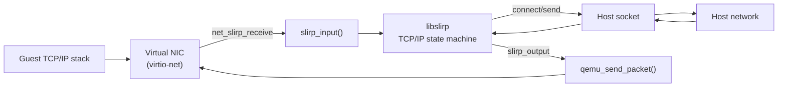
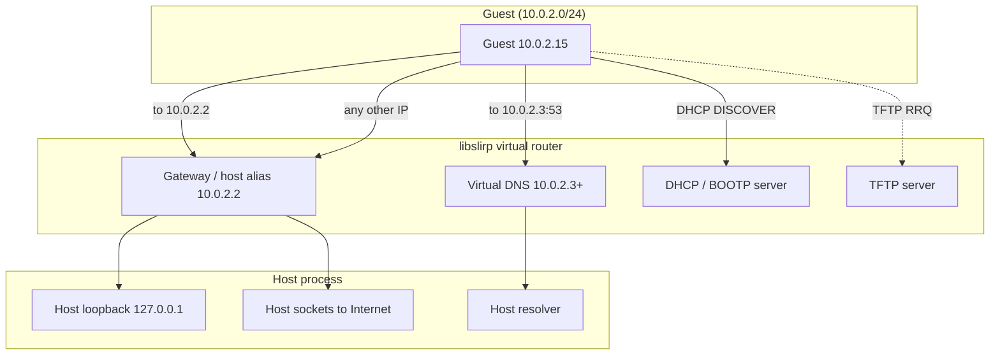
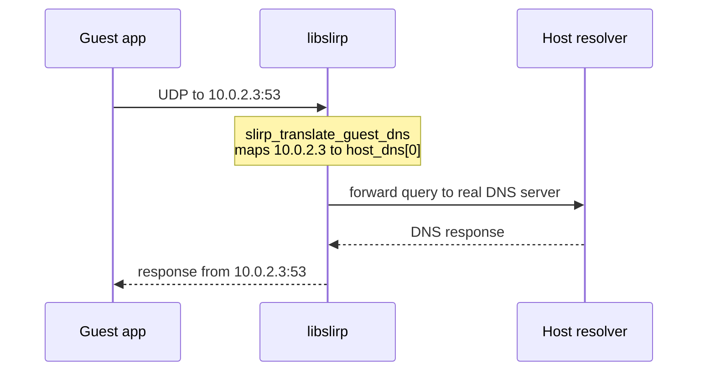
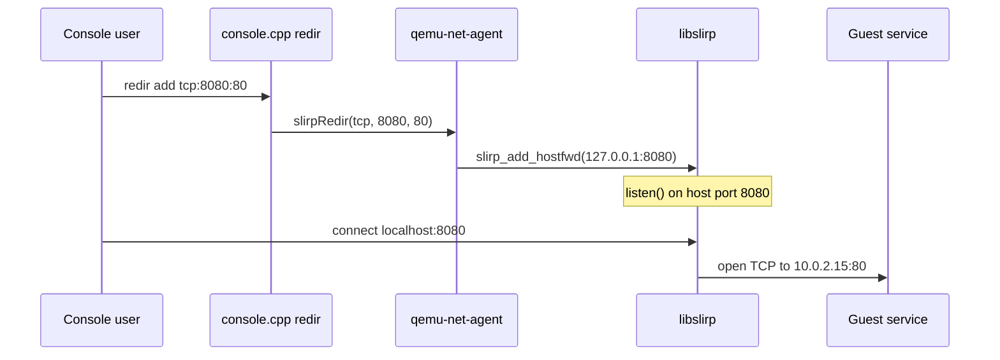
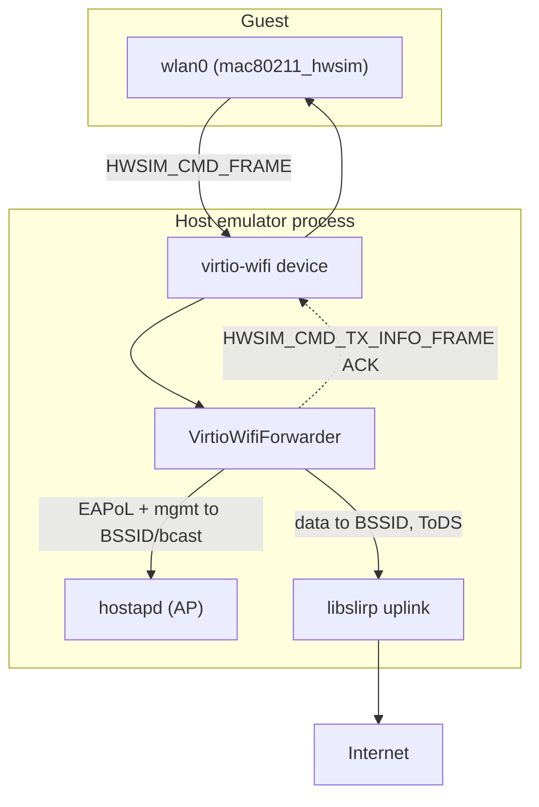
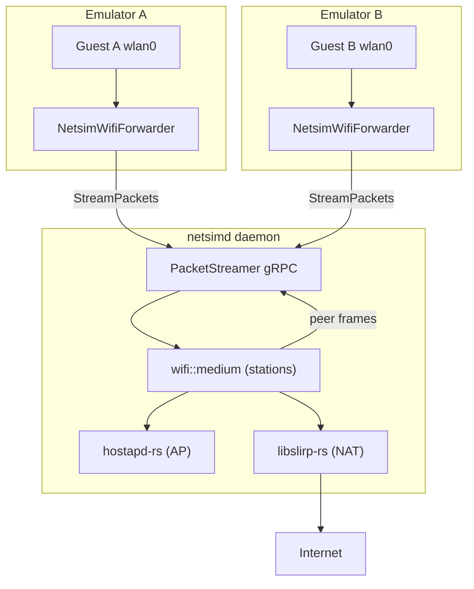

# Chapter 18: Networking

An Android system image expects to boot on a real network. It runs a DHCP client, queries DNS, opens TCP connections, and brings up a Wi-Fi interface. The emulator satisfies all of that and does not touch the host's physical NIC.

By default there is no bridge, no TAP device, and no elevated privileges. Instead, a user-space library, libslirp, pretends to be an entire IP network. It answers the guest's DHCP request and gives the guest the address `10.0.2.15`. It plays the role of the gateway at `10.0.2.2`, and it intercepts DNS at `10.0.2.3`.

libslirp also translates every guest socket into an ordinary host socket. From the guest's point of view, it is on a normal LAN. From the host's point of view, the emulator is just another process that opens connections.

This chapter follows a packet from the guest's virtual NIC out to the host and back. It covers the libslirp user-mode stack and its NAT, the fixed `10.0.2.x` addressing, and the DHCP/DNS/TFTP services that slirp contains. It then explains port forwarding through the `redir` console command and `slirp_add_hostfwd`. Next, it describes the emulated Wi-Fi path, which uses `mac80211_hwsim` and a `virtio-wifi` device. Finally, it introduces netsim, the gRPC packet streamer that lets multiple virtual devices share one simulated radio medium.

---

## 18.1 User-Mode Networking with libslirp

The emulator does not put the guest on the host's real network segment. Instead it links against libslirp, a self-contained TCP/IP stack that lives entirely in user space. The source tree contains a copy of libslirp at `external/libslirp/`. The libslirp README describes it as "a user-mode networking library used by virtual machines, containers or various tools" (`external/libslirp/README.md`). QEMU's networking glue wraps it in `external/qemu/net/slirp.c`, which exposes it to the rest of QEMU as a `NetClientState` of type `NET_CLIENT_DRIVER_USER`.

The defining property of user-mode networking is that the guest's packets never reach a network interface of the host kernel as packets. The libslirp library parses the Ethernet/IP/TCP headers itself. When the guest opens a TCP connection, libslirp opens an ordinary host socket on the guest's behalf.

The host kernel sees a normal `connect()` from the emulator process. This setup needs no `CAP_NET_ADMIN`, no TAP device, and no bridge. This is why the emulator can do networking with zero setup and zero privileges. User-mode networking is the mode every AVD uses unless you explicitly pass `-net-tap`.

### 18.1.1 The three slirp components in the tree

There are three distinct slirp components in use, and it helps to keep them separate:

1. `external/qemu/slirp/` is the bundled slirp library — a copy of an older libslirp — that QEMU's main user-mode networking stack uses directly. `external/qemu/slirp/libslirp.h` declares its public API. Its primary entry point is `slirp_init` (`external/qemu/slirp/slirp.c:556`).

2. `external/libslirp/src/` is the standalone upstream library: the actual TCP/IP state machine (`slirp.c`, `tcp_input.c`, `socket.c`, `bootp.c`, `tftp.c`). The Wi-Fi and netsim paths use this version. Its modern entry point is `slirp_new` (`external/libslirp/src/slirp.c:600`), which accepts a `SlirpCb` callback table.

3. `external/qemu/net/slirp.c` is QEMU's adapter for the main networking path. It owns the `SlirpState` struct, registers the QEMU `NetClientInfo`, and wraps the bundled library through `#include "slirp/libslirp.h"`.

The bundled copy in `external/qemu/slirp/` parses attacker-controlled guest packets inside the emulator's own address space. It received a round of hardening for exactly that reason. `ip_reass` now unlinks an overlapping fragment with `ip_deq` before it frees the mbuf of the fragment. This closes a use-after-free on the neighbor pointers that the function updates afterwards (`external/qemu/slirp/ip_input.c:312`). The same function also caps a reassembled datagram at `IP_MAXPACKET`, so a truncated 16-bit length cannot become a heap overflow (`external/qemu/slirp/ip_input.c:337`).

`arp_input` rejects anything shorter than a full 42-byte Ethernet + ARP frame before it dereferences the header. This stops an out-of-bounds read on short guest ARP packets (`external/qemu/slirp/slirp.c:1067`). The ARP and DHCP length checks first used `sizeof()` of the C structs. That broke networking on TV AVDs, so both checks now measure the physical wire sizes instead.

The ARP check now uses 28 bytes of ARP payload, not a `slirp_arphdr` that a compiler may pad to 32. The DHCP check now uses the fixed 264-byte BOOTP header. The old DHCP check used the 576-byte padded `struct bootp_t` and dropped legitimate variable-length guest DHCP requests (`external/qemu/slirp/bootp.c:347`).

Both libraries are deliberately host-agnostic. They never call `send()` themselves. Instead, they call back through registered function pointers when they have a frame to deliver to the guest. The standalone library exposes this as a `SlirpCb` callback struct passed to `slirp_new`. The netsim Wi-Fi driver (`external/qemu/android-qemu2-glue/netsim/libslirp_driver.cpp`) declares such a struct and uses it.

### 18.1.2 The packet path in QEMU's glue

`external/qemu/net/slirp.c` registers a `NetClientInfo`. Its `receive` handler is the entry point for frames that come *from* the guest's virtual NIC. Its paired `slirp_output` function is the exit point for frames that go *to* the guest:

```c
// Source: external/qemu/net/slirp.c
static NetClientInfo net_slirp_info = {
    .type = NET_CLIENT_DRIVER_USER,
    .size = sizeof(SlirpState),
    .receive = net_slirp_receive,
    .cleanup = net_slirp_cleanup,
};
```

A guest-to-host frame arrives at `net_slirp_receive`. After optional traffic shaping, this function calls `net_slirp_receive_raw`, and from there `slirp_input(s->slirp, buf, size)`. That call hands the raw Ethernet frame to the library (`external/qemu/net/slirp.c:145`). The reverse direction is `slirp_output`. When libslirp assembles a frame for the guest, it invokes this callback. The callback ultimately calls `qemu_send_packet(&s->nc, pkt, pkt_len)` to inject the frame into the guest's NIC (`external/qemu/net/slirp.c:129`).

The emulator inserts two optional hooks between those two functions. The first is a recv callback (`s->recv_cb`), which Wi-Fi or netsim uses when it wants to intercept the stream. The second is a pair of traffic shapers (`s->shaper_out` / `s->shaper_in`) that emulate cellular bandwidth and latency. `s->recv_cb` and `s->shaper_out` are visible in `slirp_output`. `s->shaper_in` is the symmetric hook in `net_slirp_receive` (line 151), which shapes guest-to-host traffic:

```c
// Source: external/qemu/net/slirp.c
void slirp_output(void *opaque, const uint8_t *pkt, int pkt_len)
{
    SlirpState *s = opaque;
    SlirpShaper* shaper = &s->shaper_out;
    if (s->recv_cb) {
        s->recv_cb(s->opaque, pkt, pkt_len);
    } else {
        if (shaper->send) {
          shaper->send(shaper->peer, pkt, pkt_len, (void *)s);
        } else {
          net_slirp_output_raw(opaque, pkt, pkt_len);
        }
    }
}
```

Guest-to-host frame flow through the user-mode stack


```mermaid
flowchart LR
    GUEST["Guest TCP/IP stack"] --> NIC["Virtual NIC<br/>(virtio-net)"]
    NIC -->|"net_slirp_receive"| RECV["slirp_input()"]
    RECV --> LIB["libslirp<br/>TCP/IP state machine"]
    LIB -->|"connect/send"| HSOCK["Host socket"]
    HSOCK --> NET["Host network"]
    NET --> HSOCK
    HSOCK --> LIB
    LIB -->|"slirp_output"| OUT["qemu_send_packet()"]
    OUT --> NIC
```

## 18.2 The Virtual Router and NAT

libslirp behaves like a small NAT router with a fixed topology. Every guest sees the same private `/24` network, the same gateway, and the same set of magic addresses. `external/qemu/net/slirp.c` hard-codes the defaults at the top of `net_slirp_init`:

```c
// Source: external/qemu/net/slirp.c
/* default settings according to historic slirp */
struct in_addr net  = { .s_addr = htonl(0x0a000200) }; /* 10.0.2.0 */
struct in_addr mask = { .s_addr = htonl(0xffffff00) }; /* 255.255.255.0 */
struct in_addr host = { .s_addr = htonl(0x0a000202) }; /* 10.0.2.2 */
struct in_addr dhcp = { .s_addr = htonl(0x0a00020f) }; /* 10.0.2.15 */
struct in_addr dns  = { .s_addr = htonl(0x0a000203) }; /* 10.0.2.3 */
```

These five values define the entire virtual LAN. The same constants appear again as strings in the Wi-Fi service builder (`external/qemu/android-qemu2-glue/emulation/WifiService.cpp:45`). This confirms that the wired path and the Wi-Fi path share one addressing scheme.

### 18.2.1 The standard 10.0.2.x addresses

Each address in the `10.0.2.x` block has a fixed meaning that an Android developer can rely on across every emulator instance:

| Address | Role |
|---------|------|
| `10.0.2.1` | Reserved (router/gateway base in the historic layout) |
| `10.0.2.2` | The host loopback, as the guest sees it. Connections here reach `127.0.0.1` on the host. |
| `10.0.2.3` | The first virtual DNS server |
| `10.0.2.4` and up | More virtual DNS servers, one per host resolver |
| `10.0.2.15` | The guest's own address, which the slirp DHCP server leases |
| `255.255.255.0` | The netmask for the whole `10.0.2.0/24` segment |

Because DHCP assigns `10.0.2.15` and does not negotiate it, every emulator that uses user-mode networking starts with that exact guest IP. That is why two emulators cannot talk to each other directly over user-mode networking. They both believe they are `10.0.2.15` on isolated networks. This is also why multi-device scenarios need netsim (Section 18.8) or Wi-Fi forwarding (Section 18.7).

### 18.2.2 Translating special addresses

The NAT magic lives in libslirp's `socket.c`. When the guest opens a connection to `10.0.2.2` (the virtual host), libslirp rewrites the target to the host's loopback before it opens the real socket:

```c
// Source: external/libslirp/src/socket.c
if (so->so_faddr.s_addr == s->vhost_addr.s_addr ||
    so->so_faddr.s_addr == 0xffffffff) {
    if (s->disable_host_loopback) {
        return false;
    }
    sin->sin_addr = loopback_addr;
}
```

So a guest process that connects to `10.0.2.2:8080` reaches `127.0.0.1:8080` on the host. This is the canonical way to reach a server that runs on your development machine. The libslirp library translates outbound connections to ordinary public addresses transparently. It opens a host socket toward the real destination and moves bytes between the host socket and the guest's emulated TCP connection. As a result, the guest never needs a route to the outside world.

When `restricted` mode is on, libslirp confines the guest to the virtual services (DHCP, DNS, TFTP). The guest cannot reach arbitrary hosts. `net_slirp_init` logs which mode is active and passes `restricted` straight through to `slirp_init` (`external/qemu/net/slirp.c:409`).

NAT topology of the virtual router


```mermaid
flowchart TB
    subgraph GUEST["Guest (10.0.2.0/24)"]
        G["Guest 10.0.2.15"]
    end
    subgraph SLIRP["libslirp virtual router"]
        GW["Gateway / host alias 10.0.2.2"]
        DNS["Virtual DNS 10.0.2.3+"]
        DHCP["DHCP / BOOTP server"]
        TFTP["TFTP server"]
    end
    subgraph HOST["Host process"]
        LB["Host loopback 127.0.0.1"]
        EXT["Host sockets to Internet"]
        RESOLV["Host resolver"]
    end
    G -->|"to 10.0.2.2"| GW --> LB
    G -->|"to 10.0.2.3:53"| DNS --> RESOLV
    G -->|"DHCP DISCOVER"| DHCP
    G -.->|"TFTP RRQ"| TFTP
    G -->|"any other IP"| GW --> EXT
```

## 18.3 DHCP, BOOTP and TFTP Inside slirp

libslirp does not just route. It impersonates the standard network services that a freshly booted guest expects. These services live inside the library and answer guest broadcasts. They never touch the host.

### 18.3.1 The built-in DHCP server

When the guest's DHCP client broadcasts a `DHCPDISCOVER`, libslirp's BOOTP/DHCP server answers it. The lease pool starts at `vdhcp_startaddr`, which QEMU sets to `10.0.2.15`. The address allocation walks forward from that base:

```c
// Source: external/libslirp/src/bootp.c
paddr->s_addr = slirp->vdhcp_startaddr.s_addr + htonl(i);
```

Because the emulator only ever has one guest on the segment, `i` is effectively `0` and the guest always receives `10.0.2.15`. The DHCP reply also carries the gateway (`10.0.2.2`), the DNS server (`10.0.2.3`), and the netmask. As a result, the guest fully populates its routing table from the lease.

### 18.3.2 The built-in TFTP server

libslirp also embeds a read-only TFTP server (`external/libslirp/src/tftp.c`), used historically for network boot. When a TFTP read request (`TFTP_RRQ`) arrives, the handler prepends the configured `tftp_prefix` to the requested filename:

```c
// Source: external/libslirp/src/tftp.c
/* prepend tftp_prefix */
prefix_len = strlen(slirp->tftp_prefix);
...
memcpy(spt->filename, slirp->tftp_prefix, prefix_len);
```

A missing prefix effectively disables the TFTP server (`external/libslirp/src/tftp.c:299`). The Android emulator does not normally rely on TFTP boot, but the service is present because it ships with upstream slirp.

## 18.4 DNS Handling

DNS is where the Android emulator's slirp diverges most from stock QEMU. The DHCP server tells the guest that its DNS server is `10.0.2.3`. However, that address does not host a resolver. Instead, libslirp intercepts traffic to it and forwards the queries to the host's real DNS servers.

### 18.4.1 Mapping virtual DNS addresses to host resolvers

The translation in the main QEMU networking path happens in `slirp_translate_guest_dns` at `external/qemu/slirp/slirp.c:421`. The emulator can give the bundled slirp a list of host DNS servers. The function maps `10.0.2.3` to the first, `10.0.2.4` to the second, and so on. It uses index arithmetic:

```c
// Source: external/qemu/slirp/slirp.c
if (slirp->host_dns_count > 0) {
    /* Use custom DNS servers. */
    uint32_t dns_base = ntohl(slirp->vnameserver_addr.s_addr);
    uint32_t guest = ntohl(guest_ip->sin_addr.s_addr);
    int port = ntohs(guest_ip->sin_port);
    dns_index = (int)(guest - dns_base);
    if (dns_index < 0 || dns_index >= slirp->host_dns_count) {
        fprintf(stderr, "CANNOT TRANSLATE guest DNS ip\n");
        return -1;
    }
    reset_host_ip(host_ip, &slirp->host_dns[dns_index], port);
    return 0;
}
```

An IPv6 twin, `slirp_translate_guest_dns6` at `external/qemu/slirp/slirp.c:452`, applies the same approach for IPv6 resolvers. If the emulator supplies no explicit host DNS list, both functions fall back to `get_dns_addr` to discover the host's resolver.

### 18.4.2 Where the host DNS list comes from

On the emulator side, `android_dns_get_servers` in `external/qemu/android/emu/utils/src/android/utils/dns.cpp` gathers the host resolver list. It honors the `-dns-server` command-line option first, and otherwise queries the host's system resolvers:

```cpp
// Source: external/qemu/android/emu/utils/src/android/utils/dns.cpp
if (!dnsCount) {
    dnsCount = android_dns_get_system_servers(dnsServerIps, kMaxDnsServers);
    if (dnsCount < 0) {
        dnsCount = 0;
        dwarning("Cannot find system DNS servers! Name resolution will "
                 "be disabled.");
    }
}
```

The emulator pushes the host resolver list into the running slirp stack through `net_slirp_init_custom_dns_servers`, which iterates every slirp stack and calls `slirp_init_custom_dns_servers` (`external/qemu/net/slirp.c:1270`). When the emulator finds more than one DNS server, it also tells the guest through the `ndns=` kernel parameter. This way, the guest's resolver knows how many virtual DNS addresses to use (`external/qemu/android/android-emu/android/main-kernel-parameters.cpp:112`).

DNS query path from guest to host resolver


```mermaid
sequenceDiagram
    participant App as Guest app
    participant Slirp as libslirp
    participant Host as Host resolver
    App->>Slirp: UDP to 10.0.2.3:53
    Note over Slirp: slirp_translate_guest_dns<br/>maps 10.0.2.3 to host_dns[0]
    Slirp->>Host: forward query to real DNS server
    Host-->>Slirp: DNS response
    Slirp-->>App: response from 10.0.2.3:53
```

## 18.5 Port Forwarding (redir / hostfwd)

User-mode networking is asymmetric: the guest can reach out, but the host cannot directly connect *in* to a guest port. This is because NAT hides the guest at `10.0.2.15`. Port forwarding solves this. It tells libslirp to listen on a host port and to splice incoming connections through to a guest port. This is the same mechanism behind QEMU's `hostfwd=` and the emulator console's `redir` command.

### 18.5.1 The redir console command

Connect to the emulator's console (`telnet localhost 5554`). There, the `redir` command manages forwardings. The handler `do_redir_add` lives in `external/qemu/android/android-emu/android/console.cpp`. It parses a `(tcp|udp):hostport:guestport` spec, rejects duplicates, records the redirection, and then calls into the network agent:

```cpp
// Source: external/qemu/android/android-emu/android/console.cpp
ret = ipv6 ? client->global->net_agent->slirpRedirIpv6(
                     host_proto, host_port, guest_port)
           : client->global->net_agent->slirpRedir(host_proto, host_port,
                                                   guest_port);
if (!ret) {
    control_write(client,
                  "KO: can't setup redirection, port probably used by "
                  "another program on host\r\n");
    ...
}
```

`do_redir_list` prints the active table and `do_redir_del` tears an entry down (`external/qemu/android/android-emu/android/console.cpp:1136`). Before the handler adds anything, it checks `net_agent->isSlirpInited()`. If the emulator runs with a TAP interface instead of slirp, redirection is unavailable and the command returns `KO: network emulation disabled`.

### 18.5.2 Down into libslirp

`external/qemu/android-qemu2-glue/qemu-net-agent-impl.c` implements the console agent. `slirpRedir` binds the forward to the host loopback and forwards a wildcard guest address (`0`). This lets slirp default it to the guest:

```c
// Source: external/qemu/android-qemu2-glue/qemu-net-agent-impl.c
static bool slirpRedir(bool isUdp, int hostPort, int guestPort) {
    struct in_addr host = { .s_addr = htonl(SOCK_ADDRESS_INET_LOOPBACK) };
    struct in_addr guest = { .s_addr = 0 };
    return slirp_add_hostfwd(net_slirp_state(), isUdp, host, hostPort, guest,
                             guestPort) == 0;
}
```

`slirp_add_hostfwd` is the libslirp public API (`external/libslirp/src/libslirp.h:254`). Internally, QEMU's `slirp_hostfwd` parses the textual spec and calls the same `slirp_add_hostfwd` (`external/qemu/net/slirp.c:684`). The human-facing `hostfwd=` netdev option and the HMP `hmp_hostfwd_add` path (`external/qemu/net/slirp.c:812`) all converge there. There is an IPv6 twin, `slirp_add_ipv6_hostfwd`, reached through `slirpRedirIpv6`.

The most visible everyday use of this machinery is adb. The emulator automatically forwards a host console/adb port to the guest's adb daemon. This is why `adb connect localhost:<port>` reaches a guest that has no host-visible IP of its own.

Setting up and using a port redirection


```mermaid
sequenceDiagram
    participant User as Console user
    participant Con as console.cpp redir
    participant Agent as qemu-net-agent
    participant Slirp as libslirp
    participant Guest as Guest service
    User->>Con: redir add tcp:8080:80
    Con->>Agent: slirpRedir(tcp, 8080, 80)
    Agent->>Slirp: slirp_add_hostfwd(127.0.0.1:8080)
    Note over Slirp: listen() on host port 8080
    User->>Slirp: connect localhost:8080
    Slirp->>Guest: open TCP to 10.0.2.15:80
```

## 18.6 Traffic Shaping: netspeed and netdelay

The emulator can imitate slow cellular links. It limits the rate of frames and delays them as they cross the slirp boundary. `android_qemu_init_slirp_shapers` in `external/qemu/android-qemu2-glue/net-android.cpp` creates the shaper objects (`android_net_shaper_out`, `android_net_shaper_in`) and the delay object (`android_net_delay_in`). That function wires the shapers into the slirp callbacks via `net_slirp_set_shapers`:

```cpp
// Source: external/qemu/android-qemu2-glue/net-android.cpp
netshaper_set_rate(android_net_shaper_out, android_net_download_speed);
netshaper_set_rate(android_net_shaper_in, android_net_upload_speed);

net_slirp_set_shapers(
        android_net_shaper_out,
        [](void* opaque, const void* data, int len, void* slirp_state) {
            if (qemu_tcpdump_active) {
                qemu_tcpdump_packet(data, len);
            }
            ...
```

The shaper callbacks also tap into packet capture. If `-tcpdump <file>` is active, the callbacks hand every shaped frame to `qemu_tcpdump_packet`, so the capture sees exactly what crosses the virtual wire. The emulator skips the shaper threads entirely when slirp is not active (`net_slirp_state() == nullptr`), since TAP mode has nothing to shape.

### 18.6.1 The speed and latency presets

The rate and latency values come from named presets defined in `external/qemu/android/emu/cmdline/include/android/network/constants.h`. The `ANDROID_NETWORK_LIST_MODES` X-macro enumerates the radio technologies the emulator can imitate, each with upload/download rates and latency bounds:

```c
// Source: external/qemu/android/emu/cmdline/include/android/network/constants.h
#define ANDROID_NETWORK_LIST_MODES(X) \
    X(gsm,   "GSM/CD",        14.4,     14.4, 150, 550) \
    X(hscsd, "HSCSD",         14.4,     57.6,  80, 400) \
    X(gprs,  "GPRS",          28.8,     57.6,  35, 200) \
    X(umts,  "UMTS/3G",      384.0,    384.0,  35, 200) \
    X(edge,  "EDGE/EGPRS",   473.6,    473.6,  80, 400) \
    X(hsdpa, "HSDPA",       5760.0,  13980.0,   0,   0) \
    X(lte,   "LTE",        58000.0, 173000.0,   0,   0) \
    X(evdo,  "EVDO",       75000.0, 280000.0,   0,   0) \
```

The console `network speed` and `network delay` commands (`do_network_speed` / `do_network_delay` in `external/qemu/android/android-emu/android/console.cpp:933`) parse these names. They update the global `android_net_upload_speed`, `android_net_download_speed`, and the min/max latency through `android_network_set_speed` / `android_network_set_latency` (`external/qemu/android/android-emu/android/network/control.cpp`). The shaper picks up the new rate on the next frame.

`external/qemu/android/android-emu/android/network/globals.h` declares these same globals. It also carries `android_net_disable`, the flag that drops all guest traffic when the UI toggles "data off".

## 18.7 Emulated Wi-Fi: virtio-wifi and mac80211_hwsim

Modern Android system images expect a real Wi-Fi interface (`wlan0`), a supplicant, and an access point to associate with. The emulator provides all three without any radio hardware. It combines three pieces:

1. The Linux kernel's `mac80211_hwsim` driver inside the guest, which presents a fully software-simulated 802.11 radio.

2. A `virtio-wifi` PCI device that carries `mac80211_hwsim` netlink frames between the guest driver and the host.

3. `hostapd`, which runs on the host and acts as the access point that the guest associates with.

### 18.7.1 Bringing up the radio in the guest

The emulator chooses the number of simulated radios at boot time through the kernel command line. `external/qemu/android/android-emu/android/main-kernel-parameters.cpp` sets `mac80211_hwsim.radios` based on which Wi-Fi feature is enabled:

```cpp
// Source: external/qemu/android/android-emu/android/main-kernel-parameters.cpp
if (android::featurecontrol::isEnabled(
                             android::featurecontrol::VirtioWifi)) {
    android::featurecontrol::setIfNotOverriden(
            android::featurecontrol::Wifi, false);
    if (apiLevel <= 30) {
        params.add("mac80211_hwsim.radios=1");
        ...
    }
} else if (android::featurecontrol::isEnabled(
                   android::featurecontrol::Wifi)) {
    if (!android::featurecontrol::isEnabled(
                android::featurecontrol::Mac80211hwsimUserspaceManaged)) {
        params.add("mac80211_hwsim.radios=2");
    }
    ...
}
```

The older `Wifi` path uses two radios (one for the station, one for the AP). It also uses `mac80211_hwsim.channels=2`, so the kernel can scan one channel while it talks on another. The newer `VirtioWifi` path pushes AP duties out to host-side `hostapd` and needs fewer in-kernel radios. The emulator also tells the guest which transport to use through boot properties such as `androidboot.qemu.virtiowifi` and `androidboot.qemu.wifi` (`external/qemu/android/android-emu/android/userspace-boot-properties.cpp:229`).

### 18.7.2 The virtio-wifi device

On the host side, `external/qemu/android-qemu2-glue/emulation/virtio-wifi.h` defines the `virtio-wifi` device. It is a standard virtio device with paired RX/TX virtqueues and a MAC address:

```cpp
// Source: external/qemu/android-qemu2-glue/emulation/virtio-wifi.h
typedef struct VirtIOWifi {
    VirtIODevice parent_obj;
    uint8_t mac[ETH_ALEN];
    uint16_t status;
    int32_t tx_burst;
    VirtIOWifiQueue* vqs;
    NICConf nic_conf;
    DeviceState* qdev;
} VirtIOWifi;
```

The header also exposes `virtio_wifi_set_mac_prefix`, which the emulator calls at setup time with its serial-number port (`external/qemu/android-qemu2-glue/qemu-setup.cpp:699`). This gives multiple emulators distinct MAC ranges, so they do not collide. The header also exposes `virtio_wifi_ssid_to_ethaddr`. The console `wifi` block/unblock commands use it to map an SSID to a router MAC.

### 18.7.3 The forwarder: hostapd, slirp and 802.11 frames

The component that ties the guest radio, the host AP, and the Internet together is `VirtioWifiForwarder` (`external/qemu/android-qemu2-glue/emulation/VirtioWifiForwarder.cpp`). It opens a socket pair to `hostapd` and registers a QEMU NIC for the slirp uplink. It also inspects every 802.11 frame that the guest transmits, to decide where the frame should go:

```cpp
// Source: external/qemu/android-qemu2-glue/emulation/VirtioWifiForwarder.cpp
// Data frames
if (frame->isData()) {
    // EAPoL is used in Wi-Fi 4-way handshake.
    if (frame->isEAPoL()) {
        ... socketSend(mVirtIOSock.get(), ...);   // to hostapd
    } else if (addr1 != mBssID) {
        sendToRemoteVM(std::move(frame), FrameType::Data);  // to a peer emulator
    } else if (frame->isToDS() && !frame->isFromDS()) {
        return sendToNIC(std::move(frame));        // up through slirp to Internet
    }
}
```

The decision tree mirrors how a real AP behaves. EAPoL data frames and management/control frames addressed to the BSSID, broadcast, or multicast go to `hostapd` over the socket pair. The forwarder also forwards broadcast and multicast management frames to peer VMs through `sendToRemoteVM`. Management frames addressed to a unicast non-BSSID MAC go only to `sendToRemoteVM`. They bypass `hostapd` entirely. The forwarder bridges data frames addressed to the BSSID and flagged "to distribution system" out to the Internet through the slirp NIC.

The `WifiService::Builder` in `external/qemu/android-qemu2-glue/emulation/WifiService.cpp` constructs all of this. It initializes a dedicated slirp stack with the same `10.0.2.x` addresses and a fixed BSSID:

```cpp
// Source: external/qemu/android-qemu2-glue/emulation/WifiService.cpp
static const uint8_t kBssID[] = {0x00, 0x13, 0x10, 0x85, 0xfe, 0x01};
static const char* kNetwork = "10.0.2.0";
static const char* kMask = "255.255.255.0";
static const char* kHost = "10.0.2.2";
static const char* kDhcp = "10.0.2.15";
static const char* kDns = "10.0.2.3";
```

Frames cross the virtio-wifi boundary as `mac80211_hwsim` generic-netlink messages (`HWSIM_CMD_FRAME`). The forwarder parses them with `GenericNetlinkMessage`. It also acknowledges each transmitted frame back to the guest with a `HWSIM_CMD_TX_INFO_FRAME` that carries `HWSIM_TX_STAT_ACK`. As a result, the guest's radio stack believes that the network delivered its frame (`external/qemu/android-qemu2-glue/emulation/VirtioWifiForwarder.cpp:209`).

The emulated Wi-Fi datapath


```mermaid
flowchart TB
    subgraph GUEST["Guest"]
        WLAN["wlan0 (mac80211_hwsim)"]
    end
    subgraph HOST["Host emulator process"]
        VW["virtio-wifi device"]
        FWD["VirtioWifiForwarder"]
        HAPD["hostapd (AP)"]
        SL["libslirp uplink"]
    end
    WLAN -->|"HWSIM_CMD_FRAME"| VW
    VW --> FWD
    FWD -->|"EAPoL + mgmt to BSSID/bcast"| HAPD
    FWD -->|"data to BSSID, ToDS"| SL
    SL --> NET["Internet"]
    FWD -.->|"HWSIM_CMD_TX_INFO_FRAME ACK"| VW
    VW --> WLAN
```

## 18.8 netsim: Multi-Device Network Simulation

A single emulator's slirp and Wi-Fi serve one guest. To let *several* virtual devices share a simulated radio environment, the emulator connects to **netsim**, a standalone daemon at `tools/netsim/`. With netsim, a phone AVD can actually discover and pair with a watch AVD over Bluetooth, or two emulators can join the same Wi-Fi network. The netsim README calls it "a network simulation tool for multi-device use cases ... It offers radio level control and HCI tracing" (`tools/netsim/README.md`).

### 18.8.1 The packet streamer protocol

netsim's wire protocol is a bidirectional gRPC stream defined in `tools/netsim/proto/netsim/packet_streamer.proto`. Each virtual radio chip in a guest opens one stream and exchanges raw radio packets with the daemon:

```proto
// Source: tools/netsim/proto/netsim/packet_streamer.proto
service PacketStreamer {
  // Attach a virtual radio controller to the network simulation.
  rpc StreamPackets(stream PacketRequest) returns (stream PacketResponse);
}
```

The proto comment describes the architecture precisely. It says: "AVDs running in a guest VM are built with virtual controllers for each radio chip". It continues: "These controllers route chip requests to host emulators (qemu and crosvm) using virtio and from there they are forwarded to this gRpc service ...". It later adds: "... the network simulator contains libraries to emulate Bluetooth, 80211MAC, UWB, and Rtt chips".

The first message on each stream is a `ChipInfo` that identifies the device and chip kind. Later messages carry either an `HCIPacket` (Bluetooth) or an opaque `bytes packet` (Wi-Fi and other radios).

### 18.8.2 Connecting the emulator to netsim

On the emulator side, the client is `external/qemu/android/third_party/netsim/backend/packet_streamer_client.cc`. It builds a gRPC channel to a local netsim daemon (default endpoint `localhost:<port>`) and launches the daemon if it does not already run:

```cpp
// Source: external/qemu/android/third_party/netsim/backend/packet_streamer_client.cc
endpoint = "localhost:" + port.value();
...
return grpc::experimental::CreateCustomChannelWithInterceptors(
    endpoint, grpc::InsecureChannelCredentials(), args, ...);
```

A feature flag decides which daemon binary that launch actually starts. `RunNetsimd` makes this decision (`external/qemu/android/third_party/netsim/backend/packet_streamer_client.cc:77`):

```cpp
// Source: external/qemu/android/third_party/netsim/backend/packet_streamer_client.cc
std::string executable = "netsimd";
if (android::featurecontrol::isEnabled(android::featurecontrol::NetsimX)) {
  executable = "netsimdx";
}
```

`NetsimX` — "Netsim Next" — previously defaulted to `off`, so you got `netsimd` unless you asked otherwise. It now ships enabled (`external/qemu/android/data/advancedFeatures.ini:510`). This means that an AVD that starts with no extra flags runs `netsimdx`. The legacy daemon is the opt-in path, which you select with `-feature -NetsimX` (`external/qemu/android/emu/cmdline/include/android/cmdline-options.h:227`). Section 18.8.4 covers what changes on the far side of the stream.

The emulator registers itself with netsim through `register_netsim`. It passes the packet-streamer endpoint, the host DNS, the HTTP proxy, and any extra `netsim_args` (`external/qemu/android-qemu2-glue/qemu-setup.cpp:312`). The emulator exposes all of these as command-line options: `-packet-streamer-endpoint`, `-netsim-args` (`external/qemu/android/emu/cmdline/include/android/cmdline-options.h:260`).

### 18.8.3 Wi-Fi over netsim

When you build the Wi-Fi feature against netsim (`NETSIM_WIFI`), the `WifiService::Builder` returns a `NetsimWifiForwarder` instead of the local-slirp `VirtioWifiForwarder`:

```cpp
// Source: external/qemu/android-qemu2-glue/emulation/WifiService.cpp
if (mRedirectToNetsim) {
    return std::static_pointer_cast<WifiService>(
            std::make_shared<NetsimWifiForwarder>(sOnReceiveCallback,
                                                  mCanReceive));
}
```

The `NetsimWifiForwarder` (`external/qemu/android-qemu2-glue/netsim/NetsimWifiForwarder.cpp`) opens a `PacketStreamer` stream with chip kind WIFI and ships each guest `HWSIM_CMD_FRAME` to the daemon as a `bytes packet`. Inside the legacy `netsimd`, the Rust `medium` module (`tools/netsim/rust/daemon/src/wifi/medium.rs`) tracks every connected device as a `Station` keyed by MAC address and routes frames between them. If a registered station has the destination MAC, the module delivers the frame to that peer station. It re-broadcasts multicast and broadcast frames to all stations. Otherwise, it sends data frames out to the Internet through netsim's own libslirp wrapper:

```rust
// Source: tools/netsim/rust/daemon/src/wifi/medium.rs
if self.contains_station(&dest_addr) {
    if !self.debug.debug_no_wmedium {
        processor.wmedium = true;
    }
    return Ok(processor);
}
if dest_addr.is_multicast() ... {
    processor.wmedium = true;
}
```

That daemon hosts its own libslirp instance (the `libslirp-rs` crate at `tools/netsim/rust/libslirp-rs/`, "a wrapper for libslirp C library"). With this instance, guests that share the simulated medium still get Internet access through NAT. The daemon also hosts its own `hostapd` (the `hostapd-rs` crate), which acts as the shared access point. As a result, two emulators that use the same netsim daemon are no longer isolated. Frames from one guest's `wlan0` reach the other guest's `wlan0`, because both are stations in the same `Medium`.

Two emulators sharing one simulated medium via netsim


```mermaid
flowchart TB
    subgraph EMU1["Emulator A"]
        G1["Guest A wlan0"]
        F1["NetsimWifiForwarder"]
    end
    subgraph EMU2["Emulator B"]
        G2["Guest B wlan0"]
        F2["NetsimWifiForwarder"]
    end
    subgraph NS["netsimd daemon"]
        PS["PacketStreamer gRPC"]
        MED["wifi::medium (stations)"]
        HAPD2["hostapd-rs (AP)"]
        SL2["libslirp-rs (NAT)"]
    end
    G1 --> F1 -->|"StreamPackets"| PS
    G2 --> F2 -->|"StreamPackets"| PS
    PS --> MED
    MED --> HAPD2
    MED --> SL2 --> NET2["Internet"]
    MED -->|"peer frames"| PS
```

### 18.8.4 Netsim Next: the default daemon

Netsim Next (`netsimdx`) is a rewrite of the daemon as a set of Rust actors under `tools/netsim/next/`. Because `NetsimX` now defaults to `on`, an ordinary AVD talks to Netsim Next. The wire protocol does not change. The emulator still opens the same `StreamPackets` stream and still ships `HWSIM_CMD_FRAME` payloads. On the daemon side, `PacketStreamerService` is the service implementation (`tools/netsim/next/grpc-server/src/packet_streamer.rs:87`). Everything behind that stream moves.

The station table and frame routing that lived in `tools/netsim/rust/daemon/src/wifi/medium.rs` are now the `wifi-actor` crate's `Medium`. Its `determine_routes` makes the same three-way decision: deliver to a peer station, flood multicast, or hand the frame to the infrastructure gateway (`tools/netsim/next/wifi-actor/src/medium/rx.rs:126`). A `Station` is still a client id plus its MAC, hwsim MAC, and frequency (`tools/netsim/next/wifi-actor/src/medium/types.rs:11`).

Netsim Next now chooses the uplink through a `GatewayTrait` (`tools/netsim/next/wifi-actor/src/gateway.rs:23`). `SlirpGateway` is the default. It passes infrastructure traffic to a `SlirpActor` that wraps libslirp (`tools/netsim/next/wifi-actor/src/slirp_gateway.rs:28`, `tools/netsim/next/slirp-actor/src/lib.rs:18`). In contrast, `TapGateway` bridges to a host TAP interface on Linux.

The access point is no longer `hostapd` at all. The `ap-actor` crate implements the EAP, RSN (WPA2) and SAE (WPA3) handshakes directly in Rust. It exports an `EapAuthenticator`, a `WpaAuthenticator`, and an `SaeStateMachine` in place of the external daemon (`tools/netsim/next/ap-actor/src/lib.rs:26`).

There is also no web UI on this path. The emulator still passes `--no-web-ui` when the `NetsimWebUi` feature is off (`external/qemu/android-qemu2-glue/netsim/qemu-packet-stream-agent-impl.cpp:219`). However, the Next daemon accepts the flag only for compatibility and does not implement it (`tools/netsim/next/daemon/src/args.rs:38`). The netsim project also dropped the `netsim-ui` web bundle from its build and distribution packaging. The control surface is the `netsim` CLI (`tools/netsim/next/cli/`), which netsim's own README calls the primary way to interact with a running simulation (`tools/netsim/next/README.md:5`).

## 18.9 TAP Mode: Bypassing slirp

Some workloads need real layer-2 connectivity. Examples are workloads that run the guest on the host's actual network segment, and workloads that capture traffic with external tools. For such workloads, the emulator can replace user-mode networking with a host TAP interface. You select TAP mode with `-net-tap <interface>` (`external/qemu/android/emu/cmdline/include/android/cmdline-options.h:158`). Optional `-net-tap-script-up` and `-net-tap-script-down` hooks configure the interface when it comes up and down.

In TAP mode there is no libslirp stack. `net_slirp_state()` returns null, so the redirection commands report `network emulation disabled` and the emulator never installs the traffic shapers (`external/qemu/android-qemu2-glue/net-android.cpp:29`). The guest's frames go straight to the TAP device and onto whatever bridge the host configures. As a result, the guest gets a real address from the host network's DHCP rather than the synthetic `10.0.2.15`. The `10.0.2.x` conveniences (host alias, virtual DNS) no longer apply. TAP mode trades the zero-setup convenience of slirp for genuine network presence.

## 18.10 Try It

Try the emulator's networking hands-on with a running AVD:

- See the guest's slirp-assigned address and gateway. Run `adb shell ip addr show eth0`. Then run `adb shell ip route`. The guest reports `10.0.2.15` with a default route via `10.0.2.2`.

- Confirm the virtual DNS server that the guest received. Run `adb shell getprop | grep dns`. Run `adb shell cat /etc/resolv.conf`. Alternatively, run `adb shell getprop net.dns1`. The output should show `10.0.2.3`.

- Reach a server on your development machine from inside the guest. Start any HTTP server on the host (for example on port 8000). Then, from the guest, run `adb shell curl http://10.0.2.2:8000`. The address `10.0.2.2` is the host loopback alias.

- Add a port forward through the console. Run `telnet localhost 5554` (use your AVD's console port). Authenticate with the token from `~/.emulator_console_auth_token`. Run `redir add tcp:8080:5000` to forward host port 8080 to guest port 5000. Run `redir list` to see the active table.

- Throttle the link to a slow cellular profile. In the same console session, run `network speed edge`. Then run `network delay umts`. Run a download inside the guest to feel the difference. To remove the cap, run `network speed full`.

- Capture the virtual wire. Start the AVD with `emulator -avd <name> -tcpdump capture.pcap`. Exercise the guest. Then open `capture.pcap` in Wireshark to see exactly what crossed the slirp boundary.

- Inspect the emulated Wi-Fi inside the guest. Run `adb shell ip link show wlan0`. Then run `adb shell iw dev wlan0 link`. Together, the two commands show the `mac80211_hwsim`-backed interface and its association with the host AP.

## Summary

- The emulator's default networking is user-mode. The libslirp library (`external/libslirp/`) is a complete user-space TCP/IP stack that translates guest traffic into ordinary host sockets with NAT. It needs no TAP device, bridge, or privileges.

- QEMU's adapter `external/qemu/net/slirp.c` bridges the guest virtual NIC to libslirp: `net_slirp_receive` / `slirp_input` carry guest-to-host frames, and `slirp_output` / `qemu_send_packet` carry host-to-guest frames.

- The virtual LAN uses the fixed network `10.0.2.0/24`: `10.0.2.2` is the host loopback alias, and `10.0.2.3+` are the virtual DNS servers. DHCP always leases `10.0.2.15` to the guest (`external/qemu/net/slirp.c:201`).

- libslirp embeds DHCP/BOOTP (`bootp.c`) and TFTP (`tftp.c`) servers. It also rewrites special destinations in `socket.c`: `10.0.2.2` to `127.0.0.1`, and `10.0.2.3`/`10.0.2.4`… to the host's real resolvers.

- You reach port forwarding through the console `redir` command (`console.cpp`) and the `slirpRedir` agent (`qemu-net-agent-impl.c`). Both lead to `slirp_add_hostfwd`. This is how `adb connect` reaches a NAT-hidden guest.

- Traffic shaping (`net-android.cpp`) injects bandwidth and latency limits from named cellular presets (`constants.h`) and feeds `-tcpdump` capture.

- Emulated Wi-Fi combines the guest's `mac80211_hwsim` radio, a host `virtio-wifi` device, and host `hostapd`. `VirtioWifiForwarder` routes 802.11 frames between the AP, the slirp uplink, and peer VMs.

- netsim (`tools/netsim/`) is a standalone daemon that lets multiple virtual devices share one simulated radio medium over a `PacketStreamer` gRPC stream. It has its own Rust-wrapped libslirp for shared NAT.

- The daemon that the emulator launches by default is now Netsim Next (`netsimdx`, `tools/netsim/next/`), because the `NetsimX` feature ships `on` (`external/qemu/android/data/advancedFeatures.ini:510`). In its actor-based Wi-Fi path, Netsim Next replaces hostapd with an in-Rust access point. It serves no web UI. The legacy `netsimd` remains available behind `-feature -NetsimX`.

- The bundled slirp stack (`external/qemu/slirp/`) received hardening against guest-crafted packets: a use-after-free and an `IP_MAXPACKET` overflow in `ip_reass`, and an out-of-bounds read in `arp_input`. The ARP and BOOTP length checks now measure wire sizes, so real guest ARP and DHCP traffic still passes.

- TAP mode (`-net-tap`) bypasses slirp entirely for real layer-2 connectivity, at the cost of slirp's zero-setup conveniences.

### Key Source Files

| File | Purpose |
|------|---------|
| `external/qemu/net/slirp.c` | QEMU glue around libslirp; `10.0.2.x` defaults, hostfwd, custom DNS |
| `external/qemu/slirp/slirp.c` | Bundled slirp core (main networking path); `slirp_init`, DNS translation via `slirp_translate_guest_dns` |
| `external/libslirp/src/slirp.c` | Standalone libslirp core (Wi-Fi/netsim path); `slirp_new` and the TCP/IP state machine |
| `external/libslirp/src/socket.c` | NAT address translation in the standalone library (Wi-Fi/netsim path) |
| `external/libslirp/src/bootp.c` | Built-in DHCP/BOOTP server that leases `10.0.2.15` |
| `external/qemu/android-qemu2-glue/qemu-net-agent-impl.c` | Network agent: `slirpRedir`, `slirpUnredir`, SSID blocking |
| `external/qemu/android/android-emu/android/console.cpp` | Console `redir` and `network speed`/`delay` command handlers |
| `external/qemu/android-qemu2-glue/net-android.cpp` | Traffic shapers and tcpdump tap |
| `external/qemu/android-qemu2-glue/emulation/VirtioWifiForwarder.cpp` | 802.11 frame routing between guest radio, hostapd, and slirp |
| `external/qemu/android-qemu2-glue/emulation/WifiService.cpp` | Wi-Fi service builder; slirp config and BSSID for emulated Wi-Fi |
| `tools/netsim/proto/netsim/packet_streamer.proto` | gRPC packet-streamer protocol for multi-device simulation |
| `tools/netsim/rust/daemon/src/wifi/medium.rs` | Legacy `netsimd` Wi-Fi medium; per-station frame routing |
| `tools/netsim/next/wifi-actor/src/medium/rx.rs` | Netsim Next Wi-Fi medium; station, multicast, and gateway routing |
| `tools/netsim/next/ap-actor/src/lib.rs` | Netsim Next in-Rust access point (EAP, WPA2/RSN, WPA3/SAE) |
