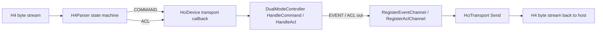
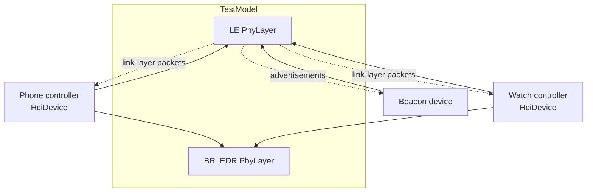
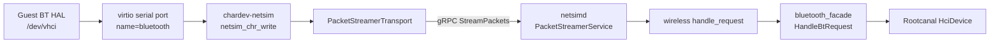
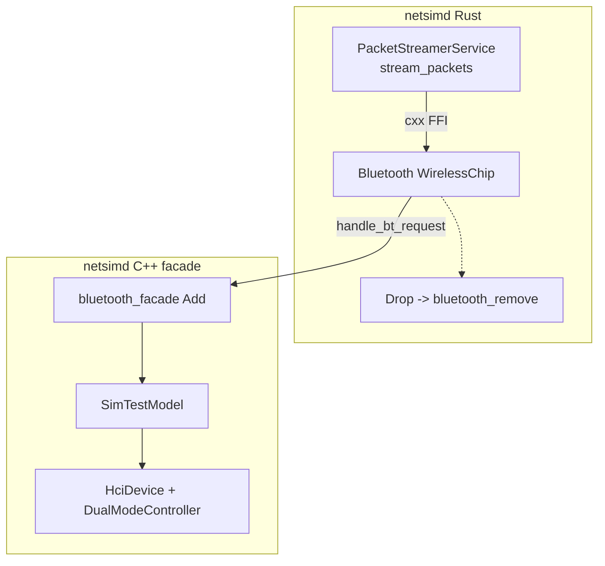
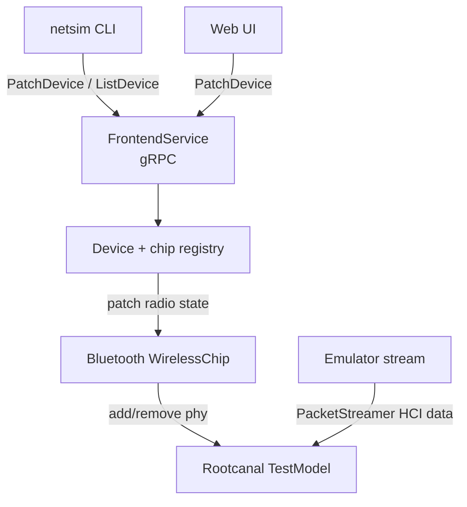
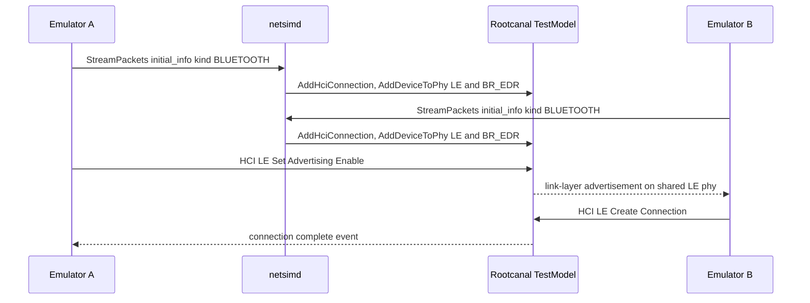

# Chapter 19: Bluetooth

The Android Emulator does not talk to any real Bluetooth radio. There is no physical antenna, no baseband chip, and no over-the-air RF. Instead the guest's Bluetooth stack speaks to a software controller called Rootcanal, a virtual HCI controller that implements the Host Controller Interface accurately enough that the guest's `android.hardware.bluetooth` HAL, the Bluetooth stack, and the apps above it cannot tell the difference. Rootcanal does not run inside QEMU. It is hosted by a separate process, `netsimd` (the network simulator daemon), and the guest reaches it over a chain of transports: a guest virtio serial port, a QEMU character device, a gRPC bidirectional stream, and finally Rootcanal's `TestModel`. The same machinery emulates Wi-Fi and UWB, so this chapter is really about one slice of netsim that happens to carry HCI.

The payoff of routing every controller through one daemon is multi-device emulation. Two emulators that point at the same `netsimd` instance land on the same Rootcanal phy mesh, so a phone AVD can discover and pair with a watch AVD, or with a synthetic `beacon` device, without any of them ever leaving the host. This chapter follows an HCI packet from `/dev/vhci` in the guest all the way to Rootcanal's `DualModeController`, then turns around and looks at the control plane: the netsim frontend gRPC API, the CLI, the BLE beacon devices, and the legacy GATT-over-gRPC path through `nimble_bridge`.

---

## 19.1 Rootcanal: The Virtual HCI Controller

Rootcanal lives in `tools/rootcanal/`. Its own README states the goal plainly: it is "a virtual Bluetooth Controller" whose emulation "is limited to features that have direct consequences on connected hosts," so "accurate implementation of HCI commands and events is thus critical to RootCanal's goal, while accurate emulation of the scheduler and base-band is out of scope" (`tools/rootcanal/README.md`).

The heart of Rootcanal is the `DualModeController`, declared in `tools/rootcanal/model/controller/dual_mode_controller.h`. A dual-mode controller supports both Bluetooth Classic (BR/EDR) and Bluetooth Low Energy (LE). It exposes the four HCI packet-handling entry points the spec defines:

- `HandleCommand` consumes HCI command packets issued by the host.
- `HandleAcl` consumes ACL (asynchronous, connectionless) data packets.
- `RegisterEventChannel` registers the callback for HCI event packets sent back to the host.
- `RegisterAclChannel` registers the callback for ACL data sent back to the host.

```cpp
// Source: tools/rootcanal/model/controller/dual_mode_controller.h
void HandleAcl(std::shared_ptr<std::vector<uint8_t>> acl_packet);
void HandleCommand(std::shared_ptr<std::vector<uint8_t>> command_packet);
...
void RegisterEventChannel(
        const std::function<void(std::shared_ptr<std::vector<uint8_t>>)>& send_event);
void RegisterAclChannel(
        const std::function<void(std::shared_ptr<std::vector<uint8_t>>)>& send_acl);
```

A `DualModeController` by itself only knows how to react to HCI traffic. To become a usable controller it is wrapped in an `HciDevice` (`tools/rootcanal/model/devices/hci_device.h`), which binds the controller's four output channels to an `HciTransport` and routes inbound transport packets back into the controller. The constructor in `tools/rootcanal/model/devices/hci_device.cc` wires every channel direction:

```cpp
// Source: tools/rootcanal/model/devices/hci_device.cc
RegisterEventChannel([this](std::shared_ptr<std::vector<uint8_t>> packet) {
  transport_->Send(PacketType::EVENT, *packet);
});
RegisterAclChannel([this](std::shared_ptr<std::vector<uint8_t>> packet) {
  transport_->Send(PacketType::ACL, *packet);
});
...
transport_->RegisterCallbacks(
        [this](PacketType packet_type, const std::shared_ptr<std::vector<uint8_t>> packet) {
          switch (packet_type) {
            case PacketType::COMMAND:
              HandleCommand(packet);
```

So `HciDevice` is the seam: HCI bytes arriving from the transport are dispatched by type into the controller, and packets the controller emits flow back out the transport. Everything else in this chapter is about how those transport bytes get from the guest to this `HciDevice`.

### 19.1.1 The H4 Transport Protocol

Bluetooth controllers historically attach over a UART, and the framing on that UART is the H4 protocol: a one-byte packet-type indicator followed by a type-specific preamble and payload. Rootcanal parses H4 with `H4Parser` in `tools/rootcanal/model/hci/h4_parser.h`. The parser is a small state machine with states `HCI_TYPE`, `HCI_PREAMBLE`, `HCI_PAYLOAD`, and `HCI_RECOVERY`, and it knows the preamble layout of each packet kind directly from the spec:

```cpp
// Source: tools/rootcanal/model/hci/h4_parser.h
// 2 bytes for opcode, 1 byte for parameter length (Volume 2, Part E, 5.4.1)
static constexpr size_t COMMAND_PREAMBLE_SIZE = 3;
static constexpr size_t COMMAND_LENGTH_OFFSET = 2;
// 2 bytes for handle, 2 bytes for data length (Volume 2, Part E, 5.4.2)
static constexpr size_t ACL_PREAMBLE_SIZE = 4;
```

The parser takes five callbacks at construction time, one per packet type (command, event, ACL, SCO, ISO), and invokes the matching one when a complete packet has been assembled. This is the lowest common denominator that the emulator's QEMU glue, the netsim daemon, and Rootcanal all agree on, and it is why the same `H4Parser` class is copied into the QEMU glue tree as well.

### How an HCI packet reaches the controller



---

## 19.2 The Four TCP Ports of a Standalone Rootcanal

Rootcanal can be built and run on its own, outside any emulator, which is how its own test suite exercises it. Built as `root-canal` from AOSP, it exposes four TCP ports, each documented in `tools/rootcanal/README.md` and constructed in `TestEnvironment::TestEnvironment` in `tools/rootcanal/desktop/test_environment.cc`. The four ports are:

- The HCI channel (default `6402`), which speaks H4 over TCP; each new connection "spawns a new virtual controller."
- The test channel (default `6401`), a custom control protocol for injecting commands.
- The BR/EDR phy channel (default `6403`), carrying link-layer packets between Classic devices.
- The LE phy channel (default `6404`), carrying link-layer packets between LE devices.

```cpp
// Source: tools/rootcanal/desktop/test_environment.cc
test_socket_server_ = open_server(&async_manager_, test_port);
link_socket_server_ = open_server(&async_manager_, link_port);
link_ble_socket_server_ = open_server(&async_manager_, link_ble_port);
connector_ = open_connector(&async_manager_);
```

When a host connects to the HCI port, `SetUpHciServer` builds the same stack we saw in section 19.1: an `HciSocketTransport` wrapping the socket, optionally an `HciSniffer` for PCAP capture, an `HciDevice`, and finally `test_model_.AddHciConnection(device)` to register the controller with the model:

```cpp
// Source: tools/rootcanal/desktop/test_environment.cc
auto transport = HciSocketTransport::Create(socket);
if (enable_hci_sniffer_) {
  transport = HciSniffer::Create(transport);
}
auto device = HciDevice::Create(transport, properties);
auto device_id = test_model_.AddHciConnection(device);
```

The README confirms the integration story for the shipped emulator: "RootCanal is natively integrated in the Cuttlefish and Goldfish emulators. Bluetooth is enabled by default on these platforms. External hosts can connect to the HCI port 7300 to interact with the emulated device." Note that the emulator integration does *not* go through these raw TCP ports for the guest's own controller — the guest path is the gRPC packet streamer covered in sections 19.4 through 19.6. The TCP ports remain available for external test tooling and for connecting accessory devices.

### 19.2.1 The PCAP Sniffer

The `HciSniffer` and `BaseBandSniffer` (`tools/rootcanal/model/hci/hci_sniffer.h`, `tools/rootcanal/model/devices/baseband_sniffer.h`) are transparent shims that tee traffic to a PCAP file. The standalone tool enables them with `--enable_hci_sniffer` and `--enable_baseband_sniffer`. The HCI sniffer captures everything the controller exchanges with its host; the baseband sniffer captures the link-layer packets exchanged between controllers on a phy, which is the only way to debug Rootcanal's own behavior. In the emulator the same capture capability is reached through netsim's capture API (section 19.8).

---

## 19.3 The Phy Mesh and Multi-Device Topology

Rootcanal's `TestModel` (`tools/rootcanal/model/setup/test_model.h`) is the object that owns every controller and every radio medium. It keeps two maps: `phy_layers_` (the radio media) and `phy_devices_` (the controllers attached to those media). A "phy" is a `PhyLayer` of a given `Phy::Type` — and there are exactly two types, declared in `tools/rootcanal/include/phy.h`:

```cpp
// Source: tools/rootcanal/include/phy.h
enum class Type {
  LOW_ENERGY,
  BR_EDR,
};
```

The model's vocabulary for building topology is a handful of methods:

- `AddPhy(Phy::Type)` creates a radio medium and returns its identifier.
- `AddHciConnection(device)` registers a controller and returns its device identifier.
- `AddDeviceToPhy(device_id, phy_id)` places a controller on a medium so it can hear traffic.
- `RemoveDeviceFromPhy(device_id, phy_id)` takes it off again.

The README explains the rule that makes multi-device work: "Controllers can exchange link layer packets only when they are part of the same phy. One controller can be added to multiple phys, the simplest example being BR/EDR and LE dual phys." So a normal dual-mode controller sits on *both* the BR/EDR phy and the LE phy, and any two controllers on the same phy can see each other's advertisements, scan requests, and connection traffic. There is no spatial model by default — every device on a phy is in range of every other — though the netsim layer adds RSSI computation on top (section 19.7).

The phy channels carry a simplified link-layer protocol defined in `tools/rootcanal/packets/link_layer_packets.pdl`. As the README warns, this protocol "simplifies the LL and LMP protocol packets defined in the Bluetooth specification to abstract over negotiation details," and it "can change in backward incompatible ways."

### The Rootcanal phy mesh



---

## 19.4 The Guest-to-Host Transport: virtio, chardev, gRPC

In the goldfish emulator the guest's Bluetooth HAL opens a virtual HCI device. That device is backed by a QEMU virtio serial port, which the emulator only creates when Bluetooth emulation is enabled. The decision and the device wiring happen in `external/qemu/android-qemu2-glue/main.cpp`:

```cpp
// Source: external/qemu/android-qemu2-glue/main.cpp
if ((feature_is_enabled(kFeature_BluetoothEmulation) ||
     feature_is_enabled_by_guest(kFeature_BluetoothEmulation)) &&
    !bluetooth_explicitly_disabled) {
    // Register the rootcanal device, this will activate rootcanal
    dprint("Bluetooth requested by %s", ...);
    args.add2("-chardev", "netsim,id=bluetooth");
    args.add2("-device", "virtserialport,chardev=bluetooth,name=bluetooth");
}
```

Two QEMU command-line fragments do all the work. The `-device virtserialport,...,name=bluetooth` line creates the guest-visible virtio serial port that the HAL talks to. The `-chardev netsim,id=bluetooth` line creates a host-side character device of a custom type, `chardev-netsim`, whose entire job is to forward bytes to netsim. (UWB is set up the same way a few lines earlier with `netsim,id=uwb`; Wi-Fi takes a different forwarder.)

The `chardev-netsim` type is registered in `external/qemu/android-qemu2-glue/netsim/qemu-packet-stream-agent-impl.cpp`. It is a QEMU `TypeInfo` with a write handler that hands guest bytes to a `PacketStreamerTransport`:

```cpp
// Source: external/qemu/android-qemu2-glue/netsim/qemu-packet-stream-agent-impl.cpp
static int netsim_chr_write(Chardev* chr, const uint8_t* buf, int len) {
    DD("Received %d bytes from /dev/vhci", len);
    PacketStreamChardev* netsim = NETSIM_CHARDEV(chr);
    uint64_t consumed = 0;
    if (auto transport = netsim->transport.lock()) {
        consumed = transport->fromQemu(buf, len);
    }
    return consumed;
}
```

When the chardev opens, it spawns a detached thread to connect to netsim asynchronously, because "Directly opening the channel can take >2 seconds" — so QEMU never blocks waiting for the daemon. The connect routine builds a gRPC channel to the packet streamer, picks a protocol by device label, and creates the transport:

```cpp
// Source: external/qemu/android-qemu2-glue/netsim/qemu-packet-stream-agent-impl.cpp
auto protocol = android::qemu2::getPacketProtocol(
        netsim->parent.label, gNetsimConfiguration.device_info);
auto channel = channelFactory();
...
auto transport = PacketStreamerTransport::create(
        netsim, std::move(protocol), channel, std::move(channelFactory));
transport->start();
```

### The transport chain from guest to Rootcanal



---

## 19.5 The Bluetooth Packet Protocol

The `chardev-netsim` device is generic: it forwards bytes for Bluetooth, UWB, and Wi-Fi over the same gRPC `PacketStreamer` service. What differs per radio is the `PacketProtocol` that translates between the raw guest byte stream and the typed `PacketRequest`/`PacketResponse` protobufs. For Bluetooth that translator is `BluetoothPacketProtocol` in `external/qemu/android-qemu2-glue/netsim/BluetoothPacketProtocol.cpp`.

On the guest-to-netsim direction, `forwardToPacketStreamer` feeds the byte stream into an `H4Parser` (the same parser from section 19.1.1, vendored into the glue) and, for each complete H4 packet, enqueues a typed `HCIPacket` protobuf:

```cpp
// Source: external/qemu/android-qemu2-glue/netsim/BluetoothPacketProtocol.cpp
BluetoothPacketProtocol(std::shared_ptr<DeviceInfo> deviceInfo)
    : mH4Parser([this](auto data) { enqueue(HCIPacket::COMMAND, data); },
                [this](auto data) { enqueue(HCIPacket::EVENT, data); },
                [this](auto data) { enqueue(HCIPacket::ACL, data); },
                [this](auto data) { enqueue(HCIPacket::SCO, data); },
                [this](auto data) { enqueue(HCIPacket::ISO, data); }),
      mDeviceInfo(deviceInfo) {}
```

On the netsim-to-guest direction, `forwardToQemu` does the inverse: it takes an `HCIPacket` out of a `PacketResponse`, prepends the one-byte H4 type, and writes the H4 frame back toward the guest. The protobuf `HCIPacket` (`tools/netsim/proto/netsim/hci_packet.proto`) carries exactly the five HCI packet types — `COMMAND`, `ACL`, `SCO`, `EVENT`, `ISO` — plus the data bytes, so the wire format is type-tagged rather than relying on H4 framing across the gRPC hop.

The protocol also handles connection lifecycle. When the gRPC stream is established (`REMOTE_CONNECTED`), it sends an "initial info" registration packet describing the chip, and it injects a deliberate HCI Hardware Error event toward the guest so the Android stack resets cleanly:

```cpp
// Source: external/qemu/android-qemu2-glue/netsim/BluetoothPacketProtocol.cpp
// This is a HCI Hardware Error Event, which indicates a serious problem
// with the Bluetooth hardware. As a result, the Bluetooth stack should
// crash and restart.
static const uint8_t constexpr reset_sequence[] = {0x04, 0x10, 0x01, 0x42};
```

This `reset_sequence` matters for snapshots: when an emulator restores from a snapshot the netsim connection is rebuilt with a fresh, uninitialized Rootcanal controller, but the guest stack has no idea anything changed. Forcing a hardware-error event makes the guest re-initialize the controller from scratch (see also section 19.6.2). The `chip_info()` method even disables LE Connected Isochronous Stream for SDK 33 Play Store images that depend on older controller behavior — a real compatibility workaround keyed off `ro.build.version.sdk` (`apply_le_workaround_if_needed`).

### 19.5.1 The Registration Handshake

The first message on every packet stream is a `ChipInfo` describing the device — its name, chip kind, and AVD metadata. The emulator builds this `DeviceInfo` in `register_netsim`, which is called from `external/qemu/android-qemu2-glue/qemu-setup.cpp` with the AVD name, DNS server, proxy, and AVD path:

```cpp
// Source: external/qemu/android-qemu2-glue/qemu-setup.cpp
register_netsim(to_string(opts->packet_streamer_endpoint), name,
                to_string(opts->dns_server), to_string(opts->http_proxy),
                to_string(opts->netsim_args), avdPath);
```

`register_netsim` fills the `DeviceInfo` with the AVD name, kind `EMULATOR`, the emulator version, and several build properties (`ro.build.version.sdk`, `ro.build.id`, `ro.build.flavor`, `ro.product.cpu.abi`). That metadata is what shows up next to the device in the netsim web UI and CLI listings.

---

## 19.6 Inside netsim: Embedding Rootcanal

`netsimd` is a hybrid Rust and C++ daemon under `tools/netsim/`. The Rust side owns device management and the gRPC servers; the C++ side embeds Rootcanal directly (not over TCP) and exposes it through a `cxx` FFI bridge. The FFI surface lives in `tools/netsim/rust/daemon/src/ffi.rs`:

```rust
// Source: tools/netsim/rust/daemon/src/ffi.rs
#[rust_name = bluetooth_add]
#[namespace = "netsim::hci::facade"]
pub fn Add(chip_id: u32, address: &CxxString, controller_proto_bytes: &[u8]) -> u32;

#[rust_name = handle_bt_request]
#[namespace = "netsim::hci"]
fn HandleBtRequestCxx(rootcanal_id: u32, packet_type: u8, packet: &Vec<u8>);

#[rust_name = add_device_to_phy]
#[namespace = "netsim::hci::facade"]
pub fn AddDeviceToPhy(rootcanal_id: u32, is_low_energy: bool);
```

The C++ implementation is the Bluetooth facade in `tools/netsim/src/hci/bluetooth_facade.cc`. It subclasses Rootcanal's own `TestModel` as `SimTestModel` and its `PhyLayer` as `SimPhyLayer`, overriding `CreatePhyLayer` so every medium computes RSSI and tracks tx/rx counts:

```cpp
// Source: tools/netsim/src/hci/bluetooth_facade.cc
class SimTestModel : public rootcanal::TestModel {
  ...
  std::unique_ptr<rootcanal::PhyLayer> CreatePhyLayer(
      PhyLayer::Identifier id, rootcanal::Phy::Type type) override {
    return std::make_unique<SimPhyLayer>(id, type);
  }
};
```

At startup the facade creates exactly two phys and remembers their indices — this is netsim's instantiation of the dual-phy topology from section 19.3:

```cpp
// Source: tools/netsim/src/hci/bluetooth_facade.cc
phy_classic_index_ = gTestModel->AddPhy(rootcanal::Phy::Type::BR_EDR);
phy_low_energy_index_ = gTestModel->AddPhy(rootcanal::Phy::Type::LOW_ENERGY);
```

### 19.6.1 Adding a Controller

When an emulator's gRPC stream sends its initial `ChipInfo`, the Rust `add_chip` path eventually calls into `bluetooth_facade::Add`. That function builds the full Rootcanal stack for one guest: an `HciPacketTransport`, an optional custom `ControllerProperties` from the supplied configuration protobuf, and an `HciDevice` registered with the model:

```cpp
// Source: tools/netsim/src/hci/bluetooth_facade.cc
auto hci_device =
    std::make_shared<rootcanal::HciDevice>(transport, *controller_properties);
...
gAsyncManager->ExecAsync(
    gSocketUserId, std::chrono::milliseconds(0),
    [hci_device, &rootcanal_id_promise, address_option]() {
      rootcanal_id_promise.set_value(
          gTestModel->AddHciConnection(hci_device, address_option));
    });
```

The returned `rootcanal_id` is the model's device identifier, and it is the handle the Rust layer uses for every subsequent operation. The facade keeps an `id_to_chip_info_` map from that id to per-device state: the chip model, tx/rx counters, and the controller proto. Note that `AddHciConnection` runs inside the `AsyncManager`'s task thread via `ExecAsync` — Rootcanal is single-threaded by design, and all model mutation is funneled onto that one thread to avoid data races.

### 19.6.2 The Snapshot Quirk

The facade also flips a Rootcanal "quirk" when a custom controller proto is supplied:

```cpp
// Source: tools/netsim/src/hci/bluetooth_facade.cc
// When emulators restore from a snapshot the PacketStreamer connection to
// netsim is recreated with a new (uninitialized) Rootcanal device. However
// the Android Bluetooth Stack does not re-initialize the controller. Our
// solution is for Rootcanal to recognize that it is receiving HCI commands
// before a HCI Reset. ...
custom_proto.mutable_quirks()->set_hardware_error_before_reset(true);
```

This is the controller-side companion to the `reset_sequence` injection in section 19.5. Together they make Bluetooth survive snapshot save/restore: the host re-creates a blank controller, and either the protocol layer injects a hardware-error event or the controller raises one the moment it sees a non-reset command, prompting the guest stack to re-run its initialization sequence.

### 19.6.3 The Rust WirelessChip

On the Rust side, each Bluetooth controller is a `Bluetooth` struct that implements the `WirelessChip` trait (`tools/netsim/rust/daemon/src/wireless/bluetooth.rs`). It holds the `rootcanal_id` plus two atomic flags for the LE and Classic radio states. `handle_request` forwards an inbound HCI packet straight into the facade; `patch` toggles a radio by adding or removing the controller from a phy:

```rust
// Source: tools/netsim/rust/daemon/src/wireless/bluetooth.rs
fn handle_request(&self, packet: &Bytes) {
    let _guard = WIRELESS_BT_MUTEX.lock().expect("...");
    ffi_bluetooth::handle_bt_request(self.rootcanal_id, packet[0], &packet[1..].to_vec())
}
```

Disabling a radio is literally removing the controller from its phy; re-enabling it adds it back:

```rust
// Source: tools/netsim/rust/daemon/src/wireless/bluetooth.rs
match (last_state, state) {
    (false, true) => ffi_bluetooth::add_device_to_phy(id, is_low_energy),
    (true, false) => ffi_bluetooth::remove_device_from_phy(id, is_low_energy),
    _ => {}
}
```

When the `Bluetooth` struct is dropped, its `Drop` impl calls `ffi_bluetooth::bluetooth_remove(self.rootcanal_id)`, which on the C++ side closes the transport and erases the chip-info entry. The Rust struct's lifetime is the controller's lifetime.

### netsim daemon internal layering



---

## 19.7 RSSI, Counters, and Radio Stats

Because netsim subclasses the phy layer, it can compute signal strength and packet statistics that plain Rootcanal does not. `SimPhyLayer` overrides `ComputeRssi` and `Send` to call into netsim's ranging code and to bump per-chip tx/rx counters. The RSSI computation is exposed back to Rust as an FFI helper, `GetRssi(sender, receiver, link_kind, tx_power)` (`tools/netsim/rust/daemon/src/ffi.rs`), backed by netsim's `ranging` module. There is no real path loss model; RSSI is a synthetic function of the configured device positions.

The per-controller counters feed the radio stats the daemon reports. The Rust `get_stats` builds two `NetsimRadioStats` records per controller — one `BLUETOOTH_LOW_ENERGY` and one `BLUETOOTH_CLASSIC` — copying the tx/rx counts out of the chip model and attaching any invalid packets that Rootcanal flagged:

```rust
// Source: tools/netsim/rust/daemon/src/wireless/bluetooth.rs
ble_stats_proto.set_kind(netsim_radio_stats::Kind::BLUETOOTH_LOW_ENERGY);
ble_stats_proto.set_tx_count(chip_proto.bt().low_energy.tx_count);
ble_stats_proto.set_rx_count(chip_proto.bt().low_energy.rx_count);
classic_stats_proto.set_kind(netsim_radio_stats::Kind::BLUETOOTH_CLASSIC);
```

Rootcanal can report malformed HCI traffic through an "invalid packet handler" registered on each `HciDevice` in the facade. Those reports cross the FFI as `report_invalid_packet_cxx` and land in a per-`rootcanal_id` ring buffer capped at five entries (`tools/netsim/rust/daemon/src/wireless/bluetooth.rs`), so a guest that bombards the controller with garbage shows up in the radio stats rather than silently breaking the link.

---

## 19.8 The Control Plane: Frontend gRPC and the CLI

Everything so far is the data plane — HCI packets moving between guest and controller. netsim also exposes a control plane: a separate `FrontendService` gRPC API for inspecting and manipulating the simulated network. It is defined in `tools/netsim/proto/netsim/frontend.proto`, and its clients, per the proto comments, "include a Command Line Interface (cli), Mobly" test harnesses, and the web UI. The relevant RPCs for Bluetooth are:

- `ListDevice` enumerates every device and chip currently attached to the simulation.
- `PatchDevice` mutates a device — for example toggling its BLE or Classic radio on or off.
- `CreateDevice` adds a synthetic device such as a BLE beacon.
- `DeleteChip` / `DeleteDevice` remove them.
- `Reset` returns the whole simulation to its initial state.
- `PatchCapture` / `ListCapture` / `GetCapture` control PCAP capture per chip.

The CLI is the Rust binary under `tools/netsim/rust/cli/`. Its argument grammar (`tools/netsim/rust/cli/src/args.rs`) maps subcommands onto those RPCs: `radio` (control a device's radio state), `devices`, `patch`, `capture` (aliased `pcap`), `reset`, `beacon`, and `bumble`. The `radio` subcommand takes a `RadioType` of `Ble` or another radio and a status, then issues a `PatchDevice` that flips the corresponding atomic flag described in section 19.6.3 — which, in turn, adds or removes the controller from its phy.

### Control plane vs. data plane



### 19.8.1 BLE Beacon Devices

A beacon is a controller-less synthetic device that just advertises. Rootcanal ships a `Beacon` device (`tools/rootcanal/model/devices/beacon.h`) described in its header as a "Simple device that advertises with non-connectable advertising in general discoverable mode, and responds to LE scan requests." netsim wraps beacons as first-class CreateDevice targets: the model proto defines a `BleBeacon` message with advertise settings, advertise data, and optional GATT service definitions (`tools/netsim/proto/netsim/model.proto`), and the CLI exposes `beacon create ble`, `beacon patch`, and `beacon remove` (`tools/netsim/rust/cli/src/args.rs`).

A beacon lets you test scanning and discovery from a single emulator without a second AVD: create the beacon in netsim, and the guest's LE scanner will see its advertisements on the shared LE phy. The beacon implementation in netsim is in `tools/netsim/rust/daemon/src/bluetooth/beacon.rs`, and it sends link-layer LE packets through the same `RustBluetoothChip` FFI used for any Rust-implemented device (`SendLinkLayerLePacket`).

---

## 19.9 Multi-Device Bluetooth

The architectural reason netsim hosts Rootcanal out-of-process is so that multiple AVDs can share one simulation. Each emulator's `register_netsim` is told a `packet_streamer_endpoint` (`external/qemu/android-qemu2-glue/qemu-setup.cpp`); when several emulators target the same `netsimd`, every one of their controllers is added to the same two phys via `AddHciConnection` and `AddDeviceToPhy`. From Rootcanal's perspective there is no difference between "two emulators" and "two HCI connections" — they are just devices on a phy.

Concretely, the `stream_packets` RPC handler in `tools/netsim/rust/daemon/src/grpc_server/backend.rs` reads the first `initial_info` message, registers the chip, and then loops forwarding HCI packets for the life of the stream:

```rust
// Source: tools/netsim/rust/daemon/src/grpc_server/backend.rs
let result = add_chip(&initial_info, &peer)?;
register_transport(result.chip_id, Box::new(RustGrpcTransport { sink }));
while let Some(request) = packet_request.try_next().await? {
    ...
    ProtoChipKind::BLUETOOTH => {
        ...
        let packet: Bytes = request.hci_packet().packet.to_vec().into();
        wireless::handle_request(...);
```

Each connection also gets a stable Bluetooth address. `handle_bluetooth_address` persists a MAC per AVD path: if the emulator did not supply an address, netsim generates one and stores it keyed by AVD path so the same virtual device keeps the same MAC across runs:

```rust
// Source: tools/netsim/rust/daemon/src/grpc_server/backend.rs
if chip_address.is_empty() {
    let mac = get_or_create_bluetooth_mac(avd_path)...;
    initial_info.chip.as_mut().unwrap().address = mac;
} else {
    set_bluetooth_mac(avd_path, chip_address)...;
}
```

With stable addresses, two emulators that have paired once stay paired across reboots. This is what makes phone-plus-watch testing, fast-pair flows, and BLE mesh scenarios reproducible on a single host.

### Two emulators on one mesh



---

## 19.10 The Legacy GATT-over-gRPC Path

Separate from the packet-streaming data plane, the emulator also exposes a host-side gRPC service that lets an external program register a virtual GATT device. It is the `EmulatedBluetoothService`, defined in `external/qemu/android/android-grpc/python/aemu-grpc/src/aemu/proto/emulated_bluetooth.proto`, with one RPC:

```proto
// Source: external/qemu/android/android-grpc/python/aemu-grpc/src/aemu/proto/emulated_bluetooth.proto
service EmulatedBluetoothService {
    rpc registerGattDevice(GattDevice) returns (RegistrationStatus);
};
```

The implementation (`external/qemu/android/android-grpc/services/bluetooth/server/src/android/emulation/bluetooth/EmulatedBluetoothService.cpp`) does not implement GATT itself. It serializes the `GattDevice` description to a temp file and launches a bundled helper process called `nimble_bridge`, returning the new process's PID as the device's callback identity:

```cpp
// Source: .../bluetooth/server/src/android/emulation/bluetooth/EmulatedBluetoothService.cpp
std::vector<std::string> cmdArgs{executable, "--with_device_proto",
                                 temp_file_path};
auto process =
        android::base::Command::create(cmdArgs).asDeamon().execute();
...
response->mutable_callback_device_id()->set_identity(
        std::to_string(process->pid()));
```

`nimble_bridge` (`external/qemu/android/bluetooth/nimble_bridge/`) embeds the Apache Mynewt NimBLE host stack and connects as its own controller, exposing the GATT services described in the proto. The companion `GattDeviceService` (`emulated_bluetooth_device.proto`) lets the registering client implement the device behavior: it receives `OnCharacteristicReadRequest`, `OnCharacteristicWriteRequest`, `OnCharacteristicObserveRequest`, and `OnConnectionStateChange` callbacks. The proto's own comment says such a device "will appear as a real bluetooth device" on "the rootcanal mesh," so this is really a convenience layer for spinning up custom peripherals that join the same phy mesh as everything else. It is the higher-level, profile-aware counterpart to the raw beacon devices of section 19.8.1.

---

## 19.11 Try It

The commands below assume an emulator and a built `netsim`/`netsimd` from the SDK's `emulator/` directory; adjust paths to your installation.

- Launch an emulator with Bluetooth emulation forced on, then sanity-check the host accelerator:

```bash
emulator -avd <your_avd> -feature BluetoothEmulation
# In another shell:
emulator -accel-check
```

- Use the netsim CLI to list the simulated devices and their Bluetooth chips (run from the SDK `emulator/` directory where `netsim` lives):

```bash
./netsim devices
```

- Toggle a device's BLE radio off and back on (each toggle adds/removes the controller from the LE phy):

```bash
./netsim radio ble down <device_name>
./netsim radio ble up   <device_name>
```

- Create a BLE beacon so a single emulator's scanner has something to discover, then remove it:

```bash
./netsim beacon create ble
./netsim devices
./netsim beacon remove <device_name>
```

- Capture HCI traffic for a chip and inspect it with Wireshark:

```bash
./netsim capture list
./netsim capture patch on <device_name>
./netsim capture get <device_name>   # writes a pcap you can open in Wireshark
```

- Build and run a standalone Rootcanal to see the four TCP ports from section 19.2, then connect an HCI client to port 6402:

```bash
source build/envsetup.sh
lunch aosp_cf_x86_64_phone-userdebug
m root-canal
./out/host/linux-x86/bin/root-canal --enable_hci_sniffer
```

- For multi-device testing, start two emulators pointed at the same `netsimd` and run `./netsim devices` — both controllers will appear on the same mesh and can discover each other.

---

## Summary

- The emulator has no real Bluetooth hardware; the guest stack talks to Rootcanal, a software HCI controller in `tools/rootcanal/` whose `DualModeController` accurately implements HCI commands and events while leaving the baseband out of scope.
- A controller is a `DualModeController` wrapped in an `HciDevice` (`tools/rootcanal/model/devices/hci_device.cc`) that binds the four HCI channels (command, event, ACL, SCO/ISO) to an `HciTransport`; the H4 protocol frames the byte stream and `H4Parser` reassembles it.
- Rootcanal's `TestModel` owns two phys, `LOW_ENERGY` and `BR_EDR`; controllers on the same phy can exchange link-layer packets, which is the entire mechanism behind multi-device emulation.
- The guest reaches Rootcanal through a transport chain: a virtio serial port named `bluetooth`, a `chardev-netsim` QEMU character device, a gRPC `PacketStreamer` stream, and finally netsim's embedded Rootcanal — set up in `external/qemu/android-qemu2-glue/main.cpp` only when `kFeature_BluetoothEmulation` is on.
- `BluetoothPacketProtocol` translates between the H4 byte stream and typed `HCIPacket` protobufs, and injects a hardware-error reset sequence on (re)connect so the guest stack re-initializes cleanly across snapshots.
- `netsimd` is a Rust+C++ daemon; the Rust `Bluetooth` `WirelessChip` drives an embedded Rootcanal `TestModel` through a `cxx` FFI (`bluetooth_add`, `handle_bt_request`, `add_device_to_phy`), and toggling a radio simply adds or removes the controller from its phy.
- The control plane is a separate `FrontendService` gRPC API (`ListDevice`, `PatchDevice`, `CreateDevice`, capture RPCs) driven by the netsim CLI and web UI; BLE beacons and the legacy `nimble_bridge` GATT path let you add synthetic peripherals to the same mesh.

### Key Source Files

| File | Purpose |
|------|---------|
| `tools/rootcanal/model/controller/dual_mode_controller.h` | The virtual HCI controller: command/event/ACL handling |
| `tools/rootcanal/model/devices/hci_device.cc` | Binds the controller's channels to an HCI transport |
| `tools/rootcanal/model/hci/h4_parser.h` | H4 UART transport state machine |
| `tools/rootcanal/model/setup/test_model.h` | Owns phys and devices; the multi-device mesh |
| `tools/rootcanal/desktop/test_environment.cc` | Standalone Rootcanal with its four TCP ports |
| `external/qemu/android-qemu2-glue/main.cpp` | Adds the `netsim` chardev and virtio Bluetooth port |
| `external/qemu/android-qemu2-glue/netsim/qemu-packet-stream-agent-impl.cpp` | `chardev-netsim` QEMU device and gRPC connect |
| `external/qemu/android-qemu2-glue/netsim/BluetoothPacketProtocol.cpp` | H4 to `HCIPacket` protobuf translation |
| `tools/netsim/src/hci/bluetooth_facade.cc` | C++ facade embedding Rootcanal in netsim |
| `tools/netsim/rust/daemon/src/wireless/bluetooth.rs` | Rust `WirelessChip` for a Bluetooth controller |
| `tools/netsim/rust/daemon/src/ffi.rs` | `cxx` FFI bridge to the Rootcanal facade |
| `tools/netsim/rust/daemon/src/grpc_server/backend.rs` | `PacketStreamer` server and per-AVD MAC persistence |
| `tools/netsim/proto/netsim/frontend.proto` | netsim control-plane gRPC API |
| `external/qemu/android/android-grpc/services/bluetooth/server/src/android/emulation/bluetooth/EmulatedBluetoothService.cpp` | Legacy GATT registration via `nimble_bridge` |
