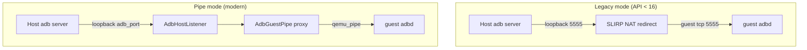
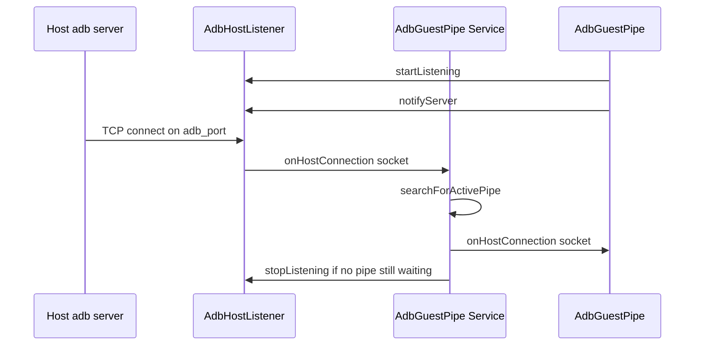
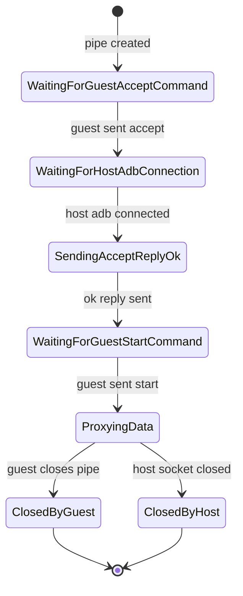
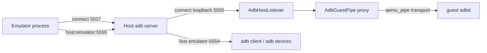
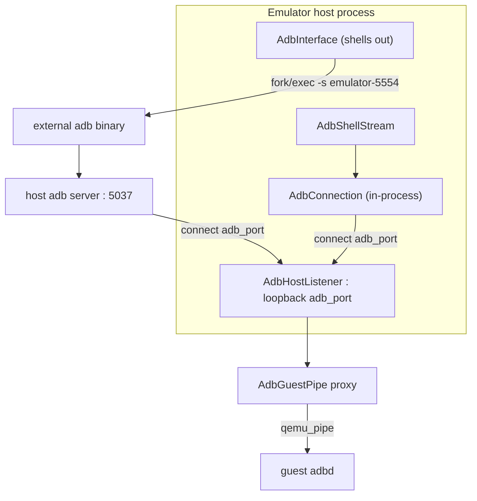

# Chapter 20: ADB Integration

The Android Debug Bridge is the single most-used tool in the Android developer's box: `adb shell`, `adb install`, `adb logcat`, `adb push`. On a physical phone it rides USB or Wi-Fi. The emulator has neither — the guest kernel sees a virtio network device, but that network is a user-mode NAT with no route from the host to the guest's `adbd` socket, and there is no USB at all. Yet `adb devices` reliably lists `emulator-5554`, and everything works. This chapter explains the machinery that makes that illusion seamless.

The trick is that the emulator does not expose the guest's TCP port to the host. Instead it carries the ADB transport over an in-VM pipe — `qemu_pipe` — and the host process acts as a proxy: it opens a loopback TCP server on the host, the guest's `adbd` opens a pipe to the emulator, and the emulator splices the two together. Layered on top of that proxy are three more pieces: a discovery handshake so the `adb` server learns about emulators on non-standard ports, an in-process ADB *client* (`AdbConnection`) the emulator uses to drive its own guest for features like `logcat` and file push, and a host-side `AdbInterface` that locates and shells out to the real `adb` binary. We trace all four, grounding every claim in the source under `external/qemu/android/`.

---

## 20.1 The Problem: No Wire to the Guest

A real device connects to `adb` one of two ways. Over USB, `adbd` in the device talks to the host `adb` server through a USB bulk endpoint. Over TCP/IP (`adb connect ip:port`), `adbd` listens on a real TCP socket reachable on the LAN. The emulator can offer neither directly:

- There is no emulated USB controller wired to `adbd`.
- The guest's network is the QEMU user-mode (SLIRP) NAT. The guest gets `10.0.2.15`; the host appears as `10.0.2.2`. Nothing on the host can open a connection *into* the guest's `5555` without an explicit port redirection.

The historical solution — still selectable for ancient images — was exactly that explicit redirection: forward host loopback `adb_port` to guest TCP `5555`. The modern solution is a private channel that bypasses the network entirely. Which one an AVD uses is decided by `avdInfo_getAdbdCommunicationMode`.

### 20.1.1 Legacy redirection versus pipe mode

The decision lives in `external/qemu/android/emu/avd/src/android/avd/info.c`. Every QEMU2-class system image uses pipe mode; only pre-API-16 images fall back to the legacy network redirect:

```c
// Source: external/qemu/android/emu/avd/src/android/avd/info.c
AdbdCommunicationMode avdInfo_getAdbdCommunicationMode(const AvdInfo* i,
                                                       bool isQemu2) {
    if (isQemu2) {
        // All qemu2-compatible system images support modern communication mode.
        return ADBD_COMMUNICATION_MODE_PIPE;
    }
    if (i->apiLevel < 16 || (i->apiLevel > 99 && !i->isMarshmallowOrHigher)) {
        // QEMU pipe for ADB communication was added in android-4.1.1_r1 API 16
        D("API < 16 or unknown, forcing ro.adb.qemud==0");
        return ADBD_COMMUNICATION_MODE_LEGACY;
    }
    return ADBD_COMMUNICATION_MODE_PIPE;
}
```

The two modes are dispatched in `setup_console_and_adb_ports` (`external/qemu/android/android-emu/android/qemu-setup.cpp`): legacy mode calls `agents->net->slirpRedir(false, adb_port, 5555)` to install the NAT redirect, while pipe mode calls `android_adb_server_init(adb_port)` and later registers the pipe service. The rest of this chapter is about pipe mode, which is what every device you will ever launch actually uses.

How the two modes reach the guest's `adbd`:



## 20.2 The Console / ADB Port Pair

Every emulator instance owns a pair of adjacent localhost TCP ports: an even **console** port and the odd port just above it for **ADB**. The first instance gets `5554` (console) and `5555` (ADB); the next gets `5556`/`5557`; and so on. This is the pattern behind the `emulator-5554` serial number you see in `adb devices`.

The allocation runs in `android_ports_setup` in `external/qemu/android/android-emu/android/qemu-setup.cpp`. The base port defaults to `ANDROID_CONSOLE_BASEPORT`, defined as `5554` in `hardware/google/aemu/host-common/include/host-common/constants.h`, and the loop tries up to `MAX_ANDROID_EMULATORS` (16) successive even ports, stepping by two:

```cpp
// Source: external/qemu/android/android-emu/android/qemu-setup.cpp
for (; tries > 0; tries--, base_port += 2) {
    /* setup first redirection for ADB, the Android Debug Bridge */
    adb_port = base_port + 1;
    if (!setup_console_and_adb_ports(base_port, adb_port, legacy_adb, agents)) {
        continue;
    }
    D("control console listening on port %d, ADB on port %d", base_port, adb_port);
    success = 1;
    break;
}
```

Once a pair binds, three globals are stored and the in-process ADB client is told which port to dial:

```cpp
// Source: external/qemu/android/android-emu/android/qemu-setup.cpp
android_base_port = base_port;
android_adb_port = adb_port;
android_serial_number_port = adb_port - 1;
android::emulation::AdbConnection::setAdbPort(android_adb_port);
```

Note `android_serial_number_port = adb_port - 1` — the *console* port. That is the number baked into the `emulator-NNNN` serial, which is why the serial uses the even console port and not the odd ADB port. Sixteen slots cover `5554`–`5584`; the `MAX_ANDROID_EMULATORS` cap is also why the upper port bound is computed as `lower_bound + (MAX_ANDROID_EMULATORS - 1) * 2 + 1` in the command-line parser (`external/qemu/android/emu/cmdline/src/android/cmdline-option.cpp`).

### 20.2.1 Who reaches which port

The two odd-and-even ports are genuinely different interfaces, and Chapter 8 covers the telnet console in depth. For ADB the key fact is that the *odd* `adb_port` is **not** a console-style server you can telnet into. It is a bare loopback listener that the `adb` server connects to and that the emulator hands straight to the proxy. Nothing speaks the telnet console protocol there.

Port responsibilities for the first instance:

| Port | Role | Bound by |
|------|------|----------|
| 5554 | Telnet control console; basis for the `emulator-5554` serial | `android_console_start` |
| 5555 | ADB proxy listener; raw ADB transport bytes | `AdbHostListener` |
| 8554+ | gRPC control plane (computed separately, see Chapter 8) | `qemu_setup_grpc` |

## 20.3 The qemu_pipe Transport

`qemu_pipe` is the emulator's generic guest-to-host channel: the guest opens `/dev/qemu_pipe`, writes a `pipe:<service>` string, and from then on the file descriptor is a bidirectional byte stream wired to a host-side `AndroidPipe::Service` of that name. ADB rides the service named `qemud:adb`.

On the host the service is `AdbGuestPipe::Service`, constructed with the literal name in `external/qemu/android/android-emu/android/emulation/AdbGuestPipe.h`:

```cpp
// Source: external/qemu/android/android-emu/android/emulation/AdbGuestPipe.h
Service(AdbHostAgent* hostAgent)
    : AndroidPipe::Service("qemud:adb"), mHostAgent(hostAgent) {}
```

When the guest's `adbd` opens `/dev/qemu_pipe` and writes `pipe:qemud:adb:<port>\0`, the pipe layer matches the `qemud:adb` service name and calls `AdbGuestPipe::Service::create`, minting one `AdbGuestPipe` instance per transport. The trailing port (decimal, `5555` by default) is guest-local and the emulator ignores it — the header comment notes it is "assumed to be here for obsolete reasons." Each pipe instance is a state machine that owns one ADB transport for its lifetime.

The end-to-end wiring, copied almost verbatim from the documentation block in `AdbGuestPipe.h`:

```text
   guest side          |          emulator                |    host

adbd <-> /dev/qemu_pipe <-> AdbGuestPipe <-> AdbHostListener <-> ADB Server
```

### 20.3.1 Where the pipe service is registered

The services are created and registered at emulation setup in `external/qemu/android/android-emu/android/adb-server.cpp`. The choice between the classic pipe and the newer vsock transport is a feature flag:

```cpp
// Source: external/qemu/android/android-emu/android/adb-server.cpp
void registerServices() {
    if (feature_is_enabled(kFeature_VirtioVsockPipe)) {
        auto service = new AdbVsockPipe::Service(&hostListener);
        hostListener.setGuestAgent(service);
        adbGuestAgent = service;
    } else {
        auto service = new AdbGuestPipe::Service(&hostListener);
        hostListener.setGuestAgent(service);
        AndroidPipe::Service::add(std::unique_ptr<AdbGuestPipe::Service>(service));
        adbGuestAgent = service;
    }
    ...
}
```

`AdbVsockPipe::Service` (`external/qemu/android/android-emu/android/emulation/AdbVsockPipe.h`) is the virtio-vsock variant: same proxy role, but the guest side speaks vsock instead of the legacy pipe device. Both implement the same `AdbGuestAgent` interface so the host listener is identical for either transport. The non-vsock path additionally registers a `qemud:adb-debug` service via `AdbDebugPipe::Service` (`external/qemu/android/android-emu/android/emulation/AdbDebugPipe.h`), which dumps proxied ADB traffic to stderr when the emulator is launched with `-debug adb`.

## 20.4 Two Agents: Host Listener and Guest Pipe

The proxy is split into two cooperating objects defined in `external/qemu/android/android-emu/android/emulation/AdbTypes.h`. The header's own comment is the clearest description of the contract:

- The **`AdbHostAgent`** (in practice `AdbHostListener`) manages the host ADB server port. It is told to `startListening()` for one connection, `stopListening()`, and `notifyServer()` when a guest is ready.
- The **`AdbGuestAgent`** (in practice `AdbGuestPipe::Service`) models all guest pipe connections. It receives `onHostConnection(socket, portType)` when the server connects, and tells the host agent when to listen or notify.

```cpp
// Source: external/qemu/android/android-emu/android/emulation/AdbTypes.h
struct AdbHostAgent {
    virtual ~AdbHostAgent() = default;
    virtual void startListening() = 0;
    virtual void stopListening() = 0;
    virtual void notifyServer() = 0;
};
```

`AdbHostListener::reset` (`external/qemu/android/android-emu/android/emulation/AdbHostListener.cpp`) creates the loopback TCP server on `adb_port`. It prefers IPv4 but falls back to IPv6-only on systems without IPv4, and it creates a *second* server on a random port for JDWP (used by Android Studio's Icebox debugger):

```cpp
// Source: external/qemu/android/android-emu/android/emulation/AdbHostListener.cpp
mRegularAdbServer = AsyncSocketServer::createTcpLoopbackServer(
        adbPort,
        [this](int socket) {
            return onHostServerConnection(socket, AdbPortType::RegularAdb);
        },
        mode, android::base::ThreadLooper::get());
```

When the host `adb` server connects to that loopback port, `onHostServerConnection` simply forwards the accepted socket to the guest agent as an `AdbPortType::RegularAdb` (or `Jdwp`) connection. The `AdbGuestPipe::Service` then finds a pipe that is waiting and hands it the socket.

Object responsibilities and the calls between them:



## 20.5 The Pipe Handshake State Machine

`AdbGuestPipe` is an explicit state machine. The states are enumerated in `AdbGuestPipe.h` and the transitions implement a tiny four-step protocol between `adbd` and the emulator. The protocol, again from the header:

1. The guest opens `/dev/qemu_pipe` and writes `pipe:qemud:adb:<port>\0`, creating the pipe.
2. The guest writes `accept` to tell the emulator to start accepting one connection from the host `adb` server.
3. Once the host server connects, the emulator replies `ok` (or `ko` / closes on error).
4. The guest writes `start`, after which all bytes are proxied verbatim between guest and host.

A freshly created pipe is constructed in the `WaitingForGuestAcceptCommand` state, with the literal `accept` set as the expected command:

```cpp
// Source: external/qemu/android/android-emu/android/emulation/AdbGuestPipe.cpp
setExpectedGuestCommand("accept", State::WaitingForGuestAcceptCommand);
```

The command matcher in `onGuestSendCommand` compares the guest's bytes against the expected command byte-for-byte. A mismatch is treated as an I/O error that forces the guest to tear down the transport — "closing the connection now is easier than sending 'ko'." On a full match of `accept`, the pipe calls `waitForHostConnection`; on a full match of `start`, it flips to `ProxyingData`:

```cpp
// Source: external/qemu/android/android-emu/android/emulation/AdbGuestPipe.cpp
if (mState == State::WaitingForGuestAcceptCommand) {
    waitForHostConnection();
} else if (mState == State::WaitingForGuestStartCommand) {
    mState = State::ProxyingData;
    DINIT("%s: [%p] Adb connected, start proxing data", __func__, this);
    ...
}
```

`waitForHostConnection` is where the two agents meet: it moves the pipe to `WaitingForHostAdbConnection`, then asks the host listener to both listen and notify the server, so an `adb` server on a non-standard port still learns this instance exists:

```cpp
// Source: external/qemu/android/android-emu/android/emulation/AdbGuestPipe.cpp
void AdbGuestPipe::waitForHostConnection() {
    mState = State::WaitingForHostAdbConnection;
    mHostAgent->startListening();
    mHostAgent->notifyServer();
}
```

When the host server then connects, `AdbGuestPipe::onHostConnection` wraps the socket in a non-blocking, no-delay FD watch and queues the `ok` reply that step 3 promises:

```cpp
// Source: external/qemu/android/android-emu/android/emulation/AdbGuestPipe.cpp
setReply("ok", State::SendingAcceptReplyOk);
signalWake(PIPE_WAKE_READ);
```

### 20.5.1 Why the guest keeps opening pipes

A subtle detail the header calls out: `adbd` typically creates a *new* `AdbGuestPipe` immediately, but only ever has one pipe in `accept` at a time. So the service usually holds several pipes — one actively proxying, plus pending ones in `WaitingForGuestAcceptCommand`. `searchForActivePipe` picks the one in `WaitingForHostAdbConnection` when a host socket arrives, and once no pipe is left waiting, the service calls `stopListening` so the host port stops accepting until the next `accept`. This is what lets a single emulator multiplex many concurrent ADB transports (one per `adb shell`, `adb logcat`, file transfer, and so on) over the one pipe service.

The full per-pipe lifecycle:



## 20.6 ADB Server Discovery

The host `adb` server normally finds emulators by probing: at startup it scans the 16 standard odd ports `5555, 5557, ... 5585` on loopback and tries to speak the ADB transport protocol to each. That works when the emulator landed on a standard port. But if `adb` is restarted *after* the emulator started on a non-standard port — or the emulator simply wants to be found promptly without waiting for the next scan — the emulator proactively notifies the server. This is the job of `AdbHostServer` in `external/qemu/android/emu/adb/interface/src/android/emulation/AdbHostServer.cpp`.

The server itself listens on a well-known TCP port. `getClientPort` returns the default `5037` unless overridden by the `ANDROID_ADB_SERVER_PORT` environment variable:

```cpp
// Source: external/qemu/android/emu/adb/interface/src/android/emulation/AdbHostServer.cpp
int AdbHostServer::getClientPort() {
    int clientPort = kDefaultAdbClientPort;  // 5037
    const std::string_view kVarName = "ANDROID_ADB_SERVER_PORT";
    std::string env = System::get()->envGet(kVarName);
    if (!env.empty()) {
        long port = strtol(env.c_str(), NULL, 0);
        if (port <= 0 || port >= 65536) { ... return -1; }
        clientPort = static_cast<int>(port);
    }
    return clientPort;
}
```

### 20.6.1 The host:emulator notification

`notify` connects to the server on port 5037 and sends a single ADB-protocol message that tells the server exactly which loopback port to attach to:

```cpp
// Source: external/qemu/android/emu/adb/interface/src/android/emulation/AdbHostServer.cpp
bool AdbHostServer::notify(int adbEmulatorPort, int adbClientPort) {
    ScopedSocket socket = connectToAdbServer(adbClientPort);
    if (!socket.valid()) {
        // No adb server running: this is common, do not warn.
        return false;
    }
    auto message = StringFormat("host:emulator:%d", adbEmulatorPort);
    return sendMessage(socket.get(), message);
}
```

The message is framed in ADB's request wire format: a four-byte hex length prefix followed by the payload. `sendMessage` builds `%04x%s`:

```cpp
// Source: external/qemu/android/emu/adb/interface/src/android/emulation/AdbHostServer.cpp
auto wireformat = StringFormat("%04x%s", (uint32_t)message.size(), message.c_str());
return android::base::socketSendAll(fd, wireformat.c_str(), wireformat.size());
```

So `host:emulator:5555` becomes `000ehost:emulator:5555` on the wire. The server reads the port and adds a transport for `emulator-5554`. Two places trigger this notification: `android_adb_server_notify` in `adb-server.cpp` fires it asynchronously right after emulation setup (so a slow IPv6 loopback cannot stall startup), and `AdbGuestPipe::waitForHostConnection` fires it every time a guest pipe starts waiting.

```cpp
// Source: external/qemu/android/android-emu/android/adb-server.cpp
void android_adb_server_notify(int port) {
    auto globals = sGlobals.ptr();
    globals->hostListener.reset(port);
    // Could take seconds if ipv6 loopback is down; run async so startup is fast.
    android::base::async([globals] {
        globals->hostListener.notifyServer();
    });
}
```

### 20.6.2 Negotiating the protocol version

`AdbHostServer::getProtocolVersion` connects to 5037 and sends `host:version`, then parses the server's `OKAY`-prefixed hex reply. The emulator uses this to pick a compatible `adb` binary (Section 20.8). The reply protocol is the standard ADB host-service handshake: a four-byte `OKAY` or `FAIL`, then a length-prefixed payload that, for `host:version`, is a four-byte hex version number.

How discovery flows end to end:



## 20.7 ADB Authentication

ADB is authenticated: `adbd` will only let a host talk to it once the host proves possession of a trusted RSA key (this is the "Allow USB debugging?" dialog on real devices). The emulator participates in this protocol in two distinct roles, and the auth code lives in `external/qemu/android/emu/adb/interface/src/android/emulation/control/adb/adbkey.cpp` with declarations in `adbkey.h`.

The wire-level auth is a three-message dance using the ADB transport commands. The relevant subtypes are defined in `AdbConnection.cpp`:

```cpp
// Source: external/qemu/android/emu/adb/interface/src/android/emulation/control/adb/AdbConnection.cpp
#define ADB_AUTH_TOKEN        1
#define ADB_AUTH_SIGNATURE    2
#define ADB_AUTH_RSAPUBLICKEY 3
```

The sequence: `adbd` sends `A_AUTH` with an `ADB_AUTH_TOKEN` (a 20-byte random challenge); the client signs it with its private key and replies `A_AUTH`/`ADB_AUTH_SIGNATURE`; if no known key matches, the client may offer its public key with `ADB_AUTH_RSAPUBLICKEY`, prompting the on-device authorization dialog. `TOKEN_SIZE` is 20 and the RSA modulus is 2048 bits, both fixed in `adbkey.h`:

```cpp
// Source: external/qemu/android/emu/adb/interface/include/android/emulation/control/adb/adbkey.h
constexpr const int ANDROID_PUBKEY_MODULUS_SIZE = 2048 / 8;
constexpr const int TOKEN_SIZE = 20;
constexpr const char* kPrivateKeyFileName = "adbkey";
constexpr const char* kPublicKeyFileName = "adbkey.pub";
```

The host's RSA key pair is the user's standard ADB key (`adbkey` / `adbkey.pub`), located by `getPrivateAdbKeyPath` / `getPublicAdbKeyPath`, and generated by `adb_auth_keygen` if absent. `android_pubkey_encode` produces the Android-specific binary public-key format, and `sign_auth_token` signs the challenge token.

### 20.7.1 The pull-key gRPC and the direct-bridge caveat

There is also a gRPC RPC that lets a trusted client fetch the emulator's private key so it can authenticate to the same device: `AdbServiceImpl::pullAdbKey` in `external/qemu/android/android-grpc/services/adb/server/src/android/emulation/control/adb/AdbService.cpp` reads `getPrivateAdbKeyPath()` and returns it in an `AdbKey` protobuf. This is how an embedded UI can drive `adb` against the emulator without a separate authorization prompt.

The in-process client (Section 20.9) deliberately refuses to *install* a new public key into the guest. `AdbConnection::sendPublicKeyToDevice` sets the connection to `failed` and bails out, citing bug `b/150160590` — offering a key from a second connection conflicts with the real `adb` server's auth, so the direct bridge disables itself rather than fight over the device:

```cpp
// Source: external/qemu/android/emu/adb/interface/src/android/emulation/control/adb/AdbConnection.cpp
void sendPublicKeyToDevice() {
    setState(AdbState::failed);
    mSocket->close();
    LOG(ERROR) << "We are not offering to install a public key due to "
                  "b/150160590, direct bridge disabled.\n" ...;
    return;
    ...
}
```

## 20.8 Locating and Driving the Real adb Binary

Many host-side features prefer to shell out to the genuine `adb` executable rather than reimplement the protocol. `AdbInterface` (`external/qemu/android/emu/adb/interface/include/android/emulation/control/adb/AdbInterface.h`) is the abstraction: it finds an `adb` binary, builds the right serial argument, and runs commands asynchronously with a result callback.

The serial string is derived from the console port, matching what `adb devices` shows:

```cpp
// Source: external/qemu/android/emu/adb/interface/src/android/emulation/control/adb/AdbInterface.cpp
virtual void setSerialNumberPort(int port) final {
    mSerialString = std::string("emulator-") + std::to_string(port);
}
```

### 20.8.1 Which adb binary

`AdbLocatorImpl::availableAdb` searches three locations in order, keeping only candidates that actually report a version string:

1. `platform-tools/adb` under the SDK root resolved from the environment (`getSdkRootDirectoryByEnv`).
2. `platform-tools/adb` under the SDK root resolved relative to the emulator executable (`getSdkRootDirectoryByPath`).
3. Whatever `adb` is on `PATH` (`System::which`).

```cpp
// Source: external/qemu/android/emu/adb/interface/src/android/emulation/control/adb/AdbInterface.cpp
std::vector<std::string> AdbLocatorImpl::availableAdb() {
    std::vector<std::string> available = {};
    auto adb = platformPath(android::ConfigDirs::getSdkRootDirectoryByEnv());
    if (adb && extractProtocolVersion(*adb)) available.push_back(std::move(*adb));
    adb = platformPath(android::ConfigDirs::getSdkRootDirectoryByPath());
    if (adb && extractProtocolVersion(*adb)) available.push_back(std::move(*adb));
    adb = System::get()->which(PathUtils::toExecutableName("adb"));
    if (adb && extractProtocolVersion(*adb)) available.push_back(std::move(*adb));
    return available;
}
```

`selectAdbPath` then prefers the candidate whose protocol version matches the running `adb` *server* (queried via `AdbDaemon::getProtocolVersion`, which under the hood is `AdbHostServer::getProtocolVersion` from Section 20.6.2). Matching versions avoids the situation where launching a mismatched `adb` silently kills and restarts the user's server. If no match exists it falls back to the newest available, and flags whether it meets `kMinAdbProtocol`.

### 20.8.2 Running a command

`runAdbCommand` constructs an `AdbThroughExe` (a subprocess wrapper) with the resolved binary, the `emulator-NNNN` serial, and the requested args, then starts it asynchronously. If the serial is still empty it back-fills it from `android_serial_number_port`:

```cpp
// Source: external/qemu/android/emu/adb/interface/src/android/emulation/control/adb/AdbInterface.cpp
command = std::make_shared<AdbThroughExe>(
        mLooper, adbPath(), mSerialString, args, want_output,
        timeout_ms, std::move(result_callback));
command->start();
```

`enqueueCommand` layers retry-with-backoff on top, distinguishing the very first command (longer retry, since `adb` may still be launching) from later ones via `INITIAL_ADB_RETRY_LIMIT` versus `SUBSEQUENT_ADB_RETRY_LIMIT`. The whole thing is gated on `android_qemu_mode()` — the interface no-ops outside QEMU mode.

## 20.9 The In-Process ADB Client

Some features cannot afford to depend on the user's `adb` binary at all — for example, pushing a file or running `logcat` very early in boot, or in headless/CI environments where no SDK is installed. For these the emulator embeds its *own* minimal ADB client, `AdbConnection`, which connects directly to the loopback `adb_port` and speaks the raw transport protocol to the guest's `adbd`. This is the "direct bridge."

The transport command set is encoded in `AdbConnection.cpp` as a 4-byte little-endian enum — the same `A_CNXN`/`A_AUTH`/`A_OPEN`/`A_OKAY`/`A_CLSE`/`A_WRTE` commands the real `adb` uses on USB and TCP:

```cpp
// Source: external/qemu/android/emu/adb/interface/src/android/emulation/control/adb/AdbConnection.cpp
enum class AdbWireMessage : uint32_t {
    A_SYNC = 0x434e5953,
    A_CNXN = 0x4e584e43,
    A_AUTH = 0x48545541,
    A_OPEN = 0x4e45504f,
    A_OKAY = 0x59414b4f,
    A_CLSE = 0x45534c43,
    A_WRTE = 0x45545257,
};
```

`setAdbPort` (called from `qemu-setup.cpp`, Section 20.2) constructs the connection against the loopback port using the thread looper's async socket:

```cpp
// Source: external/qemu/android/emu/adb/interface/src/android/emulation/control/adb/AdbConnection.cpp
void AdbConnection::setAdbPort(int adbPort) {
    auto looper = android::base::ThreadLooper::get();
    setAdbSocket(new AsyncSocket(looper, adbPort));
}
```

### 20.9.1 Handshake and connection state

The client state is the `AdbState` enum in `AdbConnection.h`: `disconnected`, `socket`, `connecting`, `authorizing`, `offer_key`, `connected`, `failed`. On connect it sends `A_CNXN` with a banner and version; `adbd` replies with `A_AUTH` (triggering the signature flow of Section 20.7), then its own `A_CNXN`. `handleConnect` parses the device banner — `device::ro.product.name=...;features=...` — extracting the **feature set** so callers can query `hasFeature("shell_v2")`, and finally moves to `connected`:

```cpp
// Source: external/qemu/android/emu/adb/interface/src/android/emulation/control/adb/AdbConnection.cpp
mProtocolVersion = msg.msg.arg0;
mMaxPayloadSize = msg.msg.arg1;
// parse "features=..." out of the banner...
setState(AdbState::connected);
```

Once `connected`, `open(service)` issues an `A_OPEN` for a service string and returns an `AdbStream` — a blocking `std::iostream` whose `rdbuf` proxies ADB `A_WRTE`/`A_OKAY` framing. The documented usage in `AdbConnection.h` is striking in its simplicity:

```cpp
// Source: external/qemu/android/emu/adb/interface/include/android/emulation/control/adb/AdbConnection.h
auto stream = AdbConnection::connection()->open("shell:getprop");
while (getline(stream, line)) {
    cout << line << '\n';
}
```

### 20.9.2 Shell, logcat, and file push on top of the stream

`AdbShellStream` (`external/qemu/android/emu/adb/interface/include/android/emulation/control/adb/AdbShellStream.h`) wraps `AdbConnection::open` to present a uniform interface over both shell protocol versions. The ADB shell *v2* protocol multiplexes stdin, stdout, stderr, and the exit code over one stream using a one-byte id header, declared in `AdbConnection.h`:

```cpp
// Source: external/qemu/android/emu/adb/interface/include/android/emulation/control/adb/AdbConnection.h
struct ShellHeader {
    enum Id : uint8_t {
        kIdStdin = 0,  kIdStdout = 1, kIdStderr = 2,
        kIdExit = 3,   // data[0] is the exit code
        kIdCloseStdin = 4, kIdWindowSizeChange = 5, kIdInvalid = 255,
    };
    Id id;
    uint32_t length;
} __attribute__((packed));
```

`AdbShellStream::isV1` reports which protocol is in use; for v1 the exit code is never set and stderr is folded into stdout, while v2 separates the three streams. This is what backs the gRPC `logcat` and shell RPCs and the file-push helpers without ever shelling out to `adb`.

`AdbInterfaceImpl::runAdbCommand` falls back to this in-process path for `shell` and `logcat` only under a precise condition: the emulator was launched with `-no-direct-adb`, the external bridge has already `failed()`, and the command is one of those two. In that case it builds an `AdbDirect` rather than an `AdbThroughExe`:

```cpp
// Source: external/qemu/android/emu/adb/interface/src/android/emulation/control/adb/AdbInterface.cpp
if (getConsoleAgents()->settings->android_cmdLineOptions()->no_direct_adb &&
    AdbConnection::failed() && (args[0] == "shell" || args[0] == "logcat")) {
    command = std::make_shared<AdbDirect>(args, std::move(result_callback), want_output);
}
```

Because a public key can only ever be offered by one connection at a time (`b/150160590`), the static `AdbConnection::failed()` guard ensures the in-process client and the external `adb` server never both try to authorize, which would otherwise leave the device flapping between authorized and unauthorized.

The two host-side clients and how they reach the guest:



## 20.10 Observability: Sniffing ADB Traffic

Because the emulator sits in the middle of every ADB transport, it can log the bytes flowing both ways. `AdbMessageSniffer` (`external/qemu/android/android-emu/android/emulation/AdbMessageSniffer.h`) is the decoder; each `AdbGuestPipe` owns two of them — one per direction — created in the pipe constructor and keyed off the AVD's `test_monitorAdb` hardware setting:

```cpp
// Source: external/qemu/android/android-emu/android/emulation/AdbGuestPipe.cpp
mReceivedMesg(AdbMessageSniffer::create("HOST==>GUEST",
        getConsoleAgents()->settings->hw()->test_monitorAdb)),
mSendingMesg(AdbMessageSniffer::create("HOST<==GUEST",
        getConsoleAgents()->settings->hw()->test_monitorAdb))
```

Separately, launching with `-debug adb` (the `VERBOSE_CHECK(adb)` flag in `adb-server.cpp`) attaches a `StdioStream(stderr)` to the `qemud:adb-debug` pipe, so the raw proxied traffic is dumped as it flows. Both mechanisms are diagnostic only; neither alters the transport.

The JDWP and snapshot cases get an extra layer: `AdbHub` (`external/qemu/android/android-emu/android/emulation/AdbHub.h`) parses incoming traffic on a pipe and, for JDWP transports, routes it through a `JdwpProxy` that can answer some messages itself. `AdbHub` is also what lets a snapshot reconnect a fresh host connection to an existing guest stream without disconnecting the guest — `needsHubTranslation()` returns true for JDWP pipes and for pipes reused from a snapshot.

## 20.11 Try It

These commands assume an emulator is running and the SDK `platform-tools` are on your `PATH`.

- See the serial-number / port mapping the chapter describes:

```bash
adb devices -l
# emulator-5554   device product:... transport_id:1
```

- Confirm the *ADB* loopback port is the odd port one above the console port:

```bash
# Linux: show which loopback ports are listening in the 555x range
ss -ltnp | grep -E ':555[0-9]'
```

- Talk to the ADB *server* the way the emulator's `AdbHostServer::notify` does, asking for its protocol version (`host:version`). The `000c` is the 12-byte length prefix:

```bash
printf '000chost:version' | nc -q1 localhost 5037 | xxd | head
```

- Watch the pipe handshake and proxied traffic by launching the emulator with ADB debug logging:

```bash
emulator -avd <name> -debug adb 2>&1 | grep -iE 'adb|qemud:adb'
```

- Force the emulator onto a non-default `adb` server port to exercise the discovery path, then confirm the emulator still registers:

```bash
ANDROID_ADB_SERVER_PORT=5038 adb start-server
emulator -avd <name>          # AdbHostServer::getClientPort reads the env var
ANDROID_ADB_SERVER_PORT=5038 adb devices
```

- Exercise the in-process direct bridge for `shell`/`logcat`:

```bash
emulator -avd <name> -no-direct-adb -verbose 2>&1 | grep -i 'direct'
```

## Summary

- The emulator has no USB and no host-routable guest network, so modern AVDs carry the ADB transport over the in-VM `qemu_pipe` service named `qemud:adb`, with the host process acting as a TCP-to-pipe proxy. Pre-API-16 images fall back to a SLIRP port redirect; the choice is made by `avdInfo_getAdbdCommunicationMode`.
- Each instance owns an adjacent console/ADB port pair starting at `5554`/`5555` and stepping by two (`android_ports_setup`); the `emulator-NNNN` serial uses the even console port (`android_serial_number_port = adb_port - 1`).
- The proxy splits into `AdbHostListener` (a loopback TCP server on `adb_port`, plus a random JDWP port) and `AdbGuestPipe::Service`, communicating through the `AdbHostAgent` / `AdbGuestAgent` interfaces in `AdbTypes.h`.
- Each transport is an `AdbGuestPipe` state machine driven by a four-word protocol: the guest writes `accept`, the emulator waits for the host server then replies `ok`, the guest writes `start`, and from then on bytes are proxied verbatim.
- `AdbHostServer::notify` sends `host:emulator:<port>` to the `adb` server on port 5037 so emulators on non-standard ports are discovered without waiting for the server's port scan; `getClientPort` honors `ANDROID_ADB_SERVER_PORT`.
- ADB authentication uses RSA token signing (`ADB_AUTH_TOKEN`/`SIGNATURE`/`RSAPUBLICKEY` with a 20-byte token and 2048-bit key) handled in `adbkey.cpp`; a gRPC `pullAdbKey` RPC shares the private key with trusted clients, and the in-process bridge refuses to install a public key to avoid auth conflicts.
- `AdbInterface` locates a version-matched `adb` binary (SDK-by-env, SDK-by-path, then `PATH`) and shells out with `-s emulator-NNNN`, while `AdbConnection` is a full in-process ADB client speaking the raw transport directly to `adb_port`, backing `AdbShellStream` for shell/logcat and file push.
- `AdbMessageSniffer`, the `-debug adb` (`qemud:adb-debug`) pipe, and `AdbHub`/`JdwpProxy` give observability and JDWP/snapshot handling on top of the same proxy.

### Key Source Files

| File | Purpose |
|------|---------|
| `external/qemu/android/android-emu/android/qemu-setup.cpp` | Allocates the console/ADB port pair and wires legacy versus pipe mode |
| `external/qemu/android/android-emu/android/adb-server.cpp` | Registers the pipe/vsock services and triggers server notification |
| `external/qemu/android/android-emu/android/emulation/AdbTypes.h` | `AdbHostAgent` / `AdbGuestAgent` proxy contract |
| `external/qemu/android/android-emu/android/emulation/AdbHostListener.cpp` | Loopback TCP server on `adb_port` plus JDWP port |
| `external/qemu/android/android-emu/android/emulation/AdbGuestPipe.cpp` | The `qemud:adb` pipe handshake state machine |
| `external/qemu/android/emu/adb/interface/src/android/emulation/AdbHostServer.cpp` | `host:emulator:` discovery and protocol-version query |
| `external/qemu/android/emu/adb/interface/src/android/emulation/control/adb/AdbInterface.cpp` | Locates and shells out to the real `adb` binary |
| `external/qemu/android/emu/adb/interface/src/android/emulation/control/adb/AdbConnection.cpp` | In-process ADB transport client (direct bridge) |
| `external/qemu/android/emu/adb/interface/src/android/emulation/control/adb/adbkey.cpp` | RSA key handling and auth-token signing |
| `external/qemu/android/android-grpc/services/adb/server/src/android/emulation/control/adb/AdbService.cpp` | gRPC `pullAdbKey` service |
