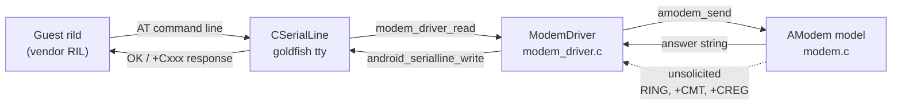
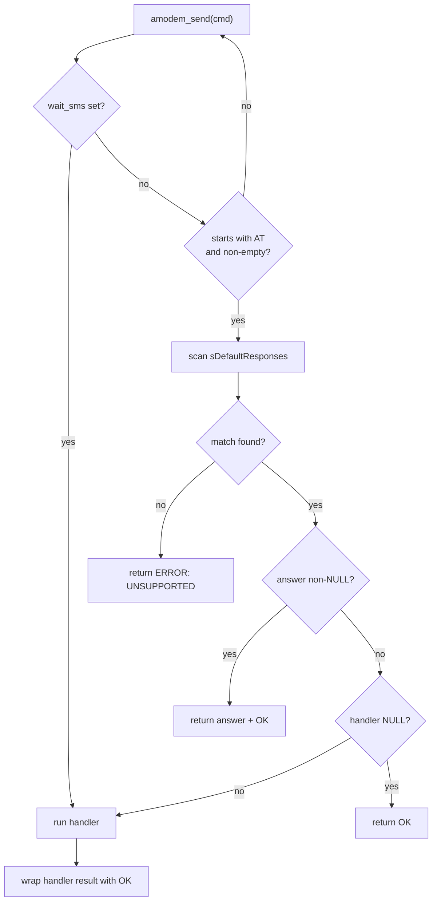
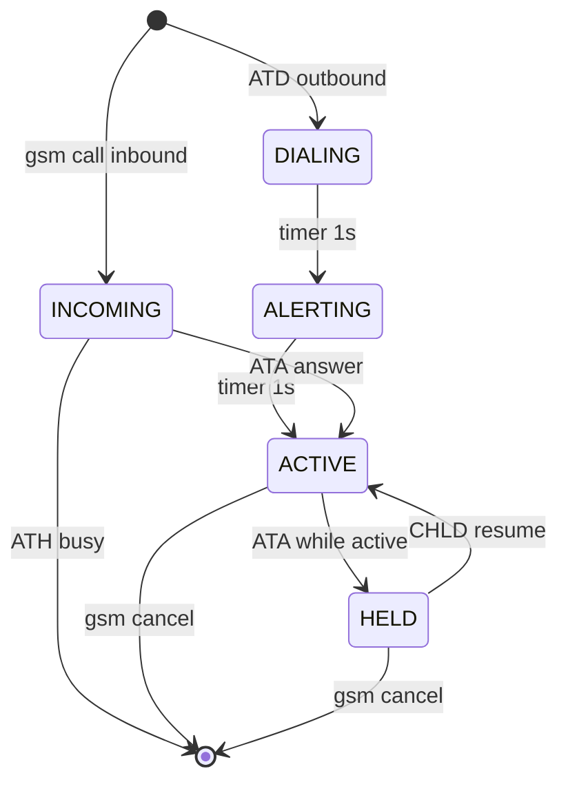
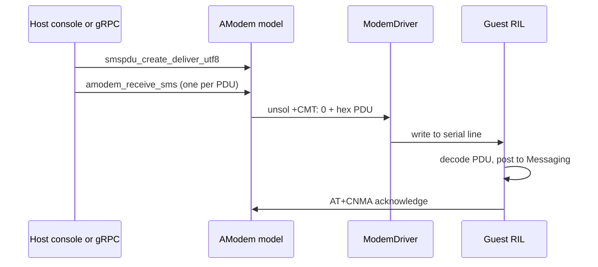
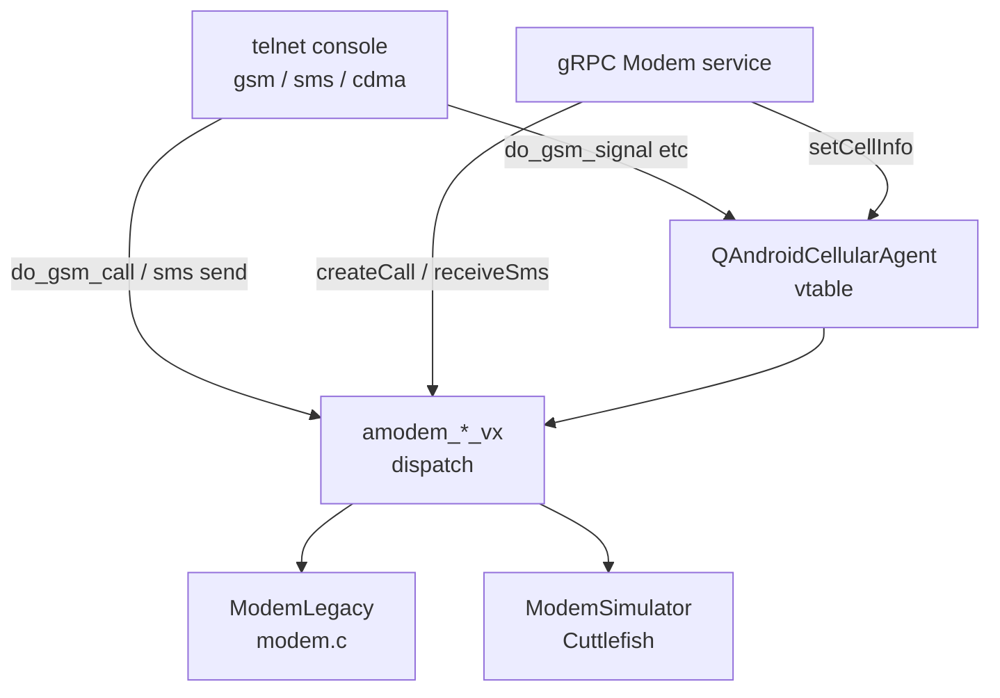
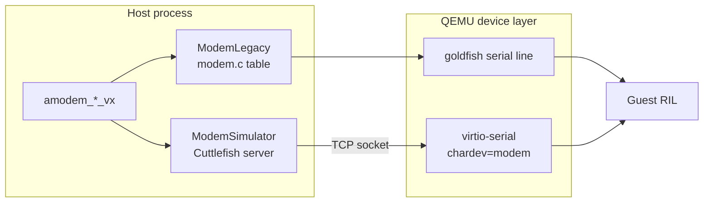

# Chapter 21: Modem and Telephony

A physical Android phone has a baseband processor that speaks a radio protocol to a real cellular tower. The emulator has none of that. Instead it ships a software modem that pretends to be a baseband: it accepts the same AT commands the guest's Radio Interface Layer (RIL) would send to real hardware, and it answers with the same response strings a real modem would return. The guest never knows the difference. From `system_server`'s telephony stack down through the vendor RIL, everything believes it is talking to a GSM/LTE radio over a serial line.

This chapter follows the AT-command modem from the bytes the guest writes on a serial port, through the command-dispatch table that interprets them, into the in-memory model of calls, SMS, signal strength, and network registration, and back out to the host-side console and gRPC commands that let you inject an inbound call or text message. It also covers the second, newer backend: the Cuttlefish-derived modem simulator that the emulator can run instead of the classic in-process modem, selected by a feature flag and wired over virtio-serial. The code lives mostly under `external/qemu/android/emu/telephony/`, with the QEMU glue in `external/qemu/android-qemu2-glue/` and the host control surfaces in `external/qemu/android/android-emu/android/console.cpp` and the gRPC services.

---

## 21.1 The Modem as a Serial Peripheral

On a real device the RIL daemon (`rild`) opens a character device and exchanges text with the baseband. The emulator reproduces that channel exactly. The classic modem driver implements a QEMU character device and treats every line the guest writes as an AT command, feeding it to the modem model and writing the model's answer back.

The driver state is small: a serial line handle, the modem object, and a line-assembly buffer.

```c
// Source: external/qemu/android/emu/telephony/src/android/telephony/modem_driver.c
typedef struct {
    CSerialLine*      serial_line;
    AModem            modem;
    char              in_buff[ 1024 ];
    int               in_pos;
    int               in_sms;
} ModemDriver;
```

The comment at the top of that file names the contract precisely: the device "communicates through a serial port with 'rild' (Radio Interface Layer Daemon) on the emulated device." The function that handles guest writes is, confusingly, named `modem_driver_read` — its comment notes that "despite its name, this function is called when the device writes to the modem." It accumulates bytes until it sees a carriage return or newline, terminates the buffer, and hands the complete line to `amodem_send`.

```c
// Source: external/qemu/android/emu/telephony/src/android/telephony/modem_driver.c
md->in_buff[ md->in_pos ] = 0;
md->in_pos                = 0;
answer = amodem_send(android_modem, md->in_buff);
if (answer != NULL) {
    len = strlen(answer);
    if (len == 2 && answer[0] == '>' && answer[1] == ' ')
        md->in_sms = 1;
    android_serialline_write(md->serial_line, (const uint8_t*)answer, len);
    android_serialline_write(md->serial_line, (const uint8_t*)"\r", 1);
}
```

The `in_sms` flag captures a subtlety of the AT protocol: when the modem answers a send-SMS command with the two-byte prompt `"> "`, the next thing the guest writes is not a command but the raw PDU body, terminated by a Ctrl-Z (byte 26). The driver switches into a mode where it collects that body verbatim instead of splitting on the first newline.

Unsolicited messages — the modem proactively telling the guest about an incoming call, a new SMS, or a registration change — flow in the opposite direction through `modem_driver_unsol`, which simply writes the message string to the serial line without any request having been made.

The whole thing is set up by `android_modem_init`, which creates the modem and registers the read/can-read handlers on the serial line.

### 21.1.1 The serial-line write path

The data path from guest to modem and back



Every box here is real: `CSerialLine` is the abstraction `modem_driver.h` includes from `android/emulation/serial_line.h`, `ModemDriver` is the struct above, and `AModem` is the opaque handle declared in `external/qemu/android/emu/telephony/include/android/telephony/modem.h`.

## 21.2 The AT-Command Dispatch Table

The heart of the modem is one big static table mapping AT-command strings to handlers. Each entry has a command string, an optional canned answer, and an optional handler function. The dispatch loop in `amodem_send` walks the table looking for a match.

```c
// Source: external/qemu/android/emu/telephony/src/android/telephony/modem.c
static const struct {
    const char*      cmd;     /* command coming from libreference-ril.so, if first
                                 character is '!', then the rest is a prefix only */
    const char*      answer;  /* default answer, NULL if needs specific handling or
                                 if OK is good enough */
    ResponseHandler  handler; /* specific handler, ignored if 'answer' is not NULL,
                                 NULL if OK is good enough */
} sDefaultResponses[] =
```

A leading `!` in the command marks a prefix match — `"!+CMGS="` matches any line starting with `AT+CMGS=`, because the rest of the line carries arguments. Without the `!`, the match must be exact. The matching rule is right there in the loop:

```c
// Source: external/qemu/android/emu/telephony/src/android/telephony/modem.c
if (scmd[0] == '!') { /* prefix match */
    int  len = strlen(++scmd);
    if ( !memcmp( scmd, cmd, len ) ) {
        found = 1;
        break;
    }
} else { /* full match */
    if ( !strcmp( scmd, cmd ) ) {
        found = 1;
        break;
    }
}
```

Three outcomes are possible for a matched entry, and the resolution order matters:

1. If `answer` is non-NULL, the modem returns that canned string followed by `OK` — used for static queries like `AT+CTEC=?` returning `"+CTEC: 0,1,2,3"`.
2. If `handler` is NULL, the modem returns a bare `OK` — used for commands the guest sends during init that the model can safely ignore.
3. Otherwise the handler runs and its return value becomes the response, with `OK` appended unless the handler already returned an error or a continuation prompt.

The `REPLY` macro and the error-prefix checks enforce that last rule. If a handler returns a string beginning with `"> "`, `"ERROR"`, or `"+CME ERROR"`, that string is sent as-is; anything else is wrapped with a trailing `"\rOK"`.

The table comments are a map of the guest RIL's expectations. Lines like `/* see requestSignalStrength() */` above `{ "+CSQ", NULL, handleSignalStrength }` name the exact RIL request that triggers each command. This is the contract between the emulator and the reference RIL: the modem implements the commands the reference RIL is known to send, and unknown commands fall through to `"ERROR: UNSUPPORTED"`.

### 21.2.1 A tour of the command families

The table covers the AT command families the Android telephony stack exercises. A representative slice:

- Radio power: `+CFUN=0`/`+CFUN=1` toggle the radio via `handleRadioPower`; `+CFUN?` reports it via `handleRadioPowerReq`.
- Network registration: `+CREG`/`+CGREG` set and report voice and data registration through `handleNetworkRegistration`.
- Signal strength: `+CSQ` returns the current RSSI/BER through `handleSignalStrength`.
- Calls: `D` dials (`handleDial`), `+CLCC` lists current calls (`handleListCurrentCalls`), `A`/`H`/`+CHLD` answer and hang up.
- SMS: `+CMGS=` sends, `+CMGW=` writes to SIM, `+CNMI` configures new-message indications.
- SIM access: `+CRSM` and `+CSIM` perform restricted and generic SIM file I/O via the SIM card model.
- Operator and technology: `+COPS` selects the operator, `+CTEC` switches the radio technology.

Notice the IMEI is hard-coded: `{ "+CGSN", "358240051111110", NULL }`, with a comment explaining the Type Allocation Code prefix `35824005` identifies a Nexus 5, followed by a serial and a check digit. The IMSI returned by `+CIMI` is built from the home MCC/MNC.

The dispatch decision flow



## 21.3 The Modem Object and Its State

The modem is a single C struct, `AModemRec_`, declared opaque in the public header and defined in `modem.c`. It holds everything the emulated baseband needs to remember between commands: radio state, signal parameters, the SIM card, registration state for voice and data, operator names, data contexts, and the active call array.

```c
// Source: external/qemu/android/emu/telephony/src/android/telephony/modem.c
typedef struct AModemRec_
{
    char          supportsNetworkDataType;
    ARadioState   radio_state;
    int           area_code;
    int           cell_id;
    int           base_port;
    int             use_signal_profile;
    signal_strength quality;
    int             rssi;
    int             ber;
    ASimCard      sim;
    ARegistrationState       voice_state;
    ARegistrationState       data_state;
    ADataNetworkType         data_network;
    AVoiceCallRec       calls[ MAX_CALLS ];
    int                 call_count;
    AModemUnsolFunc     unsol_func;
    void*               unsol_opaque;
    /* ... */
} AModemRec;
```

`amodem_reset` seeds the defaults that the guest sees on first boot. The radio comes up off (`A_RADIO_STATE_OFF`); the guest turns it on with `AT+CFUN=1`. Signal quality defaults to `MODERATE` (two bars), and the operator table is preloaded with two entries: the home network "Android" with MCC/MNC `310260`, and a roaming network "TelKila" with `310295`.

```c
// Source: external/qemu/android/emu/telephony/src/android/telephony/modem.c
strcpy( modem->operators[0].name[0], OPERATOR_HOME_NAME );    // "Android"
strcpy( modem->operators[0].name[2], OPERATOR_HOME_MCCMNC );  // "310260"
strcpy( modem->operators[1].name[0], OPERATOR_ROAMING_NAME ); // "TelKila"
strcpy( modem->operators[1].name[2], OPERATOR_ROAMING_MCCMNC );// "310295"
modem->voice_state  = A_REGISTRATION_HOME;
modem->data_state   = A_REGISTRATION_HOME;
modem->data_network = A_DATA_NETWORK_LTE;
```

The maximum of four concurrent calls is fixed by `#define MAX_CALLS 4`. Each slot is an `AVoiceCallRec` carrying the `ACallRec` (id, direction, state, mode, number), a timer used to advance dialing/alerting states, a back-pointer to the modem, and an `is_remote` flag set when the dialed number belongs to another running emulator.

### 21.3.1 Snapshot save and load

Because the modem is part of the virtual machine, its state must survive snapshots. `modem_init.c` registers a save/load handler with QEMU's migration framework under the name `"android_modem"`, versioned by `MODEM_DEV_STATE_SAVE_VERSION` (currently 2). The save and load functions bridge QEMU's `QEMUFile` to the modem's `SysFile` abstraction.

```c
// Source: external/qemu/android-qemu2-glue/telephony/modem_init.c
register_savevm_live(NULL,
                "android_modem",
                0,
                MODEM_DEV_STATE_SAVE_VERSION,
                &modem_vmhandlers,
                android_modem);
```

A comment in the modem's own save routine is candid about scope: it persists calls and the call count but admits "TODO: save more than just calls and call_count - rssi, power, etc." On restore the code wants to nudge the guest into re-reading the clock, which it does by sneaking a time update into the next periodic signal-strength poll (Section 21.6).

## 21.4 Voice Calls

A voice call has a lifecycle that the modem advances both in response to guest commands and on its own timers. The model is small but captures the essential GSM call states: dialing, alerting, active, held, incoming, and waiting.

When the guest dials with `ATD<number>;`, `handleDial` allocates a call slot, sets it to `A_CALL_DIALING` with direction `A_CALL_OUTBOUND`, copies the number, and arms a timer:

```c
// Source: external/qemu/android/emu/telephony/src/android/telephony/modem.c
call->dir   = A_CALL_OUTBOUND;
call->state = A_CALL_DIALING;
call->mode  = A_CALL_VOICE;
vcall->is_remote = (remote_number_string_to_port(call->number) > 0);
vcall->timer = sys_timer_create();
sys_timer_set( vcall->timer, sys_time_ms() + CALL_DELAY_DIAL,
               voice_call_event, vcall );
```

`CALL_DELAY_DIAL` and `CALL_DELAY_ALERT` are both 1000 ms. When the timer fires, `voice_call_event` walks the state machine: a dialing call becomes alerting, and an alerting call becomes active. For a local number it just chains another timer to simulate the ring; for a remote number (another emulator on the host) it places an actual inter-emulator call through `remote_call_dial`. Crucially, the success or failure of a dial is never returned synchronously — the table comment notes the result "is ignored, the call state will be polled through +CLCC instead." The guest discovers what happened by repeatedly issuing `AT+CLCC`.

The call state machine



An inbound call is created by `amodem_add_inbound_call`, which first checks the radio is on, allocates a slot with state `A_CALL_INCOMING` and direction `A_CALL_INBOUND`, and then calls `amodem_send_calls_update`. That function's name is misleading; its body just sends the unsolicited string `"RING\r"`:

```c
// Source: external/qemu/android/emu/telephony/src/android/telephony/modem.c
amodem_send_calls_update( AModem  modem )
{
   /* despite its name, this really tells the system that the call
    * state has changed */
    amodem_unsol( modem, "RING\r" );
}
```

`RING` is the cue for the guest to poll `+CLCC` and discover the new incoming call. The whole protocol is poll-driven: the modem only ever nudges the guest, and the guest reads the authoritative list. `amodem_add_inbound_call` returns one of the `ACallOpResult` codes — `A_CALL_RADIO_OFF`, `A_CALL_EXCEED_MAX_NUM`, or `A_CALL_OP_OK` — which the gRPC layer maps to gRPC status codes.

### 21.4.1 Calls between two emulators

A useful feature falls out of the `is_remote` flag. If you dial a number that decodes to the console port of another emulator running on the same host, `remote_number_string_to_port` returns a positive port and the call becomes a real socket conversation between the two emulators via `remote_call.c`. State changes propagate: putting the call on hold sends `REMOTE_CALL_HOLD` to the peer, accepting sends `REMOTE_CALL_ACCEPT`.

```c
// Source: external/qemu/android/emu/telephony/src/android/telephony/modem.c
case A_CALL_HELD:
    remote_call_other( number, port, REMOTE_CALL_HOLD );
    break;
case A_CALL_ACTIVE:
    remote_call_other( number, port, REMOTE_CALL_ACCEPT );
    break;
```

## 21.5 SMS

SMS in the emulator is genuine GSM 03.40 PDU handling, not a shortcut. The `sms.h` header exposes a full PDU toolkit: build SMS-DELIVER PDUs from UTF-8 text, parse SMS-SUBMIT PDUs the guest sends, convert to and from hex, and reassemble multipart messages.

```c
// Source: external/qemu/android/emu/telephony/include/android/telephony/sms.h
typedef struct SmsPDURec*   SmsPDU;

extern SmsPDU*  smspdu_create_deliver_utf8( const unsigned char*   utf8,
                                            int                    utf8len,
                                            const SmsAddressRec*   sender_address,
                                            const SmsTimeStampRec* timestamp );
extern SmsPDU   smspdu_create_from_hex( const char*  hex, int  hexlen );
extern int      smspdu_to_hex( SmsPDU  pdu, char*  hex, int  hexsize );
```

`smspdu_create_deliver_utf8` returns an array because a long message must be split into several concatenated SMS PDUs; the array is NULL-terminated. The address handling follows the spec: `SMS_ADDRESS_MAX_SIZE` is 10 octets and characters are packed at `BITS_PER_SMS_CHAR` (7 bits) for the GSM default alphabet, with `is_in_gsm_default_alphabet` deciding whether a character can use the 7-bit packing in `gsm.c`.

To deliver an inbound SMS to the guest, `amodem_receive_sms` encodes the PDU as hex, wraps it in a `+CMT:` unsolicited header, and pushes it down the serial line.

```c
// Source: external/qemu/android/emu/telephony/src/android/telephony/modem.c
#define  SMS_UNSOL_HEADER  "+CMT: 0\r\n"
strcpy( modem->out_buff, SMS_UNSOL_HEADER );
p   = modem->out_buff + (sizeof(SMS_UNSOL_HEADER)-1);
len = smspdu_to_hex( sms, p, max );
/* ... terminate with \r\n ... */
modem->unsol_func( modem->unsol_opaque, modem->out_buff );
```

When the guest sends an SMS, the flow runs the other way. `AT+CMGS=` matches `handleSendSMS`, the modem returns the `"> "` prompt, the driver flips into `in_sms` mode, the guest writes the PDU body, and `handleSendSMSText` parses the SMS-SUBMIT.

Sending an SMS from the host to the guest



## 21.6 Signal Strength and Network Registration

The guest polls signal strength roughly every 15 seconds by sending `AT+CSQ`. There are two ways the modem decides what to report. If a profile is active (`use_signal_profile`), it returns a precomputed row from `NET_PROFILES`, a five-entry table indexed by quality from `NONE` to `GREAT`. Otherwise it returns the raw `rssi`/`ber` values that the host last set.

```c
// Source: external/qemu/android/emu/telephony/src/android/telephony/modem.c
static const signal_t NET_PROFILES[5] = {
    /* NONE  */ {0, 7, 105, 160, 110, 160, 0, 105, 140, 3, -200, 0, 500},
    /* POOR  */ {5, 5, 100, 150, 100, 150, 2, 100, 110,  5, 0, 2, 300},
    /* MODERATE */ {12, 4, 90, 120, 80, 120, 4, 90, 100, 10, 30, 7, 200},
    /* GOOD  */ {20, 2, 80, 100, 70, 100, 6, 70, 90, 15, 100, 12, 100},
    /* GREAT */ {30, 0, 70, 80, 60, 80, 7, 60, 80, 20, 200, 15, 50},
};
```

The thirteen fields cover GSM, CDMA, EVDO, and LTE signal metrics — RSSI, BER, dBm, Ec/Io, SNR, RSRP, RSRQ, CQI, and timing advance — derived, per the source comment, from the ranges used by the `SignalStrength` class in the framework's telephony layer. `handleSignalStrength` emits them all in one `+CSQ:` line.

Because `+CSQ` is periodic, the modem piggybacks other one-time updates onto it. On the first poll, on wake from sleep, and after a snapshot restore, the handler also sends a NITZ time update (`%CTZV:`) and a physical-channel-configuration update. This is an explicit workaround noted in the comments: there is no clean way to prod the guest, so the modem rides the signal poll it knows is coming.

Network registration is split into voice (`+CREG`) and data (`+CGREG`). The guest sets the unsolicited reporting mode with `AT+CREG=2`, and thereafter the modem reports `stat` plus the area code and cell id whenever they change.

```c
// Source: external/qemu/android/emu/telephony/src/android/telephony/modem.c
if (modem->voice_mode == A_REGISTRATION_UNSOL_ENABLED_FULL)
    return amodem_printf( modem, "+CREG: %d,%d, \"%04x\", \"%04x\"",
                           modem->voice_mode, modem->voice_state,
                           modem->area_code, modem->cell_id );
```

The `stat` values come from `ARegistrationState`: unregistered, home, searching, denied, unknown, roaming. When the host changes the data registration to anything other than home or roaming, the QEMU glue also disables the host network shaper, simulating loss of connectivity.

## 21.7 The SIM Card

The modem owns an `ASimCard`, created in `amodem_create` from `asimcard_create(base_port, sim_present)`. Whether a SIM is present at all is decided at startup by `sim_is_present` in the glue, which returns false only if the command line passed `-no-sim`.

```c
// Source: external/qemu/android-qemu2-glue/telephony/modem_init.c
bool sim_is_present() {
    EmulatorWindow* const ew = getConsoleAgents()->emu->getEmulatorWindow();
    if (ew) {
        if (ew->opts->no_sim)
            return false;
    }
    return true;
}
```

SIM file access uses the standard `AT+CRSM` (restricted SIM access) and `AT+CSIM` (generic SIM access) commands, which the modem forwards to `asimcard_io` and `asimcard_csim`. The SIM model in `sim_card.c` holds a small table of elementary files keyed by their hex file ids — for example `0x2fe2` is the ICCID file, `0x6f14` and `0x6f11` are operator-related files — and a set of canned `+CRSM:` responses for the exact command lines the RIL is known to send. SIM files can be marked read-only or PIN-protected via flags like `SIM_FILE_READ_ONLY` and `SIM_FILE_NEED_PIN`.

The modem also models logical channels for the carrier-API / UICC applet world: `AT+CCHO` opens a logical channel and returns its number, `AT+CCHC` closes it, and `AT+CGLA` transmits an APDU on it. There are `MAX_LOGICAL_CHANNELS` (16) slots; channel 0 is the always-open basic channel with the master-file id `0x3F00`.

## 21.8 The Host Control Plane

So far everything has been guest-facing. The host injects events — inbound calls, text messages, signal changes — through two surfaces that ultimately call the same modem functions: the text console (telnet) and gRPC.

### 21.8.1 Console commands

`console.cpp` registers three command groups: `gsm`, `cdma`, and `sms`. The `gsm` group is the largest, with subcommands `list`, `call`, `busy`, `hold`, `accept`, `cancel`, `data`, `meter`, `voice`, `status`, `signal`, and `signal-profile`. Each maps to a `do_gsm_*` handler.

`gsm call` validates the number format and then injects an inbound call:

```cpp
// Source: external/qemu/android/android-emu/android/console.cpp
static int do_gsm_call(ControlClient client, char* args) {
    if (gsm_check_number(args)) {
        control_write(client,
                "KO: bad phone number format, use digits, # and + only\r\n");
        return -1;
    }
    if (!android_modem_get()) {
        control_write(client, "KO: modem emulation not running\r\n");
        return -1;
    }
    amodem_add_inbound_call_vx(android_modem_get(), args);
    return 0;
}
```

`gsm signal <rssi> [<ber>]` validates that RSSI is 0..31 or 99 and BER is 0..7 or 99 before calling `amodem_set_signal_strength`. `sms send <number> <text>` un-escapes the text into UTF-8, builds a list of SMS-DELIVER PDUs with `smspdu_create_deliver_utf8`, and delivers each with `amodem_receive_sms_vx`; `sms sendpdu <hexstring>` lets you inject a raw PDU directly.

### 21.8.2 The cellular agent

The console and gRPC layers do not call the modem directly for cellular-state changes; they go through the `QAndroidCellularAgent`, a vtable of function pointers defined in `cellular_agent.h` and implemented in `qemu-cellular-agent-impl.c`. This indirection keeps the UI and control code free of modem internals.

```c
// Source: external/qemu/android-qemu2-glue/qemu-cellular-agent-impl.c
static const QAndroidCellularAgent sQAndroidCellularAgent = {
    .setSignalStrength = cellular_setSignalStrength,
    .setSignalStrengthProfile = cellular_setSignalStrengthProfile,
    .setVoiceStatus = cellular_setVoiceStatus,
    .setMeterStatus = cellular_setMeterStatus,
    .setDataStatus = cellular_setDataStatus,
    .setStandard = cellular_setStandard,
    .setSimPresent = cellular_setSimPresent};
```

`cellular_setStandard` is the interesting one: switching the data standard (GSM, EDGE, UMTS, LTE, 5G, ...) does double duty. It looks up download/upload rates in a speed table, reprograms the network shaper with `netshaper_set_rate`, and tells the modem the new radio technology with `amodem_set_data_network_type_vx`. So changing the cellular standard from the UI both throttles the emulated network and changes what the guest's telephony stack reports as its network type.

### 21.8.3 The gRPC Modem service

The modern control surface is the gRPC `Modem` service in `modem_service.proto`, served by `ModemService.cpp`. It exposes `setCellInfo`, `getCellInfo`, `createCall`, `updateCall`, `deleteCall`, `listCalls`, `receiveSms`, `updateClock`, and a streaming `receivePhoneEvents`. The service comment notes it is "supported for API > 31."

The server maps proto enums to the modem's C enums with translation tables and then calls the same `_vx` functions. `createCall` is illustrative — it injects the call, translates result codes to gRPC status, then reads the call back to return its state:

```cpp
// Source: external/qemu/android/android-grpc/services/incubating/modem/server/src/android/emulation/control/incubating/ModemService.cpp
int result = amodem_add_inbound_call_vx(mModem, request->number().c_str());
if (result == A_CALL_RADIO_OFF) {
    return ::grpc::Status(::grpc::StatusCode::FAILED_PRECONDITION,
                          "The radio is turned off.");
}
if (result == A_CALL_EXCEED_MAX_NUM) {
    return ::grpc::Status(::grpc::StatusCode::FAILED_PRECONDITION,
                          "There are too many active calls.");
}
```

`receivePhoneEvents` registers a `telephony_callback` with the telephony agent; whenever the active-call count changes, the modem fires the callback, which lists the calls and broadcasts a `PhoneEvent` to all gRPC stream listeners. The `receiveSms` RPC accepts either plain `text` or a hex `encodedMessage`, mirroring the two console SMS commands.

How host control surfaces reach the modem



## 21.9 Two Backends: Legacy Modem and the Modem Simulator

Everything above describes the classic in-process modem (`modem.c`), but the emulator can run a second, newer baseband: the modem simulator imported from Cuttlefish, living under `external/qemu/android/third_party/modem-simulator/`. The choice is hidden behind the `_vx` functions in `android_modem_v2.cpp`, which delegate to a `ModemBase` pointer.

```cpp
// Source: external/qemu/android/third_party/modem-simulator/android_modem_v2.cpp
static std::unique_ptr<android::modem::ModemBase> s_modem{
        new android::modem::ModemLegacy()};

void init_modem_simulator() {
    static std::once_flag just_once;
    std::call_once(just_once, [&]() {
            s_modem.reset(new android::modem::ModemSimulator());
    });
}
```

The default is `ModemLegacy`, a thin adapter over the `modem.c` model this chapter has dissected. `ModemBase` is a pure-virtual interface (`number_of_calls`, `add_inbound_call`, `receive_sms`, `set_signal_strength_profile`, and so on), so the rest of the emulator never knows which backend is live.

`init_modem_simulator` swaps in `ModemSimulator` only when the `ModemSimulator` feature flag is enabled. The glue in `main.cpp` does the wiring:

```cpp
// Source: external/qemu/android-qemu2-glue/main.cpp
if (feature_is_enabled(kFeature_ModemSimulator) && !opts->ui_only) {
    if (create_modem_simulator_configs(hw, opts->icc_profile)) {
        init_modem_simulator();
        /* ... */
        int modem_simulator_guest_port =
                cuttlefish::start_android_modem_simulator_detached(
                        modem_simulator_port, isIpv4, std::move(timezone),
                        opts->phone_number);
        args.add("-device");
        args.add("virtio-serial,ioeventfd=off");
        args.addFormat(
                "socket,port=%d,host=%s,nowait,nodelay,reconnect=10,%s,id=modem",
                modem_simulator_guest_port, ...);
        args.add("-device");
        args.add("virtserialport,chardev=modem,name=modem");
    }
}
```

The transport differs from the legacy path. Instead of a goldfish tty wired straight into the in-process modem, the simulator runs as a detached server on a TCP socket, and QEMU bridges the guest to it with a `virtio-serial` port named `modem` over a reconnecting socket chardev. `start_android_modem_simulator_detached` sets `android_modem_version = 2`, starts the Cuttlefish `ModemSimulator` instances with a timezone and phone number, and returns the guest-side port. This is the same modem code path Cuttlefish uses, which is why the simulator carries its own NVRAM config, ICCID profiles, and a richer AT-command implementation than the legacy table.

The two backends and their transports



## 21.10 Try It

The console commands work on any running emulator. Connect to the console and authenticate first.

- Connect to the console: `telnet localhost 5554`, then `auth <token>` using the token from the auth-token file whose path the console prints when you connect.
- Simulate an incoming call: at the console prompt type `gsm call 5551234`. The dialer should ring. List the call state with `gsm list`.
- End the call from the host: `gsm cancel 5551234`.
- Deliver a text message: `sms send 5551234 Hello from the host`. Check the Messaging app in the guest.
- Inject a raw PDU: `sms sendpdu <hexstring>` with a valid SMS-DELIVER hex string.
- Drop the signal to one bar, then restore it: `gsm signal-profile 1`, wait about 15 seconds for the next `+CSQ` poll, then `gsm signal-profile 4`.
- Force a roaming indicator: `gsm voice roaming`, and put the data connection into searching: `gsm data searching`.
- Change the network technology and watch the status bar: `gsm data lte` versus `gsm data gprs`. Confirm with `gsm status`.
- Watch the AT traffic: start the emulator with `emulator -avd <name> -verbose`, and add `-debug modem` to log every AT command line the modem handles (the driver wires `VERBOSE_CHECK(modem)` into `android_telephony_debug_modem`).
- Boot without a SIM to exercise the no-SIM path: `emulator -avd <name> -no-sim`, then check `gsm status` and the SIM state in Settings.

## Summary

- The emulated modem presents itself to the guest RIL as a serial peripheral; the guest writes AT command lines and reads back the same response strings a real GSM/LTE baseband would return.
- `modem_driver.c` assembles serial bytes into command lines, forwards each to `amodem_send`, and handles the `"> "` prompt that switches into raw SMS-body capture.
- A single static dispatch table, `sDefaultResponses`, maps AT commands to canned answers or handler functions, with a leading `!` marking prefix matches; unknown commands return `ERROR: UNSUPPORTED`.
- All modem state lives in one `AModemRec_` struct — radio power, signal parameters, SIM card, voice/data registration, operator table, and up to four active calls — and is saved and restored across snapshots under the QEMU device name `android_modem`.
- Voice calls advance through a timer-driven state machine; the modem only sends `RING` to nudge the guest, which then polls `+CLCC` for the authoritative call list. Dialing another emulator's port produces a real inter-emulator call.
- SMS uses genuine GSM 03.40 PDU encoding; inbound messages arrive as unsolicited `+CMT:` lines and multipart messages are split into concatenated PDUs.
- Signal strength is polled by the guest with `+CSQ` about every 15 seconds, served either from a five-level profile table or raw host-set values; the modem piggybacks NITZ time and physical-channel-config updates onto that poll.
- Host control flows through the telnet console (`gsm`/`sms`/`cdma`), the `QAndroidCellularAgent` vtable, and the gRPC `Modem` service, all of which funnel into the same `amodem_*_vx` functions.
- A feature flag selects between the legacy in-process modem and the Cuttlefish modem simulator, the latter running as a detached TCP server bridged to the guest over virtio-serial.

### Key Source Files

| File | Purpose |
|------|---------|
| `external/qemu/android/emu/telephony/src/android/telephony/modem.c` | The AT-command model: dispatch table, calls, registration, signal, SIM glue |
| `external/qemu/android/emu/telephony/include/android/telephony/modem.h` | Public modem API and the call/registration/signal enums |
| `external/qemu/android/emu/telephony/src/android/telephony/modem_driver.c` | Serial-line character device that feeds AT lines to the modem |
| `external/qemu/android/emu/telephony/src/android/telephony/sms.c` | GSM 03.40 SMS PDU encode/decode |
| `external/qemu/android/emu/telephony/src/android/telephony/sim_card.c` | SIM elementary-file model and `+CRSM`/`+CSIM` responses |
| `external/qemu/android-qemu2-glue/telephony/modem_init.c` | QEMU init and snapshot save/load registration |
| `external/qemu/android-qemu2-glue/qemu-cellular-agent-impl.c` | `QAndroidCellularAgent` implementation bridging host controls to the modem |
| `external/qemu/android/android-emu/android/console.cpp` | `gsm`/`sms`/`cdma` console command handlers |
| `external/qemu/android/android-grpc/services/incubating/modem/server/src/android/emulation/control/incubating/ModemService.cpp` | gRPC `Modem` service implementation |
| `external/qemu/android/third_party/modem-simulator/android_modem_v2.cpp` | `_vx` dispatch selecting `ModemLegacy` vs `ModemSimulator` |
