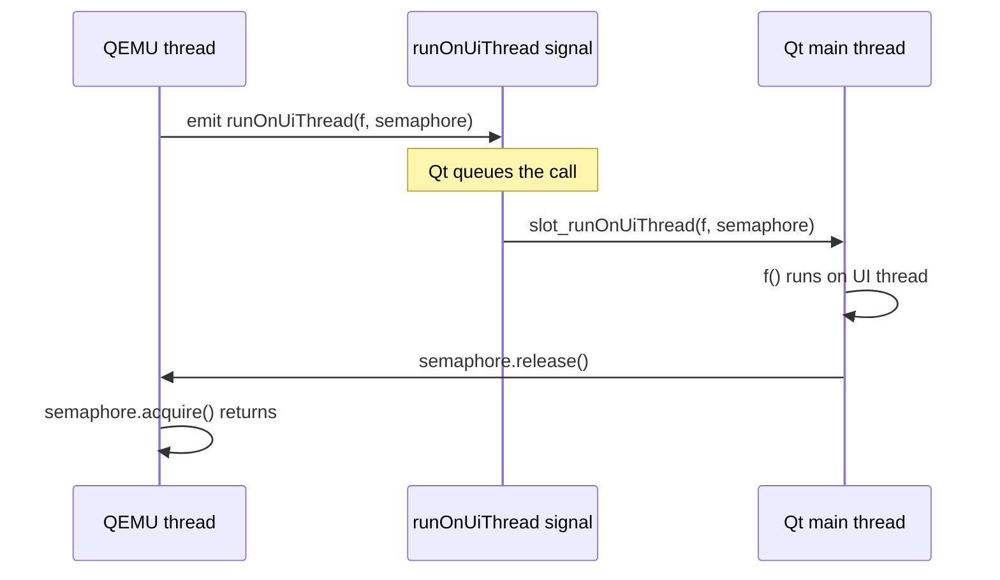
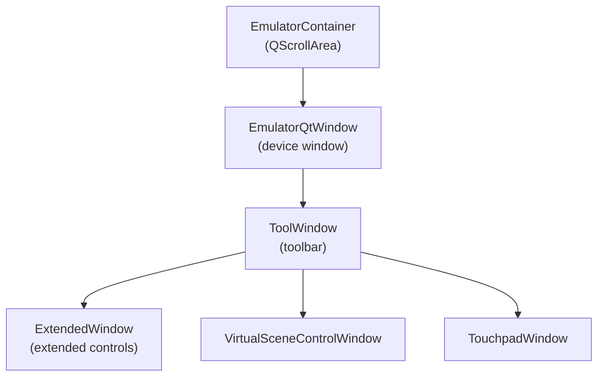
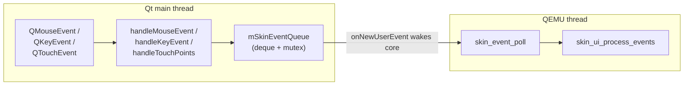
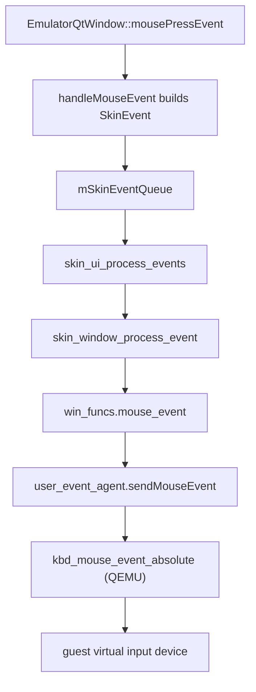
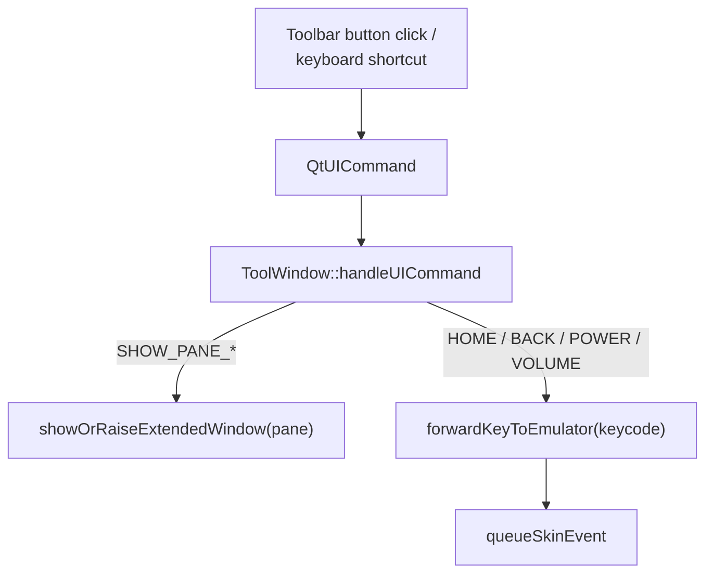
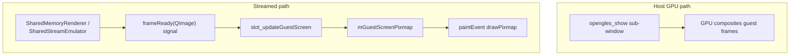
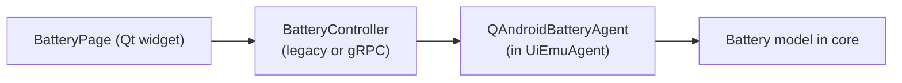
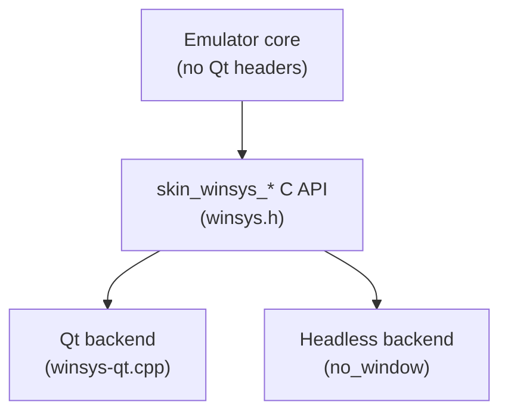

# Chapter 22: The Qt UI

When you launch the Android Emulator with a display, the window you see, the rounded phone bezel, the vertical toolbar with its rotate and screenshot buttons, the "Extended controls" panel where you fake a GPS fix or drain the battery, is all drawn by a Qt 6 application that lives in `external/qemu/android/android-ui/`. That Qt application is not the emulator core. The core (QEMU, the virtual CPU, the virtual input devices) runs on a *separate* thread, and the two halves communicate through a deliberately narrow set of interfaces: a C `skin_winsys_*` API in one direction, a queue of `SkinEvent` structs and a table of agent function pointers in the other.

This chapter follows a single mouse click from the moment Qt delivers a `QMouseEvent` to `EmulatorQtWindow` all the way down to `kbd_mouse_event_absolute()` inside QEMU, and the screen frame back up from the host GPU to the pixels you see. Along the way we look at how the skin file describes the bezel and buttons, how the toolbar and extended-controls panels reuse the very same event queue that real input uses, and how the UI calls into the core through the typed agent interfaces collected in `UiEmuAgent`.

---

## 22.1 Two Threads, One Window

The single most important fact about the Qt UI is that it does not run on the same thread as the emulator core. Qt owns the process's main thread and runs `QApplication::exec()`; the QEMU machine runs in a worker thread spawned by the UI.

`skin_winsys_spawn_thread()` is the handoff. When the program decides to bring up the windowed UI, it asks the winsys layer to spawn the core's entry function on a new thread, then enters the Qt event loop on the original thread.

```cpp
// Source: external/qemu/android/android-ui/modules/aemu-ui-qt/src/android/skin/qt/winsys-qt.cpp
extern void skin_winsys_spawn_thread(bool no_window,
                                     StartFunction f,
                                     int argc,
                                     char** argv) {
    ...
    EmulatorQtWindow* window = EmulatorQtWindow::getInstance();
    ...
    window->startThread(f, argc, argv);
}
```

`EmulatorQtWindow::startThread()` constructs a `MainLoopThread`, a tiny `QThread` subclass whose entire `run()` body is a call to the supplied start function (`external/qemu/android/android-ui/modules/aemu-ui-qt/src/android/skin/qt/emulator-qt-window.h:80`). That start function is QEMU's main loop. From that point the process has two long-lived loops: Qt's `g->app->exec()` on the main thread (`winsys-qt.cpp:239`) and QEMU's machine loop on the `MainLoopThread`.

### 22.1.1 Why the split exists

Qt insists that all widget manipulation happen on the thread that created `QApplication`. QEMU, meanwhile, wants to own its own loop and block in its own select/poll. Putting them on one thread would force one to drive the other's event pump, which neither library tolerates well. Splitting them keeps each loop idiomatic, at the cost of needing a thread-safe channel between them, which is what the rest of this chapter is about.

### 22.1.2 Crossing back to the UI thread

The core frequently needs the UI to do something, resize the window, repaint, show an error dialog, and those operations must run on the Qt thread. The bridge is `skin_winsys_run_ui_update()`, which marshals a function pointer onto the Qt thread and optionally blocks until it finishes:

```cpp
// Source: external/qemu/android/android-ui/modules/aemu-ui-qt/src/android/skin/qt/winsys-qt.cpp
void skin_winsys_run_ui_update(SkinGenericFunction f, void* data, bool wait) {
    EmulatorQtWindow* const window = EmulatorQtWindow::getInstance();
    ...
    if (wait) {
        QSemaphore semaphore;
        window->runOnUiThread([f, data]() { ...; f(data); }, &semaphore);
        semaphore.acquire();
    } else {
        window->runOnUiThread([f, data]() { ...; f(data); }, nullptr);
    }
}
```

`runOnUiThread` is a Qt signal connected to `slot_runOnUiThread` through an ordinary (non-blocking) connection (`emulator-qt-window.cpp:750`). Because the signal is emitted from the QEMU thread but the slot executes on the Qt thread, Qt queues the call. The optional `QSemaphore` is how the caller blocks: the slot releases the semaphore when the lambda returns (`emulator-qt-window.cpp:3389`), so the QEMU thread can `acquire()` and know the UI work is done. The long comment in `emulator-qt-window.h` (lines 156 to 172) documents this pattern: every cross-thread signal in that header carries an optional `QSemaphore*` for exactly this reason.

UI-thread handoff for a core-initiated update



## 22.2 The Component Map

Before tracing data flow, it helps to name the widgets. The windowed UI is built from a handful of top-level `QFrame` and `QWidget` subclasses, all under `external/qemu/android/android-ui/modules/aemu-ui-qt/src/android/skin/qt/`.

The major UI objects are:

- `EmulatorQtWindow` (`emulator-qt-window.h:113`): the device window itself. It is a `QFrame` that paints the skin bezel and the guest screen, and it receives every raw mouse, key, touch, pen, and wheel event.
- `EmulatorContainer` (`emulator-container.h:40`): a `QScrollArea` that wraps `EmulatorQtWindow`, providing scroll bars for zoom mode, the window frame, and overlay surfaces (modal overlay, message center).
- `ToolWindow` (`tool-window.h:61`): the vertical toolbar docked beside the device. Its buttons map to `QtUICommand` values.
- `ExtendedWindow` (`extended-window.h:50`): the tabbed "Extended controls" panel with one pane per emulated subsystem (location, battery, cellular, ...).
- `VirtualSceneControlWindow` and `TouchpadWindow`: optional auxiliary windows for the virtual scene camera and trackpad input.

Top-level Qt widgets and their ownership



`EmulatorQtWindow` holds its `EmulatorContainer` and `EmulatorOverlay` by value as its last members (`emulator-qt-window.h:688`), and it owns the `ToolWindow` pointer (`mToolWindow`). The `ToolWindow` in turn lazily constructs the `ExtendedWindow`, virtual scene window, and touchpad window through `MemberOnDemandT` holders (`tool-window.h:212`), so the heavyweight extended panel is not built until something needs it.

## 22.3 The Skin: Drawing the Device

A "skin" is the artwork and geometry that makes the window look like a particular phone: the bezel image, where the screen sits inside it, and which on-screen hardware buttons exist. The skin engine is older C code that lives in the window module (`external/qemu/android/android-ui/modules/aemu-ui-window/src/android/skin/`), not in the Qt module. It is deliberately toolkit-agnostic.

### 22.3.1 The skin file model

A parsed skin is a `SkinFile` containing parts and layouts (`external/qemu/android/android-ui/modules/aemu-ui-common/include/android/skin/file.h:119`). Each `SkinPart` carries a background image, a display rectangle, and a linked list of buttons:

```c
// Source: external/qemu/android/android-ui/modules/aemu-ui-common/include/android/skin/file.h
typedef struct SkinPart {
    struct SkinPart*   next;
    const char*        name;
    SkinBackground     background[1];
    SkinDisplay        display[1];
    SkinButton*        buttons;
    SkinRect           rect;    /* bounding box of all parts */
} SkinPart;
```

A `SkinButton` couples an image and a rectangle to a `keycode` (`file.h:49`). When you click inside a button's rectangle, the skin engine synthesizes the button's keycode as a key event, which is how an on-bezel "home" button works without any Android involvement. A `SkinLayout` is a named arrangement (portrait, landscape, folded, ...) that positions parts and records the framebuffer rotation (`file.h:85`).

### 22.3.2 Layout selection and the SkinUI object

`skin_ui_create()` selects the initial layout by name, then builds the keyboard, generic-event source, and window from it:

```c
// Source: external/qemu/android/android-ui/modules/aemu-ui-window/src/android/skin/ui.c
ui->layout = skin_file_select_layout(layout_file->layouts, initial_orientation);
...
ui->keyboard = skin_keyboard_create(
        ui->ui_params.keyboard_charmap, ui->layout->dpad_rotation,
        ui_funcs->keyboard_flush, false);
...
ui->window = skin_window_create(
        ui->layout, ui->ui_params.window_x, ui->ui_params.window_y,
        ui->ui_params.enable_scale, use_emugl_subwindow,
        ui->ui_funcs->window_funcs);
```

The `SkinUI` struct (`ui.c:41`) is the heart of the engine: it owns the layout, the keyboard translation table, the `SkinWindow`, an optional trackball, and the onion-skin overlay used for screen masks.

### 22.3.3 Painting the bezel versus the guest screen

The actual pixels are drawn in two passes inside `EmulatorQtWindow::paintEvent`. The skin bezel comes from a `SkinSurface` backing bitmap; the guest screen is a separate pixmap:

```cpp
// Source: external/qemu/android/android-ui/modules/aemu-ui-qt/src/android/skin/qt/emulator-qt-window.cpp
if (mBackingSurface) {
    ...
    mScaledBackingImage = QPixmap::fromImage(mBackingSurface->bitmap->get().scaled(
            r.size() * dpr, Qt::KeepAspectRatio, Qt::SmoothTransformation));
    ...
    painter.drawPixmap(r, mScaledBackingImage);
}
if (!mGuestScreenPixmap.isNull()) {
    auto r = contentsRect();
    painter.drawPixmap(r, mGuestScreenPixmap);
}
```

A `SkinSurface` is a thin struct over a `SkinSurfaceBitmap` (`emulator-qt-window.h:692` and `:731`) that wraps a `QImage` and supports lazy rotation and alpha blending. The bezel is uploaded once via the cross-thread `showWindow` signal (`slot_showWindow`, `emulator-qt-window.cpp:2488`), which stashes the surface in `mBackingSurface`. After that it only changes when the layout rotates or folds.

The guest screen, on the other hand, normally does *not* go through `mGuestScreenPixmap` at all. When the host GPU is used, the guest frames are composited by an OpenGL sub-window placed directly over the Qt window, which we cover in Section 22.7. The `mGuestScreenPixmap` path is used by the shared-memory/streamed renderer (`SharedMemoryRenderer`, `emulator-qt-window.cpp:1779`), where each frame arrives as a `QImage` over the `frameReady` signal.

## 22.4 The SkinEvent Queue: One Channel for All Input

Every piece of input, real or synthetic, becomes a `SkinEvent` and lands in a single FIFO queue on `EmulatorQtWindow`. This is the central design idea of the input path. A `SkinEvent` is a tagged union (`external/qemu/android/android-ui/modules/aemu-ui-common/include/android/skin/event.h:200`) whose `type` field is one of the `SkinEventType` values, `kEventKeyDown`, `kEventMouseMotion`, `kEventTouchBegin`, `kEventRotaryInput`, and so on (`event.h:24`), and whose `u` member holds the matching per-type payload struct.

### 22.4.1 Producing events on the Qt thread

Qt delivers low-level events to the overridden handlers on `EmulatorQtWindow`: `mousePressEvent`, `keyPressEvent`, `tabletEvent`, `wheelEvent` (`emulator-qt-window.h:138` to `:147`). Each translates the Qt event into a `SkinEvent` and pushes it. For a mouse press, `handleMouseEvent` fills the union and enqueues:

```cpp
// Source: external/qemu/android/android-ui/modules/aemu-ui-qt/src/android/skin/qt/emulator-qt-window.cpp
SkinEvent skin_event = createSkinEvent(type);
skin_event.u.mouse.button = button;
skin_event.u.mouse.x = pos.x();
skin_event.u.mouse.y = pos.y();
skin_event.u.mouse.x_global = gPos.x();
skin_event.u.mouse.y_global = gPos.y();
skin_event.u.mouse.xrel = pos.x() - mPrevMousePosition.x();
skin_event.u.mouse.yrel = pos.y() - mPrevMousePosition.y();
...
queueSkinEvent(std::move(skin_event));
```

`queueSkinEvent` locks `mSkinEventQueueMtx`, pushes onto `mSkinEventQueue`, and, crucially, only if this is the first event in the queue, pokes the core awake:

```cpp
// Source: external/qemu/android/android-ui/modules/aemu-ui-qt/src/android/skin/qt/emulator-qt-window.cpp
const auto uiAgent = mToolWindow->getUiEmuAgent();
if (firstEvent && uiAgent && uiAgent->userEvents &&
    uiAgent->userEvents->onNewUserEvent) {
    uiAgent->userEvents->onNewUserEvent();
}
```

The comment notes the optimization: the core drains the queue completely once woken, so re-notifying for every event is wasted work (`emulator-qt-window.cpp:2331`). `queueSkinEvent` also coalesces high-frequency events: a new `kEventScreenChanged`, `kEventScrollBarChanged`, or `kEventZoomedWindowResized` replaces an existing one of the same type rather than piling up (`emulator-qt-window.cpp:2308`).

### 22.4.2 Consuming events on the QEMU thread

When the core wakes, it calls the C function `skin_event_poll()`, which simply forwards to the window's `pollEvent`:

```cpp
// Source: external/qemu/android/android-ui/modules/aemu-ui-qt/src/android/skin/qt/event-qt.cpp
extern bool skin_event_poll(SkinEvent* event) {
    EmulatorQtWindow *window = EmulatorQtWindow::getInstance();
    if (!window) return false;
    bool retval;
    window->pollEvent(event, &retval);
    return retval;
}
```

`pollEvent` pops the front of the queue under the same mutex (`emulator-qt-window.cpp:2281`). The core loops on `skin_event_poll` inside `skin_ui_process_events`, dispatching each event by type (`external/qemu/android/android-ui/modules/aemu-ui-window/src/android/skin/ui.c:272`). This is the thread boundary: producers run on the Qt thread, the consumer runs on the QEMU thread, and the `std::mutex` plus the `onNewUserEvent` wakeup are the only coordination.

The unified input channel



## 22.5 From SkinEvent to Guest Input

`skin_ui_process_events` is a large `switch` on `ev.type`. Each case routes the event to the right consumer inside the skin engine (`ui.c:287`).

The event router branches three ways:

1. Key and text events go to `skin_keyboard_process_event`, which applies the charmap and emits guest keycodes (`ui.c:297`, `:303`, `:316`).
2. Generic events (lid switch, etc.) go to `skin_generic_event_process_event` (`ui.c:310`).
3. Mouse, wheel, rotary, and pointer-tracking events go to `skin_window_process_event`; touch events go to `skin_window_process_touch_event`; pen events to `skin_window_process_pen_event` (`ui.c:319` to `:378`).

### 22.5.1 The window callbacks

The skin window does not know how to deliver input to the guest. It holds a `const SkinWindowFuncs*` table (`external/qemu/android/android-ui/modules/aemu-ui-window/src/android/skin/window.c:1054`) and calls through it. For a mouse event it calls `win_funcs->mouse_event(...)` (`window.c:1156`); for an on-bezel button it calls `win_funcs->key_event(button->keycode, ...)` (`window.c:2385`); for a rotary encoder it calls `win_funcs->rotary_input_event(...)` (`window.c:2789`).

That table is populated in `emulator_window_setup` (`external/qemu/android/android-ui/modules/aemu-ui-window/src/android/emulator-window.c:271`), and each entry is a thin wrapper around the *user event agent*:

```c
// Source: external/qemu/android/android-ui/modules/aemu-ui-window/src/android/emulator-window.c
static void emulator_window_window_key_event(unsigned keycode, int down) {
    user_event_agent->sendKey(keycode, down);
}

static void emulator_window_window_mouse_event(unsigned x, unsigned y,
                                               unsigned state, int displayId,
                                               bool absoluteCoordinates) {
    enum MouseEventMode mouse_event_mode =
            absoluteCoordinates ? MOUSE_EVENT_MODE_ABS : MOUSE_EVENT_MODE_REL;
    user_event_agent->sendMouseEvent(x, y, 0, state, displayId,
                                     mouse_event_mode);
}
```

### 22.5.2 The user event agent and QEMU

`user_event_agent` is a `QAndroidUserEventAgent*`, a struct of function pointers declared in `external/qemu/android/emu/agents/include/android/emulation/control/user_event_agent.h:45`. The windowed emulator's implementation lives in the QEMU glue layer:

```c
// Source: external/qemu/android-qemu2-glue/qemu-user-event-agent-impl.c
static const QAndroidUserEventAgent sQAndroidUserEventAgent = {
        .sendTouchEvents = user_event_touch,
        .sendKey = user_event_key,
        .sendKeyCode = user_event_keycode,
        .sendKeyCodes = user_event_keycodes,
        .sendMouseEvent = user_event_mouse,
        ...
};
```

`sendKey` ultimately constructs a QEMU `InputEvent` of kind `INPUT_EVENT_KIND_KEY` and enqueues it on the active console (`qemu-user-event-agent-impl.c:32` to `:53`). `sendMouseEvent` calls `kbd_mouse_event` for relative motion or `kbd_mouse_event_absolute` for absolute, choosing based on the device driver mode and feature flags (`qemu-user-event-agent-impl.c:112`). Touch and pen events go through `android_virtio_send_touch_as_mt` / `android_virtio_send_pen_as_mt` into the virtio multi-touch device (`qemu-user-event-agent-impl.c:103`, `:157`). From there the events are exactly what the virtual input devices deliver to the guest kernel.

End-to-end input pipeline, click to guest



## 22.6 The Toolbar: ToolWindow and QtUICommand

The vertical strip of buttons (rotate, screenshot, volume, power, "...") is `ToolWindow`. Its buttons do not call agents directly; they resolve to a `QtUICommand` and route through `handleUICommand`.

### 22.6.1 Buttons carry a uiCommand property

In the `.ui` layout each button is given a Qt dynamic property named `uiCommand`. At construction `ToolWindow` walks its child buttons, reads that property, and parses it into a `QtUICommand` so it can attach the correct tooltip and shortcut:

```cpp
// Source: external/qemu/android/android-ui/modules/aemu-ui-qt/src/android/skin/qt/tool-window.cpp
for (auto button : childButtons) {
    QVariant uiCommand = button->property("uiCommand");
    if (uiCommand.isValid()) {
        QtUICommand cmd;
        if (parseQtUICommand(uiCommand.toString(), &cmd)) {
            QVector<QKeySequence>* shortcuts = mShortcutKeyStore.reverseLookup(cmd);
            ...
        }
    }
    ...
}
```

`QtUICommand` is an `enum class` (`external/qemu/android/android-ui/modules/aemu-ui-widgets/src/android/skin/qt/qt-ui-commands.h:17`) with one value per toolbar action: `SHOW_PANE_LOCATION`, `TAKE_SCREENSHOT`, `VOLUME_UP`, `POWER`, `HOME`, and so on.

### 22.6.2 Two flavors of command

`handleUICommand` (`tool-window.cpp:924`) splits commands into two groups. Panel commands (`SHOW_PANE_*`) open or raise a pane of the extended window:

```cpp
// Source: external/qemu/android/android-ui/modules/aemu-ui-qt/src/android/skin/qt/tool-window.cpp
case QtUICommand::SHOW_PANE_LOCATION:
    if (down) {
        showOrRaiseExtendedWindow(PANE_IDX_LOCATION);
    }
    break;
```

Hardware-button commands instead synthesize a guest key. They do *not* call the agent directly; they re-inject a `SkinEvent` into the same queue that real keys use, via `forwardKeyToEmulator`:

```cpp
// Source: external/qemu/android/android-ui/modules/aemu-ui-qt/src/android/skin/qt/tool-window.cpp
void ToolWindow::forwardKeyToEmulator(uint32_t keycode, bool down) {
    SkinEvent skin_event = createSkinEvent(down ? kEventKeyDown : kEventKeyUp);
    skin_event.u.key.keycode = keycode;
    skin_event.u.key.mod = 0;
    mEmulatorWindow->queueSkinEvent(std::move(skin_event));
}
```

So clicking the toolbar's Home button (`QtUICommand::HOME`) maps to `forwardKeyToEmulator(LINUX_KEY_HOME, down)` (`tool-window.cpp:1105`), which enqueues a key `SkinEvent` indistinguishable from one produced by a physical keyboard. Volume, power, back, overview, and the foldable lid switch (`forwardGenericEventToEmulator(EV_SW, SW_LID, ...)`, `tool-window.cpp:2472`) all reuse the queue this way. This is why the toolbar and a real key both end up at the same `user_event_agent` call.

### 22.6.3 Keyboard shortcuts

The toolbar also owns a `ShortcutKeyStore<QtUICommand>` seeded with defaults in the constructor, for example `Ctrl+S TAKE_SCREENSHOT`, `Ctrl+P POWER`, `Ctrl+Backspace BACK` (`tool-window.cpp:280` to `:313`). `handleQtKeyEvent` (`tool-window.cpp:1487`) consults this store before the key is treated as device input, giving the virtual scene and touchpad windows first refusal, then matching a shortcut to its `QtUICommand`.

Toolbar command routing



## 22.7 Rendering the Guest Screen

The guest's framebuffer is almost never copied through Qt's painter when a GPU is in play. Instead the host GPU composites guest frames into an OpenGL sub-window that the windowing system stacks directly on top of the Qt device window.

### 22.7.1 The OpenGL sub-window

When the skin window needs to (re)place the GL sub-window, it builds a `gles_show_data` describing the position, size, framebuffer dimensions, rotation, and device-pixel ratio, then calls through the window functions:

```c
// Source: external/qemu/android/android-ui/modules/aemu-ui-window/src/android/skin/window.c
static void skin_window_run_opengles_show(void* p) {
    gles_show_data* data = p;
    data->window->win_funcs->opengles_show(
            skin_winsys_get_window_handle(), data->wx, data->wy, data->ww,
            data->wh, data->fbw, data->fbh, data->dpr, data->rot,
            data->deleteExisting);
    AFREE(data);
}
```

The wrapper `emulator_window_opengles_show_window` (`emulator-window.c:196`) forwards to `android_showOpenglesWindow`, passing the native window handle obtained from `skin_winsys_get_window_handle()`. The renderer draws guest frames into that sub-window; Qt only paints the bezel around it. When the user scrolls a zoomed window, `opengles_setTranslation` shifts the sub-window (`window.c:1927`), and `opengles_redraw` requests a fresh frame (`window.c:1628`).

### 22.7.2 The streamed/shared-memory path

When there is no host GL sub-window, for example a headless host or the gRPC-driven `fishtank` shell, frames arrive as images. `EmulatorQtWindow::initializeStreamer` wires up a `SharedMemoryRenderer` (for MMAP transport) or decodes streamed PNG/raw frames, then emits `frameReady(QImage)` which is connected to `slot_updateGuestScreen` (`emulator-qt-window.cpp:1789`). That slot updates `mGuestScreenPixmap`, and the next `paintEvent` blits it (Section 22.3.3). Multi-display secondary windows use `MultiDisplayWidget`, a `GLWidget` subclass that paints a guest texture per extra display (`multi-display-widget.h:23`).

Two rendering paths for guest frames



## 22.8 The Extended Window and the Agents

"Extended controls" is a tabbed panel, one tab per emulated subsystem. The pane order is fixed by the `ExtendedWindowPane` enum, which must match the tab order baked into `extended.ui` (`external/qemu/android/emu/host-common/include/host-common/qt_ui_defs.h:36`): `PANE_IDX_LOCATION`, `PANE_IDX_BATTERY`, `PANE_IDX_CELLULAR`, and so on.

### 22.8.1 One agent per subsystem

The UI talks to the core through `UiEmuAgent`, a struct of typed agent pointers, one per subsystem (`external/qemu/android/emu/agents/include/android/ui-emu-agent.h:17`):

```c
// Source: external/qemu/android/emu/agents/include/android/ui-emu-agent.h
typedef struct UiEmuAgent {
    const struct QAndroidAutomationAgent* automation;
    const struct QAndroidBatteryAgent* battery;
    const struct QAndroidCellularAgent* cellular;
    ...
    const struct QAndroidUserEventAgent* userEvents;
    const struct QAndroidVirtualSceneAgent* virtualScene;
    const struct QAndroidMultiDisplayAgent* multiDisplay;
    const struct SettingsAgent* settings;
} UiEmuAgent;
```

This struct is handed to the UI once, through `skin_winsys_set_ui_agent`, which forwards it to `ToolWindow::earlyInitialization` (`winsys-qt.cpp:944`) and stores it in the static `sUiEmuAgent` (`tool-window.h:252`). Every pane and the toolbar reach the core only through these pointers; there is no other back channel.

### 22.8.2 A pane drives its agent

Take the battery pane. When the user drags the charge slider, the page hands a `BatteryState` to a `BatteryController`, whose legacy implementation calls straight through the `QAndroidBatteryAgent`:

```cpp
// Source: external/qemu/android/android-ui/modules/aemu-ext-pages/battery/src/android/skin/qt/extended-pages/legacy-battery-controller.cpp
if (... && mAgent->setChargeLevel) {
    ...
    mAgent->setChargeLevel(state.chargeLevel);
}
if (mCurrentState.charger != state.charger && mAgent->setCharger) {
    ...
    mAgent->setCharger(state.charger);
}
```

The page picks its controller at init time: a `grpc-battery-controller` when the UI is running detached over gRPC, or the in-process `legacy-battery-controller` otherwise (`battery-page.cpp:202`). Either way the abstract `BatteryController` interface (`battery-controller.h:16`) hides whether the agent call is a local function pointer or a remote RPC, the pane code is identical.

The extended pages are split into per-subsystem CMake modules under `external/qemu/android/android-ui/modules/aemu-ext-pages/` (battery, cellular, location, camera, finger, telephony, ...), each owning its `.ui` layout, its page class, and its controller. `ExtendedPageFactory::construct` (`extended-page-factory.h:23`) wires a pane into the tabbed `ExtendedControls` UI on demand.

How a control panel reaches the core



## 22.9 Keyboard Translation and Mouse Grab

Two cross-cutting concerns deserve their own section: how Qt key codes become guest key codes, and how the window captures the host pointer.

### 22.9.1 Key code conversion

A `QKeyEvent` carries a Qt key constant; the guest wants a Linux/Android scan code. `forwardKeyEventToEmulator` converts it and tracks modifier state:

```cpp
// Source: external/qemu/android/android-ui/modules/aemu-ui-qt/src/android/skin/qt/emulator-qt-window.cpp
SkinEvent skin_event = createSkinEvent(type);
SkinEventKeyData& keyData = skin_event.u.key;
bool isModifier = false;
keyData.keycode = convertKeyCode(event.key(), isModifier);
...
if (isModifier) {
    if (type == kEventKeyDown)      mHeldModifiers.insert(keyData.keycode);
    else if (type == kEventKeyUp)   mHeldModifiers.erase(keyData.keycode);
}
keyData.mod = generateModData(event.modifiers());
queueSkinEvent(std::move(skin_event));
```

When the `QtRawKeyboardInput` feature is on, the window prefers the *unmodified* key so that, for example, `Shift+2` reaches the guest as the physical key plus a modifier rather than as a pre-composed `@` (`emulator-qt-window.cpp:3103`). The skin keyboard layer (`skin_keyboard_process_event`) then applies the AVD's charmap before the keycode is sent.

### 22.9.2 Mouse grab and the release shortcut

For pointer devices that need relative motion (the `VirtioMouse` feature), `mousePressEvent` captures the host pointer with `grabMouse` and posts a `kEventMouseStartTracking` event (`emulator-qt-window.cpp:1455`). While grabbed, the cursor is hidden and all motion is delivered to the guest. The user reclaims the host pointer with a release shortcut, `Ctrl+Alt+7` on newer desktop AVDs, otherwise `Ctrl+R` (`releaseMouseShortcutName`, `emulator-qt-window.cpp:1278`). `handleKeyEvent` checks for that shortcut and, when matched, calls `releaseMouse()` and posts `kEventMouseStopTracking` (`emulator-qt-window.cpp:3137`). The first time you click into a grabbing window, a `QMessageBox` explains the capture (`emulator-qt-window.cpp:1457`).

### 22.9.3 Right click becomes Back

On devices without a virtual mouse or tablet, a right click is reinterpreted as the Android Back key rather than a pointer button:

```cpp
// Source: external/qemu/android/android-ui/modules/aemu-ui-qt/src/android/skin/qt/emulator-qt-window.cpp
if (button == kMouseButtonRight) {
    const bool shouldTranslateMouseClickToTouch =
            (!feature_is_enabled(kFeature_VirtioMouse) &&
             !feature_is_enabled(kFeature_VirtioTablet));
    if (shouldTranslateMouseClickToTouch) {
        const bool down = (type == kEventMouseButtonDown);
        SkinEvent skin_event = createSkinEvent(down ? kEventKeyDown : kEventKeyUp);
        skin_event.u.key.keycode = LINUX_KEY_BACK;
        ...
        queueSkinEvent(std::move(skin_event));
        return;
    }
}
```

This is another example of the queue being the single point through which all input flows, even a remapped right click becomes an ordinary key `SkinEvent`.

## 22.10 The winsys Interface: How the Core Steers the Window

The core never includes a Qt header. It manipulates the window only through the C `skin_winsys_*` API declared in `external/qemu/android/android-ui/modules/aemu-ui-window/include/android/skin/winsys.h`. That header is the formal contract between the toolkit-neutral core and whichever GUI backend is linked, Qt for the desktop, or the headless `no_window` backend.

The interface covers four kinds of operation:

1. Geometry and monitor queries: `skin_winsys_get_monitor_rect`, `skin_winsys_get_device_pixel_ratio`, `skin_winsys_set_window_size` (`winsys.h:33` to `:55`).
2. Lifecycle and the main loop: `skin_winsys_start`, `skin_winsys_spawn_thread`, `skin_winsys_enter_main_loop`, `skin_winsys_quit_request` (`winsys.h:109` to `:141`).
3. UI-thread marshaling: `skin_winsys_run_ui_update` and `skin_winsys_error_dialog` (`winsys.h:147`, `:150`).
4. Agent and notification plumbing: `skin_winsys_set_ui_agent`, `skin_winsys_update_rotation`, `skin_winsys_show_virtual_scene_controls` (`winsys.h:121` to `:154`).

The Qt implementation of every one of these is in `winsys-qt.cpp`. For instance, `skin_winsys_enter_main_loop` installs the native event filter and calls `g->app->exec()` for the windowed case, or blocks on a wake event / `sigsuspend` for the windowless case (`winsys-qt.cpp:186`). Because the contract is pure C, the same core links unchanged against the headless backend, which is exactly what makes server-side and CI runs possible.

The winsys contract between core and GUI backend



## 22.11 Try It

The following commands exercise the pieces this chapter described. Run them from a shell where the `emulator` binary is on your `PATH`.

Inspect what the window does internally by turning on the verbose categories that the skin code logs under:

```bash
# "keys" logs every SkinEvent the core consumes; "surface" logs paint/blit.
emulator -avd <your_avd> -verbose -debug keys,surface,init
```

Watch the input pipeline end to end. With `-debug keys` on, click and type in the window; the `>> MOUSE` and `>> ... KEY` lines printed by `qemu-user-event-agent-impl.c` are the bottom of the pipeline from Section 22.5.

Open the extended controls and a specific pane directly from the toolbar shortcuts:

- Press `Ctrl+Shift+S` (or `F1` for help) to open the Settings / Help pane, the same `SHOW_PANE_*` commands wired in `tool-window.cpp`.
- Press `Ctrl+S` to take a screenshot and `Ctrl+P` to send a power key (on non-desktop AVDs).

Drive the UI without a window to confirm the winsys split:

```bash
# Headless: the same core runs, the Qt backend is replaced by the no-window backend.
emulator -avd <your_avd> -no-window -verbose
```

Find the skin file your AVD uses, then open its `layout` file to see the parts, buttons, and display rectangle that Section 22.3 parses:

```bash
# The skin directory is recorded in the AVD's config; layouts live alongside the bezel PNGs.
find "$ANDROID_SDK_ROOT/skins" -name layout | head
```

## Summary

- The Qt UI and the QEMU core run on two threads in one process: Qt owns the main thread (`QApplication::exec`), the core runs on a `MainLoopThread` spawned through `skin_winsys_spawn_thread`.
- Core-to-UI calls cross threads via `skin_winsys_run_ui_update`, which marshals a function onto the Qt thread through the `runOnUiThread` signal and an optional `QSemaphore` for blocking.
- All input, real mouse/key/touch/pen, toolbar buttons, and keyboard shortcuts, converges on a single `SkinEvent` FIFO (`mSkinEventQueue`) guarded by a mutex; `onNewUserEvent` wakes the core, which drains the queue with `skin_event_poll`.
- The skin engine (`SkinFile`, `SkinLayout`, `SkinPart`, `SkinButton`) is toolkit-neutral C in the window module; it dispatches events through a `SkinWindowFuncs` table whose entries forward to the `QAndroidUserEventAgent`, which finally calls QEMU input functions like `kbd_mouse_event_absolute`.
- `EmulatorQtWindow::paintEvent` draws only the bezel from a `SkinSurface`; the guest screen is normally composited by a host-GPU OpenGL sub-window stacked over the Qt window, with a `SharedMemoryRenderer` / streamed `QImage` fallback.
- The toolbar (`ToolWindow`) resolves each button to a `QtUICommand`; hardware-button commands re-inject `SkinEvent`s into the same queue, while `SHOW_PANE_*` commands open panes of the lazily built `ExtendedWindow`.
- Extended-control panes reach the core only through the typed agents collected in `UiEmuAgent`, set once via `skin_winsys_set_ui_agent`; a controller abstraction lets the same pane call either an in-process agent or a gRPC remote.

### Key Source Files

| File | Purpose |
|------|---------|
| `external/qemu/android/android-ui/modules/aemu-ui-qt/src/android/skin/qt/emulator-qt-window.cpp` | Device window: Qt event handlers, the `SkinEvent` queue, painting |
| `external/qemu/android/android-ui/modules/aemu-ui-qt/src/android/skin/qt/emulator-qt-window.h` | Cross-thread signal/slot contract and window state |
| `external/qemu/android/android-ui/modules/aemu-ui-qt/src/android/skin/qt/tool-window.cpp` | Toolbar, `QtUICommand` routing, shortcuts |
| `external/qemu/android/android-ui/modules/aemu-ui-qt/src/android/skin/qt/winsys-qt.cpp` | Qt implementation of the `skin_winsys_*` C API and the main loop |
| `external/qemu/android/android-ui/modules/aemu-ui-window/src/android/skin/ui.c` | Toolkit-neutral event router (`skin_ui_process_events`) |
| `external/qemu/android/android-ui/modules/aemu-ui-window/src/android/skin/window.c` | Skin window, button hit-testing, GL sub-window placement |
| `external/qemu/android/android-ui/modules/aemu-ui-window/src/android/emulator-window.c` | `SkinWindowFuncs` table bridging the skin engine to the agents |
| `external/qemu/android/android-ui/modules/aemu-ui-common/include/android/skin/event.h` | `SkinEvent` union and `SkinEventType` enum |
| `external/qemu/android/emu/agents/include/android/ui-emu-agent.h` | `UiEmuAgent` aggregate of per-subsystem agents |
| `external/qemu/android-qemu2-glue/qemu-user-event-agent-impl.c` | `QAndroidUserEventAgent` implementation into QEMU input |
