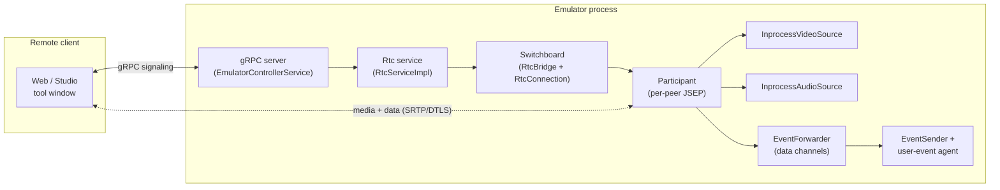
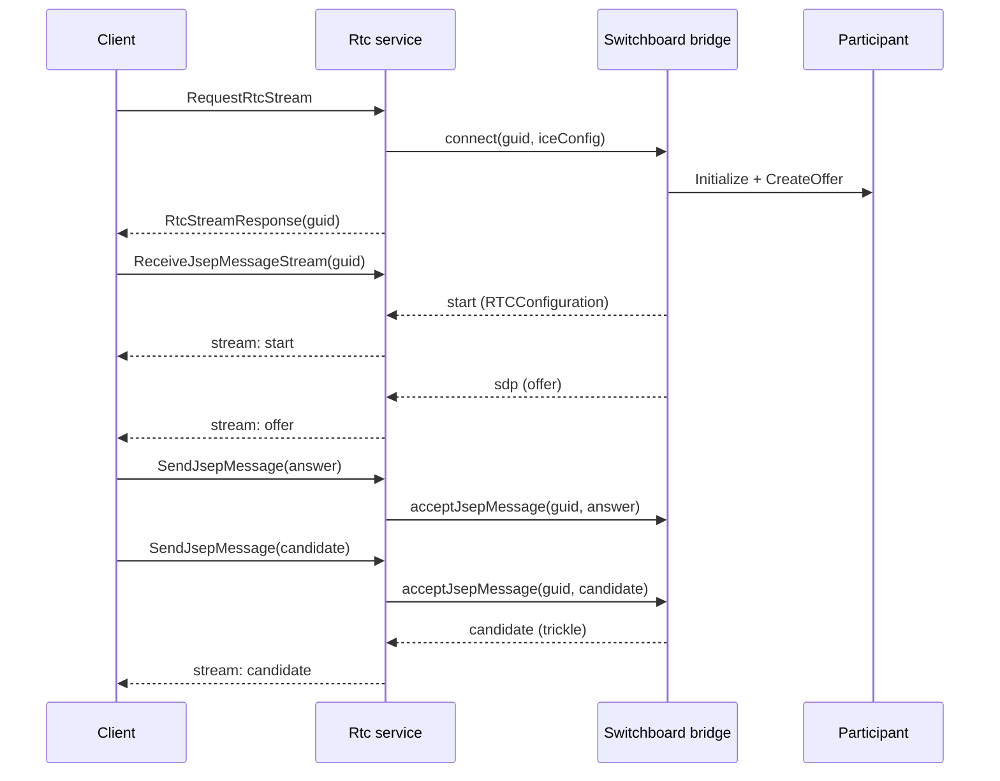
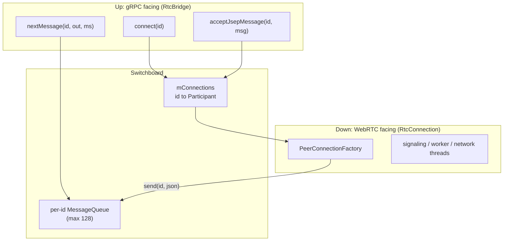
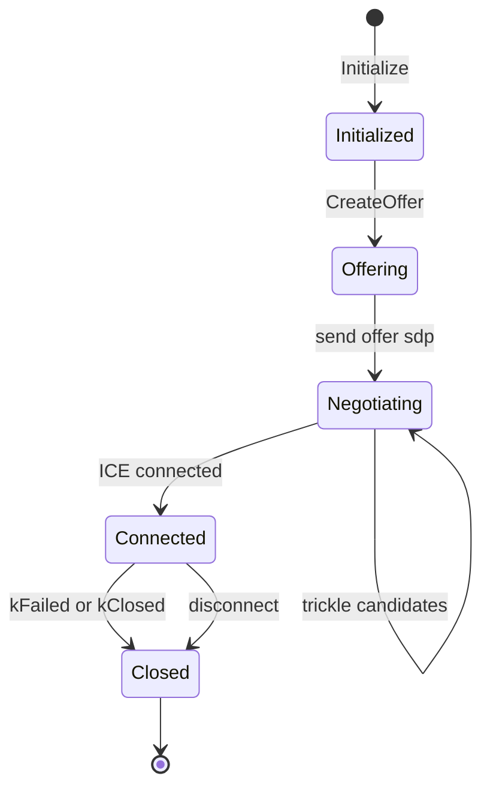
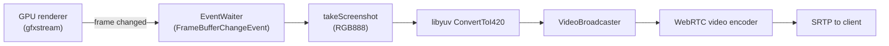
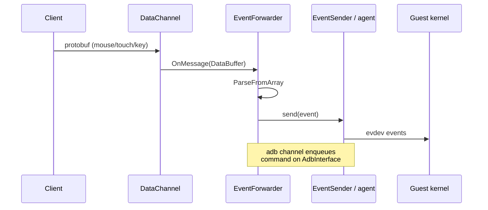
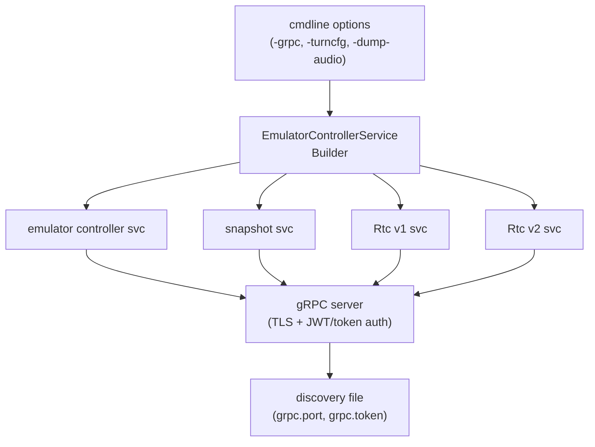

# Chapter 23: WebRTC and the Embedded Emulator

The Qt UI in the previous chapter draws the guest screen into a window on the same machine that runs the emulator. That model breaks down the moment the person looking at the screen is not sitting at the host: an Android Studio user whose emulator runs in a tool window inside the IDE, a developer on a remote workstation, a CI dashboard that wants a live view of a headless device farm. For those cases the emulator ships a second front end that has no window of its own. It encodes the guest display into a video stream, ships it to a browser-style client over WebRTC, and accepts mouse, touch, keyboard, and adb input back over the same peer connection. This is the machinery behind the *embedded emulator* (the device that shows up inside Android Studio) and behind remote streaming in general.

This chapter walks the WebRTC path end to end: the gRPC signaling service that bootstraps a connection, the `Switchboard` and `Participant` objects that drive the JSEP handshake inside the emulator process, the in-process video and audio sources that turn framebuffer updates into encoded media tracks, and the data channels that carry input events back into the same `EventSender` plumbing the gRPC controller uses. Almost all of the code lives under `external/qemu/android/android-webrtc/`, with the wire contract defined in `hardware/google/aemu/protos/services/webrtc/`. The whole subsystem is gated behind an `ANDROID_WEBRTC` build flag, so it is present only in builds that link the Chromium WebRTC library out of `external/webrtc/`.

---

## 23.1 Two Front Ends, One Control Plane

The emulator can present its display two ways, and the split matters for everything that follows.

The Qt UI (Chapter 22) is a *local* renderer. It lives in the emulator process, pulls frames from the GPU renderer, and paints them into a window. Input flows from Qt event handlers directly into the user-event agent. There is no network in the loop.

The WebRTC front end is a *remote* renderer. The emulator process produces an encoded media stream and a set of data channels; a separate client — a web page, the Android Studio tool window, or a standalone receiver — consumes them. The emulator never opens a window. This is why a streaming emulator is usually launched with `-no-window` and a `-grpc` port: the gRPC server is the only way in.

Both front ends ultimately talk to the same control plane. Mouse, touch, and keyboard events from the WebRTC client are decoded into the same `MouseEvent`, `TouchEvent`, and `KeyboardEvent` protobuf messages the gRPC `EmulatorController` service uses, and handed to the same `EventSender` subclasses. The `EventForwarder` in `external/qemu/android/android-webrtc/android-webrtc/emulator/webrtc/Participant.h:72` wires a WebRTC data channel into exactly those senders.

### 23.1.1 Where the code lives

The WebRTC subsystem is built from three cooperating areas.

1. `external/qemu/android/android-webrtc/android-webrtc/android/emulation/control/` holds the gRPC service implementations (`RtcService.cpp`, `RtcServiceV2.cpp`) and the `RtcBridge` abstraction they call into.
2. `external/qemu/android/android-webrtc/android-webrtc/emulator/webrtc/` holds the in-process WebRTC engine: `Switchboard`, `Participant`, `RtcConnection`, and the media `capture/` sources.
3. `external/qemu/android/android-webrtc/videobridge/` holds the legacy *standalone* video bridge, a separate executable kept for backward compatibility.

The proto contract is shared, sitting in `hardware/google/aemu/protos/services/webrtc/rtc_service.proto` (v1) and `rtc_service_v2.proto` (v2).

Component map of the WebRTC front end



The dashed line is the direct peer connection: once signaling completes, media and input no longer travel through the gRPC server, they ride the WebRTC transport between the client and the `Participant`.

---

## 23.2 The gRPC Signaling Service

WebRTC needs an out-of-band channel to exchange session descriptions (SDP) and ICE candidates before the peers can talk directly. The emulator uses gRPC for this. The service is defined in `hardware/google/aemu/protos/services/webrtc/rtc_service_v2.proto`.

```proto
// Source: hardware/google/aemu/protos/services/webrtc/rtc_service_v2.proto
service Rtc {
  rpc RequestRtcStream(RtcStreamRequest) returns (RtcStreamResponse) {}
  rpc SendJsepMessage(SendJsepMessageRequest)
          returns (SendJsepMessageResponse) {}
  rpc ReceiveJsepMessageStream(ReceiveJsepMessageRequest)
          returns (stream ReceiveJsepMessageResponse) {}
  rpc ReceiveJsepMessage(ReceiveJsepMessageRequest)
          returns (ReceiveJsepMessageResponse) {}
}
```

The service is deliberately *not* a single bidirectional stream. The proto comment in that file explains why: JavaScript gRPC-web clients cannot use bidirectional streaming, so signaling is split into one unary call to start, one unary call to push messages up, and one server-streaming call (`ReceiveJsepMessageStream`) to pull messages down. A polling unary `ReceiveJsepMessage` exists as a fallback for proxies that cannot do server streaming at all.

### 23.2.1 The four signaling RPCs

The flow always begins with `RequestRtcStream`. The server generates a GUID for the session, hands it back, and immediately kicks off the JSEP handshake on the server side.

```cpp
// Source: external/qemu/android/android-webrtc/android-webrtc/android/emulation/control/RtcServiceV2.cpp
std::string id = base::Uuid::generate().toString();
if (jsonStr.empty()) {
    getBridge()->connect(id);
} else {
    getBridge()->connect(id, std::move(jsonStr));
}
reply->mutable_id()->set_guid(id);
```

After that the client uses the GUID on every other call.

1. `SendJsepMessage` carries the client's SDP answers and ICE candidates *up* into the emulator. The handler pulls `jsep_msg.id().guid()` and `jsep_msg.message()` and calls `getBridge()->acceptJsepMessage(id, msg)`.
2. `ReceiveJsepMessageStream` carries the server's offer and trickled ICE candidates *down* to the client. The handler loops, calling `getBridge()->nextMessage(id, &msg, 250)` with a 250 ms timeout so the thread can notice client cancellation, and writes any non-empty message to the gRPC stream.
3. `ReceiveJsepMessage` is the deprecated polling version that blocks up to five seconds for a single message.

### 23.2.2 JSEP messages are opaque JSON

Notice that the JSEP payload is a plain string, not a structured protobuf. The `JsepMsg.message` field is a JSON blob that the client can feed almost verbatim to its `RTCPeerConnection`. The proto documents the four keys it can contain.

1. `start` — an `RTCConfiguration` dictionary (ICE/TURN servers) for a new `RTCPeerConnection`.
2. `sdp` — an `RTCSessionDescriptionInit`, the offer or answer.
3. `candidate` — an `RTCIceCandidateInit`.
4. `bye` — a hang-up; the server has torn the stream down.

Keeping the payload as JSON is what lets a browser act as a near-zero-translation peer: the strings the emulator emits are the strings the WebRTC JavaScript API expects.

JSEP handshake over the split gRPC service



---

## 23.3 The RtcBridge Abstraction

The gRPC service never touches WebRTC types directly. It talks to an `RtcBridge` interface, and `RtcServiceImpl` holds only a pointer to one. The methods it uses are exactly the ones the signaling RPCs need: `connect`, `acceptJsepMessage`, `nextMessage`, and `disconnect`.

This indirection exists because there have historically been two implementations of the bridge.

1. `WebRtcBridge`, in `external/qemu/android/android-webrtc/android-webrtc/android/emulation/control/WebRtcBridge.h`, which marshals signaling over a socket to a *separate* `goldfish-webrtc-videobridge` process.
2. `Switchboard`, in `external/qemu/android/android-webrtc/android-webrtc/emulator/webrtc/Switchboard.h`, which runs the WebRTC engine *inside* the emulator process.

`WebRtcBridge` is now deprecated. Its constructor carries a `[[deprecated("The goldfish-webrtc-video bridge is now using gRPC.")]]` attribute, and the comment block describes the old launch-a-subprocess-and-talk-over-a-socket design. The current emulator wires both the v1 and v2 gRPC services to a `Switchboard`: both `getRtcService` factories end with `return getRtcService(new Switchboard(config, ...))`.

### 23.3.1 Why a separate process used to exist

The README in `external/qemu/android/android-webrtc/README.md` explains the original split: the Chromium WebRTC library is built with GN and pulls in dependencies (libyuv, BoringSSL, and friends) whose versions clash with the emulator's own. To keep the two dependency graphs apart, the video bridge was a separate executable that exchanged JSEP over a socket and video over shared memory.

```
+---------------------------+               +-------------------------+
|                           |    SOCKET     |                         |
|       EMULATOR            +<------------->+       VIDEOBRIDGE       |
|                           +-------------->+                         |
+---------------------------+   Shared      +-------------------------+
                                Memory
```

The modern build solves the dependency conflict differently: WebRTC is compiled into a shared library (`android-webrtc`, flagged `AEMU_WEBRTC_SHARED` in its `CMakeLists.txt`) that the emulator loads, so the engine can run in-process without contaminating the rest of the build. The standalone bridge survives only as the `videobridge/` directory for legacy clients.

---

## 23.4 The Switchboard

`Switchboard` is the heart of the in-process design. Its class comment in `external/qemu/android/android-webrtc/android-webrtc/emulator/webrtc/Switchboard.h:41` lists its four jobs: create participants when a user starts a session, remove them on disconnect, route JSEP signals to the right participant, and finalize participants that stop streaming.

What makes it interesting is that it implements *two* interfaces at once.

```cpp
// Source: external/qemu/android/android-webrtc/android-webrtc/emulator/webrtc/Switchboard.h
class Switchboard : public RtcBridge, public RtcConnection {
```

As an `RtcBridge` it faces *up* toward the gRPC service. As an `RtcConnection` it faces *down* toward the WebRTC engine, owning the peer-connection factory and threads. It is the seam between the gRPC world and the WebRTC world.

### 23.4.1 Per-participant message queues

When the bridge side calls `connect(identity)`, the Switchboard does three things, all in `Switchboard::connect` in `Switchboard.cpp`.

First, it creates a bounded message queue for that identity (`kMaxMessageQueueLen` is 128) under a write lock. This queue holds the JSEP messages the server wants to send *down* to that client; `nextMessage` drains it and the streaming RPC writes them out.

Second, it constructs a `Participant`, calls `Initialize()`, and stashes it in `mConnections` keyed by identity.

Third, it primes the handshake by pushing a `start` message containing the TURN/ICE configuration, then attaches media tracks and creates the offer:

```cpp
// Source: external/qemu/android/android-webrtc/android-webrtc/emulator/webrtc/Switchboard.cpp
send(identity, json{{"start", turnConfig}});
...
if (agent && agent->multi_display->isMultiDisplayEnabled()) {
    ...
    participant->AddVideoTrack(id);
    ...
} else {
    participant->AddVideoTrack(0);
}
participant->AddAudioTrack(mAudioDumpFile);
participant->CreateOffer();
```

The multi-display branch is worth noting: a single peer connection carries one video track *per emulated display*, so a foldable or a multi-display AVD streams every screen to the same client.

### 23.4.2 Direction of message flow

`acceptJsepMessage` is the upstream path: it parses the JSON, finds the right `Participant`, and calls `IncomingMessage`. `send` is the downstream path: it pushes a JSON string into the participant's queue. `nextMessage` blocks on that queue using `popLockedBefore` with a deadline, which is how the streaming RPC can wait without spinning.

Switchboard as the bridge/connection seam



---

## 23.5 The RtcConnection: Factory and Threads

`Switchboard` inherits its WebRTC engine from `RtcConnection`. The constructor in `external/qemu/android/android-webrtc/android-webrtc/emulator/webrtc/RtcConnection.cpp` builds the three threads that every WebRTC application needs — network, worker, and signaling — and the peer-connection factory that uses them.

```cpp
// Source: external/qemu/android/android-webrtc/android-webrtc/emulator/webrtc/RtcConnection.cpp
mConnectionFactory = ::webrtc::CreatePeerConnectionFactory(
        mNetwork.get(), mWorker.get(), mSignaling.get(),
         rtc::scoped_refptr<GoldfishAudioDeviceModule>(new GoldfishAudioDeviceModule()),
        ::webrtc::CreateBuiltinAudioEncoderFactory(),
        ::webrtc::CreateBuiltinAudioDecoderFactory(),
        ::webrtc::CreateBuiltinVideoEncoderFactory(),
        ::webrtc::CreateBuiltinVideoDecoderFactory(),
        nullptr /* audio_mixer */, nullptr /* audio_processing */);
```

Three details matter here.

1. The threads are named `Sw-Network`, `Sw-Worker`, and `Sw-Signaling`, which is useful when you read emulator logs or attach a debugger.
2. The factory uses the *builtin* encoder/decoder factories from `external/webrtc/`, so codec selection is negotiated by the standard WebRTC stack rather than anything emulator-specific.
3. The audio device module is a `GoldfishAudioDeviceModule`, a fake that exists only to convince WebRTC that a stereo recording device is present.

### 23.5.1 The fake audio device

WebRTC's peer-connection factory refuses to come up without an audio device module. The emulator does not capture from a real microphone, so it supplies a stub that lies about hardware.

```cpp
// Source: external/qemu/android/android-webrtc/android-webrtc/emulator/webrtc/capture/GoldfishAudioDeviceModule.h
class GoldfishAudioDeviceModule : public ::webrtc::FakeAudioDeviceModule {
    int16_t RecordingDevices() override { return 1; }
    int32_t StereoRecordingIsAvailable(bool* available) const override {
        *available = true;
        return 0;
    }
    ...
};
```

The actual audio that reaches the client does not come through this module at all. It comes from the guest's audio output, captured by an `InprocessAudioSource` and pushed in as a media-source track (Section 23.7).

### 23.5.2 The signaling thread rule

WebRTC peer connections are not thread-safe; most operations must run on the signaling thread. The code respects this carefully. `Participant::Close`, for example, checks whether it is already on the signaling thread and, if not, marshals the work there with a blocking call:

```cpp
// Source: external/qemu/android/android-webrtc/android-webrtc/emulator/webrtc/Participant.cpp
if (mRtcConnection->signalingThread()->IsCurrent()) {
    DoClose();
} else {
    mRtcConnection->signalingThread()->BlockingCall([&] { DoClose(); });
}
```

The Switchboard's `rtcConnectionClosed` likewise posts the actual teardown of a `Participant` onto the signaling thread with `PostDelayedTask`, so the peer connection is always destroyed from the thread that owns it.

---

## 23.6 The Participant and the JSEP State Machine

A `Participant` represents one peer connection — one connected client. Its class comment in `external/qemu/android/android-webrtc/android-webrtc/emulator/webrtc/Participant.h:101` summarizes its three duties: create the audio and video streams, do ICE network discovery, and exchange offers/answers with the remote client. It is also the `PeerConnectionObserver`, so WebRTC calls back into it for every state change and ICE candidate.

### 23.6.1 Initialize, then offer

`Initialize()` creates the peer connection from the parsed `RtcConfig` and opens the four input data channels (Section 23.8). The Switchboard then adds the media tracks and calls `CreateOffer()`. The offer is produced asynchronously; when WebRTC hands it back, `ReceivedSessionDescription` sets it as the local description and ships it to the client as a `sdp` JSEP message.

```cpp
// Source: external/qemu/android/android-webrtc/android-webrtc/emulator/webrtc/Participant.cpp
void Participant::ReceivedSessionDescription(
        ::webrtc::SessionDescriptionInterface* desc) {
    mPeerConnection->SetLocalDescription(
            DummySetSessionDescriptionObserver::Create(), desc);
    std::string sdp;
    desc->ToString(&sdp);
    json jmessage;
    jmessage["type"] = desc->type();
    jmessage["sdp"] = sdp;
    SendMessage(jmessage);
}
```

### 23.6.2 Handling the client's replies

`IncomingMessage` is the dispatcher for everything coming up from the client. It inspects the JSON keys and routes accordingly: a `candidate` becomes an `AddIceCandidate`, a `start` (re)creates the peer connection, and a `sdp` becomes `HandleOffer`. There is even a compatibility shim for "old JS clients" that double-wrap the candidate and sdp objects.

`OnIceCandidate` is the reverse: when the local ICE agent discovers a candidate, the Participant serializes it to the WebRTC `RTCIceCandidateInit` shape (`sdpMid`, `sdpMLineIndex`, `candidate`) and sends it down as a JSEP message, so candidates trickle to the client as they are found.

Participant connection lifecycle



### 23.6.3 Cleanup on failure

`OnConnectionChange` watches the aggregate peer-connection state. When it sees `kFailed` or `kClosed`, it notifies the Switchboard exactly once (guarded by a `compare_exchange_strong` on an atomic flag) via `rtcConnectionClosed`. That single notification is what lets the Switchboard drop the message queue and schedule the participant's destruction on the signaling thread.

---

## 23.7 Encoding the Display: InprocessVideoSource

The video track the client sees originates in `InprocessVideoSource`, in `external/qemu/android/android-webrtc/android-webrtc/emulator/webrtc/capture/InprocessVideoSource.cpp`. It is a `VideoTrackSourceInterface` that produces `webrtc::VideoFrame` objects; the WebRTC encoder downstream of it does the actual compression.

### 23.7.1 Frame timing from the renderer

The source does not poll on a fixed clock. It registers for framebuffer-change events from the GPU renderer, so it produces a frame only when the guest display actually changes. There are two paths.

1. The fast path attaches a `RaiiEventListener` to `gfxstream::Renderer`'s `FrameBufferChangeEvent`, so each render triggers a capture.
2. The slow path, used when no GL renderer is present, registers a shared-memory callback via `gpu_register_shared_memory_callback`.

```cpp
// Source: external/qemu/android/android-webrtc/android-webrtc/emulator/webrtc/capture/InprocessVideoSource.cpp
const auto& renderer = android_getOpenglesRenderer();
if (renderer.get()) {
    // Fast mode..
    frameEvent = std::make_unique<EventWaiter>();
    frameListener = std::make_unique<RaiiEventListener<
            gfxstream::Renderer, gfxstream::FrameBufferChangeEvent>>(
            renderer.get(), [&](const gfxstream::FrameBufferChangeEvent state) {
                frameEvent->newEvent();
            });
} else {
    // slow mode, you are likely using older api..
    ...
}
```

The capture loop waits up to 125 ms for the next frame event, so even a static screen produces a frame roughly eight times a second; that periodic refresh is also how the loop notices the client has gone away on shutdown.

### 23.7.2 Screenshot to I420

When a frame is due, the source takes a screenshot in RGB888 through the same `takeScreenshot` / `ScreenshotUtils` path the gRPC screenshot endpoint uses, accounting for device rotation, then converts it to the I420 (YUV 4:2:0) layout WebRTC encoders expect using libyuv:

```cpp
// Source: external/qemu/android/android-webrtc/android-webrtc/emulator/webrtc/capture/InprocessVideoSource.cpp
auto converted = libyuv::ConvertToI420(
        data, cData, mI420Buffer.get()->MutableDataY(),
        mI420Buffer.get()->StrideY(),
        mI420Buffer.get()->MutableDataU(),
        mI420Buffer.get()->StrideU(),
        mI420Buffer.get()->MutableDataV(),
        mI420Buffer.get()->StrideV(),
        /*crop_x=*/0, /*crop_y=*/0, img.getWidth(), img.getHeight(),
        img.getWidth(), img.getHeight(), libyuv::kRotate0,
        libyuv::FourCC::FOURCC_RGB3);
```

The finished `VideoFrame` is handed to a `rtc::VideoBroadcaster`, which fans it out to whatever sinks (the encoder, and any local `VideoTrackReceiver`) are attached. The class declares `is_screencast() == true`, telling the encoder to favor sharpness over frame rate, which suits a UI screen.

### 23.7.3 Audio: guest output as a media source

`InprocessAudioSource` mirrors the video source for sound. It opens a `QemuAudioOutputStream` and reads the guest's audio in the fixed format WebRTC wants: 44100 Hz, stereo, signed 16-bit. WebRTC requires exactly 10 ms of audio per callback, so the source carefully re-frames the QEMU packets into `kBytesPerFrame`-sized chunks before calling `OnData`:

```cpp
// Source: external/qemu/android/android-webrtc/android-webrtc/emulator/webrtc/capture/InprocessAudioSource.cpp
constexpr int32_t kBitRateHz = 44100;
constexpr int32_t kChannels = 2;
constexpr int32_t kBytesPerSample = 2;
// WebRTC requires each audio packet to be 10ms long.
constexpr int32_t kSamplesPerFrame = kBitRateHz / 100 /*(10ms/1s)*/;
constexpr size_t kBytesPerFrame =
        kBytesPerSample * kSamplesPerFrame * kChannels;
```

The `-dump-audio <file>` command-line option taps this same stream, writing the raw bytes to disk as they are consumed — handy for debugging audio sync.

Video pipeline from guest to encoder



---

## 23.8 Input Forwarding over Data Channels

Media flows from emulator to client. Input flows the other way, and it does not use a separate gRPC call — it rides WebRTC *data channels* on the same peer connection. `Participant::Initialize` opens four of them, one per input type.

```cpp
// Source: external/qemu/android/android-webrtc/android-webrtc/emulator/webrtc/Participant.cpp
AddDataChannel(DataChannelLabel::mouse);
AddDataChannel(DataChannelLabel::keyboard);
AddDataChannel(DataChannelLabel::touch);
AddDataChannel(DataChannelLabel::adb);
```

The labels are lowercase on purpose; the header notes the JavaScript engine breaks otherwise. Each channel gets an `EventForwarder` registered as its `DataChannelObserver`.

### 23.8.1 From DataBuffer to EventSender

When a message arrives on a channel, `EventForwarder::OnMessage` parses the bytes as the matching protobuf and dispatches it. Crucially, these are the *same* protobuf messages defined for the gRPC `EmulatorController` service in `hardware/google/aemu/protos/services/emulator-controller/emulator_controller.proto`, and they go to the *same* senders.

```cpp
// Source: external/qemu/android/android-webrtc/android-webrtc/emulator/webrtc/Participant.cpp
case DataChannelLabel::keyboard: {
    android::emulation::control::KeyboardEvent keyEvent;
    keyEvent.ParseFromArray(buffer.data.data(), buffer.size());
    mKeyEventSender.send(keyEvent);
    break;
}
case DataChannelLabel::mouse: {
    android::emulation::control::MouseEvent mouseEvent;
    mouseEvent.ParseFromArray(buffer.data.data(), buffer.size());
    auto agent = mAgents->user_event;
    android::base::ThreadLooper::runOnMainLooper([agent, mouseEvent]() {
        agent->sendMouseEvent(mouseEvent.x(), mouseEvent.y(), 0,
                              mouseEvent.buttons(), mouseEvent.display(),
                              MOUSE_EVENT_MODE_DEFAULT);
    });
    break;
}
```

Touch events go through the `TouchEventSender`, which translates each `Touch` into Linux multi-touch "Protocol B" events (`EV_ABS`, `LINUX_ABS_MT_SLOT`, `LINUX_ABS_MT_TRACKING_ID`) and scales coordinates to the `0..0x7FFF` evdev range — exactly the logic in `external/qemu/android/android-grpc/services/emulator-controller/server/src/android/emulation/control/keyboard/TouchEventSender.cpp`. The keyboard sender translates browser key codes to evdev using the Chromium translation tables.

This shared-sender design is the reason the embedded emulator behaves identically to a local one: a tap from a browser and a tap from the Qt window end up as the same kernel input events.

### 23.8.2 The adb channel

The fourth channel, `adb`, is different. Its payload is a text command line; `OnMessage` strips the leading `adb` token and enqueues the rest on the global `AdbInterface`. That is how a remote client can run an adb command against the device it is streaming without a separate adb connection.

Data channel input path



---

## 23.9 ICE and TURN Configuration

Two peers behind NATs cannot connect without help. WebRTC handles this with ICE, which gathers candidate addresses and, when a direct path is impossible, relays traffic through a TURN server. The emulator lets you supply that configuration.

### 23.9.1 The turncfg command

The `-turncfg` option takes a *command* to run, not a static config. Its description in `external/qemu/android/emu/cmdline/include/android/cmdline-options.h:256` reads: "Command to execute to obtain turn configuration for the webrtc connection." `TurnConfig` runs that command, expects a JSON `RTCConfiguration` on stdout within a time budget, and validates that it contains an `iceServers` (or `ice_servers`) array.

```cpp
// Source: external/qemu/android/android-webrtc/android-webrtc/android/emulation/control/TurnConfig.cpp
auto turn = System::get()->runCommandWithResult(
        mTurnCmd, getMaxTurnCfgTime(), &exitCode);
if (exitCode == 0 && turn) {
    json config = json::parse(*turn, nullptr, false);
    if (hasIceServers(config)) {
        turnConfig = config;
    } ...
}
```

Running a command (rather than reading a file) means short-lived TURN credentials can be minted per session — the README shows curling Google's network-traversal API for exactly this. The default budget is overridable with the `ANDROID_EMU_MAX_TURNCFG_TIME` environment variable. If the command does not produce valid JSON the service exits at startup, so a misconfigured TURN setup fails loudly rather than silently dropping connections.

### 23.9.2 From JSON to RTCConfiguration

`RtcConfig::parse` turns that JSON into a WebRTC `RTCConfiguration`. It accepts both Google-style `iceServers` and Twilio-style `ice_servers`, maps `iceTransportPolicy: "relay"` to a relay-only ICE type (forcing all traffic through TURN), and sets `sdp_semantics` to Unified Plan so multiple audio and video tracks can share one connection. If no server is configured at all, it falls back to a public Google STUN server:

```cpp
// Source: external/qemu/android/android-webrtc/android-webrtc/emulator/webrtc/RtcConfig.cpp
const std::string kDefaultStunUri = "stun:stun.l.google.com:19302";
```

The validated config is what the Switchboard sends to the client in the `start` message, so both peers configure ICE from the same source of truth.

---

## 23.10 How It All Wires Up at Startup

The WebRTC services are registered with the gRPC server during emulator setup, in `external/qemu/android-qemu2-glue/qemu-setup.cpp`. The registration is guarded by the `ANDROID_WEBRTC` preprocessor flag, and *both* the v1 and v2 services are added for backward compatibility.

```cpp
// Source: external/qemu/android-qemu2-glue/qemu-setup.cpp
#ifdef ANDROID_WEBRTC
    auto rtcSvc = android::emulation::control::getRtcService(
            getConsoleAgents()->settings->android_cmdLineOptions()->turncfg,
            getConsoleAgents()->settings->android_cmdLineOptions()->dump_audio,
            true);
    builder.withService(rtcSvc);
    auto rtcSvcV2 = android::emulation::control::v2::getRtcService(...);
    builder.withService(rtcSvcV2);
#endif
```

These services join the same `EmulatorControllerService` builder that registers the emulator controller, snapshot, sensor, and adb services. That means WebRTC streaming inherits the gRPC server's entire security stack: the same port range, the same TLS options, and the same JWT/token authentication described in the gRPC control-plane chapter. A streaming client must authenticate exactly like any other gRPC client before it can call `RequestRtcStream`.

### 23.10.1 Discovery for the embedded emulator

Android Studio's embedded emulator finds a running emulator the same way other tools do: through the discovery directory. When the gRPC server comes up it writes a property bag — `grpc.port`, `grpc.token`, the JWT key directory, and the TLS certificate paths — into a per-process discovery file (the `props[...]` assignments in `qemu_setup_grpc`). The IDE reads that file to learn where the gRPC endpoint is and how to authenticate, then drives the `Rtc` service to open the stream.

Service registration and the shared gRPC server



---

## 23.11 Standalone, Embedded, and Qt

It is worth pinning down the three ways the emulator's display can reach a human, because they share code in non-obvious ways.

1. The Qt UI renders locally in the emulator process; no gRPC, no WebRTC, input goes straight to the user-event agent (Chapter 22).
2. The embedded/remote WebRTC front end streams over a peer connection negotiated through the in-process `Switchboard`; input returns over data channels into the same `EventSender` plumbing.
3. The legacy standalone video bridge (`videobridge/`, built around `GoldfishBridge.cpp` and `StandaloneConnection`) runs WebRTC in a separate process and connects back to the emulator's gRPC endpoint; it exists for clients that cannot link the in-process engine.

The standalone bridge is itself a gRPC client. `GoldfishBridge.cpp` builds an `EmulatorGrpcClient` pointed at an `--emulator` address and hosts its own `Rtc` service for downstream clients, effectively acting as a streaming proxy in front of a plain emulator. For new deployments the in-process path is preferred; the standalone executable is a compatibility artifact, which is why the v1 service factory and `WebRtcBridge` carry deprecation markers while still resolving to a `Switchboard` underneath.

---

## 23.12 Try It

The WebRTC services only exist in builds compiled with `ANDROID_WEBRTC`. Assuming you have such a build, you can exercise the pieces directly.

Start a headless, streaming-ready emulator with an open gRPC port:

```bash
# -no-window means there is no Qt UI; the only way in is gRPC + WebRTC.
emulator @my_avd -no-window -grpc 8554 -grpc-use-token
```

Inspect the gRPC services the emulator is offering (the Rtc service should be listed):

```bash
# grpc_cli ships with the emulator; reflection lists registered services.
grpc_cli ls localhost:8554
grpc_cli ls localhost:8554 android.emulation.control.v2.Rtc -l
```

Capture the guest's audio stream to disk to see the InprocessAudioSource path in action:

```bash
# Writes raw 44100 Hz stereo s16 PCM as WebRTC consumes it.
emulator @my_avd -no-window -grpc 8554 -dump-audio /tmp/guest-audio.pcm
```

Point the emulator at a TURN configuration command and watch it validate at startup (a bad command makes the service exit):

```bash
# The command must print a JSON RTCConfiguration with an iceServers array.
emulator @my_avd -grpc 8554 \
  -turncfg "curl -s -X POST https://example.invalid/iceconfig?key=secret"
```

Read the signaling contract itself by opening the proto and the server side by side:

```bash
# The wire contract...
$EDITOR hardware/google/aemu/protos/services/webrtc/rtc_service_v2.proto
# ...and the server that implements it.
$EDITOR external/qemu/android/android-webrtc/android-webrtc/android/emulation/control/RtcServiceV2.cpp
```

---

## Summary

- The emulator has two front ends sharing one control plane: the local Qt UI (Chapter 22) and a windowless WebRTC stream used by the Android Studio embedded emulator and remote clients.
- Signaling rides a gRPC `Rtc` service (`rtc_service_v2.proto`) split into `RequestRtcStream`, `SendJsepMessage`, a server-streaming `ReceiveJsepMessageStream`, and a polling fallback — the split exists because JavaScript gRPC-web cannot do bidirectional streams.
- JSEP messages are opaque JSON blobs (`start`, `sdp`, `candidate`, `bye`) that a browser can hand almost verbatim to its `RTCPeerConnection`.
- The gRPC service talks only to an `RtcBridge`; the modern implementation is the in-process `Switchboard`, which also implements `RtcConnection`, making it the seam between the gRPC and WebRTC worlds. The legacy out-of-process `WebRtcBridge`/videobridge is deprecated.
- Each connected client is a `Participant` that owns a peer connection, drives the offer/answer/ICE handshake, and is torn down on the signaling thread when the connection fails or closes.
- Video comes from `InprocessVideoSource`, which captures a screenshot on each renderer framebuffer-change event, converts RGB888 to I420 with libyuv, and broadcasts it to the WebRTC encoder; audio comes from `InprocessAudioSource` re-framing guest audio into 10 ms WebRTC packets.
- Input returns over four data channels (mouse, keyboard, touch, adb) whose `EventForwarder` decodes the same protobuf messages and uses the same `EventSender` plumbing as the gRPC controller, so streamed input is indistinguishable from local input.
- ICE/TURN is configured by running the `-turncfg` command, validated at startup, parsed by `RtcConfig` into a Unified-Plan `RTCConfiguration`, and sent to the client in the `start` message; absent any server it falls back to a public Google STUN URI.
- The Rtc services register with the shared gRPC server under the `ANDROID_WEBRTC` flag, inheriting its TLS and JWT/token authentication and its discovery-file advertisement.

### Key Source Files

| File | Purpose |
|------|---------|
| `hardware/google/aemu/protos/services/webrtc/rtc_service_v2.proto` | The gRPC signaling contract (v2 Rtc service, JsepMsg). |
| `external/qemu/android/android-webrtc/android-webrtc/android/emulation/control/RtcServiceV2.cpp` | gRPC service implementation that bridges signaling to the `RtcBridge`. |
| `external/qemu/android/android-webrtc/android-webrtc/emulator/webrtc/Switchboard.cpp` | In-process bridge/connection that manages participants and message queues. |
| `external/qemu/android/android-webrtc/android-webrtc/emulator/webrtc/Participant.cpp` | Per-client peer connection, JSEP handshake, data-channel input. |
| `external/qemu/android/android-webrtc/android-webrtc/emulator/webrtc/RtcConnection.cpp` | WebRTC threads and peer-connection factory. |
| `external/qemu/android/android-webrtc/android-webrtc/emulator/webrtc/capture/InprocessVideoSource.cpp` | Captures framebuffer changes and converts frames to I420. |
| `external/qemu/android/android-webrtc/android-webrtc/emulator/webrtc/capture/InprocessAudioSource.cpp` | Re-frames guest audio into 10 ms WebRTC packets. |
| `external/qemu/android/android-webrtc/android-webrtc/android/emulation/control/TurnConfig.cpp` | Runs and validates the `-turncfg` command. |
| `external/qemu/android-qemu2-glue/qemu-setup.cpp` | Registers the Rtc services with the shared gRPC server. |
