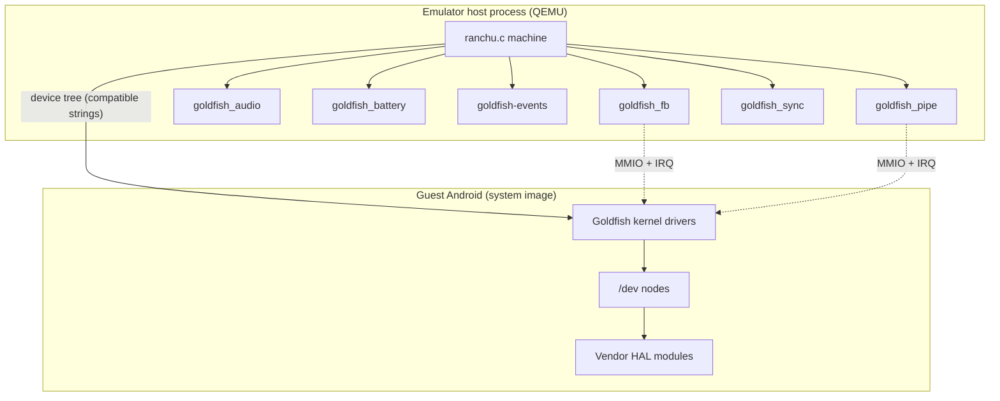
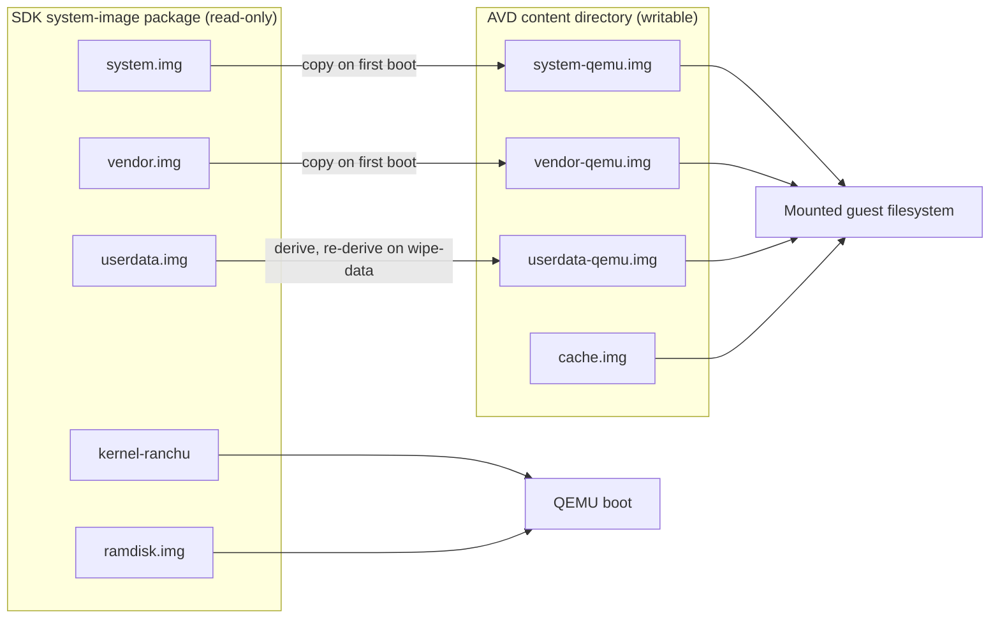
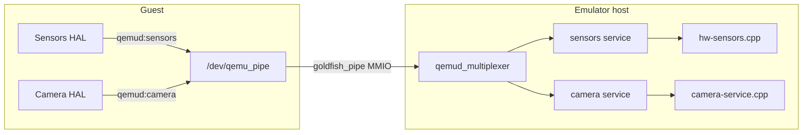
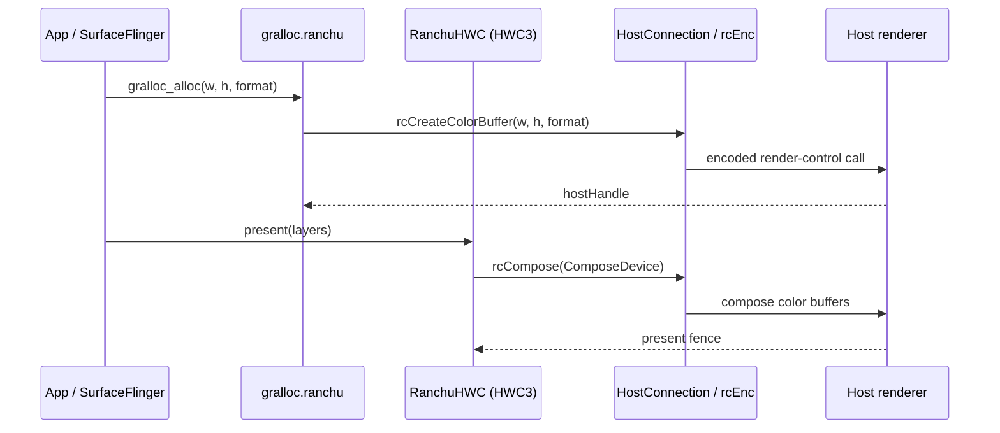
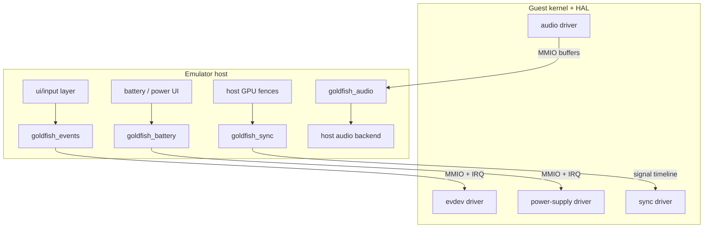
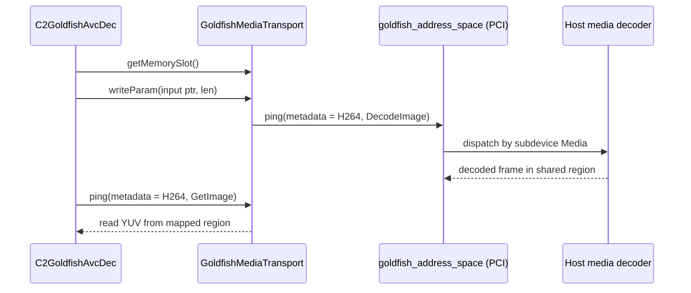
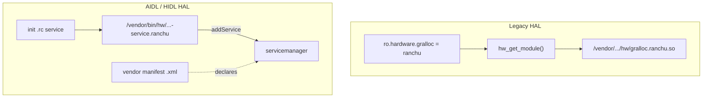
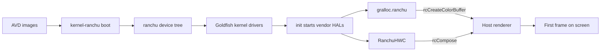

# Chapter 24: System Images and the Goldfish HAL

Every Android Emulator session boots an ordinary Android system image — the same AOSP build that runs on a phone, minus the phone. What makes it run inside QEMU instead of on real silicon is a small family of *virtual* devices named after the project's old codename, **goldfish**, plus a second-generation board called **ranchu**. The guest kernel sees a framebuffer, an audio chip, a battery, an input event device, and a magic "pipe" device. None of them are real hardware. Each is a QEMU device model on the host, and each is matched in the guest by a vendor HAL module — `gralloc.ranchu`, the `RanchuHWC` composer, the goldfish sensors HAL, the goldfish codecs — that knows how to talk to its host counterpart.

This chapter walks the guest image from the outside in: the partition layout the emulator assembles, the ranchu board that exposes the goldfish MMIO devices, the `qemu_pipe` and address-space transports that carry HAL traffic to the host, and the individual HAL modules (graphics, sensors, audio, camera, media, power) that ride those transports. The recurring theme is that the goldfish HAL is *thin*: instead of driving silicon, it serializes a request and hands it to the host, where the real work — GPU rendering, sensor synthesis, camera capture — happens in the emulator process.

---

## 24.1 Goldfish and Ranchu: Two Generations of a Virtual Board

The emulator's virtual hardware comes in two layers of naming that frequently confuse newcomers.

- **goldfish** is the original ARMv5/x86 virtual board and, more durably, the *family* of virtual peripherals: `goldfish_fb` (framebuffer), `goldfish_audio`, `goldfish_battery`, `goldfish-events` (input), `goldfish_pipe`, and `goldfish_sync`. The peripheral names survived every board revision.
- **ranchu** is the modern board, built on QEMU's `virt`-style machine. It keeps the goldfish peripherals but moves everything else (CPU, interrupt controller, virtio transports) onto generic, upstream-friendly infrastructure and describes the board to the guest with a flattened device tree (FDT) instead of hard-coded addresses.

The ranchu board lives in `external/qemu/hw/arm/ranchu.c`. Its memory map is an enum of fixed MMIO windows, one per goldfish device:

```c
// Source: external/qemu/hw/arm/ranchu.c
[RANCHU_GOLDFISH_FB]      = { 0x9010000, 0x100 },
[RANCHU_GOLDFISH_BATTERY] = { 0x9020000, 0x1000 },
[RANCHU_GOLDFISH_AUDIO]   = { 0x9030000, 0x100 },
[RANCHU_GOLDFISH_EVDEV]   = { 0x9040000, 0x1000 },
[RANCHU_GOLDFISH_PIPE]    = { 0xa010000, 0x2000 },
[RANCHU_GOLDFISH_SYNC]    = { 0xa020000, 0x2000 },
```

When the board initializes it creates each device with a `create_simple_device()` call that also writes a device-tree node so the guest kernel can probe it. The device-tree `compatible` strings are the contract between the host device model and the guest driver:

```c
// Source: external/qemu/hw/arm/ranchu.c
create_simple_device(vbi, pic, RANCHU_GOLDFISH_FB, "goldfish_fb",
                     "google,goldfish-fb\0"
                     "generic,goldfish-fb", 2, 0, 0);
create_simple_device(vbi, pic, RANCHU_GOLDFISH_PIPE, "goldfish_pipe",
                     "google,android-pipe\0"
                     "generic,android-pipe", 2, 0, 0);
```

The root node itself is tagged `compatible = "ranchu"` and the firmware node carries `hardware = "ranchu"` (`external/qemu/hw/arm/ranchu.c`, around line 155), which is how userspace and the kernel know they are on the emulator and not on real hardware.

### 24.1.1 The board-to-guest contract

A guest HAL module never reads `0x9010000` directly. The guest kernel's goldfish drivers bind to the `compatible` strings, expose ordinary Linux device nodes (`/dev/fb0`, an input event node, `/dev/qemu_pipe`), and the HAL talks to those nodes. The emulator only has to keep two things stable: the MMIO register layout of each device and the device-tree `compatible` string. Everything above the driver — the HAL, the framework, the apps — is unmodified AOSP.

Goldfish device model and guest binding



---

## 24.2 Partition Layout and Image Formats

Before any HAL runs, the emulator has to assemble a disk for the guest. The canonical list of images it knows about is a macro in `external/qemu/android/emu/avd/include/android/avd/info.h`:

```c
// Source: external/qemu/android/emu/avd/include/android/avd/info.h
#define  AVD_IMAGE_LIST \
    _AVD_IMG(KERNELRANCHU,"kernel-ranchu","kernel") \
    _AVD_IMG(RAMDISK,"ramdisk.img","ramdisk") \
    _AVD_IMG(INITSYSTEM,"system.img","init system") \
    _AVD_IMG(INITVENDOR,"vendor.img","init vendor") \
    _AVD_IMG(INITDATA,"userdata.img","init data") \
    _AVD_IMG(USERSYSTEM,"system-qemu.img","user system") \
    _AVD_IMG(USERVENDOR,"vendor-qemu.img","user vendor") \
    _AVD_IMG(USERDATA,"userdata-qemu.img", "user data") \
    _AVD_IMG(CACHE,"cache.img","cache") \
    _AVD_IMG(SDCARD,"sdcard.img","SD Card") \
    _AVD_IMG(ENCRYPTIONKEY,"encryptionkey.img","Encryption Key") \
    _AVD_IMG(VERIFIEDBOOTPARAMS, "VerifiedBootParams.textproto","Verified Boot Parameters") \
```

The macro is expanded twice: once to build the `AvdImageType` enum (`AVD_IMAGE_KERNELRANCHU`, `AVD_IMAGE_INITSYSTEM`, and so on) and once to build the filename table. The header comment (`info.h`, near the top) explains that each AVD is a directory of "kernel/disk images" plus a config file, and that an AVD lives under a per-AVD content directory described by a small `.ini` file.

### 24.2.1 The "init" / "user" split

Notice that several partitions appear twice: `system.img` versus `system-qemu.img`, `vendor.img` versus `vendor-qemu.img`, `userdata.img` versus `userdata-qemu.img`. This is the most important structural idea in the layout.

The `INIT*` images are the **read-only, pristine** images shipped inside the SDK system-image package. The `USER*` images are the **per-AVD writable** copies that the emulator creates in the AVD content directory. The first boot derives the writable user image from the pristine init image; subsequent boots reuse the user image so the guest keeps its state. `-wipe-data` throws away the user `userdata` image and re-derives it from the init copy. This indirection is what lets one downloaded system image back many independent AVDs without ever mutating the shared, signed bits.

The image types fall into four groups:

1. **Boot inputs** — `kernel-ranchu`, `kernel-ranchu-64`, `ramdisk.img`. These feed the QEMU `-kernel` / `-initrd` machinery and are never written back.
2. **Pristine OS images** — `system.img`, `vendor.img`, `userdata.img` (the `INIT*` set). Read-only, shared across AVDs.
3. **Per-AVD writable images** — `system-qemu.img`, `vendor-qemu.img`, `userdata-qemu.img`, `cache.img`, `sdcard.img`. Mutable, AVD-private.
4. **Verified-boot and crypto** — `encryptionkey.img` and `VerifiedBootParams.textproto`, which carry the dm-verity / AVB parameters the kernel command line needs to mount `/system` and `/vendor` with verification enabled.

The formats are ordinary Android partition formats: the system and vendor partitions are typically ext4 (or, on recent images, mounted from a `super` dynamic-partition container), `userdata` is ext4 with optional file-based or metadata encryption, and the kernel/ramdisk are raw boot artifacts. The emulator treats them as opaque block images and presents them to the guest as virtio-block or goldfish-block disks; the *contents* are standard AOSP and the dm-verity hash tree is what `VerifiedBootParams.textproto` describes.

Partition derivation across boots



---

## 24.3 The qemu_pipe Transport

Most goldfish HALs do not have a dedicated MMIO device. They share one: the **goldfish pipe**, a fast bidirectional channel between guest userspace and host code. Its QEMU model is `external/qemu/hw/misc/goldfish_pipe.c`, whose header comment states its purpose plainly:

```c
// Source: external/qemu/hw/misc/goldfish_pipe.c
** This device provides a virtual pipe device (originally called
** goldfish_pipe and latterly qemu_pipe). This allows the android
** running under the emulator to open a fast connection to the host
** for various purposes including the adb debug bridge and
** (eventually) the opengles pass-through.
```

From the guest's point of view the protocol is: open `/dev/qemu_pipe`, write a NUL-terminated service name, then read and write that channel. The service name selects which host-side handler gets the bytes. The ADB pipe documents the exact handshake (`external/qemu/android/android-emu/android/emulation/AdbGuestPipe.h`):

```c
// Source: external/qemu/android/android-emu/android/emulation/AdbGuestPipe.h
//   adbd <--> /dev/qemu_pipe <--> AdbGuestPipe <--> AdbHostListener <--> ADB Server
//
//   1) Guest opens /dev/qemu_pipe and writes 'pipe:qemud:adb:<port>\0' to
//      connect to the ADB pipe service ...
```

The `pipe:` prefix selects a pipe service; `qemud:` selects the qemud multiplexer (see below); the remainder names a specific qemud service. New pipe service handlers register at emulation-startup time and are dispatched by the bytes the guest writes after opening the device. The framebuffer and codec paths bypass the pipe and use the address-space device instead (Section 24.7), but sensors, camera, and several smaller services all ride the pipe through qemud.

### 24.3.1 The qemud multiplexer

`goldfish_pipe` carries raw bytes; it does not know about "services". The **qemud** layer adds that. `external/qemu/android/emu/hardware/include/android/emulation/android_qemud.h` describes it as "support for the qemud-based 'services' in the emulator" and exposes a single multiplexer plus a service-registration API:

```c
// Source: external/qemu/android/emu/hardware/include/android/emulation/android_qemud.h
extern QemudMultiplexer* const qemud_multiplexer;

extern QemudService* qemud_service_register(const char* serviceName,
                                            ...
                                            QemudServiceConnect serv_connect,
                                            QemudServiceSave serv_save,
                                            QemudServiceLoad serv_load);
```

A host module calls `qemud_service_register("sensors", ...)`, and from then on any guest that opens `pipe:qemud:sensors` is routed to that module's connect callback, which creates a `QemudClient` to handle the conversation. The multiplexer lets many independent HAL channels (`sensors`, `camera`, `boot-properties`, and so on) share the single physical pipe device, each demultiplexed by its service name.

qemud multiplexing over a single pipe



---

## 24.4 Graphics HAL: Gralloc and the RanchuHWC Composer

Graphics is where the goldfish HAL is most elaborate, because every pixel buffer the framework allocates has to be mirrored as a *color buffer* on the host GPU. Two vendor modules cooperate: the gralloc allocator and the HWComposer.

### 24.4.1 Gralloc over the render-control encoder

The legacy allocator is `device/generic/goldfish-opengl/system/gralloc/gralloc_old.cpp`, built into two HAL `.so` files by `Android.bp`:

```
// Source: device/generic/goldfish-opengl/system/gralloc/Android.bp
cc_library_shared {
    name: "gralloc.ranchu",
    vendor: true,
    relative_install_path: "hw",
    static_libs: [
        "mesa_goldfish_address_space",
        "libqemupipe.ranchu",
    ],
    ...
}
```

The `relative_install_path: "hw"` and the `gralloc.ranchu` name are what make this a discoverable gralloc HAL: the framework's HAL loader resolves `gralloc.<ro.hardware.gralloc>` to `/vendor/lib*/hw/gralloc.ranchu.so`. The two `static_libs` are the transports — `libqemupipe.ranchu` (the guest pipe library) and `mesa_goldfish_address_space` (the shared-memory device).

When the framework calls `gralloc_alloc`, the module does not allocate GPU memory locally. It opens a connection to the host renderer and asks it to create a host color buffer:

```cpp
// Source: device/generic/goldfish-opengl/system/gralloc/gralloc_old.cpp
#define DEFINE_HOST_CONNECTION \
    HostConnection* hostCon = HostConnection::get(); \
    ExtendedRCEncoderContext *rcEnc = (hostCon ? hostCon->rcEncoder() : NULL);
```

```cpp
// Source: device/generic/goldfish-opengl/system/gralloc/gralloc_old.cpp
cb->hostHandle = rcEnc->rcCreateColorBuffer(rcEnc, w, h, allocFormat);
```

`HostConnection` is the per-process channel to the host renderer; `rcEnc` is the *render-control encoder*, an auto-generated stub (see `device/generic/goldfish-opengl/README` on `emugen`) that serializes calls like `rcCreateColorBuffer` and `rcCloseColorBuffer` and ships them to the host GPU emulation. Each allocated buffer therefore has two halves: a small guest-side `cb_handle_old_t` (an ashmem region plus metadata, defined in `gralloc_old.cpp`) and a host-side color buffer referenced by `cb->hostHandle`. Freeing the buffer calls `rcEnc->rcCloseColorBuffer(rcEnc, cb->hostHandle)`.

### 24.4.2 RanchuHWC: the HWComposer 3 HAL

Composition is handled by the AIDL HWComposer3 service in `device/generic/goldfish-opengl/system/hwc3/`. Its `main()` registers a binder service rather than exporting a HAL symbol:

```cpp
// Source: device/generic/goldfish-opengl/system/hwc3/Main.cpp
ALOGI("RanchuHWC (HWComposer3/HWC3) starting up...");
...
auto composer = ndk::SharedRefBase::make<Composer>();
const std::string instance = std::string() + Composer::descriptor + "/default";
binder_status_t status =
    AServiceManager_addService(composer->asBinder().get(), instance.c_str());
```

The service is launched by init from `hwc3.rc` as `vendor.hwcomposer-3 /vendor/bin/hw/android.hardware.graphics.composer3-service.ranchu`, with `onrestart restart surfaceflinger`, and advertised in `hwc3.xml` as the AIDL `android.hardware.graphics.composer3` interface. The composer can take two paths, modeled by interchangeable `FrameComposer` implementations:

- **HostFrameComposer** offloads composition to the host GPU. `HostFrameComposer.cpp` builds a `ComposeDevice` describing the layers and calls render-control entry points such as `rcCreateDisplayById`, `rcSetDisplayPoseDpi`, and the compose calls on `rcEnc` — exactly the same `HostConnection`/`rcEnc` channel gralloc uses.
- **GuestFrameComposer** and **ClientFrameComposer** fall back to CPU composition inside the guest when host composition is unavailable.

Display detection and modes go through DRM (`DrmClient`, `DrmConnector`, `DrmCrtc`, `DrmMode` in the same directory), because the modern guest kernel exposes the goldfish framebuffer as a virtio-gpu/DRM device. The composer's vsync is driven by a `VsyncThread`, and presentation fences are coordinated through the goldfish sync device (Section 24.6).

Graphics HAL color-buffer flow



---

## 24.5 Sensors HAL: A Line Protocol Over qemud

The sensors HAL is the cleanest example of a goldfish HAL that is "just" a serializer. The host side lives in `external/qemu/android/android-emu/android/hw-sensors.cpp`, which registers a qemud service named `sensors`:

```cpp
// Source: external/qemu/android/android-emu/android/hw-sensors.cpp
h->service = qemud_service_register("sensors", 0, h, _hwSensors_connect, ...);
```

The wire format is a human-readable, newline-framed text protocol, documented inline in `hw-sensors.cpp`:

```c
// Source: external/qemu/android/android-emu/android/hw-sensors.cpp
 * - when the qemu-specific sensors HAL module starts, it sends
 *   "list-sensors"
 * - this code replies with a string containing an integer ... bitmap
 * - the HAL module sends "set:<sensor>:<flag>" to enable or disable ...
 * - the HAL module sends "set-delay:<delay>" ...
 * - each timer tick, this code sends sensor reports ...
 *      acceleration:<x>:<y>:<z>
 *      magnetic-field:<x>:<y>:<z>
 *      orientation:<azimuth>:<pitch>:<roll>
```

The conversation is symmetric and trivial for the guest HAL:

1. On startup the HAL sends `list-sensors` and gets back a bitmap of which sensors this AVD has (`hw-sensors.cpp` handles the 12-byte `list-sensors` message near line 480).
2. The HAL enables sensors it wants with `set:accelerometer:1`, and sets the polling interval with `set-delay:<ms>`.
3. The host then pushes `acceleration:x:y:z` and friends on a timer (default 200ms), so the HAL just reads lines and forwards them to the framework.

There is one piece of cleverness: a `wake` command. The host sends `wake` straight back to the HAL whenever it needs to unblock a blocking read on the HAL's read thread, so the HAL can stay a simple read-loop without condition variables. The connect callback marks the client as framed (`qemud_client_set_framing(client, 1)`), so the multiplexer prepends a length to each message and the HAL reads whole lines atomically.

The values the host streams come from the UI's virtual sensor controls, the accelerometer model, recorded sensor sessions (`android/sensor_replay/`), or mock providers — but the HAL neither knows nor cares where they originated.

---

## 24.6 Input, Audio, Battery, and Sync: Direct MMIO Devices

Not everything goes through the pipe. Four goldfish peripherals are plain MMIO register files that the guest kernel drives directly, with the HAL sitting above the resulting Linux device node.

### 24.6.1 Input events

`external/qemu/hw/input/goldfish_events.c` (device-tree `compatible = "google,goldfish-events-keypad"`) presents an evdev-style register interface. The host injects key, touch, and rotary events through QEMU's `ui/input` layer; the guest kernel surfaces them as a standard `/dev/input/eventN` node, so the upstream Android input stack works unmodified. The device handles multitouch with a configurable axis range (`MTS_TOUCH_AXIS_RANGE_MAX`).

### 24.6.2 Audio

`external/qemu/hw/audio/goldfish_audio.c` is a minimal codec with a tiny register set: write-buffer addresses and lengths for playback, a read buffer for capture, and an interrupt-status register. The guest audio HAL writes PCM into guest memory, programs the buffer registers, and the device copies the samples into QEMU's `audio/audio.h` backend (the host's PulseAudio/CoreAudio/WASAPI output):

```c
// Source: external/qemu/hw/audio/goldfish_audio.c
AUDIO_SET_WRITE_BUFFER_1 = 0x08,
AUDIO_SET_WRITE_BUFFER_2 = 0x0C,
AUDIO_WRITE_BUFFER_1     = 0x10,
AUDIO_READ_SUPPORTED     = 0x18,
AUDIO_SET_READ_BUFFER    = 0x1C,
```

### 24.6.3 Battery and power

The power/battery HAL is backed by `external/qemu/hw/misc/goldfish_battery.c`, whose register file mirrors the Linux power-supply class almost field-for-field:

```c
// Source: external/qemu/hw/misc/goldfish_battery.c
BATTERY_AC_ONLINE   = 0x08,
BATTERY_STATUS      = 0x0C,
BATTERY_HEALTH      = 0x10,
BATTERY_PRESENT     = 0x14,
BATTERY_CAPACITY    = 0x18,
BATTERY_VOLTAGE     = 0x1C,
BATTERY_TEMP        = 0x20,
```

When you change the charge level or AC state in the extended-controls UI (or via the console `power` commands), the host writes these registers and raises an interrupt with `BATTERY_STATUS_CHANGED` / `AC_STATUS_CHANGED` set. The guest's goldfish power-supply driver reports the new values up to the framework's battery service, which is what drives the status-bar battery icon. There is no separate "power HAL pipe" — the data path is the register file plus an IRQ.

### 24.6.4 Sync and fences

`external/qemu/hw/misc/goldfish_sync.c` provides host-backed sync timelines so the guest can create real fence file descriptors for buffers that the *host* is still rendering. The HWC and gralloc paths use it to express "this color buffer is done compositing" without busy-waiting: the guest gets a fence fd immediately, and the host signals the corresponding timeline (commands such as `SYNC_GUEST_CMD_TRIGGER_HOST_WAIT`) when the GPU work completes. This is the glue that lets the host-composited graphics path participate in Android's normal fence-based buffer lifecycle.

Direct-MMIO HAL data paths



---

## 24.7 Camera and Media HALs

Two HALs carry bulk pixel data and therefore need more than a text channel: the camera and the video codecs.

### 24.7.1 Camera over qemud

The camera HAL talks to `external/qemu/android/android-emu/android/camera/camera-service.cpp`, which registers a qemud service literally named `camera`:

```cpp
// Source: external/qemu/android/android-emu/android/camera/camera-service.cpp
static constexpr char kServiceCamera[] = "camera";
QemudService* serv = qemud_service_register(kServiceCamera, 0,
        this, &connectStatic, nullptr, nullptr);
```

The protocol is a small set of text queries — `list`, `connect`, `start`, `frame`, `stop`, `disconnect` — declared as string-view constants in the same file. `list` enumerates the cameras the host exposes (real webcams found by `camera_enumerate_devices`, plus the synthetic fake/emulated camera); `connect` opens one; `start` configures the pixel format and frame size; and each `frame` query pulls a captured frame. The host does pixel-format conversion when the guest requests a format the webcam cannot produce natively, replying with explicit error strings such as `"No conversion exist for the requested pixel format"`.

### 24.7.2 Goldfish codecs over shared memory

Hardware video decode is emulated by the goldfish codecs in `device/generic/goldfish-opengl/system/codecs/`. There are two generations: a legacy OpenMAX (`omx/`) plugin and the current Codec2 (`c2/`) service. The Codec2 service is started by init as `android.hardware.media.c2@1.0-service-goldfish` and creates a `GoldfishComponentStore` that hands out AVC (H.264), HEVC, VP8, and VP9 decoders (`c2/decoders/avcdec`, `hevcdec`, `vpxdec`).

The decoders do not decode on the guest CPU. They forward compressed bitstreams to the host through the **address-space** transport, abstracted by `GoldfishMediaTransport` in `device/generic/goldfish-opengl/system/codecs/c2/decoders/base/include/goldfish_media_utils.h`. The interface is deliberately tiny — pick a codec and an operation, then ping the host:

```cpp
// Source: device/generic/goldfish-opengl/system/codecs/c2/decoders/base/include/goldfish_media_utils.h
enum class MediaCodecType : __u8 { VP8Codec, VP9Codec, H264Codec, HevcCodec, Max };
enum class MediaOperation : __u8 {
    InitContext, DestroyContext, DecodeImage, GetImage, Flush, Reset, SendMetadata, Max
};
```

The implementation opens the goldfish address-space device, allocates a shared region, maps it into the guest, and uses an address-space *ping* to signal the host. The ping carries metadata that encodes which codec and which operation to run:

```cpp
// Source: device/generic/goldfish-opengl/system/codecs/c2/decoders/base/goldfish_media_utils.cpp
struct address_space_ping pingInfo;
pingInfo.metadata = makeMetadata(type, op, offSetToStartAddr);
pingInfo.offset = mOffset;
if (goldfish_address_space_ping(mHandle, &pingInfo) == false) {
    ALOGE("failed to ping host");
    ...
}
```

Because the region is shared host/guest memory, the guest never copies frame data across a pipe: it writes the compressed input into the mapped region, pings `DecodeImage`, and reads decoded YUV (or a host color-buffer handle) back from the same region after `GetImage`. The header carves the region into fixed 8 MB slots (`getMemorySlot` / `returnMemorySlot`), one per concurrent decoder instance, with four slots available.

### 24.7.3 The address-space device

The transport underneath both the codecs and the DMA-capable gralloc path is `external/qemu/hw/pci/goldfish_address_space.c`, a PCI device that hands out host-physical memory the guest can map directly. It is a pluggable dispatcher: host subsystems register `GoldfishAddressSpaceOps` and claim a *subdevice type* (the media transport above uses the `Media` subdevice), so a single device multiplexes graphics DMA, media, and other zero-copy consumers:

```c
// Source: external/qemu/hw/pci/goldfish_address_space.c
void goldfish_address_space_set_service_ops(const GoldfishAddressSpaceOps *ops) {
    s_goldfish_address_space_ops = ops ? ops : &goldfish_address_space_null_ops;
}
```

Media decode over the address-space transport



---

## 24.8 How a HAL Module Is Selected at Boot

Two mechanisms decide which goldfish HAL actually loads, and they differ by HAL generation.

- **Legacy `hw_module_t` HALs** (the old gralloc) are resolved by suffix. The framework's `hw_get_module()` reads a build property such as `ro.hardware.gralloc` and `dlopen`s `gralloc.<value>.so` from `/vendor/lib*/hw/`. The emulator's product config sets that property to `ranchu` (or `goldfish`), which is why `Android.bp` builds both `gralloc.ranchu` and `gralloc.goldfish` from the same `gralloc_old.cpp`.
- **AIDL/HIDL HALs** (HWC3, Codec2, and increasingly everything else) are registered as services. An `init` `.rc` file launches the binary, the binary calls `AServiceManager_addService`, and a vendor interface manifest (`hwc3.xml`, the codec service `.xml`) tells the framework which implementation backs a given interface. There is no filename-suffix magic; the manifest is the binding.

In both cases the *vendor* partition is where these modules live (`vendor: true` in every `Android.bp` shown above), which is exactly why the partition split in Section 24.2 keeps a separate `vendor.img` — the goldfish HAL is vendor code layered on top of a generic system image.

HAL selection by generation



---

## 24.9 Putting It Together: Boot to First Frame

Tracing a single cold boot ties the layers together. The emulator assembles the partitions, the ranchu board exposes the goldfish devices, the kernel binds drivers by device-tree `compatible` strings, init starts the vendor HAL services, and the framework begins talking to the host.

1. The emulator resolves the AVD's images from `AVD_IMAGE_LIST`, derives the writable `*-qemu.img` copies if needed, and boots `kernel-ranchu` with `ramdisk.img`.
2. `ranchu.c` builds the device tree; the guest kernel probes `goldfish_fb`, `goldfish_pipe`, `goldfish_sync`, and the rest by `compatible` string.
3. init mounts `/system` and `/vendor` (with AVB parameters from `VerifiedBootParams.textproto`), then starts vendor services: `vendor.hwcomposer-3` (RanchuHWC), the Codec2 goldfish service, and the sensor and camera HALs.
4. SurfaceFlinger loads `gralloc.ranchu`, which opens a `HostConnection` and starts creating host color buffers via `rcCreateColorBuffer`.
5. RanchuHWC composes those color buffers on the host (`HostFrameComposer` to `rcCompose`), using goldfish sync fences to stay inside Android's normal buffer protocol — and the first frame appears in the emulator window.

End-to-end boot data flow



---

## 24.10 Try It

These commands assume a built emulator and an installed system image. Replace `<avd>` with one of your AVD names from `emulator -list-avds`.

- List the disk images the emulator knows how to assemble, and confirm the init/user split, by inspecting an AVD content directory:

```bash
emulator -list-avds
# Then look inside the AVD content directory for userdata-qemu.img, cache.img,
# and the config.ini that points at the read-only system.img / vendor.img.
```

- Start an emulator with verbose init logging and watch the goldfish HAL services come up:

```bash
emulator -avd <avd> -verbose -show-kernel 2>&1 | grep -iE "ranchu|goldfish|hwcomposer|gralloc"
```

- From an adb shell, confirm which gralloc and composer the running guest selected:

```bash
adb shell getprop ro.hardware.gralloc
adb shell dumpsys SurfaceFlinger | grep -i composer
adb shell lshal | grep -iE "composer3|media.c2"
```

- Watch the sensors framework state after changing the virtual accelerometer in extended controls:

```bash
adb shell dumpsys sensorservice | head -40
```

- Inspect the device tree the ranchu board handed the guest, including the goldfish `compatible` strings:

```bash
adb shell 'ls /proc/device-tree/ && cat /proc/device-tree/firmware/android/hardware 2>/dev/null'
```

- Verify the goldfish pipe device exists in the guest:

```bash
adb shell 'ls -l /dev/qemu_pipe; ls -l /dev/goldfish_* 2>/dev/null'
```

---

## Summary

- The emulator's virtual hardware is the **goldfish** peripheral family on the **ranchu** board (`external/qemu/hw/arm/ranchu.c`), which exposes `goldfish_fb`, `goldfish_audio`, `goldfish_battery`, `goldfish-events`, `goldfish_pipe`, and `goldfish_sync` and describes them to the guest with device-tree `compatible` strings.
- A guest **system image** is assembled from the partition set in `AVD_IMAGE_LIST` (`info.h`): read-only `INIT*` images shared across AVDs, per-AVD writable `*-qemu.img` copies, boot artifacts, and verified-boot parameters.
- Most HALs share one transport, the **goldfish pipe** (`/dev/qemu_pipe`), multiplexed into named services by **qemud** (`qemud_service_register`); bulk data uses the **goldfish address-space** PCI device for zero-copy shared memory.
- The **graphics** HAL is the richest: `gralloc.ranchu` mirrors every buffer as a host color buffer via `rcCreateColorBuffer`, and `RanchuHWC` (AIDL HWComposer3) composes them on the host through the same `HostConnection`/`rcEnc` render-control channel.
- The **sensors** HAL is a newline-framed text protocol (`list-sensors`, `set:...`, `acceleration:x:y:z`) over `qemud:sensors`; the **camera** HAL uses a similar `connect`/`start`/`frame` protocol; the **codecs** ping compressed bitstreams to the host through shared address-space memory slots.
- **Input, audio, battery/power, and sync** are direct MMIO register files plus interrupts, with the HAL sitting above ordinary Linux device nodes.
- HAL selection differs by generation: legacy HALs load by `ro.hardware.*` filename suffix from `/vendor/.../hw/`, while AIDL/HIDL HALs are launched by init `.rc` files and bound through vendor interface manifests — all of it vendor code on top of a generic system image.

### Key Source Files

| File | Purpose |
|------|---------|
| `external/qemu/hw/arm/ranchu.c` | Ranchu board: memory map, goldfish devices, device tree |
| `external/qemu/android/emu/avd/include/android/avd/info.h` | `AVD_IMAGE_LIST` partition/image definitions |
| `external/qemu/hw/misc/goldfish_pipe.c` | Goldfish pipe device model (`/dev/qemu_pipe` transport) |
| `external/qemu/android/emu/hardware/include/android/emulation/android_qemud.h` | qemud multiplexer and service registration API |
| `device/generic/goldfish-opengl/system/gralloc/gralloc_old.cpp` | `gralloc.ranchu`/`gralloc.goldfish` allocator over render-control |
| `device/generic/goldfish-opengl/system/hwc3/Main.cpp` | RanchuHWC HWComposer3 (HWC3) AIDL service entry point |
| `device/generic/goldfish-opengl/system/hwc3/HostFrameComposer.cpp` | Host-GPU composition path for HWC3 |
| `external/qemu/android/android-emu/android/hw-sensors.cpp` | Host sensors qemud service and line protocol |
| `external/qemu/android/android-emu/android/camera/camera-service.cpp` | Host camera qemud service |
| `device/generic/goldfish-opengl/system/codecs/c2/decoders/base/include/goldfish_media_utils.h` | Goldfish media transport interface |
| `external/qemu/hw/pci/goldfish_address_space.c` | Address-space PCI device for zero-copy shared memory |
| `external/qemu/hw/misc/goldfish_battery.c` | Battery/power register model |
