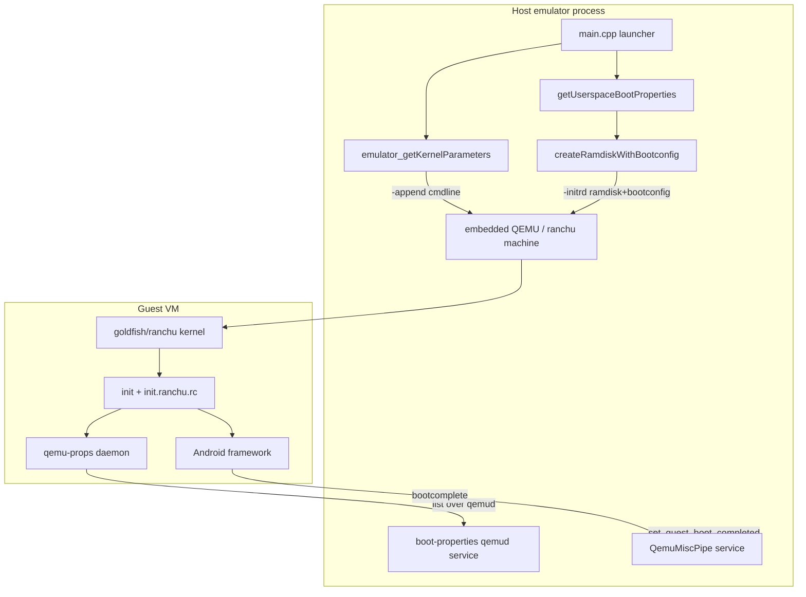
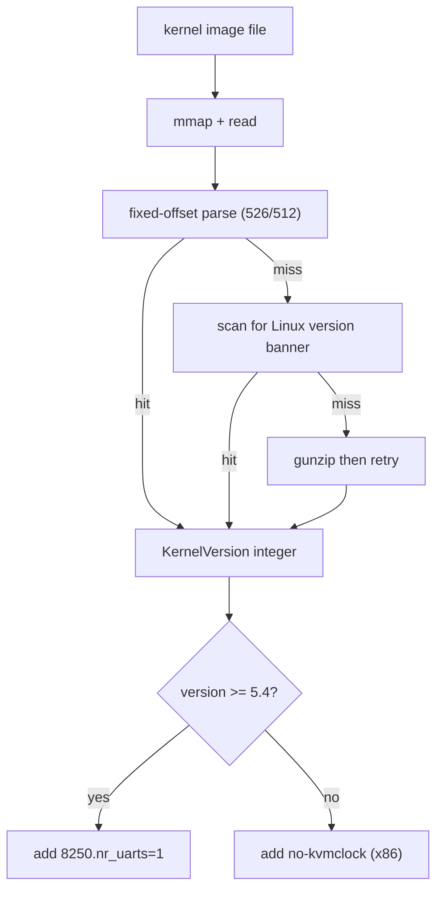
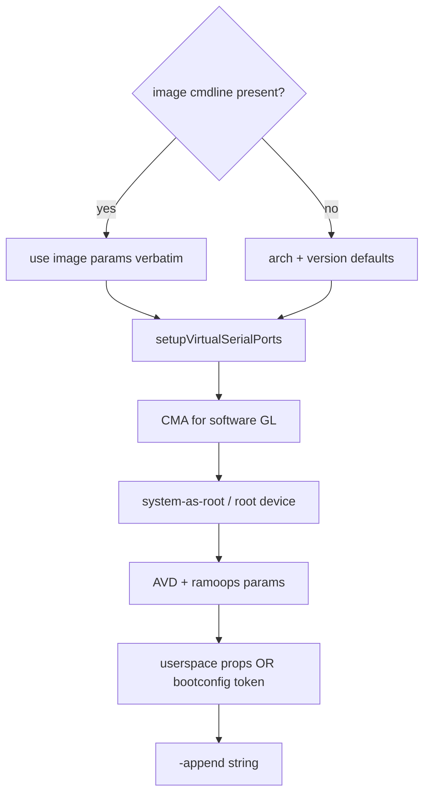
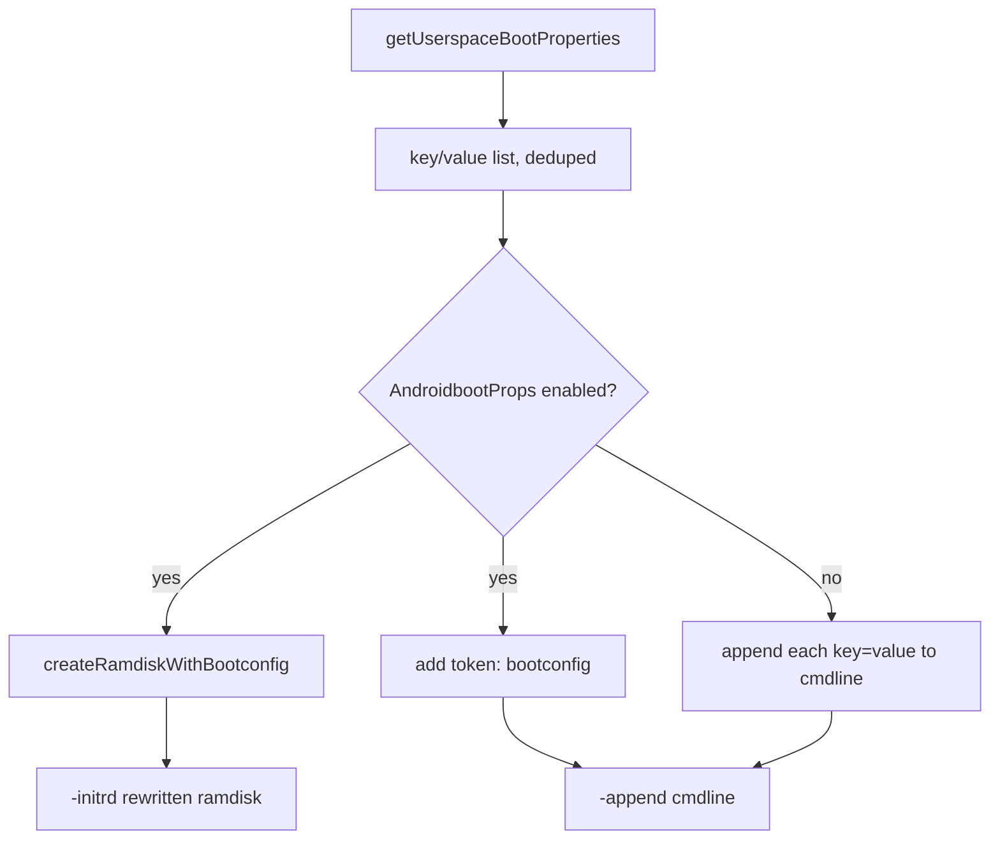
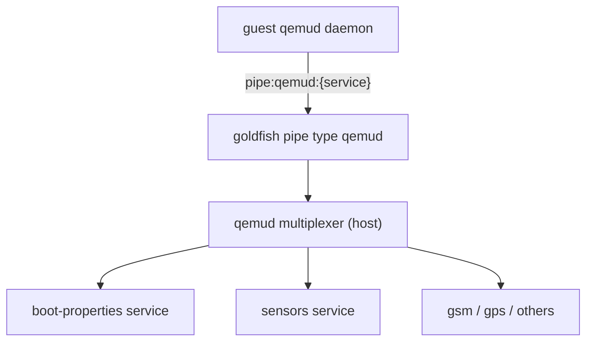
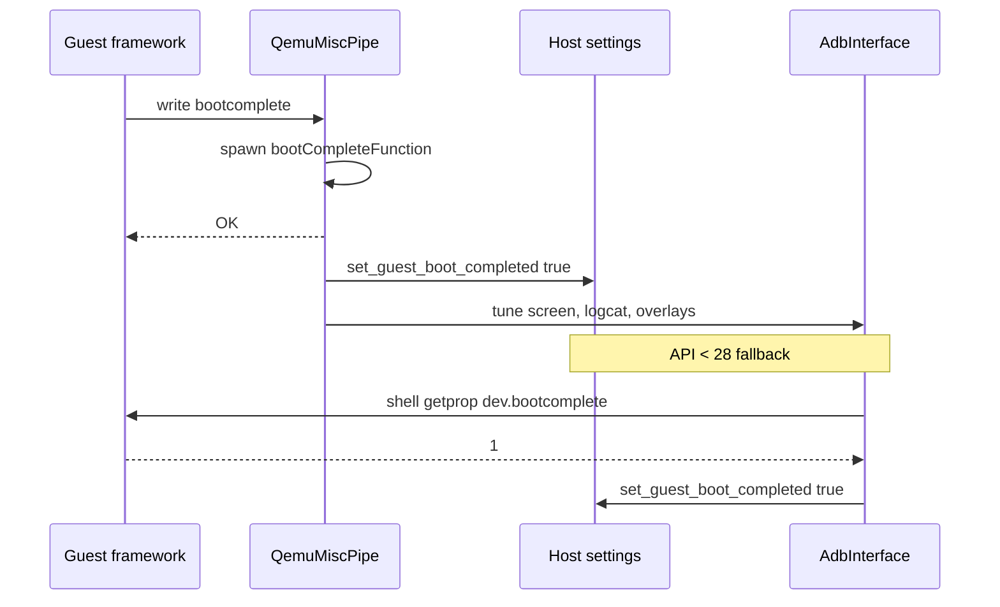
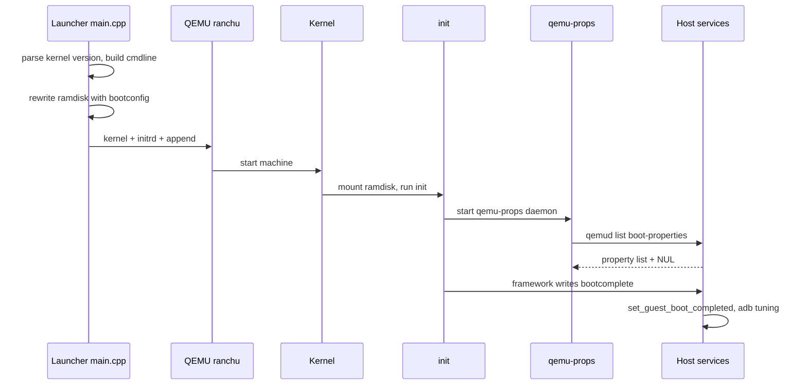

# Chapter 25: Guest Boot

When you launch the emulator, the host process spends a few hundred milliseconds doing something deceptively involved before any guest instruction runs: it picks a kernel image, reads the kernel's version out of the file, assembles a kernel command line tailored to the AVD's hardware and feature flags, packs a second blob of "userspace boot properties" into either the command line or a freshly rewritten ramdisk, and hands all of it to QEMU as `-kernel`, `-initrd`, and `-append`. From there the goldfish/ranchu kernel boots, mounts the ramdisk, runs `init`, and `init` parses `init.ranchu.rc` and the bootconfig the host injected. Two guest daemons — `qemu-props` and `qemud` — then reach back across virtual hardware to pull the rest of the configuration the host could not fit into the command line. Eventually the framework finishes starting and a one-line message travels back over a pipe to tell the host process: boot is complete.

This chapter follows that whole arc from the host side, because the host side is where the emulator source lives. The guest-side files (`init.ranchu.rc`, `fstab.ranchu`, the `qemu-props` and `qemud` binaries) ship from a separate AOSP repository, `device/generic/goldfish`, and are referenced here by name; everything that *prepares* their inputs and *consumes* their outputs is in the QEMU tree under `external/qemu`. We trace kernel-version detection, command-line assembly, the bootconfig format, the legacy `boot-properties` qemud service, and the `QemuMiscPipe` boot-complete handshake — all grounded in real source.

---

## 25.1 The Boot Pipeline From the Host's Point of View

The emulator does not simply pass through whatever images the AVD points at. The host launcher computes a large set of boot inputs at startup, in `android-qemu2-glue/main.cpp`, and only then spawns the embedded QEMU machine. Three artifacts matter for boot:

1. `-kernel` — the goldfish/ranchu kernel image (`hw->kernel_path`).
2. `-initrd` — either the unmodified ramdisk, or a copy the host rewrote to append a bootconfig blob.
3. `-append` — the kernel command line string, assembled from many sources.

The decision of *which* ramdisk to pass hinges on a feature flag. In `android-qemu2-glue/main.cpp` the launcher checks whether the image expects properties delivered through Linux bootconfig rather than the kernel command line:

```cpp
// Source: external/qemu/android-qemu2-glue/main.cpp
if (hw->disk_ramdisk_path) {
    args.add2("-kernel", hw->kernel_path);

    if (fc::isEnabled(fc::AndroidbootProps) ||
        fc::isEnabled(fc::AndroidbootProps2)) {
        bootconfigInitrdPath = getWriteableFilename(
                hw->disk_dataPartition_path, "initrd");
        args.add2("-initrd", bootconfigInitrdPath.c_str());
    } else {
        args.add2("-initrd", hw->disk_ramdisk_path);
    }
}
```

When the `AndroidbootProps` family of flags is on (modern API levels), the launcher reserves a writable path next to the data partition, named `initrd`, and arranges to write a modified ramdisk there. When the flag is off (older images), it passes the stock ramdisk untouched and instead stuffs the same properties directly onto the command line. Section 25.4 covers that fork in detail.

### 25.1.1 Goldfish and ranchu

Two names recur. *Goldfish* is the original virtual hardware platform — a set of memory-mapped devices (the goldfish framebuffer, battery, audio, pipe, and so on) that the emulator and a matching kernel both understand. *Ranchu* is the newer, virtio-based machine type used by QEMU2, which keeps the goldfish pipe and a few goldfish devices but replaces most block and network hardware with virtio. The guest never sees a literal product board; it sees `androidboot.hardware=ranchu`, and the Android HAL layer keys off that string. That property is hard-coded by the host in `userspace-boot-properties.cpp`:

```cpp
// Source: external/qemu/android/android-emu/android/userspace-boot-properties.cpp
params.push_back({"androidboot.hardware", "ranchu"});
```

This is what makes `init.ranchu.rc` and `fstab.ranchu` the files that get used: Android's init selects hardware-specific `.rc` and `fstab` files by the `ro.hardware` value, which derives from `androidboot.hardware`.

### 25.1.2 Overview diagram

Boot pipeline: host preparation through guest boot-complete signal.



---

## 25.2 Choosing and Inspecting the Kernel

Before it can build a command line, the host reads the kernel's version straight out of the image file. Different goldfish/ranchu kernel versions need different command-line workarounds, so the launcher cannot guess — it parses the version from the binary.

### 25.2.1 Reading the version from the image

`android/kernel/kernel_utils.cpp` memory-maps the kernel file and looks for the version string in two ways: at the fixed offset the Linux boot protocol defines, and, failing that, by scanning for the literal `"Linux version "` banner. If the kernel is gzip-compressed, it decompresses first and retries.

```cpp
// Source: external/qemu/android/android-emu/android/kernel/kernel_utils.cpp
bool android_getKernelVersionOffset(const char* const kernelBits, size_t size,
                                    KernelVersion* kernelVersion) {
    constexpr unsigned kOffest1 = 526;
    constexpr unsigned kOffest2 = 512;
    constexpr unsigned kVersionSize = 100;
    ...
    const unsigned versionOffset = read16le(kernelBits + kOffest1) + kOffest2;
    ...
    return android_parseKernelVersion(kernelBits + versionOffset, kernelVersion);
}
```

The parsed version is packed into a single integer by `android_parseKernelVersion`, which shifts major, minor, and patch into one value. The enum `KernelVersion` in `android/kernel/kernel_utils.h` lists the milestones the code cares about — `KERNEL_VERSION_2_6_29`, `KERNEL_VERSION_4_14_112`, `KERNEL_VERSION_5_4_0`, and so on — so version comparisons become plain integer comparisons.

### 25.2.2 Version-dependent command-line tweaks

The packed version drives several decisions in `emulator_getKernelParameters`. Two concrete examples:

```cpp
// Source: external/qemu/android/android-emu/android/main-kernel-parameters.cpp
if (kernelVersion >= KERNEL_VERSION_5_4_0) {
    params.add("8250.nr_uarts=1");  // disabled by default for security reasons
}
...
if (kernelVersion < KERNEL_VERSION_5_4_0) {
    params.add("no-kvmclock");
}
```

On kernels 5.4 and newer the host re-enables a single 8250 UART (newer kernels disable them by default). On x86 kernels older than 5.4 it disables kvmclock, because — per the in-source comment referencing bug 67565886 — the goldfish kernel's `clock_gettime()` could hang with two cores and kvmclock enabled, taking SurfaceFlinger down with it. This is exactly the kind of decision that requires knowing the kernel version, and it explains why the host bothers to parse the image at all.

Kernel-version detection: how the host derives version-specific command-line flags.



---

## 25.3 Assembling the Kernel Command Line

The kernel command line is built by `emulator_getKernelParameters` in `android/main-kernel-parameters.cpp`. It is not a single template; it is an accumulation into an `android::ParameterList`, layered from several sources in a fixed order.

### 25.3.1 Sources, in order

The function pulls from these inputs, and the order matters because later parameters can override earlier ones at the kernel level:

1. **Image-supplied parameters.** If the system image ships a `kernel_cmdline.txt` (loaded into `imageKernelParameters`), the host trusts it wholesale and skips the per-arch defaults. The in-source comment is explicit: "all arch and version specific things must go into kernel_cmdline.txt".
2. **Arch and version defaults.** Otherwise the host adds `clocksource=pit` on x86, the UART and kvmclock tweaks from 25.2, and so on.
3. **Serial-port console wiring**, via `setupVirtualSerialPorts` (25.3.3).
4. **Contiguous memory (CMA)** for software renderers, sized from the GL framebuffer estimate, when `GLDirectMem` is off.
5. **System-as-root / dynamic-partition root device** parameters, such as `skip_initramfs`, `rootwait`, `init=/init`, and a `root=` device.
6. **AVD-level and ramoops/pstore parameters**, plus the per-AVD `kernel.parameters` from hardware-qemu.ini.
7. **Userspace boot props or the literal token `bootconfig`**, appended last (25.4).

The system-as-root block is a good illustration of how feature flags steer the command line:

```cpp
// Source: external/qemu/android/android-emu/android/main-kernel-parameters.cpp
if (android::featurecontrol::isEnabled(android::featurecontrol::SystemAsRoot)) {
    params.add("skip_initramfs");
    params.add("rootwait");
    params.add("ro");
    params.add("init=/init");
    if (!verifiedBootParameters || verifiedBootParameters->empty()) {
        params.add("root=/dev/vda1");
    }
}
```

If verified-boot parameters are present they supply the `root=` device (a dm-verity mapped device), so the host suppresses its own default to avoid a conflict.

### 25.3.2 ChromeOS short-circuit

There is one early return worth noting: if the target is ChromeOS (`isCros`), none of the Android logic applies and the function returns a fixed, terse command line — `root=/dev/sda3`, `cros_legacy`, `cros_debug`, and a console only when `-show-kernel` is set. This is the one place the same host code path serves a non-Android guest, and it bails out before touching any Android-specific parameter.

### 25.3.3 Serial ports and the console

`setupVirtualSerialPorts` in `android/emulation/SetupParameters.cpp` decides which TTY the kernel logs to. Under QEMU2 (`isQemu2 == true`) a single virtual TTY carries `-show-kernel`, `-shell`, and `-logcat` output. The function appends `console=` parameters keyed off the per-arch serial prefix:

```cpp
// Source: external/qemu/android/android-emu/android/emulation/SetupParameters.cpp
if (optionShowKernel) {
    kernelParams->addFormat("console=%s0,38400", kernelSerialPrefix);
}
if (isARMish) {
    kernelParams->add("keep_bootcon");
}
if (optionShowKernel || isARMish) {
    kernelParams->addFormat("earlyprintk=%s0", kernelSerialPrefix);
}
```

The serial prefix is architecture-specific. The `TargetInfo kTarget` table in `android-qemu2-glue/main.cpp` defines it per build: `ttyAMA` for ARM and ARM64, `ttyS` for x86 and x86_64, `ttyGF` for the (legacy) MIPS targets. When the user passes `-virtio-console`, the prefix is overridden to `hvc`. Without `-show-kernel`, the function adds `console=0` so the kernel does not spam the framebuffer's virtual console.

Command-line assembly order inside emulator_getKernelParameters.



---

## 25.4 Userspace Boot Properties and the Bootconfig Fork

Many things the guest needs to know — which GLES version to advertise, the GL transport name, the AVD serial number, the adb public key, foldable posture configuration — are not kernel concerns. They are Android *properties* read by userspace during early boot. The host computes them in `getUserspaceBootProperties` (`android/userspace-boot-properties.cpp`), which returns a list of key/value pairs.

### 25.4.1 Two naming schemes

The same logical setting has two possible property names depending on the `AndroidbootProps` / `AndroidbootProps2` feature flags. Old images read bare `qemu.*` properties; modern images read `androidboot.*` properties delivered via bootconfig. The function picks the name set up front:

```cpp
// Source: external/qemu/android/android-emu/android/userspace-boot-properties.cpp
if (fc::isEnabled(fc::AndroidbootProps) ||
    fc::isEnabled(fc::AndroidbootProps2)) {
    qemuGltransportNameProp = "androidboot.qemu.gltransport.name";
    qemuOpenglesVersionProp = "androidboot.opengles.version";
    avdNameProp            = "androidboot.qemu.avd_name";
    ...
} else {
    qemuGltransportNameProp = "qemu.gltransport";
    qemuOpenglesVersionProp = "qemu.opengles.version";
    avdNameProp            = "qemu.avd_name";
    ...
}
```

The list it builds always contains `androidboot.hardware=ranchu` and an `androidboot.qemu=1` (or bare `qemu=1`) marker so the guest knows it is running under the emulator. It then conditionally appends dozens more: GLES version, vsync rate, the adb public key fetched via `pubkey_from_privkey`, the AVD name, foldable device-state XML, Vulkan and ANGLE settings, and so on. Just before returning, it deduplicates by key (warning on overrides) and logs every final property.

### 25.4.2 Where the properties go

Back in `main.cpp`, the same feature flag decides the *delivery channel*:

```cpp
// Source: external/qemu/android-qemu2-glue/main.cpp
std::vector<std::string> kernelCmdLineUserspaceBootOpts;
if (fc::isEnabled(fc::AndroidbootProps) ||
    fc::isEnabled(fc::AndroidbootProps2)) {
    ...
    const int r = createRamdiskWithBootconfig(
            hw->disk_ramdisk_path, bootconfigInitrdPath.c_str(),
            userspaceBootOpts);
    ...
    kernelCmdLineUserspaceBootOpts.push_back("bootconfig");
} else {
    for (const auto& kv : userspaceBootOpts) {
        kernelCmdLineUserspaceBootOpts.push_back(kv.first + "=" + kv.second);
    }
}
```

When bootconfig is in play, the properties are written into a rewritten ramdisk (25.5) and the only thing added to the command line is the literal token `bootconfig`, which tells the Linux kernel to look for an appended bootconfig section in the initrd. When bootconfig is *not* in play, each `key=value` is appended to the command line directly. Either way the resulting list is passed as `userspaceBootProps` into `emulator_getKernelParameters`, which appends it at the very end.

Userspace boot property delivery: bootconfig versus command line.



---

## 25.5 The Bootconfig Blob Format

Linux bootconfig lets a bootloader append a structured configuration section to the end of the initrd image. The kernel detects it by a trailer at the very end of the initrd and parses it into `/proc/bootconfig`, where Android's `init` reads `androidboot.*` keys. The emulator implements the bootloader's half of this in `android/bootconfig.cpp`.

### 25.5.1 The on-disk layout

The header `android/bootconfig.h` documents the exact layout in one line:

```c
// Source: external/qemu/android/android-emu/android/bootconfig.h
// [src ramdisk][bootconfig][padding][size(le32)][csum(le32)][#BOOTCONFIG\n]
//                                   ^ 4 byte aligned
```

So the rewritten initrd is the original ramdisk, followed by the flattened key/value text, followed by alignment padding, a little-endian size, a little-endian checksum, and the literal magic `#BOOTCONFIG\n`. The kernel reads the trailer from the end backward.

### 25.5.2 Building the blob

`flattenBootconfig` serializes each pair as `key="value"\n` and terminates with a NUL. `buildBootconfigBlob` then pads to a 4-byte boundary, computes a byte-sum checksum, and appends the size, checksum, and magic:

```cpp
// Source: external/qemu/android/android-emu/android/bootconfig.cpp
std::vector<char> buildBootconfigBlob(const size_t srcSize,
        const std::vector<std::pair<std::string, std::string>>& bootconfig) {
    std::vector<char> blob = flattenBootconfig(bootconfig);

    const size_t unaligend = (srcSize + blob.size()) % kBootconfigAlign;
    if (unaligend) {
        blob.insert(blob.end(), kBootconfigAlign - unaligend, '+');
    }
    const uint32_t csum = std::accumulate(blob.begin(), blob.end(), 0,
        [](const uint32_t z, const char c){
            return z + static_cast<uint8_t>(c);
        });
    ...
    blob.insert(blob.end(), kBootconfigMagic.begin(), kBootconfigMagic.end());
    return blob;
}
```

Note the alignment is computed against `srcSize + blob.size()`, the *combined* length of the source ramdisk plus the flattened bootconfig — the trailer must land on a 4-byte boundary measured from the start of the whole image, not just the bootconfig section.

### 25.5.3 Writing the new ramdisk

`createRamdiskWithBootconfig` copies the source ramdisk byte-for-byte into the destination file, then appends the blob the kernel expects:

```cpp
// Source: external/qemu/android/android-emu/android/bootconfig.cpp
const auto r = copyFile(srcRamdisk.get(), dstRamdisk.get());
if (r.first) { ... }
return appendBootconfig(r.second, bootconfig, dstRamdisk.get());
```

`copyFile` returns the number of bytes copied, which is the `srcSize` passed into `buildBootconfigBlob` so the alignment math is correct. The result is the writable `initrd` file the launcher pointed `-initrd` at back in 25.1. Because the host regenerates this file each cold boot, the bootconfig always reflects the current AVD configuration and feature flags.

Bootconfig blob layout appended to the ramdisk.


---

## 25.6 Verified Boot Parameters

For Play Store images and any image that keeps dm-verity enabled, the host injects verified-boot parameters that the kernel and `init` use to set up the verity device-mapper target and report the boot state. These are not hard-coded; they are read from a per-AVD text-proto file.

In `main.cpp` the launcher only loads them under specific conditions — a Play Store image, or no `-writable-system`, or dynamic partitions:

```cpp
// Source: external/qemu/android-qemu2-glue/main.cpp
std::vector<std::string> verified_boot_params;
if (feature_is_enabled(kFeature_PlayStoreImage) ||
    !android_op_writable_system ||
    feature_is_enabled(kFeature_DynamicPartition)) {
    std::unique_ptr<char, void (*)(void*)> verifiedBootParamsPath(
            avdInfo_getVerifiedBootParamsPath(avd), free);
    android::verifiedboot::getParametersFromFile(
            verifiedBootParamsPath.get(), &verified_boot_params);
    ...
    if (android_op_writable_system) {
        verified_boot_params.push_back("androidboot.verifiedbootstate=orange");
    }
}
```

`getParametersFromFile` (in `android/verified-boot/load_config.cpp`) parses the file as a protobuf text format with a `SimpleErrorCollector` that logs parse errors, validates each parameter against an allow-list of characters, and rejects configs above `kMaxSupportedMajorVersion`. When the system is writable (an "unlocked" device) the host appends `androidboot.verifiedbootstate=orange`, which is the standard Android signal for an unlocked bootloader. The resulting list flows into *both* `getUserspaceBootProperties` (so it can supply the `root=` device) and `emulator_getKernelParameters`.

---

## 25.7 init, init.ranchu.rc, and the Guest-Side Daemons

Everything up to this point happens before the first guest instruction. Once QEMU starts the ranchu machine, the goldfish/ranchu kernel boots, mounts the ramdisk, and runs `/init`. Android's `init` reads `init.rc` and the hardware-specific `init.ranchu.rc` (selected by `ro.hardware=ranchu`), and mounts partitions per `fstab.ranchu`. These three files ship in the separate `device/generic/goldfish` repository and are not part of the emulator tree, but the host code is written specifically to feed them.

### 25.7.1 What init.ranchu.rc starts

`init.ranchu.rc` defines emulator-specific services and on-boot actions. The two the host depends on are:

- **`qemu-props`** — a one-shot daemon that connects to the host's `boot-properties` service, pulls the list of `qemu.*` properties, and calls `setprop` for each. This is the legacy delivery path for images that do *not* use bootconfig.
- **`qemud`** — the guest end of the QEMU multiplexed pipe protocol, which brokers named-service connections (sensors, GSM, GPS, boot-properties, and more) over a single transport.

For bootconfig-based images, `init` reads the `androidboot.*` keys directly out of `/proc/bootconfig` (populated by the kernel from the blob in 25.5), so `qemu-props` has less to do — but the qemud transport is still used by other services.

### 25.7.2 The qemud transport

`qemud` is a multiplexer: a single host/guest channel carries many logical service connections, each addressed by a service name. The host registers the transport in `android/emulation/android_qemud.cpp`, initializing both the legacy serial-port path and the modern pipe path, because the host cannot know in advance which the guest will use:

```cpp
// Source: external/qemu/android/emu/hardware/src/android/emulation/android_qemud.cpp
void android_qemud_init(CSerialLine* sl) {
    /* We don't know in advance whether the guest system supports qemud pipes,
     * so we will initialize both qemud machineries, the legacy (over serial
     * port), and the new one (over qemu pipe). Then we let the guest to connect
     * via one, or the other. */
    if (sl) {
        _android_qemud_serial_init(sl);
    }
    _android_qemud_pipe_init();
    isInited = true;
}
```

The modern path registers a goldfish-pipe type literally named `qemud`:

```cpp
// Source: external/qemu/android/emu/hardware/src/android/emulation/android_qemud.cpp
static void _android_qemud_pipe_init(void) {
    static bool _qemud_pipe_initialized = false;
    if (!_qemud_pipe_initialized) {
        android_pipe_add_type("qemud", looper_getForThread(), &_qemudPipe_funcs);
        _qemud_pipe_initialized = true;
    }
}
```

When the guest opens `/dev/goldfish_pipe` and writes `pipe:qemud:<service>`, the goldfish pipe layer routes it to these functions, which hand the connection to the named qemud service. Individual services register through `qemud_service_register`.

qemud multiplexing of named services over a single transport.



---

## 25.8 The boot-properties qemud Service

The legacy property channel is a qemud service named `boot-properties`, registered by `android/boot-properties.c`. The host accumulates a linked list of `key=value` strings during startup (for example the timezone), and serves them to the guest's `qemu-props` daemon on request.

### 25.8.1 The "list" command

When `qemu-props` connects and sends the 4-byte command `list`, the service walks its linked list, sends every property, and terminates with a single NUL byte:

```cpp
// Source: external/qemu/android/emu/hardware/src/android/boot-properties.c
if (msglen == 4 && !memcmp(msg, "list", 4)) {
    BootProperty*  prop;
    for (prop = _boot_properties; prop != NULL; prop = prop->next) {
        qemud_client_send(client, (uint8_t*)prop->property, prop->length);
    }
    qemud_client_send(client, (uint8_t*)"", 1);

    getConsoleAgents()->settings->set_guest_boot_completed(false);
    getConsoleAgents()->settings->set_guest_data_partition_mounted(false);
    return;
}
```

There is a subtle side effect here that matters for the whole chapter: receiving `list` is the host's signal that a *fresh* boot is underway, so it resets `guest_boot_completed` and `guest_data_partition_mounted` to false. This is why a guest-initiated reboot (which re-runs `qemu-props`, which re-sends `list`) correctly re-arms the boot-complete detection in 25.9.

### 25.8.2 Registration and seeding

The service registers itself lazily, the first time a property is added:

```c
// Source: external/qemu/android/emu/hardware/src/android/boot-properties.c
QemudService*  serv = qemud_service_register( SERVICE_NAME,
                                              1, NULL,
                                              boot_property_service_connect,
                                              boot_property_save,
                                              boot_property_load);
```

`SERVICE_NAME` is `"boot-properties"`, and the `boot_property_save` / `boot_property_load` callbacks let the property list survive snapshot save/restore. One property the host seeds during setup is the host timezone, injected in `qemu-setup.cpp`:

```cpp
// Source: external/qemu/android/android-emu/android/qemu-setup.cpp
static void inject_timezone_boot_property() {
    char tzname[64];
    char* end = tzname + sizeof(tzname);
    char* p = bufprint_zoneinfo_timezone(tzname, end);
    if (p < end) {
        boot_property_add_qemu_timezone(tzname);
    }
}
```

That adds `qemu.timezone`, which the guest uses so the emulated clock matches the host's wall-clock timezone without the user configuring anything.

---

## 25.9 Detecting Boot Complete: QemuMiscPipe

The most important handshake in the chapter is how the host learns the guest has finished booting. The framework, late in startup, writes a short message into a goldfish pipe named `QemuMiscPipe`, and the host reacts. This service is registered in `android/emulation/QemuMiscPipe.cpp` and wired up during `qemu-setup.cpp` via `android_init_qemu_misc_pipe()`.

### 25.9.1 The message protocol

The pipe is a simple request/response message pipe. The decode routine recognizes a handful of commands by prefix:

```cpp
// Source: external/qemu/android/android-emu/android/emulation/QemuMiscPipe.cpp
if (beginWith(input, "heartbeat")) {
    fillWithOK(output);
    guest_heart_beat_count++;
    return;
} else if (beginWith(input, "bootcomplete")) {
    fillWithOK(output);
    std::thread{bootCompleteFunction}.detach();
    return;
} else if (beginWith(input, "get_random=")) {
    ...
}
```

Three messages flow over this pipe:

1. `heartbeat` — periodic liveness pings that increment a counter; a watchdog thread can reboot a stalled guest if the count stops rising.
2. `bootcomplete` — the boot-finished signal, which spawns `bootCompleteFunction` on a detached thread.
3. `get_random=N` — a request for N random bytes (the host fills the response with entropy from a Mersenne Twister).

Unrecognized commands get a 3-byte `"KO"` reply; recognized ones get `"OK"`.

### 25.9.2 What bootCompleteFunction does

`bootCompleteFunction` records the boot duration, reports a metrics event, flips the global flag, and kicks off a long list of post-boot adb commands:

```cpp
// Source: external/qemu/android/android-emu/android/emulation/QemuMiscPipe.cpp
static void bootCompleteFunction() {
    auto bootTimeInMs =
            (long long)(get_uptime_ms() - s_reset_request_uptime_ms);
    dinfo("Boot completed in %lld ms", bootTimeInMs);
    ...
    getConsoleAgents()->settings->set_guest_boot_completed(true);
    if (getConsoleAgents()->settings->hw()->test_quitAfterBootTimeOut > 0) {
        getConsoleAgents()->vm->vmShutdown();
    } else {
        auto adbInterface = emulation::AdbInterface::getGlobal();
        ...
    }
}
```

The boot time is measured against `s_reset_request_uptime_ms`, which `signal_system_reset_was_requested()` stamps at each (re)boot, so the number is correct even after a reboot inside the guest. After flipping the flag the host also drops a `bootcompleted.ini` marker file in the AVD directory. Then, through adb, it tunes the booted system: it raises the screen-off timeout and the logcat buffer to 2M, enables auto-rotate on non-automotive devices, installs device-skin overlays for the AVD's hardware, configures foldable hinge/posture geometry, and applies any pending language/country/locale changes (restarting zygote if needed). If the AVD was launched purely to time a boot (`test_quitAfterBootTimeOut`), it shuts the VM down instead.

### 25.9.3 The fallback path for old images

Not every API level reports `bootcomplete` over the pipe. `android/emulation/control/ServiceUtils.cpp` provides a fallback for images before API 28: if the flag is not already set and the API level is low, it polls the guest property `dev.bootcomplete` over adb:

```cpp
// Source: external/qemu/android/android-emu/android/emulation/control/ServiceUtils.cpp
if (!getConsoleAgents()->settings->guest_boot_completed() &&
    apiLevel < 28) {
    adbInterface->enqueueCommand(
            {"shell", "getprop", "dev.bootcomplete"},
            [state](const OptionalAdbCommandResult& result) {
                ...
                auto booted = getConsoleAgents()->settings->guest_boot_completed()
                              || output.find("1") != std::string::npos;
                getConsoleAgents()->settings->set_guest_boot_completed(booted);
                ...
            });
    ...
}
return getConsoleAgents()->settings->guest_boot_completed();
```

So there are two detection mechanisms, chosen by API level: the modern pipe push (`bootcomplete` on `QemuMiscPipe`) for API 28 and up, and an adb `getprop dev.bootcomplete` poll for older images. Both converge on the same `guest_boot_completed` flag.

Boot-complete handshake and the API-level fallback.



---

## 25.10 The Boot Timeline End to End

Putting the pieces in sequence, a cold boot of a modern AVD looks like this from the host process outward:

1. The launcher reads the kernel image and parses its version (25.2).
2. `getUserspaceBootProperties` builds the property list; `emulator_getKernelParameters` builds the command line (25.3, 25.4).
3. If bootconfig is enabled, `createRamdiskWithBootconfig` rewrites the ramdisk with the property blob and the command line carries only the `bootconfig` token (25.5).
4. Verified-boot parameters are merged in for Play Store / verity images (25.6).
5. QEMU starts the ranchu machine with `-kernel`, `-initrd`, and `-append`.
6. The kernel boots, mounts the ramdisk, parses `/proc/bootconfig`, and runs `init`, which reads `init.ranchu.rc` and `fstab.ranchu` (25.7).
7. `qemu-props` and `qemud` connect back to the host; the `boot-properties` service serves the property list and resets the boot flags (25.8).
8. The framework finishes; it writes `bootcomplete` to `QemuMiscPipe`; the host flips `guest_boot_completed`, records the boot time, and runs post-boot adb tuning (25.9).

Cold boot timeline from launcher to boot complete.



---

## 25.11 Try It

You can observe most of the boot pipeline from a normal emulator run. The exact launcher binary name differs per SDK install, but these work against any running AVD:

- Print the full QEMU command line, including `-kernel`, `-initrd`, and the assembled `-append`, by launching with init verbosity:

```bash
emulator -avd <name> -verbose -debug init -show-kernel
```

  Look in the log for "Concatenated QEMU options" and "Userspace boot properties" — these are dumped by `main.cpp` and `getUserspaceBootProperties` respectively.

- Inspect the bootconfig the host injected, from inside the guest:

```bash
adb shell cat /proc/bootconfig
```

  You should see `androidboot.hardware = "ranchu"` and the `androidboot.*` keys the host computed, matching the list logged above.

- Confirm the `androidboot.hardware` value and the ranchu init/fstab selection:

```bash
adb shell getprop ro.hardware
adb shell getprop ro.boot.hardware
```

- Read the boot-complete property the older detection path polls, and the timezone seeded over `boot-properties`:

```bash
adb shell getprop dev.bootcomplete
adb shell getprop persist.sys.timezone
```

- Watch the host detect boot completion. Cold boot with init verbosity and grep the host log for the line `Boot completed in <N> ms`, emitted by `bootCompleteFunction`:

```bash
emulator -avd <name> -no-snapshot -verbose -debug init 2>&1 | grep "Boot completed"
```

- After boot, find the marker file the host wrote in the AVD content directory:

```bash
find "$HOME/.android/avd/<name>.avd" -name bootcompleted.ini
```

---

## Summary

- The host launcher (`android-qemu2-glue/main.cpp`) prepares three boot artifacts before QEMU starts: `-kernel` (the goldfish/ranchu image), `-initrd` (stock or bootconfig-rewritten ramdisk), and `-append` (the assembled command line).
- The kernel version is parsed directly out of the image (`kernel_utils.cpp`) so the host can apply version-specific workarounds such as `8250.nr_uarts=1` on 5.4+ and `no-kvmclock` on older x86 kernels.
- `emulator_getKernelParameters` layers the command line from image params, arch/version defaults, serial-console wiring, CMA, system-as-root root device, AVD params, and finally userspace boot props or the literal `bootconfig` token.
- `getUserspaceBootProperties` computes Android properties (GLES version, GL transport, adb key, AVD name, foldable state, and more), always including `androidboot.hardware=ranchu`, under either the `androidboot.*` or legacy `qemu.*` naming scheme.
- Modern images receive those properties through a Linux bootconfig blob appended to a rewritten ramdisk by `createRamdiskWithBootconfig`, with the exact `[ramdisk][kv][pad][size][csum][#BOOTCONFIG]` trailer; older images get them inline on the command line.
- Verified-boot parameters are read from a per-AVD text-proto (`load_config.cpp`) for Play Store / dm-verity images and supply the `root=` device and verified-boot state.
- Inside the guest, `init` selects `init.ranchu.rc` and `fstab.ranchu` by `ro.hardware=ranchu`; `qemu-props` pulls legacy properties from the host's `boot-properties` qemud service, and `qemud` multiplexes all named services over the goldfish pipe.
- Sending `list` to `boot-properties` resets `guest_boot_completed` and `guest_data_partition_mounted`, re-arming detection on every (re)boot.
- The framework signals completion by writing `bootcomplete` to `QemuMiscPipe`; `bootCompleteFunction` records the boot time, flips `guest_boot_completed`, drops `bootcompleted.ini`, and runs post-boot adb tuning. Images before API 28 fall back to polling `dev.bootcomplete` over adb.

### Key Source Files

| File | Purpose |
|------|---------|
| `external/qemu/android-qemu2-glue/main.cpp` | Wires `-kernel`/`-initrd`/`-append`, picks bootconfig vs inline delivery, loads verified-boot params |
| `external/qemu/android/android-emu/android/main-kernel-parameters.cpp` | Assembles the kernel command line, layered and version-aware |
| `external/qemu/android/android-emu/android/userspace-boot-properties.cpp` | Computes Android userspace boot properties (both naming schemes) |
| `external/qemu/android/android-emu/android/bootconfig.cpp` | Builds the bootconfig blob and rewrites the ramdisk |
| `external/qemu/android/android-emu/android/kernel/kernel_utils.cpp` | Parses the kernel version from the image file |
| `external/qemu/android/android-emu/android/emulation/SetupParameters.cpp` | Sets up the virtual serial console and `console=` params |
| `external/qemu/android/emu/hardware/src/android/boot-properties.c` | The `boot-properties` qemud service and `list` handler |
| `external/qemu/android/emu/hardware/src/android/emulation/android_qemud.cpp` | qemud transport: legacy serial + modern `qemud` pipe |
| `external/qemu/android/android-emu/android/emulation/QemuMiscPipe.cpp` | `heartbeat`/`bootcomplete`/`get_random` pipe and boot-complete handling |
| `external/qemu/android/android-emu/android/emulation/control/ServiceUtils.cpp` | API < 28 `dev.bootcomplete` polling fallback |
| `external/qemu/android/android-emu/android/verified-boot/load_config.cpp` | Parses verified-boot parameters from a text-proto |
