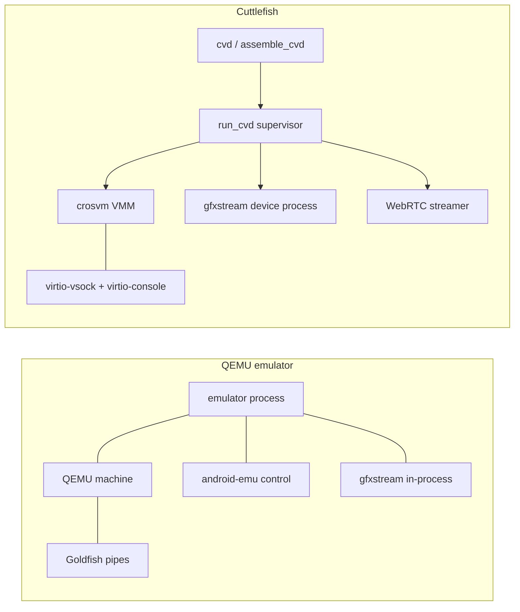
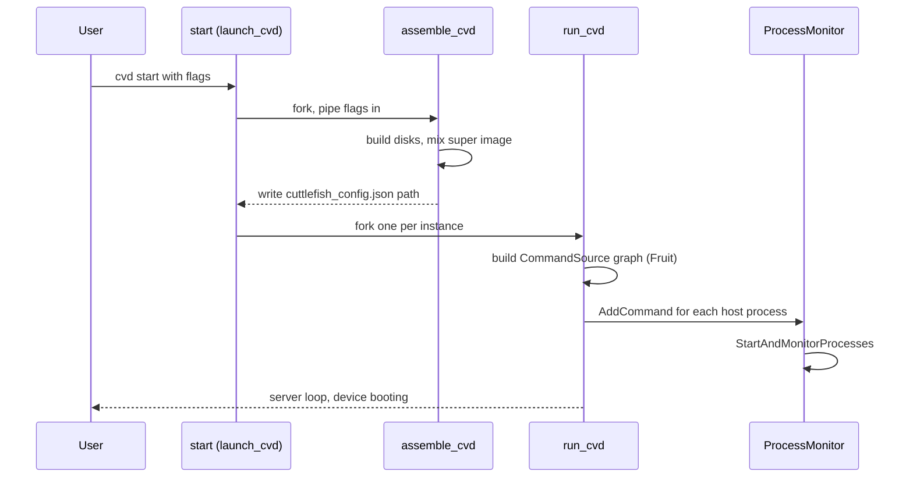
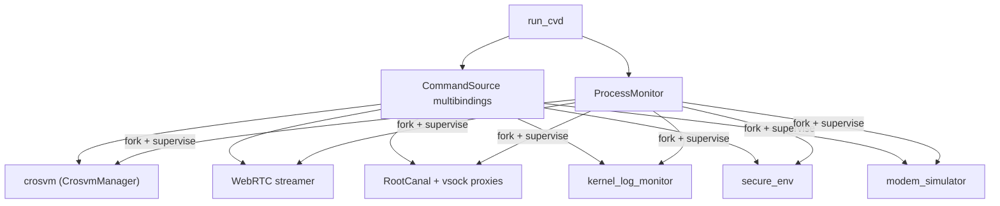
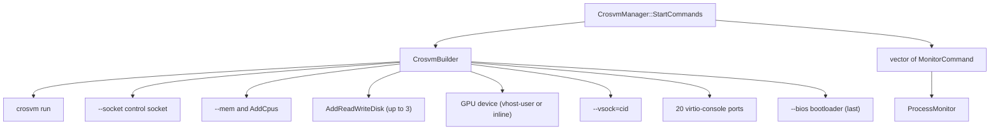
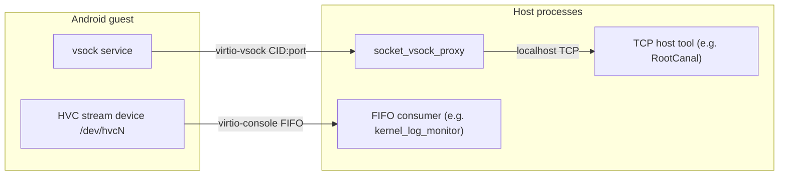
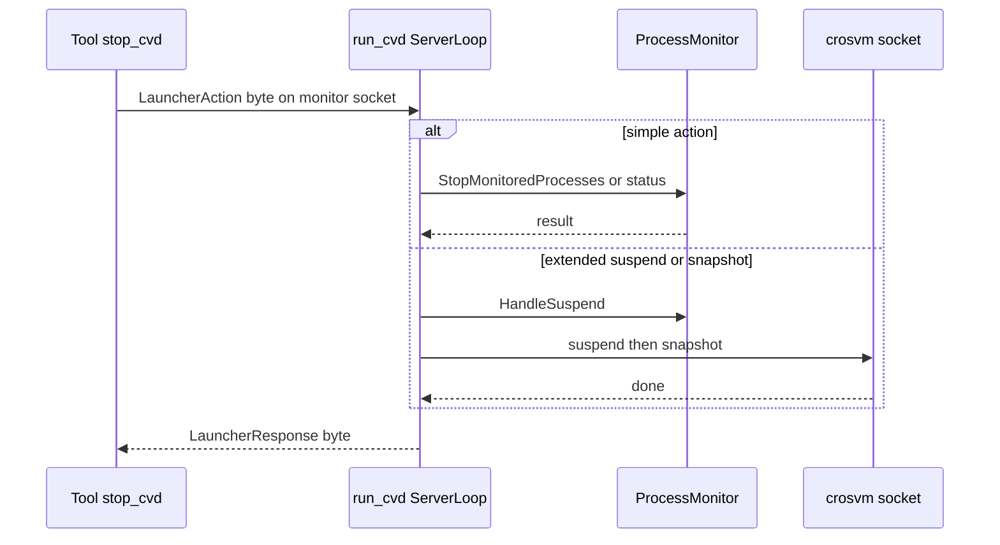
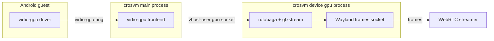
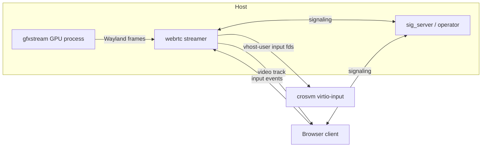
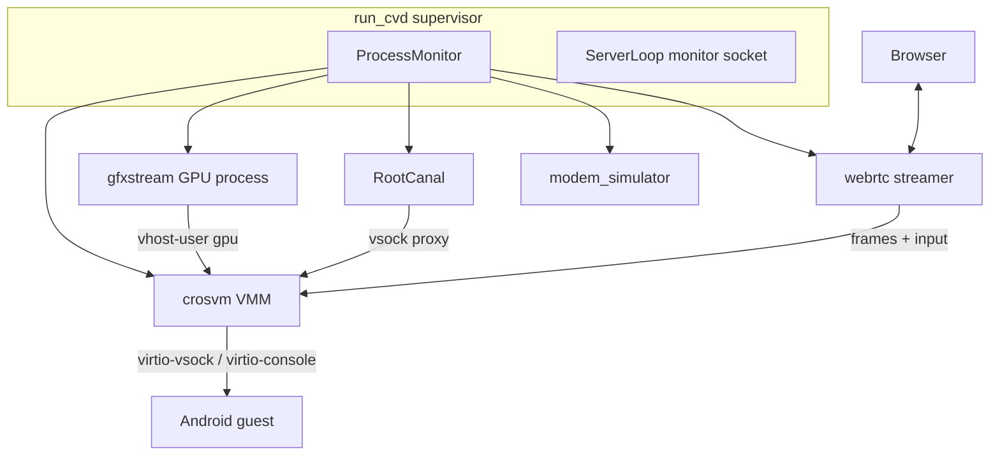

# Chapter 26: Cuttlefish and crosvm

Every other chapter in this book follows the QEMU-based Android Emulator: a single `emulator` process that hosts the QEMU machine, the `android-emu` control plane, and the UI all under one roof, talking to the guest through Goldfish pipes. Cuttlefish is the other virtual device that Google ships, and it is built on a different foundation. Instead of QEMU it uses crosvm, the Rust virtual machine monitor from the ChromeOS project. Instead of one fat process it uses a fleet of small host processes orchestrated by an init-style supervisor. Instead of Goldfish pipes it talks to the guest over virtio-vsock and virtio-console. Cuttlefish is the reference virtual device for AOSP development and continuous integration; it is what runs on Google's server farms when a CL has to be booted on a real Android build.

This chapter walks the Cuttlefish host stack as a sibling to the emulator. We follow the launch path from `cvd start` through `assemble_cvd` and `run_cvd` into the crosvm command line, study the vsock-based control plane and the per-device process supervisor, and then look at the three big components Cuttlefish shares with the QEMU emulator: gfxstream for graphics, RootCanal for Bluetooth, and a WebRTC streamer for the display. Throughout, we contrast each design decision against the equivalent in `external/qemu`. The Cuttlefish host source lives under `device/google/cuttlefish/`; the guest payload under `device/google/cuttlefish/guest/`; the shared graphics backend under `hardware/google/gfxstream/`.

---

## 26.1 Two Virtual Devices, One Android

Android has two officially supported "virtual devices": the QEMU-based emulator (codename Goldfish/Ranchu) and Cuttlefish (codename Vsoc, "virtual system on chip", which is why the device targets are named `vsoc_x86_64`, `vsoc_arm64`, and so on; see the directory list under `device/google/cuttlefish/`). They exist for different audiences. The emulator is a developer-facing product with a polished UI, snapshots, and an extended-controls panel; Cuttlefish is an infrastructure-facing reference device designed to boot arbitrary AOSP builds at scale on Linux servers, with no hard dependency on a graphical desktop.

The two share a surprising amount of code. RootCanal (the virtual Bluetooth controller) is integrated into both — its own README states "RootCanal is natively integrated in the Cuttlefish and Goldfish emulators" (`tools/rootcanal/README.md`). gfxstream is the host-side graphics renderer for both. The netsim packet hub and the modem simulator are likewise reused. What differs is the substrate: the virtual machine monitor, the guest transport, and the process model.

### 26.1.1 What Cuttlefish keeps and what it replaces

Cuttlefish keeps the Android guest userspace and the shared virtual-device components, and replaces the host runtime.

The following table maps the major subsystems.

| Concern | QEMU emulator | Cuttlefish |
|---|---|---|
| Virtual machine monitor | QEMU (`external/qemu`) | crosvm (`device/google/cuttlefish/host/libs/vm_manager/crosvm_manager.cpp`) |
| Host process model | One `emulator` process | `cvd` -> `assemble_cvd` -> `run_cvd` -> N child processes |
| Guest transport | Goldfish/qemu pipes | virtio-vsock + virtio-console |
| Graphics renderer | gfxstream in-process | gfxstream as a vhost-user device process |
| Bluetooth | RootCanal | RootCanal (shared) |
| Display surface | Qt UI / gRPC | WebRTC streamer to a browser |

The crosvm `VmManager` even keeps a QEMU backend alongside it: `device/google/cuttlefish/host/libs/vm_manager/qemu_manager.cpp` is a sibling of `crosvm_manager.cpp`, and `GetVmManager` in `vm_manager.cpp` picks between `kCrosvm`, `kQemu`, and `kGem5` modes. Crosvm is the default and the one this chapter follows.

### 26.1.2 Why crosvm instead of QEMU

Crosvm is a from-scratch VMM written in Rust, originally for running Linux apps on ChromeOS. For Cuttlefish it offers three properties that matter at infrastructure scale: a small, memory-safe, security-sandboxed codebase (crosvm runs each virtio device in a seccomp jail); a clean separation of devices into out-of-process "vhost-user" backends; and first-class support for virtio-vsock and the rutabaga/gfxstream graphics path. The cost is that crosvm does not present a single integrated UI the way the emulator's Qt frontend does, which is exactly why Cuttlefish layers a separate WebRTC streamer on top.

### Cuttlefish versus the QEMU emulator at a glance



## 26.2 The Host Orchestration Stack

A Cuttlefish device is not one process. Booting it walks through three host binaries, each with a narrow job, and ends with a supervisor babysitting a dozen or more children. The entry point a user types is `cvd` (or the legacy `launch_cvd`), which is shipped in the separate `android-cuttlefish` host-package repository — `device/google/cuttlefish/README.md` directs all host-tooling work there. The in-tree `host/commands/start/` binary is the classic launcher and the clearest illustration of the handoff, so we follow it.

### 26.2.1 start: claim instances, fork assemble_cvd then run_cvd

`device/google/cuttlefish/host/commands/start/main.cc` defines the top-level flags (`-num_instances`, `-base_instance_num`, `-instance_nums`) and forwards everything else to the two subtools. It resolves their paths through small helpers.

```cpp
// Source: device/google/cuttlefish/host/commands/start/main.cc
std::string AssemblerPath() { return SubtoolPath("assemble_cvd"); }
std::string RunnerPath() { return SubtoolPath("run_cvd"); }
```

The launcher first runs `assemble_cvd`, feeding it the available-files report on stdin and reading its stdout to discover the generated config path.

```cpp
// Source: device/google/cuttlefish/host/commands/start/main.cc
auto assemble_ret =
    InvokeAssembler(assembler_input, assembler_output,
                    forwarder.ArgvForSubprocess(AssemblerPath(), args));
...
std::string conf_path;
for (const auto& line : android::base::Tokenize(assembler_output, "\n")) {
  if (android::base::EndsWith(line, "cuttlefish_config.json")) {
    conf_path = line;
  }
}
```

Once the config is written and the `CUTTLEFISH_CONFIG_FILE` environment variable points at it, the launcher forks one `run_cvd` per instance and waits for all of them.

```cpp
// Source: device/google/cuttlefish/host/commands/start/main.cc
std::vector<Subprocess> runners;
for (const auto& instance : config->Instances()) {
  ...
  auto run_proc = StartRunner(std::move(runner_stdin), instance,
                              forwarder.ArgvForSubprocess(RunnerPath()));
  runners.push_back(std::move(run_proc));
}
```

This is the architectural opposite of the emulator. There, `main-emulator.cpp` in `external/qemu/android/emulator/` parses options and then becomes QEMU. Here the launcher never becomes the VMM; it spawns separate assembly and runtime processes and exits, leaving `run_cvd` as the long-lived parent.

### 26.2.2 assemble_cvd: turn flags and images into a config and disks

`device/google/cuttlefish/host/commands/assemble_cvd/assemble_cvd.cc` is the configuration compiler. It owns the bulk of the flags (it includes `disk_flags.h` and `flags.h`), composes super-image partitions, builds the virtual disks, and emits `cuttlefish_config.json`. The directory makes the scope visible: `disk_builder.cpp`, `super_image_mixer.cc`, `boot_image_utils.cc`, `graphics_flags.cc`, `network_flags.cpp`. Assembly is a one-shot transform — it reads images and flags, writes disks and a JSON config, and exits. Nothing it produces is a running process.

The emulator has no equivalent standalone phase; option parsing, AVD-config loading, and disk preparation all happen inside the single `emulator` process before QEMU starts. Cuttlefish factors that work into its own binary so the same assembled config can be reused, inspected, and shared across the per-instance runners.

### 26.2.3 run_cvd: the per-device init

`device/google/cuttlefish/host/commands/run_cvd/main.cc` is described by its own README as an "Init-style manager for processes relating to running a particular Cuttlefish Android device" (`device/google/cuttlefish/host/commands/run_cvd/README.md`). It uses the Fruit dependency-injection framework to assemble a graph of `CommandSource` objects — each one knows how to build the command line for one host process — and then hands the resulting commands to a process monitor.

The wiring lives in `runCvdComponent`, and its ordering comment is a window into the lifecycle dependencies.

```cpp
// Source: device/google/cuttlefish/host/commands/run_cvd/main.cc
// WARNING: The install order indirectly controls the order that processes
// are started and stopped. The start order shouldn't matter, but if the stop
// order is inccorect, then some processes may crash on shutdown. For
// example, vhost-user processes must be stopped *after* VMM processes (so,
// sort vhost-user before VMM in this list).
return fruit::createComponent()
    .addMultibinding<DiagnosticInformation, CuttlefishEnvironment>()
    .addMultibinding<InstanceLifecycle, InstanceLifecycle>()
    ...
```

### The three-stage host launch path



## 26.3 The CommandSource Graph and the Process Monitor

`run_cvd` does not start crosvm directly. It collects a list of `MonitorCommand` objects from every enabled `CommandSource` and gives them to a `ProcessMonitor`, which forks them, supervises them, and restarts the ones marked restartable. The list is long because every Cuttlefish "device feature" — the modem simulator, the GNSS proxy, the tombstone receiver, the WebRTC streamer, the kernel-log monitor, RootCanal, and crosvm itself — is its own process.

### 26.3.1 Collecting commands

In the server loop, `run_cvd` walks the multibound `CommandSource` list, asks each enabled one for its commands, and adds them to the monitor's properties.

```cpp
// Source: device/google/cuttlefish/host/commands/run_cvd/server_loop_impl.cpp
for (auto& command_source : command_sources_) {
  if (command_source->Enabled()) {
    auto commands = CF_EXPECT(command_source->Commands());
    for (auto& command : commands) {
      process_monitor_properties.AddCommand(std::move(command));
    }
  }
}
...
ProcessMonitor process_monitor(std::move(process_monitor_properties),
                               channel_to_secure_env);
CF_EXPECT(process_monitor.StartAndMonitorProcesses());
```

The `ProcessMonitor` interface is small (`device/google/cuttlefish/host/libs/process_monitor/process_monitor.h`): `Properties::RestartSubprocesses(bool)` and `AddCommand(MonitorCommand)` to configure it, then `StartAndMonitorProcesses()` and `StopMonitoredProcesses()` to run and tear down. This is the closest thing Cuttlefish has to Android's `init`, but it runs on the host and supervises host processes rather than guest services.

### 26.3.2 The launch directory is the device feature catalog

The files under `device/google/cuttlefish/host/commands/run_cvd/launch/` are the catalog of host processes, one `CommandSource` per file. The list reads like a hardware bill of materials.

- `streamer.cpp` — the WebRTC display/input streamer
- `root_canal.cpp` — the virtual Bluetooth controller plus its vsock proxies
- `kernel_log_monitor.cpp` — reads the guest kernel log pipe and publishes boot events
- `console_forwarder.cpp` — bridges the serial console pipes to a host pty
- `modem.cpp` — the modem (RIL) simulator
- `gnss_grpc_proxy.cpp` — GNSS/location injection
- `secure_env.cpp` — the host side of Keymint, Gatekeeper, and the TPM
- `vhost_device_vsock.cpp` — the optional out-of-process vhost-user vsock device

Each of these is small precisely because crosvm pushes device emulation out of the VMM. In the emulator, the equivalent capabilities (sensors, GPS, the modem, the control console) live inside `android-emu` in the one big process.

### run_cvd assembles a process graph



## 26.4 crosvm: Building the VMM Command Line

The heart of the runtime is `CrosvmManager` in `device/google/cuttlefish/host/libs/vm_manager/crosvm_manager.cpp`. It implements the `VmManager` interface from `vm_manager.h`, and its `StartCommands` method builds a (long) crosvm command line plus any auxiliary device processes. The header comment is blunt about why it exists: "Starts a guest VM with crosvm" (`crosvm_manager.h`).

### 26.4.1 CrosvmBuilder: a typed command builder

Rather than concatenate strings, `run_cvd` uses `CrosvmBuilder` (`device/google/cuttlefish/host/libs/vm_manager/crosvm_builder.h`) to append crosvm subcommands and devices in a structured way. Its method names map directly onto crosvm flags.

```cpp
// Source: device/google/cuttlefish/host/libs/vm_manager/crosvm_builder.h
void AddControlSocket(const std::string&, const std::string&);
Result<void> AddCpus(size_t cpus, const std::string& freq_domain_file);
void AddHvcSink();
void AddHvcReadWrite(const std::string& output, const std::string& input);
void AddReadWriteDisk(const std::string& path);
void AddTap(const std::string& tap_name, ...);
void AddVhostUser(const std::string& type, const std::string& socket_path,
                  int max_queue_size = 256);
```

### 26.4.2 The crosvm run command

`StartCommands` opens with `crosvm run` and a control socket, optionally wrapping the binary in a process-restarter so a guest-requested reboot re-execs crosvm instead of killing the device.

```cpp
// Source: device/google/cuttlefish/host/libs/vm_manager/crosvm_manager.cpp
crosvm_cmd.Cmd().AddParameter("run");
crosvm_cmd.AddControlSocket(instance.CrosvmSocketPath(),
                            instance.crosvm_binary());

if (!config.kvm_path().empty()) {
  crosvm_cmd.AddKvmPath(config.kvm_path());
}
...
crosvm_cmd.Cmd().AddParameter("--mem=", instance.memory_mb());
CF_EXPECT(crosvm_cmd.AddCpus(instance.cpus(), instance.vcpu_config_path()));
```

From there it appends memory, CPUs, disks (`AddReadWriteDisk` / `AddReadOnlyDisk`, capped at `VmManager::kMaxDisks` which is 3), the GPU device, the vsock device, twenty virtio-console ports, audio, optional virtiofs, the pflash on x86, and finally the bootloader BIOS — which the code comments insist must be the last parameter.

```cpp
// Source: device/google/cuttlefish/host/libs/vm_manager/crosvm_manager.cpp
// This needs to be the last parameter
crosvm_cmd.Cmd().AddParameter("--bios=", instance.bootloader());
```

The control socket (`CrosvmSocketPath()`, defined in `device/google/cuttlefish/host/libs/config/cuttlefish_config_instance.cpp`) is crosvm's own out-of-band channel: it is how the host later asks crosvm to suspend, resume, or restore. That is distinct from the launcher's own monitor socket discussed in 26.6.

### 26.4.3 Seccomp sandboxing

When sandboxing is enabled, crosvm is pointed at a directory of per-device seccomp policies; otherwise it is explicitly told to disable the sandbox. This is a crosvm-specific safety feature with no direct QEMU analog in the emulator build.

```cpp
// Source: device/google/cuttlefish/host/libs/vm_manager/crosvm_manager.cpp
if (instance.enable_sandbox()) {
  ...
  crosvm_cmd.Cmd().AddParameter("--seccomp-policy-dir=",
                                instance.seccomp_policy_dir());
} else {
  crosvm_cmd.Cmd().AddParameter("--disable-sandbox");
}
```

### The crosvm command construction



## 26.5 vsock and virtio-console: The Guest Transport

This is the deepest break from the emulator. The QEMU emulator multiplexes almost all host/guest communication over Goldfish "qemu pipes" — a custom virtual device where the guest opens `/dev/qemu_pipe` and names a service (`qemud:`, sensors, GPS); `external/qemu/android/android-emu/android/` is full of `qemud` references (`hw-sensors.cpp`, `car.cpp`, `qemu-setup.cpp`). Cuttlefish uses two upstream virtio transports instead: virtio-vsock for socket-style services and virtio-console for stream-style links.

### 26.5.1 Each device gets a vsock CID

Every Cuttlefish instance is assigned a vsock context ID. `StartCommands` adds the vsock device to crosvm, choosing among an out-of-process vhost-user vsock backend, crosvm's built-in vsock, or a host `/dev/vhost-vsock` device.

```cpp
// Source: device/google/cuttlefish/host/libs/vm_manager/crosvm_manager.cpp
if (instance.vsock_guest_cid() >= 2) {
  if (instance.vhost_user_vsock()) {
    crosvm_cmd.AddVhostUser(
        "vsock", fmt::format("{}/vsock_{}_{}/vhost.socket", TempDir(),
                             instance.vsock_guest_cid(), getuid()));
  } else if (config.vhost_vsock_path().empty()) {
    crosvm_cmd.Cmd().AddParameter("--vsock=cid=", instance.vsock_guest_cid());
  } else {
    crosvm_cmd.Cmd().AddParameter("--vsock=cid=", instance.vsock_guest_cid(),
                                  ",device=", config.vhost_vsock_path());
  }
}
```

The CID comes straight from the per-instance config (`vsock_guest_cid()` in `cuttlefish_config_instance.cpp`). Because each instance has its own CID, multiple Cuttlefish devices coexist on one host without port collisions — a key requirement for the CI use case where dozens run side by side.

### 26.5.2 socket_vsock_proxy bridges vsock to TCP

Most host-side tools speak TCP, not vsock. Cuttlefish bridges the two with a tiny purpose-built relay, `device/google/cuttlefish/common/frontend/socket_vsock_proxy/`. It accepts a server side and a client side, each independently `tcp` or `vsock`.

```cpp
// Source: device/google/cuttlefish/common/frontend/socket_vsock_proxy/socket_vsock_proxy.cpp
DEFINE_string(server_type, "", "The type of server to host, `vsock` or `tcp`.");
DEFINE_string(client_type, "", "The type of server to host, `vsock` or `tcp`.");
DEFINE_uint32(server_vsock_port, 0, "vsock port");
DEFINE_uint32(server_vsock_id, 0, "Vsock cid which server listens to");
DEFINE_uint32(client_tcp_port, 0, "Client TCP port");
```

RootCanal is the canonical consumer: `root_canal.cpp` spawns one `socket_vsock_proxy` per Bluetooth port, each configured as a vsock server forwarding to a localhost TCP client.

```cpp
// Source: device/google/cuttlefish/host/commands/run_cvd/launch/root_canal.cpp
Command hci_vsock_proxy(SocketVsockProxyBinary());
hci_vsock_proxy.AddParameter("--server_type=vsock");
hci_vsock_proxy.AddParameter("--server_vsock_id=", ...);
hci_vsock_proxy.AddParameter("--server_vsock_port=", config_.rootcanal_hci_port());
hci_vsock_proxy.AddParameter("--client_type=tcp");
hci_vsock_proxy.AddParameter("--client_tcp_host=127.0.0.1");
```

### 26.5.3 Twenty virtio-console ports for byte-stream devices

For services that are naturally byte streams rather than sockets, Cuttlefish uses virtio-console (HVC) ports. `vm_manager.h` documents a fixed allocation of twenty ports because crosvm assigns them as the first PCI devices and the PCI paths are hard-coded in SEPolicy.

```cpp
// Source: device/google/cuttlefish/host/libs/vm_manager/vm_manager.h
// - /dev/hvc0 = kernel console
// - /dev/hvc1 = serial console
// - /dev/hvc2 = serial logging
// - /dev/hvc3 = keymaster
// - /dev/hvc4 = gatekeeper
// - /dev/hvc5 = bt
...
static const int kDefaultNumHvcs = 20;
```

`StartCommands` wires each port to a host FIFO with `AddHvcReadOnly`, `AddHvcReadWrite`, or — for disabled features — `AddHvcSink`, a do-nothing port that keeps the PCI numbering stable. The kernel log goes out `/dev/hvc0` to `kernel_log_monitor`, logcat out `/dev/hvc2`, and keymint, gatekeeper, oemlock, and the sensors control/data channels each get their own port. The code even asserts the total adds up.

```cpp
// Source: device/google/cuttlefish/host/libs/vm_manager/crosvm_manager.cpp
CF_EXPECT(crosvm_cmd.HvcNum() + disk_num ==
              VmManager::kMaxDisks + VmManager::kDefaultNumHvcs,
          "HVC count (" << crosvm_cmd.HvcNum() << ") + disk count ("
                        << disk_num << ") is not the expected total ...");
```

### How a guest service reaches the host



## 26.6 The Launcher Control Plane

Cuttlefish has its own control channel, separate from crosvm's control socket. `run_cvd`'s `ServerLoopImpl` opens a UNIX-domain stream socket — the launcher monitor socket — and serves single-byte commands from clients such as `stop_cvd`, `powerwash_cvd`, `restart_cvd`, and `snapshot_util_cvd`.

### 26.6.1 The launcher monitor socket

```cpp
// Source: device/google/cuttlefish/host/commands/run_cvd/server_loop_impl.cpp
Result<void> ServerLoopImpl::ResultSetup() {
  auto launcher_monitor_path = instance_.launcher_monitor_socket_path();
  server_ = SharedFD::SocketLocalServer(launcher_monitor_path.c_str(), false,
                                        SOCK_STREAM, 0666);
  ...
}
```

The action vocabulary is a one-byte enum in `device/google/cuttlefish/host/libs/command_util/runner/defs.h`.

```cpp
// Source: device/google/cuttlefish/host/libs/command_util/runner/defs.h
enum class LauncherAction : char {
  kExtended = 'A',  ///< expect additional information to follow
  kFail = 'F',
  kPowerwash = 'P',
  kRestart = 'R',
  kStatus = 'I',
  kStop = 'X',
};
```

### 26.6.2 Simple actions and extended actions

The server loop reads an action and dispatches. Simple actions (`kStop`, `kStatus`, `kRestart`, `kPowerwash`, `kFail`) are handled by `HandleActionWithNoData`; for example, a stop tears down every monitored process and exits.

```cpp
// Source: device/google/cuttlefish/host/commands/run_cvd/server_loop_impl.cpp
case LauncherAction::kStop: {
  auto stop = process_monitor.StopMonitoredProcesses();
  if (stop.has_value()) {
    auto response = LauncherResponse::kSuccess;
    client->Write(&response, sizeof(response));
    std::exit(0);
  }
  ...
}
```

`kExtended` carries a protobuf payload for richer operations, dispatched by `HandleExtended` on the `ExtendedLauncherAction` oneof: suspend, resume, snapshot-take, start/stop screen recording, and screenshot-display.

```cpp
// Source: device/google/cuttlefish/host/commands/run_cvd/server_loop_impl.cpp
case ActionsCase::kSnapshotTake: {
  CF_EXPECT(device_status_.load() == DeviceStatus::kSuspended,
            "The device is not suspended, and snapshot cannot be taken");
  CF_EXPECT(HandleSnapshotTake(action_info.extended_action.snapshot_take()));
  return {};
}
```

This is structurally similar in purpose to the emulator's telnet/gRPC console (Chapter on the control plane), but the mechanics differ: the emulator console runs in-process and exposes a text/gRPC protocol; Cuttlefish's launcher monitor is a separate process boundary using a compact binary protocol over a UNIX socket, with the heavy lifting of suspend/snapshot delegated downward to crosvm's own control socket.

### Launcher control flow



## 26.7 Shared Graphics: gfxstream on crosvm

Cuttlefish renders guest graphics with gfxstream, the same host renderer the emulator uses, but it plugs in through crosvm's virtio-gpu and rutabaga path rather than living inside the VMM. The connecting API is `stream_renderer_init` and friends, declared in `hardware/google/gfxstream/host/include/gfxstream/virtio-gpu-gfxstream-renderer.h`; the context types like `gfxstream-gles` and `gfxstream-vulkan` are selected by crosvm (see 26.7.1).

### 26.7.1 Configuring the GPU device

`ConfigureGpu` in `crosvm_manager.cpp` builds a JSON parameter blob describing the virtio-gpu backend and its context types, keyed on the configured GPU mode.

```cpp
// Source: device/google/cuttlefish/host/libs/vm_manager/crosvm_manager.cpp
if (gpu_mode == GpuMode::Gfxstream) {
  gpu_params_json["context-types"] = "gfxstream-gles:gfxstream-vulkan";
  gpu_params_json["egl"] = true;
  gpu_params_json["gles"] = true;
} else if (gpu_mode == GpuMode::GfxstreamGuestAngle ...) {
  gpu_params_json["context-types"] = "gfxstream-vulkan";
  gpu_params_json["egl"] = false;
  gpu_params_json["gles"] = false;
}
```

The guest is told which transport to use via a boot property, either the address-space-graphics fast path or the simpler pipe transport.

```cpp
// Source: device/google/cuttlefish/host/libs/vm_manager/crosvm_manager.cpp
const std::string gfxstream_transport = instance.gpu_gfxstream_transport();
CF_EXPECT(gfxstream_transport == "virtio-gpu-asg" ||
              gfxstream_transport == "virtio-gpu-pipe", ...);
```

### 26.7.2 vhost-user GPU as its own process

When `enable_gpu_vhost_user()` is set, Cuttlefish runs the GPU renderer as a separate crosvm `device gpu` process and connects the main VM to it over a vhost-user socket. This is the cleanest expression of crosvm's out-of-process device model: the renderer crash-isolates from the VMM.

```cpp
// Source: device/google/cuttlefish/host/libs/vm_manager/crosvm_manager.cpp
gpu_device_cmd.Cmd().AddParameter("--socket=", gpu_device_socket_path);

main_crosvm_cmd->AddParameter(
    "--vhost-user=gpu,pci-address=", gpu_pci_address,
    ",socket=", gpu_device_socket_path);
```

The device process exposes a Wayland socket for frames (`--wayland-sock=`), which is exactly where the WebRTC streamer picks them up.

### 26.7.3 Contrast with the emulator

In the emulator, gfxstream is loaded in-process and frames flow to the Qt UI through the in-process renderer; the emulator does not need a vhost-user boundary because there is only one process. Cuttlefish's split lets the renderer run, crash, and be restarted independently, and lets a headless server omit any local display entirely.

### gfxstream wired into crosvm



## 26.8 Shared Connectivity: RootCanal and the Modem

Cuttlefish reuses the emulator's virtual radios wholesale. The two clearest examples are RootCanal for Bluetooth and the modem simulator for cellular.

### 26.8.1 RootCanal

RootCanal is a virtual Bluetooth controller maintained under `tools/rootcanal/`; its README explicitly lists Cuttlefish and Goldfish as its two integration targets. In Cuttlefish, `run_cvd`'s `root_canal.cpp` starts the `rootcanal` binary under a process restarter and passes the four ports it listens on.

```cpp
// Source: device/google/cuttlefish/host/commands/run_cvd/launch/root_canal.cpp
Command rootcanal(ProcessRestarterBinary());
rootcanal.AddParameter("-when_killed");
...
rootcanal.AddParameter(RootCanalBinary());
rootcanal.AddParameter("--test_port=", config_.rootcanal_test_port());
rootcanal.AddParameter("--hci_port=", config_.rootcanal_hci_port());
rootcanal.AddParameter("--link_port=", config_.rootcanal_link_port());
```

`RootCanalBinary()` resolves to the host package's `rootcanal` (`device/google/cuttlefish/host/libs/config/known_paths.cpp`). The guest's HCI traffic reaches it through the `/dev/hvc5` Bluetooth console port and the `socket_vsock_proxy` relays from 26.5.

### 26.8.2 The modem simulator

The cellular RIL is emulated by a host modem simulator, started from `device/google/cuttlefish/host/commands/run_cvd/launch/modem.cpp` (the binary lives at `device/google/cuttlefish/host/commands/modem_simulator/`). As with Bluetooth, the guest's RIL talks to it over a console/socket transport rather than emulating a real cellular modem. The emulator uses the same conceptual modem simulator, demonstrating that the radio stack is a shared concern decoupled from the choice of VMM.

### 26.8.3 netsim as the common hub

Both virtual devices can route their radios through netsim, the network simulation daemon (`tools/netsim/`), which the emulator references from `external/qemu/android/third_party/netsim/`. netsim acts as a packet hub so that multiple emulated devices — whether Cuttlefish or emulator instances — can "see" each other over virtual Bluetooth and Wi-Fi. The `netsim_server.cpp` launcher under `run_cvd/launch/` is the Cuttlefish entry point.

## 26.9 Shared Display: WebRTC Streaming

A headless Cuttlefish on a server still needs a screen, so the display is delivered over WebRTC to a browser. The streamer is a host process (`device/google/cuttlefish/host/frontend/webrtc/`) launched by `run_cvd`'s `streamer.cpp`, and it is supported by an operator/signaling server.

### 26.9.1 The streamer reads frames and forwards input

The WebRTC binary takes a frame server fd plus input fds (touch, mouse, keyboard, rotary), connecting the host renderer's output and the browser's input to the guest's virtio input devices.

```cpp
// Source: device/google/cuttlefish/host/commands/run_cvd/launch/streamer.cpp
cmd.AddParameter("-touch_fds=", touch_connections[0]);
cmd.AddParameter("-keyboard_fd=", ...);
cmd.AddParameter("-frame_server_fd=", frames_server_);
```

Inside the streamer, frames are pulled through a `WaylandScreenConnector` — the same Wayland socket the gfxstream GPU device process exposes (26.7.2) — and pushed into the WebRTC video track (`device/google/cuttlefish/host/frontend/webrtc/main.cpp`).

### 26.9.2 The operator and signaling server

Browsers find a device through a WebRTC operator/signaling server. `streamer.cpp` can launch a signaling server and a proxy, and the device registers with it.

```cpp
// Source: device/google/cuttlefish/host/commands/run_cvd/launch/streamer.cpp
if (instance_.start_webrtc_sig_server()) {
  Command sig_server(WebRtcSigServerBinary());
  sig_server.AddParameter("-assets_dir=", instance_.webrtc_assets_dir());
  sig_server.AddParameter("-http_server_port=", config_.sig_server_port());
  ...
}
```

The operator code lives under `device/google/cuttlefish/host/frontend/webrtc_operator/` and `operator_proxy/`. The webrtc README notes that "some functionality is crosvm-specific and some is QEMU-specific" — meaning the streaming frontend is shared, but a few paths only light up under one VMM. This is the cleanest illustration of Cuttlefish's philosophy: the substrate is crosvm, but the user-visible surfaces (graphics, input, streaming) are factored to be VMM-agnostic.

### WebRTC display and input path



## 26.10 How Cuttlefish Differs From the Emulator

Pulling the threads together, three differences define Cuttlefish relative to the QEMU emulator.

The differences are VMM, transport, and process model.

1. **crosvm versus QEMU.** Cuttlefish drives crosvm via `CrosvmManager::StartCommands`, building a `crosvm run` command line with out-of-process vhost-user devices and a seccomp sandbox. The emulator embeds QEMU in the `emulator` process. Both implement the same `VmManager` abstraction in Cuttlefish's tree, so QEMU remains a selectable backend, but crosvm is the default and the focus of new work.
2. **vsock and virtio-console versus Goldfish pipes.** Cuttlefish uses upstream virtio transports — a per-instance vsock CID plus twenty fixed virtio-console ports — bridged to host TCP tools by `socket_vsock_proxy`. The emulator uses the custom Goldfish/qemu-pipe device and its `qemud:` multiplexer. Vsock makes many independent instances trivial to host; Goldfish pipes are tightly coupled to QEMU.
3. **A host orchestration fleet versus one process.** Cuttlefish boots through `cvd`/`start` -> `assemble_cvd` -> `run_cvd`, and `run_cvd` supervises a dozen-plus host processes through a `ProcessMonitor`, controlled over a launcher monitor socket. The emulator is a single self-contained binary. The fleet model is what lets crosvm crash-isolate devices and what makes Cuttlefish suitable for large-scale CI.

What stays the same is everything above the substrate: the Android guest image, gfxstream graphics, RootCanal Bluetooth, the modem simulator, netsim, and a WebRTC display surface. Cuttlefish is best understood not as a different emulator but as a different way of hosting the same Android virtual device.

### The full Cuttlefish runtime



## 26.11 Try It

These commands assume an AOSP checkout with a `vsoc_x86_64` (or similar) lunch target built, and a Linux host with KVM. The first three explore the source you just read; the rest exercise a built device.

- List every Cuttlefish host process source, which is also the device feature catalog: `ls device/google/cuttlefish/host/commands/run_cvd/launch/`
- Read the twenty fixed virtio-console assignments and the disk/HVC accounting: open `device/google/cuttlefish/host/libs/vm_manager/vm_manager.h` and find `kDefaultNumHvcs`
- See exactly how the crosvm command line is built: open `device/google/cuttlefish/host/libs/vm_manager/crosvm_manager.cpp` and read `StartCommands`
- Confirm KVM is available before launching: `grep -c -w "vmx\|svm" /proc/cpuinfo` (per `device/google/cuttlefish/README.md`)
- Launch a device and watch the three-stage handoff in the logs: run `launch_cvd` (or `cvd start`) and observe `assemble_cvd` then `run_cvd` in the launcher log
- Drive the launcher control plane directly: `cvd status` (status action), `stop_cvd` (the `kStop` action over the monitor socket)
- Inspect the generated config that `assemble_cvd` emitted, including `vsock_guest_cid`: open the `cuttlefish_config.json` printed by the launcher
- Open the WebRTC display in a browser by pointing it at the signaling server's `-http_server_port` value

## Summary

- Cuttlefish is Android's reference virtual device for AOSP development and CI; it is built on crosvm rather than the QEMU used by the emulator, but boots the same Android guest.
- The host boot path is three binaries: `start`/`cvd` claims instances, `assemble_cvd` (`device/google/cuttlefish/host/commands/assemble_cvd/`) compiles flags and images into `cuttlefish_config.json` and disks, and `run_cvd` (`.../run_cvd/`) is the per-device init.
- `run_cvd` builds a Fruit-injected graph of `CommandSource` objects — one per host process — and hands them to a `ProcessMonitor` that forks and supervises crosvm plus a dozen device processes.
- `CrosvmManager::StartCommands` (`device/google/cuttlefish/host/libs/vm_manager/crosvm_manager.cpp`) builds a `crosvm run` command via `CrosvmBuilder`, adding memory, CPUs, up to three disks, a vsock device, twenty virtio-console ports, the GPU, and a seccomp sandbox.
- The guest transport is upstream virtio: a per-instance vsock CID and fixed virtio-console (HVC) ports, with `socket_vsock_proxy` bridging vsock to host TCP — replacing the emulator's Goldfish qemu-pipe mechanism.
- The launcher exposes a control plane over a UNIX monitor socket using a one-byte `LauncherAction` enum (`stop`, `status`, `restart`, `powerwash`) plus protobuf-carried extended actions (suspend, resume, snapshot, screen recording).
- gfxstream renders graphics through crosvm's virtio-gpu/rutabaga path, often as an isolated vhost-user GPU process exposing a Wayland frames socket; RootCanal, the modem simulator, and netsim are shared verbatim with the emulator.
- The display is delivered over WebRTC from a host streamer to a browser, with an operator/signaling server, making headless server-side Cuttlefish practical.
- Cuttlefish differs from the emulator in three places — VMM (crosvm vs QEMU), transport (vsock vs Goldfish pipes), and process model (a supervised host fleet vs one process) — while sharing the guest image and the high-level virtual hardware.

### Key Source Files

| File | Purpose |
|---|---|
| `device/google/cuttlefish/host/commands/start/main.cc` | Top-level launcher; forks `assemble_cvd` then `run_cvd` |
| `device/google/cuttlefish/host/commands/assemble_cvd/assemble_cvd.cc` | Compiles flags and images into config and disks |
| `device/google/cuttlefish/host/commands/run_cvd/main.cc` | Per-device init; builds the `CommandSource` graph |
| `device/google/cuttlefish/host/commands/run_cvd/server_loop_impl.cpp` | Process monitor wiring and the launcher control loop |
| `device/google/cuttlefish/host/libs/vm_manager/crosvm_manager.cpp` | Builds the crosvm command line and device processes |
| `device/google/cuttlefish/host/libs/vm_manager/crosvm_builder.h` | Typed builder for crosvm subcommands and devices |
| `device/google/cuttlefish/host/libs/vm_manager/vm_manager.h` | `VmManager` interface and HVC/disk allocation constants |
| `device/google/cuttlefish/host/libs/command_util/runner/defs.h` | `LauncherAction` and `RunnerExitCodes` enums |
| `device/google/cuttlefish/common/frontend/socket_vsock_proxy/socket_vsock_proxy.cpp` | vsock-to-TCP relay used by RootCanal and others |
| `device/google/cuttlefish/host/commands/run_cvd/launch/root_canal.cpp` | Starts RootCanal and its vsock proxies |
| `device/google/cuttlefish/host/commands/run_cvd/launch/streamer.cpp` | Starts the WebRTC streamer and signaling server |
| `hardware/google/gfxstream/host/include/gfxstream/virtio-gpu-gfxstream-renderer.h` | gfxstream `stream_renderer` API used by crosvm |
