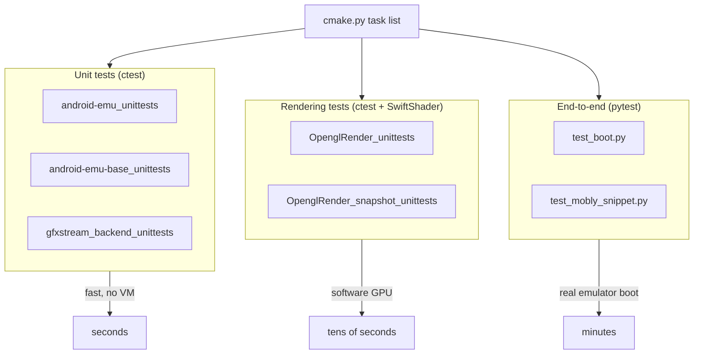
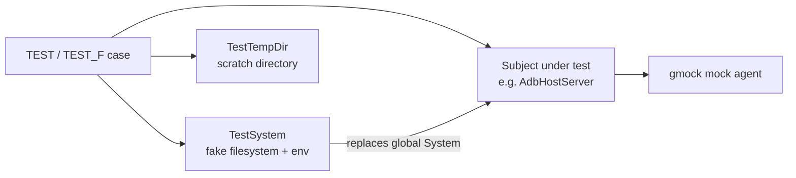
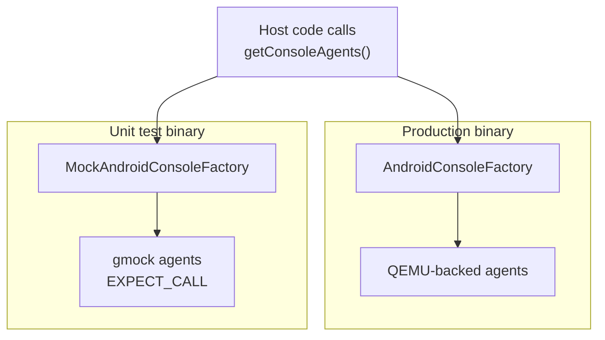
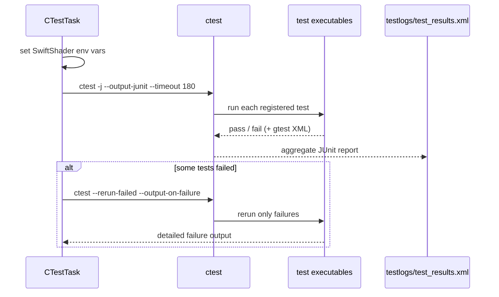
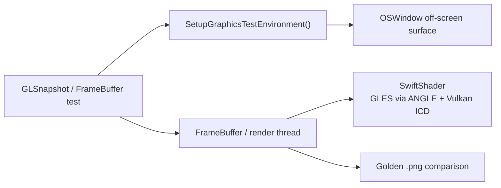
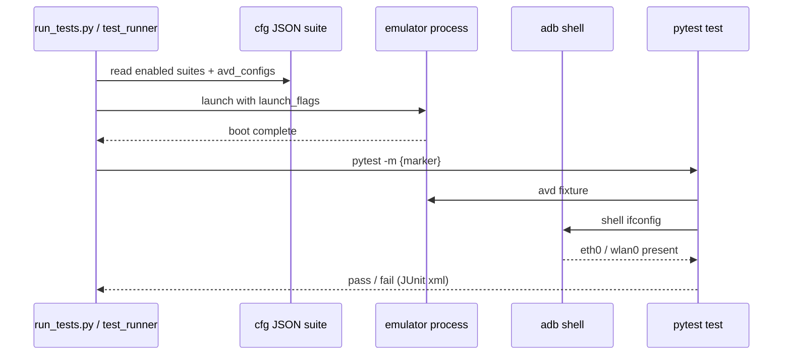
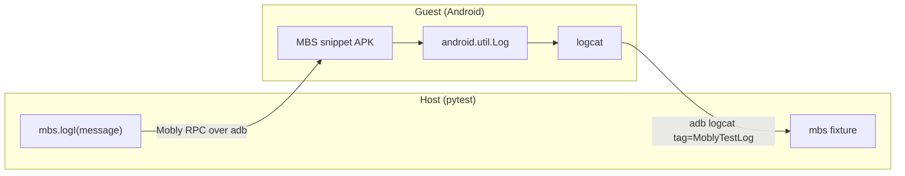
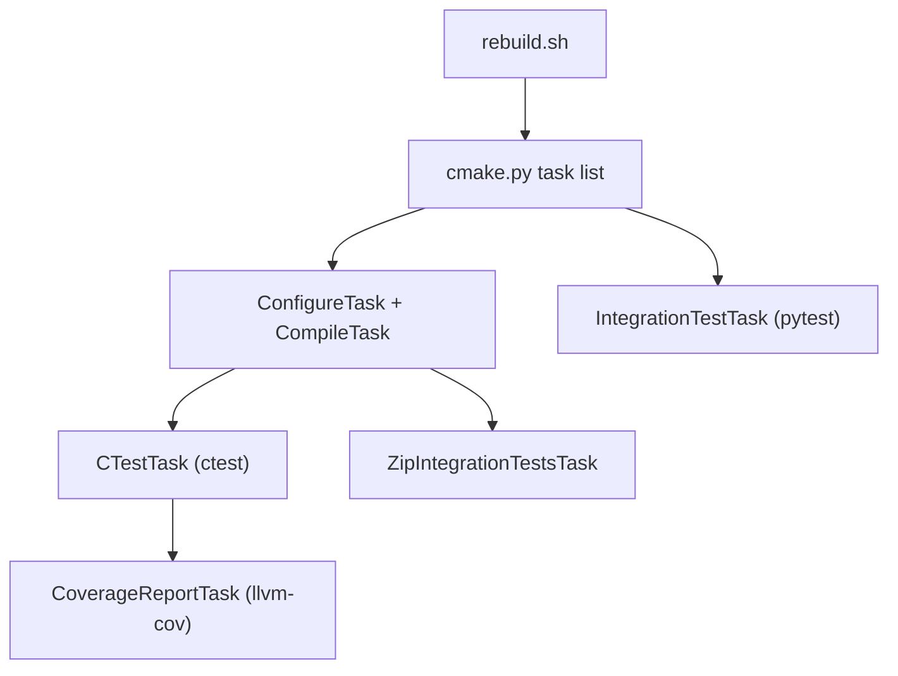

# Chapter 27: Testing

The emulator is a large, multi-language host program — a fork of QEMU wrapped in a C++ control plane, a Vulkan/GLES rendering server, gRPC services, a Qt UI, and a guest-facing pipe layer. A bug in any one of those layers can silently corrupt a snapshot, drop a frame, or hang a boot. The codebase defends against that with three concentric rings of tests: googletest-based unit tests compiled alongside the binaries, host-side end-to-end tests written in pytest that launch a real emulator and drive it through ADB and gRPC, and Mobly snippet tests that run real Android APIs inside the guest under host control. All three rings are wired into the same Python build orchestrator that produces the SDK package, so a `ctest` failure or a failing e2e suite can break a presubmit just as readily as a compile error.

This chapter walks the test pyramid from the bottom up: how a `_unittest.cpp` file becomes a `ctest` target, how mock console agents let host code run without a real VM, how gfxstream renders against SwiftShader in a headless container, how the pytest harness boots an AVD and asserts on its behavior, and how Mobly bridges host Python to guest Java. Every mechanism here is grounded in a file you can open in the tree.

---

## 27.1 The Test Pyramid

The emulator's tests fall into three tiers, each with a different cost, scope, and runner.

The bottom tier is the largest: googletest/gmock unit tests that link against a single library, run in milliseconds, and never start a VM. There are dozens of `*_unittest.cpp` files under `external/qemu/android/android-emu/` alone, plus a parallel set in `hardware/google/gfxstream/`. They are compiled into per-component test executables, registered with CMake's `add_test`, and run by `ctest`.

The middle tier is the gfxstream rendering tests. These still use googletest, but they pull in a software GPU (SwiftShader for both GLES and Vulkan) and an off-screen window, so they exercise the real rendering pipeline without hardware. They live in `hardware/google/gfxstream/host/tests/` and are registered with CMake's `gtest_discover_tests`.

The top tier is the host-side end-to-end suite under `external/adt-infra/pytest/test_embedded/`. These tests launch an actual `emulator` process against a downloaded system image, wait for boot, then assert on guest behavior through ADB shell commands, the telnet console, gRPC, and Mobly RPC. They are slow (a single boot test can take minutes) and gate presubmit through named test suites.

### 27.1.1 Three rings, one orchestrator

What ties the rings together is `external/qemu/android/build/python/aemu/cmake.py`, the Python entry point invoked by `external/qemu/android/rebuild.sh`. It assembles a list of `BuildTask` objects — compile, then `CTestTask`, then `IntegrationTestTask` — so the same command that builds the emulator also runs its tests.

The test pyramid, from cheapest to most expensive



The number of unit-test targets dwarfs everything above it — there are over fifty `android_add_test` registrations across `external/qemu/android/` (in `android-emu-base`, `android-emu`, the `emu/*` component libraries, the gRPC services, the WebRTC stack, and bundled third-party libraries). That ratio is deliberate: the cheap tests catch most regressions, and the expensive e2e suite catches the integration bugs the unit tests structurally cannot.

## 27.2 Anatomy of a googletest Unit Test

A unit test in this tree is an ordinary googletest file. It includes `<gtest/gtest.h>`, declares `TEST` or `TEST_F` cases, and uses `EXPECT_*`/`ASSERT_*` macros. The googletest and gmock sources are vendored in `external/googletest/` (pinned to a specific upstream commit in `external/googletest/METADATA`).

A representative example is the ADB host-server test, which spins up a fake server thread and checks the exact bytes the emulator sends to register itself.

```cpp
// Source: external/qemu/android/android-emu/android/emulation/AdbHostServer_unittest.cpp
TEST(AdbHostServer, notify) {
    serverThread.start();
    // Send a message to the server thread.
    EXPECT_TRUE(AdbHostServer::notify(emulatorPort, clientPort));
    intptr_t bufferSize = 0;
    EXPECT_TRUE(serverThread.wait(&bufferSize));
    // Verify message content.
    constexpr std::string_view kExpected = "0012host:emulator:7648";
    EXPECT_STREQ(kExpected.data(), serverThread.view().data());
}
```

The string `0012host:emulator:7648` is the wire-format ADB request the emulator sends to `adb server` to announce its console port — a four-hex-digit length prefix followed by the command. Asserting on the literal bytes turns a protocol contract into a test that fails loudly if anyone changes the format.

### 27.2.1 TestSystem and TestTempDir

Host code constantly touches the filesystem, environment variables, and the system clock. To keep unit tests hermetic, the base library ships a fake `System` singleton. `android::base::TestSystem`, declared in `external/qemu/android/emu/base/include/android/base/testing/TestSystem.h`, temporarily replaces the global `System` on construction and restores the previous one in its destructor. It routes all filesystem access through a temporary directory and lets a test set environment variables in isolation.

The same `AdbHostServer_unittest.cpp` uses it to test environment-variable handling without polluting the real environment.

```cpp
// Source: external/qemu/android/android-emu/android/emulation/AdbHostServer_unittest.cpp
TEST(AdbHostServer, getClientPortWithEnvironmentOverride) {
    TestSystem testSystem("/bin", 32);
    testSystem.envSet("ANDROID_ADB_SERVER_PORT", "1234");
    EXPECT_EQ(1234, AdbHostServer::getClientPort());
}
```

The companion `TestTempDir` (in `android/base/testing/TestTempDir.h`) creates a unique scratch directory and deletes it on destruction, and `TestEvent` provides a thread-synchronization primitive for tests that need to wait on an asynchronous callback. The header comment for `TestSystem` documents the path-resolution rules: relative paths resolve from a default current directory of `/home`, and the launcher, app-data, and home directories are not created automatically.

### 27.2.2 Fixtures and test suites

Tests that share setup use a googletest fixture — a class deriving from `::testing::Test` with `SetUp`/`TearDown`, instantiated per `TEST_F`. The snapshot tests build on this: `SnapshotFeatureControlTest` in `external/qemu/android/android-emu/android/snapshot/Snapshot_unittest.cpp` derives from a `FeatureControlTest` base so each snapshot test starts from a controlled feature-flag state. gfxstream's `FrameBufferTest` (in `hardware/google/gfxstream/host/frame_buffer_unittest.cpp`) uses the heavier `SetUpTestSuite` hook to create the expensive rendering context once for the whole suite rather than per test.

How a unit test reaches its subject under test



## 27.3 Mocking the Console Agents

Most host code does not call the VM directly; it goes through *console agents* — structs of function pointers (`QAndroidVmOperations`, `QAndroidEmulatorWindowAgent`, `QAndroidMultiDisplayAgent`, `QAndroidGlobalVarsAgent`, and more) obtained from `getConsoleAgents()`. In a real run those agents are backed by QEMU and the UI. In a unit test there is no QEMU and no UI, so the tests inject mock agents instead.

The mocks live under `external/qemu/android/android-emu/android/emulation/testing/`. `MockAndroidVmOperations.h` generates gmock methods from the real struct signatures with a macro so the mock stays in sync with the interface it shadows.

```cpp
// Source: external/qemu/android/android-emu/android/emulation/testing/MockAndroidVmOperations.h
#define VM_OPERATION_MOCK(MOCK_MACRO, name) \
    MOCK_MACRO(                             \
            name,                           \
            std::remove_pointer<decltype(QAndroidVmOperations::name)>::type)

class MockAndroidVmOperations {
public:
    static MockAndroidVmOperations* mock;
    VM_OPERATION_MOCK(MOCK_METHOD0, vmStop);
    VM_OPERATION_MOCK(MOCK_METHOD3, snapshotSave);
    VM_OPERATION_MOCK(MOCK_METHOD3, snapshotLoad);
};
```

`decltype(QAndroidVmOperations::name)` reads the function-pointer type straight out of the real agent struct, so if someone changes the signature of `snapshotSave` the mock fails to compile rather than drifting out of sync.

### 27.3.1 Injecting mocks through a custom test main

The agents are looked up lazily through a factory. `MockAndroidConsoleFactory`, declared in `MockAndroidAgentFactory.h`, overrides the factory accessors to return the mock agents. To make the unit tests use it, the test launcher provides its own `main` that injects the factory before running any test.

```cpp
// Source: external/qemu/android/android-emu/android/emulation/testing/MockAndroidAgentFactory.cpp
int main(int argc, char** argv) {
    ::testing::InitGoogleTest(&argc, argv);
    fprintf(stderr, " -- Injecting mock agents. -- \n");
    android::emulation::injectConsoleAgents(
            android::emulation::MockAndroidConsoleFactory());
    return RUN_ALL_TESTS();
}
```

This `main` lives in the `android-emu-test-launcher` library (`external/qemu/android/android-emu/android-emu.cmake`, around line 610). Any test executable that needs working console agents links against that library, and its comment is explicit: *link against this library if you need to make any calls to getConsoleAgents()*. The factory also injects fakes for the AVD info, command-line options, and user config so that code which reads those globals does not dereference null.

Console-agent injection in unit tests versus production



## 27.4 Registering Tests with CMake

A `_unittest.cpp` file does nothing until a `CMakeLists.txt` (or a `*.cmake` include) turns it into a target. The custom CMake function for that is `android_add_test`, defined in `external/qemu/android/build/cmake/android.cmake`.

```cmake
# Source: external/qemu/android/build/cmake/android.cmake
function(android_add_test)
  ...
  android_add_executable(TARGET ${build_TARGET} ... NODISTRIBUTE)
  add_test(
    NAME ${build_TARGET}
    COMMAND
      $<TARGET_FILE:${build_TARGET}>
      --gtest_output=xml:${OPTION_TEST_LOGS}/$<TARGET_FILE_NAME:${build_TARGET}>.xml
      --gtest_catch_exceptions=0 ${build_TEST_PARAMS}
    WORKING_DIRECTORY $<TARGET_FILE_DIR:${build_TARGET}>)
  android_add_default_test_properties(${build_TARGET})
endfunction()
```

Three details matter here. The executable is marked `NODISTRIBUTE`, so test binaries never ship in the SDK. The `add_test` command passes `--gtest_output=xml:...` so each test target emits a JUnit-style XML report into the test-logs directory for the dashboard scraper. And `--gtest_catch_exceptions=0` tells googletest to let a crash propagate so the harness sees the real signal instead of a swallowed exception. The function also compiles tests at `-O0` (a comment notes *let's not optimize our tests*) to keep debugging straightforward and build times down.

### 27.4.1 Default test properties

`android_add_default_test_properties` (also in `android.cmake`, around line 843) attaches a consistent environment to every registered test:

- An `ASAN_OPTIONS` value read from `external/qemu/android/asan_overrides`, so AddressSanitizer behaves uniformly across tests.
- An `LLVM_PROFILE_FILE` set to `<test-name>.profraw`, which is what makes per-test coverage collection possible (see 27.9.1).
- A `TIMEOUT` property of 600 seconds set on every registered test, which becomes the operative per-test limit (a per-test `TIMEOUT` property takes precedence over ctest's `--timeout` default; see 27.5).
- Platform-specific Qt library search paths (`LD_LIBRARY_PATH` on Linux, `DYLD_LIBRARY_PATH` on macOS, `PATH` on Windows) so tests that touch the Qt UI can find the Qt runtime.

### 27.4.2 Bundling many test files into one target

Compiling and linking one executable per `_unittest.cpp` would be slow, so related tests are grouped. `android-emu.cmake` collects dozens of files into a single `android-emu_unittests_common` list and feeds it to one `android_add_test` call.

```cmake
# Source: external/qemu/android/android-emu/android-emu.cmake
android_add_test(TARGET android-emu_unittests
                 SRC ${android-emu_unittests_common})
```

That one target links against `android-emu`, the `android-emu-test-launcher` (for the mock-injecting `main`), the protobuf library, and the cmdline/hardware testing helpers. The `android_copy_test_files` / `android_copy_test_dir` helpers stage golden images and a `test-sdk` directory next to the binary so tests can load fixtures relative to their working directory. There is a `-DENABLE_QT_TESTS=ON` guard: tests that depend on Qt are skipped unless that flag is set, because the build agents do not always have a display.

## 27.5 Running Unit Tests with ctest

Once registered, all unit tests run under `ctest`. The build orchestrator wraps this in `CTestTask` in `external/qemu/android/build/python/aemu/tasks/unit_tests.py`. It locates the bundled `ctest` from `prebuilts/cmake/`, then runs it with a JUnit output file and a per-test timeout.

```python
# Source: external/qemu/android/build/python/aemu/tasks/unit_tests.py
Command(
    [
        ctest,
        "-j", self.jobs,
        "--output-junit", junit_file.absolute(),
        "--timeout",  # Every test gets at most 3 minutes.
        "180",
    ]
).in_directory(self.destination).with_environment(env).run()
```

The JUnit file is written to `testlogs/test_results.xml` under the distribution directory specifically so the *test scraper* on CI can find it. The `--timeout 180` value is only a default for tests that have no `TIMEOUT` property of their own; because `android_add_default_test_properties` sets a `TIMEOUT` property of 600 seconds on every registered test (see 27.4.1), and a per-test `TIMEOUT` property takes precedence over the `--timeout` default, the effective per-test limit here is 600 seconds, not 180.

### 27.5.1 Retry-and-report on failure

When the first `ctest` run fails, the task does not give up immediately. It catches the failure and reruns only the failed tests with full output so the logs capture exactly what broke.

```python
# Source: external/qemu/android/build/python/aemu/tasks/unit_tests.py
except CommandFailedException:
    # Okay we have failures, let's give ourselves a 2nd chance
    # and log all the failures we encounter directly.
    Command(
        [ctest, "-j", self.jobs, "--rerun-failed",
         "--output-on-failure", "--timeout", "180"]
    ).in_directory(self.destination).with_environment(env).run()
```

`--rerun-failed` reuses ctest's record of the previous run, and `--output-on-failure` dumps each failing test's stdout/stderr inline. This second pass is about diagnosability, not flakiness masking — the build still fails, but the logs now contain the failure details rather than a bare pass/fail count.

### 27.5.2 The SwiftShader software-GPU environment

For tests that touch graphics, `CTestTask` injects a SwiftShader software renderer through environment variables before invoking ctest, so no physical GPU is required.

```python
# Source: external/qemu/android/build/python/aemu/tasks/unit_tests.py
env = {
    "ANGLE_DEFAULT_PLATFORM": "swiftshader",
    ...
}
if self.gfxstream:
    env["VK_DRIVER_FILES"] = str(
        self.destination / "lib64" / "vulkan" / "vk_swiftshader_icd.json")
    env["VK_ICD_FILENAMES"] = env["VK_DRIVER_FILES"]
    env["ANDROID_EMU_VK_ICD"] = "swiftshader"
```

`ANGLE_DEFAULT_PLATFORM=swiftshader` routes GLES through ANGLE on top of SwiftShader; `VK_ICD_FILENAMES` points the Vulkan loader at the SwiftShader ICD. It also sets `TEMP`/`TMP`/`TMPDIR` to a throwaway directory so tests do not litter the build tree.

The ctest run, with retry and software-GPU setup



## 27.6 gfxstream Rendering Tests

gfxstream — the GLES/Vulkan rendering server in `hardware/google/gfxstream/` — has its own test suite that goes beyond pure unit testing: it renders real frames against a software GPU and compares results. The tests are gated behind the `ENABLE_VKCEREAL_TESTS` CMake option and registered with `gtest_discover_tests` (which queries each binary for its individual `TEST` cases) via a local `discover_tests` helper.

```cmake
# Source: hardware/google/gfxstream/host/CMakeLists.txt
add_executable(
    OpenglRender_unittests
    frame_buffer_unittest.cpp
    vsync_thread_unittest.cpp
    tests/GLES1Dispatch_unittest.cpp
    tests/DefaultFramebufferBlit_unittest.cpp
    tests/TextureDraw_unittest.cpp
    tests/StalePtrRegistry_unittest.cpp)
target_link_libraries(
    OpenglRender_unittests
    PRIVATE gfxstream_backend_static gfxstream_common_base
            gfxstream_common_testenv gfxstream_host_common
            gfxstream_host_testing_support gmock gtest_main)
discover_tests(OpenglRender_unittests)
```

That file registers five test executables via `discover_tests`. Three of them are the GLES suites: `gfxstream_backend_unittests` (backend and feature-flag tests), `OpenglRender_unittests` (basic GLES rendering), and `OpenglRender_snapshot_unittests` (a large suite that saves and restores GL state across snapshots — `tests/GLSnapshot*_unittest.cpp`). The other two cover the Vulkan path: `Vulkan_unittests` (which ships `vulkan/testdata/*.png` golden images, copied to `testdata` at build time) and `Vulkan_integrationtests`. The snapshot tests are the most valuable here because GL state restoration is exactly the kind of thing a unit test cannot reach but an integration-style render-and-compare test can.

### 27.6.1 The graphics test environment

Rendering tests need a GL/Vulkan context and an off-screen surface. The shared setup lives in `hardware/google/gfxstream/common/testenv/`, exposing two functions.

```cpp
// Source: hardware/google/gfxstream/common/testenv/include/gfxstream/common/testing/graphics_test_environment.h
namespace gfxstream {
namespace testing {
bool SetupGraphicsTestEnvironment();
bool IsGraphicsTestEnvironmentProvidingVulkanDriver();
}  // namespace testing
}  // namespace gfxstream
```

`SetupGraphicsTestEnvironment` initializes the software driver the test will render against, and `IsGraphicsTestEnvironmentProvidingVulkanDriver` lets a test skip itself when no Vulkan driver is available. The `FrameBufferTest` fixture in `frame_buffer_unittest.cpp` pulls in `OSWindow`, `SampleApplication`, and `ShaderUtils` from `host/testlibs/` to create an actual rendering target. On Linux the `OpenglRender_unittests` target additionally links `x11_testing_support` and is compiled with `GFXSTREAM_HAS_X11=1` so it can create the off-screen X11 surface even in a headless container.

### 27.6.2 Why software rendering matters for CI

Because the tests run against SwiftShader rather than a vendor GPU, they are deterministic and reproducible on any build machine — the same code path the `CTestTask` SwiftShader environment sets up for `android-emu`'s graphics tests. That determinism is what lets golden-image comparison tests (render a known scene, compare pixels to a checked-in `.png`) be trusted; a real GPU's driver-specific rounding would make pixel-exact golden tests fragile.

gfxstream rendering test against a software GPU



## 27.7 End-to-End Tests with pytest

The top of the pyramid is the host-side e2e suite in `external/adt-infra/pytest/test_embedded/`. These are real pytest tests that boot an emulator and assert on its behavior. The build orchestrator runs them through `IntegrationTestTask` in `external/qemu/android/build/python/aemu/tasks/integration_tests.py`, which invokes the suite launcher `run_tests.py`.

```python
# Source: external/qemu/android/build/python/aemu/tasks/integration_tests.py
py.run([
    self.launcher,
    "--emulator", emulator_dir / "emulator",
    "--fishtank", fishtank_dir / "fishtank",
    "--symbols", self.build_directory / "build" / "symbols",
    "--test_suite", "presubmit_emulator_test_suite",
    "--logdir", self.logdir,
    "--failures_as_errors",
])
```

The task runs in two modes. When a distribution directory exists it mimics CI (`run_from_dist`); otherwise it tests a local build (`run_from_build`), first checking that `emulator` and `fishtank` binaries are actually installed and raising `EmulatorDistributionNotFoundException` if not. It also refuses to run when cross-compiling (you cannot run an aarch64 emulator on an x86 build host) and, on macOS, skips entirely if `system_profiler` reports no attached display. In `cmake.py` the `IntegrationTestTask` is registered but `.enable(False)` — the inline comment says *Enable the integration tests by default once they are stable enough* — so the full e2e run is opt-in for local builds while CI drives `run_tests.py` directly.

### 27.7.1 A real boot test

The e2e tests read like Python application code. `tests/test_boot.py` boots an AVD and checks for network connectivity over ADB.

```python
# Source: external/adt-infra/pytest/test_embedded/tests/test_boot.py
async def has_network(adb):
    result = await adb.shell("ifconfig")
    if "eth0" in result or "wlan0" in result:
        logging.info("Success: Network interfaces found. Result: %s", result)
        return True
    return False
```

The harness wraps the running emulator in helper classes under `external/adt-infra/pytest/test_embedded/src/emu/`. `BaseEmulator` (in `src/emu/emulator.py`) exposes `launch`, `wait_for_boot`, `has_booted`, `console`, `start_activity`, and a `mobly` accessor, while the concrete `Emulator` subclass actually spawns the process and waits for ADB to come online. Tests request these through pytest fixtures — `avd`, `adb_shell`, `emulator_log`, `mbs` — defined in `tests/fixtures/emulator_fixtures.py` and `tests/fixtures/mobly_fixtures.py`, with the emulator-level fixtures scoped to `module` so one boot is shared across the tests in a file.

### 27.7.2 Suites, markers, and AVD configurations

What actually runs in presubmit is controlled by JSON suite definitions in `external/adt-infra/pytest/test_embedded/cfg/`. Each named suite maps to one or more AVD configurations and a set of pytest selection flags.

```python
# Source: external/adt-infra/pytest/test_embedded/cfg/emulator_linux_tests.json (excerpt)
"adb_test_suite_api_36": {
    "avd_configs": [{"api": "36", "launch_flags": [], "tag.id": "google_apis"}],
    "description": "Set of tests that validate adb",
    "pytest_flags": ["-m adb"],
    "status": "enabled"
}
```

The `-m adb` flag selects tests carrying the `adb` pytest marker. Markers are registered programmatically in `tests/fixtures/markers.py` — `adb`, `boot`, `console`, `graphics`, `snapshot`, `multidisplay`, `e2e`, `slow`, `flaky`, and OS-skip markers like `skipos`, among many others. A suite can pin a specific API level, attach launch flags (for example `-feature GuestAngle -feature VulkanNativeSwapchain` to force a particular graphics path), and run the same tests across multiple device shapes (foldable, resizable, tablet, wear, XR). `test_runner.py` reads the JSON, matches enabled suites against the requested `--test_suite` name regex, and launches an emulator per `avd_config` before handing control to pytest.

End-to-end test flow from suite definition to assertion



## 27.8 Mobly Snippet Tests

Some behavior can only be observed by calling real Android framework APIs from inside the guest — toggling Wi-Fi, sending an SMS, reading storage. Mobly bridges that gap. The Mobly Bundled Snippets app (`external/mobly-bundled-snippets/`) is an Android APK whose methods are exposed to the host as RPCs through the `@Rpc` annotation.

```java
// Source: external/mobly-bundled-snippets/src/main/java/com/google/android/mobly/snippet/bundled/WifiManagerSnippet.java
public class WifiManagerSnippet implements Snippet {
    @Rpc(description = "Turns on Wi-Fi with a 30s timeout.")
    public void wifiEnable() throws InterruptedException, WifiManagerSnippetException { ... }

    @Rpc(description = "Checks if Wi-Fi is enabled.")
    public boolean wifiIsEnabled() { ... }
}
```

Each `@Rpc`-annotated method becomes a callable RPC. The snippet classes cover networking, Bluetooth (`BluetoothAdapterSnippet`, GATT client/server), telephony and SMS, audio, media, storage, accounts, and notifications — each wrapping the corresponding `android.*` manager so a host test can drive a real framework API on the guest.

### 27.8.1 Host-to-guest RPC plumbing

On the host side, the e2e harness installs the APK and exposes the snippets through a fixture. `tests/fixtures/mobly_fixtures.py` installs the Mobly Bundled Snippets package and returns a controller per package name.

```python
# Source: external/adt-infra/pytest/test_embedded/tests/fixtures/mobly_fixtures.py
@pytest.fixture
async def install_mobly_apk(avd: BaseEmulator):
    mobly_snippets = Application(
        avd,
        apk_path=APP_MOBLY_APK.absolute(),
        package_name="com.google.android.mobly.snippet.bundled")
    await mobly_snippets.install()
    yield mobly_snippets
```

The `mbs` fixture then narrows that to the bundled-snippets controller, and a test calls a guest API as if it were a Python method.

```python
# Source: external/adt-infra/pytest/test_embedded/tests/mobly/test_mobly_snippet.py
async def test_can_use_standard_mobly_snippets(avd, mbs):
    message = "test_can_use_standard_snippets"
    mbs.logI(message)
    async with await avd.adb.logcat(tag="MoblyTestLog") as stream:
        assert await eventually(
            lambda line: message in line, stream
        ), f"Did not see {message} on logcat"
```

`mbs.logI(message)` is a method call on the host that becomes an RPC into the snippet APK, which calls `android.util.Log` inside the guest. The test then tails logcat over ADB to confirm the message appeared — a full round trip from host Python to guest framework and back. The fixtures also wire in `snippet_uiautomator` so a Mobly test can drive on-screen UI through UiAutomator, not just call APIs.

Mobly host-to-guest RPC round trip



## 27.9 Build-Tooling Integration and Coverage

All of the above is orchestrated by the Python build system, so tests are not a separate step you remember to run — they are tasks in the build graph. `external/qemu/android/rebuild.sh` finds the bundled Python interpreter and hands off to `build/python/cmake.py`, which assembles the task list including `CTestTask`, `EmugenTestTask`, `GenEntriesTestTask`, `CoverageReportTask`, and `IntegrationTestTask`. The `--test_jobs` argument (defaulting to the host CPU count) controls test parallelism, and `run_tests` is automatically disabled when cross-compiling.

### 27.9.1 Code coverage

Coverage is collected as a side effect of running the unit tests. Recall from 27.4.1 that every test sets `LLVM_PROFILE_FILE=<name>.profraw`. After ctest runs, `CoverageReportTask` (in `unit_tests.py`) merges those raw profiles and exports an lcov report using the bundled Clang tools.

```python
# Source: external/qemu/android/build/python/aemu/tasks/unit_tests.py
profraws = glob.glob(str(wc))
if not profraws:
    logging.info("No .profraw files present. Skipping coverage report.")
else:
    Command([llvm_profdata, "merge", "-sparse"] + profraws
            + ["-o", profdata_name]).in_directory(self.destination).run()
```

It locates `llvm-profdata` and `llvm-cov` from the version-matched Clang in `prebuilts/clang/host/`, merges the per-test `.profraw` files into a single `qemu.profdata`, then exports lcov. If no profiles were produced (a build without instrumentation), it logs and skips rather than failing.

### 27.9.2 The acceleration sanity check

A lightweight smoke test that complements the unit tests is `AccelerationCheckTask`, which simply runs the shipped `emulator-check` tool to confirm the build can detect a hypervisor on the host.

```python
# Source: external/qemu/android/build/python/aemu/tasks/unit_tests.py
class AccelerationCheckTask(BuildTask):
    """Verify that we can determine the hypervisor."""
    def do_run(self):
        Command([self.destination / "distribution" / "emulator"
                 / "emulator-check", "accel"]).run()
```

`emulator-check` is built from `external/qemu/android/emu/check/` (its own logic — `hypervisor_check.cpp`, `hw_gpu_check.cpp`, `disk_space_check.cpp` — has a `compatibility_check_unittest.cpp` of its own). In the current `cmake.py` this task is commented out of the default task list, but it remains the canonical one-line proof that an emulator binary is functional on a given host.

The build graph: where tests sit among the tasks



## 27.10 Try It

These commands assume you are at the superproject root, with the emulator already built into an output directory (commonly `objs/`). Replace `<out>` with your build directory.

Run the whole unit-test suite the way the build does, from your build directory:

```bash
prebuilts/cmake/linux-x86/bin/ctest -j "$(nproc)" \
    --output-junit testlogs/test_results.xml --timeout 180
```

Run a single test binary and filter to one case (googletest's own flags):

```bash
./android-emu_unittests --gtest_filter='AdbHostServer.*' \
    --gtest_catch_exceptions=0
```

List every test case a binary contains without running them:

```bash
./android-emu_unittests --gtest_list_tests
```

Confirm the emulator binary can find a hypervisor on this host (the `AccelerationCheckTask` smoke test):

```bash
<out>/distribution/emulator/emulator-check accel
```

Build and run gfxstream's rendering tests against SwiftShader by configuring with `-DENABLE_VKCEREAL_TESTS=ON`, then run the rendering target directly:

```bash
VK_ICD_FILENAMES=<out>/lib64/vulkan/vk_swiftshader_icd.json \
ANGLE_DEFAULT_PLATFORM=swiftshader \
    ./OpenglRender_unittests --gtest_filter='FrameBufferTest.*'
```

Inspect the e2e suite definitions and the markers they select:

```bash
python3 -c "import json; \
print('\n'.join(json.load(open( \
'external/adt-infra/pytest/test_embedded/cfg/emulator_linux_tests.json')).keys()))"
```

Launch the e2e harness against a local build (requires installed `emulator` and `fishtank` binaries and a system image):

```bash
python3 external/adt-infra/pytest/test_embedded/run_tests.py \
    --emulator <out>/distribution/emulator/emulator \
    --test_suite presubmit_emulator_test_suite --collect-only
```

## Summary

- The emulator's tests form a three-tier pyramid: googletest unit tests (fast, no VM), gfxstream rendering tests against a software GPU, and pytest end-to-end tests that boot a real emulator.
- Unit tests stay hermetic through `TestSystem`/`TestTempDir` (a fake filesystem and environment) and through mock console agents injected by a custom `main` in the `android-emu-test-launcher`.
- gmock mocks like `MockAndroidVmOperations` derive their method signatures from the real agent structs via `decltype`, so the interface and its mock cannot silently drift apart.
- `android_add_test` in `android.cmake` registers each test with `add_test`, emits per-test JUnit XML, builds at `-O0`, and applies uniform ASan, coverage, timeout, and Qt-path properties.
- `CTestTask` runs everything under `ctest` with a 180-second per-test timeout, sets up a SwiftShader software GPU for graphics tests, and reruns failures with full output for diagnosability.
- gfxstream tests render real frames against SwiftShader (deterministic and headless) and include a large GL-snapshot save/restore suite gated by `ENABLE_VKCEREAL_TESTS`.
- The pytest e2e suite boots AVDs described by JSON suite configs, selects tests by marker (`-m adb`, `-m graphics`, etc.), and asserts on guest behavior through ADB, the console, and gRPC.
- Mobly Bundled Snippets expose guest Android APIs as `@Rpc` methods so host Python tests can drive real framework calls and verify results over logcat or UiAutomator.
- Tests are tasks in the Python build graph driven by `rebuild.sh` and `cmake.py`, including coverage merging via `llvm-profdata`/`llvm-cov` from per-test `.profraw` files.

### Key Source Files

| File | Purpose |
|------|---------|
| external/qemu/android/build/cmake/android.cmake | `android_add_test` and default test properties (ASan, coverage, timeout) |
| external/qemu/android/android-emu/android-emu.cmake | Bundles `*_unittest.cpp` into `android-emu_unittests`; defines the test launcher |
| external/qemu/android/android-emu/android/emulation/testing/MockAndroidAgentFactory.cpp | Custom test `main` that injects mock console agents |
| external/qemu/android/android-emu/android/emulation/testing/MockAndroidVmOperations.h | gmock mock generated from the real VM-operations struct |
| external/qemu/android/emu/base/include/android/base/testing/TestSystem.h | Fake `System` singleton for hermetic unit tests |
| external/qemu/android/build/python/aemu/tasks/unit_tests.py | `CTestTask`, `AccelerationCheckTask`, `CoverageReportTask` |
| external/qemu/android/build/python/aemu/tasks/integration_tests.py | `IntegrationTestTask` driving the pytest e2e launcher |
| hardware/google/gfxstream/host/CMakeLists.txt | gfxstream rendering-test executables and `gtest_discover_tests` |
| hardware/google/gfxstream/common/testenv/include/gfxstream/common/testing/graphics_test_environment.h | Software-GPU graphics test environment setup |
| external/adt-infra/pytest/test_embedded/tests/test_boot.py | Representative end-to-end boot test |
| external/adt-infra/pytest/test_embedded/cfg/emulator_linux_tests.json | Named e2e suites, AVD configs, and pytest marker selection |
| external/adt-infra/pytest/test_embedded/tests/fixtures/mobly_fixtures.py | Installs the Mobly APK and exposes snippet controllers |
| external/mobly-bundled-snippets/src/main/java/com/google/android/mobly/snippet/bundled/WifiManagerSnippet.java | Example `@Rpc` guest-API snippet driven from host tests |
