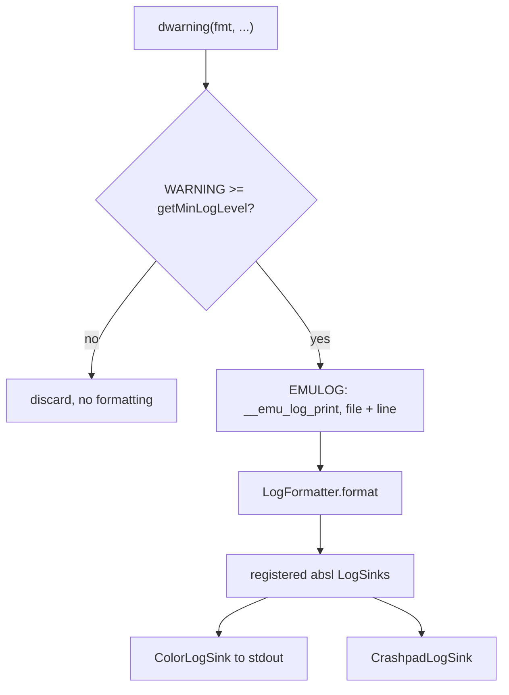
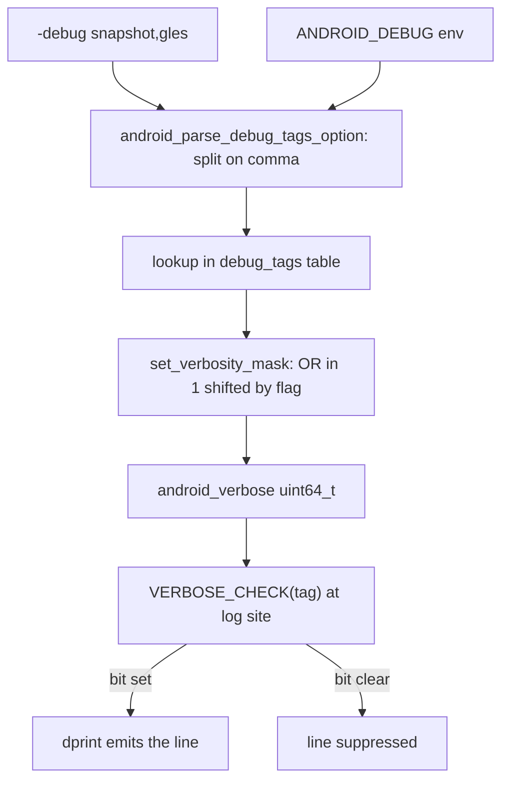
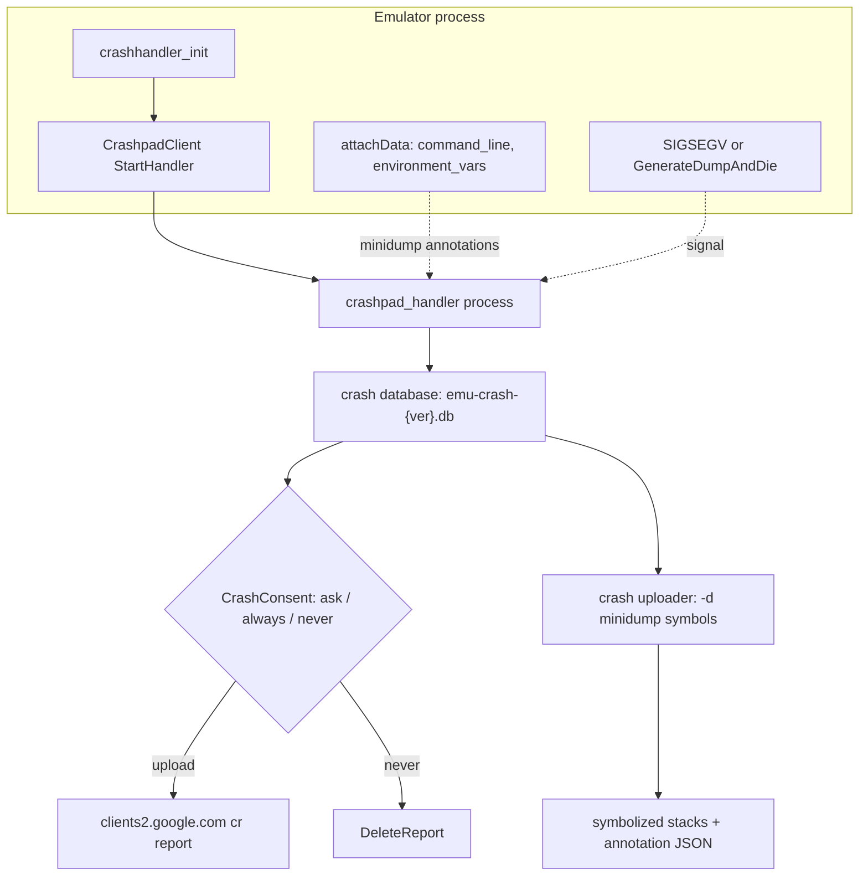
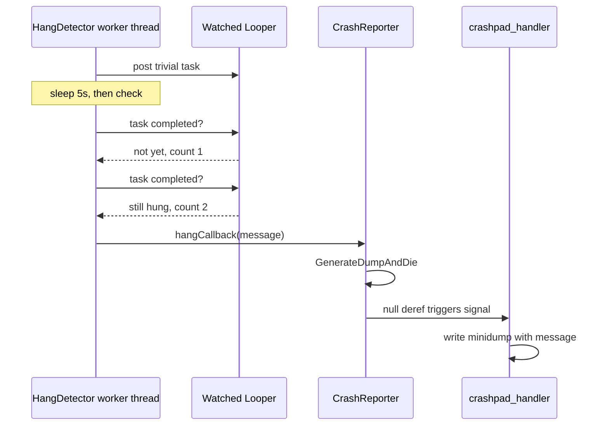
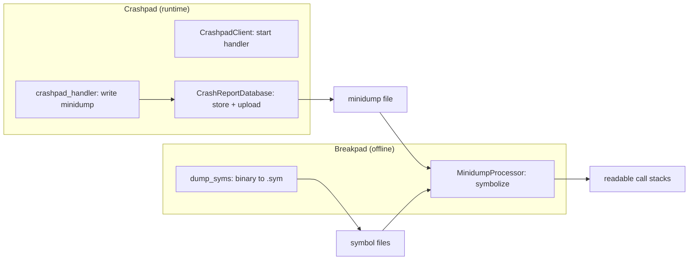
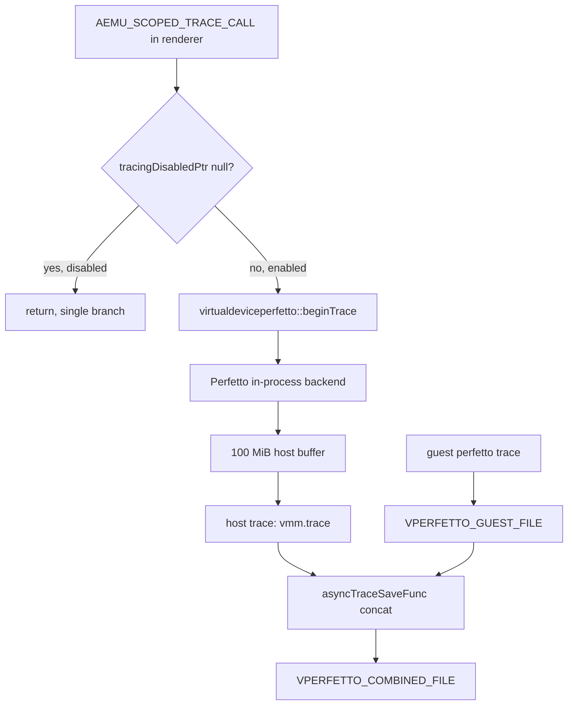
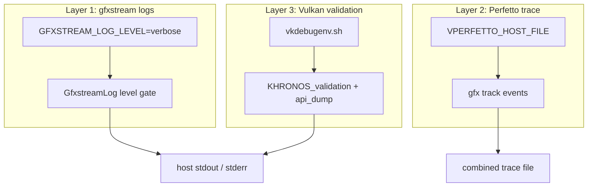

# Chapter 28: Debugging, Tracing, and Crash Reporting

When an emulator session misbehaves, the engineer needs to know what the host process was doing the instant it went wrong: which subsystem was logging, what the graphics stack was feeding the GPU, where the wall-clock time went, and — if the process died — what the call stacks looked like. The emulator ships an entire diagnostics layer for exactly this. It is a layered stack: a verbose-logging facility gated by a 64-bit tag mask, a Crashpad out-of-process crash handler that writes minidumps with attached annotations, a Breakpad-based minidump processor that symbolizes those dumps offline, a Perfetto in-process tracing backend the graphics pipeline writes into, and a set of environment switches that turn on Vulkan validation and gfxstream verbosity.

This chapter walks the diagnostic surfaces from the cheapest (a log line you flip on with a flag) to the most invasive (a fatal crash that snapshots the whole process). Each surface is grounded in the source that implements it, so that when you read "set `GFXSTREAM_LOG_LEVEL=verbose`" you can also see the `getenv` call that consumes it.

---

## 28.1 The Verbose Logging Facility

The emulator's logging core lives in the shared `aemu` base library, not in QEMU proper. Six severities are defined as a plain C enum so both C and C++ translation units can use them. The enum runs negative-to-positive so that a single integer comparison decides whether a message is emitted.

```c
// Source: hardware/google/aemu/base/include/aemu/base/logging/LogSeverity.h
typedef enum LogSeverity {
    EMULATOR_LOG_VERBOSE = -2,
    EMULATOR_LOG_DEBUG = -1,
    EMULATOR_LOG_INFO = 0,
    EMULATOR_LOG_WARNING = 1,
    EMULATOR_LOG_ERROR = 2,
    EMULATOR_LOG_FATAL = 3,
    EMULATOR_LOG_NUM_SEVERITIES,
} LogSeverity;
```

The familiar `dprint`, `dinfo`, `dwarning`, `derror`, and `dfatal` macros are thin wrappers that compare the message severity against the process-wide minimum before formatting anything. The comparison short-circuits before the variadic arguments are evaluated, so a disabled `dprint` costs one integer compare:

```c
// Source: hardware/google/aemu/base/include/aemu/base/logging/CLog.h
#define dprint(fmt, ...)                               \
    if (EMULATOR_LOG_DEBUG >= getMinLogLevel()) {      \
        EMULOG(EMULATOR_LOG_DEBUG, fmt, ##__VA_ARGS__) \
    }
```

`EMULOG` expands to `__emu_log_print`, which carries the source `__FILE__` and `__LINE__` so the detailed formatter can print where a line came from. The C++ side adds stream-style `LOG()` and `VLOG()` macros in `Log.h`, but they funnel into the same severity gate.

### 28.1.1 Severity versus the minimum level

There are two independent knobs, each backed by its own global in a separate translation unit. `getMinLogLevel()` / `setMinLogLevel()` set the floor: anything below the floor is dropped. They read and write `gMinLogLevel`, defined alongside them in `Log.cpp`. `severity()` / `setSeverity()` track the current default, which lives in the separate `android_log_severity` global in `LogConfiguration.cpp`. The two are distinct: `base_enable_verbose_logs()` has to update both `setMinLogLevel(...)` and `android_log_severity` independently.

```cpp
// Source: external/qemu/android/emu/base/logging/src/android/base/logging/LogConfiguration.cpp
uint64_t android_verbose = 0;
LogSeverity android_log_severity = EMULATOR_LOG_INFO;
```

The default floor is `EMULATOR_LOG_INFO`, which is why an unconfigured emulator prints info, warning, error, and fatal lines but suppresses debug and verbose. Turning on verbose mode lowers the floor to `EMULATOR_LOG_DEBUG` and, on the absl side, lowers absl's own minimum to `-2`:

```cpp
// Source: external/qemu/android/emu/base/logging/src/android/base/logging/LogConfiguration.cpp
void base_enable_verbose_logs() {
    setMinLogLevel(EMULATOR_LOG_DEBUG);
    android_log_severity = EMULATOR_LOG_DEBUG;
    absl::SetMinLogLevel(static_cast<absl::LogSeverityAtLeast>(-2));
}
```

### 28.1.2 Log formatters

How a line looks on screen is decoupled from whether it is emitted. `LogFormatter.h` declares four formatters with increasing detail.

The formatters available are these four:

- `SimpleLogFormatter`, which prints only the level and message
- `SimpleLogWithTimeFormatter`, which prefixes a timestamp
- `VerboseLogFormatter`, which adds thread id and `File:Line` location
- `GoogleLogFormatter`, which uses Google's standard logging prefix so external tools can parse it

There is also a `NoDuplicateLinesFormatter` wrapper that collapses repeated lines into an occurrence count. The launcher picks a formatter through a flags bitmask, described in section 28.2.2.

### 28.1.3 The severity gate

How a single `dwarning` decides whether to render.



---

## 28.2 Log Categories and the Verbose Tag Mask

Severity answers "how important", but the emulator also answers "which subsystem" through a tag system. Every category is one entry in a single macro list. This `VERBOSE_TAG_LIST` is the canonical inventory of debuggable subsystems.

```c
// Source: external/qemu/android/android-emu-base/android/utils/debug.h
#define VERBOSE_TAG_LIST                                                       \
    _VERBOSE_TAG(init, "emulator initialization")                              \
    _VERBOSE_TAG(console, "control console")                                   \
    _VERBOSE_TAG(modem, "emulated GSM modem")                                  \
    ...                                                                        \
    _VERBOSE_TAG(gles, "hardware OpenGLES emulation")                          \
    _VERBOSE_TAG(snapshot, "Snapshots")                                        \
    _VERBOSE_TAG(grpc, "Log grpc calls.")
```

The same list is re-expanded twice through token-pasting tricks. In `LogTags.h` it becomes an enum where each tag is a bit index:

```c
// Source: hardware/google/aemu/base/include/aemu/base/logging/LogTags.h
#define _VERBOSE_TAG(x, y) VERBOSE_##x,
typedef enum {
    VERBOSE_TAG_LIST VERBOSE_MAX /* do not remove */
} VerboseTag;
```

The mask itself is the `android_verbose` global from the previous section. Enabling and checking a tag are pure bit operations:

```cpp
// Source: external/qemu/android/emu/base/logging/src/android/base/logging/LogConfiguration.cpp
extern "C" bool verbose_check(uint64_t tag) {
    return (android_verbose & (1ULL << tag)) != 0;
}

extern "C" void verbose_enable(uint64_t tag) {
    android_verbose |= (1ULL << tag);
}
```

Because the mask is a single `uint64_t`, there can be at most 64 tags, and `VERBOSE_MAX` is the count guard. The `VERBOSE_PRINT(tag, ...)` macro combines the tag check with `dprint`, so a tagged log line is emitted only when both the severity floor and the specific bit are open.

### 28.2.1 Parsing the command line into the mask

The same `VERBOSE_TAG_LIST` is expanded a third time to build a name-to-flag table the command-line parser walks:

```cpp
// Source: external/qemu/android/emu/cmdline/src/android/cmdline-option.cpp
#define  _VERBOSE_TAG(x,y)   { #x, VERBOSE_##x, y },
static const struct { const char*  name; int  flag; const char*  text; }
debug_tags[] = {
    VERBOSE_TAG_LIST
    { 0, 0, 0 }
};
```

When you pass `-debug snapshot,gles`, the parser splits on commas, looks each token up in `debug_tags`, and ORs the corresponding bit into the mask. The special token `all` is handled before the table lookup and flips every bit at once; a leading `-` or `no-` prefix clears bits instead of setting them:

```cpp
// Source: external/qemu/android/emu/cmdline/src/android/cmdline-option.cpp
if (is_tag_equal(x, y, "all")) {
    result = true;
    if (remove) {
        base_disable_verbose_logs();
        set_verbosity_mask(0);
    } else {
        base_enable_verbose_logs();
        set_verbosity_mask(~0);
    }
}
```

The same parser is reachable from the environment. `parse_env_debug_tags()` reads `ANDROID_DEBUG` and feeds it through the identical code path, so `ANDROID_DEBUG=snapshot` behaves like `-debug snapshot`:

```cpp
// Source: external/qemu/android/emu/cmdline/src/android/cmdline-option.cpp
#define  ENV_DEBUG   "ANDROID_DEBUG"
...
void parse_env_debug_tags( void ) {
    const char*  env = getenv( ENV_DEBUG );
    android_parse_debug_tags_option(env, /*parse_as_suffix*/false);
}
```

### 28.2.2 Launcher flags versus emulator flags

There is a subtlety worth knowing: the `emulator` binary you invoke is a launcher that re-execs the real `qemu-system-*` engine. The launcher parses a handful of options itself before handing the rest over. In `main-emulator.cpp` the launcher treats `-verbose`, `-debug-all`, and `-debug-init` as synonyms that enable verbose logs, recognizes `-debug all`/`-debug init`, and maps `-log-detailed`, `-debug-time`, and `-log-nofilter` onto logging flags:

```cpp
// Source: external/qemu/android/emulator/main-emulator.cpp
if (!strcmp(opt, "-log-detailed") || !strcmp(opt, "-debug-log")) {
    logFlags = static_cast<LoggingFlags>(logFlags | kLogEnableVerbose);
}

if (!strcmp(opt, "-debug-time")) {
    logFlags = static_cast<LoggingFlags>(logFlags | kLogEnableTime);
}
```

After the loop, the launcher calls `base_configure_logs(logFlags)` once. The `LoggingFlags` enum (`kLogEnableTime`, `kLogEnableVerbose`, `kLogEnableDuplicateFilter`) selects which formatter the sink uses, so `-debug-time` selects the timestamped formatter and `-log-detailed` selects the verbose formatter with the thread/location prefix.

### 28.2.3 From tag string to enabled bit

How a `-debug` argument turns into a live log line.



---

## 28.3 The Crash Reporting Architecture

When the emulator dies unexpectedly, the goal is to capture a minidump of the failing process plus a bundle of context (command line, environment, recent errors) and, with the user's consent, ship it to a collection server. The implementation lives under `external/qemu/android/emu/crashreport/` and is built on Crashpad, with Breakpad retained only for offline minidump processing.

The design is deliberately out-of-process. A separate `crashpad_handler` executable is launched at startup and monitors the emulator. If the emulator faults, the handler — which is itself healthy — writes the minidump. This survives situations where the crashing process's own address space is too corrupted to run dump code.

### 28.3.1 Starting the handler

`CrashSystem::initialize()` finds the bundled `crashpad_handler` binary, decides where the crash database lives, and starts the handler with a fixed annotation set and the collection URL.

```cpp
// Source: external/qemu/android/emu/crashreport/src/android/crashreport/CrashSytemInit.cpp
auto annotations = std::map<std::string, std::string>{
        {"prod", "AndroidEmulator"},
        {"ver", EMULATOR_FULL_VERSION_STRING}};

std::vector<std::string> args = {"--no-rate-limit"};
#ifdef __APPLE__
args.emplace_back(
        absl::StrCat("--monitor-pid=", System::get()->getCurrentProcessId()));
#endif
bool active = mClient->StartHandler(
        handler_path, mDatabasePath, metrics_path, CrashURL, annotations,
       std::move(args) , true, false);
```

Two details matter here. First, the collection URL differs between release and debug builds — release uploads to the production endpoint, debug builds to a staging endpoint — selected by `NDEBUG`. Second, uploads are explicitly disabled right after initialization with `SetUploadsEnabled(false)`; nothing leaves the machine until consent is granted later.

The database path can be overridden by the `ANDROID_EMU_CRASH_REPORTING_DATABASE` environment variable; otherwise it defaults to a version-stamped directory under the temp dir, named `emu-crash-<version>.db`:

```cpp
// Source: external/qemu/android/emu/crashreport/src/android/crashreport/CrashReporter.cpp
const constexpr char kCrashpadDatabase[] =
        "emu-crash-" EMULATOR_VERSION_STRING_SHORT ".db";
```

Crash reporting can be turned off entirely. `crashhandler_init` honors `-crash-report-mode disabled` on the command line and the equivalent environment switch read by `getEnableCrashReporting()`, returning early before any handler is launched.

### 28.3.2 The crash reporting pipeline

The full lifecycle from launch to a symbolized stack.



### 28.3.3 What gets attached

`crashhandler_init` runs early in startup and bundles context into the report. It deliberately skips the first command-line argument (the path to the qemu binary, which would leak a local path) and only attaches environment variables whose names start with an allow-listed prefix:

```cpp
// Source: external/qemu/android/emu/crashreport/src/android/crashreport/CrashSytemInit.cpp
const std::vector<std::string_view> envPrefixes = {
    "ANDROID_EMU", // covers both ANDROID_EMU_ and ANDROID_EMULATOR_
    "GFXSTREAM_",
};
const std::vector<std::string_view> envExcludes = {
    "ANDROID_EMULATOR_WRAPPER_PID",
    "ANDROID_EMULATOR_LAUNCHER_DIR",
    "ANDROID_EMULATOR_PREBUILTS_DIR",
    "ANDROID_EMULATOR_DISCOVERY_DIR",
};
```

The exclude list strips the variables that hold local filesystem paths. This is the privacy boundary: graphics and emulator-feature variables go into the report, path-bearing ones do not.

---

## 28.4 Annotations: Carrying Context Into the Dump

A minidump alone is a register and memory snapshot. The emulator enriches it with named string annotations through a C API exported from `CrashReporter.cpp`. The header `crash-handler.h` is the public surface; most code uses one of three entry points.

The three crash-annotation primitives are these:

- `crashhandler_add_string(name, string)`, which attaches a named string that appears in the minidump as `name : string`
- `crashhandler_append_message(message)`, which appends to a rolling internal message buffer without crashing
- `crashhandler_copy_attachment(destination, source)`, which reads a file and attaches its contents under a name

The interesting part is how the storage is bucketed. Crashpad annotations are fixed-size at compile time, so `attachData` rounds the data length up to the next power of two and picks a `SimpleStringAnnotation<N>` template instantiation accordingly, capping at 16 KiB:

```cpp
// Source: external/qemu/android/emu/crashreport/src/android/crashreport/CrashReporter.cpp
int shift = floor(log2(data.size()));
...
if (shift >= 13) {
    annotation = std::make_unique<SimpleStringAnnotation<2<<13>>(name, data);
    if (data.size() > 2<<13)
        dwarning(
                "Crash annotation is very large (%d), only 16384 bytes "
                "will be recorded, %d bytes are lost.",
                data.size(), data.size() - (2<<13));
}
```

`SimpleStringAnnotation<MaxSize>` is a Crashpad `Annotation` subclass that reserves the buffer inline and `memcpy`s the truncated data in. The name is what shows up in the dump:

```cpp
// Source: external/qemu/android/emu/crashreport/include/android/crashreport/SimpleStringAnnotation.h
SimpleStringAnnotation(std::string name, std::string msg)
    : Annotation(Type::kString, mName, mBuffer), mBuffer() {
    memcpy(mName, name.c_str(),
           std::min<size_t>(name.size(), kNameMaxLength));
    auto dataSize = std::min<size_t>(msg.size(), MaxSize);
    memcpy(mBuffer, msg.c_str(), dataSize);
    SetSize(dataSize);
}
```

### 28.4.1 Capturing error logs into the dump

There is a bridge between logging and crash reporting. `CrashpadLogSink` is registered as an absl log sink at crash-system init time. It ignores info and warning lines, but error and fatal lines are streamed into an annotation buffer named `ERRLOG`:

```cpp
// Source: external/qemu/android/emu/crashreport/src/android/crashreport/CrashpadLogSink.cpp
switch (entry.log_severity()) {
    case absl::LogSeverity::kInfo:
    case absl::LogSeverity::kWarning:
        return;
    case absl::LogSeverity::kError:
    case absl::LogSeverity::kFatal:
    default:
        mOutputStream << msg;
        mOutputStream.flush();
}
```

The effect is that the last error messages the emulator logged before dying are automatically present in the minidump, with no extra wiring at each `derror` call site. The sink is registered exactly once, guarded by an atomic exchange.

### 28.4.2 Provoking a crash on purpose

When the code detects an unrecoverable internal error, it calls `crashhandler_die`. This is not a polite shutdown — the goal is to produce a minidump at the exact fault point. `GenerateDumpAndDie` first unblocks the fatal signals (otherwise the handler never sees them), attaches the final message, then deliberately dereferences a null pointer:

```cpp
// Source: external/qemu/android/emu/crashreport/src/android/crashreport/CrashReporter.cpp
void CrashReporter::GenerateDumpAndDie(const char* message) {
    enableSignalTermination();
    passDumpMessage(message);
    // this is the most cross-platform way of crashing
    volatile int* volatile ptr = nullptr;
    *ptr = 1313;  // die
#ifndef _WIN32
    raise(SIGABRT);
#endif
    abort();  // make compiler believe it doesn't return
}
```

The comment in the source explains the reasoning: `abort()` is not caught by the handler on Windows, an explicit store can be optimized out, and requesting a dump then exiting later leaves a window where a real crash could land in the middle. The double-`volatile` store defeats the optimizer. `enableSignalTermination()` itself unblocks `SIGSEGV`, `SIGABRT`, `SIGFPE`, and the rest so the handler can observe the fault.

---

## 28.5 Hang Detection

A frozen emulator that never crashes is worse than one that does — there is no dump. The `HangDetector` converts a hang into a crash so the diagnostics layer can capture it. It watches a set of message loops (`Looper`s) and, separately, a set of boolean predicates.

```cpp
// Source: external/qemu/android/emu/crashreport/include/android/crashreport/HangDetector.h
HangDetector(HangCallback&& hangCallback, Timing timing = defaultTiming());

void addWatchedLooper(
        base::Looper* looper,
        std::chrono::milliseconds taskTimeout = std::chrono::seconds(15));
```

The mechanism: for each watched looper, the detector posts a trivial task. A dedicated worker thread — separate so it cannot itself hang on whatever froze the loopers — wakes every few seconds and checks whether the posted task has completed. The default timing wakes the loop every 5 seconds and treats a task as hung after 15:

```cpp
// Source: external/qemu/android/emu/crashreport/include/android/crashreport/HangDetector.h
static constexpr Timing defaultTiming() {
    return {.hangLoopIterationTimeout = std::chrono::seconds(5),
            .hangCheckTimeout = std::chrono::seconds(15)};
}
```

A looper is only declared hung after the check fails twice in a row; `LooperWatcher::kMaxHangCount` is 2 in the implementation. When the `CrashReporter` builds its detector, the callback is wired straight to the fatal path, so a confirmed hang becomes a minidump:

```cpp
// Source: external/qemu/android/emu/crashreport/src/android/crashreport/CrashReporter.cpp
mHangDetector = std::make_unique<HangDetector>([](auto message) {
    CrashReporter::get()->GenerateDumpAndDie(c_str(message));
});
```

The detector is paused during early startup (`hangDetector().pause(true)` in `crashhandler_init`) so that loopers which have not started yet are not flagged as hung.

### 28.5.1 Timeout monitors

A lighter-weight cousin lives in `detectors/TimeoutMonitor.h`. `TimeoutMonitor` runs a callback if a scope is not exited within a deadline; `CrashOnTimeout` specializes that callback to `crashhandler_die`. This is used to guard individual operations that must complete promptly:

```cpp
// Source: external/qemu/android/emu/crashreport/include/android/crashreport/detectors/TimeoutMonitor.h
CrashOnTimeout(std::chrono::milliseconds timeout, std::string message)
    : TimeoutMonitor(timeout, [msg = message, t = timeout]() {
          auto timeout_msg = "Task timeout after " +
                             std::to_string(t.count()) + " ms. :" + msg;
          crashhandler_die(timeout_msg.c_str());
      }) {}
```

### 28.5.2 Hang to dump

How a stuck looper becomes a crash report.



---

## 28.6 Consent and Upload

The crash database accumulates minidumps locally. Whether any of them is uploaded is decided by a `CrashConsent` provider. The interface defines three consent states and three per-report actions:

```cpp
// Source: external/qemu/android/emu/crashreport/include/android/crashreport/CrashConsent.h
enum class Consent { ASK = 0, ALWAYS = 1, NEVER = 2 };
enum class ReportAction {
    UNDECIDED_KEEP = 0,
    UPLOAD_REMOVE = 1,
    REMOVE = 2
};
```

Different builds link different providers — there is a `CrashConsentAlways`, a `CrashConsentNever`, a `CrashConsentNoUi`, and a Qt-dialog `CrashConsentUi`. The build chooses which one via the `consentProvider()` factory. The `-crash-report-mode` command-line option (`disabled`, `never`, `always`, `ask`) overrides the default at runtime.

`uploadEntries()` is the driver. It enumerates completed and pending reports, asks the consent provider about each one, and dispatches based on the returned action — upload-and-remove, remove, or keep-for-later:

```cpp
// Source: external/qemu/android/emu/crashreport/src/android/crashreport/CrashSytemInit.cpp
auto status = mConsentProvider->requestConsent(report);
switch (status) {
    case CrashConsent::ReportAction::UPLOAD_REMOVE: {
        std::thread upload(
                [this, report]() { processReport(report); });
        upload.detach();
        break;
    }
    case CrashConsent::ReportAction::REMOVE:
        dinfo("No consent for crashreport %s, deleting.",
              report.uuid.ToString().c_str());
        toRemove.push_back(report.uuid);
        break;
    case CrashConsent::ReportAction::UNDECIDED_KEEP:
        dinfo("Failed to get consent, keeping %s for now.",
              report.id.c_str());
        break;
}
```

The actual upload uses an exponential backoff. `processReport` walks a fixed backoff schedule of 0, 2, 4, 8, ... up to 256 seconds, retrying while the result is `kRetry`, so a transient network failure does not lose the report:

```cpp
// Source: external/qemu/android/emu/crashreport/src/android/crashreport/CrashSytemInit.cpp
std::vector<std::chrono::seconds> backoff{0s,  2s,  4s,   8s,  16s,
                                          32s, 64s, 128s, 256s};
```

---

## 28.7 Offline Minidump Processing

Crashpad writes the minidump and uploads it, but to read a minidump locally you need a symbolizer. This is where Breakpad re-enters: `external/google-breakpad/` is kept for its minidump processor and the `dump_syms` tools that produce symbol files from binaries. The emulator wraps both into a single command-line tool, `CrashUploadTool.cpp`, which links Crashpad's database and Breakpad's processor.

The tool's options are deliberately minimal:

```cpp
// Source: external/qemu/android/emu/crashreport/src/android/crashreport/CrashUploadTool.cpp
"  -l                                      List local crash reports\n"
"  -u                                      Upload local crash report(s)...\n"
"  -e                                      Erase local crash report(s)\n"
"  -d  <minidump-file> [symbol-path ...]   Process the given minidump file\n"
"  -m (implies -d)                         Output in machine-readable format\n"
"  -s (implies -d)                         Output stack contents\n"
```

For the `-d` path the tool builds a Breakpad `MinidumpProcessor` over a `SimpleSymbolSupplier` rooted at the given symbol directories, reads the dump, and processes it into a `ProcessState` of symbolized call stacks:

```cpp
// Source: external/qemu/android/emu/crashreport/src/android/crashreport/CrashUploadTool.cpp
BasicSourceLineResolver resolver;
MinidumpProcessor minidump_processor(symbol_supplier.get(), &resolver);
...
Minidump dump(options.minidump_file);
if (!dump.Read()) { ... }
ProcessState process_state;
if (minidump_processor.Process(&dump, &process_state) !=
    google_breakpad::PROCESS_OK) { ... }
```

If no symbol path is given, the tool falls back to the developer default `objs/build/symbols`. After printing stacks it re-opens the file as a Crashpad `ProcessSnapshotMinidump` and dumps every module's annotations (the `command_line`, `environment_vars`, `ERRLOG`, and the rest from sections 28.3 and 28.4) as JSON. So one tool gives you both the symbolized stack and the context bundle.

### 28.7.1 The two crash libraries, divided by job

Crashpad and Breakpad coexist; each owns a different half.



---

## 28.8 Perfetto Tracing

For performance debugging the emulator integrates Perfetto, Google's tracing framework. The host side does not link the entire Perfetto SDK everywhere; instead it goes through a thin "tracing-only" shim, `external/qemu/android/third_party/perfetto-tracing-only/`, that exposes a tiny C++ surface. The base library's `Tracing.cpp` forwards to it only when `USE_PERFETTO_TRACING` is defined.

The public API is four calls plus a scoped helper:

```cpp
// Source: hardware/google/aemu/base/include/aemu/base/Tracing.h
TRACING_API void enableTracing();
TRACING_API void disableTracing();
TRACING_API void beginTrace(const char* name);
TRACING_API void endTrace();

#define AEMU_SCOPED_TRACE(tag) ... android::base::ScopedTrace ...(tag)
#define AEMU_SCOPED_TRACE_CALL() AEMU_SCOPED_TRACE(__func__)
```

The hot path is optimized for the common case where tracing is off. `beginTrace` and `ScopedTrace` first test a cached `tracingDisabledPtr` and return immediately if tracing is disabled, so an inactive trace point is a single branch:

```cpp
// Source: hardware/google/aemu/base/Tracing.cpp
__attribute__((always_inline)) void beginTrace(const char* name) {
    if (CC_LIKELY(!tracingDisabledPtr)) return;
#ifdef USE_PERFETTO_TRACING
    virtualdeviceperfetto::beginTrace(name);
#endif
}
```

### 28.8.1 The in-process backend and the trace categories

The SDK-backed implementation registers Perfetto with an in-process backend and a single `gfx` category for graphics events. Trace data is buffered in-process and written to a file:

```cpp
// Source: external/qemu/android/third_party/perfetto-tracing-only/perfetto-sdk-tracing-only.cpp
PERFETTO_DEFINE_CATEGORIES(
    ::perfetto::Category("gfx")
        .SetDescription("Events from the graphics subsystem"));
PERFETTO_TRACK_EVENT_STATIC_STORAGE();
```

`initialize` sets up the in-process backend once:

```cpp
// Source: external/qemu/android/third_party/perfetto-tracing-only/perfetto-sdk-tracing-only.cpp
::perfetto::TracingInitArgs args;
args.backends |= ::perfetto::kInProcessBackend;
::perfetto::Tracing::Initialize(args);
::perfetto::TrackEvent::Register();
```

### 28.8.2 Output files and the host/guest merge

`enableTracing` reads three environment variables to choose output filenames, defaulting the host trace to `vmm.trace`:

```cpp
// Source: external/qemu/android/third_party/perfetto-tracing-only/perfetto-sdk-tracing-only.cpp
const char* hostFilenameByEnv = std::getenv("VPERFETTO_HOST_FILE");
const char* guestFilenameByEnv = std::getenv("VPERFETTO_GUEST_FILE");
const char* combinedFilenameByEnv = std::getenv("VPERFETTO_COMBINED_FILE");
```

The host trace is given a process track named `VirtualMachineMonitorProcess` and a 100 MiB buffer. The clever part is the merge: because the guest also produces a Perfetto trace, the shim can concatenate the guest and host trace files into one combined trace, after waiting for the guest file size to stabilize so it does not merge a half-written file:

```cpp
// Source: external/qemu/android/third_party/perfetto-tracing-only/perfetto-sdk-tracing-only.cpp
combinedFile << guestFile.rdbuf() << hostFile.rdbuf();
```

`setGuestTime` exists precisely so the two timelines can be aligned: the host applies the guest's time offset so events from both sides line up when opened in the Perfetto UI.

### 28.8.3 Where trace points live

The graphics stack (gfxstream) is the heaviest user of these trace points. It has its own parallel `gfxstream::base` tracing surface with the same `beginTrace`/`endTrace`/`ScopedTrace` shape, and higher-level `GFXSTREAM_TRACE_EVENT` macros sprinkled through the renderer. For example, `virtio_gpu_frontend.cpp` wraps virtio-gpu command handling in trace events under a stream-renderer category, and `sync_thread.cpp` and `frame_buffer.cpp` add their own. When tracing is enabled, these emit events under gfxstream's own Perfetto categories (`gfxstream.stream_renderer`, `gfxstream.default`, etc.) into the host trace that show exactly how long each renderer operation took. (The single `gfx` category from 28.8.1 belongs to the gfxstream::base/`AEMU_SCOPED_TRACE` shim path, not to these `GFXSTREAM_TRACE_EVENT` macros.)

### 28.8.4 The trace data path

How a scoped trace point ends up in a combined trace.



---

## 28.9 GPU and Graphics Debugging

Graphics bugs are some of the hardest to diagnose because the work crosses the guest/host boundary into a host GPU driver. The emulator provides three layers of graphics diagnostics: gfxstream's own log levels, Vulkan validation layers, and the `vkdebugenv.sh` helper that wires the layers up.

### 28.9.1 The gfxstream host logger

gfxstream has a self-contained logger separate from the `aemu` one, with six levels mirroring the standard set. The level is a simple integer compare in `GfxstreamLog`:

```cpp
// Source: hardware/google/gfxstream/common/logging/logging.cpp
void GfxstreamLog(LogLevel level, const char* file, int line, const char* function,
                  const char* format, ...) {
    if (level > sLogLevel) {
        return;
    }
    ...
    if (level == LogLevel::kFatal) {
        abort();
    }
}
```

Two behaviors are worth noting. First, a `GFXSTREAM_FATAL` log line calls `abort()` after logging, which is then caught by the Crashpad handler — so a fatal graphics error becomes a minidump just like any other crash. Second, the default formatted line is `[file(line)] message`, giving you the source location of every graphics log.

The level is set from the environment by the render library at startup. `GFXSTREAM_LOG_VERBOSE=1` forces the verbose level; otherwise `GFXSTREAM_LOG_LEVEL` accepts a named level:

```cpp
// Source: hardware/google/gfxstream/host/render_lib_impl.cpp
if (gfxstream::base::getEnvironmentVariable("GFXSTREAM_LOG_VERBOSE") == "1") {
    logLevel = GFXSTREAM_LOGGING_LEVEL_VERBOSE;
} else {
    const char* ENVVAR_GFXSTREAM_LOG_LEVEL = "GFXSTREAM_LOG_LEVEL";
    const std::string logLevelStr =
        gfxstream::base::getEnvironmentVariable(ENVVAR_GFXSTREAM_LOG_LEVEL);
    ...
    } else if (logLevelStr == "verbose") {
        logLevel = GFXSTREAM_LOGGING_LEVEL_VERBOSE;
    }
}
```

The valid names are `error`, `warning`, `info`, `debug`, and `verbose`. There is also a coarser `ANDROID_EMUGL_VERBOSE` variable that the virtio-gpu renderer sets internally when other verbose modes are requested.

### 28.9.2 Vulkan validation via vkdebugenv

When gfxstream renders through Vulkan on the host, bugs in the command stream often surface only as undefined behavior in the driver. The cure is the Khronos validation layer. The emulator ships a one-line helper that points the Vulkan loader at the bundled layers:

```bash
# Source: external/qemu/android/vkdebugenv.sh
BINDIR=objs
LAYERDIR=$BINDIR/testlib64/layers
export LD_LIBRARY_PATH=$LAYERDIR
export VK_LAYER_PATH=$LAYERDIR
export VK_INSTANCE_LAYERS=\
VK_LAYER_KHRONOS_validation:\
VK_LAYER_LUNARG_api_dump
```

Two layers are enabled. `VK_LAYER_KHRONOS_validation` checks every Vulkan call against the spec and prints diagnostics when the renderer misuses the API; `VK_LAYER_LUNARG_api_dump` logs every Vulkan call with its arguments, which is the closest thing to a Vulkan-level strace. The bundled layer directory (`testlib64/layers`) also contains a monitor and a screenshot layer. Sourcing this script before launching the emulator turns on full Vulkan validation for the host renderer.

### 28.9.3 Three graphics diagnostic layers

The graphics debugging surfaces, from cheapest to most detailed.



---

## 28.10 Inspecting the Running Machine

Beyond logs and dumps, several switches let you observe a live emulator without crashing it.

The available live-inspection switches include these:

- `-show-kernel`, which surfaces the guest kernel's `dmesg` output on the host console, useful when the guest never reaches userspace
- `-logcat <tags>`, which pipes the guest logcat (filtered by tag) to the host console so you do not need a separate `adb logcat`
- `-wait-for-debugger`, which pauses the emulator at launch until a native debugger attaches to the host process
- `-shell`, which opens a root shell on the current terminal into the guest

The `-wait-for-debugger` flag is the entry point for debugging the host process itself. The launcher also checks the `ANDROID_EMULATOR_DEBUG` environment variable early — before option parsing — and enables verbose launcher logs if it is set, which is how you debug the launcher's own re-exec logic:

```cpp
// Source: external/qemu/android/emulator/main-emulator.cpp
const char* debug = getenv("ANDROID_EMULATOR_DEBUG");
if (debug != NULL && *debug && *debug != '0') {
    base_enable_verbose_logs();
}
```

For inspecting state interactively, the emulator exposes a telnet control console (the `console` verbose tag) and a gRPC control plane (the `grpc` tag). Both are covered in their own chapters; here it is enough to know that turning on `-debug console` or `-debug grpc` logs every command the running machine receives, which is the fastest way to see what an automation client is doing to a live VM.

The append-only message store ties this back to crash reporting: `crashhandler_append_message` lets any subsystem leave a breadcrumb in the crash buffer during normal operation, so even a live inspection session is recording context that would be attached if the process later dies. The `Breadcrumb` enum reuses the very same `VERBOSE_TAG_LIST`, so each subsystem has a dedicated breadcrumb stream named after its log tag.

---

## 28.11 Try It

These commands assume you have an emulator build with the `emulator` launcher on your `PATH` and at least one AVD configured.

Enable verbose logging for two specific subsystems and watch the boot:

```bash
emulator -avd <your_avd> -debug snapshot,gles -show-kernel
```

Enable detailed log lines (timestamp, thread id, file:line) for every message:

```bash
emulator -avd <your_avd> -debug-time -log-detailed
```

Drive verbose mode from the environment instead of the command line:

```bash
ANDROID_DEBUG=init,console emulator -avd <your_avd>
```

Turn on the most verbose gfxstream graphics logging:

```bash
GFXSTREAM_LOG_LEVEL=verbose emulator -avd <your_avd> -gpu host
```

Run with full Vulkan validation by sourcing the bundled helper first (run from the emulator build output directory so the relative `objs/testlib64/layers` path resolves):

```bash
source external/qemu/android/vkdebugenv.sh
emulator -avd <your_avd> -gpu host
```

Collect a combined host/guest Perfetto trace (open the result in the Perfetto UI):

```bash
VPERFETTO_HOST_FILE=host.trace \
VPERFETTO_GUEST_FILE=guest.trace \
VPERFETTO_COMBINED_FILE=combined.trace \
emulator -avd <your_avd>
```

List and inspect local crash reports with the bundled crash tool (the binary is shipped next to the emulator; pass `-l` to list, `-d` to symbolize):

```bash
# List minidumps in the local crash database
crashreport -l

# Symbolize a minidump against a symbol directory
crashreport -d /path/to/minidump.dmp objs/build/symbols
```

Disable crash reporting entirely for a session:

```bash
emulator -avd <your_avd> -crash-report-mode disabled
```

---

## Summary

- Logging has two orthogonal axes: a severity floor (`getMinLogLevel`, default `INFO`) and a 64-bit subsystem tag mask (`android_verbose`); a line prints only when both gates open.
- The `VERBOSE_TAG_LIST` macro in `android/utils/debug.h` is the single source of truth for log categories — it is re-expanded into an enum, a parse table, and a breadcrumb enum, so adding a tag updates all three.
- The `-debug`, `-verbose`, `-debug-time`, and `-log-detailed` flags (and the `ANDROID_DEBUG` env var) are parsed in `cmdline-option.cpp` and `main-emulator.cpp` into the mask and a formatter selection.
- Crash reporting is out-of-process: a `crashpad_handler` binary started at launch writes minidumps even when the emulator's own address space is corrupt; uploads stay disabled until consent is granted.
- Context travels with the dump as Crashpad string annotations — `command_line`, allow-listed `environment_vars`, and an `ERRLOG` stream that captures error/fatal log lines automatically via `CrashpadLogSink`.
- `crashhandler_die` and `GenerateDumpAndDie` force a minidump at the fault point with a deliberate null dereference; the `HangDetector` and `CrashOnTimeout` convert freezes and slow operations into the same fatal path.
- Breakpad is retained for offline work: `crashreport -d` uses Breakpad's `MinidumpProcessor` and `dump_syms`-produced symbols to print symbolized stacks plus the annotation bundle as JSON.
- Perfetto tracing runs through a thin in-process shim with a single-branch fast path when disabled; `VPERFETTO_*` env vars name the host, guest, and combined trace files, and the shim concatenates host and guest traces into one timeline.
- Graphics debugging stacks three layers: gfxstream log levels (`GFXSTREAM_LOG_LEVEL`), Perfetto `gfx` track events, and Vulkan validation layers wired up by `vkdebugenv.sh`.

### Key Source Files

| File | Purpose |
|------|---------|
| `hardware/google/aemu/base/include/aemu/base/logging/LogSeverity.h` | Log severity enum and verbose mask C API |
| `hardware/google/aemu/base/include/aemu/base/logging/CLog.h` | `dprint`/`dinfo`/`derror` severity-gated macros |
| `external/qemu/android/android-emu-base/android/utils/debug.h` | `VERBOSE_TAG_LIST` — canonical log category inventory |
| `hardware/google/aemu/base/include/aemu/base/logging/LogTags.h` | Tag enum and `VERBOSE_CHECK`/`VERBOSE_PRINT` macros |
| `external/qemu/android/emu/base/logging/src/android/base/logging/LogConfiguration.cpp` | `android_verbose` mask, `verbose_enable`, verbose-mode toggle |
| `external/qemu/android/emu/cmdline/src/android/cmdline-option.cpp` | `-debug`/`ANDROID_DEBUG` tag parsing into the mask |
| `external/qemu/android/emulator/main-emulator.cpp` | Launcher flag handling and `base_configure_logs` |
| `external/qemu/android/emu/crashreport/src/android/crashreport/CrashSytemInit.cpp` | Starts `crashpad_handler`, attaches context, drives consent/upload |
| `external/qemu/android/emu/crashreport/src/android/crashreport/CrashReporter.cpp` | Annotation bucketing, `GenerateDumpAndDie`, C crash API |
| `external/qemu/android/emu/crashreport/src/android/crashreport/CrashpadLogSink.cpp` | Captures error/fatal logs into the `ERRLOG` annotation |
| `external/qemu/android/emu/crashreport/include/android/crashreport/HangDetector.h` | Looper hang detection that triggers a dump |
| `external/qemu/android/emu/crashreport/src/android/crashreport/CrashUploadTool.cpp` | Offline minidump symbolization with Breakpad + Crashpad |
| `hardware/google/aemu/base/Tracing.cpp` | Perfetto tracing shim with disabled-fast-path |
| `external/qemu/android/third_party/perfetto-tracing-only/perfetto-sdk-tracing-only.cpp` | In-process Perfetto backend, host/guest trace merge |
| `hardware/google/gfxstream/common/logging/logging.cpp` | gfxstream host logger and fatal-to-abort path |
| `hardware/google/gfxstream/host/render_lib_impl.cpp` | `GFXSTREAM_LOG_LEVEL`/`GFXSTREAM_LOG_VERBOSE` env parsing |
| `external/qemu/android/vkdebugenv.sh` | Enables Vulkan validation and api_dump layers |
