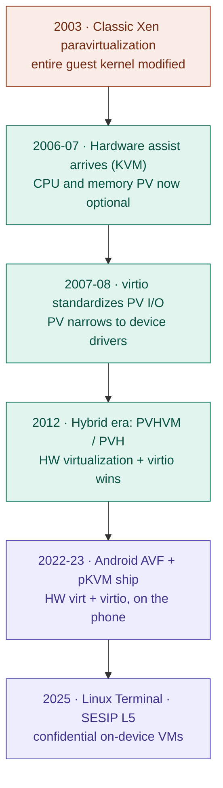
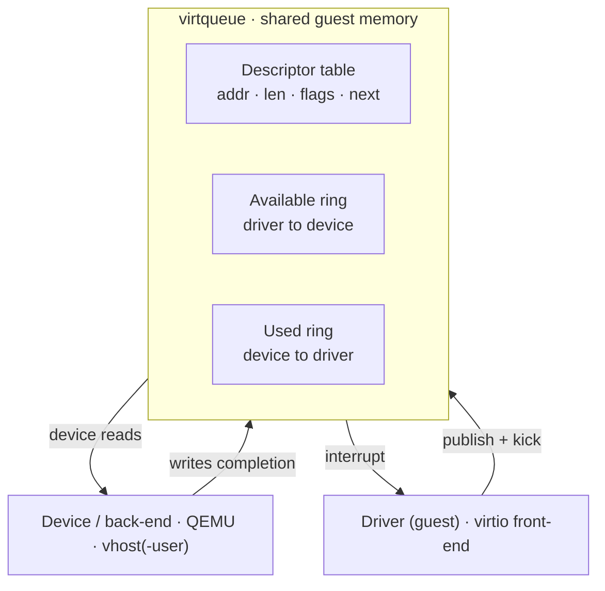
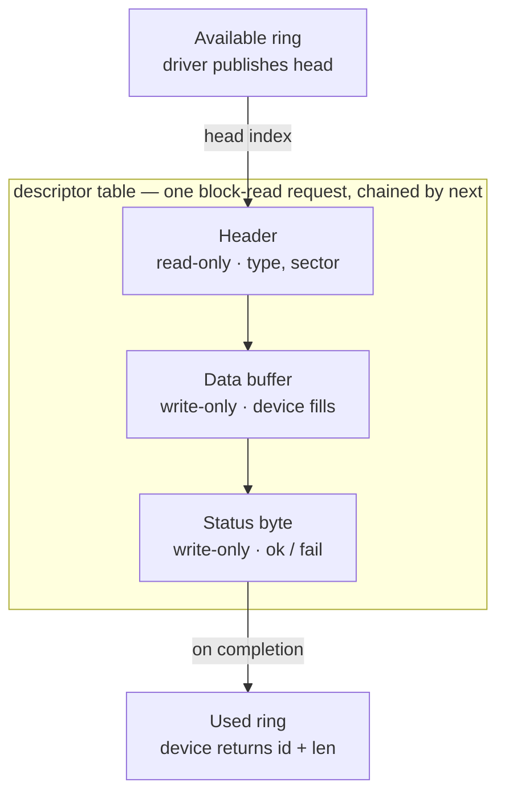
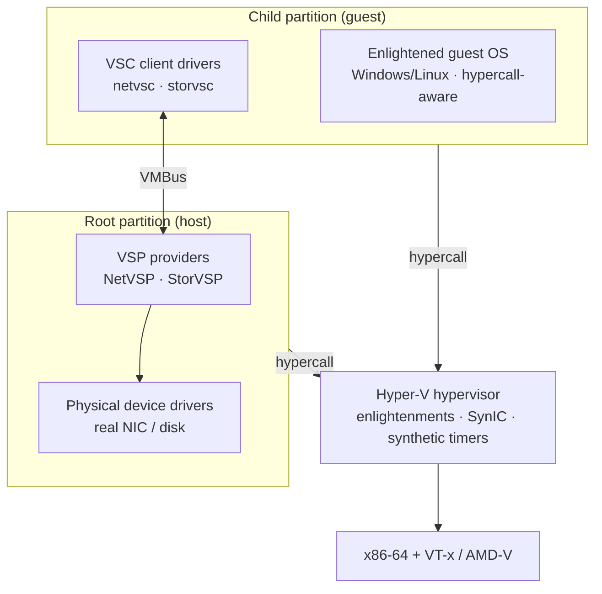
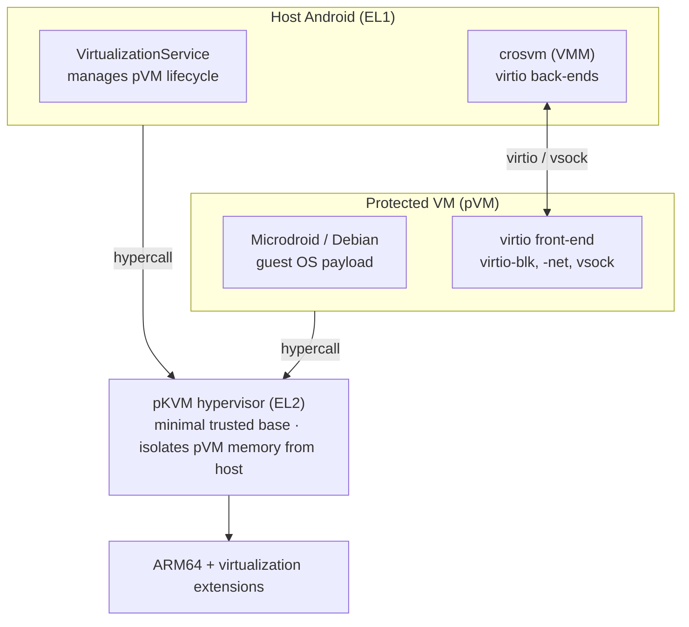
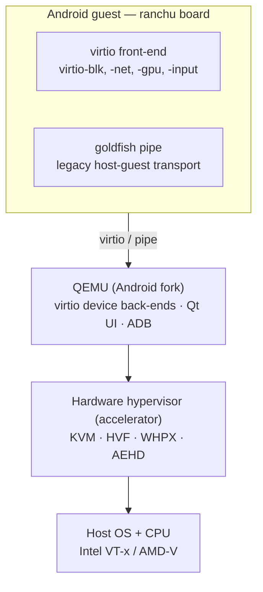
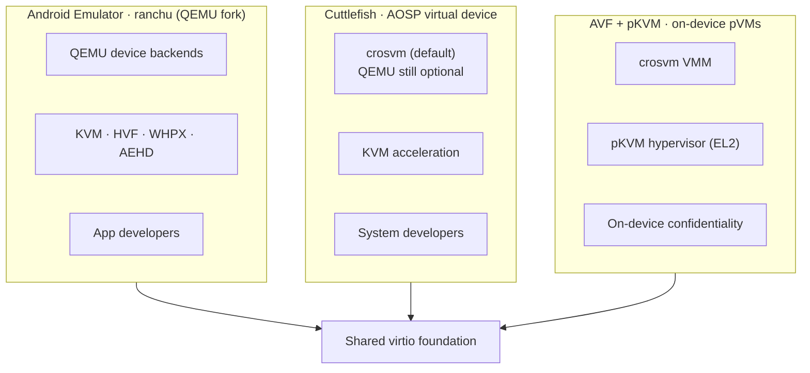
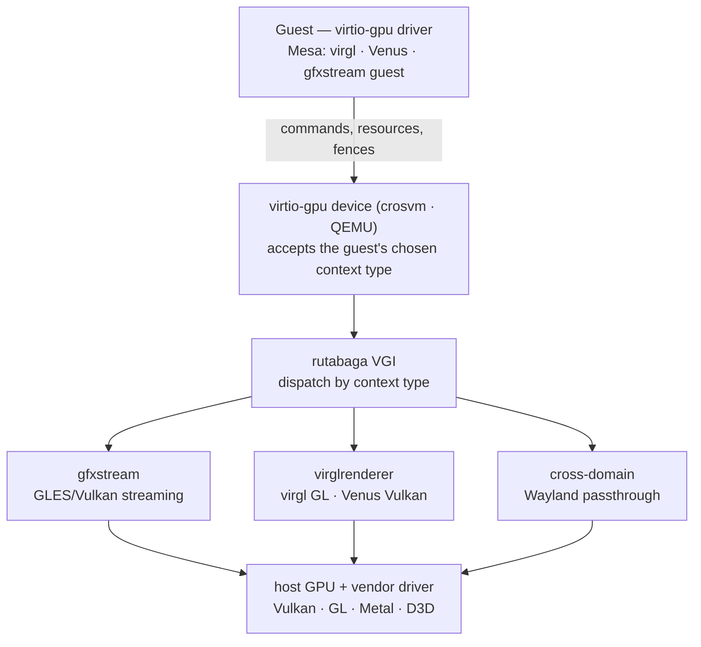

# Appendix A: Paravirtualization from Xen to Android

The rest of this book treats the Android Emulator as a thing in itself: a forked QEMU, a set of `virtio` devices, a per-host CPU accelerator. This appendix steps back to ask where that recipe came from. It traces how a 2003 research idea about cooperative virtual machines reshaped Linux, spread across operating systems, and ended up running a Debian virtual machine inside the phone in your pocket — and why the emulator, Cuttlefish, and Android's on-device virtualization framework are all variations on the same theme. It reflects developments through mid-2026.

---

## A.1 The core idea

In *full virtualization*, the guest operating system believes it owns real hardware, and the hypervisor has to trap and emulate every privileged operation the guest issues. In *paravirtualization* (PV), the guest *knows* it is virtualized and cooperates: instead of issuing privileged instructions and being trapped, it makes explicit, well-defined calls into the hypervisor — *hypercalls*. The cost is that the guest must be modified. The benefit is speed: far fewer expensive transitions between guest and hypervisor, especially for memory management and I/O. Almost everything that follows is the story of how the industry negotiated that single trade-off, and how the answer evolved from "modify the whole kernel" to "keep the kernel native, cooperate only where it pays."

## A.2 The arc at a glance

The word "paravirtualization" did not mean the same thing in 2025 that it meant in 2003. It started as a demand to port an entire guest kernel; it ended as a narrow contract for device I/O. The timeline below traces that shift in three eras: classic full-kernel PV gave way to a long hybrid era in which hardware took over CPU and memory virtualization and PV survived only as the I/O path — `virtio` — before that same hybrid recipe arrived on the phone.

#### Two decades of paravirtualization, grouped into three eras

## A.3 Origins: Xen and x86 paravirtualization

Paravirtualization as a practical x86 technique was born from the XenoServers project at the University of Cambridge Computer Laboratory, begun in 1999 under Ian Pratt. The motivating question, pursued with his PhD student Keir Fraser, was deceptively simple: rather than fooling a guest kernel into thinking it runs on bare metal, what if you *told* it that it was virtualized and gave it a cleaner, virtualization-friendly interface to work against?

The team — collaborating with researchers at Intel and Microsoft — took Linux and Windows XP and stripped out the instructions and behaviors that were slow or impossible to virtualize on the x86 of the era, replacing them with hypercalls. The result was `Xen`, whose first public release landed in October 2003, accompanied by the landmark SOSP (Symposium on Operating Systems Principles) 2003 paper *Xen and the Art of Virtualization*. Context made it matter: pre-2006 x86 had no hardware virtualization support, and several privileged instructions did not trap cleanly, so full virtualization on x86 required heavy techniques such as binary translation. Paravirtualization sidestepped all of that by changing the guest.

Xen introduced vocabulary still in use: a privileged control domain (`Dom0`) that owns the hardware and management stack, and unprivileged guest domains (`DomU`). The model proved commercially decisive — Amazon Web Services ran on Xen from its beginnings, making PV one of the quiet engines of the early public cloud.

## A.4 Into Linux: pvops, lguest, KVM, and virtio

For years, running Xen meant maintaining a heavily patched, "Xen-ified" Linux kernel out of tree. The cleanup came through paravirt-ops (`pvops`) — an abstraction layer merged into mainline Linux that lets a single kernel binary detect at runtime whether it is running natively or under a hypervisor (Xen, KVM, VMware's VMI, and others) and select the appropriate low-level operations. With `pvops`, upstream Linux gained Xen `DomU` (guest) support in kernel 2.6.23 (2007) and `Dom0` (control domain) support in 2.6.37 (2011).

Meanwhile, two developments reframed the landscape. `KVM` (Kernel-based Virtual Machine), developed at Qumranet, was merged into Linux 2.6.20 in 2007. It turned the Linux kernel itself into a hypervisor by leaning on the brand-new hardware virtualization extensions (Intel VT-x, AMD-V) — a different bet from Xen's: let the hardware handle CPU and memory virtualization, and use Linux as the host. Alongside it, `lguest`, a deliberately tiny "Linux-on-Linux" hypervisor by Rusty Russell (merged in 2007), was meant as a teaching tool — but its real legacy was what came with it.

That legacy was `virtio`. Russell, then at IBM, observed that the Linux kernel already supported at least eight distinct virtualization systems — Xen, KVM, VMware's VMI, IBM's System p and System z, User Mode Linux, `lguest`, and the legacy iSeries — and *each* shipped its own block, network, and console drivers. His 2008 paper, *virtio: towards a de-facto standard for virtual I/O devices*, proposed a common front-end driver framework with a clean ring-buffer transport called `vring` (a descriptor array, plus an "available" ring the guest fills and a "used" ring the host fills). Any hypervisor that implemented the `vring` transport could immediately reuse Linux's well-maintained `virtio` drivers instead of inventing its own.

This is the pivotal conceptual move in the whole story. Classic Xen PV asked you to paravirtualize the *entire kernel*. `virtio` paravirtualized only the part that benefited most — device I/O — through a matched pair of front-end drivers (in the guest) and back-end drivers (in the host), talking over shared memory. It became the de-facto standard for KVM's paravirtualized devices and, today, is what almost every cloud VM uses for disk and network, whether the user realizes it or not.

## A.5 Inside virtio: the virtqueue

It is worth opening the box on `virtio`, because the same data structure underlies every paravirtualized device in this appendix — in the cloud, in Android, in the emulator. The contract has two halves: a small configuration interface used for discovery and feature negotiation, and one or more *virtqueues* that carry the actual data. A device can have several; the simplest `virtio-net` has two, one for transmit and one for receive.

What made `virtio` portable rather than merely tidy was a deliberate separation of three concerns that earlier paravirtual device models had fused. Russell's 2008 paper draws the line explicitly between the *driver* (a Linux-internal abstraction — an operations structure a generic block or net driver calls), the *transport* (the ring mechanism that actually moves buffers), and *configuration* (how a device is discovered and its features negotiated). Fuse those, as Xen's early model did, and a driver is welded to one hypervisor's probing scheme; separate them, and the same driver rides any transport that implements the ring. That decoupling is why a single set of Linux drivers could serve the eight different virtualization systems Linux already carried in 2008 — Xen, KVM, VMware's VMI, IBM's System p and System z, User Mode Linux, `lguest`, and the legacy iSeries — each of which had been shipping its own duplicate block, network, and console drivers that no one enjoyed maintaining.

A virtqueue in its original "split" layout is three rings in memory the guest allocates, each writable by only one side. The **descriptor table** holds the buffers — each descriptor is an address, a length, some flags, and an optional link to a next descriptor, so one request can chain several memory segments. The **available ring** is where the driver publishes the heads of the descriptor chains it is offering. The **used ring** is where the device publishes the chains it has finished with. Because each ring has exactly one writer, the two sides never contend for a lock on the shared structures.

#### The split virtqueue: three single-writer rings in shared memory

The cycle is simple: the driver writes a buffer into the descriptor table, puts its index into the available ring, and rings a doorbell — a "kick," a single MMIO write — to notify the device. The device reads the available ring, does the work (copies a packet, services a disk request), writes the index into the used ring, and raises an interrupt. The crucial detail is that *both* notifications can be suppressed: under load a busy device stops asking to be interrupted and a busy driver stops kicking, so a stream of requests costs almost no transitions into the hypervisor. That batching is the entire performance argument for paravirtualization, made concrete.

Concretely, the guest-facing API is tiny. A driver calls `add_buf` to post a scatter-gather buffer — readable parts first, writable parts after — `kick` to ring the doorbell (often once after queuing many buffers), and `get_buf` to reap completions, which need not return in the order they were offered. Two further calls, `enable_cb` and `disable_cb`, switch completion callbacks on and off: the software equivalent of masking a device's interrupt. A single block read shows the shape. The driver chains three descriptors — a read-only sixteen-byte header carrying the request type and sector number, a writable data buffer to be filled, and a one-byte writable status field — publishes the head of that chain in the available ring, and kicks. The device reads the request, fills the buffer, writes `0` into the status byte for success, and returns the head in the used ring.

#### A block read as a chained descriptor

One small field in that used ring carries an outsized lesson. Each completion records not just which chain was consumed but how many bytes the device actually wrote — and that length, the paper is careful to note, must come from a trusted source. Picture a guest handed a buffer for a 1514-byte packet whose sender, malicious or merely buggy, copies in only part of it: without a trusted byte count the receiver would treat whatever stale data already sat in the buffer as the rest of the packet, and could leak it onward. Recording the real length centrally spares every driver from having to zero or sanitize its own buffers. It is a miniature of the threat model later sections carry to its conclusion — the instant a virtqueue can face an untrusted peer, whether another guest or a host a protected VM does not trust, the discipline of who-writes-what stops being an optimization and becomes a security boundary.

Refinements layer on top. *Indirect descriptors* let a chain live in a side table, enlarging effective ring capacity. The newer *packed* virtqueue, added in the virtio 1.1 standard, collapses the three rings into one with driver and device wrap counters — friendlier to CPU caches and to real hardware fetching the structures over PCIe. And the transport is deliberately separable: the same virtqueues ride over `virtio-pci` on an ordinary VM, over `virtio-mmio` on lightweight hosts like the emulator's `ranchu` board, or over `virtio-ccw` on IBM mainframes. The first of these was the pragmatic key to adoption: full-virtualization hosts already emulate a PCI bus and guests already know how to bind PCI drivers, so dressing a virtqueue as a PCI device — under the vendor ID `0x1AF4` that Qumranet, KVM's originator, donated to the project — let `virtio` slot into otherwise unmodified guests with almost no new host plumbing.

The back-end is separable too, and that is where modern performance lives. The device implementation need not sit in the VMM: `vhost` moves the data plane into the host kernel (`vhost-net`, `vhost-scsi`) so packets never traverse userspace, while `vhost-user` moves it into a *different* userspace process — a DPDK switch or an SPDK storage target — that maps the guest's virtqueues over a socket. That first move was foreseen in the paper's own future-work section, which sketched a `/dev/vring` file descriptor to lift the ring out of userspace entirely — the seed that grew into `vhost`. At the far end of the spectrum, *vDPA* (virtio data-path acceleration) lets a physical NIC speak the virtqueue protocol directly, so a guest's stock `virtio` driver talks to real silicon with no software back-end in the path at all. The paper had already glimpsed this ending: a virtqueue, it observed, behaves like a high-speed physical device you DMA to and from and address as seldom as possible — so hardware that speaks virtqueue natively is less a reinvention than a homecoming.

The breadth follows from the same minimalism: because the framework standardizes only the ring discipline and a per-device feature handshake, new device classes slot in without new plumbing. Beyond block and net there is `virtio-scsi`, `virtio-gpu`, `virtio-fs` (host directory sharing), `virtio-rng`, `virtio-balloon` (memory reclaim), `virtio-snd`, and `virtio-vsock` — the socket transport that, as the Android section below shows, carries messages between a protected VM and its host.

## A.6 The hardware-assist turn: from PV to PVHVM to PVH

When Intel VT-x and AMD-V arrived (2005–2006), they made trapping privileged CPU and memory operations cheap. That undercut the rationale for *full-kernel* paravirtualization: an unmodified guest could now run efficiently as a hardware-assisted (HVM) guest. But emulating I/O devices register-by-register remained painfully slow. The industry converged on a hybrid sweet spot, and Xen's taxonomy captured the spectrum: `PV` (fully paravirtualized guest and devices); `HVM` (hardware-assisted, unmodified guest, emulated devices); `PVHVM` (hardware virtualization for CPU and memory, but paravirtualized `virtio`-style drivers for I/O — the practical default); and `PVH`, a leaner mode proposed by Mukesh Rathor of Oracle at XenSummit 2012, a paravirtualized guest accelerated by hardware virtualization that sheds emulated-hardware baggage.

The lesson carried forward: *pure* PV faded, but *paravirtualized I/O* won permanently. "Paravirtualization" in modern practice almost always means `virtio` devices on top of a hardware-virtualized guest — not a rewritten kernel.

## A.7 Beyond Linux and Xen

The cooperative-guest idea spread well past Xen. VMware introduced VMI (Virtual Machine Interface), a paravirtualization interface presented at the Ottawa Linux Symposium in 2006, plus paravirtualized device drivers (VMware Tools) that long paralleled `virtio`'s goals; VMI was later deprecated as hardware assist matured. IBM, for its part, had shipped paravirtualized guests for decades on System p, System z, and the legacy iSeries — a mainframe virtualization heritage that predates x86 entirely. The most consequential non-Linux adopter, though, was Microsoft, and it earns the section that follows.

## A.8 Paravirtualization in Windows: Hyper-V enlightenments

Linux is not the only system that learned to cooperate with a hypervisor. Microsoft built paravirtualization into Windows under the name *enlightenments*: an "enlightened" guest detects that it is running on the Hyper-V hypervisor and switches from pretending it owns hardware to asking the hypervisor directly. The interface is published as the Hyper-V Top-Level Functional Specification (TLFS); a guest finds it through CPUID, maps a hypercall page through synthetic model-specific registers, and from then on issues *hypercalls* exactly as a Xen PV guest or an Android `pKVM` guest does.

The CPU-level enlightenments target the operations most expensive to trap and emulate. Instead of a real local APIC, the guest uses a paravirtual APIC with exit-less end-of-interrupt signalling; instead of broadcasting TLB shoot-downs and inter-processor interrupts the slow way, it issues single hypercalls (`HvFlushVirtualAddressSpace`, `HvCallSendSyntheticClusterIpi`); it reads time from an enlightened reference-TSC page rather than trapping to a timer; and it uses paravirtual spinlocks, so a virtual CPU waiting on a lock can yield instead of burning a time slice. A synthetic interrupt controller (SynIC) and synthetic timers round out the set.

For I/O, Hyper-V uses the same split-driver shape as `virtio`, with its own vocabulary. The privileged *root partition* (the host) runs Virtualization Service Providers (VSPs); each guest *child partition* runs the matching Virtualization Service Clients (VSCs). The two halves of a synthetic device — a synthetic NIC (`NetVSP` / `netvsc`) or SCSI controller (`StorVSP` / `storvsc`) — communicate over VMBus, a purely synthetic channel that exists as no virtual hardware at all and is established through hypercalls. Each VMBus channel is a pair of ring buffers in shared memory, with requests and responses matched by transaction ID. It is, structurally, the front-end/back-end pattern this appendix keeps returning to.

#### Hyper-V enlightened I/O over VMBus

The guest-side pieces ship as Integration Services — the VSC drivers plus helpers for time sync, heartbeat, and graceful shutdown. They are pre-installed in modern Windows, and the equivalent code went into the mainline Linux kernel in 2.6.32, so a Linux guest runs enlightened on Hyper-V out of the box. The relationship is symmetric across vendors, too: KVM can *emulate* the Hyper-V interface, so a Windows guest on Linux uses these same enlightenments for CPU and timing while reaching for signed `virtio` drivers (the `virtio-win` package) for its disks and network. Those Windows drivers are nearly as old as `virtio` itself — Qumranet shipped beta virtio-PCI drivers for Windows guests in the framework's very first year. A Windows VM in the cloud is typically paravirtualized twice over — Hyper-V enlightenments above, `virtio` beneath.

There is a final twist that mirrors `pKVM` on Android. On a modern PC, Hyper-V is often running even when you never created a VM: Virtualization-Based Security, Credential Guard, Windows Sandbox, and WSL2 all switch the hypervisor on, at which point the ordinary Windows kernel is itself relocated into the root partition and runs as a guest of Hyper-V. As with Xen's `Dom0` and Android's deprivileged host kernel, the "host" operating system has quietly become an enlightened guest of the hypervisor beneath it.

## A.9 The mobile lineage before Android adopted virtualization

Mobile virtualization is older than most people assume, and it was paravirtualized from the start because early phone CPUs lacked hardware virtualization. The standout was the OKL4 Microvisor from Open Kernel Labs — a microkernel-derived Type-1 hypervisor purpose-built for phones. OK Labs systematically *paravirtualized* guest operating systems, supporting a remarkable range for the time: multiple Linux distributions, Android, Symbian, Windows Mobile, and assorted RTOSes. Its pitch was hardware consolidation — collapsing the application processor and the baseband/radio stack onto a single core to hit "smartphone experience at feature-phone prices," exemplified by the 2010 "One Core" Android platform. OKL4-family technology shipped in very large volumes, particularly in mobile baseband processors.

OK Labs shares its roots with something profound: it was spun out of NICTA, the Australian national research institute that also produced seL4 — the first microkernel to earn a machine-checked formal proof of its functional correctness, a security pedigree that still echoes through today's mobile hypervisor work. Samsung, separately, ran a Xen-on-ARM project to bring Xen's PV model to ARM devices. So when Android finally embraced on-device virtualization, it was not inventing mobile virtualization — it was industrializing it, with modern hardware support and an open, standardized stack.

## A.10 Android's framework: AVF, pKVM, crosvm, and Microdroid

The driving question was security, not server consolidation: how do you run high-value, sensitive code so that even a fully compromised Android kernel cannot read or tamper with it? Trusted Execution Environments (TEEs) existed, but they were fragmented across vendors, hard to target, and limited. Google's answer, developed publicly from around 2020 and first shipping in Android 13, was the Android Virtualization Framework (AVF).

`pKVM` (protected KVM) is the hypervisor at the heart of AVF, built as an extension of mainline Linux KVM on ARM64. Its design is itself a paravirtualization story. During boot, the Linux kernel hands control of the `EL2` exception level to the small `pKVM` core; thereafter Linux runs as a *deprivileged host* at `EL1` that can no longer freely access guest memory. Context switching and inter-guest communication happen through hypercalls to `pKVM` at `EL2`. When memory is donated to a protected VM (a "pVM"), it is unmapped from the host entirely — the only shared pages are those the guest *explicitly* shares back, notably for `virtio` devices. This keeps the trusted computing base tiny and auditable while deprivileging the very kernel it boots from.

`crosvm` is the Virtual Machine Manager — a Rust-based VMM that Google adapted from ChromeOS (its name comes from "Chrome OS Virtual Machine Monitor"). It allocates VM memory, creates virtual CPU threads, and implements the `virtio` back-end drivers. It leans heavily on paravirtualized devices and abstracts across multiple hypervisor backends; it is also used in Cuttlefish (the AOSP virtual device) and Google Play Games on Windows.

`Microdroid` is a stripped-down "mini-Android" OS image meant to run inside a pVM — no system server, no HALs, no GUI. Its purpose is not to be a general OS but to give developers a familiar environment (Bionic, Binder IPC, keystore) for offloading a *portion* of an app into an isolated VM with stronger confidentiality and integrity guarantees than Android proper can offer. By Android 14, a `Microdroid` VM booted twice as fast as on Android 13 while using half the memory.

`VirtualizationService` manages the lifecycle of these VMs, exposing an AIDL (Android Interface Definition Language) API and managing one `crosvm` process per VM. Inter-VM and VM-to-Android communication runs over `vsock` — the `virtio` socket interface — with each VM addressed by a 32-bit context ID. `pvmfw` (protected VM firmware) is the first code a pVM runs, bootstrapping verified boot and deriving the VM's unique secret via DICE (Device Identifier Composition Engine).

#### The AVF stack: host and protected VM as peers on pKVM

The host and the protected VM are peers — both are guests of `pKVM`, not host-over-guest. The only memory they share is the `virtio`/`vsock` channel; `pKVM` unmaps the rest of the pVM's pages from the host, so even a compromised Android kernel cannot read into the VM. The guest-side `virtio` front-end and `crosvm`'s back-end are the same split-driver pattern from the general `virtio` model, now spanning a security boundary rather than only a performance one.

So the architecture is hardware-assisted virtualization (`pKVM`) plus paravirtualized I/O and transport (`virtio`, `vsock`) — the exact hybrid the broader industry converged on, now hardened for a hostile-host threat model. The classic "rewrite the whole guest kernel" form of PV is nowhere in sight; the surviving, dominant form of paravirtualization is.

## A.11 From platform plumbing to a user-facing product

For its first couple of years, AVF was invisible to ordinary users — infrastructure for things like isolated compilation (Compilation OS) and protected workloads. That changed with the Linux Terminal app, which turned the framework into something people could touch. Shipped initially to Pixel devices in the March 2025 Pixel Drop (and gated behind Developer Options), the Terminal app boots a full Debian virtual machine on the phone via AVF/KVM, downloading a roughly 500&nbsp;MB image on first run. It is, in effect, a real hardware-virtualized Linux box running alongside Android, sandboxed so it cannot disturb the host, with access to Debian's tens of thousands of packages — far beyond what userspace tools like Termux offer.

Progress through Android 16 and its quarterly releases has been quick: removal of the original 16&nbsp;GB storage cap, followed by dynamic storage ballooning (the VM's disk inflates and deflates on demand) in Android 16 QPR1 (Quarterly Platform Release 1), retiring the manual resize slider; tab support for multiple terminal sessions; and graphical-app support with GPU acceleration on newer Pixel builds — enough to run GIMP, LibreOffice, Chromium, and full desktop environments like XFCE via Wayland/Weston.

Google has framed the goal less as "a second desktop OS on your phone" and more as a developer and power-user environment, and a step toward Android–ChromeOS convergence and desktop-class windowing. Caveats remain: it is still experimental, the rich graphical experience is largely Pixel-only so far, and some vendors (notably Samsung, as of this writing) ship devices with AVF disabled. A quick `getprop ro.boot.hypervisor.vm.supported` reports whether a given device supports it.

## A.12 Not just pKVM: Gunyah and vendor flexibility

AVF was deliberately built to abstract over more than one hypervisor. `Gunyah`, an open-source Type-1 hypervisor developed by Qualcomm (in Sydney — the same city that produced OK Labs and seL4, not coincidentally), is an alternative backend. Like `pKVM` it provides strong VM isolation using ARM's stage-2 MMU and GIC (interrupt controller) virtualization, and like the rest of this lineage it handles devices through paravirtualization via inter-VM communication, keeping a small, auditable trusted base suited to battery-constrained devices. `crosvm` can target `Gunyah` as well as KVM/`pKVM`, and Qualcomm ships `Gunyah`-based virtualization in its mobile and embedded platforms. AVF's vendor-module mechanism further lets partners customize the hypervisor for their own needs.

## A.13 The inverse case: the Android Emulator

Everything so far has run virtual machines *on* Android. The Android Emulator inverts the picture: here Android is the guest and your development machine is the host — yet the recipe is identical, hardware-assisted CPU virtualization plus paravirtualized `virtio` devices. Despite the name, the modern emulator is not pure emulation; that is only its slow fallback.

Under the hood it is a downstream fork of QEMU (Chapter 4). Its current virtual board is `ranchu`, successor to the original `goldfish` board, and the change that matters for this appendix is what `ranchu` did to devices: it brought standard `virtio` to the board (Chapter 6). Storage arrives as `virtio-blk` — the system image appears inside the guest as `/dev/block/vda` — and networking is `virtio` too, while graphics and input can run over `virtio` or the older goldfish transports depending on the system image. `ranchu` is in fact a deliberate mixture rather than a clean sweep: alongside its `virtio` devices it retains a handful of Android-specific `goldfish` devices inherited from the old board — the framebuffer, battery, audio, and an input/events device — and, above all, the `goldfish` pipe, a fast paravirtual host-to-guest transport used for jobs like GPU streaming and sensor injection. The emulator guest is, in other words, a paravirtualized guest in exactly the `virtio` sense the rest of this story describes.

#### The Android Emulator virtualization stack

The "hardware acceleration" half is pluggable per host operating system (Chapter 5), which is where the emulator's history rhymes with the rest of the field. On Linux it uses `KVM`. On macOS it uses Apple's Hypervisor.framework (`HVF`), on both Intel and Apple-silicon Macs. On Windows it uses either the Windows Hypervisor Platform (`WHPX`, layered on Hyper-V and now the recommended option) or the Android Emulator Hypervisor Driver (`AEHD`).

That last option closes a loop. For years the Windows accelerator was Intel's HAXM (Hardware Accelerated Execution Manager). Intel discontinued it in January 2023, and recent emulator builds dropped it entirely. Its replacement, `AEHD` — formerly the "Android Emulator Hypervisor Driver for AMD Processors," and before that `GVM` — is literally Linux `KVM` ported into a Windows kernel driver. The same `KVM` code that turned Linux into a hypervisor in 2007 now accelerates the Android Emulator on Windows.

So the emulator is the `PVHVM` hybrid — hardware CPU virtualization plus `virtio` devices — running on a developer's desktop, and it brought that hybrid to Android tooling years before AVF brought it on-device. It is also easily confused with its two siblings, so they are worth separating.

#### Three faces of Android virtualization

They share DNA but serve different masters: the Emulator (QEMU/`ranchu`) is for app developers in Android Studio; `Cuttlefish` (which now defaults to `crosvm`, though it can still run on QEMU) is the high-fidelity AOSP virtual device for people working on the system itself (Chapter 26); and AVF/`pKVM` runs protected VMs on real devices. All three lean on the same paravirtualized-I/O foundation; only the trust model and the audience change.

## A.14 Paravirtualizing the GPU: virtio-gpu, rutabaga, and Magma

If block and network devices were the easy wins for paravirtualized I/O, the GPU is the hard frontier — and the most revealing test of the whole approach. A modern GPU is driven by enormous, latency-sensitive, vendor- and version-specific command streams (Vulkan, GLES), and graphics wants zero-copy sharing of buffers with the host's compositor. You cannot economically trap-and-emulate GPU registers, and even plain `virtio` data buffers are not enough: what has to cross the boundary is graphics *API work*. So the GPU pushed `virtio` one level higher. The `virtio-gpu` device standardizes the unglamorous parts — creating resources, mapping shared "blob" memory, signalling fences — and then carries a negotiable command protocol on top. The pivotal step was the *context type* feature (merged in Linux 5.16, which shipped in early 2022), which let a single `virtio-gpu` device offer several command dialects at once and let the guest choose which to speak.

Several dialects coexist. The original *virgl* path has the guest's Mesa driver emit a Gallium intermediate stream that the host's `virglrenderer` translates back into OpenGL; *Venus* is a thin Vulkan-on-Vulkan passthrough (also carried by virglrenderer); Google's `gfxstream` forwards GLES and Vulkan calls to the host with minimal translation (Chapters 13 and 14); and a *cross-domain* context carries Wayland buffers so guest windows can appear directly on the host desktop. Resource handling, `dma_buf`/`dma_fence` synchronization, and the ring itself stay common; only the command dialect changes from one context to the next.

Something on the host has to receive whichever context the guest selected and route it to the right renderer — and that something is `rutabaga_gfx`, the "Rutabaga Virtual Graphics Interface." It is a small, cross-platform Rust library that sits atop `gfxstream` and `virglrenderer`, implements the cross-domain Wayland path itself, and exposes a C FFI so non-Rust VMMs can embed it. It originated inside `crosvm` and is now developed in the open as a standalone, BSD-licensed project. Rutabaga is, in effect, what `virtio` did for block and network applied to the GPU: a stable `virtio-gpu` front-end with pluggable rendering back-ends behind a single seam. QEMU now ships it as a backend (`virtio-gpu-rutabaga`), and the same isolation instinct seen earlier in this appendix reappears — a `vhost-user`-style `vhost-device-gpu` can run the entire graphics stack in a separate, memory-safe process to shrink the attack surface a GPU back-end exposes.

#### GPU paravirtualization through virtio-gpu and rutabaga

This is the plumbing that quietly unifies this appendix's separate GPU stories. `crosvm`'s `virtio-gpu` device renders through rutabaga, so Android's protected and standard VMs and the Cuttlefish virtual device both use it; and `gfxstream` — built on the Android Emulator's `AEMU` base — is the very same host renderer the desktop emulator relies on. It even closes the loop with the emulator's past: the old `goldfish` GPU-streaming pipe gave way, in 2018, to a port of gfxstream onto `virtio-gpu` (at first a symbol-compatible drop-in for virglrenderer), which is why the accelerated graphics that reached the on-device Linux Terminal in Android 16, a Cuttlefish instance in a datacenter, and a developer's emulator on macOS are all variations on one paravirtualized-GPU stack.

What remains unstandardized is the contract itself: `gfxstream`, virgl, and Venus are competing answers to one question. The *Magma* effort — the project the `rutabaga_gfx` repository now anchors, taking its name and shape from Fuchsia's Magma graphics interface — aims to define a single GPU system-call and protocol layer, deliberately optimized for remoting and microkernels, with an OS-specific virtgpu piece handling the paravirtualization. If it succeeds it would be the GPU's "virtio moment," the very move this appendix keeps tracing: collapse a thicket of bespoke cooperative interfaces into one negotiated standard — here for the hardest device on the bus, and in a form aimed squarely at the protected-VM hypervisors and microkernels (`pKVM`, Gunyah, seL4) the earlier sections followed. Fittingly, the project even ships a no-VM test path — the Kumquat server, which runs the `virtio-gpu`/`gfxstream` protocol over a plain socket — the GPU analog of lifting a `virtio` back-end out into its own process.

## A.15 Trajectory: confidential computing on devices

The direction points squarely at confidential computing on consumer devices. In August 2025, `pKVM` became the first software security system designed for large-scale consumer deployment to achieve SESIP Level 5 certification (evaluated by Dekra, incorporating the highest tier of vulnerability analysis under Common Criteria). The motivating use case Google names is on-device AI operating on highly personal data with strong privacy and integrity guarantees — running a model or an agent inside a protected VM the main OS cannot inspect, even if that OS is compromised.

That closes a long arc. Paravirtualization began in 2003 as a performance hack to make x86 virtualization viable before the hardware could help. Hardware assist then absorbed the CPU-and-memory half of the problem, while the cooperative-I/O half — `virtio` — quietly became universal infrastructure. Today that same cooperative model, layered on hardware virtualization and a minimal hypervisor, is the substrate for the most security-sensitive workloads on a phone. The phrase "modified guest" has narrowed from "an entire ported kernel" to "a guest that shares a virtqueue" — but the bet Pratt and Fraser made in Cambridge, that a guest and hypervisor cooperating beats the two locked in an arms race of trap-and-emulate, has only grown more central.

## A.16 The timeline in dates

The diagram in §A.2 shows this arc visually; the table records the precise milestones.

| Year | Milestone |
|---|---|
| 1999 | XenoServers project begins at Cambridge (Pratt, Fraser) |
| 2003 | Xen 1.0 released; *Xen and the Art of Virtualization* (SOSP) |
| 2006 | Intel VT-x / AMD-V ship; VMware VMI paravirt interface (Ottawa Linux Symposium) |
| 2007 | KVM merged into Linux 2.6.20; lguest and Xen DomU support land in 2.6.23 |
| 2008 | virtio merged in Linux 2.6.24; virtio "de-facto standard" paper |
| 2008 | Microsoft Hyper-V ships; enlightened I/O over VMBus (VSP/VSC) |
| ~2010 | OK Labs "One Core" paravirtualizes Android via OKL4; AWS scaling on Xen |
| 2011 | Xen Dom0 support upstream in Linux 2.6.37 |
| 2012 | PVH mode proposed at XenSummit (Oracle) |
| ~2015 | Android Emulator's ranchu board moves to virtio devices (qemu2) |
| 2016 | virtio-gpu gains 3D via virgl; gfxstream ported onto virtio-gpu by 2018 |
| 2019 | virtio 1.1 adds packed virtqueues (cache- and hardware-friendly) |
| 2021 | virtio-gpu context types (Linux 5.16); rutabaga multiplexes virgl/Venus/gfxstream |
| ~2020 | Google develops pKVM / AVF in the open |
| 2022–23 | AVF + pKVM first ship (Android 13); Microdroid 2× faster in Android 14 |
| 2023 | Intel discontinues HAXM; emulator moves to AEHD / WHPX on Windows |
| 2024 | Qualcomm open-sources Gunyah as an AVF backend |
| Mar 2025 | Linux Terminal app (Debian VM) ships in the Pixel Drop |
| 2025 | Android 16: GUI/GPU support, storage ballooning; pKVM earns SESIP Level 5 |
| 2025 | rutabaga_gfx developed in the open; Magma effort to standardize GPU paravirtualization |

## A.17 Sources and further reading

1. Xen Project — [Paravirtualization (PV)](https://wiki.xenproject.org/wiki/Paravirtualization_(PV)) and [The Paravirtualization Spectrum](https://xenproject.org/blog/the-paravirtualization-spectrum-part-1-the-ends-of-the-spectrum/) (PV, PVHVM, PVH; background on the 2003 SOSP paper *Xen and the Art of Virtualization*).
2. XenServer — [The Birth of Xen](https://www.xenserver.com/story) (Cambridge origins; Pratt and Fraser).
3. [Xen](https://en.wikipedia.org/wiki/Xen) (Wikipedia) — release history, Dom0/DomU, and the PV/HVM/PVHVM/PVH modes.
4. Rusty Russell — [*virtio: towards a de-facto standard for virtual I/O devices*](https://ozlabs.org/~rusty/virtio-spec/virtio-paper.pdf) (2008; also at [ACM](https://dl.acm.org/doi/10.1145/1400097.1400108)); its ring-buffer transport drew on Van Jacobson's [network channels](https://lwn.net/Articles/169961/) (LWN, 2006).
5. IBM Developer — [*Virtio: An I/O virtualization framework for Linux*](https://developer.ibm.com/articles/l-virtio/).
6. virtio internals — Red Hat, [Virtqueues and the virtio ring](https://www.redhat.com/en/blog/virtqueues-and-virtio-ring-how-data-travels) and [Packed virtqueue](https://www.redhat.com/en/blog/packed-virtqueue-how-reduce-overhead-virtio); [OASIS VIRTIO 1.1 specification](https://docs.oasis-open.org/virtio/virtio/v1.1/csprd01/virtio-v1.1-csprd01.html); QEMU [vhost-user protocol](https://www.qemu.org/docs/master/interop/vhost-user.html).
7. Hyper-V paravirtualization — Linux kernel [VMBus](https://docs.kernel.org/virt/hyperv/vmbus.html) documentation; QEMU [Hyper-V enlightenments](https://www.qemu.org/docs/master/system/i386/hyperv.html); Microsoft [Hyper-V architecture](https://learn.microsoft.com/en-us/biztalk/technical-guides/appendix-b-hyper-v-architecture-and-feature-overview) (root/child partitions, VSP/VSC).
8. Shaken Fist — [Virtualization history](https://shakenfist.com/components/cloudgood/virtualization-history/).
9. Android Open Source Project — [AVF overview](https://source.android.com/docs/core/virtualization), [architecture](https://source.android.com/docs/core/virtualization/architecture), [Microdroid](https://source.android.com/docs/core/virtualization/microdroid), [VirtualizationService](https://source.android.com/docs/core/virtualization/virtualization-service).
10. Android Developers Blog — [*Virtual Machine as a Core Android Primitive*](https://android-developers.googleblog.com/2023/12/virtual-machines-as-core-android-primitive.html) (2023).
11. Google Security Blog — [*Android's pKVM Achieves SESIP Level 5*](https://blog.google/security/android-pkvm-certified-sesip-level-5/) (2025).
12. [*Relaxed virtual memory in Armv8-A*](https://arxiv.org/pdf/2203.00642) (arXiv:2203.00642) — pKVM EL2 boot and handover details.
13. Esper — virtualization [in Android 13](https://www.esper.io/blog/android-dessert-bites-5-virtualization-in-android-13-351789) and [on Pixel 6](https://www.esper.io/blog/android-dessert-bites-13-virtualization-on-pixel-6-379185).
14. Linux Terminal and Android 16 — [It's FOSS](https://news.itsfoss.com/google-android-linux-terminal-rollout/), [Android Authority](https://www.androidauthority.com/android-16-terminal-disk-resize-3546144/), [Chrome Unboxed](https://chromeunboxed.com/linux-on-android-google-clarifies-the-new-terminal-apps-purpose/).
15. Qualcomm — [Gunyah Hypervisor Software](https://www.qualcomm.com/developer/blog/2024/01/gunyah-hypervisor-software-supporting-protected-vms-android-virtualization-framework); [quic/gunyah-hypervisor](https://github.com/quic/gunyah-hypervisor) (GitHub).
16. OKL4 Microvisor — [overview](https://faststreamtechnologies.medium.com/okl4-microvisor-virtualization-for-mobile-b76a3c5b9f3d); ["One Core" (2010)](https://linuxdevices.org/android-virtualization-platform-taps-security-enhanced-hypervisor/index.html) and seL4 / NICTA verification.
17. Android Studio — [Configure hardware acceleration for the Android Emulator](https://developer.android.com/studio/run/emulator-acceleration) (HAXM deprecation; AEHD and WHPX).
18. [The ranchu virtual board](https://groups.google.com/g/android-emulator-dev/c/dltBnUW_HzU) (android-emulator-dev); Linaro — [Run Android using QEMU](https://linaro.atlassian.net/wiki/spaces/QEMU/pages/29464068097/Run+Android+using+QEMU) (goldfish/ranchu and virtio).
19. GPU paravirtualization — [rutabaga_gfx](https://github.com/magma-gpu/rutabaga_gfx) (Rutabaga VGI; gfxstream/virglrenderer/cross-domain dispatch, Kumquat, Magma); [virtio-gpu context types](https://www.phoronix.com/news/VirtIO-Linux-5.16-Ctx-Type) (Linux 5.16); QEMU [virtio-gpu backends](https://www.qemu.org/docs/master/system/devices/virtio/virtio-gpu.html) (virgl, rutabaga, Venus, vhost-user-gpu); Fuchsia [Magma](https://fuchsia.dev/fuchsia-src/development/graphics/magma).
