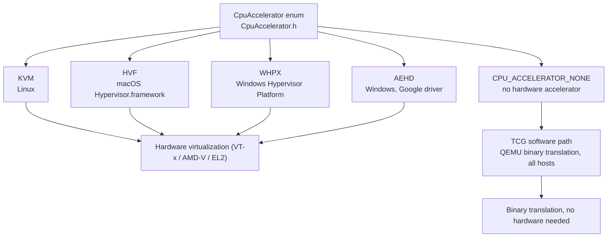
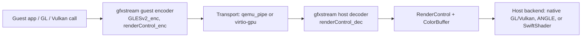
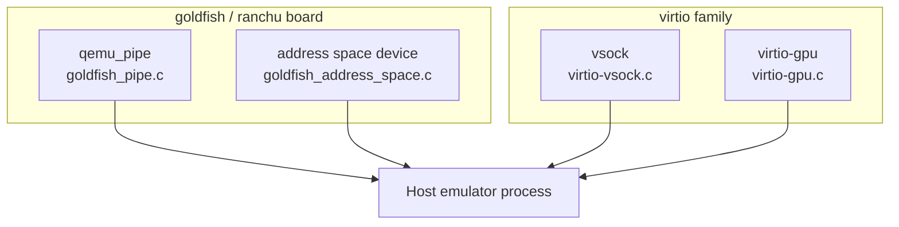
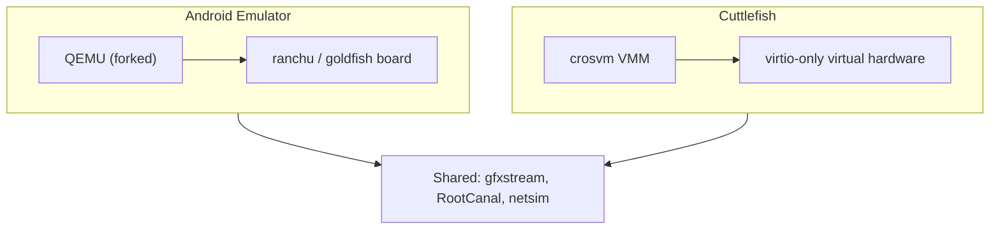

# Appendix B: Glossary

This appendix collects the recurring terminology of the Android Emulator codebase in one place. Each entry defines a term as it is actually used in this source tree, with a pointer to a representative file so you can trace the concept back to real code. The emulator carries decades of accreted naming — board names borrowed from QEMU machine types, device names inherited from a virtual SoC, accelerator acronyms that differ per host OS — and the same component is often referred to by two or three names depending on which layer of the stack you are reading. Where that happens, the entry notes the aliases.

Unlike the numbered chapters, this is a reference list rather than a narrative: entries are ordered alphabetically and can be read in any order. A handful of diagrams are included to show how the most-confused clusters of terms relate to each other (the accelerator backends, the graphics streaming path, the guest-to-host transports, and the Cuttlefish stack), since those relationships are exactly what the bare definitions tend to flatten.

---

## B.1 How the terms cluster

Before the alphabetical list, four diagrams group the terms that are easiest to confuse with one another. Read them as a map; the definitions that follow fill in the detail.

### CPU accelerator backends per host OS

### Graphics streaming path

### Guest-to-host transports

### Two virtual devices, two VMMs

---

## B.2 Alphabetical glossary

**AEHD** — Android Emulator Hypervisor Driver, a Google-maintained kernel-mode hypervisor driver for Windows that backs the `CPU_ACCELERATOR_AEHD` value of the `CpuAccelerator` enum in `external/qemu/android/emu/feature/include/android/emulation/CpuAccelerator.h`. It is one of two acceleration paths the emulator offers on Windows (the other is WHPX), and the command-line help in `external/qemu/android/emu/cmdline/src/android/help.c` notes that on Windows the emulator "relies on WHPX or AEHD." AEHD replaced the older, now-deprecated HAXM driver.

**Address space device** — A goldfish PCI device, implemented in `external/qemu/hw/pci/goldfish_address_space.c`, that lets the host hand the guest large regions of host memory by mapping them into the guest's physical address space. It is the high-throughput transport that gfxstream uses for buffers too large to copy through a pipe; service implementations register via `goldfish_address_space_set_service_ops`. The device deliberately enforces a singleton — creating a second one calls `qemu_abort("FATAL: Two address space devices created")`.

**ANGLE** — "Almost Native Graphics Layer Engine," vendored at `external/angle`, a translator that implements OpenGL ES on top of another graphics API. In the emulator it appears as the `swangle` GPU mode (SwiftShader-backed ANGLE), selected in `external/qemu/android/android-ui/modules/aemu-gl-init/src/android/opengl/emugl_config.cpp` where `swangle` maps to `SELECTED_RENDERER_ANGLE_INDIRECT`. It is the default GLES path on hosts without a usable native driver.

**AVD** — Android Virtual Device, the on-disk configuration that describes one emulated device: its system image, hardware profile, and writable state. The header `external/qemu/android/emu/avd/include/android/avd/info.h` opens by defining it as "An Android Virtual Device (AVD for short)," and the `AvdInfo` structure parsed there is what the launcher consults to decide which kernel, board, and images to boot.

**Color buffer** — A host-side handle for a rendered image (a texture or framebuffer) in gfxstream, implemented by the `ColorBuffer` class in `hardware/google/gfxstream/host/color_buffer.cpp`. Each color buffer is backed by either a GL texture (`color_buffer_gl.h`) or a Vulkan image (`color_buffer_vk.h`); the guest refers to color buffers by integer id, and the host composes and posts them to the display. The guest-side gralloc handle ultimately names one of these color buffers.

**crosvm** — The Chrome OS Virtual Machine Monitor, a Rust VMM. It is the hypervisor monitor used by Cuttlefish rather than by the QEMU-based Android Emulator; Cuttlefish selects and launches it through `device/google/cuttlefish/host/libs/vm_manager/crosvm_manager.h` and the `crosvm_binary()` accessor in `device/google/cuttlefish/host/libs/config/cuttlefish_config.cpp`. Unlike the emulator's forked QEMU, crosvm exposes only virtio devices.

**Cuttlefish** — Google's configurable virtual Android device, rooted at `device/google/cuttlefish`, designed to run in data centers and CI on top of crosvm. Its `device/google/cuttlefish/README.md` and the host commands under `device/google/cuttlefish/host/commands` (such as `run_cvd` and `assemble_cvd`) build and launch a device that, unlike the Android Emulator, has no built-in UI and is driven over the network. It shares gfxstream, RootCanal, and netsim with the emulator but uses a different VMM and virtual board.

**Device tree** — A flattened data structure (FDT) that describes the virtual hardware to the guest kernel at boot. The ranchu board builds one in `external/qemu/hw/arm/ranchu.c`, where `create_fdt` calls `create_device_tree` and the board comment states plainly: "We create a device tree to pass to the kernel." Device tree is how the ARM and MIPS boards advertise their virtio and goldfish devices to Linux, replacing the hard-coded board descriptions used on x86.

**gfxstream** — Graphics Streaming Kit (formerly "Vulkan Cereal"), the rendering stack at `hardware/google/gfxstream`. Its README describes it as "a collection of code generators and libraries for streaming rendering APIs from one place to another," specifically from a VM guest to the host. The guest side encodes GL/Vulkan/RenderControl calls (the `*_enc` directories under `hardware/google/gfxstream/guest`), and the host side decodes and replays them against a real driver (the `*_dec` directories under `hardware/google/gfxstream/host`).

**goldfish** — The original Android virtual hardware platform: a set of QEMU devices (timer, battery, pipe, framebuffer, and more) prefixed `goldfish_`, such as `external/qemu/hw/timer/goldfish_timer.c`. The kernel docs `external/qemu/android/docs/ANDROID-KERNEL.TXT` describe it as "the legacy virtual board" that supports obsolete goldfish-specific NAND and eMMC devices. Many goldfish devices (notably the pipe and address space device) survive into the modern ranchu board.

**gralloc** — The Android graphics memory allocator HAL. In the emulator the guest implementation lives under `hardware/google/gfxstream/guest/gralloc_cb`, where `gralloc_cb_bp.h` defines `cb_handle_t` (a `native_handle_t` carrying the magic `kCbHandleMagic`). A gralloc handle in the guest names a host color buffer, which is how a buffer allocated by an app is eventually composited by gfxstream on the host.

**Hypervisor.framework** — Apple's user-space hypervisor API on macOS, abbreviated HVF. The `CpuAccelerator.h` comment documents `CPU_ACCELERATOR_HVF` as "Apple's Hypervisor.framework," and it is the only hardware-accelerated CPU backend on macOS hosts.

**HVF** — The emulator's short name for the Hypervisor.framework CPU accelerator on macOS; see Hypervisor.framework. It corresponds to `CPU_ACCELERATOR_HVF` in `external/qemu/android/emu/feature/include/android/emulation/CpuAccelerator.h`.

**KVM** — Kernel-based Virtual Machine, the Linux hardware-virtualization accelerator. `CpuAccelerator.h` documents `CPU_ACCELERATOR_KVM` as Linux KVM, "which requires a specific driver to be installed and that `/dev/kvm` is properly accessible by the current user." It is the standard acceleration backend on Linux hosts and is what makes the emulator run guest code at near-native speed there.

**netsim** — A network simulation tool at `tools/netsim`, described in its README as "a network simulation tool for multi-device use cases" that offers "radio level control and HCI tracing." It simulates the radio layer (Wi-Fi, Bluetooth, UWB) shared between multiple virtual devices and embeds RootCanal for Bluetooth; the implementation under `tools/netsim` is primarily Rust.

**qemu_pipe** — The guest-visible name of the goldfish pipe, a fast shared-memory channel between guest and host. The device source `external/qemu/hw/misc/goldfish_pipe.c` says it is the "virtual pipe device (originally called goldfish_pipe and latterly qemu_pipe)" that "allows the android running under the emulator to open a fast connection to the host" for adb and OpenGL ES pass-through. New pipe services register through `goldfish_pipe_add_type()`.

**Quickboot** — The emulator feature that boots a device by restoring a previously saved snapshot instead of doing a cold boot, implemented in `external/qemu/android/android-emu/android/snapshot/Quickboot.cpp` (and `Quickboot.h`). Quickboot is the default-snapshot mechanism layered on top of the general snapshot system; it saves on exit and restores on the next launch so the device appears to resume rather than reboot.

**ramchu / ranchu** — "ranchu" (sometimes mistyped "ramchu") is the modern Android virtual board, defined for ARM in `external/qemu/hw/arm/ranchu.c` and MIPS in `external/qemu/hw/mips/mips_ranchu.c`. `ANDROID-KERNEL.TXT` calls it "the newest virtual board," and its source comment describes it as a board with "a mixture of virtio devices and some Android-specific devices inherited from the 32 bit goldfish board." It supersedes pure goldfish on the architectures that use a device tree.

**RenderControl** — The gfxstream control protocol used to manage rendering state that is not part of GL or Vulkan itself: creating contexts, allocating color buffers, posting frames, and querying capabilities. Its interface is generated from `hardware/google/gfxstream/codegen/renderControl/renderControl.in`, with the guest encoder under `hardware/google/gfxstream/guest/renderControl_enc` and the host decoder under `hardware/google/gfxstream/host/renderControl_dec`. RenderControl is the glue that lets the guest drive the host's color buffers.

**RootCanal** — A virtual Bluetooth controller at `tools/rootcanal`. Its README defines it as "a virtual Bluetooth Controller" whose accurate implementation of HCI commands and events is the focus, and notes that "RootCanal is natively integrated in the Cuttlefish and Goldfish emulators," with external hosts able to connect to HCI port 7300. It is also embedded inside netsim.

**SwiftShader** — Google's CPU-based (software) implementation of Vulkan and OpenGL ES, vendored as a prebuilt at `prebuilts/android-emulator-build/common/swiftshader`. It is the emulator's pure-software graphics fallback: `emugl_config.cpp` maps the `swiftshader` GPU mode to `SELECTED_RENDERER_SWIFTSHADER_INDIRECT`, and on hosts with no usable GPU driver the config code forces SwiftShader for the Vulkan path.

**Snapshot** — A complete saved copy of a running VM's state — RAM, device registers, and graphics state — that can be reloaded later. The snapshot subsystem lives at `external/qemu/android/android-emu/android/snapshot`, with `Snapshotter.cpp` orchestrating save/load and helpers like `RamLoader`, `Decompressor`, and `TextureSaver` handling the pieces. Quickboot is the most common consumer of snapshots.

**TCG** — Tiny Code Generator, QEMU's binary-translation engine, documented in `external/qemu/tcg/README` ("Tiny Code Generator - Fabrice Bellard") with the execution loop in `external/qemu/accel/tcg`. TCG translates guest instructions into host instructions in software and is QEMU's software execution path, used when no hardware accelerator (KVM, HVF, WHPX, AEHD) is available; in `CpuAccelerator` terms this corresponds to `CPU_ACCELERATOR_NONE`. It is correct everywhere but far slower than hardware virtualization.

**vsock** — Virtio sockets, a socket address family that carries datagram and stream traffic between guest and host over virtio, implemented in `external/qemu/hw/virtio/virtio-vsock.c` (with the vhost variant in `vhost-vsock.c`). It is the general-purpose guest-host channel on virtio-based boards and is used heavily by Cuttlefish, where host config under `device/google/cuttlefish/host/libs/config` wires up vsock ports.

**virtio** — The paravirtualized device standard QEMU and crosvm use for efficient virtual hardware. The emulator's virtio core is `external/qemu/hw/virtio/virtio.c`, with MMIO and PCI transports (`virtio-mmio.c`, `virtio-pci.c`) and device implementations such as balloon, RNG, and vsock alongside it. virtio devices are the bulk of the hardware on the ranchu board and essentially all of the hardware under crosvm/Cuttlefish.

**virtio-gpu** — The virtio GPU device, the standardized transport for graphics on modern virtual boards, implemented in `external/qemu/hw/display/virtio-gpu.c` with 3D support in `virtio-gpu-3d.c`. It is the alternative to the goldfish pipe for carrying gfxstream traffic; the gfxstream host integrates with it via headers like `hardware/google/gfxstream/host/virtgpu_gfxstream_protocol.h`.

**WHPX** — Windows Hypervisor Platform, Microsoft's user-space hypervisor API. `CpuAccelerator.h` documents `CPU_ACCELERATOR_WHPX` as "Windows Hypervisor Platform," and it is one of the two hardware accelerators offered on Windows (the other being AEHD), per the launcher help text in `external/qemu/android/emu/cmdline/src/android/help.c`.

**WebRTC bridge** — The component that marshals emulator audio/video to a browser over WebRTC, implemented by `WebRtcBridge` in `external/qemu/android/android-webrtc/android-webrtc/android/emulation/control/WebRtcBridge.cpp`. Its header explains it is "responsible for marshalling the message from the gRPC endpoint to the actual goldfish-webrtc-videobridge": it launches the video bridge process, starts the WebRTC module inside the emulator, and connects them, enabling remote streaming of the device screen.

### Key Source Files

| File | Term(s) it grounds |
|------|--------------------|
| external/qemu/android/emu/feature/include/android/emulation/CpuAccelerator.h | KVM, HVF, WHPX, AEHD, TCG fallback |
| external/qemu/android/emu/cmdline/src/android/help.c | WHPX, AEHD launcher behavior |
| external/qemu/hw/misc/goldfish_pipe.c | qemu_pipe, goldfish |
| external/qemu/hw/pci/goldfish_address_space.c | Address space device |
| external/qemu/hw/arm/ranchu.c | ranchu, goldfish, device tree, virtio |
| external/qemu/hw/virtio/virtio.c | virtio, vsock, virtio-gpu |
| external/qemu/android/android-emu/android/snapshot/Quickboot.cpp | Quickboot, snapshot |
| hardware/google/gfxstream/README.md | gfxstream |
| hardware/google/gfxstream/host/color_buffer.cpp | color buffer |
| hardware/google/gfxstream/guest/gralloc_cb/include/gralloc_cb_bp.h | gralloc |
| external/qemu/android/android-ui/modules/aemu-gl-init/src/android/opengl/emugl_config.cpp | ANGLE, SwiftShader, renderer modes |
| device/google/cuttlefish/host/libs/config/cuttlefish_config.cpp | crosvm, Cuttlefish |
| tools/rootcanal/README.md | RootCanal |
| tools/netsim/README.md | netsim |
| external/qemu/android/android-webrtc/android-webrtc/android/emulation/control/WebRtcBridge.cpp | WebRTC bridge |
