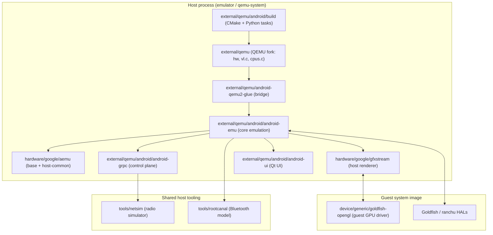

# Appendix B: Key Files Reference

This appendix is a map. The preceding chapters walked through the Android Emulator one subsystem at a time, citing the source as they went; this reference collects the single most important file or directory for each subsystem into tables you can scan when you are trying to find *where* something lives. Every path here is repo-relative and starts at a top-level project directory you can `cd` into from the emulator superproject root, and every entry was opened and confirmed against the real tree rather than reconstructed from memory.

The emulator is not one repository. It is a superproject that stitches together a heavily patched QEMU fork (`external/qemu/`), a set of standalone host libraries that QEMU links against (`hardware/google/aemu/`, `hardware/google/gfxstream/`), the guest-side drivers and HALs that ship inside the system image (`device/generic/`), a separate crosvm-based virtual device (`device/google/cuttlefish/`), and shared host tooling (`tools/`). The tables below follow that layering: build system first, then QEMU and its glue, then the `android-emu` core, the control plane, graphics, media, connectivity, UI, guest integration, Cuttlefish, and finally infrastructure. Within each table the rows run roughly from entry point to leaf.

---

## B.1 How to Read the Paths

Every path in this appendix is rooted at one of the superproject's top-level directories. Knowing which directory a file lives under already tells you a lot about what it is and which build produces it.

The five roots that matter for this book are these.

- `external/qemu/` is the QEMU fork. It contains both upstream QEMU (`hw/`, `vl.c`, `cpus.c`) and a large `android/` subtree of emulator-specific code that upstream QEMU has never seen. The `android-qemu2-glue/` directory bridges the two.
- `hardware/google/aemu/` and `hardware/google/gfxstream/` are standalone CMake/Bazel libraries. `aemu` is the base utility and host-common layer; `gfxstream` is the graphics streaming renderer. Both are vendored into AOSP and built independently as well as inside the emulator.
- `device/generic/` holds guest-side code that compiles into the Android system image: `goldfish-opengl` (the guest GPU driver stack) and `vulkan-cereal` (a guest mirror of the gfxstream encoder).
- `device/google/cuttlefish/` is the entire Cuttlefish virtual device — host launchers, guest HALs, and the orchestration that runs Android on crosvm rather than QEMU.
- `tools/` holds cross-cutting host tools, most importantly `netsim` (the radio simulator) and `rootcanal` (the Bluetooth controller model).

When a chapter cites `external/qemu/android/android-emu/android/console.cpp`, the `external/qemu/` prefix tells you it is part of the QEMU fork, the `android/android-emu/` tells you it is the core host emulation library, and the rest is the path within that library.

### B.1.1 The directory layering at a glance

The diagram below shows how the top-level source roots stack from the build system at the bottom up to the user-facing UI, with the guest image as a separate column that the host talks to over pipes and sockets.

#### Top-level source roots and how they layer

---

## B.2 Build System

The emulator is configured and built by a Python orchestration layer that drives CMake, which in turn drives Ninja and a set of toolchain files. The Python tasks live under `external/qemu/android/build/python/aemu/` and the CMake entry point is the top of the QEMU fork.

| File / Directory | Purpose |
|---|---|
| `external/qemu/CMakeLists.txt` | Top-level CMake project (`project(Android-Emulator)`); sets `ANDROID_EMULATOR_BUILD` and lists feature dependencies and prebuilt libraries to stage. |
| `external/qemu/android/build/python/aemu/tasks/build_task.py` | Base class `BuildTask` that every build step subclasses; its `run()` logs and dispatches to the concrete `do_run()`. |
| `external/qemu/android/build/python/aemu/tasks/configure.py` | The configure step; constructs the `cmake` command line, sets the toolchain file, and adds `hardware/google/gfxstream` as a source root. |
| `external/qemu/android/build/python/aemu/tasks/compile.py` | The compile step that invokes the generated Ninja build. |
| `external/qemu/android/build/python/aemu/tasks/distribution.py` | Packages the built tree into a distributable emulator archive. |
| `external/qemu/android/build/python/aemu/cmake.py` | Locates and wraps the prebuilt CMake binary used for configuration. |
| `external/qemu/android/build/cmake/android.cmake` | CMake module with the emulator's per-target helpers and platform settings. |
| `external/qemu/android/build/cmake/prebuilts.cmake` | Resolves the `prebuilts/android-emulator-build` dependencies into the build. |
| `external/qemu/android/rebuild.sh` | Convenience shell wrapper that invokes the Python build for the current host. |
| `hardware/google/aemu/CMakeLists.txt` | Standalone build entry for the `aemu` base + host-common libraries. |
| `hardware/google/gfxstream/CMakeLists.txt` | Standalone build entry for the gfxstream host renderer. |

---

## B.3 QEMU Fork and Glue

`external/qemu/` is a fork of QEMU, not a clean upstream checkout. The upstream machinery (`vl.c`, `cpus.c`, `hw/`) is still there, but a large `android/` subtree and an `android-qemu2-glue/` bridge layer have been bolted on. The glue is what lets QEMU call into the emulator's host services and what lets the emulator drive the QEMU machine.

| File / Directory | Purpose |
|---|---|
| `external/qemu/vl.c` | Upstream QEMU's machine and system bring-up; still the entry into the QEMU system loop after the emulator front end hands off. |
| `external/qemu/android-qemu2-glue/main.cpp` | The real `main()` for the QEMU-backed emulator; `run_qemu_main()` and `enter_qemu_main_loop()` spin up the QEMU thread after AVD setup. |
| `external/qemu/android-qemu2-glue/qemu-setup.cpp` | `qemu_android_emulation_setup()` wires the console agents into QEMU by calling `android_emulation_setup(getConsoleAgents(), true)`. |
| `external/qemu/android-qemu2-glue/qemu-vm-operations-impl.cpp` | Implements `QAndroidVmOperations` against the live QEMU VM (pause, resume, snapshot, reset). |
| `external/qemu/android-qemu2-glue/qemu-console-factory.cpp` | Builds the concrete console-agent vtable from the QEMU side. |
| `external/qemu/android-qemu2-glue/emulation/android_pipe_device.cpp` | Registers the goldfish pipe device with QEMU and routes pipe traffic to the host service registry. |
| `external/qemu/android-qemu2-glue/emulation/VmLock.cpp` | The QEMU-global-mutex `VmLock` that host threads acquire before touching VM state. |
| `external/qemu/android-qemu2-glue/emulation/virtio-gpu-gfxstream-renderer.cpp` | virtio-gpu device backend that forwards 3D commands to the gfxstream host renderer. |
| `external/qemu/hw/misc/goldfish_pipe.c` | The goldfish pipe MMIO device — the high-bandwidth host/guest transport used by graphics, sensors, and ADB. |
| `external/qemu/hw/misc/goldfish_sync.c` | Goldfish sync device for cross-domain fence synchronization. |
| `external/qemu/hw/misc/goldfish_battery.c` | Virtual battery device whose state the battery agent drives. |
| `external/qemu/hw/input/goldfish_events.c` | Goldfish input event device for touch, keys, and rotary. |
| `external/qemu/hw/display/goldfish_fb.c` | Legacy goldfish framebuffer device (pre-gfxstream display path). |
| `external/qemu/hw/pci/goldfish_address_space.c` | The address-space PCI device that backs shared host/guest memory regions. |
| `external/qemu/hw/display/virtio-gpu.c` | Upstream virtio-gpu device the gfxstream renderer plugs into. |

---

## B.4 android-emu Core

`external/qemu/android/android-emu/android/` is the heart of the host-side emulation: AVD handling, the goldfish pipe service registry, sensors, snapshots, the OpenGL ES bring-up, ADB, and the command-line front end. This is where most emulator-specific behaviour that is not strictly a QEMU device lives.

| File / Directory | Purpose |
|---|---|
| `external/qemu/android/android-emu/android/android.h` | Declares `AndroidConsoleAgents` and the `android_emulation_setup()` / `android_ports_setup()` entry points that bind the host services. |
| `external/qemu/android/android-emu/android/opengles.cpp` | `android_initOpenglesEmulation()` and `android_startOpenglesRenderer()` — the host-side bring-up of the gfxstream renderer. |
| `external/qemu/android/android-emu/android/hw-sensors.cpp` | The sensor port: maps the host `QAndroidSensorsAgent` onto the guest sensor HAL over a pipe. |
| `external/qemu/android/android-emu/android/main-common.c` | Shared command-line front-end logic used by the launcher before QEMU starts. |
| `external/qemu/android/android-emu/android/process_setup.cpp` | Early process initialization (crash handler, logging, environment) common to all entry points. |
| `hardware/google/aemu/host-common/include/host-common/AndroidPipe.h` | The `AndroidPipe` base interface for goldfish-pipe services; implemented in `hardware/google/aemu/host-common/AndroidPipe.cpp`. |
| `external/qemu/android/android-emu/android/emulation/AdbGuestPipe.cpp` | The guest end of the ADB-over-pipe transport. |
| `external/qemu/android/android-emu/android/emulation/AdbVsockPipe.cpp` | The vsock-based ADB transport used on newer images. |
| `external/qemu/android/android-emu/android/emulation/address_space_graphics.cpp` | Address-space device context that carries gfxstream's ring buffers. |
| `external/qemu/android/android-emu/android/emulation/MultiDisplay.cpp` | Host-side multi-display state and geometry. |
| `external/qemu/android/android-emu/android/snapshot/Quickboot.cpp` | Quickboot orchestration — save on exit, restore on next launch. |
| `external/qemu/android/android-emu/android/snapshot/RamLoader.cpp` | Lazy / incremental RAM restore for snapshots. |
| `external/qemu/android/android-emu/android/snapshot/Compressor.cpp` | Snapshot RAM compression. |
| `external/qemu/android/emu/avd/src/android/avd/info.c` | Parses the AVD config and hardware ini into the runtime AVD info. |
| `external/qemu/android/android-emu/android/console.cpp` | The legacy telnet console server; `ControlClientRec` tracks each connected client and dispatches commands. |
| `external/qemu/android/emu/feature/src/android/featurecontrol/FeatureControl.cpp` | Runtime feature flags that gate experimental subsystems. |
| `external/qemu/android/emulator/main-emulator.cpp` | The launcher binary: scans AVDs, picks the right backend, and re-execs the QEMU-backed emulator. |

---

## B.5 Control Plane: Console and gRPC

The emulator exposes two control surfaces: the legacy line-oriented telnet console and a modern gRPC API. The gRPC services live under `external/qemu/android/android-grpc/` with one subdirectory per service, each split into `server/`, `client/`, and a shared `.proto`.

| File / Directory | Purpose |
|---|---|
| `external/qemu/android/android-grpc/services/` | One subdirectory per gRPC service (emulator-controller, ui-controller, snapshot, bluetooth, gnss, waterfall, adb). |
| `external/qemu/android/android-grpc/services/emulator-controller/server/src/android/emulation/control/EmulatorService.cpp` | The main `EmulatorController` service implementation (screen streaming, input, sensors, VM control). |
| `external/qemu/android/android-grpc/services/ui-controller/server/src/android/emulation/control/UiController.cpp` | gRPC service for driving the host UI remotely. |
| `external/qemu/android/android-grpc/services/waterfall/server/src/android/emulation/control/waterfall/SocketController.cpp` | The waterfall transport used to tunnel ADB and other sockets over gRPC. |
| `external/qemu/android/android-grpc/python/aemu-grpc/src/aemu/proto/emulator_controller.proto` | The canonical EmulatorController protobuf / gRPC contract. |
| `external/qemu/android/android-grpc/python/aemu-grpc/src/aemu/proto/snapshot_service.proto` | Snapshot save/load/list RPCs. |
| `external/qemu/android/android-grpc/python/aemu-grpc/src/aemu/proto/rtc_service.proto` | WebRTC signalling RPCs for the embedded emulator. |
| `external/qemu/android/android-grpc/security/` | TLS and token-based auth for the gRPC endpoint. |
| `external/qemu/android/android-grpc/interceptors/` | Server interceptors (auth, metrics, logging). |
| `external/qemu/android/android-emu/android/console.cpp` | The telnet console server that predates gRPC and still backs `adb emu` commands. |

---

## B.6 Graphics: gfxstream and Guest Drivers

Graphics is the largest single subsystem. On the host, `hardware/google/gfxstream/host/` decodes the GL/Vulkan command stream and replays it against the real host GPU through a `FrameBuffer` and per-thread `RenderThread`. In the guest, `device/generic/goldfish-opengl/` encodes the application's GL/Vulkan calls into that stream.

| File / Directory | Purpose |
|---|---|
| `hardware/google/gfxstream/host/render_api.cpp` | The stable C entry points the emulator loads to initialize and drive the renderer. |
| `hardware/google/gfxstream/host/include/render-utils/RenderLib.h` | Public interface for creating a renderer instance and its windows. |
| `hardware/google/gfxstream/host/include/render-utils/Renderer.h` | The `Renderer` interface — create render channels, post frames, manage contexts. |
| `hardware/google/gfxstream/host/frame_buffer.cpp` | The central `FrameBuffer` that owns color buffers, contexts, and the on-screen post path. |
| `hardware/google/gfxstream/host/render_thread.h` | Declares the per-guest-connection `RenderThread` that decodes one command stream. |
| `hardware/google/gfxstream/host/color_buffer.cpp` | Host-side color buffer abstraction shared between GL and Vulkan backends. |
| `hardware/google/gfxstream/host/gl/` | The OpenGL ES host backend (dispatch tables, GL color buffers, GL compositor). |
| `hardware/google/gfxstream/host/hwc2.cpp` | Host implementation of HWComposer-2 surface composition. |
| `hardware/google/gfxstream/codegen/` | The `generic-apigen` code generator and per-API specs (gles1, gles2, renderControl) that produce the encoder/decoder. |
| `device/generic/goldfish-opengl/system/` | The guest GPU driver stack: GLES encoders, gralloc, and the HWC3 composer. |
| `device/generic/goldfish-opengl/system/hwc3/ComposerClient.cpp` | Guest HWComposer-3 client that hands frames to the host compositor. |
| `device/generic/goldfish-opengl/system/gralloc/gralloc_old.cpp` | Guest graphics buffer allocator that maps onto host color buffers. |
| `device/generic/vulkan-cereal/` | Guest-side Vulkan command serializer mirroring the gfxstream protocol. |

---

## B.7 Media: Camera, Audio, and Recording

Media support spans capture (camera, microphone), playback, and screen recording. The host camera service can bridge a real webcam, a fake animated scene, or a virtual scene rendered through gfxstream. Screen recording uses an FFmpeg-based pipeline.

| File / Directory | Purpose |
|---|---|
| `external/qemu/android/android-emu/android/camera/camera-service.cpp` | The host camera service that registers the camera pipe and routes frames to the guest HAL. |
| `external/qemu/android/android-emu/android/camera/camera-capture-linux.c` | V4L2 webcam capture backend on Linux (with `-mac.m` and `-windows.cpp` siblings). |
| `external/qemu/android/android-emu/android/camera/camera-virtualscene.cpp` | Renders a synthetic 3D scene as a camera feed via gfxstream. |
| `external/qemu/android/android-emu/android/camera/camera-format-converters.c` | Pixel-format conversion between host capture formats and guest-requested formats. |
| `external/qemu/android/android-emu/android/recording/` | Screen and audio recording pipeline (codecs, video producers, FFmpeg glue). |
| `external/qemu/android-qemu2-glue/audio-output.cpp` | Host audio output bridge from the guest audio HAL into the host sound system. |
| `external/qemu/android-qemu2-glue/audio-capturer.cpp` | Host microphone capture bridged to the guest. |
| `external/qemu/hw/audio/` | Upstream QEMU audio device models the guest audio HAL talks to. |

---

## B.8 Connectivity: Networking, Bluetooth, and Telephony

Connectivity covers the guest's network stack, its radios (Wi-Fi, Bluetooth, cellular), and GPS. The emulator increasingly delegates radio behaviour to two standalone tools: `netsim` for Wi-Fi/UWB and `rootcanal` for Bluetooth.

| File / Directory | Purpose |
|---|---|
| `external/qemu/android/android-emu/android/network/control.cpp` | Network control surface (speed/latency shaping, DNS) for the emulated NIC. |
| `external/qemu/android/android-emu/android/network/wifi.cpp` | Host-side Wi-Fi emulation entry. |
| `external/qemu/android-qemu2-glue/emulation/VirtioWifiForwarder.cpp` | Forwards virtio-wifi frames between the guest and the host / netsim. |
| `external/qemu/android-qemu2-glue/net-android.cpp` | Bridges QEMU's net backends to the emulator's network control. |
| `tools/netsim/rust/daemon/src/lib.rs` | The netsim daemon — the radio backplane that simulates Wi-Fi, BLE, and UWB across devices. |
| `tools/netsim/rust/cli/bin/netsim.rs` | The `netsim` command-line client binary. |
| `tools/netsim/proto/` | The netsim gRPC / protobuf contracts shared by daemon and clients. |
| `external/qemu/android/bluetooth/nimble_bridge/` | Bridges the guest Bluetooth stack to the host. |
| `tools/rootcanal/model/controller/` | The rootcanal virtual Bluetooth controller (link layer and HCI state machine). |
| `tools/rootcanal/model/hci/` | HCI packet handling inside the rootcanal model. |
| `external/qemu/android-qemu2-glue/telephony/modem_init.c` | Initializes the modem emulation and binds it to the cellular agent. |
| `external/qemu/android/emu/telephony/src/android/telephony/modem.c` | The AT-command modem model that drives the guest RIL. |
| `external/qemu/android/emu/location/` | GPS/GNSS location injection plumbed to the guest location HAL. |

---

## B.9 UI and Streaming

The host UI is a Qt application split into reusable modules under `external/qemu/android/android-ui/modules/`. The same emulator can also run headless and stream its display over WebRTC for the embedded (Android Studio / web) experience.

| File / Directory | Purpose |
|---|---|
| `external/qemu/android/android-ui/modules/aemu-ui-qt/` | The Qt UI implementation: main window, toolbar, and dialogs. |
| `external/qemu/android/android-ui/modules/aemu-ui-window/` | The emulator window abstraction (skin, scaling, frame posting target). |
| `external/qemu/android/android-ui/modules/aemu-ui-headless/` | Headless UI backend used when no window is requested. |
| `external/qemu/android/android-ui/modules/aemu-gl-bridge/` | Bridges the host GL surface into the Qt window for on-screen posting. |
| `external/qemu/android/android-ui/modules/aemu-ext-pages/` | The extended-controls pages (location, sensors, battery, cellular). |
| `external/qemu/android/android-ui/modules/aemu-ext-pages-grpc/` | The gRPC-backed variants of the extended-controls pages. |
| `external/qemu/android/android-webrtc/videobridge/` | The video bridge that encodes frames and feeds the WebRTC pipeline. |
| `external/qemu/android/android-webrtc/android-webrtc/` | The WebRTC peer-connection and signalling glue for streaming the display. |
| `external/qemu/android/android-grpc/python/aemu-grpc/src/aemu/proto/rtc_service.proto` | The signalling contract clients use to negotiate the WebRTC stream. |

---

## B.10 Guest Integration

A handful of host files exist purely to set up the guest environment: kernel command line, boot config, ramdisk hardware properties, and the goldfish/ranchu hardware contract. These determine what the guest sees at boot.

| File / Directory | Purpose |
|---|---|
| `external/qemu/android/android-emu/android/kernel/kernel_utils.cpp` | Inspects the kernel image and decides the kernel command line and ABI quirks. |
| `external/qemu/android/android-emu/android/main-kernel-parameters.cpp` | Builds the full kernel command line passed to the guest. |
| `external/qemu/android/android-emu/android/bootconfig.cpp` | Assembles the Android `bootconfig` blob appended to the ramdisk for newer images. |
| `external/qemu/android-qemu2-glue/dtb.cpp` | Generates the device tree blob describing the virtual hardware to the guest. |
| `external/qemu/android/android-emu/android/avd/hw-config.h` | The hardware-config schema (defines every `hw.*` AVD property the guest depends on). |
| `external/qemu/android/android-emu/android/emulation/QemuMiscPipe.cpp` | The misc pipe that carries boot-time handshakes and time sync with the guest. |
| `device/generic/goldfish-opengl/system/` | The guest-side GPU driver that the system image loads at boot (see B.6). |

---

## B.11 Cuttlefish

Cuttlefish is a separate virtual device under `device/google/cuttlefish/`. Instead of QEMU it runs Android on crosvm, orchestrated by a family of host launcher binaries. `assemble_cvd` prepares disks and configs, `run_cvd` starts the per-instance processes, and `secure_env` provides the trusted-execution backends.

| File / Directory | Purpose |
|---|---|
| `device/google/cuttlefish/host/commands/assemble_cvd/assemble_cvd.cc` | Prepares disk images, composite partitions, and the runtime config before launch. |
| `device/google/cuttlefish/host/commands/assemble_cvd/flags.cc` | Parses the large launch flag set into the assembled configuration. |
| `device/google/cuttlefish/host/commands/assemble_cvd/disk_flags.cc` | Builds the composite / overlay disk layout for the instance. |
| `device/google/cuttlefish/host/commands/run_cvd/main.cc` | The per-instance supervisor that launches and monitors crosvm and the helper processes. |
| `device/google/cuttlefish/host/commands/run_cvd/boot_state_machine.cc` | Tracks boot progress and drives the instance through its boot states. |
| `device/google/cuttlefish/host/commands/run_cvd/launch/` | The individual launchers for each helper process (logging, modem, webrtc, etc.). |
| `device/google/cuttlefish/host/commands/secure_env/in_process_tpm.cpp` | The in-process software TPM backing keymint / gatekeeper. |
| `device/google/cuttlefish/host/commands/secure_env/gatekeeper_responder.cpp` | Handles gatekeeper (lock-screen credential) requests from the guest. |
| `device/google/cuttlefish/host/commands/modem_simulator/` | The Cuttlefish AT-command modem simulator (its analogue to the QEMU modem). |
| `device/google/cuttlefish/host/frontend/` | The WebRTC frontend and operator that stream the Cuttlefish display to a browser. |
| `device/google/cuttlefish/guest/` | The Cuttlefish-specific guest HALs and init pieces baked into the image. |

---

## B.12 Shared Host Libraries

Both the QEMU emulator and gfxstream depend on `hardware/google/aemu/`. Its `base/` directory is the portable utility layer (strings, files, threads, sockets) and `host-common/` holds the cross-component contracts — feature control, the `AndroidPipe` base, logging, and the graphics-agent factory.

| File / Directory | Purpose |
|---|---|
| `hardware/google/aemu/base/` | The portable base library: `PathUtils`, `System`, threads, sockets, streams, and containers. |
| `hardware/google/aemu/base/PathUtils.cpp` | Cross-platform path manipulation used everywhere. |
| `hardware/google/aemu/base/MessageChannel.cpp` | The bounded thread-safe channel used for producer / consumer hand-offs. |
| `hardware/google/aemu/base/HealthMonitor.cpp` | Watchdog that detects hung host threads (notably render threads). |
| `hardware/google/aemu/host-common/AndroidPipe.cpp` | The base `AndroidPipe` implementation that the goldfish pipe service registry uses. |
| `hardware/google/aemu/host-common/feature_control.cpp` | The C feature-flag store backing the host / guest feature lists. |
| `hardware/google/aemu/host-common/GraphicsAgentFactory.cpp` | Supplies the graphics agents the renderer needs from the host. |
| `hardware/google/aemu/host-common/logging.cpp` | Shared logging used by both emulator and gfxstream. |
| `hardware/google/aemu/host-common/include/host-common/FeatureControlDefHost.h` | The canonical list of host feature flags. |

---

## B.13 Infrastructure: Testing and Debugging

Tests live next to the code they exercise: any file named `*_unittest.cpp` is a host unit test built into the same CMake target tree. Cross-cutting test, tracing, and crash-reporting machinery lives in dedicated subdirectories.

| File / Directory | Purpose |
|---|---|
| `external/qemu/android/android-emu/android/console_unittest.cpp` | Representative of the in-tree `*_unittest.cpp` pattern; unit tests sit beside their subject. |
| `external/qemu/android/build/python/aemu/tasks/unit_tests.py` | The build task that runs the host unit-test suite. |
| `external/qemu/android/build/python/aemu/tasks/integration_tests.py` | The build task that runs end-to-end integration tests. |
| `external/qemu/android/emu/tracing/` | Host-side tracing instrumentation. |
| `external/qemu/android/emu/crashreport/` | Crash handler and minidump collection wired up in `process_setup.cpp`. |
| `external/qemu/android/emu/metrics/` | Usage and performance metrics reporting. |
| `external/qemu/android/android-emu/android/emulation/AdbMessageSniffer.cpp` | Decodes ADB traffic for debugging the transport. |
| `device/google/cuttlefish/host/commands/kernel_log_monitor/` | Watches the Cuttlefish guest kernel log for boot milestones during debugging. |

---

## B.14 Quick Index by Question

The table below maps the kinds of questions readers ask to the first file to open. It is a starting point, not the whole answer — but every path resolves to a real file that the relevant chapter discusses in depth.

| If you are asking… | Start here |
|---|---|
| Where does the emulator process start? | `external/qemu/android/emulator/main-emulator.cpp`, then `external/qemu/android-qemu2-glue/main.cpp` |
| How are host services exposed to QEMU? | `external/qemu/android/android-emu/android/android.h` and `external/qemu/android-qemu2-glue/qemu-setup.cpp` |
| How does host/guest high-bandwidth I/O work? | `external/qemu/hw/misc/goldfish_pipe.c` and `hardware/google/aemu/host-common/include/host-common/AndroidPipe.h` |
| How is the screen rendered? | `hardware/google/gfxstream/host/frame_buffer.cpp` and `hardware/google/gfxstream/host/render_api.cpp` |
| How does the guest encode GL/Vulkan? | `device/generic/goldfish-opengl/system/` |
| How do snapshots and Quickboot work? | `external/qemu/android/android-emu/android/snapshot/Quickboot.cpp` |
| How does the gRPC control API work? | `external/qemu/android/android-grpc/services/emulator-controller/server/src/android/emulation/control/EmulatorService.cpp` |
| How are radios simulated? | `tools/netsim/rust/daemon/src/lib.rs` and `tools/rootcanal/model/controller/` |
| How does Cuttlefish launch? | `device/google/cuttlefish/host/commands/assemble_cvd/assemble_cvd.cc` then `device/google/cuttlefish/host/commands/run_cvd/main.cc` |
| Where is the build orchestrated? | `external/qemu/android/build/python/aemu/tasks/configure.py` and `external/qemu/CMakeLists.txt` |
