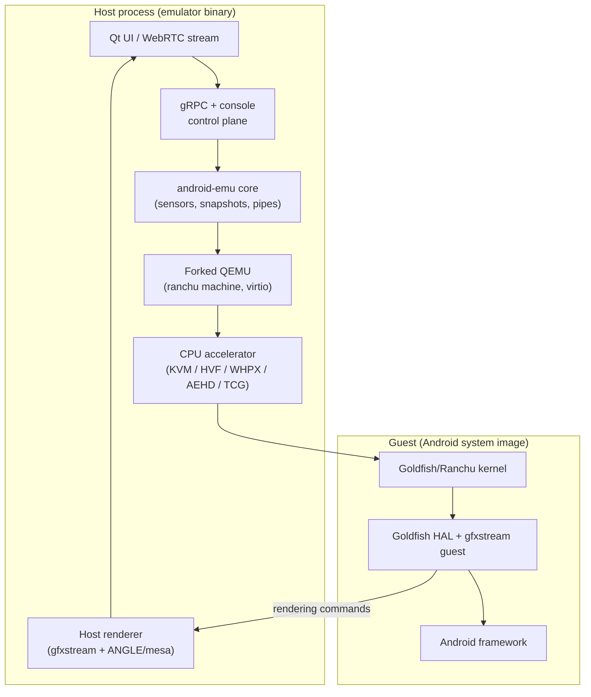

--8<-- "README.md:coverage"

## License

This book is licensed under the [Apache License 2.0](https://www.apache.org/licenses/LICENSE-2.0), matching the license of the Android Emulator and the [Android Open Source Project](https://source.android.com/) it analyzes. See the [LICENSE](https://github.com/aospbooks/android-emulator-internal-book/blob/main/LICENSE) file for details.

## How to Navigate

Use the sidebar to browse chapters organized bottom-to-top through the emulator stack — from the virtual machine that runs the guest, up through the host renderer and the user interfaces. Each chapter is self-contained but builds on previous ones.

## Architecture Overview

The Android Emulator is a host program that runs an unmodified Android system image inside a virtual machine. A forked QEMU provides the CPU and device model; the `android-emu` layer adds the Android-specific machine, sensors, snapshots, and a control plane; graphics commands are streamed from the guest to a host renderer; and a Qt window or a WebRTC stream presents the result.

## Support This Project

If this book has helped you understand the Android Emulator, please consider showing your support:

- Star the [repository](https://github.com/aospbooks/android-emulator-internal-book) on GitHub so other developers can find it.
- Report errors or suggest improvements via the [issue tracker](https://github.com/aospbooks/android-emulator-internal-book/issues).
- Share the book with colleagues and communities working on Android virtualization and tooling.

Stars and feedback are the main signal that the work is useful, and they motivate continued writing and review.
